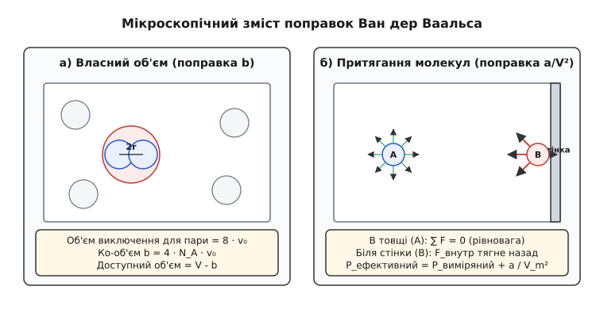
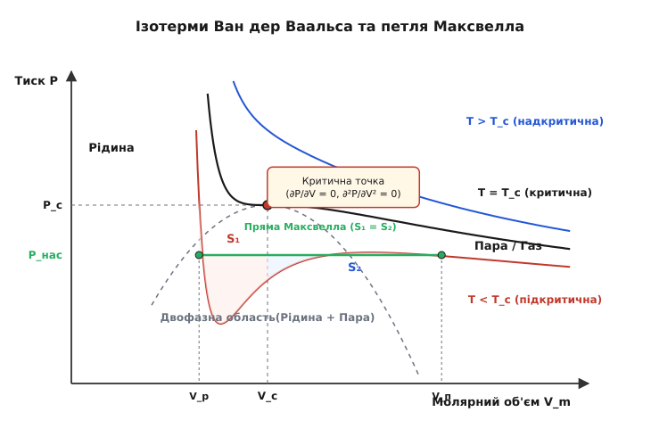

# Рівняння Ван дер Ваальса для реальних газів

<preknowlist>
- [Рівняння стану ідеального газу](book:physics/ideal-gas-law) — фундаментальний зв'язок тиску, об'єму та температури для моделі невзаємодіючих точкових частинок.
- [Теплоємність](book:physics/heat-capacity) — термодинамічна характеристика поглинання теплоти під час змінення температури системи.
- [Закон збереження енергії](book:physics/energy-conservation) — перше початок термодинаміки та баланс між роботою, теплотою і внутрішньою енергією.
</preknowlist>

Коли чистий вуглекислий газ `CO₂` за температури 20 °C стискають у прозорому скляному циліндрі високого тиску від 1 бар до 60 бар, його об'єм зменшується не у 60 разів, як передбачає класичне рівняння Менделєєва-Клапейрона, а значно швидше, і за тиску близько 57.3 бар всередині судини раптово з'являється чітка межа розділу фаз та утворюється безбарвна важка рідина. Класична модель ідеального газу за цих умов зазнає повного краху: вона не здатна пояснити ані відхилення стискальності, ані сам факт фазового переходу газу в рідину. Щоб збагнути фізику реальних газів, необхідно відмовитися від уявлення про молекули як нескінченно малі математичні точки й урахувати два фундаментальні мікроскопічні фактори: скінченний власний об'єм молекул та міжмолекулярні сили притягання.

Рівняння Ван дер Ваальса є першою і найбільш успішною феноменологічною теорією, яка об'єднала газоподібний і рідкий стани речовини у єдину термодинамічну концепцію неперервності станів.

---

## 1. Обмеження моделі ідеального газу та феноменологія реальних систем

Модель ідеального газу спирається на дві фундаментальні спрощувальні гіпотези:

1. **Відсутність власного об'єму частинок**: об'єм окремої молекули вважається строго нульовим (`v_0 = 0`), тому увесь Geometric об'єм судини `V` вважається повністю доступним для вільного хаотичного руху.
2. **Відсутність міжмолекулярної взаємодії**: молекули взаємодіють між собою виключно під час миттєвих пружних зіткнень. Потенціальна енергія міжмолекулярного притягання на відстані вважається рівною нулю (`U(r) = 0`).

Для розріджених газів за високих температур і низьких тисків (наприклад, для атмосферного повітря за кімнатної температури й тиску 1 атм) ці гіпотези справджуються з точністю до часток відсотка. Середня відстань між молекулами за цих умов у 10–15 разів перевищує їхні власні розміри, а середня кінетична енергія теплового руху `k_B · T` значно перевищує глибину потенціальної ями міжмолекулярного притягання.

Однак при підвищенні тиску (зменшенні об'єму) або зниженні температури середня відстань між молекулами стрімко скорочується. Мірою відхилення поведінки реального газу від ідеального стану є **коефіцієнт (фактор) стискальності `Z`**:

```
Z = (P · V_m) / (R · T)
```

де `V_m = V / n` — молярний об'єм газу (м³/моль), `R = 8.31446` Дж/(моль·К) — універсальна газова стала.

```
Для ідеального газу:      Z ≡ 1.0  (за будь-яких P і T)
Для реального газу:       Z = Z(P, T) ≠ 1.0
```

Експериментальні дослідження показують характерний двофазний характер відхилень `Z` від одиниці:

- **Область помірних тисків (`Z < 1`)**: міжмолекулярне притягання превалює. Молекули притягуються одна до одної, що зменшує фактичний тиск газу на стінки судини порівняно з ідеальним газом. Газ стискається *легше*, ніж ідеальний.
- **Область високих тисків (`Z > 1`)**: власні розміри молекул стають порівнянними з об'ємом судини. Сили міжмолекулярного відштовхування електронних оболонок на малих відстанях роблять речовину малостискуваною. Газ стискається *важче*, ніж ідеальний.

У 1869 році північноірландський фізик Томас Ендрюс під час вивчення ізотерм стискання `CO₂` відкрив існування **критичної температури `T_c`**. За температур `T > T_c` речовина за будь-якого підвищення тиску залишається в однофазному стані (надкритичний флюїд). За температур `T < T_c` на ізотермах з'являється горизонтальна площадка фазового переходу — процес ізобарично-ізотермічної конденсації газу в рідину.

### 1.1. Фізична природа міжмолекулярного потенціалу Леннард-Джонса

Мікроскопічний механізм відхилення реальних газів визначається парним потенціалом взаємодії молекул `U(r)`. У найпростішій феноменологічній формі це потенціал Леннард-Джонса:

```
U(r) = 4 · ε · [ (σ / r)¹² - (σ / r)⁶ ]
```

де `r` — відстань між центрами молекул, `σ` — ефективний діаметр твердої серцевини молекули, `ε` — глибина потенціальної ями.

- Член `(σ / r)¹²` описує квантово-механічне відштовхування перекритих електронних оболонок на малих відстанях (`r < σ`).
- Член `(σ / r)⁶` описує довгосяжні дисперсійні сили притягання Лондонського типу, що виникають внаслідок взаємної поляризації мгновенних дипольних моментів електронних хмар (`r > σ`).

Модель Ван дер Ваальса прямо апроксимує цей реальний потенціал спрощеною точковою функцією: тверда непроникна сфера діаметра `σ` (поправка `b`) та притягальне серединне поле далекого радіуса (поправка `a`).

---

## 2. Мікроскопічний вивід поправок Ван дер Ваальса

У 1873 році нідерландський фізик Йоганнес Дідерик Ван дер Ваальс запропонував модифікувати рівняння ідеального газу шляхом введення двох феноменологічних поправок, які враховують відштовхування й притягання молекул.


*_Мікроскопічний механізм поправок Ван дер Ваальса: а) ко-об'єм b як об'єм виключення для твердих сфер; б) внутрішній тиск a/V² внаслідок несбалансованого притягання приповерхневих молекул._*

### 2.1. Поправка на власний об'єм молекул (ко-об'єм b)

Уявимо молекули як тверді пружні сфери радіуса `r`. Коли дві такі молекули зближуються до безпосереднього контакту, відстань між їхніми центрами не може стати меншою за `2r`. Це означає, що навколо кожної молекули існує сфера забороненого об'єму (об'єм виключення) радіуса `2r`:

```
V_excl,pair = (4 / 3) · π · (2r)³ = 8 · ((4 / 3) · π · r³) = 8 · v_0
```

де `v_0 = (4 / 3) · π · r³` — власний геометричний об'єм однієї молекули.

Оскільки ця сфера заборонена для двох молекул одночасно, на одну молекулу припадає половина цього об'єму виключення:

```
v_excl,1 = (1 / 2) · 8 · v_0 = 4 · v_0
```

Для одного моля речовини, що містить число Авогадро `N_A = 6.022 × 10²³` молекул, сумарний виключений об'єм (позначуваний як **поправка `b`** або **ко-об'єм**) становить:

```
b = 4 · N_A · v_0 = 4 · N_A · ((4 / 3) · π · r³)
```

Отже, реальний об'єм, доступний для вільного хаотичного руху молекул у судині молярного об'єму `V_m`, є меншим за Geometric об'єм судини на величину ко-об'єму `b`:

```
V_free = V_m - b
```

### 2.2. Поправка на міжмолекулярне притягання (внутрішній тиск P_int)

Розглянемо дві молекули газу: одну у товщі об'єму (молекула `A`), а другу біля самої стінки судини (молекула `B`).

- **Молекула `A` у товщі**: з усіх боків оточена іншими молекулами симетрично. Середня сумарна сила міжмолекулярного притягання, що діє на неї з боку оточення, дорівнює нулю (`∑ F = 0`).
- **Молекула `B` біля стінки**: з боку стінки судини молекули газу відсутні (або їхня густина зникаюче мала). У результаті виникає результуюча сила міжмолекулярного притягання, спрямована **всередину об'єму газу**. Ця сила гальмує молекулу перед її вдарянням об стінку, зменшуючи імпульс, який передається стінці за час зіткнення.

Внаслідок цього гальмування фактичний виміряний манометричний тиск `P` на стінку є меншим за кінетичний тиск `P_kin`, який газ чинив би за відсутності сил притягання:

```
P = P_kin - P_int   ⇒   P_kin = P + P_int
```

Зменшення тиску (внутрішній тиск `P_int`) прямо пропорційне двом факторам:
1. Кількості молекул у приповерхневому шарі, які зазнають гальмування (пропорційна концентрації `n / V = 1 / V_m`).
2. Кількості молекул у внутрішній товщі, які здійснюють притягання (також пропорційна концентрації `1 / V_m`).

Отже, внутрішній тиск є пропорційним квадрату густини (або обернено пропорційним квадрату молярного об'єму):

```
P_int = a / V_m²
```

де `a` — константа притягання Ван дер Ваальса (Па·м⁶/моль²), що характеризує інтенсивність ван-дер-ваальсових сил між молекулами даного газу.

### 2.3. Вивід із статистичної суми канонічного ансамблю

У статистичній фізиці рівняння Ван дер Ваальса може бути виведене строго із канонічної статистичної суми `Z_N`. Конфігураційний інтеграл `Q_N` для системи з `N` взаємодіючих частинок записаний як:

```
Q_N = ∫ ... ∫ exp( - U(r_1, ..., r_N) / (k_B · T) ) d³r_1 ... d³r_N
```

Застосувавши наближення середнього поля та розбивши потенціал на тверді серцевини і середнє притягальне поле `U_att = - (N / V) · a`:

```
Q_N ≈ (V - N · v_excl)ⁿ · exp( (N² · a) / (V · k_B · T) )
```

Обчисливши вільну енергію Гельмгольца `F = - k_B · T · ln(Z_N)` та взявши похідну за об'ємом `P = - (∂F / ∂V)_T`, ми отримуємо строго рівняння Ван дер Ваальса.

---

## 3. Кубічна структура рівняння та графічний аналіз ізотерм

Щоб дослідити фізичні властивості розв'язків рівняння Ван дер Ваальса, зведемо його до поліноміального вигляду відносно молярного об'єму `V_m`.

Перемноживши дужки для молярного рівняння:

```
(P + a / V_m²) · (V_m - b) = R · T
P · V_m - P · b + a / V_m - a · b / V_m² = R · T
```

Помножимо обидві частини на `V_m²` і згрупуємо члени за степенями `V_m`:

```
P · V_m³ - (P · b + R · T) · V_m² + a · V_m - a · b = 0
```

Поділивши на тиск `P`, отримуємо канонічну форму:

```
V_m³ - (b + R · T / P) · V_m² + (a / P) · V_m - (a · b / P) = 0
```

Це рівняння є **кубічним відносно молярного об'єму `V_m`**. Згідно з теоремами алгебри, для будь-яких фіксованих значень тиску `P` і температури `T` це рівняння має або один дійсний корінь і два комплексні, або три дійсні корені.


*_Семейство ізотерм Ван дер Ваальса на P-V діаграмі: синя крива — надкритична ізотерма (T > Tc); чорна — критична ізотерма (T = Tc) з точкою перегину; червона — підкритична ізотерма (T < Tc) з нефізичною хвилею та горизонтальною прямою фазової рівноваги Максвелла (S1 = S2)._*

Графічний аналіз задовольняє три принципово різні фізичні режими залежно від температури `T`:

### 3.1. Надкритичний режим (`T > T_c`)
Для будь-якого тиску кубічне рівняння має лише **один дійсний корінь**. Ізотерма є монотонно спадною кривою (`(∂P/∂V)_T < 0`). Збільшення тиску приводить до безперервної ущільнюваності речовини без жодного фазового розшарування. Система перебуває у стані **надкритичного флюїду**.

### 3.2. Критичний режим (`T = T_c`)
Ізотерма торкається межі фазового розшарування у єдиній точці — **критичній точці `(V_c, P_c)`**. У цій точці три дійсні корені кубічного рівняння зливаються в один кратна корінь `V_m = V_c`. Математично це означає, що критична точка є точкою перегину з горизонтальною дотичною:

```
(∂P / ∂V)_T = 0
(∂²P / ∂V²)_T = 0
```

### 3.3. Підкритичний режим (`T < T_c`)
У певному інтервалі тисків рівняння має **три дійсні корені**: `V_1 < V_2 < V_3`.
- `V_1` (найменший корінь) відповідає молярному об'єму конденсованої рідкої фази.
- `V_3` (найбільший корінь) відповідає молярному об'єму насиченої газової фази (пари).
- `V_2` (середній корінь) лежить на ділянці `wave`-петлі, де `(∂P/∂V)_T > 0`.

Ділянка ізотерми з `(∂P/∂V)_T > 0` є **абсолютно механічно нестійкою**. На цій ділянці випадкове збільшення об'єму викликає збільшення тиску, що приводить до подальшого неконтрольованого розширення. Систем з позитивною стискальністю у природі в рівноважному стані не існує; на цій ділянці відбувається спонтанний **спінодальний розпад** однофазного середовища на рідку та газоподібну фази.

---

## 4. Фазова рівновага та правило рівних площ Максвелла

Оскільки нефізичний хвилеподібний сегмент Ван дер Ваальса з `(∂P/∂V)_T > 0` не може реалізуватися у рівноважній термодинаміці, дійсний фазовий перехід відбувається за постійного тиску насиченої пари `P_sat(T)` уздовж горизонтальної ізобари (ті-лінії).

Умовою термодинамічної рівноваги двох співіснуючих фаз (рідкої `l` та газової `g`) є рівність їхніх температур, тисків та **хімічних потенціалів**:

```
T_l = T_g = T
P_l = P_g = P_sat
μ_l(P_sat, T) = μ_g(P_sat, T)
```

Зв'язок між зміною хімічного потенціалу та молярним об'ємом вздовж ізотерми визначається співвідношенням `dμ = V_m · dP`. Інтегруючи це співвідношення від стану насиченої рідини `V_l` до стану насиченої пари `V_g`:

```
μ_g - μ_l = ∫_{P_sat}^{P_sat} V_m dP = 0
```

Геометрично цей інтеграл означає, що горизонтальна лінія фазової рівноваги `P = P_sat` повинна відсікати від нефізичної петлі Ван дер Ваальса два сегменти **однакової площі**:

```
S₁ = S₂
```

де `S₁` — площа верхівки петлі над лінією `P_sat`, `S₂` — площа западини під лінією `P_sat`.

Цей результат називається **правилом рівних площ Максвелла** (або конструкцією Максвелла).

Завдяки побудові Максвелла підкритична ізотерма розпадається на п'ять ділянок:
1. **Стабільна рідина** (`V < V_l`): монотонне зростання тиску, речовина перебуває у однофазному рідкому стані.
2. **Метастабільна перегріта рідина** (від `V_l` до точки мінімуму ізотерми): `(∂P/∂V)_T < 0`, рідина може існувати деякий час без кипіння за відсутності центрів пароутворення.
3. **Нестійка спінодальна область** (між мінімумом і максимумом ізотерми): `(∂P/∂V)_T > 0`, система миттєво розпадається на дві фази.
4. **Метастабільна переохолоджена пара** (від точки максимуму ізотерми до `V_g`): пара може існувати без конденсації за відсутності центрів конденсації (пилу, іонів).
5. **Стабільна пара / газ** (`V > V_g`): однофазна газова середа.

Детальніше про історію відкриття та гострі наукові дискусії навколо неперервності станів читайте у вставці 📜 [Історія відкриття рівняння Ван дер Ваальса та концепції неперервності станів](book:physics/thermodynamics/van-der-waals-equation/hist-van-der-waals.md).

Повний алгебраїчний та термодинамічний вивід інтеграла Максвелла наведено у вставці 🧮 [Математичний вивід критичних параметрів та ізотерм Максвелла](book:physics/thermodynamics/van-der-waals-equation/math-critical-point.md).

---

## 5. Внутрішня енергія та термодинаміка процесів газів Ван дер Ваальса

На відміну від ідеального газу, внутрішня енергія `U` газу Ван дер Ваальса залежить не лише від температури `T`, але й від молярного об'єму `V_m`. Це випливає безпосередньо з другого початку термодинаміки:

```
(∂U / ∂V)_T = T · (∂P / ∂T)_V - P
```

Підставивши тиск з рівняння Ван дер Ваальса `P = (R · T) / (V_m - b) - a / V_m²`:

```
(∂P / ∂T)_V = R / (V_m - b)
(∂U / ∂V)_T = T · (R / (V_m - b)) - [ (R · T) / (V_m - b) - a / V_m² ] = a / V_m²
```

Отже, похідна внутрішньої енергії за об'ємом є строго позитивною величиною і дорівнює внутрішньому тиску `a / V_m²`. Інтегрування дає вираз для молярної внутрішньої енергії газу Ван дер Ваальса:

```
U_m(T, V_m) = C_v · T - a / V_m + U_0
```

де `C_v` — молярна теплоємність за постійного об'єму, `U_0` — довільна константа відліку.

Цей результат має фундаментальні фізичні наслідки:

1. **Розширення в порожнечу (дослід Джоуля)**: під час адіабатичного розширення газу у вакуум (`Q = 0`, `W = 0`) внутрішня енергія залишається незмінною (`ΔU = 0`). Оскільки молекули розсуваються на більшу відстань против сил притягання, потенціальна енергія взаємодії зростає, а кінетична енергія теплового руху спадає. У результаті **газ Ван дер Ваальса під час розширення у вакуум завжди охолоджується**:
   ```
   ΔT = - (a / C_v) · (1 / V_m1 - 1 / V_m2) < 0
   ```
2. **Ефект Джоуля-Томсона (ізоентальпійне розширення)**: дроселювання газу крізь пористу перегородку відбувається за постійної ентальпії (`H = U + P · V = const`). Зміна температури визначається дифференціальним коефіцієнтом Джоуля-Томсона `μ_JT = (∂T/∂P)_H`:
   ```
   μ_JT = (1 / C_p) · [ (2a / (R · T)) - b ]
   ```
   Звідси виникає поняття **температури інверсії `T_inv = 2a / (R · b)`**:
   - При `T < T_inv`: `μ_JT > 0` — газ охолоджується під час дроселювання (це явище покладено в основу кріогенних машин зрідження газів Лінде).
   - При `T > T_inv`: `μ_JT < 0` — газ нагрівається під час дроселювання (наприклад, водень і гелій за кімнатної температури).

---

## 6. Віріальний розклад та температура Бойля

Для практичних обчислень у термодинаміці реальних газів використовують **віріальний розклад Камерлінга-Оннеса** — розклад фактора стискальності `Z` у степеневий ряд за молярною густиною `1 / V_m`:

```
Z = 1 + B_2(T) / V_m + B_3(T) / V_m² + B_4(T) / V_m³ + ...
```

де `B_2(T)` — другий віріальний коефіцієнт, `B_3(T)` — третій віріальний коефіцієнт.

Розкладемо рівняння Ван дер Ваальса у віріальний ряд. Запишемо фактор стискальності:

```
Z = P · V_m / (R · T) = V_m / (V_m - b) - a / (R · T · V_m)
```

Скориставшись геометричною прогресією `1 / (1 - x) = 1 + x + x² + ...` для `x = b / V_m < 1`:

```
Z = (1 + b / V_m + b² / V_m² + ...) - a / (R · T · V_m)
Z = 1 + (b - a / (R · T)) / V_m + (b² / V_m²) + ...
```

Порівнюючи із віріальним розкладом, отримуємо вирази для віріальних коефіцієнтів теорії Ван дер Ваальса:

```
B_2(T) = b - a / (R · T)
B_3(T) = b²
```

Другий віріальний коефіцієнт `B_2(T)` є результатом змагання між відштовхуванням твердих ядер (ко-об'єм `b`) та притяганням молекул (коефіцієнт `a`):
- При низьких температурах (`R · T < a / b`): `B_2(T) < 0` — притягання переважає, `Z < 1`.
- При високих температурах (`R · T > a / b`): `B_2(T) > 0` — відштовхування переважає, `Z > 1`.

Температура, за якої другий віріальний коефіцієнт точно дорівнює нулю (`B_2(T_B) = 0`), називається **температурою Бойля `T_B`**:

```
T_B = a / (R · b)
```

За температури Бойля `T = T_B` поправка на притягання точно компенсує поправку на власний об'єм, і реальний газ поводиться як ідеальний у найширшому інтервалі тисків (`Z ≈ 1.0`).

---

## 7. Критичний стан та універсальний закон відповідних станів

Критична точка є найважливішою реперною точкою рівняння Ван дер Ваальса. Використовуючи математичні умови точки перегину `(∂P/∂V)_T = 0` та `(∂²P/∂V²)_T = 0`, можна виразити критичні параметри речовини безпосередньо через індивідуальні константи `a` та `b`:

```
V_c = 3 · b                                                 [1]
P_c = a / (27 · b²)                                         [2]
T_c = (8 · a) / (27 · R · b)                                [3]
```

Обернене перетворення дозволяє обчислити константи `a` і `b` за експериментально виміряними критичними температурою та тиском:

```
b = (R · T_c) / (8 · P_c)                                    [4]
a = (27 · R² · T_c²) / (64 · P_c)                            [5]
```

Підставивши вирази `[1]`, `[2]`, `[3]` у формулу критичного фактора стискальності `Z_c`:

```
Z_c = (P_c · V_c) / (R · T_c) = (a / (27 · b²)) · (3 · b) / (R · (8 · a / (27 · R · b))) = 3 / 8 = 0.375
```

Звідси випливає фундаментальний висновок: **згідно з теорією Ван дер Ваальса, критичний фактор стискальності `Z_c` є універсальною константою, що дорівнює `0.375` (або `37.5%`) для абсолютно всіх газів**.

### 7.1. Зведене рівняння стану та закон відповідних станів

Введемо безрозмірні **зведені змінні**, поділивши термодинамічні параметри на їхні критичні значення:

```
π = P / P_c        (зведений тиск)
φ = V_m / V_c      (зведений молярний об'єм)
τ = T / T_c        (зведена температура)
```

Підставивши `P = π · P_c`, `V_m = φ · V_c`, `T = τ · T_c` у вихідне рівняння Ван дер Ваальса та скоротивши індивідуальні константи `a` і `b`, отримуємо **зведене рівняння стану Ван дер Ваальса**:

```
(π + 3 / φ²) · (3 · φ - 1) = 8 · τ
```

Це рівняння виражає **закон відповідних станів**: якщо різні речовини мають однакові значення двох зведених параметрів (наприклад, однакову зведену температуру `τ` та зведений тиск `π`), вони перебувають у відповідних станах і мають однаковий зведений об'єм `φ`.

Головна цінність закону відповідних станів полягає у тому, що єдина універсальна крива описує термодинамічні властивості сотень різних газів (азоту, аргону, метану, вуглекислого газу), усуваючи потребу у вимірюванні індивідуальних діаграм для кожної речовини.

Чисельну реалізацію симулятора для обчислення ізотерм та розв'язання кубічного рівняння стану мовами Python та C++ наведено у вставці ⚙️ [Чисельне моделювання ізотерм Ван дер Ваальса та критичного стану](book:physics/thermodynamics/van-der-waals-equation/proj-vdw-simulator.md).

---

## 8. Практичні обмеження рівняння та сучасні рівняння стану

Попри величезний триумф у поясненні фазових переходів та критичних явищ, рівняння Ван дер Ваальса є напівкількісною моделлю і має низку системних обмежень при зіставленні з точними експериментальними даними:

1. **Завищення критичного фактора стискальності `Z_c`**: теорія Ван дер Ваальса дає `Z_c = 0.375`, тоді як для більшості реальних речовин (простих неполярних газів) експериментальні значення `Z_c` лежать у вузькому діапазоні `0.28–0.29` (для аргону `Z_c = 0.291`, для `CO₂` `Z_c = 0.274`).
2. **Температурна залежність констант**: константи `a` і `b` фактично незначно змінюються з температурою, оскільки ефективний радіус відштовхування молекул зменшується при зростанні кінетичної енергії зіткнень.
3. **Критичні показники**: поблизу критичної точки рівняння Ван дер Ваальса дає середньопольові критичні показники (наприклад, теплоємність `C_v` зазнає скінченного стрибка, тоді як в експерименті вона демонструє логарифмічну розбіжність).
4. **Квантові ефекти**: для легких газів за низьких температур (гелій `⁴He`, `³He`, водень `H₂`) нульові квантові коливання та дебройлівська довжина хвилі змінюють характер міжмолекулярної взаємодії.

### 8.1. Подальший розвиток кубічних рівнянь стану

У XX столітті для потреб нафтогазової та хімічної інженерії було створено вдосконалені кубічні рівняння стану, які зберегли зручну структуру рівняння Ван дер Ваальса, але суттєво підвищили точність розрахунків:

- **Рівняння Редліха-Квонга (Redlich-Kwong, 1949)**: урахувало температурну залежність притягання `a / (T⁰·⁵ · V_m · (V_m + b))`.
- **Рівняння Соаве-Редліха-Квонга (SRK, 1972)**: ввело ацентричний фактор Пітцера `ω` для опису асиметрії несферичних молекул.
- **Рівняння Пенга-Робінсона (Peng-Robinson, 1976)**: забезпечило точність розрахунку густини рідкої фази та тиску насиченої пари з похибкою менше 1%, ставши сучасним стандартом у розрахунках нафтопереробки та LNG-терміналів.

---

> 🔧 **Навіщо це.**
>
> Рівняння Ван дер Ваальса та його сучасні модифікації є математичним серцем усіх обчислювальних пакетів хіміко-технологічного моделювання (Aspen Plus, HYSYS, DWSIM). Вони застосовуються у:
>
> 1. **Кріогенній техніці та зрідженні газів**: розрахунок критичних тисків та ефекту Джоуля-Томсона під час проектирування установок зрідження природного газу (LNG), розділення повітря на кисень і азот та одержання рідкого водню.
> 2. **Нафтогазовій сепарації**: прогнозування утворення газоконденсату у свердловинах та обчислення фазового складу багатокомпонентних сумішей вуглеводнів у сепараторах високого тиску.
> 3. **Проектуванні компресорних станцій**: обчислення реальної роботи стискання газовими компресорами на магістральних газопроводах із урахуванням коефіцієнтів стискальності `Z`.
> 4. **Надкритичній флюїдній екстракції**: використанні надкритичного `CO₂` (за `T > 31.1 °C`, `P > 73.8` бар) як екологічно чистого розчинника для декофеїнізації кави, екстракції ефірних олій та фармакологічного синтезу.
