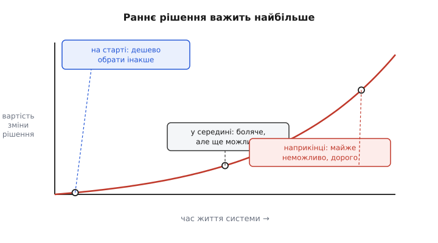
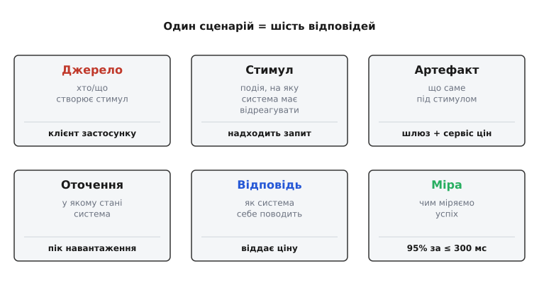
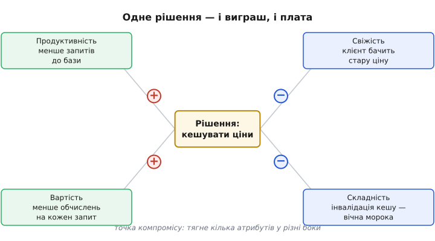

# Роль архітектора

<preknowlist>
- [Якісні атрибути («-ilities»)](book:programming/quality-attributes) — властивості системи поза функціями: продуктивність, доступність, змінюваність, безпека; чому їх не видно в списку фіч.
- [Стейкхолдери та їхні системи](book:programming/stakeholders) — хто має інтерес до системи (замовник, користувач, експлуатація, безпека) і що кожен від неї хоче.
- [Технічний борг і вартість зміни](book:programming/technical-debt) — чому пізня зміна коштує дорожче за ранню і як рішення накопичують «відсотки».
- [Закон Конвея](book:programming/conways-law) — система дзеркалить структуру спілкування команди, що її будує.
</preknowlist>

Слово **архітектор** (гр. *arkhitéktōn* — головний будівельник: *arkhi-* «головний» + *téktōn* «тесля, будівельник»; через лат. *architectus*) сходить до людини, що не клала цеглу власноруч, а вирішувала, де стіні бути. Це підказка й для програмного архітектора: його ремесло — не набирати найбільше коду, а **ухвалювати рішення, які найдорожче переграти**. Решта команди пише функції; архітектор відповідає за форму, у якій ті функції житимуть роками.

Тут легко застрягти на механізмах — черги, кеші, реплікація, шаблони. Механізми потрібні, але вони — інструменти. Ремесло архітектора починається на рівень вище: **чому саме цей механізм тут, чим ми за нього платимо, і що станеться, коли ми помилилися**. Ця стаття — про той рівень.

## Чому взагалі є така роль

Уявіть, що система маленька: один розробник, кілька тисяч рядків. Будь-яке рішення можна переграти за день. Ролі «архітектор» тут не треба — той самий чоловік, що пише код, тримає всю форму в голові й міняє її, коли захоче.

Складність ламає цю ідилію не лінійно. Додайте десятий модуль — і кількість способів, якими вони можуть зачепити один одного, росте як квадрат. Додайте п'яту команду — і кількість пар, що мусять домовлятися, теж росте квадратично. У певний момент **жодна голова вже не тримає цілого**, а рішення однієї команди тихо ламає припущення іншої. Ось тут і народжується потреба в комусь, хто тримає **цілісність форми** та **межі між частинами** — не тому, що він розумніший, а тому, що цю роботу мусить робити хтось спеціально.

> 🔧 **Навіщо це.** Коли проєкт «раптом» стає некерованим — релізи гальмують, кожна зміна зачіпає півсистеми, команди чекають одна на одну — це майже завжди не брак талантів, а брак ролі, що тримала форму. Розуміти, коли архітектор потрібен (а коли він — зайва бюрократія на маленькому проєкті), і є першою частиною ремесла.

## Рішення важить тим більше, чим раніше воно ухвалене

Ключова інтуїція всього ремесла — про **вартість зміни рішення в часі**. На старті будь-що коштує дешево: немає коду, що спирається на вибір, немає даних у форматі, немає команд, що звикли. З кожним місяцем на рішення нашаровується більше — код, дані, звички, інтеграції. Переграти його стає дорожче не поступово, а різко.

*Одне й те саме рішення — інша ціна залежно від того, коли його чіпають; ранній вибір архітектора важить найбільше саме тому, що переграти його потім дорожче за все.*

Звідси випливає вся дисципліна. Раз раннє рішення важить найбільше — до нього треба ставитися серйозно. Але є пастка з іншого боку: **не кожне рішення однакове**. Одні легко переграти будь-коли (яку бібліотеку логування взяти), інші — майже неможливо (як ми ділимо дані між сервісами). Мудрість не в тому, щоб усе вирішувати рано й ретельно, а в тому, щоб **розрізнити, які рішення незворотні, і саме на них витратити думку**.

> 🔧 **Навіщо це.** Молодий інженер витрачає однакову енергію на вибір фреймворку тестів і на вибір моделі консистентності даних. Архітектор бачить: перше можна переграти за тиждень, друге — переписавши півсистеми. Він майже не думає над першим і довго над другим. Це саме та [різниця між зворотними й незворотними рішеннями](book:programming/reversible-irreversible-decisions), що визначає, куди спрямувати обмежену увагу.

Із цим тісно пов'язана дисципліна **[останнього відповідального моменту](book:programming/last-responsible-moment)** — відкладати рішення не «на потім аби відкласти», а до миті, коли зволікати вже дорожче, ніж вирішити. Поки вибір зворотний і дешевий, зайва ранність лише зв'язує руки; коли він ось-ось стане незворотним — час ухвалювати, поки ще є з чого обирати.

## Мова, якою архітектор думає: якісні атрибути

Функції системи — те, що вона робить, — зазвичай зрозумілі та записані. Проблема архітектури майже ніколи не в них. Дві системи можуть робити те саме, але одна витримує мільйон користувачів, а друга падає на тисячі; одну можна змінити за день, іншу — за квартал. Ця різниця живе **не у функціях, а в якісних атрибутах** (їх часто звуть «-ilities» за англійськими суфіксами: scalability, availability, modifiability).

Проблема слова «швидко» чи «надійно» — воно порожнє. «Система має бути швидкою» не можна ні перевірити, ні спроєктувати: швидкою для кого, за яких умов, наскільки. Щоб атрибут став інженерним, а не побажанням, його треба перетворити на **[сценарій](book:programming/attribute-scenarios)** — конкретну історію з шести частин.

*Той самий атрибут «продуктивність» стає перевірним, лише коли розкладений на шість відповідей — від джерела стимулу до вимірної міри успіху.*

Замість «система має бути швидкою» — сценарій: «**коли** клієнт (джерело) надсилає запит ціни (стимул) до шлюзу з сервісом цін (артефакт) **під піковим навантаженням** (оточення), система **віддає ціну** (відповідь) **у 95% випадків за не довше ніж 300 мс** (міра)». Тепер це можна виміряти, узгодити зі стейкхолдерами й перевірити тестом. Уся інша архітектурна робота спирається на такі сценарії: без них немає чим міряти, чи вдалося рішення.

## Драйвери: не всі вимоги рівні

Сценаріїв можна написати сотні. Якби архітектор пробував задовольнити всі однаково, він не збудував би нічого — атрибути тягнуть у різні боки (див. нижче). Тому серед усіх вимог він виділяє **[архітектурні драйвери](book:programming/architectural-drivers)** — ту жменьку, що реально формує структуру.

Драйвер — це вимога, від якої **форма системи мусить змінитися**. «Витримати 100× пікового навантаження на чорну п'ятницю» — драйвер: він диктує кеші, реплікацію, розподіл. «Кнопка має бути синя» — не драйвер, хоч і вимога: її можна виконати за будь-якої архітектури. Ремесло — відрізнити ті кілька вимог, що справді ліплять форму, від сотень, що ні. Помиляються тут у обидва боки: або тонуть у деталях, що нічого не диктують, або пропускають одну вимогу, яка потім вимагає все переробити.

## Компроміс — суть, а не збій

Наївне очікування: добра архітектура одночасно швидка, надійна, дешева, безпечна й проста. Реальність жорсткіша — **атрибути тягнуть один одного в різні боки**. Підняти надійність реплікацією — впаде простота й зросте вартість. Прискорити кешем — постраждає свіжість даних. Спростити моноліт — програєш у незалежності команд.

*Кожне вагоме рішення — точка компромісу: воно тягне кілька атрибутів у різні боки, і завдання архітектора — свідомо обрати, чим пожертвувати.*

Тому головна праця архітектора — не знайти «найкраще» рішення (його немає), а **[зважити компроміс свідомо](book:programming/tradeoff-analysis)**: назвати, що виграємо, чим платимо, і чи ця плата прийнятна для наших драйверів. Рішення, у якому кілька атрибутів тягнуть у різні боки, звуть **точкою компромісу** (tradeoff point). Поруч є **точки чутливості** (sensitivity point) — місця, де малий вибір сильно зсуває якийсь один атрибут. Уміння бачити ці точки на схемі, ще до коду, і є те, що відрізняє архітектора від того, хто просто складає компоненти.

> 🔧 **Навіщо це.** Найгірше — коли компроміс зроблено несвідомо. Команда взяла кеш «бо швидко» й через півроку ловить баг: клієнти бачать стару ціну. Ніхто не вирішував пожертвувати свіжістю — це «просто сталося». Робота архітектора — зробити цю жертву **явним, названим рішенням**, яке хтось свідомо ухвалив і записав, а не побічним ефектом, що вилазить у проді.

## Оцінювання архітектури, поки вона ще на папері

Раз рішення важать найбільше рано й переграти їх потім дорого — виникає природне питання: **чи можна перевірити архітектуру до того, як її збудували?** Можна — і це окреме ремесло. Замість чекати проду, збирають стейкхолдерів і **проганяють архітектуру крізь сценарії**: для кожного вагомого сценарію дивляться, які рішення на нього впливають, які з них — точки компромісу чи чутливості, і де ховається ризик.

Найвідоміший метод такого оцінювання — **ATAM** (Architecture Tradeoff Analysis Method), що його розробили Рік Казман, Марк Кляйн і Пол Клементс у Software Engineering Institute при університеті Карнегі-Меллона; метод оформлено в статті IEEE 1998 року, а виріс він із ранішого SAAM (1994), який умів аналізувати лише змінюваність. *(Усталений факт.)* Суть ATAM проста, попри страшну назву: зібрати сценарії, знайти в архітектурі точки компромісу й чутливості, назвати ризики — і зробити це **колективно, поки правити ще дешево**. Повний важкий процес потрібен рідко; на щодень архітектори тримають **[легшу форму](book:programming/atam-lite)** тієї самої ідеї — але суть одна: систему судять сценаріями, а не смаком.

## Рішення під невизначеністю та ризиком

Головний біль ремесла: рішення треба ухвалювати **тоді, коли знаєш найменше** — на старті, коли вимоги хиткі, навантаження вгадане, а команда ще не намацала предметну область. Це не відмовка, а сама природа справи: чекати повного знання означає не вирішити ніколи.

Тому архітектор мислить **ризиком**, а не певністю. Ризик — це «якщо припущення X хибне, ми втратимо стільки-то». Замість вдавати, що знаєш майбутнє, ти **називаєш припущення явно** й питаєш кожне: наскільки дорого нам буде, якщо воно хибне? Найнебезпечніші — тихі припущення, яких ніхто не промовив («навантаження ж не зросте більш ніж удесятеро», «ці два сервіси завжди в одному дата-центрі»). Дисципліна **[ризик-мислення](book:programming/risk-thinking)** саме в тому, щоб витягти їх на світло й вести їм облік.

Із невизначеністю борються двома прийомами. Перший — **тримати рішення зворотним якнайдовше**: якщо вибір можна дешево переграти, помилка не смертельна, і ранню невизначеність можна пережити. Другий — **купувати знання дешевим експериментом**: тонкий наскрізний зріз системи, що працює від краю до краю (**[walking skeleton](book:programming/walking-skeleton)**), перевіряє найризикованіші припущення на реальному коді раніше, ніж на них ляже вся система. Замість сперечатися, чи витримає зв'язка навантаження, — зібрати мінімальну наскрізну версію й поміряти.

## В'ю та документування: як показати те, чого не видно

Архітектура нематеріальна — її не сфотографуєш. Щоб про неї говорити, її **малюють**. Але одна діаграма «вся система» завжди перетворюється на кашу зі стрілок, бо намагається показати все відразу. Рятунок — розділити на **[в'ю](book:programming/architecture-views)** (view — погляд): кожна діаграма показує систему **з одного боку, під одну турботу**.

Історично цю ідею закріпив Філіп Крухтен моделлю **[«4+1»](book:programming/architecture-views)** у статті IEEE Software 1995 року: логічний в'ю (з чого система складається), процесний (як вона працює в часі й паралелиться), розробницький (як код організований у модулі), фізичний (на яке залізо лягає) — і зшивають їх **сценарії** як п'ятий, наскрізний в'ю. *(Усталений факт.)* Кожен в'ю відповідає на питання свого стейкхолдера й нікого не перевантажує чужими деталями.

Практичніші за «4+1» на щодень два підходи. **[C4](book:programming/c4-model)** — модель Саймона Брауна (складалася 2006–2011, назву «C4» він увів 2011-го) — пропонує показувати систему на чотирьох рівнях наближення, як карту з зумом: контекст (система і її сусіди), контейнери (застосунки й бази всередині), компоненти (з чого зроблений контейнер), код (за потреби). *(Усталений факт.)* А **arc42** — шаблон документа архітектури Гернота Штарке й Петера Грушки (2005) — дає готовий кістяк розділів (контекст, рішення, будова, наскрізні концепції, ризики), щоб команда не сперечалася про структуру документа, а писала зміст. *(Усталений факт.)* Спільна нитка всіх трьох одна: **показуй систему з різних боків, кожен бік — під свою турботу, і не змішуй їх в одній діаграмі.**

> 🔧 **Навіщо це.** Діаграма — не прикраса для звіту, а **інструмент мислення й спільної мови**. Коли архітектор малює контекстну діаграму C4 і команда раптом бачить зовнішню залежність, про яку ніхто не думав, — діаграма щойно окупилася. Погана діаграма (усе на одному аркуші) приховує проблеми; добра (розділена по в'ю) їх виявляє.

## Рев'ю та комунікація: рішення, про яке ніхто не знає, — не рішення

Архітектор, що ухвалив блискуче рішення й лишив його в голові, не зробив нічого корисного — команда все одно збудує по-своєму. Тому півролі — **комунікація**: пояснити рішення так, щоб інші його зрозуміли, прийняли й реалізували.

Найкорисніша тут звичка — **записувати не лише що вирішено, а й чому**, з розглянутими альтернативами й компромісом. За рік ніхто не згадає, чому взяли саме цей підхід, і хтось «випадково» його переверне, не знаючи ціни. Короткий запис рішення з його контекстом — **[журнал архітектурних рішень](book:programming/architecture-decision-records)** — рятує від цього: він фіксує момент вибору разом із тодішніми причинами.

Другий бік — **[рев'ю архітектури](book:programming/architecture-review)**: не «начальник схвалює», а спільний розбір, де сценарії й ризики виносять на стіл, поки правити дешево. Добре рев'ю ловить не стиль, а **невидимі припущення й пропущені точки компромісу** — те саме, що робить оцінювання ATAM-класу, лише регулярно й дешево.

## Роль і стейкхолдери: архітектор служить багатьом інтересам

Архітектор рідко ухвалює рішення для себе. Навколо системи — багато **[стейкхолдерів](book:programming/stakeholders)** (stakeholder — той, чий інтерес поставлено на кін): замовник хоче вкластися в бюджет, користувач — швидкості, служба експлуатації — щоб не будили вночі, безпека — щоб не витекли дані, розробники — щоб код було приємно міняти. Ці інтереси **суперечать один одному**, і майже кожен великий компроміс — насправді компроміс між людьми, а не між технологіями.

Тому робота архітектора наполовину технічна, наполовину — про людей: почути кожного, зробити приховані конфлікти інтересів явними й ухвалити рішення, яке всі розуміють, навіть якщо не всім воно до вподоби. Рішення, нав'язане без цього, тихо саботують.

## Соціотехніка: форма коду дзеркалить форму команди

Є закон, який ламає найкращу архітектуру на папері, якщо його ігнорувати. **[Закон Конвея](book:programming/conways-law)** — спостереження Мелвіна Конвея, опубліковане в журналі *Datamation* 1968 року (сам він назвав статтю «How Do Committees Invent?», а «законом» це охрестив Фред Брукс) — каже: **система неминуче набуває структури, що дзеркалить структуру спілкування команди, яка її будує**. *(Усталений факт.)* Три команди майже завжди зроблять систему з трьох частин по своїх межах — хочуть вони того чи ні.

Наслідок для архітектора глибокий: **межі коду й межі команд не можна проєктувати окремо**. Якщо ти хочеш незалежні сервіси, а команди тісно переплетені й весь час узгоджуються, — код теж вийде переплетеним, скільки діаграм не малюй. Тому зрілі архітектори застосовують **зворотний маневр** (inverse Conway maneuver): спершу креслять бажану форму системи, тоді **перебудовують команди під неї** — і структура спілкування сама породжує потрібну структуру коду. Архітектура тут стає **соціотехнічною**: ти проєктуєш не лише модулі, а й те, хто з ким говорить.

## Економіка рішень: вартість — теж атрибут

Легко забути, що архітектура коштує грошей — і в побудові, і в експлуатації щомісяця. Рішення реплікувати базу втричі втричі підіймає рахунок за неї; вибір хмарного сервісу замість власного — це оренда назавжди. Тому зрілий архітектор ставиться до **[вартості як до повноцінного якісного атрибута](book:programming/cost-as-attribute)**: у неї є свій сценарій і свій бюджет, і її кладуть на терези компромісу разом із рештою.

Класична розвилка економіки рішень — **[будувати чи купити](book:programming/build-vs-buy)** (build vs buy): написати самому, взяти готове чи орендувати як послугу. Дешевше «купити» на старті часто тягне дорожчу прив'язку до постачальника й вартість виходу згодом; дорожче «збудувати» дає контроль, але забирає час команди від власне продукту. Це знову компроміс — лише міряний і в грошах теж, а не в самих технічних атрибутах.

## Еволюція: архітектура ніколи не «готова»

Останній і найважчий зсув у мисленні. Початківець уявляє архітектуру як **план, який накреслили один раз** і за яким будують. Реальність інша: вимоги міняються, навантаження росте, технології застарівають — і будь-яка «фінальна» архітектура за пару років стає тягарем. Тому досвідчений архітектор проєктує **не ідеальну систему на сьогодні, а систему, яку легко міняти завтра**.

Це і є **[еволюційна архітектура](book:programming/evolutionary-architecture)** як усталений спосіб думки: незворотних рішень — якнайменше, межі — там, де найімовірніша зміна, а самі важливі властивості системи стережуть **автоматичними перевірками**, щоб еволюція їх не поточила. Такі перевірки, що ловлять сповзання архітектури (**[фітнес-функції](book:programming/fitness-functions)**), — наче тести, тільки не для функцій, а для якісних атрибутів: вони падають, коли, скажімо, залежності поповзли не туди чи час відповіді виліз за поріг.

Бо архітектура тихо **[псується сама собою](book:programming/architecture-erosion)**: кожна поспішна правка «на зараз», кожен обхід межі «лише цього разу» точить форму, аж поки від задуманого не лишається сліду. Ремесло архітектора — не збудувати ідеал один раз, а **тримати форму живою й придатною до змін увесь час, поки система працює**. Головний будівельник із давньогрецького кореня не йшов додому, коли клали останню цеглину, — він лишався, поки стояв дім.
