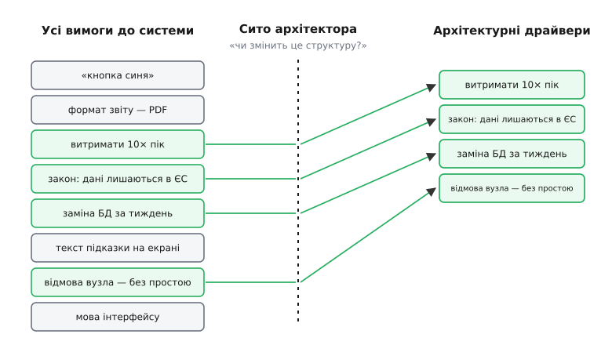
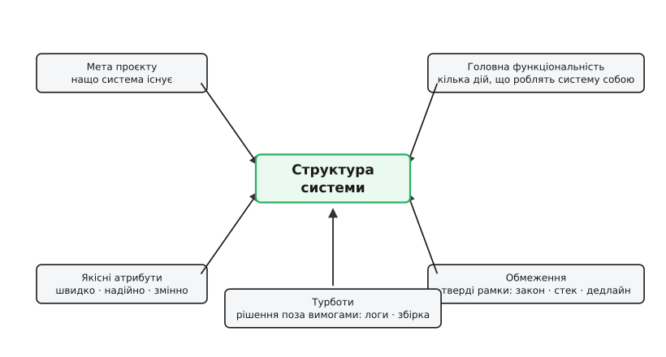

# Архітектурні драйвери

<preknowlist>
- [Якісні атрибути](topic:programming/quality-attributes) — «-ilities» системи: швидкодія, надійність, змінюваність, безпека; властивості, а не функції.
- [Сценарії атрибутів](topic:programming/attribute-scenarios) — як зробити розмиту вимогу («має бути швидко») вимірною: стимул, реакція, число.
- [Стейкхолдери](topic:programming/stakeholders) — люди й системи навколо, чиї потреби й побоювання стають вимогами до архітектури.
- [Роль архітектора](topic:programming/architect-role) — хто й навіщо ухвалює рішення про структуру системи.
</preknowlist>

Уяви, що тобі принесли специфікацію на нову систему: сто сторінок вимог. «Кнопка збереження — синя». «Звіт експортується у PDF». «Система витримує десятикратний піковий наплив у чорну п'ятницю». «Персональні дані громадян ЄС фізично не залишають ЄС». «Відмова одного вузла не спричиняє простою». Усе це — вимоги, усі однаково записані рівними абзацами. Але якщо ти спробуєш триматися їх усіх з однаковою увагою, проєктуючи структуру, ти потонеш і не побудуєш нічого.

Бо вони не рівні. Колір кнопки не змінить ані форми системи, ані її поділу на частини — це можна вирішити останнього дня, і будь-яка архітектура це витримає. А от «витримати десятикратний пік» і «дані не залишають ЄС» — це вимоги, які **диктують саму будову**: скільки вузлів, де вони стоять, як діляться дані, чи взагалі можна взяти хмару в іншій країні. Зміни ці дві вимоги — і доведеться проєктувати іншу систему з нуля. А колір кнопки міняй скільки завгодно, будова не здригнеться.

Ось цю різницю і схоплює поняття **архітектурного драйвера** (англ. *driver* — те, що жене, рушій; від *to drive* — гнати, керувати). Архітектурний драйвер — це вимога чи обставина, яка **справді формує структуру**: якби вона була іншою, архітектура вийшла б суттєво іншою. Решта вимог — важливі для продукту, але для **структури** байдужі; вони живуть усередині будь-якої розумної будови й архітектора як архітектора не турбують.

## Чому не всі вимоги важать однаково

Корінь у тому, що архітектура — це набір **ранніх, дорогих у зміні рішень** про великі частини системи та їхні зв'язки. Розбити на сервіси чи лишити монолітом; тримати стан у пам'яті чи в базі; синхронний виклик чи черга повідомлень. Ці рішення важко відкотити, коли на них уже наросли роки коду — тому їх і виносять наперед, у фазу проєктування структури.

А тепер спитай: **що саме змушує обрати одне рішення проти іншого?** Колір кнопки не змушує нічого — обидва варіанти будови його вмістять. А вимога «10× пік» — змушує: монолітом на одному сервері її не витягнеш, доведеться масштабувати горизонтально, а це вже зовсім інша структура з балансувальником, кількома копіями застосунку й спільним, але не вузьким сховищем. Вимога тут **тисне на вибір** — вона й є драйвером.

Тож драйвер — це не «важлива вимога» взагалі (важливих багато), а вимога, яка **проходить крізь сито структури**: змінюючи її, ти змінюєш будову. Це фільтр, і він жорсткий — крізь нього проходить дивовижно мало.



*Ліворуч — увесь потік вимог упереміш; сито пропускає праворуч тільки ті, що формують структуру.*

> 🔧 **Навіщо це.** Без сита архітектор витрачає ранню, найдорожчу увагу на дрібниці й пропускає справжні важелі. Список драйверів — це коротка «мапа тиску»: три-п'ять пунктів, до яких зводиться вся структура. З ним рев'ю рішення займає годину, а не тиждень, і кожен у команді бачить, чому будова саме така. Це той самий список, який згодом лягає в основу [аналізу компромісів](topic:programming/tradeoff-analysis) і [оцінювання архітектури](topic:programming/atam-lite).

Ту саму думку в літературі часто записують як **ASR** — architecturally significant requirements, «архітектурно значущі вимоги»: підмножина вимог, що сильно впливає на вибір структур. Драйвери — ширше поняття (сюди входять і речі, які взагалі не записані як «вимоги», про це нижче), але серце те саме: значуще для структури відділяємо від решти.

## П'ять різновидів драйверів

Якщо чесно перебрати все, що тисне на структуру, воно розкладається на п'ять різних сортів. Ця розбивка не самоціль — вона потрібна, щоб **нічого не пропустити**: люди легко бачать якісні атрибути, але забувають, скажімо, про турботи чи мету, і потім дивуються, звідки взялися проблеми.

**Мета проєкту** (навіщо система взагалі є). Систему будують заради когось і чогось: продати продукт, обійти конкурента за швидкістю виходу, замінити старий кошмар, довести технологію. Ця мета мовчки задає пріоритети всьому іншому. Якщо ціль — швидко вийти на ринок і перевірити ідею, то «елегантна масштабована будова» стає ворогом: тобі потрібен [walking skeleton](topic:programming/walking-skeleton) на скорую руку, а не собор. Мета — драйвер, бо вона визначає, які інші драйвери взагалі важать.

**Якісні атрибути** (які властивості система мусить мати). Це серцевина: наскільки швидко, наскільки надійно, наскільки легко змінювати, наскільки захищено. Саме [якісні атрибути](topic:programming/quality-attributes) найчастіше й формують структуру, бо кожен із них тягне за собою свій набір [тактик](topic:programming/architectural-tactics) — конкретних будівельних ходів. Але «має бути швидко» — це ще не драйвер: воно занадто розмите, щоб на нього спиратися. Драйвером атрибут стає, лише коли його записали [сценарієм](topic:programming/attribute-scenarios) з числом: «за навантаження 1000 запитів/с 95-й процентиль відповіді не перевищує 200 мс». Тепер це можна перевірити — і можна проєктувати проти цього.

**Головна функціональність** (кілька дій, що роблять систему собою). Більшість функцій структури не чіпають — їх можна доліпити будь-де. Але дрібка ключових сценаріїв визначає саму суть: для платіжної системи це «провести транзакцію так, щоб гроші не загубилися й не подвоїлися»; для навігатора — «прокласти маршрут». Ці кілька дій змушують закласти в будову правильні межі й потоки даних, тож вони теж драйвери — на відміну від решти функцій, які просто «мають бути».

**Обмеження** (тверді рамки, які не обговорюються). Обмеження (лат. *constringere* — стягувати) — це рішення, ухвалене **за тебе й до тебе**: закон вимагає тримати дані в певній країні; компанія вже стандартизувала стек на певній мові й забороняє інше; дедлайн виставки нерухомий; замовник наполягає на конкретній базі даних, бо на неї куплено ліцензії. Обмеження — драйвер особливого роду: воно не залишає вибору, а просто **викреслює** цілі гілки можливих архітектур. З ним не сперечаються — його враховують.

**Турботи** (англ. *concerns* — те, що непокоїть) — рішення, які **доведеться ухвалити**, хоча їх ніхто не записав вимогою. Ніхто не пише в специфікації «система має логувати події», «має бути спосіб зібрати й розгорнути білд», «має бути структура пакетів» — а проєктувати це все одно треба, і зроблено криво воно отруює життя роками. Турботи — це досвід архітектора, який бачить діри там, де замовник їх не назвав; вони теж формують структуру (наскрізне логування, спосіб конфігурації, поділ на модулі) і теж драйвери.



*Кожен різновид тисне на будову зі свого боку; архітектура — рівнодійна цих п'яти сил.*

Ця класифікація виросла з методу [Attribute-Driven Design](topic:programming/architectural-drivers/hist-add-origin.md) — проєктування, кероване атрибутами, — який у Software Engineering Institute при Університеті Карнеґі — Меллона розробляли Лен Басс, Пол Клементс і Рик Казман, а пізніше уточнив Умберто Сервантес. Саме там вимогу-що-формує-структуру відділили від вимоги-взагалі й дали цьому імена.

> 🔧 **Навіщо це.** П'ять шухляд — це чек-лист проти сліпих плям. Проходиш по кожній уголос: яка мета? які атрибути зі сценаріями? які кілька функцій — суть? що вже вирішено за нас (обмеження)? що доведеться вирішити, хоч і не записане (турботи)? Пропустив шухляду — майже гарантовано пропустив драйвер, який вилізе аварією через пів року. У проєкті це п'ятихвилинна вправа, що рятує місяці.

## Як відсіяти драйвер від звичайної вимоги

Правило одне, і воно просте: **уяви, що вимога змінилася на протилежну — чи доведеться перепроєктовувати структуру?** Якщо так — це драйвер. Якщо будова витримає зміну, лише поправиш код десь усередині — не драйвер.

Прогони «кнопка синя»: стала зеленою — структура здригнулася? Ні, це рядок стилю. Не драйвер. Прогони «дані не залишають ЄС»: стало «можна де завгодно» — структура інша? Так, тепер вільно береш найдешевшу хмару в будь-якій країні, зникає ціла морока з реплікацією й розділенням даних за регіонами. Драйвер, ще й потужний.

Друга перевірка ловить приховане: **вартість помилки**. Якщо неправильно вгадати вимогу дешево виправити пізніше — вона не драйвер, навіть якщо здається важливою. Якщо ж помилка коштуватиме перебудови половини системи — драйвер, і його треба з'ясувати **зараз**, поки рішення ще на папері. Ця перевірка тісно пов'язана з поділом на [зворотні й незворотні рішення](topic:programming/reversible-irreversible-decisions): драйвери майже завжди штовхають на незворотні рішення, тому й вимагають ранньої уваги.

Ще одна пастка — **розмита вимога, яку неможливо перевірити**. «Система має бути надійною», «інтерфейс зручний», «код підтримуваний» — це побажання, а не драйвери, бо проти них нічого не спроєктуєш і потім нічим не поміряєш. Драйвер мусить бути **гострим**: не «швидко», а «200 мс на 95-му процентилі за 1000 запитів/с». Робота архітектора наполовину в тому, щоб виловити з туману замовника ці гострі формулювання — витягти сценарій із «має бути швидко», поки воно не перетворилося на суперечку постфактум.

## Драйвер стає рішенням: приклад із прошивки

Драйвер сам собою нічого не будує — він **змушує ухвалити конкретне рішення**. Подивімося, як це працює на маленькому, але реальному прикладі з вбудованої системи.

**Умова.** Проєктуємо прошивку контролера промислового привода. Серед вимог:
- (A) «оператор бачить на екрані показ температури»;
- (B) «якщо основний датчик відмовляє, привод за 50 мс переходить у безпечний режим — інакше механізм ушкоджується».

Питання: котра з них — драйвер, і як вона формує структуру коду?

Вимога (A) не драйвер: оновлення екрана можна робити коли завгодно в головному циклі, будь-яка структура це вмістить. А от (B) — драйвер найгострішого роду: 50 мс — це **тверда межа реального часу**, порушення якої ламає залізо. Вона диктує, що обробка відмови не може жити в загальному потоці разом із малюванням екрана й іншою неспішною роботою — її треба винести в окремий, гарантований шлях із високим пріоритетом. Ось як драйвер (B) розводить структуру надвоє:

```c
// Драйвер (B): безпечний перехід ≤ 50 мс — окремий гарантований шлях.
// Не ділить час із повільним фоном (екран, логи, зв'язок).

// Апаратний таймер тикає кожні 1 мс, найвищий пріоритет переривання.
// Тут — тільки критична перевірка, нічого зайвого.
void TIM_1ms_IRQHandler(void)
{
    clear_timer_flag();

    if (!sensor_alive()) {          // датчик мовчить?
        drive_enter_safe_state();   // знеструмити привод — одразу, без черг
        fault_latched = true;       // зафіксувати факт відмови
    }
}

// Головний цикл: усе НЕкритичне за часом. Може підвисати на десятки мс —
// це не зачепить безпеку, бо безпека живе у перериванні вище.
void main_loop(void)
{
    for (;;) {
        display_update_temperature(read_temp());  // вимога (A): неспішно
        comms_poll();                              // зв'язок
        if (fault_latched)
            log_fault();                           // журнал — коли встигнеться
    }
}
```

Виснуй, що сталося: **один драйвер прорізав межу в структурі** — критичний-за-часом шлях відділився від фонового, і кожен живе за своїм законом. Якби (B) не було (скажімо, привод, який не ламається від затримки), уся ця робота спокійно вмістилася б в один головний цикл без жодних переривань — структура була б простішою. Драйвер додав структурі складності рівно там, де без неї не можна, і ніде більше.

Зверни увагу й на зворотне: якби ми не **виявили** драйвер (B) вчасно й написали все одним циклом, а межу в 50 мс помітили вже на випробуваннях, — довелося б **перебудовувати** потік керування прошивки, а не поправляти рядок. Це і є ціна пропущеного драйвера: не баг, а перепроєктування. Як саме тактика «окреме високопріоритетне переривання» виводиться із вимоги реального часу — розібрано в [окремому прикладі перетворення драйвера в рішення](topic:programming/architectural-drivers/proj-driver-to-decision.md).

> 🔧 **Навіщо це.** Список драйверів — це не паперова формальність, а прямий припис до коду: кожен драйвер або лишає структуру спокійною, або **прорізає** в ній нову межу (окремий потік, окремий модуль, окремий вузол). Тримаючи цей список перед очима, ти додаєш складності лише там, де її вимагає драйвер, і не роздуваєш будову «про всяк випадок» — це і є [YAGNI](topic:programming/dry-kiss-yagni) на рівні архітектури.

## Драйвери — не назавжди

Легко подумати, що драйвери з'ясовують один раз на старті й далі за списком будують. Насправді список **живе**. Мета проєкту зміщується (перевірили ідею — тепер треба масштаб). Приходять нові обмеження (новий закон про дані). Атрибут, що був другорядним, раптом стає критичним (продукт вистрілив — і навантаження, яке колись здавалося фантастикою, стало вівторком). Кожна така зміна може вивести на світло **новий драйвер** — і тоді структуру доводиться переглядати.

Тому зрілий підхід не «зафіксувати драйвери й забути», а **тримати їх під наглядом**: періодично перепитувати, чи не з'явився новий важіль, чи не відпав старий. Драйвери, які штовхають на найдорожчі, незворотні рішення, варто ще й тримати в полі зору [ризик-мислення](topic:programming/risk-thinking) — бо саме навколо них концентрується найбільша непевність. Архітектура, яка це враховує, будується [еволюційною за замовчуванням](topic:programming/evolutionary-architecture): готовою до того, що завтра список драйверів буде трохи іншим.

Підсумок простий. Вимог до системи — сотні, але структуру формують одиниці. Ці одиниці — архітектурні драйвери: мета, гострі якісні атрибути, кілька ключових функцій, тверді обмеження й неназвані турботи. Знайти їх — просіяти все крізь одне питання «чи змінить це будову?» — і є першою й головною роботою архітектора: не намалювати гарну діаграму, а зрозуміти, **що насправді тисне**, і будувати проти цього, а не проти шуму.
