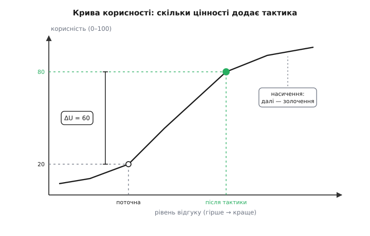
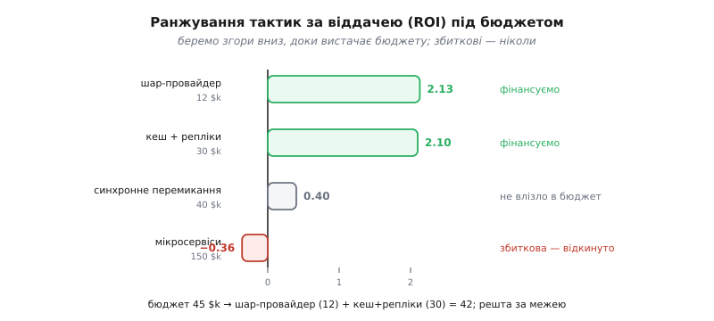

# 🧮 Економіка драйверів: чим міряти, куди тиснути

<preknowlist>
- [Дерево корисності й ATAM](book:programming/atam-lite) — як розкласти якості на сценарії й позначити кожен парою «важливість / складність»; тут ми ставимо під цю пару числа.
- [Вартість як атрибут](book:programming/cost-as-attribute) — гроші — такий самий якісний атрибут, як швидкодія; повна вартість тактики живе не лише в зусиллі побудови.
- [Ризик-мислення](book:programming/risk-thinking) — наслідок, помножений на ймовірність; так зважують те, що може статися, а може й ні.
</preknowlist>

Прозова тема каже: одні драйвери варті пильної уваги рев'ю, інші — ні; одна тактика окупається, інша — золочення; а фраза «здається важливим» має перетворитися на «віддача 3.2, роби перше». Усе це — обіцянки про **числа**, які там не пораховані. Порахуємо їх тут. Бо доки «важливо» й «дорого» лишаються словами, драйвери ранжують настроєм і найгучнішим голосом у кімнаті; щойно з'являється арифметика — це інженерна задача з відповіддю, яку можна покласти на стіл і захистити.

Нам знадобляться три різні калькулятори на три різні питання, і найперше — не сплутати їх між собою, бо вони відповідають на різне. **Куди дивитися** (який сценарій-драйвер прискіпливо перевіряти) — це дерево корисності. **Що будувати** (яку тактику фінансувати) — це віддача ROI. **Коли вирішувати** (зараз чи відкласти) — це сподівана цінність. Пройдемо їх по черзі, щоразу від означення до живого прикладу в стовпчик.

## Дерево корисності в числах: важливість × складність

Почнімо з найдешевшого калькулятора — того, що впорядковує **увагу**. Сценаріїв-драйверів можна набрати десятки, а часу вдумливо пройти кожен крізь структуру немає. Дерево корисності ATAM розв'язує це грубою оцінкою: кожному сценарію ставлять **пару** — наскільки він важливий для бізнесу й наскільки важкий (ризикований) для архітектури. У [дереві корисності](book:programming/atam-lite) цю пару лишають грубою — В/С/Н (високо/середньо/низько); тут ми переводимо її в числа й дивимося, що з ними робити.

Оцінімо кожну вісь від 1 до 5 і візьмімо **добуток** як пріоритет уваги:

```
пріоритет = важливість · складність        (кожна вісь 1…5)
```

```
сценарій-драйвер              важл.  ·  складн.  =  пріоритет
«10× пік у пік-дні»             5     ·     5     =     25     ← перше
«відмова вузла — без простою»   4     ·     4     =     16
«новий провайдер оплати ≤ 5 дн» 3     ·     2     =      6
«колір кнопки» (шум)            1     ·     1     =      1     ← ігнорувати
```

Ключове тут — **чому добуток, а не сума**. Уяви, що ми складали б: сценарій «дуже важливий, але тривіальний» (5 + 1 = 6) став би нарівні з «неважливим, але страшенно складним» (1 + 5 = 6) — а обидва не варті уваги рев'ю, і кожен зі своєї причини. Важливий-але-легкий зіграє й сам собою: структура тримає його очевидно, перевіряти нема чого. Складний-але-неважливий програти не шкода. Небезпека сидить **тільки** там, де високі **обидві** осі, — і саме добуток це схоплює: він завалюється, щойно бодай один множник малий, і злітає, лише коли великі два. Сума розмазує, добуток фокусує. Тому «10× пік» (25) забирає першу увагу, а решта стоять у черзі за спаданням добутку.

> 🔧 **Навіщо це.** Пара оцінок за хвилину відсіює 90% сценаріїв, щоб решту 10% подивитися пильно. Без неї команда або аналізує все підряд (немає часу, кидають на півдорозі), або дивиться на те, що першим спало на думку (майже завжди не найризикованіше). Добуток — це дешевий фільтр, який показує пальцем на верхній-правий кут: важливо **і** важко, туди гроші й час перевірки.

І одразу застереження, без якого другий калькулятор плутають із першим: пріоритет уваги — це **не** пріоритет вкладень. Сценарій може стояти першим на перевірку (важливий і важкий), а найкраща тактика під нього виявитися поганою інвестицією — і навпаки. «Куди дивитися» й «що будувати» — різні питання з різними числами. Друге число — попереду.

## Вигода тактики: приріст корисності, зважений

Тепер — калькулятор вкладень. Він потрібен, бо на кожен драйвер є кілька можливих тактик, і вони коштують різного та дають різне. Щоб їх зіставити, треба спершу навчитися міряти **вигоду** тактики одним числом. Тут працює механіка методу **CBAM** (англ. *Cost Benefit Analysis Method* — метод аналізу «вартість-вигода»), який Рик Казман, Джай Асунді й Марк Кляйн виклали у звіті Інституту програмної інженерії SEI «Making Architecture Design Decisions: An Economic Approach» (CMU/SEI-2002-TR-035, вересень 2002) як економічне доповнення до [ATAM](book:programming/atam-lite): ATAM знаходить компроміси, CBAM їх **оцінює грошима** (статус: усталено).

Основа CBAM — **крива корисності** (utility-response curve). Візьми один сценарій-драйвер і спитай: якщо система відповідає на нього краще чи гірше, наскільки нам від того **добре**? Відкладемо по горизонталі рівень відгуку (від поганого до чудового), по вертикалі — корисність від 0 до 100 (0 — гірше нікуди, 100 — краще не буває). Виходить не пряма, а крива з коліном:



*Нижній плаский шмат — «ще ні до чого»: відгук такий кепський, що дрібне поліпшення нічого не міняє. Крутий підйом — «зона, де відгук справді купує корисність». Верхнє плато — насичення: відгук уже чудовий, і платити за ще краще майже нема сенсу — це золочення. Тактика зсуває систему по кривій, а корисність, яку вона додає, — це вертикальний стрибок ΔU.*

Ось тепер точне означення вигоди. Тактика зсуває відгук по кривій — і **приріст корисності ΔU** (наскільки підскочила вертикаль) є те, що вона дає **цьому** сценарію. Але сценарії нерівні: один важить для бізнесу більше за інший. Тому кожен ΔU зважують — на **вагу сценарію**, яку в CBAM беруть із голосування стейкхолдерів (роздають 100 голосів між сценаріями). Вигода тактики — сума зважених приростів по всіх сценаріях, яких вона торкається:

```
вигода(корисність)  =  Σ  ΔUⱼ · вагаⱼ
                       j
```

Порахуймо на живому прикладі. Ваги з голосування: «10× пік» — 0.40, «відмова вузла» — 0.35, «новий провайдер» — 0.25. Тактика **«кеш + репліки читання»** сильно піднімає швидкодію під піком, трохи допомагає пережити відмову й ніяк не чіпає провайдера оплати:

```
ваги (100 голосів):  10× пік = 0.40 · відмова = 0.35 · провайдер = 0.25

тактика «кеш + репліки» рухає корисність:
   «10× пік»:    20 → 80    ⇒  ΔU = 60
   «відмова»:    30 → 50    ⇒  ΔU = 20
   «провайдер»:  без змін    ⇒  ΔU =  0

вигода = 60·0.40 + 20·0.35 + 0·0.25
       = 24 + 7 + 0
       = 31 бал корисності
```

Тридцять один бал — але бал корисності це не гроші, а їх треба звести до грошей, щоб порівняти з вартістю. Бізнес задає масштаб: наскільки один зважений бал корисності системи вартий грошей на горизонті планування. Хай це буде **μ = 3 $k за бал** (тобто зрушити зважену корисність на 1 бал — приблизно три тисячі доларів цінності). Тоді вигода в грошах:

```
вигода(гроші) = 31 · 3 = 93 $k
```

> 🔧 **Навіщо це.** Крива корисності робить видимою найтихішу форму марнотратства — **золочення на плато**. Коли відгук уже в зоні насичення (верхнє плато), кожен наступний бал відгуку коштує грошей, а корисності додає копійки: ΔU майже нуль, вигода майже нуль. «Прискормо відповідь зі 120 мс до 80 мс», коли користувач і 120 не відрізняє від 80, — це рух по пласкому хвосту кривої. Питання «а де ми на кривій?» одразу відрізняє тактику, що дереться крутим коліном (кожен бал відгуку — реальна корисність), від тактики, що полірує плато (гроші на вітер) — пряма рідня порушенню [YAGNI](book:programming/dry-kiss-yagni).

## Віддача: вартість, ROI і бюджет

Вигода — половина ваг. Друга половина — **вартість тактики**, і тут головна пастка в тому, щоб не звести її до самого лише зусилля побудови. Повна вартість тактики — сума трьох статей, і дві з них капають довго після того, як код написано:

```
вартість = зусилля_побудови  +  податок_на_складність  +  вартість_експлуатації
```

**Зусилля** — разова робота: спроєктувати, написати, інтегрувати. **Податок на складність** — щоденна плата за те, що система стала заплутанішою: кожен зайвий рівень читають, налагоджують і пояснюють новачкам роками. **Експлуатація** — рахунок за життя тактики: більше вузлів — більший рахунок за хмару й більше того, що ламається вночі. Це ті самі струмки, які [вартість як атрибут](book:programming/cost-as-attribute) розкладає для системи цілком; тут ми міряємо їх для однієї тактики. Для «кеш + репліки»: зусилля 20 + податок-складності 6 + експлуатація 4 = **30 $k**.

Маючи вигоду й вартість в однакових грошах, беремо **віддачу** — стандартний ROI:

```
ROI  =  (вигода − вартість) / вартість
```

Читається просто: скільки чистого повертає кожен вкладений долар. ROI = 2.10 означає «на кожен долар вартості — 2.10 долара чистого зверху». Порахуймо всі чотири тактики-кандидати під наш набір драйверів:

```
тактика                  вигода B    вартість C    ROI = (B−C)/C
шар-провайдер (плагін)     37.5 $k       12 $k         2.13
кеш + репліки              93.0          30            2.10
синхронне перемикання      55.8          40            0.40
мікросервіси (повний розпил) 96.75      150           −0.36
```

Тут — головний урок усього калькулятора, і він контрінтуїтивний. **Мікросервіси мають найбільшу вигоду з усіх** (96.75 — вони чіпають усі три драйвери) і водночас **найгіршу віддачу** (−0.36, збиткова: повертає менше, ніж коштує). А крихітний «шар-провайдер», чия вигода найменша, дає найвищий ROI, бо коштує копійки. Ранжувати тактики за вигодою — пряма дорога вбити бюджет у найдорожчу забавку; ранжувати треба за **віддачею**. Сито структури пропустило всі чотири (кожна щось формує) — економіка каже, що будувати варто протилежне тому, що радить «найбільша вигода».

Одна чесна примітка. Сам CBAM ранжує не за ROI = (B−C)/C, а за «цінністю-за-гроші» — простим відношенням B/C (англ. *value for money*). Це та сама впорядкованість: ROI = B/C − 1, тобто ROI — це B/C, зсунуте на одиницю, а зсув на константу порядку не міняє. Хоч дели, хоч віднімай — тактики стають у той самий ряд. Тому байдуже, якою з двох формул користуватися; важливо не плутати їх із ранжуванням за голою вигодою.



*Смуга кожної тактики — її ROI. Дві верхні (найвища віддача) влазять у бюджет — фінансуємо. Синхронне перемикання прибуткове (0.40 > 0), але на нього вже не стало грошей. Мікросервіси йдуть ліворуч від нуля — збиткові, їх не беруть за жодного бюджету, попри найбільшу сиру вигоду.*

Лишилося зважити на **скінченний бюджет**. Рідко можна оплатити всі прибуткові тактики; треба обрати підмножину. Правило CBAM (і здоровий глузд): відсортуй за ROI спадно й бери жадібно згори, доки вистачає бюджету, ніколи не беручи збиткові:

```
за спаданням ROI:  шар-провайдер 2.13 → кеш+репліки 2.10 → синхронне 0.40 → мікросервіси −0.36

бюджет 45 $k, беремо жадібно згори:
   + шар-провайдер   12   (разом 12 ≤ 45)   ✓
   + кеш + репліки    30   (разом 42 ≤ 45)   ✓
   + синхронне        40   (разом 82 > 45)   ✗ не влазить
   ⨯ мікросервіси          ROI < 0 — не беремо ніколи

обрано: шар-провайдер + кеш+репліки · витрачено 42 $k · сумарна вигода 130.5 $k
```

Зверни увагу: під бюджет не влізло **прибуткове** синхронне перемикання (ROI 0.40 — воно б окупилося), просто грошей на нього вже не стало після двох вигідніших. Це нормальний біль скінченного бюджету: фінансуєш найвіддачніше, і дещо хороше лишається за бортом до наступного циклу. А мікросервіси відкинуто незалежно від бюджету — збиткову тактику не беруть навіть коли гроші є.

Ось калькулятор, що робить усе це — рахує вигоду, ROI, сортує й обирає під бюджет:

:::tabs
```python
from dataclasses import dataclass

@dataclass
class Tactic:
    name: str
    du: dict[str, float]           # приріст корисності ΔU по сценаріях
    cost: float                    # зусилля + податок-складності + експлуатація

def benefit(t: Tactic, weight: dict[str, float], mu: float) -> float:
    # вигода = (Σ ΔUⱼ · вагаⱼ) · ціна-корисності
    utility = sum(t.du.get(s, 0.0) * w for s, w in weight.items())
    return utility * mu

def roi(t: Tactic, weight: dict[str, float], mu: float) -> float:
    b = benefit(t, weight, mu)
    return (b - t.cost) / t.cost

def pick_under_budget(tactics, weight, mu, budget):
    # сортуємо за ROI спадно, беремо жадібно, доки вистачає бюджету
    ranked = sorted(tactics, key=lambda t: roi(t, weight, mu), reverse=True)
    chosen, spent = [], 0.0
    for t in ranked:
        if roi(t, weight, mu) <= 0:          # збиткову — ніколи
            continue
        if spent + t.cost <= budget:
            chosen.append(t.name)
            spent += t.cost
    return chosen, spent

weight = {"пік": 0.40, "відмова": 0.35, "провайдер": 0.25}
tactics = [
    Tactic("кеш+репліки", {"пік": 60, "відмова": 20}, cost=30),
    Tactic("синхронне",   {"пік": -6, "відмова": 60}, cost=40),
    Tactic("шар-провайдер", {"провайдер": 50},        cost=12),
    Tactic("мікросервіси", {"пік": 50, "відмова": 10, "провайдер": 35}, cost=150),
]
print(pick_under_budget(tactics, weight, mu=3.0, budget=45))
# (['шар-провайдер', 'кеш+репліки'], 42.0)
```
```typescript
interface Tactic {
  name: string;
  du: Record<string, number>;      // приріст корисності ΔU по сценаріях
  cost: number;                    // зусилля + податок-складності + експлуатація
}

const benefit = (t: Tactic, weight: Record<string, number>, mu: number): number =>
  Object.entries(weight)
    .reduce((sum, [s, w]) => sum + (t.du[s] ?? 0) * w, 0) * mu;

const roi = (t: Tactic, weight: Record<string, number>, mu: number): number =>
  (benefit(t, weight, mu) - t.cost) / t.cost;

function pickUnderBudget(
  tactics: Tactic[], weight: Record<string, number>, mu: number, budget: number,
): { chosen: string[]; spent: number } {
  // сортуємо за ROI спадно, беремо жадібно, доки вистачає бюджету
  const ranked = [...tactics].sort((a, b) => roi(b, weight, mu) - roi(a, weight, mu));
  const chosen: string[] = [];
  let spent = 0;
  for (const t of ranked) {
    if (roi(t, weight, mu) <= 0) continue;   // збиткову — ніколи
    if (spent + t.cost <= budget) {
      chosen.push(t.name);
      spent += t.cost;
    }
  }
  return { chosen, spent };
}

const weight = { пік: 0.40, відмова: 0.35, провайдер: 0.25 };
const tactics: Tactic[] = [
  { name: "кеш+репліки",   du: { пік: 60, відмова: 20 },               cost: 30 },
  { name: "синхронне",     du: { пік: -6, відмова: 60 },               cost: 40 },
  { name: "шар-провайдер", du: { провайдер: 50 },                      cost: 12 },
  { name: "мікросервіси",  du: { пік: 50, відмова: 10, провайдер: 35 }, cost: 150 },
];
console.log(pickUnderBudget(tactics, weight, 3.0, 45));
// { chosen: [ 'шар-провайдер', 'кеш+репліки' ], spent: 42 }
```
:::

> 🔧 **Навіщо це.** «Жадібно за ROI» — це евристика, а не істина: строго це задача про рюкзак (0/1 knapsack), і жадібний вибір не завжди оптимальний (іноді дешевша пара обжене одну дорогу тактику з вищим ROI). CBAM свідомо бере жадібне правило як **достатньо добре** для рішення за столом — точний перебір тут переоцінка вхідних грубих чисел. Практична порада: після жадібного вибору кинь оком, чи не влазить у решту бюджету ще щось прибуткове замість недобраного — це і є вся поправка, яка на цих масштабах потрібна.

## Рішення під невизначеністю: сподівана цінність

Два перші калькулятори мовчки припускали, що числа відомі: ваги, ΔU, вартості. Але найгостріші драйвери приходять **без чисел** — «навантаження виросте, але невідомо на скільки». Тактику під невідоме число не оцінити прямо, зате можна оцінити **саме рішення**: будувати запас зараз чи відкласти. Інструмент — **сподівана цінність** (expected value): кожен можливий результат зважуємо на його ймовірність і додаємо.

```
EV  =  Σ  pᵢ · цінністьᵢ
       i
```

Поставмо конкретне питання. Невідомо, чи проб'є майбутній пік стелю одного вузла. Чесна оцінка ймовірностей і дві дії:

```
невідоме: чи перевищить пік стелю одного вузла?
   p(пік ≤ 3×) = 0.70   → одного вузла вистачить
   p(пік > 3×) = 0.30   → потрібен багатовузловий масштаб

«вирішити зараз» (будуємо масштаб одразу):    певна вартість = 45 $k
«відкласти» (один вузол; добудуємо, якщо припече):
   E[відкласти] = 0.70 · 0  +  0.30 · 100
                = 0 + 30
                = 30 $k

30 < 45   →   відкласти дешевше в сподіванні
```

Чому пізніше дороблення коштує 100, а не 45? Бо доробка **під тиском** — по живій системі, з міграцією даних і клієнтами на лінії — завжди дорожча за ту саму роботу заздалегідь. І все одно відкласти виграє: величезний шанс (0.70), що масштаб узагалі не знадобиться, перетягує рідкісне дороге дороблення. Але виграш не безумовний — він тримається на числах, і корисно знайти, де рішення **перевертається**. Прирівняй дві вартості й дістань порогову ймовірність:

```
поріг перевороту:   p · 100 = 45   ⇒   p* = 0.45

p(пік) = 0.30  <  0.45   → відкладаємо
якби вірили в  p > 0.45  → будували б зараз
```

Тепер питання з нерозв'язного «яка точно ймовірність?» стало розв'язним «шанс великого піку більший за 0.45 чи менший?» — на таке команда чесно відповість. Це та сама зброя проти невизначеності, що й [остання відповідальна мить](book:programming/last-responsible-moment): відкладай, поки сподівана ціна зволікання нижча за ціну поспіху. А найсильніший хід — збити вартість пізнього дороблення, зробивши вузол [зворотним рішенням](book:programming/reversible-irreversible-decisions): тримай його без стану, і доробка коштуватиме не 100, а, скажімо, 50 — тоді поріг перевороту зсунеться аж до p* = 0.90, і відкладати стане майже завжди правильно.

Лишається третій хід — **купити знання** замість того, щоб гадати чи відкладати. Скільки варто заплатити за навантажувальний тест ([walking skeleton](book:programming/walking-skeleton)), що зніме невизначеність наперед? Рівно стільки, наскільки знання здешевлює рішення:

```
цінність знятої невизначеності:
   якби знали наперед:  0.70·0 + 0.30·45 = 13.5 $k   (за спайку будуємо заздалегідь за 45, не 100)
   найкраще без знання:  min(45, 30)      = 30   $k
   цінність інформації = 30 − 13.5        = 16.5 $k

тест коштує ~8 $k  <  16.5 $k   →   купити знання вигідно (чистий виграш 8.5 $k)
```

Знання варте 16.5 тисяч, бо перетворює рідкісне дороблення-за-100 на планову побудову-за-45. Тест за вісім тисяч, що дає цю визначеність, окупається вдвічі. Ось чому «витратити тиждень на прототип» так часто дешевше за «будувати наосліп під навантаження, якого може не бути»: тиждень купує число, а число заощаджує пізнє дороблення.

> 🔧 **Навіщо це.** Сподівана цінність рятує від двох дзеркальних дурниць: «збудуймо все з запасом про всяк випадок» (переплата за масштаб, що не знадобиться) і «розберемося, коли впаде» (доробка в пожежному режимі). Обидві — рішення без числа. EV кладе на ваги ймовірності й вартості, а поріг p* перетворює безнадійне «вгадай майбутнє» на посильне «більше чи менше за половину». Систематичний набір цих ходів — діапазони, пороги, купівля інформації — це [рішення під невизначеністю](book:programming/deciding-under-uncertainty) як окрема дисципліна.

## Уся економіка драйверів на одній сторінці

П'ять формул, і «важливо/дорого» перестало бути відчуттям:

```
1. Увага рев'ю:     пріоритет = важливість · складність        (дерево корисності)
2. Вигода тактики:  B = (Σ ΔUⱼ · вагаⱼ) · μ                      (крива корисності × ваги)
3. Віддача:         ROI = (B − C)/C,  C = зусилля + податок-складності + експлуатація
4. Під бюджетом:    сортуй за ROI спадно, бери жадібно, доки вистачає; ROI < 0 — ніколи
5. Коли невідомо:   порівняй E[зараз] і E[відкласти] = Σ pᵢ·цінністьᵢ; переворот при p*
```

Кожне число рахується на серветці за грубими входами, і разом вони кажуть три речі, яких відчуття сказати не може: **на який драйвер витратити увагу перевірки** (добуток пари), **яку тактику варто будувати** (найвищий ROI, не найбільша вигода) і **коли взагалі ухвалювати рішення** (де E[зараз] обжене E[відкласти]). Точність цих чисел скромна — входи грубі, а μ і ваги суб'єктивні, — але порядок величини вони дають вірний, а саме порядок відрізняє свідому інвестицію від золочення. Сито структури каже «це формує будову»; економіка драйверів каже, **скільки** того варте — і без другого відповіді перше веде рівно до дорогих систем, збудованих на найбільшу вигоду замість найвищої віддачі.
