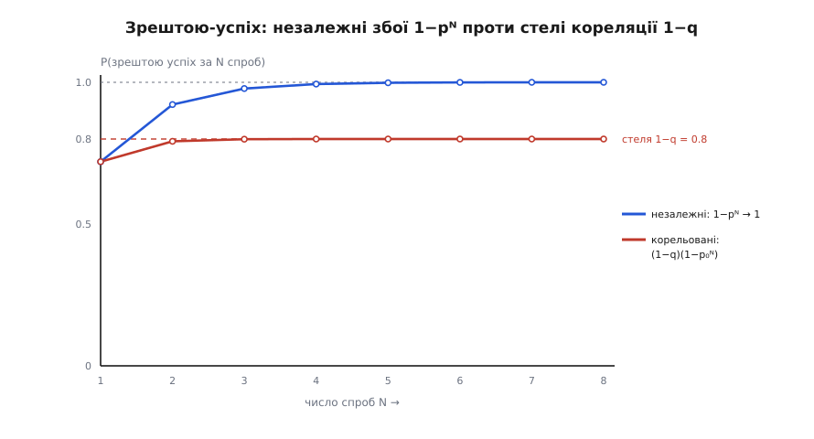

# 🧮 Ціна повтору: доступність, затримка й шторм як функції однієї ручки

Тактика повтору (retry) виглядає безкоштовною: виклик до сусіда впав — спробуй ще раз, збій же міг бути миттєвим. Але щойно ти дописуєш «ще раз», у тебе з'являються **ручки**: скільки разів пробувати (N), скільки чекати між спробами (пауза b) і як та пауза росте (множник r). І кожна з цих ручок — не безневинне число, а важіль, що одночасно **піднімає доступність** і **піднімає ціну**. Питання архітектора не «повторювати чи ні», а «наскільки крутнути N» — і на це питання є точна відповідь у числах, яку можна вивести з нуля, не запускаючи системи.

Ця вставка робить рівно те, що робить будь-яка чесна математика тактики: перетворює туманне «повтори роблять надійніше» на дві криві, обидві — функції **тієї самої** ручки, і показує точку, де вони розходяться найболючіше. Виведемо чотири речі підряд: скільки повтор коштує часом і викликами; наскільки він піднімає ймовірність зрештою-успіху; чому ця остання формула бреше, коли сусід лежить по-справжньому; і як повтори множать навантаження у **шторм**, який здатний повалити здоровий сервіс. А наприкінці складемо все в одну картинку компромісу.

## Скільки коштує N спроб з експоненційною паузою

Почнімо з ціни, бо її видно найпростіше. Хай тактика робить щонайбільше **N** спроб. Між спробами вона витримує паузу, яка **подвоюється** — це й є експоненційна пауза (exponential backoff): перша пауза `b`, друга `2b`, третя `4b` і так далі. Ідея подвоєння не випадкова: якщо сусід захлинається, кожна наступна спроба відступає далі, даючи йому час оговтатись, замість добивати рівномірним градом.

Між N спробами вміщається N−1 пауз. Порахуймо, скільки часу вони з'їдають у найгіршому разі — коли всі N спроб таки провалились, і кожен виклик до того ж провисів до кінця свого тайм-ауту T (бо збій, який довго не відповідає, — це саме очікування тайм-ауту):

```
N спроб  →  (N − 1) пауз між ними
пауза перед k-ю спробою:   d_k = b · r^(k−1)      (r — множник, типово 2)

сума всіх пауз при r = 2:
   b + 2b + 4b + … + 2^(N−2)·b  =  b · (2^(N−1) − 1)

найгірша затримка (кожен виклик б'є в тайм-аут T):
   L_max = N·T  +  b·(2^(N−1) − 1)
           └─┬─┘     └─────┬────┘
        N викликів     паузи РОСТУТЬ як 2^N
```

Зупинись на другому доданку, бо в ньому вся мораль ціни. Паузи складаються в `b·(2^(N−1) − 1)` — це **геометрична сума**, і вона росте **експоненційно** з N. Додати п'яту спробу до чотирьох — це не «ще трохи почекати», це **подвоїти** увесь накопичений час пауз. Ручка N лінійна на вигляд (1, 2, 3, 4…), а ціна, яку вона тягне, — експоненційна. Це перша тріщина, крізь яку видно майбутній компроміс: користь від зайвої спроби спадатиме, а її ціна — вибухатиме.

Тепер друга валюта ціни — **число викликів**, бо саме воно лягає навантаженням на сусіда. Тут з'являється ймовірність. Хай кожен окремий виклик падає з імовірністю **p** (0 ≤ p ≤ 1). Спроба з номером k відбувається **тільки якщо** всі попередні k−1 спроб провалились — а це, за незалежності, має ймовірність `p^(k−1)`. Очікуване число викликів — це просто сума ймовірностей того, що ми взагалі дійдемо до кожної спроби:

```
P(робимо спробу k) = p^(k−1)

E[K] = Σ (k=1..N) p^(k−1) = 1 + p + p² + … + p^(N−1)

геометрична сума:
   E[K] = (1 − p^N) / (1 − p)

межі:   p → 0  ⇒  E[K] → 1        (майже завжди влучаємо з першого разу)
        p → 1  ⇒  E[K] → N        (майже завжди мусимо всі N)
```

Ця маленька формула `E[K] = (1 − p^N)/(1 − p)` — робоча конячка всієї вставки, вона нам ще двічі знадобиться. Прочитаймо її вголос: коли збої рідкісні (p близьке до 0), в середньому обходимось **одним** викликом — повтор майже ніколи не спрацьовує, він дешевий, бо непотрібний. Але коли збої часті (p близьке до 1), очікуване число викликів повзе до **N** — ти платиш повну ціну ручки саме тоді, коли сусідові й так найгірше. Запам'ятай цю асиметрію: вона — зерно, з якого виросте шторм.

**Дано: p = 0.3, N = 4, T = 200 мс, b = 50 мс, r = 2.**
```
Найгірша затримка:
   L_max = 4·200 + 50·(2³ − 1)
         = 800  + 50·7
         = 800  + 350  = 1150 мс

Очікуване число викликів:
   E[K] = (1 − 0.3⁴)/(1 − 0.3)
        = (1 − 0.0081)/0.7
        = 0.9919/0.7  ≈  1.417

Очікувана додана пауза (Σ p^j·d_j, j = 1..3):
   0.3·50 + 0.09·100 + 0.027·200
   = 15   + 9      + 5.4   =  29.4 мс
```

Порівняй два світи, що живуть у цих числах. **У середньому** повтор майже безкоштовний: 1.42 виклику, зайвих 29 мс — тінь. А **в хвості** він жорстокий: 4 виклики й 1150 мс проти вихідних 200. Ось чому одну тактику треба міряти обома лінійками. Середнє каже, скільки навантаження вона додає в спокої; хвіст каже, який тайм-аут-бюджет вона здатна прострелити в поганий день. Ручка N — це майже цілком регулятор **хвоста**: середнє вона майже не рухає, а найгіршу затримку тягне експоненційно.

> 🔧 **Навіщо це.** Перш ніж ставити `max_tries = 5`, підстав свої T і b у `L_max = N·T + b·(2^(N−1) − 1)` і поглянь на хвіст. Часто виявляється, що п'ята спроба додає секунди до найгіршого відгуку заради часток відсотка надійності — і порушує той самий сценарій «за 5 секунд щонайбільше», задля якого повтор і ставили. Затримку хвоста рахують ДО коду, бо в проді її видно вже як інцидент.

## Спокуслива формула зрештою-успіху: 1 − pᴺ

Тепер найкраща реклама повтору — те, заради чого його й ставлять. Якщо збої **незалежні**, то всі N спроб провалюються лише тоді, коли провалилась кожна поодинці, а це добуток N однакових множників:

```
P(усі N спроб впали) = p · p · … · p = p^N

отже
   P(зрештою успіх за N спроб) = 1 − p^N
```

Це виглядає як магія, і ось чому. Візьми виклик, що падає в кожному десятому випадку (p = 0.1 — доволі кепський сусід), і дай йому три спроби:

```
1 спроба:   1 − 0.1   = 0.9      (90.0 %  — «одна дев'ятка»)
2 спроби:   1 − 0.1²  = 0.99     (99.0 %  — «дві дев'ятки»)
3 спроби:   1 − 0.1³  = 0.999    (99.9 %  — «три дев'ятки»)
```

Кожна зайва спроба **множить** частку невдач на p — тобто відрубує їй десятковий розряд, дописуючи ще одну дев'ятку до доступності. Три виклики перетворюють ненадійні 90 % на розкішні 99.9 %, і це коштує лише двох рядків коду. Саме ця арифметика робить повтор найспокусливішою тактикою доступності: здається, надійність можна купувати дев'ятками за безцінь, просто крутячи N.

> 🔧 **Навіщо це.** Формула `1 − p^N` — це та обіцянка, яку тактика повтору дає на дошці під час проєктування. Знаючи виміряну частку збоїв p, ти за секунду прикидаєш, скільки спроб треба, щоб дотягти до цільової доступності зі сценарію. Але тримай у голові слово **«незалежних»** великими літерами — бо саме на ньому вся ця краса й ламається.

## Де ця арифметика бреше: корельовані збої

Уся розкіш `1 − p^N` тримається на одному тихому припущенні, яке ми вписали й проскочили: `P(спроба k впала | попередні впали) = p`. Тобто що друга невдача **так само ймовірна**, як перша, ніби минула нічого не сказала. Для миттєвого моргання мережі це майже правда. Але подумай, **чому** насправді падає виклик до сусіда. Здебільшого — не тому, що фотон загубився, а тому, що сусід **лежить**: перевантажений, вимкнувся, втратив базу. І якщо він лежить, то він лежить не на мілісекунду між твоїми спробами, а всерйоз — секунди, хвилини. Тоді твоя друга спроба провалюється не з імовірністю p, а майже напевно, бо стукає в ті самі зачинені двері.

Змоделюймо це чесно як **суміш двох світів**. У кожен момент інциденту сусід або справді лежить (з імовірністю q), і тоді кожен виклик падає гарантовано, або здоровий (з імовірністю 1−q), і тоді виклик падає лише зрідка, незалежно, з малим p₀:

```
з імовірністю q     — сусід СПРАВДІ лежить:  кожен виклик падає (p = 1)
з імовірністю 1−q   — сусід здоровий:        виклик падає незалежно з p₀

P(усі N спроб впали) = q·1 + (1−q)·p₀^N

P(зрештою успіх)     = 1 − q − (1−q)·p₀^N  =  (1−q)·(1 − p₀^N)

межа:   N → ∞   ⇒   P(успіх) → 1 − q
                    └─ ДНО, нижче якого повтори не пускають ─┘
```

Ось де ламається магія дев'яток. У незалежному світі `1 − p^N` спокійно повзе до одиниці — дай досить спроб, і невдача зникне. У реальному, змішаному світі ймовірність успіху впирається в **стелю 1 − q** і зупиняється там намертво: скільки б спроб ти не додав, проти справжньої аварії вони безсилі, бо всі до одної стукають у того самого мертвого сусіда. Повтори купують тобі рівно **проміжок між моргання й аварією** — і ані міліметра далі.



*Та сама виміряна невдача, два різні світи. Обидві криві стартують з однакової точки (0.72 при N=1 — той самий одиничний виклик), бо однокрокова частка збоїв в обох 0.28. Далі вони розходяться: за **незалежних** збоїв (синя) кожна спроба дописує дев'ятку й тягне до 1; за **корельованих** (червона, суміш q = 0.2 справжньої аварії з p₀ = 0.1 морганням) успіх упирається в стелю 1 − q = 0.8 і завмирає. Розрив над червоною лінією — це рівно те, чого повтори НЕ куплять: проти аварії потрібне перемикання на резерв, а не наполегливість.*

Найглибше тут — **чому** кожна наступна спроба гірша за попередню, а не просто «не краща». Спитаймо навпаки: сам факт, що спроба щойно впала, — що він каже про світ? За теоремою Баєса кожна невдача **піднімає апостеріорну ймовірність**, що ми в поганому світі, де сусід лежить:

```
Дано:  q = 0.2   p₀ = 0.1      (виміряна однокрокова невдача = 0.2 + 0.8·0.1 = 0.28)

P(сусід лежить | k невдач поспіль) = q / ( q + (1−q)·p₀^k )

   k = 1:  0.2 / (0.2 + 0.8·0.1)    = 0.2/0.28    ≈ 0.714
   k = 2:  0.2 / (0.2 + 0.8·0.01)   = 0.2/0.208   ≈ 0.962
   k = 3:  0.2 / (0.2 + 0.8·0.001)  = 0.2/0.2008  ≈ 0.996
```

Прочитай ці три числа повільно, бо в них — уся суть корельованих збоїв. **До** першого виклику ти оцінював шанс справжньої аварії у 20 %. Один-єдиний збій піднімає цю оцінку до **71 %**. Другий — до **96 %**. Тобто друга твоя спроба вилітає в світ, про який накопичені дані вже кричать: «майже напевно він лежить, повтор не поможе». Ти запускаєш повтор рівно в ту мить, коли він найменш доречний — бо доречним він був би, якби невдача була випадковою, а сам факт невдачі свідчить, що вона не випадкова. Це не парадокс, це логіка: повтор — ставка на те, що збій миттєвий, а кожен новий збій цю ставку спростовує.

> 🔧 **Навіщо це.** Ось математична причина, чому сліпий повтор небезпечний, а розумний — дивиться на **тип** збою. Рядок «повторюй лише тайм-аут і „зайнято", а не „немає прав"» — це груба, але дієва апроксимація баєсового оновлення: одні коди помилок лишають шанс на моргання (варто спробувати), інші кажуть «світ поганий» напевно (повтор — марна шкода). Проти корельованої відмови справжня відповідь не в більшому N, а в іншій тактиці — перемкнутися на резерв або відкласти в чергу. Повтор і перемикання лікують різні хвороби.

## Шторм повторів: коли ліки труять сусіда

Досі ми дивились на один клієнт. Тепер відступімо й погляньмо на сусіда з боку — на нього ж сиплються повтори від **тисяч** клієнтів одночасно. І тут та сама формула `E[K] = (1 − p^N)/(1 − p)`, яку ми вивели для очікуваного числа викликів, перевертається на **коефіцієнт множення навантаження**: у скільки разів роздувається потік запитів до сусіда, коли всі клієнти почали повторювати.

```
A(p) = E[викликів на 1 запит] = (1 − p^N) / (1 − p)

   A(0) = 1        (збоїв нема — жодного зайвого виклику)
   A(1) = N        (усе падає — кожен запит стає N викликами)
   A(p) монотонно росте з p

навантаження на сусіда:   λ_eff = λ · A(p)
```

А тепер увімкни зворотний зв'язок — і стане моторошно. Сусід почав захлинатися, частка збоїв p поповзла вгору. Але щойно p зростає, множник A(p) теж зростає — клієнти повторюють частіше, — і навантаження `λ·A(p)` збільшується. Більше навантаження добиває й без того хворого сусіда: p росте ще дужче, A росте ще дужче, потік росте ще дужче. Це **порочне коло** з додатним зворотним зв'язком, і воно має стійку точку в самому кутку: p → 1, A → N, потік → N·λ. Сервіс, який просів на мить, повтори утримують на дні, годуючи його вп'ятеро (при N = 5) більшим потоком саме тоді, коли він не тягне й звичайного.


*Чому шторм самопідтримується. Множник A(p) = (1−pᴺ)/(1−p) росте від 1× до стелі N = 5×, коли частка збоїв p повзе до одиниці. Щойно підсилене навантаження A·λ перетинає потужність сусіда C/λ (зелена лінія), система входить у **зону шторму**: більше збоїв → більше повторів → ще більше збоїв. Запобіжник (синій пунктир) — єдина ручка, що дає ЖОРСТКУ межу: на порозі він розмикається й обриває A до 0, вихоплюючи систему з петлі, поки решта тактик лише переформовують потік.*

Це не гіпотетична страшилка — це задокументована історія раннього інтернету. Джон Нейґл 1984 року в RFC 896 «Congestion Control in IP/TCP Internetworks» описав явище, яке назвав **колапсом від перевантаження** (congestion collapse): коли вузли переповнюються й гублять пакети, хости починають **перепосилати** втрачене, кожен пакет іде мережею по кілька разів, і корисна пропускність падає до крихти від норми (усталений факт — це текст самого RFC 896, Нейґл тоді працював у Ford Aerospace). Через два роки, восени 1986-го, це справдилось на практиці: Ван Якобсон задокументував, як пропускність між Берклі та сусідньою лабораторією обвалилася приблизно в тисячу разів через лавину ретрансмісій (усталений факт; праця «Congestion Avoidance and Control», 1988). Шторм повторів на рівні застосунку — це той самий колапс, лише поверхом вище: та сама петля, той самий механізм, той самий фінал.

Тепер порахуймо **умову колапсу** — коли петля здатна самопідтримуватись. Хай сусід тягне C запитів за секунду, а чистий приплив — λ. Найгірше підсилення — N-кратне. Тоді:

```
усталений колапс можливий, якщо навіть найгірший потік не влазить:
   N · λ  >  C        →  є стійка «погана» рівновага при p ≈ 1

безпечно, якщо найгірший підсилений пік лишається під потужністю:
   N · λ_пік  <  C     →  шторм не має чим самопідтриматись
```

Ця нерівність `N·λ < C` — і є та лінійка, якою три класичні запобіжники проти шторму треба міряти. Кожен б'є по **своєму** множнику в ній, і бачити це — значить розуміти, чому їх ставлять разом, а не замість одного.

**Експоненційна пауза** атакує **час**. Без неї N спроб виходять пачкою за мілісекунди, і миттєвий пік потоку — саме N·λ. Подвоєння паузи розтягує ті N викликів на інтервал завдовжки `b·(2^(N−1) − 1)`, тобто прорідж`ує потік у часі: миттєва щільність повторів від одного клієнта спадає геометрично з кожним колом. Пік не зникає, але розмазується — площа та сама, а от висота падає. Історично це не нова ідея: **двійкову експоненційну паузу** (binary exponential backoff) ввели Роберт Меткалф і Девід Боґс у праці про Ethernet 1976 року, де кожна колізія подвоювала середній інтервал відступу перед новою спробою (усталений факт; «Ethernet: Distributed Packet Switching for Local Computer Networks», Communications of the ACM, липень 1976); а сама ідея випадкового відступу перед ретрансмісією виросла ще раніше з мережі ALOHAnet Нормана Абрамсона на Гаваях початку 1970-х.

**Джитер** (jitter — тремтіння) атакує **синхронність**. Сама лише пауза має підступну ваду: якщо тисяча клієнтів дістала збій в одну мить t₀, то всі вони чекають рівно b і б'ють у сусіда **разом** у момент t₀+b, тоді разом у t₀+3b, і так синхронними залпами — це «стадо, що біжить» (thundering herd). Пауза розтягнула потік від одного клієнта, але не розсинхронізувала натовп. Джитер додає до кожної паузи **випадковий доважок**: замість чекати рівно `d`, клієнт чекає випадкову величину в межах `[0, d]` (це «повний джитер», full jitter). Тоді залп заввишки в тисячу запитів розмазується рівномірно по всьому інтервалу — імпульс стає плато, а пік падає в стільки разів, у скільки інтервал ширший за миттєвий залп. Математично джитер б'є по **дисперсії** моментів повтору: він перетворює гострий спалах на пологий фон. Це не фольклор, а виважена інженерна рекомендація: Марк Брукер в інженерному блозі AWS «Exponential Backoff And Jitter» (2015) показав на моделі, що додавання джитера до паузи відчутно зменшує пік конкурентного навантаження й час до розв'язання конфлікту, і відтоді ця схема (full / equal / decorrelated jitter) зашита в клієнти AWS SDK (усталений факт — авторський допис і його наслідування в SDK).

**Запобіжник** (circuit breaker) атакує сам **множник N**. Пауза й джитер лише **переформовують** потік у часі — розмазують, зсувають, — але сумарну кількість повторів не обмежують жорстко: якщо збій затяжний, повтори все одно йдуть, просто рідше й врозсип. Запобіжник — єдина з трьох тактик, що дає **тверду верхню межу**: полічивши забагато збоїв поспіль, він **розмикається** й на час охолодження просто перестає пускати виклики — ані повтори, ані навіть перші спроби. У нерівності `N·λ < C` він фактично збиває множник з N до **нуля** на час аварії: сусід під час розмикання не бачить від цього клієнта **жодного** запиту й дістає шанс оговтатись у тиші. Пауза й джитер роблять шторм рідшим і пологішим; запобіжник його **обриває**. Тому їх і кладуть разом — вони затикають три різні діри в одній петлі.

## Одна ручка, дві криві: де сидить компроміс

Тепер зведімо все докупи й побачмо ту єдину річ, заради якої вся ця математика й затівалась. Ми вивели дві криві повтору. Крива **користі** — ймовірність зрештою-успіху `1 − p^N`. Крива **ціни** — найгірша затримка `L_max = N·T + b·(2^(N−1) − 1)` (а поруч із нею — ризик шторму через множник A, що теж росте до N). І ключове спостереження просте до незручності: **обидві криві — функції того самого N**. Це не два незалежні регулятори, які можна крутити нарізно, — це **одна ручка й два циферблати**. Не буває «докрутити доступність, не чіпаючи ціни»: одна й та сама рука, що додає спробу, водночас додає й затримку. Ось чому це компроміс, а не оптимізація.


*Та сама ручка N рухає обидві стрілки — але в різному темпі (на графіку p = 0.5, T = 200 мс, b = 50 мс). Зелена крива доступності `1−pᴺ` **насичується**: кожна нова спроба дає щоразу менше, бо приріст множиться на p. Червона крива затримки `L_max` **вибухає**: кожна нова спроба коштує вдвічі більшої паузи. Зліва вони обидві рухаються охоче, справа — доступність уже стоїть, а ціна ще й як біжить. Десь між ними — **точка компромісу N***, за якою докручувати ручку означає платити дедалі більше за дедалі менше.*

Точку компромісу знаходять на **границі** — питанням «що дасть і що візьме **наступна** спроба». Порахуймо два прирости від переходу N → N+1:

```
Гранична КОРИСТЬ (приріст успіху):
   Δуспіх = p^N − p^(N+1) = p^N·(1 − p)      ← спадає як p^N   (× p щокроку)

Гранична ЦІНА (приріст найгіршої затримки):
   ΔL = T + b·2^(N−1)                         ← росте як 2^N    (× 2 щокроку)
```

Ось математичний портрет компромісу в чистому вигляді: **користь спадає геометрично** (множник p < 1 щокроку), а **ціна зростає геометрично** (множник 2 щокроку). Дві геометричні прогресії, що розбігаються в протилежні боки, неминуче перетинаються — і точка перетину N* завжди існує й завжди одна. Порахуймо її на живих числах (p = 0.3, T = 200 мс, b = 50 мс):

```
крок          Δуспіх (нових часток успіху)   ΔL (нових мс хвоста)
1 → 2      0.3¹·0.7 = 0.210  (+21.0 %)        200 + 50·1 = 250 мс
2 → 3      0.3²·0.7 = 0.063  ( +6.3 %)        200 + 50·2 = 300 мс
3 → 4      0.3³·0.7 = 0.0189 ( +1.9 %)        200 + 50·4 = 400 мс
4 → 5      0.3⁴·0.7 = 0.0057 ( +0.6 %)        200 + 50·8 = 600 мс
```

Подивись, як стрімко перевертається вигідність. Друга спроба купує цілих 21 % доступності за 250 мс хвоста — очевидна угода. Третя — вже 6.3 % за 300 мс. Четверта — жалюгідні 1.9 % за 400 мс. П'ята — 0.6 % за цілих 600 мс. Кожен крок дає **менше** й коштує **більше**, ножиці розходяться. Де саме різати — залежить від твого «курсу обміну»: скільки мілісекунд хвоста ти згоден віддати за відсоток доступності. Формально оптимум N* — там, де зважена гранична користь зрівнюється з граничною ціною:

```
V · p^N·(1 − p)   =   c · (T + b·2^(N−1))
└── спадає, ~p^N ──┘    └── росте, ~2^N ──┘

   V — цінність одного відсотка доступності
   c — ціна однієї мілісекунди хвоста
```

Ліва частина падає, права росте — отже рівняння має єдиний розв'язок N*, і він **повністю визначений** чотирма числами: p, T, b і курсом V/c. Ніякого «правильного числа спроб узагалі» не існує — є число, яке випливає з твого сценарію. Дешевий хвіст і дорога доступність (велике V/c) штовхають N* вправо; дорогий хвіст (жорсткий бюджет затримки) — вліво. [Trade-off-аналіз](book:programming/tradeoff-analysis) саме цим і займається — робить такий курс обміну явним, замість лишати його випадковим наслідком дефолта в бібліотеці.

І останній, найтверезіший поворот. Пригадай, що крива користі `1 − p^N` — **оптимістична брехня**: за корельованих збоїв справжня доступність насичується не в одиниці, а в стелі `1 − q`, і то вже після першої-другої спроби. А це означає, що реальна гранична користь спадає **ще швидше** за `p^N` — практично обнуляється на N = 2÷3, — тоді як ціна росте так само нестримно. Тобто чесне врахування кореляції зсуває точку компромісу N* **вліво**: у реальному світі, де збої купчаться, оптимальне число спроб **менше**, ніж підказує наївна формула. Математика повтору, доведена до кінця, дає несподівано скромну пораду: пробуй **мало** разів, відступай широко, тряси джитером і тримай запобіжник згори — бо ручка, що піднімає доступність, тією ж рукою піднімає і затримку, і ризик шторму, а всі три — то криві однієї змінної, розведені лише темпом, з яким кожна тебе за неї карає.
