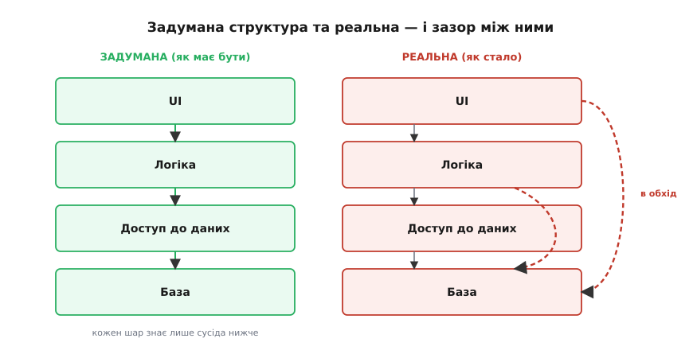
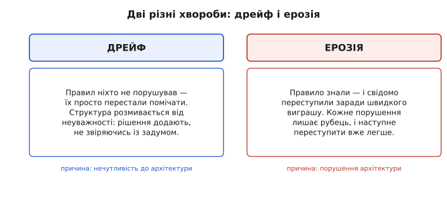
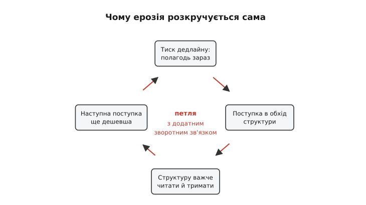

# Ерозія архітектури

<preknowlist>
- [Якісні атрибути («-ilities»)](topic:programming/quality-attributes) — нефункціональні властивості системи (змінюваність, продуктивність, доступність) і чому саме за них торгуються архітектурні рішення.
- [Архітектурні в'ю](topic:programming/architecture-views) — що структуру системи описують кількома проєкціями; тут важлива різниця між намальованим і тим, що насправді в коді.
- [Тактики змінюваності](topic:programming/modifiability-tactics) — як зчеплення й зв'язність визначають, наскільки далеко розтечеться зміна; шов, що ізолює.
</preknowlist>

Є документ, який майже в кожній довгій системі каже неправду, — і всі про це знають. Це архітектурна діаграма. На ній акуратно намальовано шари, межі, дозволені й заборонені стрілки: домен звертається до бази лише через репозиторій, жоден модуль не залежить від того, що вище за нього. А тоді ти відкриваєш код — і бачиш зовсім інше. Домен подекуди смикає базу напряму. Модуль, який на діаграмі ні від кого не залежить, тягне пів системи. Між двома нібито незалежними частинами — десяток прихованих ниток. Діаграма показує систему, якою її **задумали**. Код показує систему, якою вона **стала**. І зазор між цими двома картинами — не помилка малювальника. Це і є ерозія архітектури.

**Ерозія архітектури (лат. *erosio* — роз'їдання)** — це поступове розходження реальної структури системи із задуманою, під тиском багатьох дрібних поступок, аж доки задуману вже й не впізнати. Слово взяте буквально: як вода роками стирає камінь не одним ударом, а мільйоном крапель, так і архітектуру руйнує не одне велике хибне рішення, а потік дрібних «на швидку руку», кожне з яких окремо здається безневинним. Ніхто ніколи не сідав і не вирішував «зіпсуймо структуру». Вона зіпсувалася сама — по краплі.

## Дві архітектури, які завжди розходяться

Щоб побачити явище чітко, треба спершу розділити те, що зазвичай звуть одним словом «архітектура». Насправді її дві, і вони живуть окремо.

Перша — **задумана** (англ. *prescriptive* — приписова): та, яку ти навмисне спроєктував і яка живе в діаграмах, документах, у головах команди. Вона каже, як **має бути**: які межі, які залежності дозволені, а які — ні. Друга — **реальна** (англ. *descriptive* — описова): та, що фізично закодована в системі просто зараз, з усіма справжніми залежностями між файлами, справжніми викликами, справжніми обхідними стрілками. Вона каже, як **є насправді**.

На старті проєкту ці дві архітектури майже збігаються: ти щойно намалював діаграму й одразу написав код за нею. Але далі вони починають розповзатися, бо змінюється лише одна з них. Код правлять щодня — реальна архітектура рухається з кожним комітом. А діаграму оновлюють у кращому разі раз на квартал, а частіше — ніколи. Задумана архітектура застигає на папері, реальна повзе під ногами, і зазор між ними росте. Ерозія — це і є вимір цього зазору в часі.


*Одна й та сама система у двох поданнях. Ліва структура — те, що на діаграмі й у домовленостях команди; права — те, що фізично в коді. Ерозія — це накопичені пунктирні стрілки праворуч: залежності, яких задум не передбачав, але життя додало.*

> 🔧 **Навіщо це.** Поки ти не назвав ці дві архітектури окремо, ерозію неможливо ні побачити, ні виміряти — вона розчинена в тисячах файлів. Щойно розділив «як має бути» і «як є», з'являється конкретне питання, на яке можна відповісти інструментом: чи є в коді залежність, якої немає на діаграмі? Кожна така знайдена залежність — це шматочок ерозії, названий і зловлений. Без цього розрізнення розмова про «архітектура псується» лишається скаргою; з ним вона стає задачею, яку видно й можна полагодити.

## Звідки взявся сам поділ, і чому важлива не лише швидкість

Поняття не нове й не випадкове. Ще 1992 року американські дослідники **Дьюейн Перрі** (Dewayne E. Perry) та **Александер Вульф** (Alexander L. Wolf) у праці «Foundations for the Study of Software Architecture» — одному з текстів, з яких програмна архітектура взагалі почалася як окрема дисципліна, — увели й розрізнили два способи, якими структура віддаляється від задуму. [Історію цього поділу й того, як він переріс у знаменитий образ «великої грудки багна»](topic:programming/architecture-erosion/hist-erosion-term.md), винесено окремо; тут важлива сама пара понять, бо вона точна.

Перрі й Вульф побачили, що структура псується **двома різними хворобами**, і плутати їх шкідливо, бо лікують їх по-різному.

**Дрейф (англ. *drift*)** — розмивання від **нечутливості** до архітектури. Правил ніхто свідомо не порушував; їх просто перестали брати до уваги. Приходить розробник, який не знає задуму (документа немає або він застарів), і додає код, не звіряючись зі структурою, — не зі зла, а через незнання. Рішення саме по собі непогане, воно просто **не помічає** архітектури. Так структура тихо розмивається від байдужості.

**Ерозія (у вузькому сенсі Перрі й Вульфа)** — розмивання від **порушення** архітектури. Тут правило знали — і свідомо переступили заради швидкого виграшу. «Так, за правилами домен не має звертатися до бази напряму, але зараз горить, пізніше поправлю». Це не незнання, а свідома поступка під тиском.


*Дві різні причини одного видимого наслідку — розходження коду із задумом. Дрейф лікують поверненням архітектури у поле зору команди (жива документація, спільна мова); ерозію — поверненням правилам сили, якої не можна тихо обійти.*

У повсякденній мові обидві хвороби давно злилися в одне слово «ерозія» — і далі ми теж уживаємо його широко, як загальну назву для розходження структури із задумом. Але тримати в голові поділ варто, бо він підказує ліки. Дрейф — це проблема **видимості**: архітектуру треба повернути команді в поле зору. Ерозія у вузькому сенсі — проблема **дисципліни**: правилам треба повернути силу, якої не можна обійти між іншим. Ту саму тему бачать і під іншими назвами — деградація, гниття, старіння, ентропія архітектури; це синоніми одного явища, а не окремі речі.

## Чому це розкручується саме собою

Найважливіше в ерозії — не те, що вона трапляється, а те, **чому вона прискорюється**. Якби кожна поступка коштувала однаково, система псувалася б рівномірно й повільно, її можна було б терпіти. Але поступки дешевшають із кожним разом, і саме тому чиста структура з роками зривається в багно, а не осідає плавно.

Механізм — петля з додатним зворотним зв'язком. Прослідкуймо один оберт. Приходить тиск: щось горить, полагодити треба зараз. Найшвидший спосіб — поступка в обхід структури: провести стрілку навпростець, минаючи шар, який заважає. Поступку зроблено, пожежу згашено. Але структура від цього стала трохи **менш чистою**: тепер у ній є перемичка, якої задум не передбачав. А менш чиста структура **важча для розуміння**: наступному розробникові, який гляне сюди, доведеться тримати в голові й задумані межі, і цей виняток. І ось ключове — коли **йому** доведеться щось швидко полагодити, зробити ще одну поступку буде вже **легше**, ніж першу. Бо структура тут уже надламана: «тут і так безлад, одна перемичка нічого не змінить». Кожне порушення знижує психологічний і технічний бар'єр для наступного.


*Ерозія — не рівний спад, а петля, що сама себе розкручує: кожна поступка здешевлює наступну. Тому структура не осідає плавно, а зривається — довго тримається, а тоді за короткий час перетворюється на клубок.*

Це та сама механіка, що й у природному ґрунті: перша промоїна спрямовує наступну воду в те саме річище, і яр росте дедалі швидше. Аналогія точна в головному — самопідсиленні, — але корисно бачити, **де вона ламається**: яр роз'їдає воду сліпо, а систему псують люди, які щоразу мають вибір. Отже, петлю можна розірвати рішенням, чого не скажеш про яр. Саме на цьому тримається вся боротьба з ерозією: перервати додатний зв'язок раніше, ніж він розкрутиться.

## Технічний двигун під поступкою: залежності

Тепер спустімося з метафор у код і назвемо конкретну річ, з якої фізично складається ерозія. Це **залежності** — хто про кого знає. Задумана архітектура — це, по суті, дозволена карта залежностей: домен може знати про порт репозиторію, але не про базу; UI може знати про логіку, але не навпаки. Ерозія у коді — це поява залежностей **поза** цією картою.

Порівняймо два стани одного модуля. Ось як задумано: логіка знає лише порт, конкретна база захована за швом.

:::tabs
```cpp
// ЗАДУМАНО: логіка залежить від порту, не від бази.
struct OrderRepository {                     // порт: контракт без бази
    virtual Order load(int id) = 0;
    virtual ~OrderRepository() = default;
};

int order_total(OrderRepository& repo, int id) {
    Order o = repo.load(id);                 // жодного сліду бази
    return o.total();
}
```
```python
# ЗАДУМАНО: логіка залежить від порту, не від бази.
from abc import ABC, abstractmethod

class OrderRepository(ABC):                  # порт: контракт без бази
    @abstractmethod
    def load(self, order_id: int) -> Order: ...

def order_total(repo: OrderRepository, order_id: int) -> int:
    order = repo.load(order_id)              # жодного сліду бази
    return order.total()
```
:::

А ось те саме після однієї поступки під тиском — «швидше напряму, порт обійду»:

:::tabs
```cpp
// ЕРОДОВАНО: логіка тягне базу напряму, в обхід порту.
#include <postgres.h>                        // тип бази просочився сюди

int order_total(PGconn* db, int id) {
    // "тимчасово" смикаємо базу прямо з логіки
    PGresult* r = PQexec(db, "SELECT ...");  // прибито до Postgres
    return parse_total(r);
}
```
```python
# ЕРОДОВАНО: логіка тягне базу напряму, в обхід порту.
import psycopg2                              # тип бази просочився сюди

def order_total(db: psycopg2.extensions.connection, order_id: int) -> int:
    # "тимчасово" смикаємо базу прямо з логіки
    cur = db.cursor()
    cur.execute("SELECT ...")               # прибито до Postgres
    return parse_total(cur.fetchone())
```
:::

Різниця в одному рядку `#include` — і вона вирішальна. У першому варіанті замінити базу означає написати новий адаптер порту; логіка не ворухнеться. У другому база **протекла** в логіку: тепер логіку не можна ні перенести, ні протестувати без живого Postgres, а заміна бази — хірургія по всіх таких місцях. Одна поступка перетворила зворотне рішення на незворотне. Помножте це на сотні файлів і роки — і отримаєте систему, у якій усе знає про все, тобто [«велику грудку багна»](topic:programming/architecture-erosion/hist-erosion-term.md): структуру, у якій межі стерлися до непомітності.

Оскільки ерозія фізично складається із заборонених залежностей, її можна **виміряти** — не на око, а програмою, що пройде по коду й порахує стрілки, яких на карті бути не мало. В окремій статті [Аналіз ерозії архітектури: граф залежностей](topic:programming/dependency-graph-checker) розібрано повний інструмент, що будує граф залежностей із `#include`, знаходить циклічні зв'язки за алгоритмом Тар'яна та блокує порушення шарів у CI/CD.

Сам граф залежностей піддається й тоншому аналізу, ніж просто «є заборонена стрілка чи нема». За кількістю вхідних і вихідних залежностей модуля рахують міри його стійкості й абстрактності, а найгостріший сигнал ерозії — **цикл** у графі, коли пакет A знає про B, а B зрештою знову про A: така петля робить обидва невіддільними й неперевірними нарізно. [Метрики, якими вимірюють здоров'я графа залежностей — нестабільність, абстрактність, відстань від «головної послідовності» та чому цикл найтоксичніший](topic:programming/architecture-erosion/math-coupling-metrics.md), винесено окремо.

## Як розпізнати ерозію, доки не пізно

Ерозія підступна тим, що довго не болить. Система працює, тести зелені, релізи виходять — а структура тим часом тихо зривається. Симптоми з'являються не в поведінці, а в **економіці зміни**, і читати їх треба саме там.

Найнадійніший симптом — **зростання ціни зміни**. Колись додати поле проходило за годину; тепер те саме поле тягне за собою десять правок у несподіваних місцях, бо все переплелося. Швидкість команди падає, і падає не через складність нових задач, а через опір самої структури. Другий симптом — **несподівані наслідки**: правиш тут, ламається там, де ніякого зв'язку нібито немає. Це прямий доказ прихованих залежностей — тих самих обхідних стрілок, яких немає на діаграмі. Третій — **страх чіпати**: у системі з'являються місця, куди ніхто не хоче лізти, бо «там усе тримається на чесному слові». Страх — це ерозія, вже усвідомлена командою, але ще не названа.

За цими симптомами стоять цілком конкретні причини, і майже всі вони не технічні. **Тиск дедлайну** штовхає на поступки — головний двигун вузької ерозії. **Брак чи застарілість документації** робить задуману архітектуру невидимою — двигун дрейфу: не можна поважати межу, якої не бачиш. **Плинність команди** вимиває знання: люди, що тримали задум у голові, ідуть, а з ними випаровується розуміння, **чому** межі саме такі, — лишаються правила без причин, які легко порушити не зі зла. І **відсутність автоматичної перевірки** дозволяє всьому цьому накопичуватися нечутно: якщо порушення структури нічого не зупиняє, воно неминуче стається.

> 🔧 **Навіщо це.** Практичний висновок для розробника: не чекай, доки ерозію стане видно як параліч. Стеж за випереджальним симптомом — ціною зміни. Якщо оцінки на однотипні задачі повзуть угору місяць за місяцем, а причина не в самих задачах, — це майже напевно структура почала опиратися. Це найраніший сигнал, який ще дає час діяти дешево, поки виправлення — це рефакторинг одного шва, а не переписування системи.

## Що з цим робити

Раз ерозія — це самопідсильна петля, боротьба з нею зводиться до одного: **розірвати додатний зв'язок**, не даючи кожній поступці здешевлювати наступну. Способів кілька, і вони доповнюють один одного.

**Зробити задумане видимим.** Проти дрейфу ліки пряме — повернути архітектуру в поле зору. Не мертва діаграма раз на рік, а живий опис поряд із кодом. Найдешевший спосіб тут — тримати структуру [діаграмами як код](topic:programming/diagrams-as-code): опис архітектури живе в репозиторії текстом, редагується разом із кодом і не встигає застаріти. Коли межі видно, дрейф від незнання майже зникає — розробник бачить, що порушує, ще до того, як порушить.

**Зробити правила невблаганними.** Проти вузької ерозії — свідомого порушення — потрібне те, чого не обійдеш між іншим. Правило, яке живе лише в чиїйсь пам'яті, зметуть за перший аврал; правило, зроблене автоматичною перевіркою, зупиняє порушення тієї ж миті. Це [фітнес-функції](topic:programming/fitness-functions): виконуваний код, що падає, коли структуру порушено, і не пускає таку зміну далі складання. Ту саму перевірку залежностей, що вимірює ерозію, ставлять на ворота — і петля рветься на першому ж кроці: поступку в обхід просто не прийме конвеєр.

**Гасити борг, доки він малий.** Кожна поступка, зроблена свідомо, — це технічний борг: позика під відсоток, який доведеться віддавати опором структури. Ерозія — це борг, який ніхто не обліковує й не гасить, тож він росте складними відсотками. Дисципліна тут — помічати поступку в момент, коли її роблять, записувати її як борг і планово повертати, доки виправлення ще дешеве. Поступка сама по собі не гріх — гріх у тому, щоб забути про неї й лишити рости.

Складімо це в одну думку, бо саме зв'язка дає результат. Ерозія неминуча рівно доти, доки задумана архітектура **невидима** й **незахищена**: невидиму розмиває дрейф, незахищену пробиває свідома поступка, і петля зворотного зв'язку розкручує обидва процеси, аж поки структура не зірветься в багно. Зробіть архітектуру видимою — і дрейф спиниться на незнанні. Зробіть її правила невблаганними — і свідома поступка впреться у ворота. Обліковуйте борг — і накопичення не піде тихо. Кожен із цих кроків розриває ту саму петлю в іншому місці, і разом вони перетворюють ерозію з невідворотної долі на керований, видимий, вимірний ризик — саме те, чим архітектор і має право керувати.
