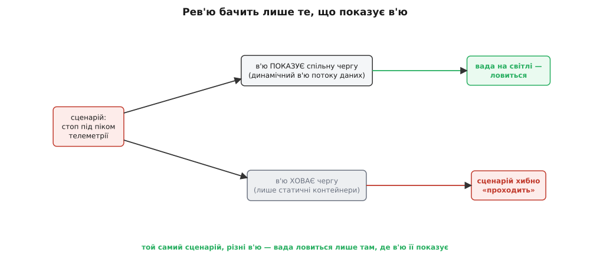
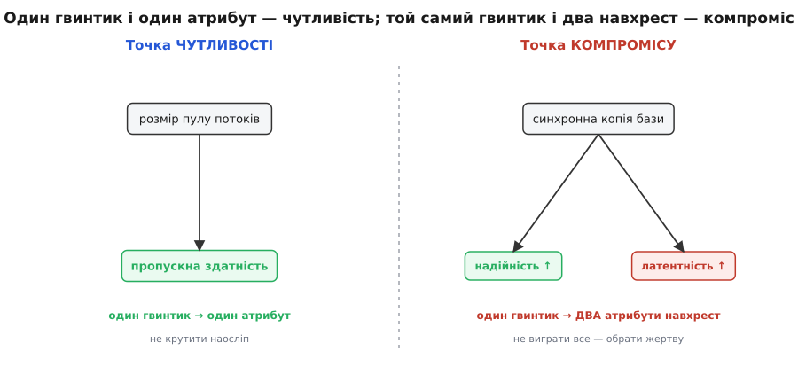

# Рев'ю архітектури як практика

<preknowlist>
- [Якісні атрибути («-ilities»)](book:programming/quality-attributes) — властивості «як добре», а не «що робить»: швидкодія, доступність, змінюваність, безпека.
- [Сценарії атрибутів](book:programming/attribute-scenarios) — як розмиту вимогу зробити вимірною через конкретну подію й числову міру відгуку.
- [Архітектурні драйвери](book:programming/architectural-drivers) — ті небагато вимог, що реально ліплять форму системи.
- [ATAM-лайт](book:programming/atam-lite) — думкою прогнати структуру крізь сценарії й дістати ризики, точки чутливості й компромісу.
- [Стейкхолдери та їхні системи](book:programming/stakeholders) — хто має інтерес до системи і що кожен від неї хоче.
- [Trade-off-аналіз](book:programming/tradeoff-analysis) — що таке компроміс між якостями й чому за один параметр б'ються кілька атрибутів.
- [Архітектурні в'ю](book:programming/architecture-views) — що архітектуру дивляться не одним кресленням, а набором в'ю під різні турботи.
</preknowlist>

Є сорт вад, який мовчить до самого падіння. Тест перевіряє, чи функція дає правильну відповідь; рев'ю коду — чи рядок написаний охайно; типізатор — чи сходяться типи на межах. Усі троє дивляться на **написане**. Але чи витримає система пік, чи переживе смерть вузла, чи дасть додати новий тип пристрою, не переписуючи половину, — це властивість не рядка й не функції, а **форми**: як ціле поділене на частини й хто з ким говорить. Такої вади не видно, коли дивишся на один файл, — вона живе в проміжках між файлами, і компілятор про неї не скаже нічого, бо кожен файл окремо бездоганний.

Рев'ю архітектури (англ. *review* — перегляд) — це навмисний спосіб дивитися на форму, а не на код, і робити це **регулярно, поки правити ще дешево**. Не «начальник схвалює креслення», а спільний розбір, де ставки на якості виносять на стіл і перевіряють думкою, доки вони ще думка, а не залитий у продукт факт. Базову механіку — не показуй, а питай; не проси шукати вади, а проси стверджувати; сценарій як валюта; знахідка з власником — можна викласти за пів години. Тут же ми відкриємо машину й подивимося, **чому** ці важелі працюють, **де** вони ламаються, і **як** відміряти зусилля рев'ю під ставку, а не наосліп. Бо рев'ю, зроблене не там або не так, гірше за відсутнє: воно імітує перевірку й присипляє.

## Дві речі, які насправді купує рев'ю

Легко думати, ніби рев'ю купує «якість». Це надто розмито, щоб чимось керувати. Насправді добре рев'ю купує рівно дві речі, і корисно тримати їх окремо, бо здобувають їх різними ходами.

**Перша — раннє виявлення на найкрутішій ділянці кривої вартості.** Вада, спіймана рано, коштує в рази менше, ніж та сама вада, спіймана пізно. Це спостереження Баррі Бьома (Barry Boehm) з *Software Engineering Economics* (1981), і його треба брати чесно, з поправкою на статус доказовості. Конкретні множники, що кочують галуззю, — «×1 у дизайні, ×10 у коді, ×100 у полі» — **слабко обґрунтовані**: Лоран Боссаві (Laurent Bossavit) у *The Leprechauns of Software Engineering* показав, що первинні дані під цю точну криву не витримують суворої перевірки, а сучасні практики (тести, безперервна інтеграція) криву помітно **сплюснули**. Що лишається твердим після цієї поправки — **якісний напрямок**: пізніше = дорожче, і для **структурних** вад ця крива найкрутіша з усіх. Чому найкрутіша — варто вивести, бо на цьому тримається вся економіка рев'ю.

**Друга — витягання прихованого конфлікту на світло.** Половина архітектурних катастроф — не від дурних рішень, а від **невимовлених**: хтось прийняв компроміс мовчки, ніхто не заперечив, бо в кімнаті не було того, кому цей компроміс болітиме. Найдорожчі рішення в архітектурі — це рішення **між людьми** (швидкість проти вартості, гнучкість проти простоти, свіжість проти навантаження), і рев'ю — та мить, коли ці люди опиняються за одним столом і чують одне одного, **поки** ще можна домовитися дешево. Цю здобич не дає жоден інструмент, бо конфлікт інтересів не видно в коді — його видно лише в розмові правильних людей.

> 🔧 **Навіщо це.** Розділяти дві здобичі корисно на практиці, бо вони підказують, коли рев'ю зайве. Якщо рішення тривіальне (крива вартості пласка — переграєш за день) **і** конфлікту інтересів немає (усі згодні) — рев'ю нічого не купує, це чистий податок. Якщо ж або крива крута (незворотне рішення), або в ставці стикаються турботи різних людей — рев'ю купує щось справжнє. Дві здобичі — це два різні датчики того, чи варто взагалі збиратися.

## Чому структурну ваду видно найпізніше і коштує найдорожче

Тепер про крутизну кривої для форми. Функціональна вада виявляє себе **детерміновано**: дав неправильний вхід — дістав неправильний вихід, і тест це ловить одразу, бо тригер — сам виклик. Структурна вада влаштована підступніше: вона **емерджентна** (лат. *emergere* — виринати), тобто виринає лише за збігу умов, яких у звичайному прогоні немає. Її тригери — не вхід функції, а три стани цілого, що в тесті одиниці майже не трапляються.

**Перший тригер — навантаження.** Спільна черга для стоп-команди й телеметрії працює бездоганно, доки телеметрії мало. Під піком черга набивається — і стоп спізнюється. Вада була в структурі від першого дня, але **проявилась** лише коли трафік перетнув поріг, якого на розробницькій машині ніхто не створює.

**Другий тригер — часткова відмова.** Синхронний виклик сусіднього сервісу тримається, доки сусід живий. Помер сусід — і твій сервіс зависає на кожному запиті, бо ніхто не поставив таймаут, і черга запитів росте, аж поки падаєш і ти. Локальний виклик так поводитися не вміє; це властивість **розподіленої** форми, невидима, доки всі вузли живі.

**Третій тригер — зміна.** Тип давача, зашитий у шести місцях замість одного, не болить, доки типів не додають. Приходить сьомий тип — і виявляється, що додати його означає торкнути пів кодової бази. Вада «жорсткої межі» весь час сиділа у формі; проявила її **вимога змінитися**.

Ось звідки крутизна. Функціональну ваду ловлять там, де вона народилася, — у коді, дешево. Структурну ваду код мовчки пропускає, бо жоден із трьох тригерів у коді не спрацьовує; вона просочується крізь тести, крізь рев'ю коду, крізь типізатор — і виринає в полі, під справжнім піком, справжньою відмовою, справжньою зміною. А в полі «виправити» означає не «переписати модуль», а **перекроїти форму**: розчепити те, що зрослося, розвести те, що злилося, — на живій системі з даними й користувачами. Тому крива вартості для форми найкрутіша: не тому, що структурні вади «складніші», а тому, що їх **виявляють на два поверхи пізніше**, ніж вони виникли. Рев'ю архітектури — це навмисна спроба зсунути виявлення назад, до моменту народження вади, штучно спитавши структуру про навантаження, відмову й зміну, доки їх ще нема.

## Спектр рев'ю: одне слово, п'ять дуже різних практик

Тут криється найчастіша плутанина. «Рев'ю архітектури» звучить як одна річ, а насправді це ціла **шкала** практик, які різняться формальністю, ціною й церемонністю на порядки. Плутати їх — означає або товкти важким молотом дрібний цвях (багатоденний обряд заради вибору бібліотеки логування), або лупити картонкою по фундаменту (кивок над діаграмою там, де ділять дані між сервісами незворотно). Розкладімо шкалу — і тоді стане видно, як обрати точку на ній під конкретну ставку.


*П'ять форм за однією назвою. Соло-прогін — ти сам проводиш кілька драйвер-сценаріїв крізь свою схему; вмирає самообманом. Парне рев'ю рішення (навколо [ADR](book:programming/architecture-decision-records)) — колега стверджує один сценарій за одним рішенням; вмирає вузьким колом. Активне командне рев'ю (ARID-клас) — мала команда жене драйвер-сценарії крізь незавершену форму; вмирає, ставши судом. Повне оцінювання (ATAM-клас) — стейкхолдери, дерево корисності, компроміси; заважке для дрібного. Архітектурна рада — централізовані ворота; вмирає вузьким місцем і театром. Права колонка — не пересторога, а діагноз: у кожної форми свій спосіб тихо померти.*

Придивімося до країв шкали, бо саме вони найповчальніші.

**Соло-прогін** — це рев'ю на одну голову. Ти сам береш три головні сценарії, проводиш їх крізь власну схему й чесно питаєш, де тонко. Коштує пів години, а ловить дивовижно багато — просто тому, що змушує **простежити**, а не помилуватися. Його смертельна вада вбудована: власних сліпих плям не видно за визначенням. Ти не спитаєш про клас ризику, якого не знаєш, — тому соло-прогін ловить помилки виконання («ось тут я не звів кінці»), але майже не ловить помилок кута зору («я взагалі не подумав про відмову вузла»). Це не привід ним нехтувати — це привід не вважати його достатнім там, де ставка велика.

**Архітектурна рада** (governance, від лат. *gubernare* — керувати) — протилежний край: централізований орган, крізь який мусить пройти кожне архітектурне рішення. У теорії — гарантія узгодженості; на практиці вона надійно перероджується у **вузьке місце й театр**. Механізм переродження варто назвати точно, бо він неминучий, а не випадковий. Рада — це спільний ресурс із обмеженою пропускною здатністю; коли крізь неї женуть **усі** рішення, черга росте, темп доставки впирається в розклад засідань, і команди роблять раціональну річ — **обходять**: вирішують мовчки, показують раді вже зроблене, перетворюють розбір на формальність зі штампом. Рада бачить не рішення, а їхню посмертну маску. Це той самий закон, що губить будь-яку систему, де спільний вузол обробляє потік, більший за свою ємність: не зловживання, а **перевантаження за конструкцією**.

Між краями — три робочі форми, і головне вміння тут: **брати найлегшу, що дає потрібну здобич**. Правило вибору те саме, що зважує всю архітектурну увагу, — [зворотність рішення](book:programming/reversible-irreversible-decisions/detail): рішення, яке легко переграти, не варте важкого рев'ю (переграєш дешевше, ніж розбиратимеш); рішення незворотне варте повного оцінювання, бо переграти його потім — переписати пів системи. Повне оцінювання ATAM-класу — не що інше, як [ATAM-лайт](book:programming/atam-lite/detail), піднятий до багатоденного обряду зі стейкхолдерами й тренованими оцінювачами; а щоденне рев'ю — той самий аналіз, лише дешевий і частий. Одна вправа на всій шкалі; змінюється тільки ціна й формальність, які ти платиш за неї.

## Механіка «стверджуй, не шукай» під мікроскопом

Наївна картинка рев'ю: скликати людей, показати діаграму, спитати «є заперечення?». Вона не працює **ніколи**, і зрозуміти механізм провалу — половина ремесла, бо той самий механізм підказує ліки. [Історія того, як рев'ю навчилося не показувати, а питати](book:programming/architecture-review/hist-review-lineage.md) — окрема нитка від Феґана через Парнаса й Вайса до ARID; тут нас цікавить сама когнітивна пружина.

Корінь проблеми — **пропуск за замовчуванням**. Коли людині показують готову діаграму й питають «є заперечення?», найлегша чесна відповідь — мовчання, і воно читається як згода. Щоб «пройти» таке рев'ю, рецензент не мусить робити **нічого** — досить не заперечити, а не заперечити можна й нічого не зрозумівши. Очі ковзають по знайомих формах, мозок добудовує «ну, певно, продумано», і жодне конкретне питання перед рецензентом не поставлене. Мовчання в кімнаті — це не «все добре»; це «ніхто по-справжньому не подивився».

Полагодити це можна лише одним ходом — **перевернути напрям зусилля**. Замість «знайдіть, що не так» (заперечення пасивне, його можна не робити) — «доведіть мені, що ось ця властивість тут тримається» (ствердження активне, його не зробиш, не простеживши). Різниця тонка на слух і величезна по суті. Заперечення — це пошук контрприкладу: не знайшов — промовчав, і незрозуміло, чи шукав. Ствердження — це побудова **позитивного доказу**: щоб чесно сказати «стоп укладається в 200 мс за будь-якого трафіку», рецензент **мусить** пройти шлях стопу крізь структуру, знайти всі черги на його дорозі, оцінити найгірший випадок — інакше стверджувати нема з чого. Прохання ствердити перетворює рев'ю з тесту на увагу («ти помітив?») на тест на розуміння («ти можеш це побудувати?»).

Це проєктує форму доброго питання. Питання має бути таким, що **на нього не можна відповісти навмання** — тільки справді розібравшись. «Як тобі ця черга?» — можна кивнути. «Проведи стоп-команду крізь цю структуру: де вона входить, якими компонентами йде, де стоїть у черзі, скільки займе за повної шини — і доведи, що вкладається в 200 мс» — кивнути не можна, треба пройти. Хороше питання **несе всередині траєкторію**, яку рецензент змушений відтворити.

Але тут чигає власна пастка, дзеркальна до пасивного кивка, — **театр ствердження**. Рецензент каже «так, тримається» — але не тому, що простежив, а тому, що так соціально легше, ніж зізнатися, що не розібрався. Ствердження без сліду простеження — той самий пасивний кивок, лише голосніший. Захист від нього один і механічний: **вимагати не вердикт, а трасу**. Не «тримається?» — «покажи мені шлях: назви компоненти по черзі, назви черги, назви найгірший випадок». Хто справді простежив — назве за секунди; хто грає — застрягне на першому кроці, і застрягання видно всім. Добрий фасилітатор ніколи не приймає голого «так»; він приймає **траєкторію, яка закінчується на "так"**. Практичний бік того, як вести таку сесію, щоб на виході був результат, а не вистава, — [зібрано в окремому рунбуку зі структурою рядка знахідки й пастками фасилітації](book:programming/architecture-review/proj-review-checklist.md).

## В'ю — це очі рев'ю: ловиш лише те, що показано

Тепер найглибший і найменш очевидний шар усієї практики. Рев'ю не дивиться на систему — воно дивиться на **представлення** системи: діаграму, модель, схему. А представлення завжди щось показує й **щось ховає** — у цьому весь сенс представлення, інакше воно дорівнювало б системі й було б так само незбагненним. Звідси залізний наслідок: **рев'ю здатне спіймати лише ту ваду, яку показує в'ю (англ. *view* — вид, представлення).** Якщо структурний елемент, у якому сидить вада, на в'ю відсутній, жоден, хай найгостріший, сценарій його не витягне — бо рецензентові немає на що дивитися.


*Рев'ю бачить лише те, що показує в'ю. Угорі: сценарій стопу проведено крізь динамічний в'ю потоку даних, де спільна черга видима, — вада виринає й ловиться. Унизу: той самий сценарій проведено крізь статичний в'ю контейнерів, де черги просто нема на схемі, — і структура хибно «проходить» рев'ю, бо ваду немає де побачити. Різниця не в старанності рецензента й не в гостроті сценарію, а в тому, чи показує обране в'ю той елемент, у якому сидить вада.*

Звідси головне практичне вміння: **добирати в'ю під тип сценарію**, а не навпаки. Кожен клас якості живе на своєму в'ю, і сценарій треба гнати крізь те в'ю, де його вада взагалі має шанс проявитися.

- **Сценарій швидкодії** (латентність, пропускна здатність) живе на **динамічному в'ю** — послідовності викликів, чергах, потоці даних у часі. На статичній схемі компонентів затримка невидима: коробки й стрілки не мають часу. Женеш сценарій латентності крізь статичний в'ю — і черга, у якій команда чекає, просто відсутня на картинці.
- **Сценарій доступності** (падіння вузла, відмова залежності) живе на **в'ю розгортання** — де показано, що на чому працює, які межі процесів і машин, де межа мережі. [В'ю розгортання й динамічні в'ю](book:programming/deployment-view) показують саме те, що ховає логічна діаграма: одна логічна «база даних» може бути одним фізичним вузлом — єдиною точкою відмови, — і це видно лише там, де малюють залізо, а не поняття.
- **Сценарій змінюваності** (додати тип, замінити постачальника) живе на **в'ю модулів** — залежностях між одиницями коду. Тут видно, чи тип давача просочився в шість модулів, чи замкнений в одному; на в'ю розгортання цього не видно взагалі.

Ось чому дисципліна документування — [C4](book:programming/c4-model), 4+1 і [viewpoints Розанські та Вудса](book:programming/viewpoints-perspectives), arc42 — не бюрократія, а **боєприпаси рев'ю**. Ці набори в'ю існують саме тому, що одна діаграма не може показати все, а кожна якість вимагає свого зрізу. Коли команда каже «у нас є архітектурна діаграма» — правильне питання не «гарна вона?», а «**що вона ховає?**»: який тип сценарію проскочить крізь неї, не зачепивши жодного намальованого елемента. Бо саме там, у ненамальованому, і сидить вада, яку рев'ю не спіймає, скільки не питай.

> 🔧 **Навіщо це.** Практичний прийом, що прямо випливає: перед рев'ю склади список драйвер-сценаріїв — і **під кожен добери в'ю**, на якому його вада могла б проявитися. Якщо під якийсь сценарій потрібного в'ю немає — це не привід пропустити сценарій, це сигнал **домалювати в'ю**. Найдешевша знахідка рев'ю часто така: «у нас нема жодного в'ю, де видно потік даних під піком, — тому ми досі не знаємо, чи тримається латентність». Відсутність в'ю — теж знахідка, і то одна з найважливіших.

## Чотири знахідки, і два, що їх вічно плутають

Прогнавши сценарій крізь потрібне в'ю, шукаєш чотири речі. Дві з них — те, задля чого рев'ю взагалі є, а дві інші вічно плутають, і плутанина коштує грошей.

**Ризик** — рішення, яке **може не витягти** сценарій: «стоп у спільній черзі з телеметрією; під піком може спізнитися». Це не вирок, а **непевність, яку треба зняти** — виміряти, перебудувати, підстрахувати. **Неризик** — рішення, яке сценарій **надійно тримає, і це обґрунтовано**: «стоп іде окремим апаратним перериванням, поза чергою — 200 мс тримаються завжди». Неризик цінний не менше за ризик: він каже, де **не треба** сипати грошима на страховку. Переплутати неризик із ризиком — марно спалити бюджет на зміцнення того, що й так надійне; переплутати ризик із неризиком — лишити відкриту діру, вважаючи її залатаною.

А ось два, що зливаються в одне й від того шкодять. **Точка чутливості** — параметр структури, від якого сильно залежить **один** атрибут (розмір пулу потоків тримає пропускну здатність). **Точка компромісу** — та сама чутлива точка, що тягне **кілька** атрибутів **навхрест** (синхронна копія бази піднімає надійність і опускає швидкодію). Різниця не косметична, і її варто побачити механічно.


*Різниця в тому, скільки атрибутів тягне один гвинтик. Ліворуч: розмір пулу потоків сильно впливає на пропускну здатність — один параметр, один атрибут: це чутливість, гвинтик, який не крутять наосліп, але який ні з чим не конфліктує. Праворуч: синхронна копія бази піднімає надійність і водночас опускає швидкодію — один параметр, два атрибути в протилежні боки: це компроміс, де не виграти все й треба свідомо обрати жертву. Компроміс — це, по суті, чутливість, у якій за один гвинтик тримаються дві якості одразу.*

Ключ до плутанини: **компроміс — це окремий випадок чутливості**, а саме чутливість, у якій до одного параметра прив'язано **більше ніж один** атрибут, і прив'язано **різнознаково**. Тому всі точки компромісу є точками чутливості, але не навпаки. Практичний наслідок гострий: коли на рев'ю знайшли чутливу точку, наступне обов'язкове питання — «а який ще атрибут висить на цьому ж параметрі, і в який бік?». Якщо жоден — це чиста чутливість, крути обережно й спокійно. Якщо є, і в протилежний бік, — це компроміс, і головна робота рев'ю тут **не розв'язати** його (розв'язати неможливо — фізику не обдуриш), а **витягти на світло** й призначити власника, який свідомо обере жертву. Бо компроміс, залишений без власника, не зникає — він ухвалюється **мовчки й найгіршим чином**, за замовчуванням, тим, хто першим напише код, не знаючи, що б'ється за спільний параметр. [Як зважувати такі компроміси свідомо, з числами, а не наосліп](book:programming/tradeoff-analysis) — окреме ремесло; робота ж рев'ю — гарантувати, що жоден компроміс не лишився захованим і безхазяйним.

Наприкінці доброго рев'ю маєш не «загалом схвалено», а **два списки**: ось тут ризиковано (сюди підуть гроші й час) і ось тут спокійно, бо обґрунтовано (тут не чіпаємо) — плюс перелік чутливих точок і компромісів із власниками. Без такого поділу команда або страхує все підряд — дорого й повільно, або не страхує нічого — аж поки впаде.

## Скільки коштує саме рев'ю: беззбитковість на серветці

Рев'ю — не безкоштовне: це години дорогих людей. Тож на нього треба дивитися так само, як воно вчить дивитися на все інше, — **як на ставку з очікуваною цінністю**. Порахуймо її на серветці, а тоді витягнемо з формули те саме правило «ревʼюй незворотне», але вже не як заповідь, а як наслідок.

Рев'ю окупається, коли **очікувана заощаджена переробка перевищує його вартість**. Заощаджена переробка — це не повна ціна вади в полі, а ця ціна, зважена на дві ймовірності: що вада взагалі є, і що рев'ю її зловить.

**Умова: чи варте рев'ю рішення про спільну чергу для стоп-команди.**
```
P(латентна вада)   ≈ 0.3      # шанс, що структура таки не витягне пік
P(рев'ю зловить)   ≈ 0.8      # добрий склад кімнати ловить ~4 з 5
ціна_в_полі        = 500 год  # відкликання, гарячі патчі, втрата довіри
ціна_зараз         = 8 год    # перекроїти планувальник на папері
вартість_рев'ю     = 6 год    # троє людей × дві години

вигода = P(латентна) · P(зловить) · (ціна_в_полі − ціна_зараз)
       = 0.3 · 0.8 · (500 − 8)
       = 0.24 · 492
       ≈ 118 год очікуваної заощадженої переробки

EV = вигода − вартість_рев'ю
   = 118 − 6
   ≈ +112 год
```

Очікувана цінність різко додатна — рев'ю окупається у сотні разів. Тепер найцікавіше: з тієї самої формули видно, **коли воно НЕ окупається**, і чому правило зворотності не примха, а математика. Уся вигода тримається на множнику `(ціна_в_полі − ціна_зараз)` — на **різниці** між тим, скільки коштує виправити пізно й рано. Для **зворотного** рішення (легко переграти) ця різниця мала: `ціна_в_полі ≈ ціна_зараз`, бо переграти пізно майже так само дешево, як рано. Множник стискається до нуля — і вся вигода з ним, хоч би якою високою була ймовірність вади. Для **незворотного** рішення `ціна_в_полі` вибухає (переписати пів системи на живих даних), різниця величезна, вигода величезна. Ось чому «ревʼюй незворотне, не чіпай зворотне» — не стиль, а прямий наслідок: рев'ю живиться саме **різницею** вартостей рано й пізно, а цю різницю створює незворотність.

Формула підказує й межу беззбитковості. Рев'ю варте, доки `вигода > вартість_рев'ю`, тобто доки

```
P(латентна) · P(зловить) · (ціна_в_полі − ціна_зараз) > вартість_рев'ю
```

Звідси видно три важелі, якими рев'ю роблять вартим: піднімати `P(зловить)` (правильний склад кімнати й активні питання), брати рішення з великою `(ціна_в_полі − ціна_зараз)` (незворотні) і тримати `вартість_рев'ю` низькою (найлегша форма зі спектра, що дає потрібну здобич). Повне [виведення — з граничною цінністю зайвого рецензента (спадна віддача), порогом імовірності беззбитковості й чутливістю рішення до самих оцінок](book:programming/architecture-review/math-review-economics.md) — окрема математика; тут досить, що «серветка» вже дає працездатне правило: **не рахуй точно, рахуй порядок** — якщо очевидно, що вигода на порядок більша за вартість, збирайся; якщо на порядок менша — не витрачай людей. Прикидка «на серветці» тут — не недбальство, а [свідомий інструмент оцінки під невизначеністю](book:programming/back-of-envelope/detail): точні числа тут усе одно фантомні, а порядок величини чесний і достатній для рішення.

## Від разового розбору до постійного: сценарій як фітнес-функція

У всякого рев'ю є вбудована слабкість, про яку легко забути: воно ловить **знімок**. Сьогодні структуру прогнали крізь сценарій, вона тримається — і це правда про **сьогоднішню** форму. Але код живе далі: хтось додасть залежність, хтось зріже кут під дедлайн, хтось не знатиме про ставку, яку рев'ю благословило, — і за пів року стоп знову потече крізь чергу телеметрії, бо межу, яку тримало рев'ю, ніхто більше не стереже. [Ерозія архітектури](book:programming/architecture-erosion) — це і є повільне розмивання рішень, які колись були правильні; разове рев'ю проти неї безсиле, бо його висновок не має способу пережити наступний коміт.

Ліки — перетворити знахідку рев'ю з **разового вердикту** на **стоячу перевірку**. Сценарій, який пройшов рев'ю, часто можна закодувати як **фітнес-функцію** (англ. *fitness* — пристосованість, термін з еволюційної біології): виконуваний тест, що безперервно стверджує ту саму властивість форми, яку рев'ю ствердило вручну. Різниця в тому, що людина стверджує раз, а фітнес-функція — на кожному коміті, вічно. [Фітнес-функції як спосіб зробити архітектурну властивість виконуваною](book:programming/fitness-functions) — окрема тема; тут важливий сам місток: **рев'ю знаходить правило, фітнес-функція його стереже**.

Ось наш сценарій стопу, застиглий у стоячу перевірку залежностей. Рев'ю ствердило: «шлях аварійного стопу не залежить від черги телеметрії». Закодуймо це так, щоб порушення межі валило збірку, а не поле через пів року:

:::tabs
```ts
// Сценарій, що пройшов рев'ю, стає стоячою фітнес-функцією:
// «шлях аварійного стопу НЕ залежить від черги телеметрії».
// Порушиш межу — впаде CI, а не поле через пів року.
import { moduleGraph } from "./arch";

const STOP = "control/estop";
const TELEMETRY_QUEUE = "telemetry/queue";

test("аварійний стоп не тече крізь чергу телеметрії", () => {
  const reachable = moduleGraph.dependenciesOf(STOP); // усі транзитивні залежності
  expect(reachable).not.toContain(TELEMETRY_QUEUE);
});
```
```py
# Сценарій, що пройшов рев'ю, стає стоячою фітнес-функцією:
# «шлях аварійного стопу НЕ залежить від черги телеметрії».
# Порушиш межу — впаде CI, а не поле через пів року.
from arch import module_graph

STOP = "control/estop"
TELEMETRY_QUEUE = "telemetry/queue"

def test_estop_not_through_telemetry_queue():
    reachable = module_graph.dependencies_of(STOP)  # усі транзитивні залежності
    assert TELEMETRY_QUEUE not in reachable
```
:::

Пуант не в коді, а в зсуві: рев'ю, яке породжує фітнес-функції, перестає бути подією й стає **безперервним**. Це і є суть [еволюційної архітектури як дефолту](book:programming/evolutionary-architecture) — не «спроєктували правильно раз», а «поставили сторожів, які тримають правильність, поки система міняється». Не всяку знахідку рев'ю можна так закодувати: «чи розумний цей поділ на контексти» машина не перевірить, це судження людини. Але межу залежності, поріг латентності в навантажувальному тесті, відсутність циклу в модулях, факт, що жоден сервіс не читає чужу базу напряму, — усе це кодується, і кожна така знахідка, ставши фітнес-функцією, більше **ніколи не потребує ручного рев'ю**. Рев'ю тоді зосереджується на тому, що лишилось людським, а механічне віддає машині — і від того дорожчає кожна година кімнати.

## Хто вирішує і хто радить: маятник від ради до процесу поради

Досі ми говорили про рев'ю як про **сесію**. Але є ширше питання, від якого залежить, чи взагалі рев'ю живе в організації: **хто має право вирішувати архітектурне, і чия згода потрібна?** Відповідь на нього історія розгойдувала маятником між двома крайнощами, і обидві варто знати, бо на кожній сидить своя катастрофа.

Один край — **централізована архітектурна рада**. Усі значущі рішення проходять крізь орган експертів, що затверджує їх на відповідність стандартам; так улаштовано, наприклад, врядування в TOGAF з його Architecture Board. Спокуса очевидна: узгодженість, єдині правила, досвід у одних руках. Розплата теж уже названа вище — рада стає **вузьким місцем**: черга на затвердження росте, темп доставки впирається в розклад, команди навчаються обходити орган, показуючи йому вже зроблене. Рада починає бачити не рішення, а їхні посмертні маски, і **врядування вироджується в театр**: штамп є, впливу нема.

Природна реакція на задушливу раду — **розпустити її зовсім**, віддати рішення командам. Але гола децентралізація народжує дзеркальну біду: кожна команда вирішує в себе, ніхто не бачить цілого, і за рік система розповзається на несумісні острови — те саме, що [закон Конвея](book:programming/conways-law) обіцяє від роз'єднаних команд, лише без жодного механізму, який тримав би узгодженість. Маятник хитнувся від «усі рішення нагорі» до «жодного спільного погляду» — і друга крайність не краща за першу.

Вихід, який визрів на цьому маятнику, — **процес поради** (advice process). Його ядро: **будь-хто може ухвалити будь-яке рішення — за умови, що спершу спитав пораду (не дозвіл) у двох груп: усіх, кого рішення суттєво зачепить, і тих, хто має фах у цьому питанні.** Пораду треба **врахувати**, але не обов'язково послухатися; право рішення лишається за тим, хто його ухвалює й нестиме наслідки. Це не компроміс між централізацією й хаосом, а третій хід: рішення децентралізоване (нема вузького місця й воріт), але не ізольоване (обов'язок спитати зачеплених і експертів зшиває систему в ціле). [Історія цього маятника — від корпоративного «процесу поради» до застосування його саме в архітектурі](book:programming/architecture-review/hist-advice-process.md) — окрема нитка з іменами й датами; для практики важливе інше.

Придивись, що процес поради робить із самим рев'ю: він **вбудовує рев'ю в кожне рішення**, замість збирати окрему сесію постфактум. «Спитати пораду в зачеплених і фахівців» — це і є рев'ю, лише проведене **автором до рішення**, а не радою після. Валюта та сама — сценарій із мірою; механіка та сама — стверджуй, не показуй; склад той самий — за [турботами стейкхолдерів](book:programming/stakeholders/detail). Змінюється лише **хто скликає**: не ворота, крізь які женуть, а обов'язок автора, який хоче рішення. Рев'ю з події, що стається **з** тобою, стає дією, яку робиш **ти**, — і саме тому воно масштабується там, де централізована рада захлинається.

> 🔧 **Навіщо це.** Роль архітектора в цій картині перевертається — і це найпрактичніший висновок. Він перестає бути воротарем, що каже «так» чи «ні», і стає тим, хто **робить добрі рішення можливими**: пише спільні принципи, за якими команди звіряються самі; тримає простір, де радяться чесно; ставить питання, а не виносить вироки. Архітектор, який особисто затверджує все, — це вузьке місце на дві ноги; архітектор, який навчив організацію радитися перед рішенням, — це важіль, що працює й без нього в кімнаті.

## Рев'ю того, що вже збудовано

Досі йшлося про рев'ю **майбутнього** — розбір проєкту, поки він проєкт. Але є другий, часто пропущений рід: рев'ю **сущого** — розбір системи, яка вже роками працює. Механіка та сама, а от вихідні дані підступно інші, і не побачити цю відмінність — типова помилка.

Перша відмінність: **драйвери відпливли**. Систему будували під одні якості, а вимоги відтоді змінилися — виросло навантаження, з'явилися нові типи клієнтів, посилилися вимоги приватності. Тому рев'ю сущого починається не з форми, а з **перепитування драйверів**: під які якості ця система критична **тепер**, а не тоді, коли її задумували. Часто найбільша знахідка тут — саме розрив: структура досі оптимальна під драйвери п'ятирічної давнини й катастрофічна під сьогоднішні.

Друга відмінність, важча: **справжньої архітектури ніхто не знає**. Діаграми застаріли або їх нема; форма, яку рев'ю мусить розбирати, живе лише в коді й у головах, і половину зв'язків ніхто не пам'ятає. Тож рев'ю сущого спершу мусить **відновити** в'ю — витягти реальну структуру залежностей із коду, з конфігів розгортання, з трас у продакшені, — і аж тоді гнати крізь неї сценарії. Це вже [археологія legacy](book:programming/legacy-archaeology): відкопати справжню форму, перш ніж її оцінювати. Небезпека — розбирати **уявну** архітектуру з застарілої діаграми замість справжньої з коду; тоді рев'ю ствердить властивості системи, якої давно нема.

Тут рев'ю зливається з боротьбою проти [ерозії](book:programming/architecture-erosion): регулярний розбір сущого — це спосіб **помітити дрейф**, поки він ще дрейф, а не руїна. Прогнав торішні драйвер-сценарії крізь сьогоднішню форму, побачив, що два з них уже не тримаються, — ось карта, куди йде наступний цикл зміцнення. Без такого періодичного погляду ерозія накопичується мовчки, як і будь-яка структурна вада, і виринає найгіршим способом — падінням під навантаженням, якого «торік ще тримали».

## Чи працюють твої рев'ю взагалі

Лишається питання, яке рідко ставлять, а варто, бо без нього рев'ю саме перетворюється на ту пасивну виставу, від якої мало б рятувати: **як знати, що твої рев'ю взагалі щось ловлять?**

Найпряміший датчик — **аналіз того, що втекло**. Коли структурна вада все-таки вибухнула в полі, чесне питання не «хто винен», а «**чи проходила ця частина форми рев'ю, і чому ваду не спіймали?**». Відповідь щоразу вказує на дірку в самому рев'ю: не було потрібного в'ю (вада сиділа в ненамальованому), не було потрібного стейкхолдера (клас ризику нікому було впізнати), питання було пасивне (кивнули замість простежити), знахідку назвали, але лишили без власника (померла на столі). Кожна втеча — безкоштовний урок про те, як латати не систему, а **процес її розбору**.

І остання пастка, найтихіша: **рев'ю, яке завжди все схвалює.** Здається, це добре — «у нас усе гаразд». Насправді рев'ю, що ніколи нічого не знаходить, майже напевно **сліпе**, а не досконале: жива система завжди має ризики й компроміси, і якщо розбір їх не бачить, він дивиться не туди або не так. Порожній реєстр на виході — не привід радіти, а привід підозрювати виставу. Здорове рев'ю **майже завжди щось знаходить** — і саме тому лишається живим.

## Звичка, а не подія

Зберімо нитку. Рев'ю архітектури — це навмисне виявлення структурних вад **до** того, як їх виявить поле, куплене двома здобичами: раннім спійманням на найкрутішій ділянці кривої вартості й витяганням прихованих конфліктів на світло. Працює воно на одному важелі — **не показуй, а питай; не проси заперечувати, а проси стверджувати, і вимагай трасу, не вердикт**, — прикладеному до **правильного в'ю**, бо ловиш лише те, що в'ю показує. Валюта розбору — сценарій із мірою, вирощений з драйверів; здобич — два списки (ризиковано / спокійно) плюс названі чутливості й компроміси, кожне з власником; доля здобичі — стекти в [живий ризик-реєстр](book:programming/risk-register/detail) і в [записи рішень](book:programming/architecture-decision-records), а найкраще — застигнути у фітнес-функцію, що стереже межу далі без людини.

А відміряти все це треба економічно: важку форму рев'ю берегти для незворотного, де різниця вартостей рано й пізно вибухає й окупає обряд; дрібне й зворотне лишати дешевій формі або зовсім не чіпати. І масштабувати не воротами, а **процесом поради**, який вбудовує рев'ю в кожне рішення й тому не стає вузьким місцем. Роблене регулярно, поки правити дешево, під [невизначеність, яку не уникнути](book:programming/deciding-under-uncertainty), це те саме, що робить важкий метод ATAM-класу, — лише дешево й часто, а не раз на рік великим обрядом.

Тому рев'ю архітектури — не подія, а **звичка**: постійно виносити ставки на світло, поки вони ще думка. Вада, схована в структурі, мовчить до самого падіння; єдиний спосіб почути її раніше — навмисне сісти й спитати структуру про навантаження, відмову й зміну, яких ще нема, крізь в'ю, де відповідь взагалі видно. Хто питає регулярно, той ловить дорогі вади дешевими; хто не питає, той платить за них у полі — за найгіршим із можливих курсів.
