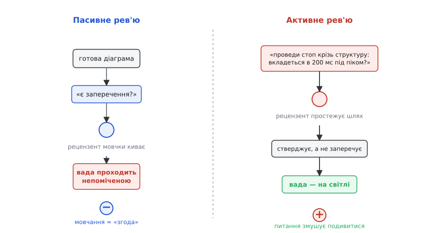

# Рев'ю архітектури як практика

<preknowlist>
- [Якісні атрибути («-ilities»)](book:programming/quality-attributes) — властивості системи «як добре» (швидкодія, доступність, змінюваність), а не «що робить».
- [Сценарії атрибутів](book:programming/attribute-scenarios) — спосіб зробити розмиту вимогу вимірною через конкретну подію й числову міру відгуку.
- [Архітектурні драйвери](book:programming/architectural-drivers) — ті небагато вимог, що реально ліплять форму системи.
</preknowlist>

Є сорт вад, який мовчить до самого падіння. Тест перевіряє, чи функція дає правильну відповідь; рев'ю коду — чи рядок написаний охайно; типізатор — чи сходяться типи. Усі троє дивляться на **написане**. Але чи витримає система пік, чи переживе смерть вузла, чи дасть додати новий тип пристрою, не переписуючи половину, — це властивість не рядка й не функції, а **форми**: як ціле поділене на частини й хто з ким говорить. Такої вади не видно на одному файлі — вона живе в проміжках між файлами, і компілятор про неї не скаже нічого, бо кожен файл окремо бездоганний.

І коштує вона найдорожче. Доки не даси навантаження, не вб'єш вузол, не спробуєш дописати новий тип — вона мовчить; а коли заговорить, «виправити» означає вже не переписати модуль, а перекроїти форму на живій системі з даними й користувачами. Звідси проста потреба: **треба спосіб дивитися на форму, а не на код** — регулярно, поки правити ще дешево. Це і є рев'ю архітектури (англ. *review* — перегляд): не «начальник схвалює креслення», а спільний розбір, де ставки на якості виносять на стіл і перевіряють думкою, доки вони ще думка, а не залитий у продукт факт.

## Чому «показати діаграму» не працює

Напрошується наївна картинка: скликати людей, показати діаграму, спитати «є заперечення?» — і хто побачить ваду, той скаже. Ця картинка **не працює ніколи**, і зрозуміти, чому, — половина ремесла.

Коли людині показують готову діаграму й питають «є заперечення?», найлегша чесна відповідь — мовчання, і воно читається як згода. Щоб «пройти» таке рев'ю, рецензент не мусить зробити **нічого**: досить не заперечити, а не заперечити можна й нічого не зрозумівши. Очі ковзають по знайомих формах, мозок добудовує «ну, певно, продумано» — і жодне конкретне питання перед рецензентом так і не постало. Мовчання в кімнаті — це не «все добре»; це «ніхто по-справжньому не подивився».

## Головний важіль: не показуй — питай; не заперечуй — стверджуй

Полагодити це можна одним ходом — **перевернути напрям зусилля**. Замість «ось діаграма, кажіть» — конкретне питання, на яке не можна кивнути мовчки: «оператор тисне аварійний стоп на повному ході приводу — проведи цю подію крізь структуру й скажи, де вона піде, скільки займе й де може спізнитися». Тепер рецензент **мусить** пройти шлях, а не ковзнути по ньому.

І ще тонший розворот: замість «шукайте, що не так» — прохання **ствердити**: «доведи мені, що 200 мс тут тримаються завжди». Різниця тонка на слух і величезна по суті. Заперечення — це пошук контрприкладу: не знайшов — промовчав, і незрозуміло, чи шукав узагалі. Ствердження — це побудова **позитивного доказу**: щоб чесно сказати «стоп укладається в 200 мс за будь-якого трафіку», рецензент **мусить** простежити шлях стопу крізь структуру, знайти всі черги на його дорозі, оцінити найгірший випадок. Збрехати «тримається» важче, ніж промовчати «ніби нормально». Так рев'ю з ритуалу згоди стає роботою розуму. Цей розворот — не вигадка практиків: [саме так активні рев'ю дизайну навчилися не показувати, а питати ще в 1985-му](book:programming/architecture-review/hist-review-lineage.md).


*Пасивне рев'ю над готовою діаграмою ловить мало: очі ковзають, мовчання читається як згода. Активне рев'ю ставить рецензентові конкретне питання за сценарієм («проведи стоп-команду крізь цю структуру — вкладеться в 200 мс під піком телеметрії?») і просить стверджувати, а не заперечувати. Різниця не в старанності людей, а в тому, що конкретне питання змушує подивитися туди, куди пасивний погляд не дійшов би.*

Щоб питання справді змушувало думати, воно мусить спиратися не на смак, а на **сценарій із мірою**. «Добра ця архітектура чи ні» — це війна вподобань без дна: одному до душі мікросервіси, іншому моноліт. [Сценарій якості](book:programming/attribute-scenarios) розв'язує це: він розкладає вимогу на конкретну подію й **числову міру відгуку** — не «система має бути швидкою», а «оператор тисне стоп на повному ході → мотор стоїть за < 200 мс». Це вже не балачка, а ставка, яку видно; і рев'ю має чим зайнятися — провести цей рядок крізь структуру й сказати, тримається межа чи ні. Беруть не всі сценарії підряд, а вирощені з [архітектурних драйверів](book:programming/architectural-drivers) — тих кількох вимог, що реально ліплять форму: небезпека сидить там, де якість важлива для успіху **і** важко дається структурі.

> 🔧 **Навіщо це.** Це правило робить рев'ю дешевим і чесним водночас. Дай рецензентові пасивну діаграму — і навіть найкращі люди в кімнаті нічого не спіймають, бо їм не поставлено питання. Дай конкретний сценарій із мірою й попроси **ствердити** — і та сама кімната витягне ваду, повз яку пройшла б мовчки. Тому добре питання формулюють так, щоб на нього не можна було відповісти навмання: воно несе всередині траєкторію, яку рецензент змушений відтворити крок за кроком.

## Знахідка без власника — не знахідка

Припустимо, розбір удався: провели сценарії, витягли ризики на світло. Тут чигає остання й найтихіша пастка. Наговорили розумного, покивали, розійшлися — і **за тиждень від рев'ю не лишилось сліду**. Ризики, названі вголос, живуть у пам'яті трьох людей, двоє з яких забудуть; жоден не має власника; жоден не перевіриться. Прожектор увімкнули, підсвітили, куди дивитись, — і вимкнули, не записавши координат.

Тому рев'ю без **артефакту на виході** — витрачений час. Кожна знахідка мусить стати рядком із власником і станом: **що саме ризиковано, хто відповідає за зняття, як знімемо (вимір / прототип / перебудова), до якого дня**. Найпростіша форма — таблиця, яку веде хтось один прямо під час розбору; ось той самий рядок як структура в коді прошивки, що сама стежить за своїми архітектурними ставками:

```c
typedef enum { RISK_OPEN, RISK_MITIGATING, RISK_CLOSED } risk_state_t;

typedef struct {
    const char  *scenario;  // сценарій із мірою, що народив ризик
    const char  *finding;   // чим саме структура може не витягти
    const char  *owner;     // хто відповідає за зняття; не "команда"
    risk_state_t state;     // відкрито → знімається → знято
    uint32_t     due_day;   // дедлайн зняття, день від старту проєкту
} arch_risk_t;
```

Пуант не в мові, а в тому, що знахідка **має ім'я, власника й стан**. `owner`, що дорівнює «команда», означає, що не відповідає ніхто; `RISK_OPEN`, за яким ніхто не стоїть, — це знахідка, яка помре мовчки. Наприкінці доброго рев'ю маєш не «загалом схвалено», а **два списки**: ось тут ризиковано (сюди підуть гроші й час) і ось тут спокійно, бо обґрунтовано (тут не чіпаємо). Куди ці рядки течуть далі й як провести саму сесію, щоб на виході був реєстр, а не протокол, — [зібрано в окремому рунбуку зі структурою рядка знахідки й пастками фасилітації](book:programming/architecture-review/proj-review-checklist.md).

## Не подія, а звичка

Рев'ю архітектури варте не всякого рішення. Те, що легко переграти (яку бібліотеку логування взяти), розбирати марно — переграєш за день; те, що **незворотне** (як ділимо дані між сервісами), варте години, бо переграти його потім — переписати пів системи. Приберігай цей інструмент для тих небагатьох рішень, де помилка дорога, а спіймати її пізно — ще дорожче; обкладати ним кожну дрібницю — і рев'ю справедливо зненавидять як бюрократію.

І масштаб гнучкий: у пет-проєкті рев'ю — це пів години, коли ти сам проводиш три головні сценарії крізь власну схему; у продукті на сотні людей — регулярна сесія з потрібними людьми й реєстром на виході. Міняється глибина й формальність, не суть. А суть — в одному русі, що відрізняє живе рев'ю від вистави: **не показати й дочекатися згоди, а спитати й вимагати ствердження — і жодну знахідку не відпустити без імені того, хто доведе її до кінця**. Кімната, яка вміє тільки кивати над діаграмою, лагідно бреше собі, що перевірилась; кімната, яка жене сценарій крізь структуру й записує ризик із власником, справді ловить дорогі вади дешево — доки вони ще думка, а не залитий у продукт факт.
