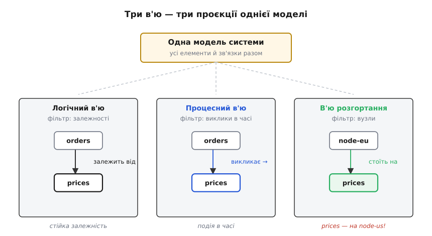

# Архітектурні в'ю

<preknowlist>
- [Стейкхолдери та їхні системи](book:programming/stakeholders) — хто має інтерес до системи (замовник, розробник, експлуатація, безпека) і що кожен від неї хоче; в'ю малюють саме під ці інтереси.
- [Якісні атрибути («-ilities»)](book:programming/quality-attributes) — властивості системи поза функціями (продуктивність, доступність, змінюваність); частина в'ю показує саме їх, а не функції.
- [Роль архітектора](book:programming/architect-role) — що таке архітектурне рішення; в'ю — головний спосіб таке рішення показати й винести на обговорення.
</preknowlist>

Архітектуру не сфотографуєш. Її немає в жодному файлі: це не код, не база, не сервер — це **форма**, у якій усе те живе, набір рішень про межі й зв'язки. А про форму, якої не видно, команда може говорити лише одним способом — **намалювавши її**. Тому діаграма для архітектора не прикраса звіту, а основний інструмент: нею він думає, нею домовляється, нею ловить помилку до того, як та обросте кодом.

І тут майже кожен спотикається об одну й ту саму спокусу — намалювати **всю систему на одному аркуші**. Береш прямокутники для всіх сервісів, баз, черг, зовнішніх систем, з'єднуєш їх усіма стрілками, які згадав, — і за півгодини маєш полотно, у якому вже сам не знаходиш, звідки куди йде запит. Така діаграма показує все й тому не показує нічого: у ній тоне і структура коду, і потік даних, і розгортання на залізо — три різні речі, зліплені в одну кашу.

## Чому одна діаграма завжди програє

Причина не в невмінні малювати, а в самій природі архітектури: вона багатовимірна. Одна й та сама система водночас **складається з частин** (модулі, класи, шари), **щось робить у часі** (процеси, потоки, запити ходять туди-сюди) і **лежить на залізі** (сервери, контейнери, мережі). Це три незалежні виміри — знати один нічого не каже про інші. Модуль коду може розтягтися на п'ять серверів; один сервер може тримати десять модулів. Спробуй показати всі три виміри на одній площині — і лінії неминуче почнуть означати різне (тут «викликає», там «розгорнуто на», отам «залежить від»), а читач загубить, яка стрілка про що.

> 🔧 **Навіщо це.** Коли на рев'ю показують «діаграму всієї системи» й половина кімнати мовчить, бо не розуміє, куди дивитися, — це не тому, що люди неуважні. Діаграма просто змішала їхні різні турботи в одне полотно: тестувальник шукає межі відповідальності, адмін — де що розгорнуто, розробник — від чого залежить його модуль, і жоден не бачить свого. Розділені в'ю прибирають цей шум: кожен дивиться туди, де його питання, і бачить лише його.

Вихід підказує сама геометрія. Коли інженер креслить деталь, він не малює її «як є» в об'ємі — він дає **проєкції**: вигляд спереду, зверху, збоку, розріз. Кожна проєкція — площина, на яку деталь спроєктовано з одного боку; разом вони описують об'ємну річ без жодної об'ємної картинки. Архітектура робить те саме. Кожна діаграма — **в'ю** (view — вид, погляд): проєкція системи **з одного боку, під одну турботу**. Не «вся система», а «система очима того, кого цікавить ось це».

## В'ю — це проєкція однієї моделі, а не окремий малюнок

Тут ховається тонкість, яку легко проґавити. В'ю — не самостійні картинки, що випадково стосуються однієї системи. Це **проєкції однієї спільної моделі**. Є один набір справжніх фактів про систему — які є елементи, як вони пов'язані, де лежать. В'ю логічний бере з цього набору «які модулі й від чого залежать», в'ю процесний — «які процеси й хто кого викликає в часі», в'ю розгортання — «що на якому вузлі стоїть». Один і той самий елемент (скажімо, сервіс цін) з'являється в кількох в'ю під різними кутами: у логічному він — модуль поряд із сусідами, у розгортанні — процес на конкретному сервері.



*Три в'ю — не три різні системи, а три проєкції однієї. Той самий сервіс цін проступає в кожному під своєю турботою; жодна проєкція не бреше, але й жодна не показує всього.*

Практичний наслідок цього — **узгодженість**. Якщо в'ю справді проєкції однієї моделі, вони не можуть суперечити: сервіс, якого немає в логічному в'ю, не має права з'явитися в розгортанні. Коли ж діаграми малюють нарізно, руками, без спільного джерела, вони тихо розповзаються — на одній сервіс є, на іншій уже перейменований, на третій його забули стерти. Тому зрілі команди тримають опис системи **як дані** (текст, з якого генерують усі в'ю), а не як набір непов'язаних картинок; цю практику звуть [діаграми як код](book:programming/diagrams-as-code), і саме вона гарантує, що всі проєкції показують ту саму реальність.

## Турбота → viewpoint → в'ю: як це впорядкували

Ідею «різні діаграми під різні турботи» врешті виклали в стандарт, і його поняттями варто володіти, бо вони прибирають плутанину. Стандарт опису архітектури — **ISO/IEC/IEEE 42010** (він виріс із IEEE 1471 2000 року, ставши ISO/IEC 42010 у 2007-му й спільним ISO/IEC/IEEE 42010 у 2011-му) — розводить три речі, які початківець злипає в одну. *(Усталений факт.)*

Спершу є **турбота** (concern) — питання когось зі стейкхолдерів: «чи витримає навантаження?», «як я розгорну це на прод?», «наскільки боляче буде змінити оплату?». Далі є **viewpoint** (точка зору) — не картинка, а **рецепт**: які елементи брати, як їх позначати, які лінії що означають, щоб відповісти на певний клас турбот. І вже за цим рецептом будують **в'ю** — конкретну діаграму конкретної системи. Тобто viewpoint для в'ю — приблизно те саме, що креслярський стандарт «вид спереду» для реального виду спереду цієї деталі: стандарт каже *як* проєктувати, в'ю — готовий результат для цієї речі.

Навіщо цей поділ на практиці? Він рятує від суперечок «а як правильно малювати». Коли команда домовилася про viewpoint («в'ю розгортання малюємо так: вузол — прямокутник, усередині — контейнери, стрілка — мережеве з'єднання з протоколом на підписі»), кожна нова діаграма розгортання читається однаково, бо зроблена за спільним рецептом. Стандарт свідомо **не диктує** набір viewpoint-ів — які турботи важливі, залежить від системи, тож набір обираєш сам. Але кілька наборів прижилися як перевірені, і їх варто знати не як догму, а як готові рецепти.

## Три робочі рецепти

Історично першим широковживаним набором став **[«4+1»](book:programming/architecture-views/hist-view-models.md)** Філіпа Крухтена — модель зі статті в IEEE Software 1995 року. *(Усталений факт.)* Вона пропонує чотири в'ю плюс наскрізний п'ятий:

```
логічний      →  з чого система складається (модулі, класи, їхні зв'язки)
процесний     →  як вона працює в часі (процеси, потоки, паралельність)
розробницький →  як код організований для команди (пакети, шари, збірка)
фізичний      →  на яке залізо лягає (вузли, мережа, розгортання)
    + сценарії →  наскрізні історії, що зшивають перші чотири докупи
```

Той «+1» — сценарії — не випадковий: він **перевіряє решту**. Береш конкретну історію («користувач замовляє») і проводиш її крізь усі чотири в'ю — які модулі задіяні (логічний), як біжить у часі (процесний), у якому коді (розробницький), на яких вузлах (фізичний). Якщо історія проходить гладко, в'ю узгоджені; якщо десь застрягла — в описі діра. Цей прийом перегукується зі **[сценаріями якісних атрибутів](book:programming/attribute-scenarios)**: там теж конкретна історія з виміром перевіряє, чи витримає архітектура вимогу.

Практичніший на щодень — **[C4](book:programming/c4-model)** Саймона Брауна (назва «C4» — з 2011 року, а сама модель складалася з 2006-го). *(Усталений факт.)* Замість чотирьох різнорідних в'ю він дає **чотири рівні наближення** до однієї структури, як карту з зумом: контекст (система та її сусіди — одна коробка й хто до неї ходить), контейнери (застосунки й бази всередині), компоненти (з чого зроблений один контейнер), код (за потреби — класи в компоненті). Сила C4 саме в цьому масштабуванні: кожен рівень — той самий світ, лише ближче, тож не треба тримати в голові переклад між незв'язаними в'ю. Через простоту й один принцип «зумуй, не міняй мову» C4 сьогодні найпоширеніший, і йому присвячена [окрема тема](book:programming/c4-model).

Третій — інша порода. **[arc42](book:programming/architecture-views/hist-view-models.md)** Гернота Штарке й Петера Грушки (2005) — не набір в'ю, а **шаблон документа**: готовий кістяк із дюжини розділів (контекст і межі, стратегія рішень, будова, в'ю виконання, в'ю розгортання, наскрізні концепції, архітектурні рішення, ризики). *(Усталений факт.)* Він відповідає не на «як малювати діаграму», а на «які взагалі розділи має містити опис архітектури», щоб команда не сперечалася про структуру документа, а наповнювала готові порожні місця. C4 і 4+1 живуть усередині такого шаблону як його в'ю-розділи.

## Не всі в'ю однакові: статичні, динамічні, розгортання

Серед в'ю є природний поділ за питанням, на яке вони відповідають, і його корисно тримати в голові, бо він визначає, яку діаграму брати.

**Статичні в'ю** показують структуру в спокої: які частини є і як пов'язані, незалежно від часу. Логічний в'ю 4+1, рівні контейнерів і компонентів C4 — усі статичні: вони про «з чого зроблено». Стрілка тут означає стійку залежність («модуль А знає про Б»), а не одноразовий виклик.

**Динамічні в'ю** показують поведінку в часі: як конкретний сценарій біжить крізь систему, хто кого викликає, у якому порядку. Це процесний в'ю 4+1 і будь-яка діаграма послідовності. Стрілка тут — уже подія в часі («о цій миті А шле Б запит»), і та сама пара елементів у статичному й динамічному в'ю з'єднана стрілками різного змісту.

**В'ю розгортання** — окрема, найчастіше забувана вісь: що на якому фізичному (чи віртуальному) вузлі стоїть, як вузли з'єднані мережею, де межі дата-центрів. Її пропускають, бо вона «не про код», — і потім ловлять сюрпризи в проді: два сервіси, що на логічній діаграмі поруч, насправді розкидані по різних континентах, і кожен їхній «виклик» — це мережа з затримкою й можливістю обриву. Динамічним в'ю й в'ю розгортання, які найчастіше й ховають найдорожчі несподіванки, присвячена [окрема тема](book:programming/deployment-view).

> 🔧 **Навіщо це.** Найдорожчі архітектурні помилки часто видно лише на стику в'ю: у статичному все чисто, а варто накласти розгортання — і виявляється, що «простий виклик функції» насправді летить через океан. Тому досвідчений архітектор не питає «яка діаграма системи», а питає «яка діаграма **під яку турботу**» — і свідомо дивиться систему з кількох боків, бо саме на переходах між в'ю ховається те, чого не видно з жодного окремо.

## Worked-приклад: в'ю як проєкція однієї моделі

Найкраще відчути природу в'ю через код, який їх породжує. Уяви систему як **один список фактів** — елементи та зв'язки між ними; тоді кожен в'ю — це просто **фільтр** над цим списком, що бере лише свій тип зв'язку. Це і є та узгодженість, про яку йшлося: в'ю не малюють руками — їх **дістають** з однієї моделі.

**Умова.** Є модель системи: елементи (сервіси, бази, вузли) і зв'язки трьох родів — статична залежність (`DEPENDS`), виклик у часі (`CALLS`) і розміщення на вузлі (`DEPLOYED`). Треба, щоб «намалювати логічний в'ю» означало не окрему картинку, а вибірку саме статичних зв'язків із тієї самої моделі — тоді жоден в'ю не суперечить іншому.

:::tabs
```cpp
#include <array>
#include <iostream>

enum Kind { DEPENDS, CALLS, DEPLOYED };            // рід зв'язку = вимір в'ю

struct Edge {
    const char *from;
    const char *to;
    Kind kind;
};

// Одна модель — усі факти про систему разом, без поділу на діаграми.
static const std::array<Edge, 5> MODEL = {{
    { "orders",  "prices",  DEPENDS  },   // orders статично залежить від prices
    { "orders",  "prices",  CALLS    },   // і в часі його викликає
    { "orders",  "node-eu", DEPLOYED },   // а розгорнутий orders на вузлі EU
    { "prices",  "node-us", DEPLOYED },   // prices — на іншому вузлі, US!
    { "prices",  "cache",   DEPENDS  },
}};

// «Намалювати в'ю» = профільтрувати одну модель за родом зв'язку.
void render_view(const char *name, Kind k) {
    std::cout << "В'ю: " << name << '\n';
    for (const Edge &e : MODEL)
        if (e.kind == k)
            std::printf("  %-8s -> %-8s\n", e.from, e.to);
}

int main() {
    render_view("логічний (залежності)", DEPENDS);
    render_view("процесний (виклики)",   CALLS);
    render_view("розгортання (вузли)",   DEPLOYED);
    return 0;
}
```
```python
from enum import Enum


class Kind(Enum):                                 # рід зв'язку = вимір в'ю
    DEPENDS = 1
    CALLS = 2
    DEPLOYED = 3


# Одна модель — усі факти про систему разом, без поділу на діаграми.
MODEL = [
    ("orders", "prices",  Kind.DEPENDS),   # orders статично залежить від prices
    ("orders", "prices",  Kind.CALLS),     # і в часі його викликає
    ("orders", "node-eu", Kind.DEPLOYED),  # а розгорнутий orders на вузлі EU
    ("prices", "node-us", Kind.DEPLOYED),  # prices — на іншому вузлі, US!
    ("prices", "cache",   Kind.DEPENDS),
]


# «Намалювати в'ю» = профільтрувати одну модель за родом зв'язку.
def render_view(name, kind):
    print(f"В'ю: {name}")
    for src, dst, k in MODEL:
        if k == kind:
            print(f"  {src:<8} -> {dst:<8}")


render_view("логічний (залежності)", Kind.DEPENDS)
render_view("процесний (виклики)",   Kind.CALLS)
render_view("розгортання (вузли)",   Kind.DEPLOYED)
```
:::

Що тут відбувається на очах:

```
1. Джерело правди — ОДНЕ: масив MODEL. Усі в'ю читають його.

2. В'ю = фільтр, а не окремий малюнок:
   render_view(..., DEPENDS)  дає логічну проєкцію,
   render_view(..., CALLS)    — динамічну,
   render_view(..., DEPLOYED) — розгортання.
   Той самий orders проступає у кожному в'ю під своїм кутом.

3. Стик в'ю виказує ризик:
   у логічному orders->prices виглядає безневинно (сусіди),
   але в'ю розгортання показує: orders на node-eu, prices на node-us.
   Отже кожен CALLS orders->prices — це виклик ЧЕРЕЗ ОКЕАН.
   Жоден окремий в'ю цього не кричить — видно лише на перетині.
```

**Висновок.** Помітьте, чого код **не** робить: він не тримає три окремі картинки, які треба руками узгоджувати. Він тримає одну модель і **дістає** з неї в'ю. Тому вони фізично не можуть розповзтися — сервіс, якого немає в моделі, не з'явиться в жодній проєкції. І найцінніше — ризик «виклик через океан» видно не в жодному в'ю окремо, а **на їхньому стику**: логічний каже «сусіди», розгортання каже «різні континенти», і лише разом вони показують справжню ціну цього зв'язку. Саме за цим архітектор і тримає кілька в'ю — не щоб мати більше картинок, а щоб бачити те, чого з одного боку не видно.

## Опис архітектури живе, поки живе система

Лишається пастка, у яку падає навіть той, хто розібрав усе вище: намалювати в'ю **один раз**. За місяць код поповз, з'явився новий сервіс, старий зв'язок помер — а діаграма й далі показує систему, якої вже немає. Такий опис гірший за відсутній: відсутньому не вірять і перевіряють у коді, а застарілому вірять — і ухвалюють рішення на брехні.

Звідси випливає, чому в'ю тримають **як код, а не як картинки в презентації**. Коли опис системи — це текст (елементи й зв'язки), з якого діаграми генеруються, оновити його дешево, і він живе поряд із кодом у тому самому репозиторії, старіючи разом із ним, а не окремо. Це не забаганка охайності: [діаграми як код](book:programming/diagrams-as-code) — єдиний відомий спосіб не дати опису тихо розійтися з реальністю, коли система міняється щотижня.

І остання думка про призначення. В'ю малюють не «щоб було» й не для звіту начальству. Їхня справжня робота — **інструмент мислення й спільної мови**: коли архітектор креслить контекстний в'ю й команда раптом бачить зовнішню залежність, про яку ніхто не думав, — в'ю щойно окупився, ще не діставшись коду. Погана діаграма (усе на одному аркуші) ховає проблеми в шумі; добра (розділена по в'ю, кожен під свою турботу) їх **виявляє** — бо змушує подивитися на систему з боку, з якого ще не дивилися. У цьому вся ідея: не одна правда про систему, а кілька чесних проєкцій, і мудрість — знати, коли яку взяти й де їх зіставити.
