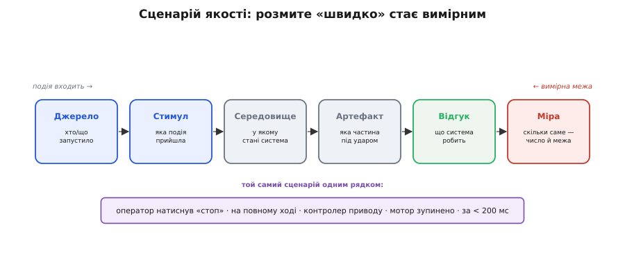
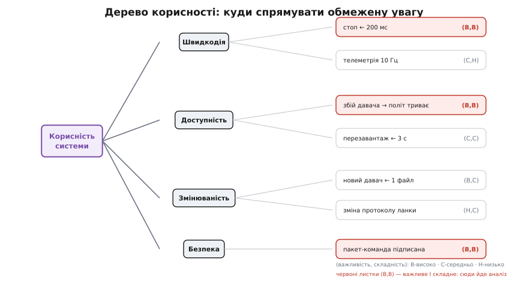
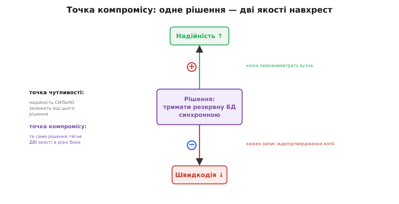

# ATAM-лайт

<preknowlist>
- [Якісні атрибути](book:programming/quality-attributes) — властивості системи «як добре», а не «що робить»: швидкодія, доступність, змінюваність, безпека.
- [Сценарії атрибутів](book:programming/attribute-scenarios) — спосіб зробити розмиту вимогу вимірною через конкретну подію й міру відгуку.
- [Архітектурні драйвери](book:programming/architectural-drivers) — ті небагато вимог, що реально формують структуру системи.
- [Архітектурні тактики](book:programming/architectural-tactics) — типові прийоми, якими досягають потрібного атрибута (кеш, реплікація, ізоляція).
- [Зв'язність і зачеплення](book:programming/coupling-cohesion) — наскільки частини системи залежать одна від одної.
</preknowlist>

Уяви, що архітектуру системи вже намалювали: є діаграма модулів, обрано базу даних, вирішено, що зв'язок іде через чергу повідомлень. Питання, від якого холодіє під ложечкою: **а вона взагалі витримає?** Витримає навантаження в пік, переживе падіння одного вузла, дасть додати новий тип пристрою без переписування половини коду? Доти, доки система не побудована, це не факт, а **ставка**. І найдорожча вада софту — та, що сидить не в рядку коду, а в самій структурі: її не видно на рев'ю окремого файлу, вона проявляється тільки під реальним навантаженням, а до того часу переробити структуру коштує вже не годину, а місяці.

Отут і виникає потреба: **оцінити архітектуру ще на папері**, поки вона дешева, — знайти місця, де ставка ризикована, до того, як гроші й час утоплено в реалізацію. Промислова відповідь на цю потребу — метод ATAM (англ. *Architecture Tradeoff Analysis Method* — метод аналізу архітектурних компромісів), який у другій половині 1990-х розробили в Інституті програмної інженерії (SEI) при Університеті Карнегі — Меллона; повністю метод описали технічним звітом 1998 року команда Ріка Казмана, Марка Кляйна, Маріо Барбаччі та колег, розвинувши раніший метод SAAM 1994 року. [Звідки взявся ATAM](book:programming/atam-lite/hist-atam.md) — окрема історія про те, чому знадобився саме структурований метод, а не «зберемось і обговоримо».

Повний ATAM — це важкий двофазний ритуал: дев'ять кроків, тренована команда оцінювачів, дні нарад із десятками стейкхолдерів. Малій команді такий обряд не по кишені. Але **його серцевина** — кілька ідей, які працюють у будь-якому масштабі й за півдня. Ось цю серцевину — назвемо її ATAM-лайт — і розберемо: не обряд, а спосіб думати про архітектуру як про набір перевірних ставок.

## Архітектура — це набір ставок на якості

Почнімо з питання, яке легко проскочити: **що саме ми оцінюємо?** Не «чи правильний код» — код ще не написано. Оцінюємо структуру: як система поділена на частини, як частини говорять між собою, де лежать дані. І оцінюємо її не саму по собі, а **за здатністю нести потрібні якості**.

Тут ключова думка, без якої весь метод розсипається: **функції системи майже не залежать від архітектури, а якості — майже цілком.** Порахувати суму замовлення можна в моноліті, у мікросервісах, на Java чи на С — функція вийде та сама. А от чи витримає система тисячу замовлень за секунду, чи переживе падіння платіжного вузла, чи дасть підмінити платіжного провайдера за тиждень — це вирішує **структура**. Казман, Клементс і Басс сформулювали це прямо: чи зможе система показати бажані якості, **істотно визначено її архітектурою**. Тому архітектуру й оцінюють через [якісні атрибути](book:programming/quality-attributes) — швидкодію, доступність, змінюваність, безпеку — а не через список функцій.

І кожен такий атрибут, поки система на папері, — це **ставка**. «Ми ставимо, що ця структура витримає пік навантаження.» «Ми ставимо, що падіння одного вузла не покладе систему.» Оцінити архітектуру — означає розкласти ці ставки на видноті й спитати про кожну: наскільки вона ризикована й що станеться, якщо не зіграє.

> 🔧 **Навіщо це.** На мікроконтролері ставки особливо безжальні. Ти обрав, як прошивка ділить час між читанням давачів і керуванням мотором, — і ця структура або встигає закрити цикл за 200 мс, або ні. Дізнаєшся ти про програш не за столом, а в полі, коли механізм смикнувся із запізненням. ATAM-лайт змушує назвати цю ставку («керування вкладається в 200 мс за будь-якого навантаження шини») **до заливання в чип** — поки її ще можна перевірити думкою й перекроїти планувальник дешево.

## Розмита вимога нічого не важить — потрібен сценарій

Тепер найпідступніше місце. Скажи інженеру «система має бути швидкою» — і кожен почує своє. Для одного «швидко» — це відповідь вебсторінки за пів секунди, для іншого — зупинка мотора за 200 мілісекунд. Вимога «швидка», «надійна», «безпечна» **не перевірна**: не можна сказати, виконано її чи ні, бо немає межі. А ставку, яку не можна перевірити, не можна й оцінити.

Ліки — **сценарій якості** (англ. *scenario*, від грец. *skēnē* — сцена): та сама вимога, розкладена на шість названих частин так, що вона стає вимірною. Частини такі:

```
джерело     — хто або що запустило подію
стимул      — яка саме подія прийшла
середовище  — у якому стані система в цей момент
артефакт    — яка частина системи під ударом
відгук      — що система робить у відповідь
міра        — СКІЛЬКИ саме: число й межа, за якою «пройдено/ні»
```


*Розмите «має бути швидким» саме по собі не перевірити. Сценарій розкладає подію на шість названих частин — і найважливіша з них остання, **міра**: саме вона перетворює побажання на межу, під якою рішення можна оцінити числом. Без міри решта п'ять частин — усе ще балачки; з мірою сценарій стає тестом для архітектури ще на папері.*

Серце тут — **міра відгуку**. Це та частина, заради якої все й затівалось: вона перетворює побажання на число. «Оператор натиснув аварійний стоп (джерело + стимул) на повному ході приводу (середовище), у контролері мотора (артефакт) — мотор зупиняється (відгук) **за менш ніж 200 мс** (міра).» Тепер це ставка, яку видно й можна перевірити: або структура прошивки вкладається в 200 мс, або програла. Порівняй із «двигун має швидко зупинятися» — і відчуєш різницю між балачкою й інженерією.

Розкладати кожну вимогу на шість підписаних полів у щоденній роботі втомливо, тож на практиці сценарій частіше пишуть **одним рядком**, тримаючи шість частин у голові: *«оператор тисне стоп на повному ході → мотор стоїть за < 200 мс»*. Форма вільна — залізним лишається одне: **у рядку є конкретна подія й конкретна міра**. Немає міри — це ще не сценарій. Детально ремесло писати сценарії — окрема тема; тут важливо, що **без них ATAM-лайт не працює**, бо оцінювати нема чого.

## Не всі якості рівні — дерево корисності

Сценаріїв можна нагенерувати сотню, і всі здаватимуться важливими. Але часу оцінити сотню ставок немає — та й не треба. Дві речі різнять сценарії між собою: **наскільки якість важлива для успіху системи** і **наскільки її важко забезпечити цією архітектурою**. Пересічення цих двох осей і каже, куди спрямувати обмежену увагу.

Інструмент, який це впорядковує, ATAM називає **дерево корисності** (англ. *utility tree* — дерево [сумарної] користі). Корінь — «корисність системи» загалом. Від нього ростуть гілки-атрибути: швидкодія, доступність, змінюваність, безпека. Кожна гілка уточнюється, а листя — це конкретні сценарії з мірою. І кожному листку ставлять **пару позначок: важливість і складність** — зазвичай грубо, В/С/Н (високо/середньо/низько).


*Дерево розкладає безлике «якість» на атрибути → уточнення → конкретні вимірні сценарії. Пара (важливість, складність) на кожному листку — фільтр уваги: аналізувати треба не все дерево, а червоні листки **(високо, високо)** — те, що водночас важливе для успіху І важко дається цій структурі. Сценарій важливий, але легкий, оцінювати марно (він і так вийде); важкий, але неважливий — теж (не шкода програти). Небезпека живе на перетині.*

Уся хитрість — у цьому фільтрі. Сценарій **важливий, але легкий** (структура забезпечує його очевидно) оцінювати марно — він зіграє й так. Сценарій **важкий, але неважливий** — теж: програш там не болить. Реальний ризик сидить там, де важливість і складність **обидві високі**: система дуже потребує цієї якості, а структура дає її насилу. Саме ці листки (В, В) забирають майже весь час аналізу. Дерево корисності — це, по суті, механізм сказати «ні» дев'яноста відсоткам сценаріїв, щоб уважно подивитися на десять, які вирішують долю.

## Де одне рішення тягне за собою кілька якостей

Тепер — центральна ідея методу, та, що дала йому назву (*tradeoff* — розмін, компроміс). Досі ми дивилися на якості поодинці. Але архітектурні рішення так не працюють: **одне рішення майже завжди зачіпає кілька якостей одразу — і часто в різні боки.**

Спочатку простіше поняття — **точка чутливості** (англ. *sensitivity point*). Це властивість структури, від якої **сильно залежить** якийсь один атрибут. Формально — параметр одного чи кількох компонентів, критичний для досягнення певного відгуку якості. Приклад: кількість потоків у пулі критично впливає на пропускну здатність — трохи менше, і система захлинається під піком. Пул потоків — точка чутливості за швидкодією. Знати такі точки цінно: це саме ті гвинтики, які не можна крутити наосліп, бо вони тримають якість.

А тепер — **точка компромісу** (англ. *tradeoff point*). Це точка чутливості, яка тягне **більш ніж один** атрибут — і зазвичай у протилежні боки. Тут не можна виграти все: підкрутив під одну якість — просів за іншою. Класичний приклад із самого методу: **тримати резервну копію бази синхронною**.


*Одне рішення — дві якості навхрест. Синхронна копія бази піднімає надійність (дані переживуть втрату вузла) і водночас опускає швидкодію (кожен запис чекає підтвердження від копії). Це **точка компромісу**: параметр тягне два атрибути в різні боки, тож не можна виграти обидва — лише свідомо обрати, чим пожертвувати. Знайти такі точки — головна цінність аналізу: саме вони, а не окремі якості, вирішують форму архітектури.*

Рішення тримати копію синхронною **піднімає надійність**: якщо основний вузол упаде, копія має всі дані, нічого не втрачено. Те саме рішення **опускає швидкодію**: тепер кожен запис мусить дочекатися, поки копія підтвердить, — а це затримка. Не можна одночасно мати миттєвий запис і гарантію, що дані вже в копії; доводиться **обирати**, і цей вибір — не технічна дрібниця, а бізнес-рішення. Ще класика того ж штибу — **кількість серверів**: більше серверів піднімає швидкодію й доступність, але опускає безпеку (більша поверхня атаки) і вартість.

Головна робота ATAM-лайт — **знайти й назвати ці точки компромісу**. Бо доки вони заховані, команда сперечається наосліп: одні тягнуть за надійність, інші за швидкість, і ніхто не бачить, що це **один параметр**, який фізично не дає обох. Щойно точку названо — суперечка з війни думок стає нормальним інженерним вибором: «ми свідомо жертвуємо N мілісекунд запису заради того, щоб не втратити жодного замовлення». [Як тактики й патерни породжують ці компроміси](book:programming/architectural-tactics) — тісно пов'язана тема: майже кожна тактика під один атрибут коштує чогось під іншим.

## Чого шукаємо: ризики й неризики

Аналіз кожного важливого сценарію дає чотири типи знахідок — і в них уся практична користь. Дві вже знаємо (точки чутливості й компромісу), ще дві — головні для рішення:

- **Ризик** — архітектурне рішення, яке **може не витягти** потрібний сценарій. «Стоп-сигнал іде через ту саму чергу, що й телеметрія 10 разів на секунду; під піком телеметрії команда стопу може спізнитися за 200 мс.» Це не факт провалу — це **непевність, яку треба зняти** (виміряти, перебудувати, підстрахувати).
- **Неризик** (англ. *non-risk*) — рішення, яке сценарій **надійно тримає**, і це **обґрунтовано**, а не «сподіваємось». «Стоп іде окремим апаратним перериванням, поза чергою, — 200 мс тримаються завжди.» Неризик так само цінний: він каже, де **не треба** витрачати сили на страховку.

Дар методу — саме в чіткому поділі. Наприкінці аналізу маєш два списки: **ось тут ризиковано** (сюди йдуть гроші й час на зняття непевності) і **ось тут спокійно** (тут не чіпаємо). Без такого поділу команда або страхує все підряд (дорого й повільно), або не страхує нічого (аж поки впаде в полі). [Як думати про ризик системно й вести його реєстр](book:programming/risk-thinking) — окрема дисципліна; ATAM-лайт лише постачає їй сирі знахідки — конкретні, прив'язані до сценаріїв ризики, а не абстрактне «щось може піти не так».

## ATAM-лайт: півдня замість дев'яти кроків

Тепер зберімо серцевину в робочий процес, який мала команда витягне за один захід — без тренованих оцінювачів і тижня нарад. Повний метод має дев'ять кроків у дві фази; [що з дев'яти кроків реально виживає в малій команді](book:programming/atam-lite/proj-lite-session.md) — окремий розбір із шаблоном сесії. Стиснута до кісток, послідовність така:

- **Назви драйвери.** Не всі вимоги формують структуру — лише кілька. Витягни ті [архітектурні драйвери](book:programming/architectural-drivers), заради яких структура саме така: 3–5 якостей, що реально вирішують долю системи. Решту відклади.
- **Перетвори їх на сценарії з мірою.** Кожен драйвер — на рядок-сценарій із конкретною подією й числовою межею. Немає міри — повертайся й додай, інакше нема чого оцінювати.
- **Постав пару (важливість, складність)** кожному сценарію й лиши тільки червоні (В, В). Це твоє коротке дерево корисності — робочий список на решту сесії.
- **Пройди кожен червоний сценарій крізь структуру.** Простеж думкою: як система відповідає на цю подію? Що на шляху? Де параметр, від якого залежить, чи вкладемось у межу? Тут і випливають **точки чутливості й компромісу**.
- **Запиши знахідки як ризики й неризики.** Кожен сценарій завершується або «ризиковано, бо…», або «спокійно, бо…» — з поясненням. Обґрунтоване «спокійно» — не менш цінне за «ризиковано».

Оце й усе ремесло. Не важкий обряд, а **звичка ставити чотири питання** до будь-якої структури: які якості вирішують долю; який їхній вимірний сценарій; де параметри тягнуть якості навхрест; де ми ризикуємо, а де спокійні. Ці питання масштабуються від тижневого пет-проєкту до платформи на сотні людей — міняється лише глибина, не суть.

> 🔧 **Навіщо це.** Найдорожче в цьому методі — не знахідки, а **розмова**. Коли команда разом проводить сценарій крізь структуру, ставки перестають жити в голові одного архітектора й стають спільним знанням: усі бачать, чому база синхронна, чому стоп поза чергою, чим саме пожертвувано й заради чого. Половина архітектурних катастроф — не від дурних рішень, а від **невимовлених**: хтось прийняв компроміс мовчки, ніхто не заперечив, бо ніхто не знав. ATAM-лайт витягує рішення на світло — і тим ловить ваду, поки вона ще думка, а не залитий у продукт факт.

## Де метод чесний, а де ламається

Аналогія «оцінити архітектуру — як перевірити креслення мосту перед будівництвом» точна рівно доти, доки пам'ятаєш, **де вона тріщить**. Міст рахують за законами міцності — вийде число, і воно об'єктивне. Архітектуру ATAM-лайт **не рахує** — він її **структуровано обговорює**. Знахідки залежать від того, хто в кімнаті: не покликали безпекника — проґавили цілий клас сценаріїв; ніхто не знає реального навантаження — міри вгадані, і ризики вгадані слідом. Метод не дає істини; він дає **дисципліну ставити правильні питання** й записувати відповіді так, щоб їх можна було перевірити згодом.

Друга межа: ATAM-лайт оцінює **ставки, а не факти**. «Ризик» тут — не виміряний провал, а обґрунтована підозра. Знайшовши ризик, ти не закрив його — ти лише **назвав, що варто перевірити** прототипом, навантажувальним тестом чи виміром. Метод — це прожектор, що підсвічує, куди світити далі, а не вирок. Плутати підсвічене з доведеним — типова пастка: команда знайшла ризики, виписала, заспокоїлась — і жоден так і не зняла.

І третя, найтихіша: сила методу — рівно в силі **сценаріїв і людей**. Кепський сценарій без міри пропустить крізь себе будь-яку структуру, нічого не спіймавши. Кімната без потрібних стейкхолдерів пройде повз найбільшу діру, бо нікому її побачити. Тому ATAM-лайт — не заміна знанню системи й предметної області, а **підсилювач**: він упорядковує те, що команда й так знає, змушує сказати вголос і зафіксувати. Порожню голову він не наповнить — але команду, що бачить свою систему, врятує від найдорожчого сорту вад: тих, що сховані в структурі й мовчать до самого падіння.
