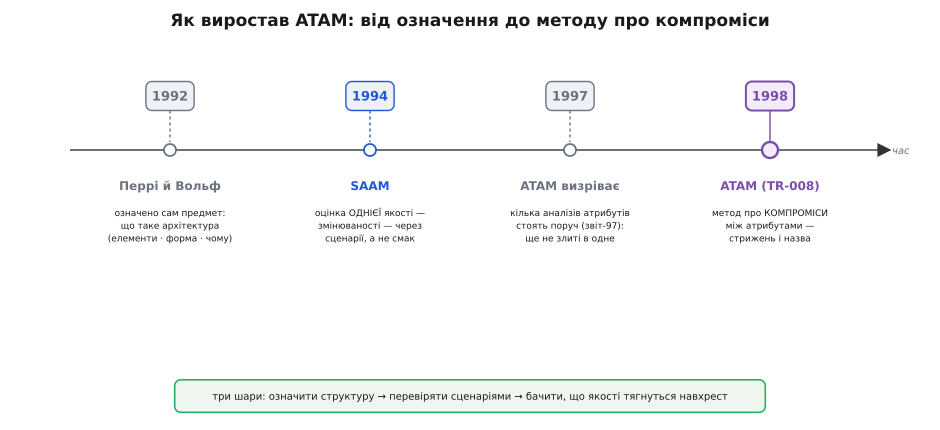

# 📜 Звідки взявся ATAM

Уяви кінець 1980-х — початок 1990-х. Софт перестав бути програмою на одну людину й став **великою системою**: сотні тисяч рядків, десятки модулів, команди, що працюють роками, гроші на підтримку, які часто перевищують гроші на початкову розробку. І тут вилазить неприємна закономірність, яку інженери відчували шкірою, але не вміли назвати: **найдорожчі вади сидять не в коді, а в структурі**. Помилку в рядку ловить компілятор чи тест; невдалу структуру не ловить ніхто — вона тихо чекає, поки система виросте, а тоді проявляється як «щоб додати ще один тип пристрою, треба переписати половину». І переписати вже не годину коштує, а місяці.

Постає природне питання: **чи можна перевірити структуру, поки її не втілили в код** — коли вона ще дешева? Для мостів і будинків це давно вміють: креслення рахують за законами міцності ще до першої цеглини. Для софту такого не було. Архітектуру малювали, сперечалися про неї на нарадах — і будували, сподіваючись, що вгадали. Історія ATAM — це історія про те, як спробували перетворити це «сподіваючись» на дисципліну.

## Спершу треба було домовитися, що таке «архітектура»

Дивно, але до початку 1990-х саме поняття «архітектура програмної системи» було розмите. Усі вживали слово, кожен вкладав своє. Оцінювати те, що не має означення, неможливо, тож першим кроком був не метод, а **словник**.

Опорну точку дали Дьюейн Перрі (Dewayne E. Perry) та Александер Вольф (Alexander L. Wolf) у праці «Foundations for the Study of Software Architecture» 1992 року. Вони запропонували думати про архітектуру як про **елементи, форму й обґрунтування** — з чого система складена, як частини поєднані та чому саме так. Це ще не метод оцінки, а фундамент: доки немає спільної мови для опису структури, немає й предмета, який можна перевіряти. Статус тут усталений — цю працю справедливо вважають однією з засадничих для всієї дисципліни програмної архітектури.

Місце дії далі — **Інститут програмної інженерії** (Software Engineering Institute, SEI) при Університеті Карнегі — Меллона в Пітсбурзі. Це не звичайна університетська лабораторія: SEI — федерально фінансований дослідний центр, який Міністерство оборони США заснувало 1984 року саме тому, що великі військові програмні системи виходили дорогими, ненадійними й непідйомними в підтримці. Замовник, який роками платить за супровід систем, гостро зацікавлений знати про структурну ваду **до** того, як за неї заплачено. Тому не випадково, що метод оцінки архітектури визрів саме там, де ціна структурної помилки була видна найгостріше.

## SAAM: перша спроба — і вона про змінюваність

Перший робочий метод народився 1994 року й називався **SAAM** (Software Architecture Analysis Method — метод аналізу програмної архітектури). Його представили Рік Казман (Rick Kazman), Лен Басс (Len Bass), Ґреґорі Ебовд (Gregory Abowd) та Майк Вебб (Mike Webb) доповіддю «SAAM: A Method for Analyzing the Properties of Software Architectures» на 16-й Міжнародній конференції з програмної інженерії (ICSE) у Сорренто в травні 1994 року. Це усталений факт із самої публікації; сам підхід визрівав роком раніше, тож у літературі SAAM іноді відносять до 1993-го — це різниця між «почали робити» й «оприлюднили».

Ключова ідея SAAM, яка потім переросте в усе інше, — **оцінювати архітектуру через сценарії**. Замість питати абстрактно «чи хороша ця структура», беруть конкретні ситуації використання й зміни («додати новий тип звіту», «перенести на іншу базу даних») і дивляться, скільки структура кричить під кожною. Це був перехід від смаку до перевірної процедури: сценарій або проходить крізь структуру легко, або чіпляє багато місць — і це видно, а не відчувається.

Але SAAM мав чітку межу, і її треба назвати точно, щоб не сплутати з тим, що буде далі: **SAAM цілив насамперед у змінюваність** (modifiability) — наскільки легко систему переробляти. Це була величезна тема (адже саме зміни й з'їдають бюджет підтримки), і метод із нею впорався добре: його встигли застосувати до архітектур із найрізноманітніших галузей — від засобів розробки й керування повітряним рухом до фінансів, телефонії й вбудованого керування транспортом. Проте одна якість — це ще не вся картина. Реальна система мусить бути не лише змінюваною, а й швидкою, доступною, безпечною одночасно — а SAAM дивився на них поодинці.

*Метод не з'явився готовим — він виростав шарами. Спершу означили сам предмет (що таке архітектура), тоді навчилися оцінювати одну якість через сценарії (SAAM), і аж потім — головний стрибок: побачити, що якості тягнуться навхрест, і зробити метод саме про **компроміси** між ними. Дата на кожному шарі — усталена за відповідною публікацією SEI/ICSE.*

## Чому не можна було просто «зібратися й обговорити»

Тут варто зупинитися на питанні, яке зазвичай проскакують: а навіщо взагалі формальний метод? Досвідчені архітектори й так відчувають компроміси — то чому не зібрати команду й не обговорити структуру за столом?

Автори ATAM дали на це напрочуд влучну відповідь, і вона варта дослівного переказу, бо пояснює всю потребу в методі. Уяви, каже технічний звіт, звукорежисера, якому дали 28-смуговий графічний еквалайзер — і кожна ручка впливає не сама по собі, а зачіпає якусь частину інших. А тепер його просять налаштувати ідеальне звучання **без спектроаналізатора** — на слух, наосліп. Завдання безнадійне. Різниця між цією аналогією й програмною системою лише в тому, що в системі не 28 ручок, які взаємодіють, а набагато більше «незалежних, але пов'язаних змінних, які треба підкрутити».

Ось чому «зберемось і обговоримо» не працює на серйозній системі. Компроміси **все одно робляться** — без них систему не побудувати, — але робляться в темряві, як каже сам звіт: архітектури проєктують «наосліп» (*in the dark*), розміни ухвалюють нашвидкуруч, і ніхто не бачить повної картини взаємодій. Людська голова просто не тримає одночасно, як рішення про синхронну репліку бази тягне надійність угору, швидкодію вниз, вартість убік — та ще й помножене на десятки інших рішень, кожне зі своїми хвостами. Каталоги патернів і стилів, що саме тоді входили в моду, теж не рятували: патерн підписаний «добрий для переносності» чи «легко змінюваний», але наскільки саме переносна чи змінювана вийде **ця** архітектура — не знати, доки її не збудують. Аналіз патерна не сягав глибше за ярлик.

Метод потрібен був не щоб замінити досвід, а щоб дати архітекторові той самий «спектроаналізатор»: спосіб **побачити взаємодії явно** — які ручки що тягнуть, де вони конфліктують — і міркувати про них дисципліновано, а не тримати все в голові одного найдосвідченішого інженера, сподіваючись, що він нічого не проґавив.

## 1997: ATAM ще «визріває»

Стрибок від SAAM до ATAM стався не одним махом. У 1997 році вийшов технічний звіт SEI «Steps in an Architecture Tradeoff Analysis Method: Quality Attribute Models and Analysis» (CMU/SEI-97-TR-029) — і вже в назві метод названо **таким, що визріває** (*emerging*). Його підписала команда Маріо Барбаччі (Mario Barbacci), Пітера Файлера (Peter Feiler), Марка Кляйна (Mark Klein), Говарда Ліпсона (Howard Lipson), Тома Лонґстаффа (Tom Longstaff), Чарльза Вайнстока (Charles Weinstock) та Джеромі Кар'єра (Jeromy Carriere).

Цей проміжний звіт цінний тим, що показує метод **у процесі складання**: у ньому вже є моделі окремих якостей — швидкодії, доступності, безпеки — на прикладі невеликого реального промислового застосунку, але вони поки що радше стоять поруч, ніж злиті в одне ціле. Це вже не «лише змінюваність», як у SAAM, — це кілька атрибутів на столі одночасно. Бракувало останнього: чіткого механізму, який зв'яже ці окремі аналізи в метод саме про **компроміси між ними**.

## 1998: метод отримує ім'я й форму

Зрілу форму ATAM закріпив технічний звіт **CMU/SEI-98-TR-008** «The Architecture Tradeoff Analysis Method», датований **липнем 1998 року**. Автори — **Рік Казман** (Rick Kazman), **Марк Кляйн** (Mark Klein), **Маріо Барбаччі** (Mario Barbacci), **Том Лонґстафф** (Tom Longstaff), **Говард Ліпсон** (Howard Lipson) та **Джеромі Кар'єр** (Jeromy Carriere). Це усталений факт із титульної сторінки самого звіту, підготовленого для Об'єднаного програмного офісу SEI на замовлення Міністерства оборони США. Порівняно з проміжним складом 1997-го тут з'являється Казман — той самий, хто стояв біля SAAM, — і зникають Файлер із Вайнстоком; це не дрібниця, а слід того, що метод остаточно зшили з лінією SAAM.

Кілька слів про дійових осіб, щоб не звести їх до безликих «розробників». Рік Казман — постать наскрізна для всієї історії: він співавтор і SAAM, і ATAM, здобув докторський ступінь у Карнегі — Меллона (1991), а фахову освіту почав у Ватерлоо в Канаді; згодом став професором в Університеті Гаваїв, лишаючись пов'язаним із SEI. Саме він забезпечив тяглість від першого методу до другого. Маріо Барбаччі — багаторічний старший науковець SEI, один зі співзасновників інституту, чиє ім'я стоїть і на проміжному звіті 1997-го, і на зрілому 1998-го. Це не «якась група американців», а конкретні інженери з простежуваним внеском; де їхнє походження неоднозначне за самим прізвищем, чесніше не вигадувати національність, а триматися того, що документовано, — інституції та авторства.

Що ж додав звіт 1998 року, чого не було раніше? Він **дав методові стрижень і назву**. Слово *tradeoff* (розмін, компроміс) — не прикраса: у ньому вся суть. У власному формулюванні звіту ATAM — це «структурована техніка, щоб зрозуміти компроміси, притаманні архітектурам систем, насичених програмним забезпеченням». І далі прямо: якісні атрибути «взаємодіють, і поліпшення одного часто дається ціною погіршення одного чи кількох інших». Ось де народжується головна відмінність ATAM від усього попереднього, яку сам звіт називає принциповою: інші методи дивилися на якості поодинці, а ATAM **явно розглядає зв'язки між кількома атрибутами** й дозволяє дисципліновано міркувати про розміни, що неминуче з цих зв'язків виникають. Саме тут з'являються поняття, на яких метод тримається: місця, де якийсь атрибут гостро залежить від параметра структури, і — головне — місця, де один параметр тягне **кілька** атрибутів у різні боки. Знайти й назвати такі місця й стало серцевиною методу.

Ще одна риса, закладена там-таки: ATAM — не разова експертиза, а **спіральна** процедура. Звіт прямо спирається на спіральну модель проєктування: пропонуємо архітектуру-кандидата → аналізуємо → бачимо ризики → уточнюємо архітектуру → аналізуємо знову. З важливою відмінністю від класичної спіралі — **втілювати нічого не треба**: кожен виток рухає не код, а розуміння, і робить це на папері, поки правки дешеві. Це прямо повертає нас до вихідної потреби, з якої все почалося: зловити структурну ваду, доки вона ще ставка, а не залитий у продукт факт.

## Що з цієї історії лишається важливим

За кілька років по тому ATAM обріс повноцінним двофазним обрядом на дев'ять кроків, тренованими командами оцінювачів і багатоденними сесіями з десятками стейкхолдерів — тим важким ритуалом, що його малій команді не підняти. Але корисно пам'ятати, з чого він виріс, бо **корінь пояснює суть краще за обряд**.

Виріс він із трьох простих усвідомлень, що накопичувалися шар за шаром. Спершу — що структуру треба вміти **описати** спільною мовою (Перрі й Вольф). Тоді — що її можна **перевіряти через сценарії**, а не через смак (SAAM, змінюваність). І нарешті — головне — що якості системи **тягнуться навхрест**, тож оцінювати їх поодинці замало: суть інженерного рішення часто і є в тому, чим саме пожертвувати заради чого (ATAM, компроміси). Прибери історичні дати, тренованих оцінювачів і дев'ять кроків — і саме ці три думки лишаться робочими за будь-яким столом, де малюють структуру. Метод дав їм назви й порядок; та потреба, що його породила, — не втопити місяці в структуру, яку можна було перевірити думкою за півдня, — нікуди не поділася й досі та сама.
