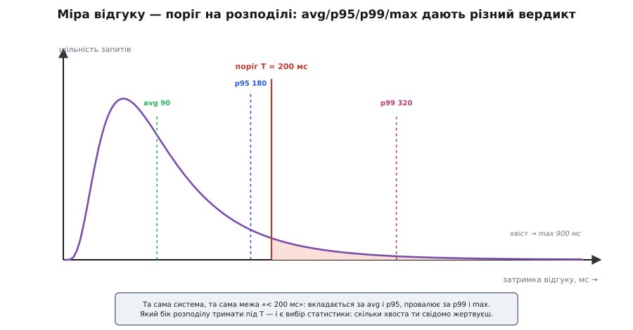
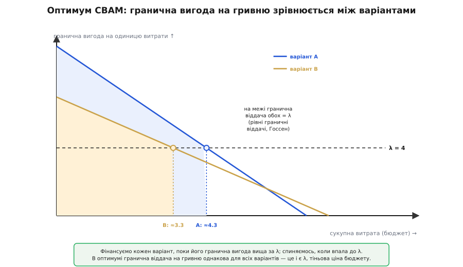

# 🧮 Кількісний хребет: експозиція, крива корисності й ROI

Метод оцінювання архітектури здається м'яким — розмова, дошка, стікери з ризиками. Але під трьома його «на око» рішеннями сидить точна арифметика, і варто її оголити, бо саме вона пояснює, **чому** інтуїція працює, і — важливіше — де вона тихо бреше. Три рішення такі: **які** сценарії взагалі аналізувати (з сотні можливих), **наскільки добре** — це вже досить добре, і **який** із варіантів купити за обмежені гроші. Кожне звучить як судження смаку. Кожне має під собою формулу, яку інженер зазвичай застосовує несвідомо. Розкриймо всі три від першопричини — і на кожній подивимось, де число перестає бути числом.

## Експозиція E = p·V: чому саме добуток

Почнімо з фільтра уваги. Сценаріїв можна нагенерувати сотню; аналізувати всі — марнувати найдорожчий ресурс сесії, живу увагу експертів. Розумно витрачати її там, де вона **знімає найбільше очікуваної шкоди**. Отже, треба вміти сказати про кожен сценарій одне число — скільки шкоди він несе — і відсортувати за ним.

Що таке «шкода» від сценарію, поки система на папері? Це **жереб із двома кінцями**. Або структура не витягне сценарій — і тоді система платить ціну провалу: втрачений дохід, зупинений завод, репутація, у крайніх системах — життя. Або витягне — і ціна нульова, нічого не сталося. Позначмо ціну провалу **V** (від *value* — те, що на кону), а ймовірність, що структура **не** дотягне, — **p**. Шкода — випадкова величина L: вона дорівнює V із імовірністю p і 0 з імовірністю (1−p).

Тепер порахуймо середнє цього жереба — те, що математика зве **сподіваним значенням** (очікуванням):

```
E[L] = p · V  +  (1 − p) · 0  =  p · V
```

Ось де народжується формула експозиції. **E = p·V — це не евристика, яку хтось придумав; це те, чим очікувана втрата математично Є.** Множник не обрано «щоб було» — він випав із означення середнього по жеребу з двома кінцями. Важливість сценарію (ціна V) і його складність (шанс провалу p) множаться, бо саме так рахується сподіваний програш. [Мислення про ризик як дисципліну](book:programming/risk-thinking) будує на цій самій валюті: пріоритет ризику — це його експозиція, а зняти ризик означає збити p до нуля коштом якоїсь роботи; тут ми лише виводимо, звідки береться число.

Чому не сума, p + V, яка теж «росте, коли обидва великі»? Найшвидша відповідь — **розмірнісна**. V — це гроші (гривні провалу). p — чисте число без розмірності (частка від 0 до 1). Добуток p·V має розмірність гривень — це очікувані гривні втрати, осмислена величина. А сума додає гривні до безрозмірного числа: це те саме, що додати «три метри» до «половини» — вираз, який не є середнім нічого. Сума не має інтерпретації сподіваного значення, тож і сортувати за нею — сортувати за безглуздям.

Друга відповідь — **логічна структура «І проти АБО»**. Небезпека вимагає, щоб провал був **і ймовірним, і дорогим одночасно**. Добуток це ловить: щойно один множник прямує до нуля, гасне все. Сценарій, що майже напевно провалиться (p ≈ 1), але коштує копійки (V ≈ 0), не страшний — програти його не шкода; добуток дає ≈ 0. Сценарій дорогий (V велике), але який структура тримає залізно (p ≈ 0), теж не потребує уваги — він зіграє й так; добуток знову ≈ 0. Сума ж лишається великою в обох випадках (бо один доданок великий), тобто **фальшиво б'є на сполох там, де насправді спокійно**. Небезпека живе тільки на кон'юнкції «І», а «І» — це множення, не додавання.

Геометрія робить це наочним. Викладімо всі сценарії на площину: по горизонталі p, по вертикалі V.


*Лінії однакової експозиції E = p·V — це гіперболи, що тиснуться в кут **(В, В)**: тільки там, де обидва множники великі, число велике. Дві точки S₁ (напевно провалиться, та ціна ≈ 0) і S₂ (обидва помірні) лежать на **спільній** лінії суми p+V=1 — сума вважає їх однаковими. Але їхнє E різниться майже втричі: 0.09 проти 0.25. Сума не бачить різниці між «дешевим але певним» і «збалансованим»; добуток бачить — і саме тому увагу веде він, а не вона.*

Тепер видно, **чому кут (В, В) забирає майже все**. Відсортуй сценарії за спаданням E. Оскільки E — добуток двох величин, що самі гуляють у широкому діапазоні, значення E розповзаються на **порядки**: логарифм добутку — це сума логарифмів, тож log E веде себе як сума двох розкидів і дає довгий хвіст. На практиці це означає, що відсортований ряд E падає круто, і перші кілька доданків тримають левову частку суми. Порахуймо на шести сценаріях:

```
| Сценарій                          | V (ціна) | p (шанс провалу) | E = p·V |
|-----------------------------------|----------|------------------|---------|
| стоп під піком спізнюється          |   10     |      0.6         |   6.0   |  ← (В,В)
| синхронна копія просаджує запис     |    8     |      0.5         |   4.0   |  ← (В,С)
| новий давач тягне правку в ядро     |    4     |      0.3         |   1.2   |
| телеметрія джитерить                |    3     |      0.2         |   0.6   |
| лог росте без ротації               |    2     |      0.2         |   0.4   |
| рідкісний звіт рахується повільно   |    2     |      0.1         |   0.2   |
                                              сумарна   ΣE = 12.4
                                     два верхні листки =  10.0  = 81 % усієї ΣE
```

Два сценарії з шести тримають **чотири п'ятих** усієї очікуваної шкоди. Аналізувати решту чотири — витрачати більшу частину часу на меншу частину ризику. Оце й є кількісний зміст правила «сказати ні дев'яноста відсоткам сценаріїв»: не тому, що решта неважлива, а тому, що їхній добуток p·V малий.

Лишається чесно назвати одну незручність. Метод на дошці не пише V=10 і p=0.6 — він грубо ставить пару **В/С/Н** (високо/середньо/низько). А перемножувати «високо» на «високо» строго кажучи не можна: це порядкові мітки, не числа. Порятунок у тому, що В/С/Н — насправді **грубе логарифмічне кодування** справжніх величин: Н ≈ ×1, С ≈ ×3, В ≈ ×10, приблизно по десятковому кроку. Перемножити мітки — те саме, що додати їхні логарифми, тобто наблизити множення справжніх величин на логарифмічній шкалі. Для **тріажу** — відділити верхню жменю від решти — цієї грубості досить: потрібна лише приблизно монотонна впорядкованість, а не точний добуток. Межа чесності теж чітка: коли два сценарії падають у **сусідні** клітинки (скажімо, (В,С) і (С,В), обидва «десь коло шістки»), порядкова сітка їх не розрізнить — і тоді треба спуститися з міток до справжньої оцінки p·V. Сітка каже, куди дивитися; коли вона вагається, рахуй число.

## Від порога «так/ні» до кривої корисності

Друге м'яке рішення — «наскільки добре досить добре». Сценарій дає **поріг**: «мотор стає за < 200 мс», «сторінка відповідає за < 300 мс». Формально поріг — це **сходинка** (функція Гевісайда): корисність дорівнює повній ціні V, поки відгук нижчий за межу T, і обвалюється в нуль, щойно її перетнув.

```
U_поріг(r) = V,  якщо r < T
U_поріг(r) = 0,  якщо r ≥ T
```

Сходинка зручна для швидкого фільтра, але вона — **однобітове огрублення** реальності. Відгук 199 мс і 201 мс лежать по різні боки порога, отже сходинка кричить, що вони протилежні; а користувачеві вони майже тотожні. І навпаки: 50 мс та 190 мс сходинка вважає однаковими («обидва < 200, пройдено»), хоча 50 мс явно вартніші. Насправді корисність відгуку — **гладка спадна крива**: широке **плато**, де вже байдуже (швидше «миттєвого» людина не відчує), крутий **обрив** біля критичної зони, і **дно**, де все одно погано й зайва затримка вже нічого не змінює.

Ця форма — не естетика, а робоче знання, і витягує його **похідна**. Гранична корисність — це швидкість спаду кривої, m(r) = −dU/dr: скільки корисності втрачає кожна зайва мілісекунда затримки. На плато m ≈ 0 (мілісекунда безплатна), на обриві m велике (кожна мілісекунда на вагу золота), на дні знову ≈ 0 (втрачати вже нічого). Саме m(r) згодом скаже, де вкладати гроші в швидкодію, а де це викинуті кошти, — тому криву варто мати в голові навіть тоді, коли на дошці стоїть лише поріг.

Але справжня тонкість інша, і базовий виклад її проминає: **відгук — не число, а розподіл.** Та сама система відповідає інколи за 40 мс, зрідка за 350; вимірявши мільйон запитів, отримаєш не крапку, а гістограму з довгим правим хвостом. Тому фраза «< 200 мс» недоказана, доки не сказано, **про яку статистику розподілу** йдеться:

```
середнє (avg)        —  90 мс   ← виглядає чудово
95-й процентиль p95  — 180 мс   ← ще вкладаємось
99-й процентиль p99  — 320 мс   ← кожен сотий запит провалює межу
найгірший (max)      — 900 мс   ← під рідкісним збігом
```

Одна й та сама система «швидка» за середнім і «повільна» за хвостом. Вибрати статистику — це вибрати, **яку частину розподілу ти тримаєш під порогом**, а отже — скільки хвоста згоден пожертвувати:


*Поріг «< 200 мс» — це вертикальна лінія на розподілі, а не присуд одному числу. Та сама система вкладається за середнім (90) і за p95 (180), але провалює за p99 (320) і max (900). Який бік розподілу тримати під T — і є вибір статистики. Для аварійного стопу важить хвіст (один пізній стоп — аварія), тож міряють max; для стрічки новин стерпний рідкісний тягучий запит, тож досить p95. Вибір — це рішення про ризик, а не деталь запису.*

Формально вибір статистики — це вибір **квантиля**. Вимога «p99 < T» означає рівно «частка запитів, повільніших за T, не перевищує 1 %», тобто P(r > T) ≤ 0.01. Загалом «q-й процентиль < T» ⟺ P(r > T) ≤ 1 − q. Що ближче q до одиниці, то тонший хвіст ти дозволяєш собі проґавити; при межі q → 1 вимога стає «жодного запиту понад T», P(r > T) = 0 — найгірший випадок. Це — точно та сама конструкція, що у фінансах зветься **вартістю під ризиком** (Value-at-Risk): обраний квантиль розподілу втрат. Обрати avg, p95, p99 чи max — значить провести межу на хвості в різних місцях, тобто оголосити свій **допуск до ризику**. Тому зріла міра звучить не «< 200 мс», а «**p99 < 200 мс під піковим навантаженням**» — з двома уточненнями: якою статистикою міряємо і за яких умов.

Є й принциповіший спосіб не вибирати одну статистику навмання, а зважити весь розподіл одразу — і саме тут гладка крива U(r) стуляється з розподілом. Справжня корисність системи — це **середня корисність по всіх запитах**:

```
корисність = E[U(r)] = ∫ U(r) · f(r) dr        (f — щільність розподілу відгуку)
```

Цей інтеграл сам, без ручного вибору квантиля, зважує хвіст рівно настільки, наскільки він поганий за кривою U. Якщо обрив кривої стоїть на 200 мс, то будь-який жирний хвіст за 200 мс просідає E[U(r)], **навіть якщо медіана блискуча**. Ось чому форма кривої й форма розподілу важать разом: система з чудовим середнім і товстим хвостом за обривом гірша, ніж каже її avg, — і тільки інтеграл, а не одна цифра, це показує.

## CBAM: вигода, ROI і рівність на межі

Третє м'яке рішення — котрий із варіантів купити. Метод ATAM-класу чесно знаходить компроміси, але сам їх **не оцінює в грошах**: він доводить до «ось тут дві якості тягнуться навхрест» і лишає вибір людям. Коли варіант один, цього досить. Коли варіантів багато, а бюджет один, потрібен шар, що кладе на розмін число. Історично його доробили там-таки, де народився ATAM, — в Інституті програмної інженерії (SEI) при Університеті Карнегі — Меллона: **CBAM** (Cost Benefit Analysis Method — метод аналізу витрат і вигід), який Рік Казман, Джай Асунді та Марк Кляйн описали двома технічними звітами SEI: CMU/SEI-2001-TR-035 (2001) і — зрілим викладом — CMU/SEI-2002-TR-035 «Making Architecture Design Decisions: An Economic Approach» (2002; усталений факт із титулів самих звітів). [Гроші як повноправний атрибут оцінювання](book:programming/cost-as-attribute) — не «скільки коштує написати», а сукупна вартість володіння — окрема тема; CBAM бере вартість готовою й ставить її в знаменник.

Ідея виростає прямо з кривої корисності. Припиши кожному рівню відгуку **корисність** (утиліту), а кожному сценарію — **вагу** w (наскільки він важливий, та сама важливість, що й у фільтрі уваги). Тоді **вигода** архітектурного варіанта — це сума корисностей, які він приносить на кожному сценарії, зважених вагами; а **віддача від вкладеного** (ROI) — вигода на одиницю вартості:

```
вигода(варіант) = Σ  wᵢ · uᵢ(rᵢ)        по всіх сценаріях i
ROI             = вигода / вартість
```

Наївне ранжування бере ROI кожного варіанта й купує найбільший. І тут ховається пастка, від якої CBAM застерігає найгостріше: **під бюджетом «купити найбільший ROI й спинитися» — неоптимально**, бо віддача кожного вкладення **спадна**. Крива корисності має плато: перші вкладені гроші в швидкодію біжать крутим обривом і докуповують багато корисності, а дальші виповзають на плато, де кожна гривня додає майже нічого. Тобто вигода варіанта — не пряма, а **вгнута** функція вкладених грошей: Bᵢ(xᵢ), що росте дедалі повільніше.

Тоді задача стає оптимізаційною: розподілити бюджет між варіантами так, щоб сумарна вигода була найбільша.

```
максимізувати   Σ Bᵢ(xᵢ)      за умови   Σ Cᵢ(xᵢ) ≤ Бюджет
```

Розв'язок дає **метод множників Лагранжа**. Складаємо функцію Лагранжа й прирівнюємо похідні до нуля:

```
L = Σ Bᵢ(xᵢ) − λ · ( Σ Cᵢ(xᵢ) − Бюджет )

∂L/∂xᵢ = Bᵢ′(xᵢ) − λ · Cᵢ′(xᵢ) = 0     ⟹     Bᵢ′(xᵢ) / Cᵢ′(xᵢ) = λ   для кожного фінансованого i
```

Читається це на диво просто. В оптимумі **гранична вигода на граничну гривню однакова для всіх варіантів** і дорівнює одному числу λ — **тіньовій ціні бюджету** (скільки додаткової вигоди купила б наступна вільна гривня). Логіка залізна: якби варіант A давав більше вигоди на гривню, ніж B, ти перекинув би гривню з B на A — і сумарна вигода зросла б. Спинятися можна лише тоді, коли перекидати нема сенсу, тобто коли віддача на гривню **зрівнялась** усюди. Це — **правило рівних граничних віддач**, у економіці відоме як другий закон Госсена (Герман Генріх Госсен, 1810–1858, німецький економіст, сформулював 1854 року; пізніше відшліфував Альфред Маршалл). Одна й та сама математика оптимуму під обмеженням: споживач ділить гаманець між товарами, архітектор — бюджет між якостями.

Тепер — навіщо це не абстракція. Порахуймо два варіанти зі спадною віддачею; кожна одиниця коштує 1, у дужках — гранична вигода чергової вкладеної одиниці:

```
варіант A:  одиниці дають  9, 7, 5, 3, 1   (сумарно 25 за 5 → повний ROI = 5.0)
варіант B:  одиниці дають  6, 5, 4, 2, 1   (сумарно 18 за 5 → повний ROI = 3.6)
Бюджет = 6 одиниць.

Наївно (спочатку весь A — він з вищим ROI):  A×5 (=25) + B×1 (=6)          = 31
Оптимально (шість найбільших граничних):     9+7+6+5+5+4 = A×3 + B×3       = 36
```

Наївне «залий спершу найкращий ROI» дає 36 − 31 = **5 одиниць вигоди менше**. Чому? Бо останні одиниці A (гранична вигода 3 і 1) — гірші за перші одиниці B (5 і 4), але наївне правило купує їх, бо не дивиться на **граничну** віддачу, лише на середню. Оптимум натомість бере шість найжирніших граничних шматків звідусіль — і по три з кожного варіанта. На межі відрізу фінансовані одиниці мають граничну віддачу ≥ 4, нефінансовані ≤ 3: віддача на гривню зрівнялась коло λ ≈ 4, точно як велить умова Лагранжа.


*Оптимум — це «рівень води» λ, спущений на дві спадні криві граничної вигоди. Фінансуємо кожен варіант, поки його крива вища за λ, і спиняємось, коли вона впала до λ. У цій точці гранична віддача на гривню в обох варіантів **однакова** й дорівнює λ — тіньовій ціні бюджету. Не «найбільша абсолютна вигода перемагає» і не «найдорожче — найкраще», а рівність на межі. Це та сама умова, що й у другому законі Госсена та в множнику Лагранжа.*

Практичний висновок для сесії: коли зважуєш, куди докласти зусиль, дивись не на те, який варіант «загалом кращий», а на те, **де ти зараз стоїш на його кривій корисності**. Вкладати в швидкодію, що вже на плато (користувач різниці не помітить), гірше, ніж підняти доступність, що висить коло обриву, — навіть якщо «швидкодія важливіша взагалі». Оптимум завжди на межі, не в середньому. Ширша дисципліна, якій цей апарат служить, — [аналіз компромісів](book:programming/tradeoff-analysis): CBAM — її кількісний інструмент, що перетворює суперечку «мені здається важливішим X» на порівнюване «X докуповує більше корисності на гривню, ніж Y».

## Де арифметика бреше

Тепер найважливіше в математичній вставці — назвати, де формули дають **фальшиву певність**. Числа спокушають: щойно на дошці стоїть «E = 6.0» і «ROI = 5.0», рука тягнеться повірити їм, як виміряним. Вони не виміряні. Три способи, якими арифметика тут обманює, варто тримати перед очима завжди.

**Фальшива точність.** Величини p, V, корисності — це **оцінки, вгадані людьми**, не показники приладу. І множення розганяє їхню похибку. Для добутку E = p·V відносні похибки складаються квадратично (бо log E = log p + log V):

```
(σ_E / E)²  ≈  (σ_p / p)²  +  (σ_V / V)²
```

Якщо ти вгадав і ціну, і шанс провалу з точністю ±50 % (оптимістично для ока), то похибка E — √(0.25 + 0.25) ≈ **71 %**. Тобто «E = 6.0» насправді означає «десь від 1.7 до 10». Писати 6.0 — вдавати три значущі цифри там, де чесна лише одна. Порятунок простий і надійний: **вір порядку, не вір цифрам після коми.** Ранжування переживає похибку — верхній сценарій (6.0 ± 71 %) і нижній (0.2) не переплутаєш, бо їхні коридори не перетинаються; а от два сусіди по рейтингу з коридорами, що налягають, арифметика розрізнити не може — їх перемірюй, а не розводь на «6.0 проти 5.4». Те саме з ROI: абсолютне число крихке, але порядок і рівність на межі стійкі до масштабування, бо в них скорочується спільний множник.

**Корельовані вигоди й ризики.** Сума ΣE = Σ pᵢ·Vᵢ — це, за лінійністю сподіваного значення, **правильне середнє** сумарної втрати, і воно правильне навіть коли ризики залежні: E[ΣLᵢ] = ΣE[Lᵢ] завжди. Що корельованість ламає — не середнє, а **хвіст**. Дисперсія суми Var(ΣL) = Σ Var + 2·Σ cov: додатна кореляція (одна спільна причина — пропала мережа, скінчилась пам'ять, упав спільний вузол — підпалює багато сценаріїв **водночас**) роздуває хвіст далеко за суму окремих доданків. Тріаж за середньою експозицією систематично **недооцінює корельовану катастрофу** — а вона найдорожча. Тому поверх суми окремих p·V треба окремо питати: «яка одна поломка реалізує найбільше Vᵢ **разом**?» — це питання сума мовчазно ховає. Симетрично бреше й додавання **вигід**: якщо два варіанти тягнуть ту саму якість, їхні вигоди перекриваються, і Σ їх **завищує** — вигода від «A і B разом» менша за вигоду A плюс вигоду B. ROI, що складає перекривні вигоди, купує ту саму корисність двічі.

**Невідомі невідомі.** І найглибше: ΣE та Σ вигід біжать лише по тих рядках, які ти **виписав**. Сценарій, якого ніхто не назвав, входить у суму з вагою нуль — і не додає нічого до арифметики, хоч би його V було найбільшим у системі. Жодна формула не оцінить рядок, якого немає в таблиці; найбільше число часто лежить **поза** нею — там, де не було носія якості, щоб її вимовити. Це не похибка обчислення, а неповнота множини, по якій обчислюють: карта порахована точно, але вона менша за територію, і край карти арифметика не підсвічує — його підсвічує лише той, хто помітив, що якоїсь якості на дошці взагалі бракує.

Звідси остаточне місце арифметики в методі. Вона **не вирішує** за тебе — вона робить три м'які судження **явними й порівнюваними**: перетворює «на око важливо» на E = p·V, «досить швидко» на квантиль під порогом, «краще вкластися сюди» на рівність граничних віддач. І — найцінніше — вона показує **на яке саме число не варто покладатися**: те, чий коридор похибки найширший, те, що корелює з іншими, і те, якого в таблиці немає. Формула тут не оракул, а лінза: вона не бачить замість тебе, але наводить різкість на те, що ти й так дивишся, — і чесно позначає, де сама сліпне.
