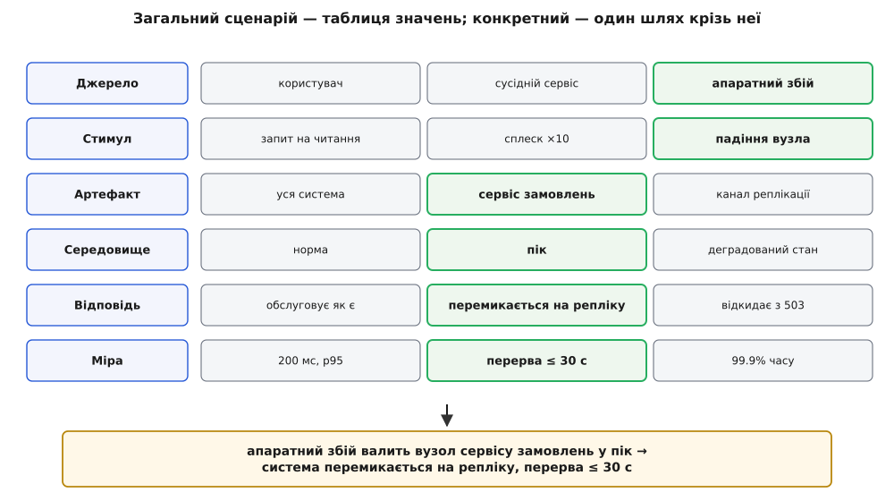
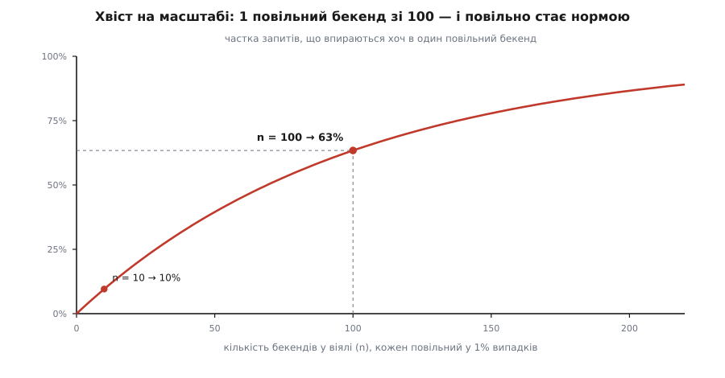
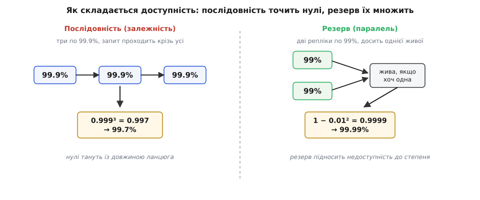
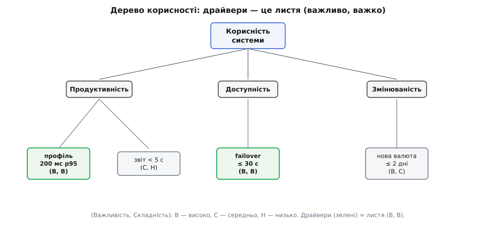

# Сценарії атрибутів

<preknowlist>
- [Якісні атрибути («-ilities»)](topic:programming/quality-attributes) — що продуктивність, доступність, змінюваність, безпека — це окремі, часто ворожі один одному виміри якості, а не «загалом добре чи погано».
- [Стейкхолдери та їхні системи](topic:programming/stakeholders) — хто зацікавлений у системі (замовник, оператор, користувач, аудитор, атакувальник) і чому їхні бажання суперечать одне одному й формулюються по-різному.
</preknowlist>

Проєктувати архітектуру — означає обмінювати одну якість на іншу. Кеш прискорює читання, але додає ризик несвіжих даних. Реплікація між регіонами рятує від втрати дата-центру, але сповільнює запис і подорожчує рахунок. Черга розв'язує піки навантаження, але вносить затримку й новий стан, який теж може загубитися. Кожне серйозне рішення — це угода: ти щось віддаєш, щоб щось купити. А угода без ціни неможлива: не знаючи, скільки коштує товар і скільки в тебе грошей, ти не купиш нічого — тільки нескінченно ходитимеш крамницею. Ось чому «система має бути швидкою й надійною» — не вимога, а параліч. У цій фразі немає жодної ціни, отже, за нею неможливо ухвалити жодне рішення. Можна лише сперечатися про смаки.

**Сценарій атрибута** повертає в розмову ціну. Слово *сценарій* (італ. *scenario* ← пізньолат. *scenarius* «те, що стосується сцени» ← лат. *scaena* «сцена» ← гр. *skēnē* «поміст для акторів») прийшло з театру як короткий опис того, що станеться на сцені, а в 1950–60-х його підхопили стратеги-аналітики для «уявних ходів подій». В архітектурі сценарій — це маленька п'єса на один акт із проставленою ціною: хтось щось робить із системою, система відповідає, і ми записуємо число, за яким судимо, добре це чи погано. Замість прикметника «швидко» ми отримуємо подію, поріг і частку, за якими можна ухвалити рішення — бо тепер у нас є з чим його звіряти.

Мета цієї статті — розібрати сценарій до останнього ґвинтика: із чого він складається й чому саме з цього; де в ньому ховається справжня складність (а вона ховається в останній, найкоротшій частині — у числі); як десятки сценаріїв стискаються до жмені тих, що формують систему; як число всередині сценарію вибирає конкретне архітектурне рішення; і де вся ця машинерія безсила.

## Чому число — не бюрократія, а умова існування рішення

Спокуса вважати число формальністю велика: мовляв, усі й так розуміють, що «швидко» — це «не дратує». Але подивімося, що фізично стається, коли числа немає. Продавцеві «швидко» означає, щоб демо не гальмувало перед клієнтом; бухгалтерові — щоб річний звіт порахувався до обіду; трейдерові — щоб ордер вийшов за мікросекунди. Це три несумісні вимоги під одним словом, і поки слово одне, троє людей будуть певні, що домовилися, — доки система не впаде під навантаженням, якого ніхто не назвав. Прикметник живе в голові того, хто його вимовив, і в кожній голові він інший.

Число робить дві речі, яких прикметник не вміє. Перша — воно робить якість **фальсифікованою**: у вимоги з'являється спосіб виявитися хибною. «200 мілісекунд у 95% випадків» можна спростувати одним навантажувальним тестом; «швидко» спростувати неможливо, бо йому нема на чому зламатися. А те, що неможливо спростувати, неможливо й підтвердити — воно просто висить, і кожен тлумачить його на свою користь. Друга річ важливіша й тонша: число задає **обмінний курс**. Коли доступність виміряна («перерва не довша за 30 секунд»), а вартість виміряна («друга репліка коштує стільки на місяць»), між ними з'являється курс — скільки грошей за скільки секунд. Тільки маючи курс, можна торгувати; без нього кожен обмін — стрибок наосліп.

> 🔧 **Навіщо це.** Архітектурне рішення на кшталт реплікації бази чи винесення модуля в окремий сервіс коштує людино-місяців і згодом майже незворотне. Через пів року ніхто не згадає, наскільки саме «швидше» чи «надійніше» його ухвалювали, — а отже, ніхто не перевірить, чи воно ще виправдане. Сценарій прив'язує рішення до числа, яке переживе розмову: будь-хто через рік візьме сценарій, прожене тест і чесно скаже «тримаємо» або «ні». Число — це пам'ять рішення, що не залежить від того, хто був у кімнаті.

Тут криється причина, чому саме навколо якісних атрибутів так багато метушні, тоді як функції зазвичай зрозумілі й без церемоній. Функцію легко перевірити: кнопка або зберігає файл, або ні. Якість — це завжди *міра на континуумі*, і без явно проведеної риски на цьому континуумі немає точки, у якій «досить» перетворюється на «недосить». Сценарій проводить цю риску. Далі вся стаття — про те, як провести її чесно.

## Шість частин під мікроскопом

Щоб сценарій виходив повним, а не «майже сценарієм», інженери зі SEI (Software Engineering Institute при Університеті Карнеґі — Меллона) — Лен Басс, Пол Клементс і Рік Казман у книзі *Software Architecture in Practice* — розклали його на шість частин. Кожна відповідає на своє питання, і кожна пропущена частина — це діра, крізь яку потім протече непорозуміння. Розгляньмо кожну не просто як пункт списку, а разом із тим, *як саме вона ламається*, коли її занедбують, — бо характерна помилка кожної частини повчальніша за її означення.

**Джерело стимулу — хто або що породжує подію.** Користувач, адміністратор, сусідній сервіс, годинник, що тикнув опівночі, атакувальник. Здається дрібницею, а насправді джерело задає **межу довіри**: подія від власного адміністратора й та сама подія від анонімного гостя — це два різні світи. «Спроба входу з неправильним паролем» від легітимного користувача, що забув пароль, вимагає лагідної відповіді; та сама спроба, повторена десять тисяч разів за хвилину з різних адрес, — це атака перебором, і відповідь має бути протилежною. Пропустиш джерело — і сценарій безпеки перетвориться на сценарій зручності або навпаки. Характерна помилка тут — мовчазне припущення, що джерело «своє»: система, спроєктована так, ніби всі клієнти доброзичливі, беззахисна тієї миті, коли перший недоброзичливий постукає у двері.

**Стимул — яка саме подія приходить.** Запит на читання. Сплеск навантаження вдесятеро. Падіння вузла. Прихід повідомлення не в тому форматі. Стимул — це те, на що система мусить зреагувати, і його треба називати конкретно, бо «висока нагрузка» — знову прикметник. Характерна помилка — описувати стимул надто чисто. Реальний світ рідко дає охайне «вузол упав»; частіше він дає «вузол не впав, але почав відповідати за п'ять секунд замість п'ятдесяти мілісекунд». Система, готова лише до чистого падіння, захлинається на напівживому сусідові, бо для неї він формально живий. Про цей клас стимулів варто думати окремо, і стаття повернеться до нього в кінці.

**Артефакт — що саме в системі зачеплено.** Уся система? Один сервіс? Конкретна база? Канал між двома вузлами? Часто стимул б'є не всюди, а в одну точку, і назвати цю точку критично важливо з двох боків. З одного — «уся система» майже завжди означає, що автор не додумав, куди насправді приходить удар, і сценарій стає неперевірним: як зміряти відповідь «усієї системи»? З іншого — надто вузький артефакт ховає зв'язки: сценарій, що каже «сервіс замовлень витримує сплеск», мовчить про те, що замовлення тягне за собою перевірку складу й списання оплати, і справжня межа проходить крізь три сервіси, а не один. Правильний артефакт — той, на якому відповідь можна *спостерегти й зміряти*.

**Середовище — за яких умов усе відбувається.** Звичайний режим? Пік? Уже деградований стан, коли одна репліка лежить? Це найчастіше занедбувана частина, бо вона здається «і так зрозумілою»: усі уявляють нормальний робочий день. Але та сама відмова в нормі й у пік — це два різні сценарії з різними, іноді протилежними вимогами. Затримка, що спокійно тримається під половинним навантаженням, вибухає під дев'яностовідсотковим — і не лінійно, а обвально, як покаже математика черг далі. Тому «у пік» чи «у деградованому стані» — не косметичне уточнення, а окрема вісь, уздовж якої той самий стимул дає геть інші наслідки. Мовчазне «в нормальних умовах» — це сценарій, який справджується рівно доти, доки умови нормальні, тобто саме доти, доки він не потрібен.

**Відповідь — що система робить.** Обслуговує запит. Перемикається на резервний вузол. Пише подію в журнал і блокує акаунт. Ключове слово — **спостережуване**: відповідь має бути тим, що видно ззовні, а не внутрішнім відчуттям «система намагається». «Система прагне відновитися» — не відповідь; «система приймає замовлення з іншого вузла» — відповідь, бо її видно клієнтові й можна зафіксувати. Характерна помилка — описувати внутрішній механізм замість спостережуваного наслідку: тоді сценарій прив'язується до конкретної реалізації й ламається щоразу, коли реалізацію міняють, хоч зовні поведінка та сама.

**Міра відповіді — скільки саме, число, за яким судимо.** 200 мілісекунд. 99.9% часу доступна. Відновлення за 30 секунд. Це та частина, заради якої існують усі попередні п'ять, і водночас та, у якій ховається вся справжня складність, — бо «число» звучить просто, а насправді за кожним числом стоїть питання, *яке саме* число і *як його рахувати*. Середнє? Найгірший випадок? Дев'яносто п'ятий перцентиль? Різниця між ними — не педантизм, а різниця між системою, що працює, і системою, що падає, будучи «в середньому нормальною». Цій частині присвячено окремий розділ, бо вона на голову складніша за решту п'яти разом узятих.

*Шість частин читаються як одне речення: коли джерело робить стимул над артефактом у певному середовищі, система дає відповідь, виміряну числом; кожна частина відповідає на своє питання, і пропущена — це діра.*


Складімо їх на живому прикладі доступності, щоб побачити цілісну п'єсу. **Джерело:** апаратний збій. **Стимул:** раптово вмирає головний вузол бази. **Артефакт:** сервіс оформлення замовлень. **Середовище:** звичайний робочий день, помірне навантаження. **Відповідь:** система переключається на репліку й далі приймає замовлення. **Міра:** перерва не довша за 30 секунд, жодне підтверджене замовлення не втрачено. Це сценарій, який можна повісити на стіну, обговорити, перетворити на тест і згодом чесно оцінити. Але зверніть увагу, скільки в ньому мовчазних припущень, які ми щойно навчилися бачити: середовище «помірне навантаження» окреслює один сценарій, а той самий збій у пік — уже інший; стимул «раптово вмирає» — чисте падіння, а «починає відповідати повільно» — окремий випадок, якого тут немає.

## Загальні сценарії як породжувальні таблиці

Сценарії живуть на двох рівнях, і плутати їх — типова помилка з дорогими наслідками. **Загальний сценарій** — це шаблон для цілого класу якості, у якому замість конкретики стоять дірки: «джерело <хтось> робить <зміну> над <модулем>, система вбирає її за <часом і зусиллям>». Він придатний для будь-якої системи й потрібен не для того, щоб його виконувати, а щоб нагадувати, *які частини взагалі бувають* і *яких значень вони можуть набувати*. **Конкретний сценарій** — той самий шаблон із заповненими дірками, реаліями саме цієї системи: «розробник додає підтримку нової валюти, і це займає не більше двох днів, без правки коду обробки платежів».

Найточніший спосіб уявити загальний сценарій — не як бланк, а як **породжувальну таблицю**. Для кожної з шести частин SEI виписав перелік типових значень, яких вона може набувати саме для цього атрибута. Для доступності джерело буває внутрішнім або зовнішнім; стимул — це відмова через збій, пропуск, зупинку чи неправильну відповідь; артефакт — процесор, канал, сховище, процес; середовище — нормальна робота чи вже деградований режим; відповідь — виявити, залогувати, сповістити, перемкнутися, продовжити в зниженому режимі; міра — час простою, відсоток доступності, час до виявлення, час до відновлення. Тепер конкретний сценарій — це **один шлях крізь таблицю**: по одному значенню з кожного стовпця. А оскільки стовпців шість і в кожному кілька значень, одна таблиця породжує сотні можливих конкретних сценаріїв — і саме тому вона така цінна: вона не дає забути цілий стовпець.

*Загальний сценарій — це таблиця можливих значень для кожної з частин; конкретний сценарій — один вибраний шлях крізь неї, по значенню зі стовпця.*


Практична сила цієї картини — у **повноті через перебір**. Коли команда виписує сценарії з голови, вона неминуче пише те, що болить сьогодні, і мовчить про те, чого не уявляє. Породжувальна таблиця змушує пройтися стовпцями системно: а що, як джерело зовнішнє, а не внутрішнє? А що в деградованому середовищі, а не в нормальному? А міра — це час до відновлення чи час до виявлення, і чи це різні вимоги? Кожне таке питання — потенційно пропущений сценарій, який інакше виявився б лише в проді. Таблиця не гарантує повноти — про її межі буде розмова наприкінці, — але вона різко піднімає планку, нижче за яку впасти вже не так легко.

Аналогія «бланк — заповнена анкета» майже точна й ламається в одному місці: бланк заповнюють один раз, а конкретні сценарії для однієї якості пишуть цілим пучком, бо «змінюваність» цієї системи розпадається на десяток різних змін, і кожна варта окремого рядка з власною мірою. Загальний нагадує, *про що питати*; конкретний фіксує *відповідь для нас*; архітектуру рухає лише конкретний, бо лише його можна перевірити.

## Міра відповіді — де ховається справжня складність

Тепер до тієї єдиної частини, заради якої існують решта п'ять. Її запис найкоротший — просто число, — і саме тому в ній найлегше помилитися. Розберімо три пастки, у які провалюється наївна міра, і математику, що з кожної виводить.

### Чому середнє бреше

Перша спокуса —міряти якість середнім: «сторінка віддається в середньому за 100 мілісекунд». Проблема в тому, що затримка не розподілена симетрично. Переважна більшість запитів швидкі, але є довгий **хвіст** повільних — через збіг блокувань, збирача сміття, холодний кеш, сусіда, що з'їв ресурс. Середнє тоне в масі швидких запитів і майже нічого не каже про хвіст, тоді як саме хвіст визначає, чи лаятиметься користувач. Уявімо сто запитів: дев'яносто дев'ять по 50 мс і один на 5 секунд.

**Умова: сто запитів, дев'яносто дев'ять по 50 мс, один — 5000 мс. Порівняймо середнє й дев'яносто п'ятий перцентиль.**

```
середнє = (99 · 50 + 1 · 5000) / 100
        = (4950 + 5000) / 100
        = 9950 / 100
        = 99.5 мс          ← «майже 100 мс, чудово»

p95     = 95-те за порядком значення
        = 50 мс            ← ховає навіть п'ятивідсотковий хвіст
p99     = 99-те значення
        = 50 мс
p100    = найгірше значення
        = 5000 мс          ← ось де живе біль
```

Середнє показало «99.5 мс» — цифру, за якою система здається здоровою. Але один зі ста користувачів чекав п'ять секунд, і саме він напише скаргу. Ось чому міра якості майже завжди формулюється **перцентилем**, а не середнім: «200 мс у 95% випадків» означає, що з-поміж усіх запитів дев'яносто п'ять зі ста вклалися в поріг, і лише п'ять — ні. Перцентиль каже про *досвід*, а не про арифметичне абстрактне «типово». Що вища ставка, то далі в хвіст заглядають: платіжні системи дивляться на p99 і p99.9, бо навіть один поганий запит на тисячу — це, при мільйоні запитів, тисяча роздратованих людей на день.

### Хвіст на масштабі

Друга пастка тонша й підступніша, і вона перекидає інтуїцію з ніг на голову. Здається природним: якщо кожен сервіс тримає p99 = 10 мс, то й система з таких сервісів буде швидкою. Насправді — навпаки, і що більша система, то гірше. Причина — у **віялі** (fan-out): сучасний запит рідко б'є в один сервіс; він розходиться на десятки й сотні бекендів (пошук зачіпає шарди, стрічка — багато джерел), а відповідь користувачеві збирається лише тоді, коли повернулися **всі**. Отже, час усього запиту визначає *найповільніший* з-поміж бекендів, а не типовий.

Порахуймо. Нехай кожен бекенд незалежно з імовірністю q = 0.01 відповідає повільніше за поріг (тобто поріг — це якраз його p99). Запит іде на n бекендів і чекає всіх. Імовірність, що *всі* вклалися, — це добуток імовірностей кожного:

```
P(усі вклалися)      = (1 − q)ⁿ = 0.99ⁿ
P(хоч один повільний) = 1 − 0.99ⁿ
```

**Умова: кожен бекенд повільний з імовірністю 1%, запит чекає всіх n. Як росте частка «повільних» запитів із віялом?**

```
n = 1    →  1 − 0.99¹   = 1 − 0.990 = 0.010  →  1.0%
n = 10   →  1 − 0.99¹⁰  = 1 − 0.904 = 0.096  →  9.6%
n = 100  →  1 − 0.99¹⁰⁰ = 1 − 0.366 = 0.634  →  63.4%
n = 200  →  1 − 0.99²⁰⁰ = 1 − 0.134 = 0.866  →  86.6%
```

Прочитаймо цей стовпчик уголос, бо він приголомшливий. При віялі в сто бекендів, кожен з яких повільний лише в одному випадку зі ста, **майже дві третини всіх запитів користувача впираються щонайменше в один повільний бекенд**. Поріг, що для одного сервісу був 99-м перцентилем — рідкісним нещастям, — для всього запиту з'їжджає ближче до 37-го: повільно стає нормою, а не винятком. Оце і є «хвіст на масштабі» (*the tail at scale*) — назва статті Джефа Діна й Луїса Андре Барросо з Google (*Communications of the ACM*, 2013), яка зробила цей ефект загальновідомим.

*Частка запитів, що впираються в повільний бекенд, круто зростає з віялом: при 1% повільних на бекенд і ста бекендах це вже 63%.*


Висновок для сценарію прямий і жорсткий: **міра мусить називати точку спостереження**. «p99 = 10 мс» без уточнення, де його заміряно — на одному сервісі чи кінець-до-кінця, — це число, що бреше. Сценарій продуктивності для системи з віялом зобов'язаний казати «кінець-до-кінця, з боку користувача» і враховувати n у середовищі, інакше він міряє не те, що болить. Повний вивід цієї та інших формул міри — у [математиці мір відповіді](topic:programming/attribute-scenarios/math-response-measures.md): там і чому саме перцентилі, і як хвіст множиться на віялі, і звідки беруться «дев'ятки» доступності, і як закон Літтла зшиває пропускну здатність із затримкою.

### Дев'ятки доступності й де в них живе сценарій

Третій сюжет — про доступність, і тут число, яке всі люблять називати, — «дев'ятки». Доступність — це частка часу, коли система жива:

```
A = час_роботи / (час_роботи + час_простою)
  = MTBF / (MTBF + MTTR)
```

де MTBF (*mean time between failures*) — середній час між відмовами, MTTR (*mean time to recovery*) — середній час відновлення. Перепишімо «дев'ятки» в те, що людина відчуває, — у простій за рік (рік = 365 · 24 · 3600 = 31 536 000 секунд):

**Умова: перевести рівень доступності в дозволений простій за рік.**

```
99%     → недоступність 0.01    → 315 360 с = 3.65 доби
99.9%   → недоступність 0.001   →  31 536 с = 8.76 год
99.99%  → недоступність 0.0001  →   3 154 с = 52.6 хв
99.999% → недоступність 0.00001 →     315 с = 5.26 хв
```

Тепер — головне, і саме тут сценарій входить у формулу. Розкладімо `A = MTBF / (MTBF + MTTR)`: підняти доступність можна двома важелями — або **рідше падати** (більший MTBF), або **швидше вставати** (менший MTTR). І MTTR — це рівно та сама «міра відповіді» зі сценарію failover, «перерва не довша за 30 секунд». Тобто сценарій відновлення не десь поряд із формулою доступності — він *усередині* неї, як один із двох її множників.

Але «≤30 секунд на відмову» саме собою ще не називає дев'яток. Дев'ятки з'являються, коли міру помножити на **частоту** відмов:

**Умова: єдине джерело простою — перемикання, кожне ≤30 с; скільки таких відмов на рік дозволяє кожен рівень?**

```
простій_за_рік = 30 с · N
99.99%  дає бюджет 3154 с →  N ≤ 3154 / 30 ≈ 105 відмов на рік
99.999% дає бюджет  315 с →  N ≤  315 / 30 ≈  10 відмов на рік
```

Ось чому сценарій доступності неповний без середовища й очікуваної частоти: «30 секунд на відмову» — це п'ять дев'яток, якщо падаєш десять разів на рік, і лише чотири, якщо сто. Число в сценарії й число в бізнес-цілі («п'ять дев'яток») зв'язані рівнянням, а не побажанням.

І остання, найкорисніша для архітектури властивість цієї математики — **як доступність складається**. Коли запит проходить крізь ланцюг залежних компонентів, система жива лише якщо живі всі, тож доступності множаться:

```
A_ланцюга = a₁ · a₂ · … · aₖ
три компоненти по 99.9%:  0.999³ = 0.997  → лише 99.7%
десять по 99.9%:          0.999¹⁰ = 0.990 → уже 99.0%
```

Нулі **тануть** із довжиною ланцюга: збудувавши систему з десяти надійних (99.9%) сервісів послідовно, дістанеш ненадійну (99.0%). Зате резервування діє протилежно. Дві незалежні репліки виходять з ладу одночасно з імовірністю добутку, тож недоступність підноситься до степеня:

```
A_резерву = 1 − uᵏ         (u — недоступність однієї, k реплік)
дві по 99% (u = 0.01):  1 − 0.01² = 0.9999  → 99.99%
```

Два нулі перетворюються на чотири. Ось де математично живе рішення «переживаємо втрату вузла бази»: воно не риторика, а піднесення недоступності до квадрата. Послідовність нулі з'їдає, паралель — множить; архітектор, який тримає в голові ці дві дії, читає діаграму системи як формулу доступності.

*Послідовна залежність перемножує доступності й точить нулі; резервування підносить недоступність до степеня й нулі додає.*


### Пропускна здатність, затримка й чому «пік» ламає все

Залишилося зшити дві міри, які часто пишуть окремо, а насправді вони — одне: пропускну здатність (скільки запитів за секунду) і затримку (скільки на запит). Їх пов'язує **закон Літтла** — на диво загальна рівність, доведена Джоном Літтлом у MIT 1961 року (форму раніше як задачу поставив Філіп Морз):

```
L = λ · W
L — середня кількість запитів «у польоті» одночасно
λ — темп надходження, запитів за секунду
W — середній час у системі, секунд на запит
```

**Умова: сценарій вимагає тримати 5000 запитів/с, кожен обробляється 0.2 с. Скільки їх у польоті?**

```
L = λ · W = 5000 · 0.2 = 1000 одночасних запитів
```

Тисяча запитів у польоті означає, що система мусить мати щонайменше тисячу одиниць обслуговування — потоків, з'єднань, воркерів. Якщо їх п'ятсот, два сценарії (пропускна й затримка) неможливо виконати разом: або темп упаде, або запити почнуть чекати черги, а черга роздуває W, і рівняння штовхає систему в колапс. Закон Літтла — це місток, що не дає писати сценарій пропускної здатності окремо від сценарію затримки, ніби вони не пов'язані.

А чому саме «у пік» усе валиться не плавно, а обвально? Позначмо максимальну пропускну здатність μ, а завантаженість ρ = λ/μ. Для найпростішої моделі черги середній час у системі росте так:

```
W = 1 / (μ − λ) = (1/μ) · 1/(1 − ρ)
ρ = 0.5  → W = 2 · час_обслуговування
ρ = 0.9  → W = 10 · час_обслуговування
ρ = 0.99 → W = 100 · час_обслуговування
```

Коли завантаженість підповзає до одиниці, час очікування летить у нескінченність — не лінійно, а гіперболічно. «Коліно» кривої десь коло ρ ≈ 0.7–0.8: до нього кожен доданий відсоток навантаження майже безкоштовний, після — коштує непропорційно багато затримки. Ось чому середовище «у пік» — окрема, найважливіша вісь сценарію продуктивності: та сама затримка, що незворушно тримається при половинному завантаженні, при дев'яноста п'яти відсотках вибухає. Сценарій, у якому не названо середовище навантаження, міряє систему саме тоді, коли їй легко, — і мовчить про мить, заради якої його писали.

## Від сценарію до тактики

Дотепер сценарій відповідав на питання «чого ми хочемо». Але його справжня цінність розкривається, коли число всередині нього починає **вибирати рішення**. Архітектурна тактика (лат. *tactica* ← гр. *taktikē* «мистецтво шикувати») — це перевірений хід, що впливає на одну якість: наприклад, «активний резерв» піднімає доступність, «кеш» — продуктивність, «інкапсуляція» — змінюваність. Сценарій не просто підказує *яку сім'ю* тактик брати — його число підказує *яку саме* тактику всередині сім'ї, бо різні числа вимагають різної механіки.

Візьмімо доступність. Сценарій «перерва ≤30 секунд» терпить резерв, який ще треба підняти: за тридцять секунд встигає завантажитися холоднуватий запасний вузол, зчитати стан і почати обслуговувати. А сценарій «перерва ≤300 мілісекунд» цю тактику викреслює — за триста мілісекунд ніщо не встигне завантажитися, отже, запасний вузол мусить бути вже гарячим і вже в курсі стану, тобто потрібне активне дублювання (*active-active*), удвічі дорожче. Те саме число, лише менше на два порядки, переписує архітектуру з «один запасний, що чекає» на «два робочі, що дублюють». Міра не просто вибрала сім'ю тактик — вона **розмірила** тактику.

> 🔧 **Навіщо це.** Без числа розмова про тактики стає богословською: одні за резерв, інші за активне дублювання, і перемагає найгучніший. Сценарій обриває суперечку арифметикою: якщо міра — 300 мс, то холодний резерв фізично не встигає, і сперечатися нема про що; якщо міра — 30 секунд, то активне дублювання — це переплата за швидкість, якої ніхто не просив. Число перетворює вибір тактики з питання смаку на питання, що має єдину правильну відповідь за наявних обмежень.

Той самий механізм працює наскрізь. Сценарій продуктивності «профіль за 200 мс у пік, p95» веде до сім'ї тактик «зменшити роботу на запит» (кеш, попереднє обчислення, матеріалізовані подання) або «додати ресурс» (репліки читання, шардинг), а закон Літтла ще й підказує тримати завантаженість під коліном кривої — тобто додати автомасштабування чи тротлінг, щоб ρ не підповзало до одиниці. Сценарій змінюваності «нова валюта за два дні, без правки ядра платежів» веде до тактик локалізації зміни: інкапсуляція, точки розширення, пізнє зв'язування — усе, що замикає майбутню зміну в один модуль. Повний каталог цих ходів — окрема тема [архітектурних тактик](topic:programming/architectural-tactics); тут важливо інше: тактику вибирає не мода й не звичка, а число зі сценарію. Сценарій — це вимога; тактика — відповідь на неї; а міра — те, що зшиває їх однозначно.

## Сценарії в оцінюванні: дерево, чутливість, компроміс

Якщо чесно виписати всі мислимі сценарії великої системи, їх набереться сотні. Захищати архітектурою кожен — марення: спроба однаково добре виконати все скінчиться повільною, дорогою й незрозумілою системою, що програє в усьому. Тому за виписуванням іде **безжальне сортування**, і в нього є усталений інструмент — **дерево корисності** (*utility tree*), що прийшло з методу оцінювання архітектури ATAM.

Дерево росте згори вниз. Корінь — «корисність системи». Від нього гілки — якісні атрибути (продуктивність, доступність, змінюваність, безпека). Від кожного атрибута — уточнення (для продуктивності: «затримка транзакцій», «пропускна на піку»). А листя дерева — це конкретні сценарії, і кожен листок отримує дві позначки: **важливість** (наскільки цінно для бізнесу) і **складність** (наскільки важко архітектурно досягти), кожну зазвичай як «високо / середньо / низько». Тепер видно, куди дивитися: листя, помічене **(високо, високо)** — і дуже цінне, і дуже важке, — це і є [архітектурні драйвери](topic:programming/architectural-drivers), жменя сценаріїв, що справді формують систему. Решта — фон: приємно, якщо вдасться, але заради них архітектуру не гнуть.

*Дерево корисності: від кореня до атрибутів, від атрибутів до сценаріїв-листків із позначками важливості й складності; драйвери — листя (високо, високо).*


Чому позначок саме дві й чому їх перемножують, а не додають, — окрема інженерна логіка, яку варто побачити в коді: сценарій «дуже важливий, але тривіальний» не драйвер (його виконає будь-яке рішення), і сценарій «страшенно складний, але нікому не потрібний» теж не драйвер (навіщо труд?); драйвер — на перетині, тому важить добуток, а не сума. Робочий приклад такого пріоритезатора — від структури дерева до видобутку драйверів і аналізу складності — у [проєкті-дереві корисності](topic:programming/attribute-scenarios/proj-utility-tree.md).

Коли драйвери відібрані, сценарії працюють ще й як лінза для оцінювання самих рішень. Метод ATAM (*Architecture Tradeoff Analysis Method*), розроблений у SEI Ріком Казманом, Марком Кляйном і Полом Клементсом наприкінці 1990-х як розвиток ранішого SAAM, ганяє драйверні сценарії крізь запропоновану архітектуру й на кожному кроці шукає три речі. **Точка чутливості** — рішення, від якого сильно залежить міра одного сценарію (розмір пулу з'єднань, від якого прямо залежить затримка). **Точка компромісу** — рішення, що зачіпає міри *двох чи більше* сценаріїв у протилежні боки (більший кеш пришвидшує читання, але підвищує ризик несвіжих даних — компроміс продуктивності проти узгодженості). **Ризик** — рішення, чиї наслідки для сценарію незрозумілі й лишаються неперевіреними. Точки компромісу — найцінніший улов: саме там архітектура таємно програє одну якість заради іншої, і саме там сценарії різних атрибутів треба зіштовхнути лобами. Ця систематична гра сценаріїв один проти одного — окрема тема [аналізу компромісів](topic:programming/tradeoff-analysis) і полегшеної версії такого оцінювання, [ATAM-lite](topic:programming/atam-lite); а те, як увесь цей апарат — дерево, чутливість, компроміс — виріс із театрального «а що, як…», описано в [історії народження сценарного оцінювання](topic:programming/attribute-scenarios/hist-atam-lineage.md).

## Сценарій стає перевіркою

Найпрактичніша сила сценарію в тому, що він майже сам перетворюється на код перевірки. Оскільки в ньому є стимул і числова міра, з нього прямо випливає програма, що цей стимул подає й цю міру заміряє. Причому кожна якість дає свій *клас* перевірки: сценарій продуктивності стає навантажувальним тестом; сценарій доступності — керованою відмовою, де вузол убивають навмисне (інженерія хаосу); сценарій змінюваності — вправою, де хтось справді вносить зміну й засікає час, а згодом застигає як [функція придатності](topic:programming/fitness-functions), що не дає системі тихо з'їхати з досягнутого.

Візьмімо сценарій продуктивності «профіль за 200 мс у пік, p95» і перетворимо його на перевірку, яка бере зібрані на піку зразки часу відповіді й рахує саме перцентиль, а не середнє, — бо в розборі міри стало видно, що середнє тут збрехало б. Задача — загальна (обробка масиву чисел), тож природно показати її кількома мовами; регістрів і заліза тут немає.

**Умова: перевіряємо, що p95 зібраних затримок укладається в поріг сценарію.**

:::tabs
```python
import math

def p95(samples_ms: list[float]) -> float:
    ordered = sorted(samples_ms)
    # Метод найближчого рангу: індекс, нижче за який лежить 95% значень.
    k = math.ceil(0.95 * len(ordered)) - 1
    return ordered[max(k, 0)]

def meets_latency_scenario(samples_ms: list[float], threshold_ms: float) -> bool:
    # Сценарій: у пік профіль віддається за <= threshold у 95% випадків.
    if not samples_ms:
        return False                     # без даних вимогу не підтверджено
    return p95(samples_ms) <= threshold_ms
```
```typescript
function p95(samplesMs: number[]): number {
  const ordered = [...samplesMs].sort((a, b) => a - b);
  // Метод найближчого рангу: індекс, нижче за який лежить 95% значень.
  const k = Math.ceil(0.95 * ordered.length) - 1;
  return ordered[Math.max(k, 0)];
}

function meetsLatencyScenario(samplesMs: number[], thresholdMs: number): boolean {
  // Сценарій: у пік профіль віддається за <= threshold у 95% випадків.
  if (samplesMs.length === 0) return false;   // без даних вимогу не підтверджено
  return p95(samplesMs) <= thresholdMs;
}
```
:::

Зверніть увагу, звідки в коді взялися і `0.95`, і `threshold_ms`, і сама ідея сортувати, а не усереднювати. Усе — прямо зі сценарію: частка «95%» дала перцентиль, міра «200 мс» дала поріг, а вибір перцентиля замість середнього — це вже урок математики міри, вкладений у перевірку. Якщо після якоїсь зміни в системі ця функція почне повертати `false`, ми дізнаємося, що зламали властивість, про яку домовлялися, — і дізнаємося на тесті, а не з аварії на бойовому. Ось чому сценарій називають містком: він з'єднує розмову зі стейкхолдерами з рядком коду, що ту розмову стереже.

## Межі: чого сценарій не ловить

Аналогія з театральним сценарієм чесна, але має чіткий край, і про нього треба знати, щоб не переоцінити інструмент. П'єса охоплює лише те, що драматург вигадав; усе, чого він не написав, на сцені не станеться. Так само набір сценаріїв ловить рівно ті ситуації, які хтось спромігся уявити, — і безсилий проти тих, яких ніхто не уявив. Реальна аварія часто приходить з боку, який не вписали: не «вузол упав», а «вузол відповідає за п'ять секунд і формально живий» (та сама **сіра відмова**, про яку йшлося на початку), і система, готова до чистого падіння, гине на напівживому сусідові, бо детектор бачить пульс. Сценарії — сильний інструмент проти *відомих* загроз і слабкий проти *невідомих*.

Важливо чесно назвати цю межу, бо в ній ховається спокуслива ілюзія. Набір сценаріїв — це **модель** того, що може статися, а будь-яка модель має покриття й діри. Помилка — сплутати «ми виписали сценарії» з «ми передбачили все»: перше — гігієна, друге — самообман. Тому дисципліна вимагає двох звичок. Перша: список сценаріїв — живий, його періодично перечитують із питанням «а що ми *не* уявили?» — і дописують у міру того, як система й світ навколо неї міняються; сценарій, актуальний торік, торік і лишився. Друга: сценарії не заміняють інших способів шукати слабкі місця, а доповнюють їх — систематичне [мислення про ризики](topic:programming/risk-thinking) саме й починається там, де закінчується перелік уявленого, і питає не «чи виконаємо сценарій», а «що станеться з тим, чого ми не внесли в сценарії».

Є й протилежна пастка — не замало сценаріїв, а забагато. Команда, що виписала дві сотні однаково «важливих» сценаріїв, паралізована так само, як і та, що не виписала жодного: коли важливо все, не важливо ніщо, і архітектуру знову тягне в спробу вгодити всім. Саме тому відбір драйверів — не бюрократичний етап, а порятунок від власної старанності: із двох сотень чесних сценаріїв система формується навколо десятка, а решта чекають своєї черги як довідка. Тримати цю рівновагу — не піддатися ні ілюзії повноти, ні паралічу надміру — і є ремесло, якого не замінить жодна таблиця.

## Що лишається в руках

Сценарій атрибута — це дисципліна перетворювати прикметники на факти, а факти — на рішення. Замість «швидко» — подія з числом; замість суперечки без кінця — твердження, що або справджується, або ні; замість вибору тактики за смаком — число, яке робить вибір однозначним. Шість частин стежать, щоб твердження було повним: хто, що зробив, над чим, за яких умов, як система відповіла й наскільки добре, — і кожна занедбана частина має свій характерний спосіб підвести. Уся справжня складність зібрана в останній, найкоротшій частині — у числі: чи це середнє, що бреше, чи перцентиль, що каже правду про хвіст; чи враховано віяло, на якому p99 стає нормою; чи зшито затримку з пропускною законом Літтла; чи названо середовище, у якому черга вибухає. Число не бюрократія — це обмінний курс, без якого архітектура не торгує, а лише гадає.

Жменя таких сценаріїв, відібраних деревом корисності за тим, що їх найважче виконати й найдорожче зіпсувати, і є справжнім технічним завданням для архітектури — тим, навколо чого ухвалюють рішення, чим міряють запропоновані структури на чутливість і компроміс, і до чого повертаються, коли треба перевірити, чи система досі та, про яку домовлялися. А поряд із цією силою треба тримати в голові й межу: набір сценаріїв — модель уявленого, і найнебезпечніше приходить звідти, куди уява не дотяглася. Тому сценарій — не документ заради документа й не оракул, а спосіб зробити невидиму якість видимою, названою, розміреною й перевірюваною — задовго до того, як за неї доведеться платити аварією, і без ілюзії, що названого досить.
