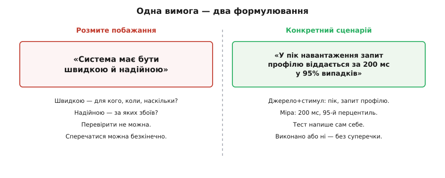
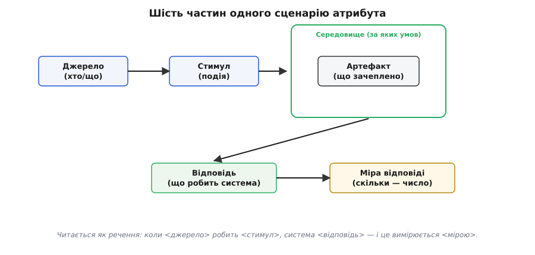
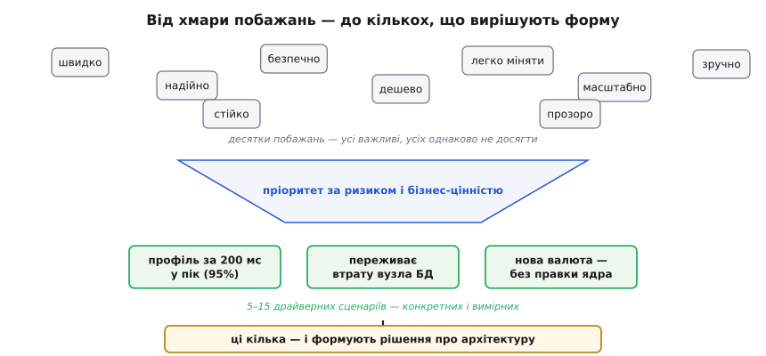

# Сценарії атрибутів

<preknowlist>
- [Якісні атрибути («-ilities»)](topic:programming/quality-attributes) — що таке продуктивність, доступність, змінюваність, безпека як окремі виміри якості системи, а не «просто хороша чи погана».
- [Стейкхолдери та їхні системи](topic:programming/stakeholders) — хто зацікавлений у системі (замовник, оператор, користувач, аудитор) і чому їхні бажання суперечать одне одному.
</preknowlist>

«Система має бути швидкою й надійною» — фраза, з якої не можна нічого побудувати. Швидкою для кого? У який момент? Надійною за яких обставин — коли впаде диск, коли обірветься мережа, коли в неї вдарить мільйон запитів за секунду? Слова «швидко» й «надійно» звучать як вимога, а насправді це побажання. Побажання не можна ні виконати, ні перевірити, ні відхилити — про нього можна лише нескінченно сперечатися. І цю суперечку двоє інженерів вестимуть роками, кожен маючи на увазі своє, аж поки система впаде під реальним навантаженням, якого ніхто не назвав числом.

**Сценарій атрибута** — це те саме побажання, переписане так, що воно перетворюється на факт про світ, який або справджується, або ні. Слово *сценарій* (італ. *scenario* ← пізньолат. *scenarius* «те, що стосується сцени» ← лат. *scena* «сцена театру» ← гр. *skēnē* «намет, поміст для акторів») прийшло з театру: короткий опис того, що станеться на сцені. У 1960-х його підхопили військові стратеги для «уявних ходів подій» — і саме в цьому значенні воно живе в архітектурі. Сценарій — це маленька п'єса на один акт: хтось щось робить, система відповідає, і ми записуємо, наскільки добре. Замість туману «має бути швидкою» ми пишемо конкретний акт, який можна розіграти й виміряти.

> 🔧 **Навіщо це.** Архітектурне рішення — кеш, черга, реплікація бази — коштує людино-місяців і згодом майже незворотне. Виправдати таке рішення розмитим «щоб було швидше» неможливо: за пів року ніхто не згадає, наскільки швидше й для чого. Сценарій дає рішенню опору: ось конкретна ситуація, ось число, яке треба втримати, — і будь-хто через рік перевірить, чи архітектура це число тримає.

## Чому побажання не працює, а сценарій працює

Візьмімо різницю під мікроскоп. «Швидко» — прикметник; він живе в голові того, хто його вимовив, і в кожній голові він різний. Продавцеві «швидко» — щоб демо не гальмувало; бухгалтерові — щоб звіт за рік порахувався до обіду; трейдерові — щоб ордер пішов за мікросекунди. Три несумісні речі під одним словом. Поки ми говоримо прикметниками, ми говоримо повз одне одного.

Сценарій прибирає прикметник і ставить на його місце **подію з числом**. «Коли в годину пік користувач відкриває свій профіль, сторінка віддається за 200 мілісекунд у 95 випадках зі ста». Тут уже нема простору для різночитань. Є момент («година пік»), є дія («відкриває профіль»), є поріг («200 мс»), є частка, якій цей поріг мусить виконатися («95%»). Це вже не бажання — це твердження, яке інженер може взяти й перевірити навантажувальним тестом. Виконано або не виконано.

*Ту саму вимогу можна сказати розмито або конкретно — і лише конкретне формулювання можна перевірити.*


Тут ховається головна причинно-наслідкова сила сценарію. Число — це не бюрократія й не самоціль. Число робить якість **фальсифікованою**: у неї з'являється спосіб виявитися хибною. Поки вимогу не можна спростувати, її не можна й підтвердити — вона просто висить. А архітектуру ми будуємо саме навколо тих кількох якостей, які легко зламати, якщо не подумати заздалегідь. Отже, перш ніж її захищати, її треба вміти назвати числом.

## Шість частин, з яких складається сценарій

Щоб сценарій виходив повним, а не «майже сценарієм», інженери зі SEI (Software Engineering Institute при Університеті Карнеґі — Меллона) — Лен Басс, Пол Клементс і Рік Казман у книзі *Software Architecture in Practice* — розклали його на шість частин. Не тому, що люблять форми, а тому, що кожна пропущена частина — це діра, крізь яку потім протече непорозуміння. Ось ці шість, і кожна відповідає на своє питання.

- **Джерело стимулу** — *хто або що* породжує подію. Користувач? Адміністратор? Сусідній сервіс? Годинник, що тикнув опівночі? Хакер? Від джерела залежить, наскільки ми йому довіряємо і наскільки можемо на нього впливати.
- **Стимул** — *яка саме подія* приходить у систему. Запит на читання. Стрибок навантаження вдесятеро. Падіння вузла. Спроба входу з чужим паролем. Це те, на що система мусить зреагувати.
- **Артефакт** — *що саме* в системі зачеплено. Уся система? Один сервіс? Конкретна база? Канал між двома вузлами? Часто стимул б'є не всюди, а в одну точку — і назвати цю точку важливо.
- **Середовище** — *за яких умов* усе відбувається. Звичайний режим? Пік? Уже деградований стан, коли одна репліка лежить? Те саме падіння в нормі й у пік — це два різні сценарії з різними вимогами.
- **Відповідь** — *що система робить* у відповідь. Обслуговує запит. Перемикається на резервний вузол. Записує подію в журнал і блокує акаунт. Це спостережувана поведінка, а не внутрішнє відчуття.
- **Міра відповіді** — *скільки саме*, число, за яким судимо про успіх. 200 мс. 99.9% часу доступна. Відновлення за 30 секунд. Без міри відповідь знову з'їжджає в «добре» проти «погано».

*Шість частин читаються як одне речення: коли джерело робить стимул над артефактом у певному середовищі, система дає відповідь, виміряну числом.*


Складімо їх разом на живому прикладі доступності. **Джерело:** апаратний збій. **Стимул:** раптово вмирає головний вузол бази даних. **Артефакт:** сервіс оформлення замовлень. **Середовище:** звичайний робочий день, помірне навантаження. **Відповідь:** система переключається на репліку й продовжує приймати замовлення. **Міра:** перерва в обслуговуванні не довша за 30 секунд, жодне підтверджене замовлення не втрачено. Оце — сценарій, який можна повісити на стіну, обговорити з командою, перетворити на тест і згодом чесно сказати «так, тримаємо» або «ні, не тримаємо».

## Загальний і конкретний сценарій

Сценарії живуть на двох рівнях, і плутати їх — типова помилка. **Загальний сценарій** — шаблон для цілого класу якості, з «дірками» замість конкретики: «джерело <хтось> робить <зміну> над <модулем>, система вбирає її за <часом і зусиллям>». Він придатний для будь-якої системи й нагадує, які частини взагалі бувають. **Конкретний сценарій** — той самий шаблон, у якому дірки заповнені реаліями *цієї* системи: «розробник додає підтримку нової валюти, і це займає не більше двох днів, без правки коду обробки платежів».

Загальний сценарій — як бланк, конкретний — як заповнена анкета. Аналогія майже точна, і ламається вона в одному місці: бланк заповнюють раз, а конкретні сценарії для однієї якості пишуть цілим пучком, бо «змінюваність» цієї системи розпадається на десяток різних змін, і кожна варта окремого рядка. Загальний нагадує *про що питати*; конкретний фіксує *відповідь для нас*. Архітектуру рухає лише конкретний — бо лише його можна перевірити.

## Не всі сценарії рівні: драйвери

Якщо чесно виписати всі мислимі сценарії для великої системи, їх набереться сотні. Захищати архітектурою кожен — марення: спроба однаково добре виконати все скінчиться тим, що система стане повільною, дорогою й незрозумілою, тобто програє в усьому. Тому наступний крок після виписування — **безжальне сортування**. З-поміж усіх сценаріїв виділяють жменю [архітектурних драйверів](topic:programming/architectural-drivers) — тих кількох, що справді формують структуру системи. Це ті сценарії, які одночасно **важко задовольнити** й **дорого коштує помилитися**.

> 🔧 **Навіщо це.** Драйвери — це фільтр уваги. У проєкті завжди бракує часу подумати над усім; думати треба над тим, що потім не переробиш дешево. Сценарій «сторінка про нас відкривається швидко» ніяк не тисне на архітектуру — його виконає будь-яке рішення. А сценарій «переживаємо втрату цілого дата-центру без втрати даних» диктує реплікацію між регіонами, тобто визначає форму всієї системи. Перший — шум; другий — драйвер. Плутати їх означає витрачати дорогу увагу на дешеве.

*З десятків побажань пріоритет за ризиком і цінністю відсіює кілька драйверних сценаріїв — і саме вони формують рішення про архітектуру.*


Як відрізнити драйвер від решти? Двома питаннями. Перше: **чи багато рішень зміниться**, якщо цей сценарій посилити чи послабити? Якщо посилення вимоги з «за секунду» до «за 50 мілісекунд» перевертає вибір бази, змушує ставити кеш і міняти протокол — це драйвер. Друге: **чи дорогою й незворотною буде помилка**? Якщо недооцінити доступність платіжного шлюзу, переробка коштуватиме бізнесу грошей і репутації, а архітектурно — переписування половини системи. Сценарії, де обидві відповіді «так», ідуть у короткий список, який команда справді тримає в голові й перевіряє на кожному рішенні. Решта лишається як довідка — приємно, якщо виконається, але заради неї архітектуру не гнуть.

## Сценарій як міст до тесту

Найпрактичніша сила сценарію в тому, що він майже сам перетворюється на перевірку. Оскільки в ньому є стимул і числова міра, з нього прямо випливає код, який цей стимул подає й цю міру заміряє. Сценарій продуктивності стає навантажувальним тестом; сценарій доступності — тестом на відмову, де ми навмисне вбиваємо вузол; сценарій змінюваності — вправою, де хтось реально пробує внести зміну й засікає час.

Візьмімо сценарій доступності зверху — «втрата головного вузла БД, перерва не довша за 30 секунд» — і зробімо з нього перевірку прямо в прошивці керувального контролера, який стежить за парою серверів і рахує, скільки триває провал. Це реальний C, а не псевдокод: контролер тримає час падіння й час відновлення й наприкінці порівнює різницю з порогом сценарію.

**Умова: перевіряємо, що переключення на резерв укладається в 30-секундну міру сценарію доступності.**

:::tabs
```c
#include <stdint.h>
#include <stdbool.h>

// Межа зі сценарію: перерва не довша за 30 секунд.
#define SCENARIO_MAX_OUTAGE_MS  30000u

typedef struct {
    uint32_t down_at_ms;   // коли головний вузол перестав відповідати (стимул)
    uint32_t up_at_ms;     // коли резерв почав обслуговувати (відповідь)
    bool     serving;      // чи хтось узагалі обслуговує запити
} Failover;

// true — сценарій виконано (перерва в межах міри); false — порушено.
bool failover_meets_scenario(const Failover *f)
{
    if (!f->serving)                 // взагалі не піднялися — це відмова
        return false;

    uint32_t outage = f->up_at_ms - f->down_at_ms;   // фактична перерва, мс
    return outage <= SCENARIO_MAX_OUTAGE_MS;          // порівняння з мірою
}
```
```python
from dataclasses import dataclass

# Межа зі сценарію: перерва не довша за 30 секунд.
SCENARIO_MAX_OUTAGE_MS = 30_000


@dataclass
class Failover:
    down_at_ms: int     # коли головний вузол перестав відповідати (стимул)
    up_at_ms: int       # коли резерв почав обслуговувати (відповідь)
    serving: bool       # чи хтось узагалі обслуговує запити


# True — сценарій виконано (перерва в межах міри); False — порушено.
def failover_meets_scenario(f: Failover) -> bool:
    if not f.serving:                # взагалі не піднялися — це відмова
        return False

    outage = f.up_at_ms - f.down_at_ms   # фактична перерва, мс
    return outage <= SCENARIO_MAX_OUTAGE_MS   # порівняння з мірою
```
:::

Зверніть увагу, звідки в коді взялися і константа `30000`, і сама ідея зміряти `outage`. Обидві — прямо зі сценарію: міра дала поріг, стимул («вузол упав») дав точку відліку, відповідь («резерв обслуговує») дала точку зупинки. Без сценарію не було б ні числа, ні того, *що саме* міряти. Ось чому сценарій називають містком: він з'єднує розмову зі стейкхолдерами й рядок коду, який ту розмову перевіряє. Якщо цей тест раптом почне повертати `false` після зміни в системі, ми дізнаємося, що зламали властивість, про яку домовлялися, — і дізнаємося одразу, а не через аварію на бойовому.

## Де сценарії підводять

Аналогія з театральним сценарієм чесна, але має межу, і про неї варто знати. П'єса охоплює лише те, що драматург вигадав; усе, чого він не написав, на сцені не станеться. Так само набір сценаріїв ловить лише ті ситуації, які хтось спромігся уявити. Реальна аварія часто приходить із боку, який ніхто не вписав: не «впав вузол», а «вузол не впав, але почав відповідати з затримкою в п'ять секунд», і система, готова до чистого падіння, захлинається на напівживому сусідові. Сценарії — сильний інструмент проти відомих загроз і слабкий проти невідомих.

Звідси два практичні висновки. По-перше, сценарії треба періодично перечитувати з питанням «а що ми не уявили?» — і дописувати нові в міру того, як система й світ навколо неї змінюються. Список сценаріїв — живий, а не висічений у камені. По-друге, сценарії не заміняють інших способів шукати слабкі місця, а доповнюють їх: спеціальний [аналіз компромісів](topic:programming/tradeoff-analysis) саме й будується на тому, щоб штовхати сценарії різних якостей один проти одного й дивитися, де вони не вживаються, — бо посилення продуктивності часто підточує змінюваність, а зміцнення безпеки — зручність. Сценарій називає, чого ми хочемо; аналіз показує, чим за це доведеться заплатити.

## Що лишається в руках

Сценарій атрибута — це дисципліна перетворювати прикметники на факти. Замість «швидко» — подія з числом; замість суперечки без кінця — твердження, яке або справджується, або ні. Шість частин стежать, щоб твердження було повним: хто, що зробив, над чим, за яких умов, як система відповіла й наскільки добре. Жменя таких сценаріїв, відібраних за тим, що їх найважче виконати й найдорожче зіпсувати, і є справжнім технічним завданням для архітектури — тим, навколо чого ухвалюють рішення й до чого повертаються, коли треба перевірити, чи система досі та, про яку домовлялися. Не документ заради документа, а спосіб зробити невидиму якість видимою, названою й перевірюваною — задовго до того, як за неї доведеться платити аварією.
