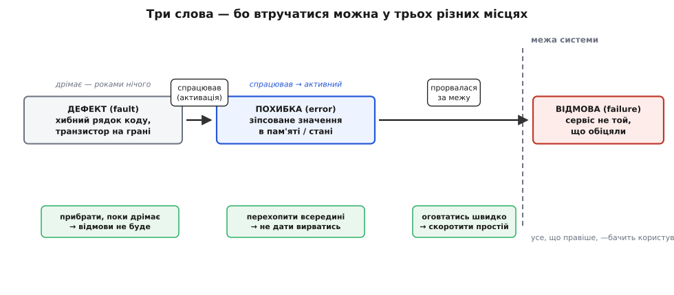

# 📜 Звідки взялися три слова: дефект, похибка, відмова

Візьміть будь-який протокол наради з надійності 1970-х — і ви побачите одну й ту саму сцену. Хтось каже: «У нас був fault у пам'яті». Хтось інший заперечує: «Ні, це був failure каналу». Третій уточнює: «Та ні, error виникла в лічильнику, а канал якраз відпрацював». І всі троє говорять про **одну й ту саму подію** — просто називають різними словами те, що відбувалося в різних місцях і в різні миті. Слова `fault`, `error`, `failure` в англійській — майже синоніми з побутового вжитку; словник дає їх одне через одне. А коли ти будуєш машину, яка **не має права зупинитися**, така неточність коштує грошей: не домовившись, у якій саме ланці сидить проблема, дві команди півдня сперечаються, чий це модуль винен.

Ця вставка — про те, як із побутової синонімії народився точний інженерний словник: як `fault`, `error` і `failure` розчепили на три **різні** поняття, хто це зробив, і чому без такого розчеплення надійні системи взагалі не піддаються методичній розмові. Українські відповідники, якими користуються в статтях цієї книги, — **дефект**, **похибка**, **відмова** — не переклад «на око», а спроба зберегти саме ту тришарову різницю, яку виборювали десятиліттями.

## Чому одного слова замало

Почнімо з простого питання, на яке інтуїція дає неправильну відповідь. Скільки станів має «щось пішло не так»? Здається, що один: або система працює, або зламалася. Але подивіться уважніше на будь-який реальний збій, і ви побачите **три окремі події, рознесені в часі**, які легко склеїти в одну лише тому, що вони швидко йдуть одна за одною.

Уявіть рядок коду, де програміст переплутав `<` на `<=`. Ця помилка вже в бінарнику. Вона там лежить — місяць, рік, поки виконання жодного разу не зайшло в ту гілку з граничним значенням. Машина працює бездоганно, клієнт задоволений, а всередині вже **закладена причина** майбутнього лиха. Це перший стан: щось хибне вже є, але воно **дрімає** й нічим себе не виявляє.

Аж ось приходить вхід рівно на межі — і виконання вперше заходить у ту гілку. Тепер `<=` спрацьовує там, де мало спрацювати `<`, і в пам'ять лягає значення на одиницю більше, ніж треба. Індекс масиву став неправильним. Це **другий стан**: причина вже спрацювала, стан системи вже зіпсований — але назовні поки що нічого не видно. Черга ще обробляється, відповіді ще йдуть, просто в глибині сидить одне неправильне число, яке чекає, поки на нього наступлять.

І тільки коли інша частина коду прочитає той зіпсований індекс, візьме за ним чуже значення й віддасть його користувачеві як «залишок на рахунку» — аж тоді сторонній спостерігач бачить, що система **збрехала**. Оце **третій стан**: неправильність перетнула межу системи й стала видимою ззовні як послуга, що не відповідає обіцяній.

Три стани — **дрімлива причина**, **зіпсований внутрішній стан**, **видимий назовні зрив** — це не філософські тонкощі. Це три **різні місця**, у кожному з яких інженер може встромити важіль і зупинити лихо. Якщо в тебе одне слово на всі три, ти цих місць не бачиш; ти бачиш лише «зламалося» — по факту, коли вже пізно. А якщо слів три, ти можеш поставити питання по-різному до кожного: чи знайду я хибний рядок, поки він дрімає? чи перехоплю зіпсоване число, поки воно всередині? чи хоч устигну оговтатись, коли брехня вже вилізла? Точний словник тут — не педантизм філолога, а **карта місць для втручання**.

*Три слова тримаються не заради краси термінології, а тому що втручатися можна у трьох різних точках: прибрати дефект, поки дрімає; перехопити похибку, поки всередині; швидко оговтатись, коли відмова вже назовні.*

Саме тому канонічні означення звучать так, як звучать. **Дефект (англ. *fault*)** — «визнана або припущена причина похибки». Зверніть увагу на дивне слово «визнана» (англ. *adjudged*): дефект часто не спостерігають прямо, а лише **виводять** з того, що спостерігали, — як слідчий виводить причину з наслідків. **Похибка (англ. *error*)** — та частина внутрішнього стану системи, що відхилилася від правильного й може призвести до зриву послуги. **Відмова (англ. *failure*)** — подія, коли надана послуга **відхиляється** від правильної, тобто перестає відповідати тому, що система мала робити. Дефект спричиняє похибку; похибка, дорісши до межі, спричиняє відмову. Причина → її прояв усередині → зрив назовні. Ці формулювання не вигадали за столом — їх **виточили** з десятиліть плутанини, і за кожним словом стоїть конкретна суперечка, яку воно закриває.

> 🔧 **Навіщо це.** Коли на розборі інциденту три інженери описують «одну проблему» трьома різними словами — це майже завжди значить, що вони дивляться на **різні ланки** одного ланцюга: один бачить хибний рядок (дефект), другий — зіпсоване значення в дампі (похибку), третій — скаргу клієнта (відмову). Домовитися про словник — це не формальність, це спосіб перестати сперечатися «чий модуль винен» і почати говорити «у якій ланці рвемо ланцюг».

## Що бентежило інженерів: машини, яким не можна падати

Потреба в точності не з'явилася сама по собі — її **притиснуло** конкретне залізо. У 1960-х обчислення ще терпіли простій: більшість машин рахувала пакетами, впала вночі — переклали задачу на ранок. Але з'явилися дві породи систем, для яких «переклали на ранок» означало катастрофу, і саме вони змусили інженерів говорити про надійність точно.

Перша порода — **космос**. Бортовий комп'ютер міжпланетної станції не можна перезавантажити, натиснувши кнопку: до нього мільйони кілометрів, а місія триває роками. У Лабораторії реактивного руху (JPL) при Каліфорнійському технологічному, де готували апарати для NASA, це відчули гостро. Саме там литовсько-американський інженер **Альгірдас Авіженіс (Algirdas Avižienis)** у 1960-х розробляв концепцію самовідновних комп'ютерів — машин, здатних самим полагодити себе на льоту. (Про його ідентичність — трохи згодом; вона тут не дрібниця.) Щоб проєктувати таку машину, треба було точно розрізняти: оце в нас **причина** (згорів логічний вентиль від космічного променя), а оце — її **прояв** (біт у слові перекинувся), а оце — **зрив** (апарат передав хибну телеметрію). Бо латати кожну з трьох ланок треба **по-різному**: причину — резервуванням заліза, прояв — надлишковим кодуванням, зрив — повторним переданням. Одне слово на всі три тут нічого не пояснює.

Друга порода — **онлайнові транзакції**. Коли банк уперше пустив клієнтів до рахунків через термінали в реальному часі, простій системи перестав бути незручністю й став прямою втратою грошей і довіри щохвилини. Класична сцена цього світу — **Tandem Computers**. Компанію заснував у листопаді 1974 року **Джеймс (Джиммі) Трейбіг (James «Jimmy» Treybig)**, колишній маркетолог відділу HP 3000 у Hewlett-Packard. Працюючи в HP, він побачив ринкову діру: банкам, біржам, телефонним компаніям потрібен комп'ютер, який **не зупиняється ніколи**, а HP таким не цікавився. Ідея Трейбіга була проста на словах: постав два чи більше процесори, що працюють незалежно; помер один — його роботу підхоплюють інші, і система не падає. Перша машина, Tandem/16 (лінійка **NonStop**), поїхала до Citibank у травні 1976 року. Її фішкою були **пари процесів** (англ. *process pairs*) — програмне дублювання, де другий процес тримає копію стану першого й миттєво перебирає роботу.

І ось тут інженерів Tandem бентежило те саме, що й людей із JPL, тільки з іншого боку. Щоб пара процесів працювала, треба **точно знати, що саме передавати від живого до резервного й коли перемикати**. Передавати після кожної відмови — пізно, дані вже зіпсовані. Передавати стан безперервно — а який саме стан? Той, що вже містить похибку, чи ще чистий? Питання «коли саме зіпсований стан стає видимою відмовою» перестало бути академічним — від відповіді залежало, у яку мить резервний процес має підхопити, щоб не успадкувати заразом і зіпсоване число. Без розрізнення «похибка (стан уже поганий, але всередині)» і «відмова (уже прорвалося назовні)» неможливо було навіть **сформулювати**, де ставити контрольну точку.

Те саме тиснуло на **телефонні комутатори**. Телефонна мережа за традицією тримала планку «п'ять дев'яток» — не більш як кілька хвилин простою на рік. Комутатор обробляє тисячі дзвінків паралельно; збій в одному тракті не сміє повалити всю станцію. Інженерам зв'язку потрібно було проєктувати так, щоб **похибка** в обробці одного дзвінка **не переростала** у **відмову** всієї станції — а щоб про це говорити, знову-таки треба було ці два слова розчепити. Скрізь, де система не мала права падати, спливала одна й та сама потреба: **розрізнити причину, її прояв усередині й зрив назовні** — і назвати їх різними словами, які не плутаються.

> 🔧 **Навіщо це.** Ця історія пояснює, чому весь словник надійності виріс саме навколо доступності й відмовостійкості, а не деінде. Доти, доки простій нічого не коштував, вистачало одного слова «зламалося». Точний словник знадобився рівно тоді, коли з'явилися системи, для яких **кожна ланка ланцюга — окреме поле бою**: космос латає причину резервуванням, банк ловить похибку контрольними точками, телефонна станція не дає зриву розповзтися. Різні місця втручання — різні слова.

## Робоча група IFIP WG 10.4: де словник домовили

Розрізнення визрівало в багатьох головах, але щоб воно стало **спільним**, комусь треба було посадити цих людей за один стіл. Цим столом стала **Робоча група IFIP WG 10.4**.

Кілька літер для контексту. **IFIP** (International Federation for Information Processing) — Міжнародна федерація обробки інформації, парасолькова організація національних комп'ютерних товариств, заснована 1960 року під егідою ЮНЕСКО. Усередині неї є **технічні комітети** (TC), а в них — **робочі групи** (WG) за вужчими темами. У жовтні 1980 року Генеральна асамблея IFIP заснувала при комітеті **TC-10** («Computer Systems Technology») **робочу групу 10.4** з надійних обчислень і відмовостійкості (*Dependable Computing and Fault Tolerance*). Її задача — саме те, чого бракувало: звести дослідників надійності з різних країн і різних шкіл, щоб вони перестали говорити повз одне одного.

Ключова подія сталася 1982 року на конференції **FTCS-12** — дванадцятому Міжнародному симпозіумі з відмовостійких обчислень (*International Symposium on Fault-Tolerant Computing*). Там представили **сім позиційних доповідей** — сім різних поглядів на те, як має бути влаштований словник надійності. Сім, бо єдності не було: кожна школа тягла термінологію у свій бік, і симпозіум це чесно показав. Треба було не сьому думку додати, а **синтез** — зшити сім поглядів в один несуперечливий каркас.

Цей синтез зробив француз **Жан-Клод Лапрі (Jean-Claude Laprie)** з Лабораторії аналізу й архітектури систем (**LAAS-CNRS**) у Тулузі — дослідницького центру Національного центру наукових досліджень Франції. Лапрі мав рідкісний хист до **абстракції й формалізації**: там, де інші бачили купу окремих випадків, він бачив структуру. Його зведення оприлюднили 1985 року на **FTCS-15** — доповідь «Dependable Computing and Fault Tolerance: Concepts and Terminology» (Надійні обчислення й відмовостійкість: поняття й термінологія). Саме там тришаровий ланцюг **дефект → похибка → відмова** отримав чіткі означення, а поряд із ним — систематику **засобів** досягнення надійності й **атрибутів** самої надійності. Це вже не сьома думка в суперечці, а каркас, на який згодні всі за столом.

Варто окремо спинитися на слові, яке Лапрі поклав у центр, — **надійність** у широкому сенсі, англ. *dependability*. Французьким першоджерелом тут була **«sûreté de fonctionnement»** — буквально «безпечність функціонування», поняття ширше за просту безвідмовність: воно охоплює здатність системи бути такою, щоб на її послугу можна було **обґрунтовано покластися**. Це навмисно **парасолькове** слово: під ним живуть і безвідмовність (англ. *reliability*), і доступність (англ. *availability*), і безпечність для життя (англ. *safety*), і захищеність (англ. *security*) — усе, що робить систему **вартою довіри**. Українською немає одного ідеального слова на весь цей букет; «надійність» беруть як найближче, тримаючи в голові, що в оригіналі це ширше. Головне, що Лапрі дав цьому парасольковому поняттю **точну внутрішню будову** — і саме будова, а не назва, стала спільним надбанням.

> 🔧 **Навіщо це.** «Sûreté de fonctionnement» проти англійського «dependability» — гарний приклад того, як термін залежить від мови, у якій народився, і чому переклад термінології — це завжди **втрата якогось відтінку**. Коли в статтях цієї книги пишеться «доступність», «безвідмовність», «захищеність» як **окремі** атрибути — це спадок саме цього розчеплення: Лапрі показав, що «надійність узагалі» — не одне число, а сім'я різних властивостей, кожну з яких вимірюють і купують окремо (звідси й [окрема турбота про доступність](book:programming/quality-attributes) як один вимір серед інших).

## Книга 1992 року: словник, який заговорив п'ятьма мовами

Синтез 1985 року був статтею. Щоб він став **стандартом**, його треба було довести до повного, вивіреного, доступного багатьом вигляду. Так з'явилася книга.

**«Dependability: Basic Concepts and Terminology»** (Надійність: базові поняття й термінологія) вийшла 1992 року у видавництві Springer-Verlag; роботу вела група членів IFIP WG 10.4 під проводом Лапрі. Книга невелика за обсягом основного тексту, але щільна: **118 означень**, зведених наприкінці в глосарій, — кожне слово поставлене на своє точне місце в системі. Дефект, похибка, відмова; безвідмовність, доступність, безпечність, захищеність; запобігання дефектам, відмовостійкість, усунення дефектів, прогнозування дефектів — усе це отримало формальні, узгоджені означення, на які відтоді можна посилатися, не переповідаючи щоразу.

Але найцікавіша деталь книги — **не англійський текст**. Той самий зміст переклали ще **чотирма мовами**: французькою, німецькою, італійською та японською, з наскрізним багатомовним покажчиком термінів. І це не примха видавця, а вияв самої проблеми, яку книга розв'язувала. Річ у тім, що плутанина в надійності була **не лише англійською**. У кожній мові свої слова для «зламалося», і вони діляться на «причину / прояв / зрив» **по-своєму** або й зовсім не діляться. Німецький інженер, французький і японський, зустрівшись, плуталися **вдвічі**: спершу через нечіткість усередині кожної мови, а тоді ще й через переклад між ними. Багатомовний глосарій прямо зшивав ці системи: ось англійське *fault*, ось його точний французький, німецький, італійський, японський відповідник — і всі означають **одне й те саме місце в ланцюгу**. Без такого зшивання міжнародна робоча група лишилася б вавилонською вежею, де кожен будує надійність своєю говіркою.

Ось чому українські **дефект / похибка / відмова** в цій книзі підібрані так свідомо. Це продовження тієї самої роботи: узяти три місця в ланцюгу — причину, прояв усередині, зрив назовні — і закріпити за кожним **окреме, стійке** українське слово, яке не з'їжджає в синонім сусіда. «Дефект» — прихована причина. «Похибка» — зіпсований внутрішній стан (не «помилка», бо помилку зробила людина в коді, а похибка — це вже стан машини). «Відмова» — видимий зовні зрив послуги. Один термін на одне поняття, без випадкової синонімії — рівно той принцип, що його виборювали Лапрі й група.

## Стаття 2004 року: коли до надійності приклеїли захищеність

Історія словника мала б на цьому закінчитися — але життя додало ланку, якої в 1980-х майже не бачили. У міру того як системи виходили в мережі, з'ясувалося, що причини відмов бувають **навмисні**. Дефект — це не лише випадковий космічний промінь чи забутий `<=`; це може бути й людина, яка **зумисне** щось зламала: атака, закладка, зловмисний вхід. А коли причина зловмисна, до звичайної надійності додається **захищеність** (англ. *security*) із її власними турботами — таємністю, цілісністю, стійкістю до нападу. Постало питання: чи це окрема наука, чи та сама систематика, просто з новим родом дефектів?

Відповіддю стала **канонічна стаття 2004 року** — та, на яку відтоді посилаються як на **усталене джерело** словника надійних і захищених обчислень. Її написали чотири автори, і варто назвати кожного, бо кожен приніс свій шматок:

- **Альгірдас Авіженіс (Algirdas Avižienis)** — від самовідновних машин JPL і UCLA;
- **Жан-Клод Лапрі (Jean-Claude Laprie)** — від синтезу IFIP і LAAS;
- **Браян Ренделл (Brian Randell)** — британський дослідник із Ньюкаслського університету, автор **блоків відновлення** (англ. *recovery blocks*), однієї з перших схем програмної відмовостійкості (проєкт 1971 року, засаднича стаття 1975-го); він приніс до систематики бік **програмних** дефектів і відновлення після них;
- **Карл Ландвер (Carl Landwehr)** — американський дослідник комп'ютерної безпеки з Дослідницької лабораторії ВМС США (NRL), автор впливової **систематики вад захисту**; саме він зшив бік захищеності з рештою.

Стаття «Basic Concepts and Taxonomy of Dependable and Secure Computing» (Базові поняття й систематика надійних і захищених обчислень) вийшла в першому ж числі нового журналу **IEEE Transactions on Dependable and Secure Computing** (том 1, № 1, сторінки 11–33, 2004). Уже сама назва журналу — «Dependable **and Secure**» — свідчить, що дві доти окремі спільноти, надійність і безпека, звели під один дах. І звели саме через **той самий ланцюг**: захищеність вписали в нього не як щось стороннє, а як **особливий рід дефекту** — навмисний, зловмисний. Атака — це дефект, який хтось увів зумисне; успішне вторгнення псує стан — це похибка; порушення послуги (витік даних, підміна, відмова в обслуговуванні) — це відмова. Той самий тришаровий каркас 1985 року **розтягли** так, щоб він накрив і випадкові збої, і навмисні напади. Це і є ознака доброго словника: коли з'являється нове явище, добрий каркас його **вміщує**, а не ламається об нього.

Ця стаття уточнила й самі означення до тієї викшталтуваної форми, у якій ними користуються сьогодні, — з розрізненням **дрімливого** й **активного** дефекту (дефект активний, коли спричиняє похибку; інакше дрімає), з описом, як похибка **повзе** (англ. *propagation*) від компонента до компонента, поки не сягне межі й не стане відмовою. Кожне з цих уточнень — відповідь на конкретне «а що, як…», яке за двадцять років накопичила практика.

## Ідентичність без імперського склеювання

Тепер — про людей точно, бо тут легко з'їхати в неточність, яка ображає й спотворює.

**Жан-Клод Лапрі (Jean-Claude Laprie, 1944–2010)** — **француз**, усе життя пропрацював у Тулузі, у LAAS-CNRS, Directeur de Recherche. Його внесок відзначений і у Франції (Срібна медаль французьких наукових досліджень, 1993; Велика премія з інформатики Французької академії наук, 2009), і на міжнародному рівні. На його честь IFIP WG 10.4 із 2012 року щороку присуджує **премію імені Жана-Клода Лапрі** за роботи, що суттєво вплинули на надійні обчислення. Тут усе однозначно: французький учений, французька інституція, французьке першоджерело терміна.

**Альгірдас Авіженіс (Algirdas Avižienis, нар. 1932)** — випадок, де точність особливо важлива, бо радянський наратив залюбки склеїв би його в «радянського» чи «російського» вченого, і це була б **неправда**. Авіженіс — **литовець**. Народився в Каунасі, у Литві. У США живе й працює з 1950 року; освіту здобув в Університеті Іллінойсу, кар'єру зробив у JPL і Каліфорнійському університеті в Лос-Анджелесі (UCLA), де очолював кафедру комп'ютерних наук. Він **литовсько-американський** учений — і сам це підкреслював долею: коли 1989 року в незалежній Литві відновили Університет Вітовта Великого (Vytautas Magnus University) у Каунасі, саме Авіженіс став його **першим ректором** (1990–1993). Отже: етнічний литовець, громадянин США, литовська й американська інституції — жодного стосунку до «радянської» чи «російської» науки, попри те що радянська історіографія охоче зараховувала б уродженців окупованих республік до «своїх». Ідентичність тут — не формальність у дужках, а свідоме спростування можливого поглинання.

**Браян Ренделл (Brian Randell, нар. 1936)** — **британець**, професор Ньюкаслського університету; його блоки відновлення — англійська, ньюкаслська школа програмної відмовостійкості. **Карл Ландвер (Carl Landwehr)** — **американець**, дослідник безпеки з Дослідницької лабораторії ВМС США; освіту здобув у Єлі та Мічиганському університеті.

Отже, каркас надійності — не витвір однієї країни й тим паче не «чийсь пріоритет». Це **колективна** праця француза, литовця-американця, британця й американця, зведена за столом міжнародної групи з семи різних поглядів. Саме така історія — з чесно названими націями й інституціями — і є нормою для інженерного поняття: воно народжується в багатьох головах і кристалізується в спільноті, а не «належить» комусь одному.

## Статус доказовості

Аби читач знав, наскільки твердий ґрунт під кожним твердженням вище:

- Заснування IFIP WG 10.4 (жовтень 1980, при TC-10), сім позиційних доповідей на FTCS-12 (1982), синтез Лапрі 1985 року (FTCS-15), книга 1992 року з перекладами чотирма мовами й 118 означеннями, стаття 2004 року (IEEE TDSC, том 1, № 1, с. 11–33) чотирьох авторів — **усталені факти**, задокументовані самою робочою групою та бібліографією IEEE/Springer.
- Означення дефекту як «визнаної або припущеної причини похибки», похибки як відхилення стану, відмови як відхилення послуги, а також розрізнення дрімливого/активного дефекту й пропагації похибки — **усталені**, узяті з канонічної статті 2004 року.
- Ідентичності всіх чотирьох авторів (Лапрі — француз; Авіженіс — литовець-американець, уродженець Каунаса, перший ректор відновленого Університету Вітовта Великого; Ренделл — британець; Ландвер — американець), дати їхнього життя й інституції — **усталені**, за біографічними джерелами відповідних установ і академій.
- Історія Tandem Computers (заснування Трейбігом у листопаді 1974, перша NonStop-машина до Citibank у травні 1976, пари процесів) — **усталений факт**; те, що саме потреби Tandem, космосу JPL і телефонних комутаторів **стимулювали** попит на точний словник, — **правдоподібна історична реконструкція**: ці системи справді змусили індустрію говорити про надійність точніше, хоча жодне окреме означення не «замовила» конкретно котрась із них. Це радше загальний тиск епохи, ніж пряма причинно-наслідкова лінія від одного банку до одного слова.

Українські відповідники **дефект / похибка / відмова** — це усталений у фаховій літературі спосіб зберегти тришарову різницю; вони не є частиною первісних англо-французьких документів, а є їхнім послідовним українським прочитанням.
