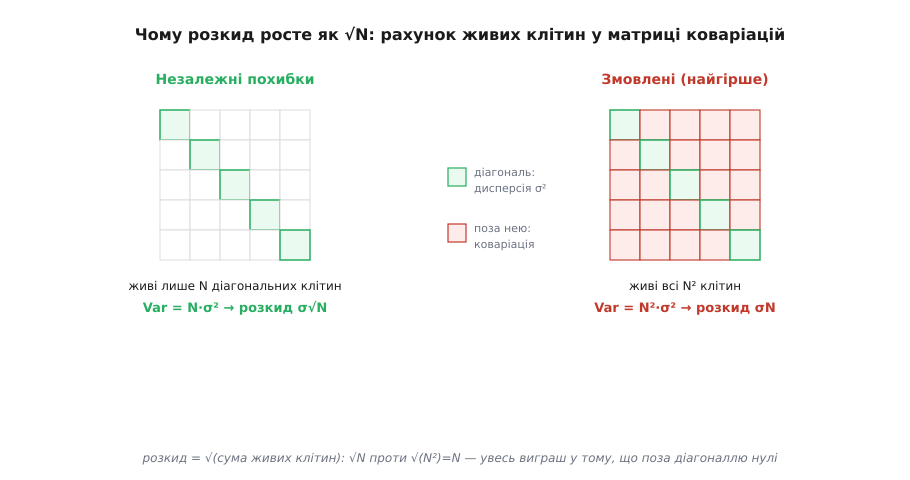
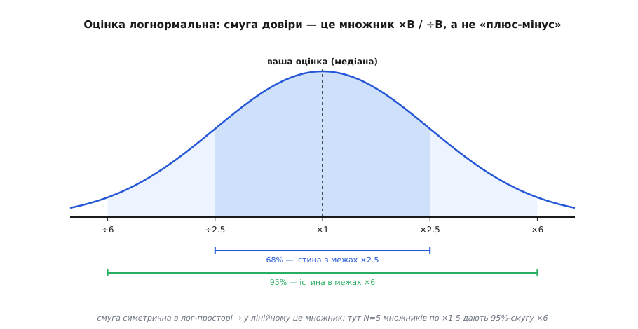
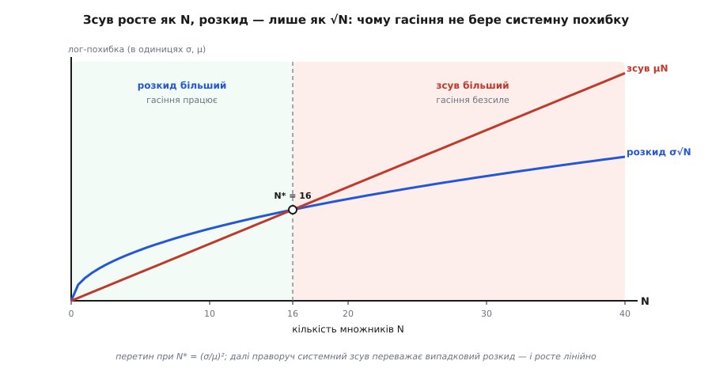

# 🧮 Логнормальна модель прикидки: звідки береться √N і межа похибки

Прикидка на серветці стоїть на одній зухвалій обіцянці: якщо розкласти шукане на десяток грубих множників, добуток вийде точнішим за кожен із них. Груба інтуїція за цим уже проговорена — похибки тягнуть урізнобіч і почасти гасяться, а розкид добутку росте не як `N`, а лише як `√N`. Але інтуїція — це вексель, який колись треба оплатити готівкою. Тут ми його оплачуємо: будуємо чесну випадкову модель похибки, **доводимо** з нуля, чому додаються саме дисперсії, показуємо, що оцінка розподілена логнормально, виводимо з цього конкретну смугу довіри — і знаходимо рівно три місця, де гасіння ламається. Найкрасивіше в цій історії те, що всі три поломки виявляться однією й тією ж короткою теоремою, у якої по черзі відмовляє одне з трьох припущень.

## Похибка — це множник, а не «плюс-мінус»

Перше, що треба перевернути в голові: у прикидці похибка **множникова**, а не адитивна. Коли ви кажете «настроювачів піаніно тисяч п'ятдесят, плюс-мінус», ви насправді не маєте на увазі «плюс-мінус стільки-то тисяч». Ви маєте на увазі «може, вдвічі більше, може, удвічі менше» — похибку **в разах**. Оцінка «50 тисяч» із можливим промахом ×2 означає діапазон від 25 до 100 тисяч, несиметричний навколо середини за звичайною лінійкою, зате ідеально симетричний за іншою.

Ця інша лінійка — логарифм. Відстань між вашою оцінкою `Q̂` та істиною `Q` природно міряти не різницею `Q̂ − Q`, а відношенням `Q̂ / Q`, і саме логарифм робить це відношення симетричним: завищення в півтора раза й заниження в півтора раза — це `+ln 1.5` і `−ln 1.5`, дві однакові за модулем відстані в різні боки. Множникова похибка, узята в логарифмі, стає звичайною симетричною похибкою «туди-сюди від нуля» — і тільки тому весь апарат нижче взагалі працює.

> 🔧 **Навіщо це.** Якщо міряти похибку прикидки в абсолютних одиницях, ви отримаєте безглуздя: «індекс важить 2.4 ГБ ± 5 ГБ» дозволяє від'ємну вагу. У множниках усе на місці: «2.4 ГБ, з точністю до ×2» означає 1.2–4.8 ГБ і ніколи не пірне нижче нуля. Оцінки живуть у світі відношень, тому їхня похибка теж має бути відношенням.

Запишімо задачу чесно. Шукане розкладено на добуток, а кожен множник оцінено з якимось множниковим промахом `rᵢ`:

```
Q  = f₁ · f₂ · … · f_N            (істина)
Q̂ = f̂₁ · f̂₂ · … · f̂_N           (ваша оцінка)
f̂ᵢ = fᵢ · rᵢ                       rᵢ = 1.5 → «завищив у півтора»,  rᵢ = 0.7 → «занизив»
```

Уся невизначеність сидить у наборі невідомих `rᵢ`. Питання жанру — не «чому вони малі» (вони не малі, кожен легко ×1.5), а «чому їхній спільний вплив на добуток малий».

Ключ до всього — [логарифм](topic:math/logarithms), який перетворює добуток на суму: без цього переходу похибка добутку лишається неприступним клубком, а після нього стає найзрозумілішим об'єктом теорії ймовірностей — сумою.

## Логарифм робить із добутку суму

Прологарифмуймо оцінку. Добуток розсипається на суму, а кожен множник — на «істину плюс промах»:

```
ln Q̂ = ln(f̂₁ · … · f̂_N)
      = Σ ln f̂ᵢ
      = Σ (ln fᵢ + ln rᵢ)
      = ln Q + Σ ln rᵢ
```

Останній рядок — це вже вся постановка. Позначмо промах у лог-просторі на кожному множнику `Xᵢ = ln rᵢ`, а сумарну похибку добутку — теж у лог-просторі — літерою `E`:

```
E ≡ ln Q̂ − ln Q = ln(Q̂ / Q) = X₁ + X₂ + … + X_N = Σ Xᵢ
```

Ось воно. **Похибка добутку — це сума похибок множників.** Не добуток, не накопичення, а проста сума `N` доданків. Ми проміняли важкий об'єкт (добуток невідомих) на найкраще вивчений об'єкт у всій імовірності — суму незалежних доданків. Усе, що лишилося, — вивчити цю суму: де в неї центр і який розкид. Обидва питання мають короткі точні відповіді.

## Випадкова модель: чесно назвати похибку невідомою

Щоб говорити про «розкид» похибки, треба спершу визнати `Xᵢ` **випадковими величинами**. Це не твердження, що промахи справді породжені якимось генератором випадковості, — це чесне зізнання в незнанні: ви не знаєте, наскільки й куди схибили на кожному множнику, тож моделюєте промах розподілом можливих значень. Модель тримається на трьох припущеннях, і кожне з них — окреме твердження про світ, яке варто вимовити вголос, бо потім кожне поламається окремо:

```
1. E[Xᵢ] = 0        — нульове середнє: ви не брешете собі системно
                       (однаково готові завищити й занизити)
2. Var(Xᵢ) = σ²     — однаковий розкид: кожен множник відомий приблизно
                       з тією самою множниковою точністю
3. Xᵢ незалежні     — промахи не змовлені: похибка на одному множнику
                       нічого не каже про похибку на іншому
```

За цих трьох припущень центр суми знаходиться миттєво. Математичне сподівання суми — це завжди сума сподівань, без жодних умов:

```
E[E] = E[Σ Xᵢ] = Σ E[Xᵢ] = Σ 0 = 0
```

Отже, у лог-просторі ваша похибка центрована на нулі: оцінка не завищена й не занижена систематично. Мовою самого добутку це означає, що `Q̂` — **медіанно-незміщена**: істина однаково ймовірно лежить вище чи нижче вашої оцінки. Цікаве питання — не де центр (він на місці), а наскільки широко навколо нього розкидана істина. Це і є розкид `E`, і тут ховається весь `√N`.

## Чому саме √N: додаються дисперсії

Виведімо розкид суми з нуля, бо саме це виведення — серце довіри до жанру, і його майже завжди пропускають зі словами «дисперсії ж додаються». Вони додаються не завжди; побачмо чому.

Дисперсія за означенням — це середній квадрат відхилення від центру. Позначмо центровані величини `Yᵢ = Xᵢ − E[Xᵢ]` (у нашій чистій моделі `E[Xᵢ]=0`, тож `Yᵢ = Xᵢ`, але тримаймо загально). Тоді:

```
Var(E) = E[(E − E[E])²] = E[(Σ Yᵢ)²]
```

Розкриймо квадрат суми — і тут з'являється вся суть. Квадрат суми — це подвійна сума всіх попарних добутків:

```
(Σ Yᵢ)² = Σᵢ Σⱼ Yᵢ Yⱼ
```

Візьмімо сподівання й розділімо доданки на два сорти — коли індекси збігаються (`i = j`) і коли різні (`i ≠ j`):

```
Var(E) = Σᵢ Σⱼ E[Yᵢ Yⱼ]
       = Σᵢ E[Yᵢ²]        +   Σᵢ≠ⱼ E[Yᵢ Yⱼ]
       └── діагональ ──┘       └─ поза діагоналлю ─┘
       =   Σᵢ Var(Xᵢ)     +   Σᵢ≠ⱼ Cov(Xᵢ, Xⱼ)
```

Придивімося до двох частин. **Діагональ** — це `N` дисперсій, по одній на множник. **Поза діагоналлю** — це `N(N−1)` коваріацій, по одній на кожну впорядковану пару різних множників. Матриця коваріацій `N × N` має `N` клітин на діагоналі й `N² − N` поза нею — і весь результат залежить від того, скільки з цих клітин ненульові.

І ось де вмикається незалежність. Для **незалежних** величин `E[Yᵢ Yⱼ] = E[Yᵢ] · E[Yⱼ] = 0 · 0 = 0` — кожна позадіагональна клітина зникає. Виживає лише діагональ:

```
Var(E) = Σᵢ Var(Xᵢ) = N · σ²
розкид  = SD(E) = σ · √N
```

Порівняймо з найгіршим випадком — коли похибки не просто корельовані, а рухаються **як одна** (усі `Xᵢ` тягнуть в один бік разом, кореляція +1). Тоді кожна позадіагональна клітина дорівнює `σ²`, і виживають **усі** `N²` клітин:

```
Var(E) = N·σ² + N(N−1)·σ² = N²·σ²
розкид  = σ · N
```

Ось де народжується `√N` проти `N` — буквально як корінь із **кількості живих клітин** у матриці коваріацій: `√N` (сама діагональ) проти `√(N²) = N` (уся матриця). Незалежність обнуляє все поза діагоналлю, лишаючи корінь із `N`, а не з `N²`. Уся магія гасіння — це `N(N−1)` нулів, які незалежність ставить поза діагоналлю.


*Чому розкид росте як √N. Дисперсія суми — це сума всіх клітин матриці коваріацій: N дисперсій на діагоналі плюс N(N−1) коваріацій поза нею. Незалежність робить кожну позадіагональну клітину нулем, тож виживає лише діагональ — Var = N·σ², а розкид = σ√N. Якби похибки були змовлені (кореляція +1), ожили б усі N² клітин, і розкид сягнув би σ·N. Виграш прикидки — це геометрія: корінь із N живих клітин проти кореня з N².*

> 🔧 **Навіщо це.** Саме тому варто **розкладати шукане на більше множників, а не менше**. Здається, ніби кожен новий множник додає нову похибку, — і так, додає, але розкид росте лише як `√N`, тимчасом як кожен окремий множник, розбитий на два простіші, оцінюється точніше (менший `σ`). Розкласти «скільки піаніно» на «скільки помешкань × яка частка з піаніно» майже завжди чесніше, ніж угадувати кількість піаніно навпростець, — бо два легкі здогади під коренем б'ють один важкий.

## Центральна гранична теорема: оцінка логнормальна

Ми знайшли центр (нуль) і розкид (`σ√N`) похибки `E`. Але щоб перекласти розкид у смугу довіри — «істина в межах ×скільки з якою ймовірністю» — треба знати **форму** розподілу `E`, а не лише два його числа. І форма тут не довільна.

`E = Σ Xᵢ` — це сума багатьох незалежних доданків зі скінченною дисперсією. Для такого об'єкта є теорема, сильніша за будь-яку інтуїцію: [центральна гранична теорема](topic:math/central-limit) каже, що зі зростанням `N` розподіл такої суми неухильно наближається до нормального (дзвоноподібного), хай якими були розподіли окремих доданків. Тобто:

```
E = Σ Xᵢ  →  Normal(0, N·σ²)      (наближено, тим точніше, чим більше N)
```

А якщо логарифм оцінки нормальний, то сама оцінка `Q̂ / Q = e^E` розподілена **логнормально** — це величина, чий логарифм нормальний. І це не аналогія, а точний факт про походження цього розподілу. Нормальний закон народжується, коли багато дрібних незалежних похибок **додаються**; логнормальний — коли вони **перемножуються**. Прикидка — це буквально добуток незалежних множникових похибок, тож логнормальність тут не припущення, а неминучий підсумок. Цей розподіл увели Френсіс Гальтон і Дональд Мак-Алістер 1879 року саме як закон помилок, «поєднаних множенням, а не додаванням». *(Усталений факт: обидва — британці; Гальтон описав генезу через середнє геометричне, Мак-Алістер того ж року дав математичний апарат.)* А сама центральна гранична теорема має довгий родовід: перший випадок (для монетки) дав Абрахам де Муавр 1733 року, загальніше її сформулював П'єр-Симон Лаплас близько 1810-го, а строгу загальну форму через характеристичні функції довів Олександр Ляпунов 1901 року. *(Усталений факт; Ляпунов — російський математик, учень Чебишова, тут атрибуція без застережень.)*

Форма логнормального розподілу має практичний наслідок, який видно на малюнку. У **лінійному** масштабі він скошений: довгий правий хвіст (завищити вдесятеро легше, ніж занизити в десять разів у той самий бік числової осі). А в **логарифмічному** масштабі він симетричний — акуратний дзвін. Тому смуга похибки прикидки завжди **множникова**: не «±стільки-то», а «×B в один бік і ÷B в інший».


*Оцінка розподілена логнормально. Над логарифмічною віссю (де рівні кроки — це множники) похибка прикидки — симетричний дзвін із центром на вашій оцінці. Розкид дзвона — σ√N; звідси смуги довіри виходять множникові: 68% імовірності — що істина в межах ×2.5, 95% — у межах ×6 (для прикладу з п'яти множників по ×1.5). У лінійному масштабі той самий дзвін скошений праворуч — тому похибку оцінки й записують як «×B / ÷B», а не «плюс-мінус».*

## Смуга довіри: від σ√N до множника ×B

Тепер смуга виводиться в один рядок. Для нормального розподілу діє відоме правило: близько 68% маси лежить у межах ±1 стандартного відхилення від центру, ≈95% — у межах ±2, ≈99.7% — у межах ±3. У нас стандартне відхилення похибки — `σ√N`, центр — нуль. Отже:

```
68%:  |E| < σ√N     →   Q̂/Q у межах e^( σ√N)  в обидва боки
95%:  |E| < 2σ√N    →   Q̂/Q у межах e^(2σ√N)  в обидва боки
```

Смуга множникова: істинне `Q` лежить у діапазоні `[Q̂ / B, Q̂ · B]`, де множник довіри `B = e^(2σ√N)` для 95%. Підставмо типову грубу точність «до ×1.5» на множник, тобто `σ = ln 1.5`. Тоді смуга набуває напрочуд чистого вигляду:

```
B₉₅ = e^(2·ln1.5·√N) = 1.5^(2√N)          B₆₈ = 1.5^(√N)
```

Тобто 95%-смуга — це «півтора в степені подвоєного кореня з кількості множників». Порахуймо для зручних `N` (повні квадрати, щоб корінь був цілий):

```
N множників (кожен ×1.5)   68%-смуга 1.5^√N    95%-смуга 1.5^(2√N)
        4                       ×2.25               ×5.1
        9                       ×3.4                ×11
       16                       ×5.1               ×26
```

Звідси й правило великого пальця: **жменя множників по ×1.5 дає приблизно ×10 смуги на рівні 95%**. Дев'ять множників — `1.5⁶ ≈ ×11`; півдюжини — `1.5⁵ ≈ ×7`. Це рівно та роздільність, заради якої існує жанр: навіть десяток недбалих множників лишає істину в межах порядку величини — а порядок величини й вирішує «один сервер чи тисяча». Не тісніше, але й не гірше: `√N` не дає смузі розповзтися до безнадійного `1.5^(2N)`, яке б виходило зі змовлених похибок.

**Умова.** Оцінімо денний обсяг логів сервісу — і назвімо не саме число, а смугу, у якій йому дозволено блукати. П'ять множників, кожен чесно «з точністю до ×1.5»:

```python
import math

# П'ять грубих множників денного обсягу логів, кожен «з точністю до ×1.5»:
factors = [2_000_000,   # активних користувачів
           3,           # сеансів на добу
           20,          # дій за сеанс
           5,           # рядків логу на дію
           300]         # байтів на рядок
N = len(factors)                          # = 5

Q = math.prod(factors)                    # = 1.8·10¹¹ байтів ≈ 180 ГБ/добу

sigma  = math.log(1.5)                    # ≈ 0.405 — розкид лог-похибки на множник
sd_log = sigma * math.sqrt(N)             # ≈ 0.906 — розкид ДОБУТКУ (дисперсії додались)

band68 = math.exp(sd_log)                 # ≈ 2.47  → істина в межах ×2.5 (68%)
band95 = math.exp(2 * sd_log)             # ≈ 6.1   → істина в межах ×6   (95%)

# Найгірше, якби всі п'ять похибок були змовлені (розкид σ·N, а не σ·√N):
band95_worst = math.exp(2 * sigma * N)    # ≈ 57    → оцінка стала б марною

low, high = Q / band95, Q * band95        # 95%-смуга: ≈ 30 ГБ … ≈ 1.1 ТБ/добу
```

**Висновок.** Оцінка — 180 ГБ на добу, і, головне, з чесною смугою: типово (68%) істина в межах ×2.5, майже напевно (95%) — у межах ×6, тобто від ≈30 ГБ до ≈1.1 ТБ. Цього досить, щоб ухвалити рішення: конвеєр треба проєктувати на терабайт на добу, бо навіть верх 95%-смуги його черкає, а закладати впритул на 180 ГБ було б необачно. А тепер погляньте на `band95_worst`: якби ті самі п'ять похибок були змовлені, смуга роздулася б до ×57 — від 3 ГБ до 10 ТБ, і про жодне рішення не було б мови. Різниця між придатною оцінкою й марною — це рівно різниця між `σ√N` і `σN`, тобто між незалежними й змовленими похибками. Що і підводить до питання, коли саме гасіння ламається.

## Три тріщини, крізь які гасіння тікає

Уся довіра стояла на трьох припущеннях моделі. Приберіть будь-яке — і `√N` зникає. Три припущення дають рівно три способи зламати прикидку, і кожен — це відмова однієї частини щойно виведеної теореми. Знати їх — це і є дисципліна жанру.

### Корельовані похибки: ламається незалежність

Незалежність обнуляла позадіагональні клітини. Якщо ж похибки корельовані — усі числа взяті з одного оптимістичного маркетингового звіту, усі округлені «щоб напевно» в один бік, — клітини оживають. Із рівномірною кореляцією `ρ` між усіма парами загальна дисперсія стає:

```
Var(E) = N·σ² + N(N−1)·ρσ² = σ²·N·[1 + (N−1)ρ]
розкид  = σ·√N · √(1 + (N−1)ρ)
```

Перевірмо краї: `ρ = 0` повертає `σ√N` (незалежність), `ρ = 1` дає `σ√(N·N) = σN` (повна змова). Небезпека в тому, що позадіагональних клітин `N(N−1) ≈ N²` — на цілий порядок більше, ніж `N` діагональних, — тож навіть **крихітна** кореляція, щойно `(N−1)ρ` дотягнеться до одиниці (тобто `ρ ≈ 1/N`), уже подвоює дисперсію. Порахуймо на `N = 10` з помірним `ρ = 0.3`:

```
1 + (N−1)ρ = 1 + 9·0.3 = 3.7
розкид = σ·√10·√3.7 = 0.405 · 3.16 · 1.92 ≈ 2.46      (проти 1.28 незалежного)
95%-смуга = e^(2·2.46) ≈ ×138                         (проти ×13 незалежного)
```

Скромна кореляція 0.3 майже подвоює розкид і роздуває 95%-смугу з ×13 аж до ×138 — на порядок гірше. Ознака небезпеки проста: **усі припущення дивляться в один бік** — усі найкращий випадок або всі найгірший. Ліки теж прості: свідомо змішувати. Де завищили одне число, там навмисне занизьте інше; тоді кореляція повзе до нуля, і `√N` повертається.

### Один домінантний множник: ламається рівність дисперсій

Розкид `σ√N` неявно припускав, що всі доданки однаково непевні. Відпустімо це: нехай `Var(Xᵢ) = σᵢ²` різні. Незалежність ще тримається, тож позадіагональ порожня, і залишається чиста сума квадратів:

```
Var(E) = Σᵢ σᵢ²          розкид = √(σ₁² + σ₂² + … + σ_N²)
```

Ця сума квадратів **домінується найбільшим доданком** — і в цьому вся пастка. Оскільки складаються квадрати, множник удвічі непевніший дає вчетверо більший внесок; найгірша ланка не просто важить більше, вона придушує решту квадратично. Хай дев'ять множників відомі добре (`σ = 0.2`, тобто ×1.22 кожен), а один — кепсько (`σ = 2.0`, тобто «легко на порядок», ×7.4):

```
Var(E) = 9·(0.2)² + (2.0)² = 0.36 + 4.0 = 4.36
розкид = √4.36 ≈ 2.09  ≈  σ_домінанта (2.0)
```

Дев'ять добре відомих множників дали лише `0.36 / 4.36 ≈ 8%` невизначеності; решта 92% сидить в одному поганому. `√N`-гасіння тут ні до чого — точність добутку дорівнює точності найгіршої ланки. Але це не поразка, а вказівник: прикидка сама каже, **куди інвестувати наступну годину** — іти й міряти саме той один множник, бо решта не зрушить відповіді, хоч як їх уточнюй.

### Системний зсув: ламається нульове середнє

Найпідступніша тріщина. Гасіння вимагало `E[Xᵢ] = 0`. Якщо ж кожна похибка має ненульове середнє `μ` в один бік — ви систематично щось забуваєте (реплікацію, службовий трафік, накладні витрати) або завжди берете число з оптимістичного боку без запасу, — то центр суми зсувається:

```
E[E] = Σ E[Xᵢ] = N·μ ≠ 0
```

Це не розкид, а **зсув усього дзвона**. І ось вирішальне протиставлення, заради якого варта вся ця акуратність: випадковий розкид росте як `σ√N`, а систематичний зсув — як `N·μ`, **лінійно**. Їхнє відношення `Nμ / (σ√N) = (μ/σ)·√N` росте без упину. Тобто хай який дрібний нахил на кожному множнику — за досить довгого ланцюга він неминуче переростає весь випадковий розкид. Гірше: якщо випадкову похибку розклад на більше множників **послаблює** (корінь), то систематичну він **підсилює** — кожен новий зсунутий множник додає ще `μ` до зсуву. Усереднення не рятує від постійного нахилу; воно взагалі не про центр, а лише про розкид навколо нього.


*Чому гасіння безсиле проти зсуву. Випадковий розкид росте як √N — увігнута, дедалі повільніша крива. Систематичний зсув росте як N — пряма. Вони перетинаються при N* = (σ/μ)²: ліворуч панує випадковий розкид і `√N`-гасіння працює, праворуч його переростає системний нахил. Для σ ≈ 0.4 і крихітного нахилу μ ≈ 0.1 (кожен множник тихо зсунутий на ~10%) перетин уже при N* = 16 — а далі зсув лише більшає, і жодне множення його не прибере.*

Ліки проти зсуву — не математика, а контрольні звички, бо вони цілять у **середнє**, якого зменшення дисперсії ніколи не торкається: стежити за одиницями (переплутані біти й байти — це чистий зсув на три порядки), рахувати двічі незалежними шляхами (два методи, що чесно розходяться, викривають прихований нахил, якого жоден із них сам не побачив би), перевіряти межі (відповідь більша за цілий світ — знак систематичної помилки, а не розкиду). Усе це — полювання на `μ`, а не на `σ`.

## Де це працює на прикидці

Три числа з цього виведення тримають увесь жанр серветки. Розкид `σ√N` — це причина, чому стос відвертих здогадів дає число в межах порядку величини: не тому, що вгадали, а тому, що незалежні промахи ховаються під корінь. Логнормальна смуга `×B` — це та невизначеність, яку насправді порівнюють із порогом рішення: якщо вся смуга лежить по один бік бюджету, оцінка вирішальна навіть без другої значущої цифри; якщо смуга **накриває** поріг, груба прикидка чесно вичерпалась, і час іти по точніші дані — саме тут проходить межа [коли рішення можна ухвалювати під невизначеністю](topic:programming/deciding-under-uncertainty), а коли ні. А три тріщини — це передпольотний список для будь-якого числа з серветки: чи всі мої похибки з одного джерела? чи немає одного множника, куди тікає вся невизначеність? чи не нахиляюся я щоразу в той самий бік?

Уся магія, зрештою, стискається в одне речення. Візьміть логарифм — і похибка добутку стане сумою незалежних дрібних поштовхів, чий розкид росте лише як корінь із їхньої кількості; а жанр вартий довіри рівно настільки, наскільки чесно та сума лишається незміщеною, некорельованою і без єдиного домінанта. Три умови — три способи збрехати собі, і той самий короткий доказ, прочитаний уперед, каже, чому решту часу собі можна вірити.
