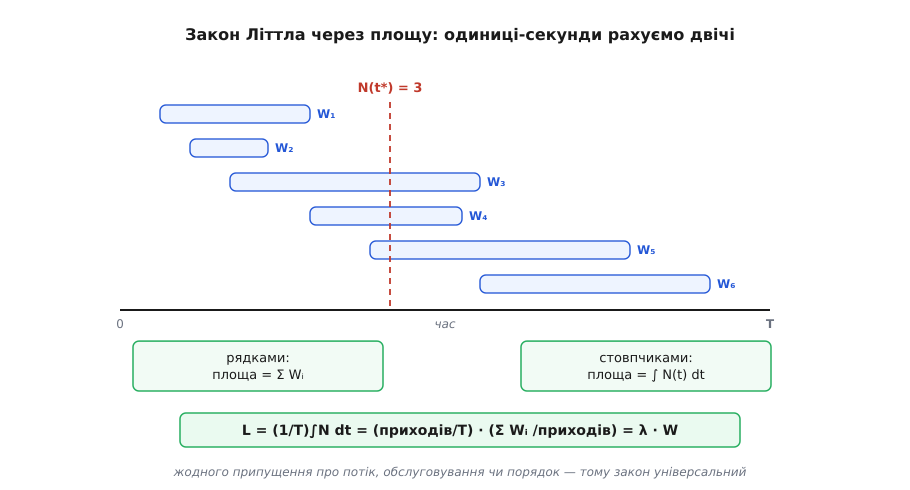
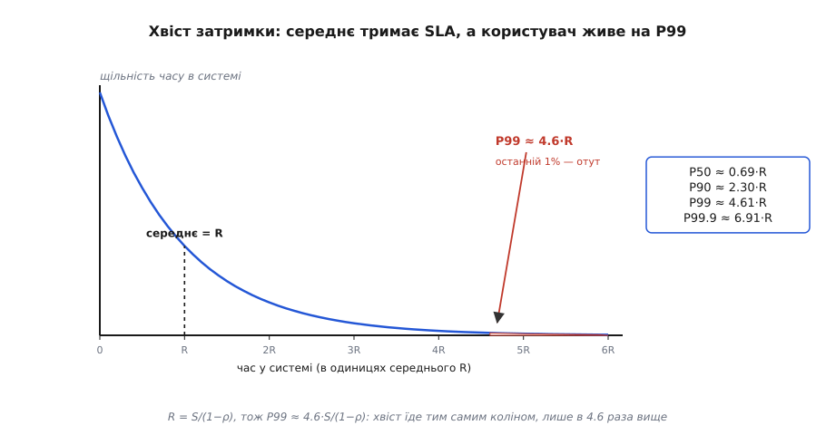
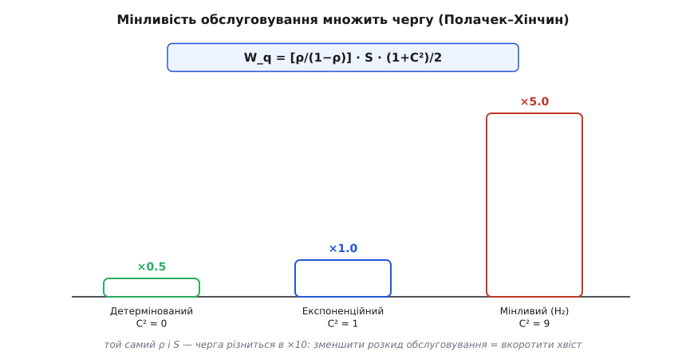
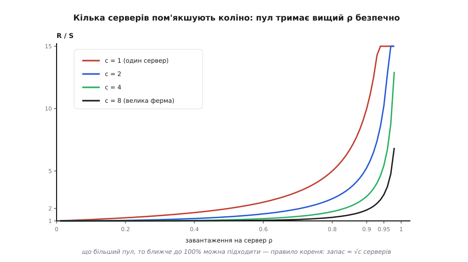

# 🧮 Математика черги: закон Літтла, коліно й хвіст

Є одне спостереження, від якого починається вся інженерія черг, бо воно суперечить здоровому глузду. Сервер, завантажений на 90%, звучить як сервер із десятивідсотковим запасом — здавалося б, ще далеко до межі. А насправді він уже віддає відповідь у **десять разів** повільніше, ніж ненавантажений, і найгірший 1% користувачів чекає ще вчетверо довше за це. Десять відсотків «вільної потужності» на папері обертаються катастрофою на практиці. Чому лінійна на позір величина — завантаження — б'є нелінійно? І чому середній час відповіді, який показує монітор, систематично бреше про те, що відчуває користувач?

Відповідь дають три сходинки математики, і кожну варто пройти від першопричини, а не прийняти на віру. Перша — **закон Літтла**, місток між темпом, затримкою й заповненістю, який не припускає нічого про природу потоку. Друга — **коліно черги**: як із закону Літтла й найпростішої моделі виростає множник `1/(1−ρ)`, що вибухає під навантаженням. Третя, найтонша, — **хвіст**: чому середнє ховає P99, як мінливість обслуговування підливає оливи у вогонь через формулу Полачека–Хінчина, і чому кілька серверів у спільній черзі згладжують коліно. Пройшовши всі три, ви перестанете сайзити систему по середньому — і почнете по тому, що справді ламається.

## Закон Літтла: доказ площею

Почнімо з величини, яку хочеться знати завжди: **скільки одиниць сидить у системі водночас?** Скільки запитів «у польоті», скільки з'єднань зайнято, скільки завдань чекає в пулі. Позначмо середню кількість усередині `L`, темп надходження `λ` (одиниць за секунду) і середній час, який одиниця проводить усередині, `W`. Закон Літтла стверджує, що ці три величини зв'язані намертво:

```
L = λ · W
```

Формула настільки проста, що виникає підозра: тут має ховатися купа припущень. Насправді — жодного. І найкращий спосіб це побачити — довести закон **площею**, бо доказ показує, звідки береться універсальність.

Уявімо систему за довгий проміжок `[0, T]`. Намалюймо кожну одиницю, що пройшла крізь систему, окремою горизонтальною смугою — від миті приходу до миті виходу. Довжина смуги — це час перебування `Wᵢ` тієї конкретної одиниці. Тепер порахуймо сумарну площу всіх смуг двома способами, бо площа — це та сама площа, з якого боку на неї не дивись.


*Закон Літтла як одна площа, поміряна двічі. Кожна одиниця — горизонтальна смуга завдовжки у свій час перебування Wᵢ; сума площ рядків — це Σ Wᵢ. Та сама фігура, розрізана вертикально в будь-яку мить t, має висоту N(t) — скільки одиниць усередині просто зараз; сума площ стовпчиків — це ∫ N(t) dt. Прирівнявши два прочитання й поділивши на тривалість T, дістаємо L = λ·W. У доказі нема жодного припущення про розподіл надходжень, кількість серверів чи порядок обслуговування — тому закон універсальний.*

**Рядками** (по кожній одиниці): площа кожної смуги — це її час перебування, а сумарна площа — це сума всіх часів перебування.

```
площа = Σ Wᵢ        (сума по всіх одиницях, що пройшли крізь систему)
```

**Стовпчиками** (по кожній миті): у будь-який момент `t` система містить `N(t)` одиниць — стільки смуг перетинає вертикаль у точці `t`. Тонкий стовпчик завширшки `dt` має площу `N(t)·dt`, а вся площа — це інтеграл заповненості в часі.

```
площа = ∫₀ᵀ N(t) dt
```

Це одна фігура, тож два числа рівні. Тепер поділимо обидва на `T` і впізнаймо в кожному доданку знайомі величини:

```
(1/T) ∫₀ᵀ N(t) dt  =  (1/T) Σ Wᵢ

     L             =  (кількість приходів / T) · (Σ Wᵢ / кількість приходів)
     L             =        λ                  ·         W
```

Ліворуч — середнє за часом значення заповненості, тобто `L`. Праворуч перший множник — це кількість одиниць, що зайшли, поділена на час, тобто темп `λ`; другий — сума часів перебування, поділена на їхню кількість, тобто середній час `W`. Виходить `L = λ·W`, і ми ніде не припустили, ані як розподілені надходження, ані скільки серверів усередині, ані в якому порядку обслуговують. Саме тому закон Літтла тримається для черги, пулу з'єднань, конвеєра, складу — будь-чого, крізь що тече потік в усталеному режимі. Його довів Джон Літтл (John D. C. Little) 1961 року строго для загального стаціонарного потоку; доказ площею — інтуїтивна версія того самого.

> 🔧 **Навіщо це.** Закон Літтла — єдиний рядок, що перетворює виміряну пару чисел на третє, якого ви не міряли. Знаєте темп і затримку — дістаєте заповненість (скільки потоків, яка глибина пулу, скільки пам'яті з'їдять запити в польоті). Знаєте заповненість і затримку — дістаєте стелю темпу. Оскільки він не залежить від розподілу, ним можна користуватися ще до того, як відомо бодай щось про статистику навантаження.

## Від Літтла до коліна: черга M/M/1

Закон Літтла дає `L`, якщо ви вже знаєте `W`. Але звідки береться саме `W` — власне час перебування — він не каже, бо навмисне нічого не припускає. Щоб дістати `W`, треба **додати модель** того, як надходять і обслуговуються одиниці. Найпростіша змістовна модель зветься `M/M/1`, і за цими трьома символами варто побачити зміст.

Позначення ввів британський статистик Девід Кендалл (David G. Kendall) 1953 року: запис `A/B/c` каже, який розподіл проміжків між надходженнями (`A`), який розподіл часу обслуговування (`B`) і скільки серверів (`c`). Літера `M` означає «Markovian / memoryless» — пуассонівський потік надходжень з експоненційними проміжками. Отже, `M/M/1` — це один сервер, надходження пуассонівські, обслуговування експоненційне.

> Що треба знати про пуассонівський потік: надходження випадкові й незалежні, з постійним середнім темпом, а проміжки між ними розподілені експоненційно — тобто «без пам'яті»: скільки вже минуло від останнього приходу, ніяк не впливає на те, коли прийде наступний. Це найприродніша модель незалежних подій — кліки багатьох користувачів, запити з великого пулу клієнтів. Детально — [пуассонівський процес](book:math/poisson-process).

Введімо `μ = 1/S` — темп обслуговування (скільки одиниць за секунду встигає єдиний сервер, якщо середнє обслуговування триває `S`). Тоді **завантаження** — частка часу, коли сервер зайнятий — це `ρ = λ/μ = λ·S`. Тепер виведімо, скільки одиниць у системі, **не** приймаючи `L = ρ/(1−ρ)` на віру.

Систему можна описати числом одиниць усередині `n = 0, 1, 2, …`. Надходження штовхає `n` угору з темпом `λ`, завершення обслуговування тягне вниз із темпом `μ` (коли сервер зайнятий). В усталеному режимі потік «угору» через межу між станами `n` і `n+1` мусить дорівнювати потоку «вниз» — інакше ймовірність десь накопичувалася б. Це рівняння балансу:

```
λ · P(n) = μ · P(n+1)      →      P(n+1) = ρ · P(n)
```

Кожен наступний стан у `ρ` разів імовірніший за поворот назад, тож імовірності спадають геометрично: `P(n) = P(0)·ρⁿ`. Сума всіх імовірностей — одиниця, а сума геометричного ряду `Σ ρⁿ = 1/(1−ρ)` (тут і потрібне `ρ < 1`, інакше черга росте без упину). Звідси `P(0) = 1−ρ`, і повний розподіл:

```
P(n) = (1 − ρ) · ρⁿ
```

Тепер середня кількість у системі — це математичне сподівання `n` за цим розподілом. Сума `Σ n(1−ρ)ρⁿ` дає класичний результат:

```
L = Σ n · P(n) = ρ / (1 − ρ)
```

І ось де закон Літтла замикає коло. Ми маємо `L`, знаємо `λ` — дістаємо `W`, яке модель сама по собі не давала, поділивши одне на друге:

```
R = L / λ = [ρ/(1−ρ)] / λ = [λS/(1−ρ)] / λ = S / (1 − ρ)
```

(Час перебування в системі я тут позначаю `R` — «response time», щоб не плутати з темпом.) Народилося **коліно**. Множник `1/(1−ρ)` показує, у скільки разів повний час відповіді перевищить чистий час обслуговування, коли сервер завантажений на частку `ρ`:

```
ρ = 0.5  →  R = 2·S       черга додає стільки ж, скільки саме обслуговування
ρ = 0.8  →  R = 5·S
ρ = 0.9  →  R = 10·S
ρ = 0.95 →  R = 20·S
ρ = 0.99 →  R = 100·S     майже повне завантаження — стократна затримка
```

Погляньте на цю таблицю не як на числа, а як на форму. До `ρ ≈ 0.7` крива майже пласка — від 0 до 70% завантаження затримка виросла лише вдвічі-втричі. Далі кожні наступні кілька відсотків коштують дедалі дорожче, а біля `ρ = 1` вона злітає у нескінченність. Причина проста й фізична: `1−ρ` — це частка часу, коли сервер **простоює** й може взятися за нову роботу негайно. Коли простою лишається один відсоток, майже кожна нова одиниця застає сервер зайнятим і стає в чергу за іншими — а ті теж чекають. Затримка не додається лінійно — вона **наростає лавиною**, бо кожен, хто чекає, чекає за тими, хто вже чекає.

## Чому сайзинг по коліну, не по середньому

Тепер зрозуміло, чому наївний розрахунок потужності бреше. План «маємо 100 ядер по 10 мс на запит, отже потягнемо 10 000 запитів на секунду» мовчки припускає, що завантаження можна догнати до 100%. Але при `ρ = 1` затримка нескінченна — це не «повна потужність», а точка зриву. Справжній поріг — не пропускна здатність, а **завантаження на піку**, і його треба тримати там, де крива ще пласка.

Є дві незалежні причини закладати запас, і обидві виводяться, а не постулюються. Перша — **опуклість**: оскільки `1/(1−ρ)` росте дедалі крутіше, симетричний розкид навколо середнього завантаження дає **несиметричний** розкид затримки — сплеск угору коштує набагато більше, ніж заощаджує провал униз. Друга — **пульсація**: реальне навантаження не рівне, воно приходить хвилями. Якщо середнє завантаження 0.7, то піки легко сягають 0.9, а на кривій різниця між 0.7 і 0.9 — це стрибок затримки з ×3.3 до ×10. Планувати треба так, щоб за коліно не заганяв **пік**, а не середнє.

**Скільки серверів насправді треба.** Хай навантаження на піку `λ = 8000` запитів на секунду, кожен бере сервер на `S = 10` мс. Наївно: `8000 · 0.010 = 80` серверів «упритул». Але впритул — це `ρ = 1`. Закладімо стелю завантаження `ρ_ціль = 0.7`:

```
серверів = λ · S / ρ_ціль = 8000 · 0.010 / 0.7 = 80 / 0.7 ≈ 115

затримка на піку при ρ = 0.7:   R = S / (1 − 0.7) = 10 мс / 0.3 ≈ 33 мс
затримка «упритул» при ρ = 0.99: R = 10 мс / 0.01 = 1000 мс = 1 секунда
```

Різниця між 80 і 115 серверами — це не марнотратство, а плата за те, щоб пікова затримка була 33 мс, а не секунда. Ті «зайві» 35 машин — не запас про запас, а сам механізм, що тримає систему по цей бік коліна.

> 🔧 **Навіщо це.** Коли хтось каже «навіщо нам 40% простою, це ж спалені гроші» — покажіть криву. Простій `1−ρ` не марнується: він і є буфер, що поглинає пульсацію й не дає затримці вибухнути. Викупити цей простій означає купити собі стократну затримку на першому ж піку.

## Хвіст: чому середнє ховає P99

Досі ми говорили про **середній** час відповіді `R`. Але користувач не живе в середньому — його дратує повільний випадок, і угоди про рівень сервісу (SLA/SLO) майже завжди пишуть на **перцентиль**: P99 = «99% запитів швидші за …». А середнє й P99 під чергою розходяться, і розходяться передбачувано.

Для `M/M/1` повний час у системі має напрочуд чистий розподіл — **експоненційний** зі середнім `R = S/(1−ρ)`. Побачити чому можна так: за властивістю пуассонівського потоку одиниця, що прибуває, застає систему в її «середньому» стані (це теорема PASTA — «Poisson Arrivals See Time Averages», Пуассонівські надходження бачать середні за часом). Заставши `n` одиниць попереду, вона мусить дочекатися `n+1` експоненційних обслуговувань — своє й тих, що попереду. А сума геометрично розподіленого числа експоненційних величин сама виходить експоненційною, з темпом `μ−λ`. Отже:

```
P(час у системі > t) = e^(−(μ−λ)·t) = e^(−t/R)
```

Із цієї єдиної формули перцентилі читаються миттєво: `t_p = R · ln(1/(1−p))`.

```
P50  (медіана) = R · ln 2    ≈ 0.69 · R
P90            = R · ln 10   ≈ 2.30 · R
P99            = R · ln 100  ≈ 4.61 · R
P99.9          = R · ln 1000 ≈ 6.91 · R
```


*Чому середнє ховає хвіст. Час у системі для M/M/1 розподілений експоненційно зі середнім R = S/(1−ρ). Медіана лежить лівіше середнього (0.69·R) — половині запитів краще, ніж «у середньому». Зате P99 сидить у 4.6 раза далі за середнє, а P99.9 — у 6.9 раза; саме цей хвіст відчуває найгірший відсоток користувачів, на який пишуть SLO. Оскільки й саме R їде коліном 1/(1−ρ), абсолютний P99 ≈ 4.6·S/(1−ρ) вибухає ще різкіше за середнє.*

Ось у чому підступ середнього. Мало того, що P99 у 4.6 раза більший за середнє **при будь-якому завантаженні** — це відношення стале. Гірше те, що саме `R` уже їде коліном, тож абсолютний P99 = `4.6·S/(1−ρ)` вибухає **добутком** двох ефектів. При `ρ = 0.9` середнє вже 10·S, а P99 — аж 46·S. Монітор показує «в середньому 10 мс, усе гаразд», а кожен сотий запит тим часом тягне під 50 мс — і саме за нього ви платите неустойку.

**Скільки серверів під ціль по P99.** Хай `S = 20` мс і треба, щоб P99 не перевищував 200 мс. Виводимо потрібне завантаження назад із формули хвоста:

```
P99 = 4.61 · S / (1 − ρ) ≤ 200 мс
1 − ρ ≥ 4.61 · 20 / 200 = 0.461
ρ ≤ 0.539     ← ось справжня стеля завантаження, не 0.7 і не 1.0
```

Тобто ціль на **хвіст** просить тримати сервер загалом нижче 54% — значно консервативніше, ніж підказувало б середнє. Ту саму логіку зручно тримати робочою функцією, що з навантаження й цілі по хвосту рахує потрібну кількість серверів:

```python
import math

def servers_for_p99(rate_per_s, service_s, p99_target_s):
    """Скільки серверів (за грубою M/M/1-логікою на сервер),
    щоб P99 часу відповіді не перевищив цілі."""
    # P99 одиночної черги ≈ 4.61 · S / (1 − ρ); звідси стеля ρ:
    rho_max = 1.0 - 4.61 * service_s / p99_target_s
    if rho_max <= 0:
        raise ValueError("ціль по P99 менша за сам час обслуговування — недосяжно")
    # ρ = λ·S / серверів ≤ rho_max
    return math.ceil(rate_per_s * service_s / rho_max)

n = servers_for_p99(rate_per_s=8000, service_s=0.020, p99_target_s=0.200)
# rho_max = 1 − 4.61·0.02/0.2 = 0.539
# серверів = ceil(8000 · 0.02 / 0.539) = ceil(296.8) = 297
```

Майже 300 серверів проти 160, які дало б «упритул» (`8000·0.02 = 160`). Різниця — ціна того, щоб не середнє, а найгірший відсоток вкладався в бюджет. Варто пам'ятати, що це ще **оптимістична** оцінка: реальний час обслуговування зазвичай має важчий хвіст, ніж експонента, а [розподіли з важкими хвостами](book:math/heavy-tail-distributions) розганяють P99 сильніше, ніж підказує ця формула. M/M/1 тут — найдобріший можливий випадок, а не найгірший.

## Мінливість обслуговування: множник (1+C²)/2

Модель `M/M/1` припускала, що час обслуговування розподілений експоненційно. А що, коли ні? Одні системи обслуговують рівно (кожен запит — майже однакова робота), інші рвано (більшість запитів дрібні, але зрідка трапляється велетень). Виявляється, черга залежить не лише від середнього часу обслуговування, а й від його **розкиду** — і залежність точна.

Дозволивши будь-який розподіл обслуговування, ми переходимо до моделі `M/G/1` (`G` — general, загальний розподіл), а середній час очікування в черзі дає **формула Полачека–Хінчина**:

```
W_q = [ρ / (1 − ρ)] · S · (1 + C²) / 2
```

Тут `C² = дисперсія(S) / S²` — квадрат коефіцієнта варіації часу обслуговування, безрозмірна міра розкиду.

> Коефіцієнт варіації — це стандартне відхилення, поділене на середнє; його квадрат `C² = Var/середнє²` каже, наскільки величина «рвана» відносно свого масштабу. `C² = 0` — сталий час, `C² = 1` — експоненційний розкид, `C² > 1` — рвано, з рідкісними велетнями. Про дисперсію й це відношення — [середнє й дисперсія](book:math/mean-variance).

Розберімо, **звідки** береться множник `(1+C²)/2`, бо в ньому вся суть — це не підгінка, а глибокий факт про випадковість. Уявіть, що ви прибуваєте й застаєте сервер зайнятим. Вам доведеться дочекатися, поки він **добслужить поточну одиницю** — а скільки їй лишилося? Тут спрацьовує підступ, знаний як парадокс огляду (inspection paradox): прибуваючи у випадкову мить, ви **частіше потрапляєте всередину довгого обслуговування**, ніж короткого — просто тому, що довгі займають більше часу на осі й у них ширша «мішень» для вашого приходу. Ваш зразок зміщений у бік довгих. Середній залишок такого зміщеного обслуговування — не `S/2`, як здавалося б, а

```
середній залишок = E[S²] / (2·S) = (S/2)·(1 + C²)
```

бо `E[S²] = S²·(1 + C²)`. Ось вона — мінливість. Коли обслуговування стале (`C² = 0`), ви влучаєте в середину відрізка й чекаєте `S/2`. Коли воно рване (`C²` велике), ви майже завжди застаєте велетня й чекаєте набагато довше. Цей роздутий залишок і множиться на «скільки таких попереду» — звідки й береться `(1+C²)/2` у формулі.

Порівняймо три режими при однакових `ρ` і `S`:

```
детермінований (C² = 0):   множник (1+0)/2 = 0.5    ← удвічі менша черга, ніж експонента
експоненційний (C² = 1):   множник (1+1)/2 = 1.0    ← це і є M/M/1
рваний, H₂ (C² = 9):       множник (1+9)/2 = 5.0    ← черга вп'ятеро довша
```


*Мінливість обслуговування прямо множить чергу. За тих самих завантаження ρ і середнього S час очікування пропорційний множникові (1+C²)/2. Сталий час обслуговування (C²=0) дає вдвічі коротшу чергу за експоненційну (C²=1); рване обслуговування з рідкісними велетнями (C²=9) — вп'ятеро довшу. Звідси прямий важіль архітектора: зменшуючи розкид часу обслуговування — обмежуючи роботу на запит, розбиваючи велетнів, ставлячи таймаути — ви коротшаєте чергу й хвіст, навіть не чіпаючи середнього.*

Це відкриває важіль, якого не видно з середнього. Дві системи з **однаковим** середнім часом обслуговування дадуть чергу, що різниться вдесятеро, якщо в однієї робота рівна, а в другої рвана. Тому дисципліни на кшталт «обмеж максимальну роботу на запит», «розбий пакетне завдання на дрібні», «постав таймаут, що відрубає велетнів» діють не на середнє, а на `C²` — і вкорочують хвіст, не прискорюючи жоден окремий запит.

Формулу 1930 року вивів Фелікс Полачек (Félix Pollaczek) — математик, народжений у Відні, з єврейської родини, який тоді працював над телефонним трафіком у німецькій пошті (згодом, тікаючи від нацистського переслідування, він емігрував до Франції й дістав французьке громадянство). Незалежно, ймовірнісними методами, той самий результат отримав 1932 року радянський математик Олександр Хінчин (Aleksandr Khinchin). *(Усталено: авторство й роки підтверджені первинними публікаціями — Pollaczek 1930, Mathematische Zeitschrift; Khinchin 1932.)*

## Кілька серверів: як M/M/c гладить коліно

Досі сервер був один. А що дає розкладання тієї самої потужності на **кілька** серверів зі спільною чергою? Модель `M/M/c` — `c` однакових серверів, одна черга — і результат неочевидний: пул згладжує коліно, тобто дозволяє безпечно підходити ближче до 100% завантаження.

Причина — **об'єднання ресурсу** (resource pooling). Коли серверів багато й черга спільна, одиниця чекає, лише якщо зайняті **всі** сервери одночасно; щойно бодай один звільниться, він одразу підхоплює того, хто чекає. Порівняйте з протилежним антипатерном — `c` окремих черг, по одному серверу на кожну: там одиниця може стояти в одній черзі, поки сусідній сервер простоює, і не може до нього перескочити. Спільна черга усуває саме цю змарновану простійність, і що більший пул, то рідше «всі зайняті» збігається.

Ймовірність застати всі сервери зайнятими дає **формула Ерланга C** — її 1917 року вивів данський інженер і математик Агнер Краруп Ерланг (Agner Krarup Erlang), працюючи над завантаженням телефонних станцій у Копенгагені; його праці й започаткували теорію черг та теорію телетрафіку. Позначмо цю ймовірність очікування `C(c, ρ)`; тоді середнє очікування в черзі й повний час відповіді:

```
W_q = C(c, ρ) · S / (c · (1 − ρ))
R   = S + W_q = S · [ 1 + C(c, ρ) / (c·(1 − ρ)) ]
```

При `c = 1` формула Ерланга дає `C(1, ρ) = ρ`, і все згортається назад у знайоме `R = S/(1−ρ)` — одиночна черга є окремим випадком. А зі зростанням `c` коліно відсувається праворуч:


*Кілька серверів пом'якшують коліно. Крива часу відповіді проти завантаження на сервер для пулів різного розміру. Один сервер (c=1) — це чисте 1/(1−ρ), що вибухає вже за 80–90%. Що більший пул зі спільною чергою, то довше крива лишається пласкою й тим ближче до 100% можна підходити без вибуху затримки: спільна черга не дає серверу простоювати, поки хтось чекає. Практичний наслідок — правило кореня (square-root staffing): безпечний запас потужності росте лише як √c, тож велика ферма може працювати на вищому завантаженні, ніж дрібна.*

Звідси випливає одне з найкорисніших правил планування потужності — **правило кореня** (square-root staffing): щоб тримати ймовірність очікування помірною, поверх мінімально потрібних серверів досить додати запас порядку `√c`. У відносних числах це означає, що велика ферма може безпечно працювати на вищому завантаженні, ніж дрібна.

**Той самий запас у відсотках чи в машинах?** Порівняймо два пули під ту саму пікову потребу:

```
малий пул, треба ~10 серверів упритул:  запас ≈ √10 ≈ 3 → 13 машин   (працює на ~77%)
велика ферма, треба ~100 упритул:       запас ≈ √100 = 10 → 110 машин (працює на ~91%)
```

Ферма зі ста серверів безпечно тримає 91% завантаження там, де пул із десяти мусить сидіти на 77%. Ось чому консолідація дрібних, окремо недовантажених сервісів в один спільний пул часто не лише спрощує експлуатацію, а й прямо економить залізо: більший спільний пул за тієї самої якості обслуговування вимагає **меншого відносного** запасу. Дроблення ж на багато крихітних окремих черг — навпаки, найдорожчий за потужністю спосіб організувати ту саму роботу.

## Що з цього бере прикидка

Три сходинки склалися в один спосіб думати про потужність — і в кілька чисел, які варто тримати в голові поряд із драбиною затримок. Закон Літтла (`L = λ·W`), доведений площею, зв'язує темп, затримку й заповненість без жодних припущень — ним рахують потоки, пули й пам'ять під запити в польоті. Коліно (`R = S/(1−ρ)`), виведене з балансу станів і замкнене законом Літтла, каже сайзити по **піковому завантаженню**, а не по середньому, і тримати його там, де крива ще пласка. Хвіст (P99 ≈ 4.6·R для експоненційного випадку) пояснює, чому середнє систематично бреше про досвід користувача, і зсуває безпечну стелю завантаження ще нижче. Формула Полачека–Хінчина додає, що **розкид** обслуговування множить чергу через `(1+C²)/2` — тож приборкання мінливості коротшає хвіст без прискорення жодного запиту. А `M/M/c` і правило кореня показують, що спільний пул гладить коліно й дозволяє більшій фермі безпечно працювати на вищому завантаженні.

Для прикидки все це стискається до кількох перевірних тверджень. «Швидко в середньому» нічого не каже, поки не названо завантаження й перцентиль. Стеля потужності — не пропускна здатність, а частка `ρ`, за якою затримка вибухає. Запас до 100% — не марнотратство, а буфер проти пульсації й хвоста. І перш ніж додавати сервери, варто спитати, чи не дешевше **зменшити розкид** обслуговування або **об'єднати** черги. Кожне з цих тверджень — рядок арифметики на серветці, а не багатоденний навантажувальний тест; тест лишається на потім, коли прикидка вже показала, з якого боку коліна ви стоїте.
