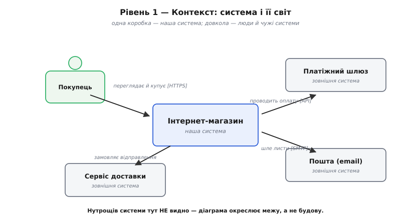

# C4

<preknowlist>
- [Архітектурні в'ю](topic:programming/architecture-views) — чому систему малюють не однією схемою, а кількома «поглядами», кожен під свою турботу; C4 — конкретний набір таких в'ю.
- [Роль архітектора](topic:programming/architect-role) — навіщо взагалі малювати архітектуру: діаграма як інструмент спільної мови й мислення, а не прикраса до звіту.
- [Стейкхолдери та їхні системи](topic:programming/stakeholders) — хто читає діаграму (замовник, розробник, експлуатація) і чому різним читачам треба різний рівень деталей.
</preknowlist>

Попроси п'ятьох інженерів намалювати «архітектуру нашої системи» на дошці — отримаєш п'ять несумісних картинок. В одного це коробочки сервісів зі стрілками, у другого — бази даних і черги, у третього — хмара з написом «магія» посередині. Хтось малює класи, хтось — дата-центри. І кожен щиро вважає, що намалював «архітектуру». Проблема не в тім, що вони погані рисувальники. Проблема в тім, що **слово «архітектура» без рівня деталізації нічого не означає**: показати можна з висоти пташиного польоту, а можна з-під мікроскопа, і це буде та сама система, але дві геть різні картинки для двох різних розмов.

C4 — це відповідь на цей хаос. Ім'я — просто чотири англійські слова на «C»: **Context, Container, Component, Code** (контекст, контейнер, компонент, код). Це не нотація зі своїми фігурами й не інструмент — це **домовленість про чотири рівні наближення**, на яких варто малювати систему, щоб кожна картинка мала один масштаб і одну аудиторію. Придумав її британський архітектор Саймон Браун (Simon Brown): корені моделі — приблизно 2006–2009 роки, назви діаграм усталилися на початку 2010-го, а сама абревіатура «C4» уперше прозвучала на початку 2011-го; ширшу популярність вона здобула після запуску відкритого сайту й статті 2018 року. *(Усталений факт.)*

> 🔧 **Навіщо це.** Без спільного рівня наближення діаграма стає полем непорозумінь: один читач шукає в ній дата-центри, інший — класи, і жоден не знаходить. C4 дає команді чотири узгоджені масштаби — коли хтось каже «намалюй контейнерну діаграму», усі розуміють однаково: що на ній буде, а чого не буде. Це прибирає ціле джерело суперечок ще до того, як хтось узяв маркер.

## Головна ідея — карта з зумом

Найточніша аналогія — **онлайн-карта**. Ти дивишся на неї на різних масштабах, і кожен несе свою правду. З рівня цілого континенту видно країни й межі — і не видно вулиць, це нормально. Наблизив — з'явилися міста й траси. Ще наблизив — вулиці й будинки. Кожен масштаб **свідомо ховає** те, що на ньому було б шумом: показувати окремі будинки на карті континенту — божевілля, шукати країну на карті кварталу — теж.

C4 переносить цю ідею на софт. Замість однієї діаграми «вся система», яка неминуче стає кашею зі стрілок, ти малюєш **чотири карти одного й того самого**, кожну на своєму масштабі:

```
рівень       масштаб карти        відповідає на питання
────────────────────────────────────────────────────────────
1. Контекст  «континент»          що це за система і хто/що
                                   довкола неї?
2. Контейнер «країни, траси»      з яких застосунків і сховищ
                                   вона зроблена?
3. Компонент «вулиці»             з чого зроблено ОДИН застосунок
                                   усередині?
4. Код       «окремі будинки»     як ОДИН компонент лягає в класи?
                                   (за потреби, часто не малюють)
```

Ключове слово — **наближення**. Ти не малюєш чотири різні системи; ти малюєш **одну**, чотири рази, щоразу зумуючи глибше в один вибраний шматок попереднього рівня. Контейнерна діаграма — це «зум» усередину єдиної коробки, яку на контекстній діаграмі позначено як «наша система». Компонентна — зум усередину одного контейнера. Так рівні складаються в дерево, а не в паралельні всесвіти, і читач завжди знає, **де він на карті**.

## Рівень 1 — Контекст: система і її світ

Найвища карта. Тут твоя система — **одна коробка**, без нутрощів. Навколо неї — **люди** (ролі, що нею користуються) і **інші системи** (з якими вона обмінюється даними: платіжний шлюз, поштовий сервіс, чужий API). Стрілки між ними кажуть, хто з ким і навіщо говорить.

І це все. Свідома скромність контекстної діаграми — її сила. Вона не пояснює, **як** система влаштована; вона окреслює **межу**: що всередині нашої відповідальності, а що — чужий світ, який ми лише торкаємо. Її головний читач — не програміст, а той, хто хоче зрозуміти систему за хвилину: замовник, новий менеджер, безпечник, що шукає всі зовнішні входи.



*Найвища карта: одна коробка — наша система, навколо — люди й чужі системи, з якими вона говорить. Тут не видно, як усередині все влаштовано, і це навмисно: діаграма окреслює межу відповідальності, а не будову.*

> 🔧 **Навіщо це.** Саме на контекстній діаграмі команда часто вперше бачить зовнішню залежність, про яку ніхто не думав, — раптом виявляється, що система тихо ходить у чужий сервіс, який може впасти. Одна коробка з кількома стрілками окупається, коли ці стрілки змушують спитати: «а що буде, якщо оцей сусід недоступний?»

## Рівень 2 — Контейнер: з чого система зроблена

Наближаємо. Єдину коробку «наша система» розкриваємо — і всередині бачимо **контейнери**. І ось тут — найпідступніша плутанина в усій моделі, яку треба вбити одразу: **контейнер у C4 — це НЕ Docker-контейнер.** Слово старіше за Docker і означає інше.

Контейнер у C4 — це **окрема одиниця, яку запускають або розгортають самостійно**: щось, що виконується як власний процес і має власні дані. Веб-застосунок, мобільний застосунок, серверний сервіс, база даних, файлове сховище, брокер повідомлень — кожне з них контейнер. Критерій простий: **чи можна це запустити або зупинити окремо від решти?** Якщо так — це контейнер. База даних — контейнер, бо вона живе своїм процесом; клас усередині сервісу — ні, бо сам по собі він не запускається.

> 🔧 **Навіщо це.** Контейнерна діаграма — найкорисніша з чотирьох на щодень, бо вона відповідає на перше практичне питання нового розробника: «що тут взагалі є і як воно спілкується?» Вона показує технологічний вибір (де Java, де база, де черга), протоколи між частинами (HTTP, gRPC, черга) — рівно те, що треба знати, аби зорієнтуватися й почати працювати, і без потопу в деталях кожного класу.

На цій діаграмі кожна коробка-контейнер зазвичай підписана **технологією** в дужках — не заради краси, а тому що це реальне рішення: «веб-застосунок [React]», «API [Java/Spring]», «база [PostgreSQL]». Стрілки підписані **способом зв'язку**: «надсилає запити [HTTPS/JSON]», «читає й пише [SQL]». Тепер діаграма каже не лише *що* спілкується, а й *як* — а це вже те, за чим можна сперечатися про продуктивність і надійність.

![Контейнерна діаграма C4 рівня 2: усередині межі «Інтернет-магазин» чотири контейнери — «Веб-застосунок [React]», «API [Java/Spring]», «База даних [PostgreSQL]», «Черга задач [RabbitMQ]» — з підписаними стрілками HTTPS, SQL і повідомлень; ззовні межі — покупець і платіжний шлюз](/book/programming/architecture-discipline/c4-model/img/container.svg)

*Зум усередину системи: окремі застосунки й сховища, кожен зі своєю технологією в дужках, і підписані зв'язки між ними. Контейнер тут — те, що запускають самостійно (сервіс, база, черга), а не Docker-контейнер.*

## Рівень 3 — Компонент: з чого зроблений один контейнер

Наближаємо ще. Беремо **один** контейнер — скажімо, наш API-сервіс — і зазираємо всередину. Там **компоненти**: великі логічні блоки, з яких зібрано цей застосунок. Контролер замовлень, обробник платежів, репозиторій товарів, клієнт до поштового сервісу — кожен згруповує споріднену логіку за спільною відповідальністю.

Компонент — не клас і не файл. Це **група коду з однією чіткою роллю**, у яку контейнер розкладається зсередини. Компонентна діаграма показує не «весь код сервісу» (це знову була б каша), а його **великий скелет**: які відповідальності всередині є і як вони спираються одна на одну та на сусідні контейнери.

Тут проходить важлива межа корисності. Контекст і контейнер малюють майже завжди — вони дешеві, стабільні й потрібні багатьом. Компонентні діаграми варто малювати **вибірково**: для контейнера з нетривіальним нутром, де структуру справді треба пояснити. Малювати компоненти для кожного дрібного сервіса — марно, бо вони застарівають швидше, ніж їх встигають читати.

## Рівень 4 — Код: і чому його майже не малюють

Найглибша карта — окремі **класи** всередині одного компонента, зв'язки між ними, як у класичній UML-діаграмі класів. І головна порада щодо неї парадоксальна: **здебільшого її не малюють руками зовсім.**

Причина проста й чесна. Код міняється щодня; намальована вручну діаграма класів застаріває наступного ж тижня й перетворюється на брехню — гірше, ніж її відсутність, бо їй ще й вірять. Тому C4 радить: якщо рівень коду взагалі потрібен, **згенеруй його автоматично** з самого коду (це вміє будь-яке пристойне середовище розробки), щоб він завжди був правдою, а не музейним експонатом. Найчастіше ж цей рівень просто пропускають: він рідко вартий зусиль, бо той, кому потрібні класи, уже дивиться в сам код.


*Чотири рівні — це не чотири різні системи, а одна, наближувана дедалі глибше: кожен нижчий рівень розкриває нутро ОДНІЄЇ коробки з рівня вище. Верхні дві карти малюють майже завжди, компонентну — вибірково, кодову — рідко й краще автоматично.*

## Що C4 навмисно НЕ диктує

Тут ховається головна причина, чому C4 прижилася там, де важча UML буксувала. C4 **майже нічого не наказує про вигляд**. Якого кольору коробки, круглі чи квадратні, які саме значки — модель мовчить. Її турбує **не нотація, а масштаб**: аби на одній діаграмі був один рівень наближення й аби кожен елемент був підписаний зрозуміло для того, хто цю картинку побачить уперше.

Звідси єдина, але залізна вимога C4 — **діаграма мусить читатися сама, без усного супроводу автора**. Кожна коробка має назву й коротко — що це; кожна стрілка має напис — що передається й, де важливо, яким протоколом. Діаграма, зрозуміла лише тому, хто стоїть поруч і пояснює, за критерієм C4 несправна. Легенда (що означає кожен тип коробки й лінії) — обов'язкова, бо різні автори фарбують по-різному, і без легенди кольори брешуть.

> 🔧 **Навіщо це.** Свобода вигляду — це те, що дало C4 вижити в командах, які зненавиділи UML за суворість. Малюй хоч на серветці, хоч у будь-якому редакторі — важить лише, щоб масштаб був один і підписи чесні. Але свобода має ціну: без легенди й без підписів на стрілках картинка розсипається, щойно автор вийде з кімнати. Тому «підпиши все» — не бюрократія, а те, що робить діаграму активом, а не приватним нагадуванням автора собі.

## Три допоміжні карти понад чотирма рівнями

Чотири рівні — це «статична» будова: що з чого складається. Але кілька питань вони не покривають, тож C4 додає три необов'язкові карти, які беруть за потреби.

**Ландшафт систем** (system landscape) — карта ще вища за контекст: не одна наша система і сусіди, а **всі системи підприємства разом** і зв'язки між ними. Її малюють, коли треба показати місце нашої системи серед десятків інших — типово для архітектора рівня всієї компанії.

**Динамічна діаграма** (dynamic) — показує не будову, а **сценарій у русі**: як конкретний запит проходить крізь контейнери чи компоненти крок за кроком, з нумерованими стрілками «1, 2, 3…». Статичні діаграми кажуть, *що з чим з'єднано*; динамічна — *що відбувається за чим* під час, скажімо, оформлення замовлення.

**Діаграма розгортання** (deployment) — відповідає на питання, якого чотири рівні уникають: **на яке залізо це лягає?** Які контейнери на яких серверах, у яких дата-центрах, скільки копій. Ось тут, до речі, справжні Docker-контейнери й Kubernetes-вузли нарешті доречні — на карті розгортання, а не на контейнерній діаграмі рівня 2. Про в'ю розгортання та динамічні в'ю є [окрема стаття](topic:programming/deployment-view) — вони не унікальні для C4, а загальний спосіб показати систему в русі й на залізі.

## Worked-приклад: коробка на діаграмі стає кодом

Абстракції C4 — не лише картинки; вони прямо лягають у структуру коду. Покажемо це на маленькому шматку прошивки: якщо контейнерну діаграму намальовано чесно, її елементи стають **типами в коді**, а зв'язки між коробками — **полями-залежностями**. Діаграма й код перестають розходитися, бо описують те саме одними іменами.

**Умова.** На контейнерній діаграмі системи збору даних є три коробки: сенсорний вузол, буфер-черга і передавач у мережу. Стрілки: сенсор → черга (кладе відліки), передавач → черга (забирає відліки). Треба, щоб код **дзеркалив цю діаграму один-до-одного** — стільки типів, скільки коробок, і зв'язки лише ті, що є стрілками.

:::tabs
```c
#include <stdint.h>
#include <stdbool.h>

// --- Контейнер 1: буфер-черга (коробка "Черга" на діаграмі) ---
typedef struct {
    uint16_t data[64];
    uint8_t  head, tail;
} SampleQueue;

// --- Контейнер 2: сенсорний вузол ---
// Стрілка діаграми "сенсор -> черга" стає ПОЛЕМ-залежністю:
// сенсор знає про чергу рівно тому, що на діаграмі є ця стрілка.
typedef struct {
    SampleQueue *out;   // єдиний дозволений зв'язок — до черги
} SensorNode;

// --- Контейнер 3: передавач у мережу ---
typedef struct {
    SampleQueue *in;    // стрілка "передавач -> черга", теж поле
} Uplink;

bool queue_push(SampleQueue *q, uint16_t v);
bool queue_pop(SampleQueue *q, uint16_t *out);

void sensor_tick(SensorNode *s, uint16_t reading) {
    queue_push(s->out, reading);   // сенсор торкає ЛИШЕ чергу, як на діаграмі
}

void uplink_tick(Uplink *u) {
    uint16_t v;
    while (queue_pop(u->in, &v))
        /* відправити v у мережу */;
}
```
```python
from collections import deque
from dataclasses import dataclass, field


# --- Контейнер 1: буфер-черга (коробка "Черга" на діаграмі) ---
@dataclass
class SampleQueue:
    data: deque[int] = field(default_factory=lambda: deque(maxlen=64))

    def push(self, v: int) -> bool:
        if len(self.data) == self.data.maxlen:
            return False
        self.data.append(v)
        return True

    def pop(self) -> int | None:
        return self.data.popleft() if self.data else None


# --- Контейнер 2: сенсорний вузол ---
# Стрілка діаграми "сенсор -> черга" стає ПОЛЕМ-залежністю:
# сенсор знає про чергу рівно тому, що на діаграмі є ця стрілка.
@dataclass
class SensorNode:
    out: SampleQueue   # єдиний дозволений зв'язок — до черги

    def tick(self, reading: int) -> None:
        self.out.push(reading)   # сенсор торкає ЛИШЕ чергу, як на діаграмі


# --- Контейнер 3: передавач у мережу ---
@dataclass
class Uplink:
    in_: SampleQueue   # стрілка "передавач -> черга", теж поле

    def tick(self) -> None:
        while (v := self.in_.pop()) is not None:
            pass  # відправити v у мережу
```
:::

Розберемо, як діаграма керує кодом на очах:

```
1. Скільки коробок — стільки типів:
   SampleQueue, SensorNode, Uplink — рівно три контейнери діаграми.
   З'явиться четверта коробка — з'явиться четвертий тип, не інакше.

2. Стрілки — це поля-залежності, і тільки вони:
   sensor -> queue  стало  SensorNode.out
   uplink -> queue  стало  Uplink.in
   Стрілки "sensor -> uplink" на діаграмі НЕМА — тож і поля такого нема,
   sensor_tick фізично не може смикнути передавач. Код не бреше.

3. Діаграма й код більше не розходяться:
   хочеш новий зв'язок — спершу малюєш стрілку, тоді додаєш поле.
   Читач діаграми й читач коду бачать ту саму систему.
```

**Висновок.** Різниця між C4-діаграмою й будь-яким набором коробок зі стрілками — саме в цій дисципліні відповідності. Коли рівні наближення чіткі, а елементи діаграми узгоджені з елементами коду (контейнер ↔ окремий процес, компонент ↔ модуль, стрілка ↔ залежність), діаграма стає **картою, за якою справді можна ходити кодом**, а не гарним малюнком, що застаріває на другий день. Абстракція, спільна для картинки й для коду, і є те, заради чого C4 узагалі існує.

## Де межа: C4 малює, а не оцінює

Варто чесно окреслити, чого C4 **не** робить, щоб не чекати від неї зайвого. C4 — це **спосіб намалювати** структуру так, щоб її було видно й щоб про неї могли говорити різні люди. Вона не каже, чи архітектура **добра**: чи витримає вона навантаження, чи безпечна, чи не завелика ціна. Це робота інших інструментів — [сценаріїв якісних атрибутів](topic:programming/attribute-scenarios), [аналізу компромісів](topic:programming/tradeoff-analysis), [оцінювання ATAM-класу](topic:programming/atam-lite). C4 лише дає **спільну картинку**, на яку всі ці розмови спираються: важко зважувати компроміс у сервісі, якого ніхто не намалював.

Так само C4 — не єдиний спосіб різати систему на в'ю. Історично цю ідею закріпила модель [«4+1»](topic:programming/architecture-views) (логічний, процесний, розробницький, фізичний в'ю плюс наскрізні сценарії), а готовий кістяк розділів для документа архітектури дає шаблон [arc42](topic:programming/architecture-views). C4 відрізняється тим, що бере **один вид в'ю — статичну структуру — і робить його дуже простим і масштабованим за зумом**, свідомо жертвуючи повнотою заради того, щоб команда взагалі почала малювати. Історію того, як народилася ця модель і чому вона виросла саме зі втоми від UML, розкриває [окрема довідка](topic:programming/c4-model/hist-c4-origin.md).

## Що лишається в руках

C4 не вимагає нового інструмента чи важкого процесу — вона вимагає лише **домовитися про масштаб**, перш ніж узяти маркер. Три речі варто винести назавжди. Перше: **одна діаграма — один рівень наближення**; змішувати дата-центри з класами на одному аркуші — і є та каша зі стрілок, від якої всі втомилися. Друге: чотири рівні — це **зум в одну систему**, а не чотири різні системи, і верхні два (контекст, контейнер) корисні майже завжди, нижні два — вибірково й краще автоматично. Третє: контейнер тут — це **те, що запускають окремо** (сервіс, база, черга), а не Docker-контейнер, і плутати ці два значення — найтиповіша помилка початківця.

І найголовніше, що є коренем усього: діаграма мусить **читатися без автора поруч**. Підпиши кожну коробку й кожну стрілку, додай легенду — і картинка стане спільною мовою команди, а не приватним нагадуванням того, хто її намалював і сам-один розуміє.
