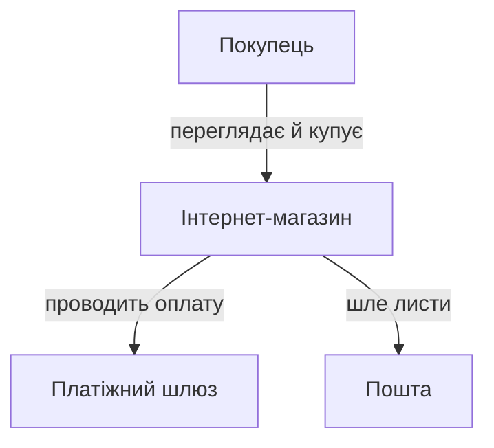
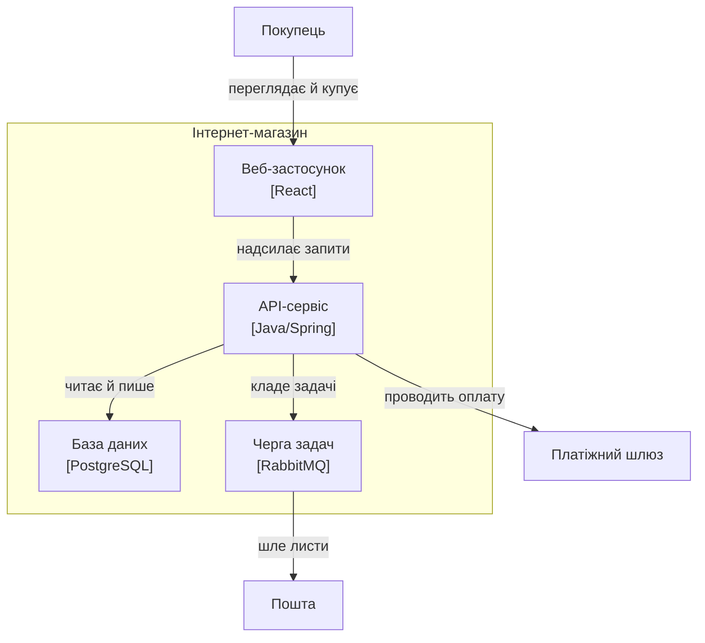

# ⚙️ C4 як код: модель — це дані, діаграма — це запит

Дві діаграми — контекст і контейнер — показують ту саму систему з різної висоти. Намальовані окремо, двома картинками у двох файлах, вони починають брехати одна одній тієї ж миті, коли хтось додав контейнер на одну й забув на іншу. А ще обидві тихо розходяться з кодом: на картинці стрілки одні, в `import`-ах — інші. Полагодимо це в корені — не дисципліною автора, а **побудовою**: зробимо модель єдиним джерелом, а діаграми й перевірку коду виведемо з неї автоматично.

## Задача

Хочемо три речі з одного джерела:

```
1. одна модель системи, описана як типізовані дані в коді;
2. функція-проекція, що з неї друкує ДВІ узгоджені діаграми —
   контекст і контейнер — у текстовому форматі (Mermaid/PlantUML);
3. фітнес-перевірка, що сканує фактичні залежності коду
   й завалює складання, якщо код провів стрілку, якої в моделі нема.
```

Систему беремо ту саму, що на діаграмах цієї теми: інтернет-магазин — веб-застосунок, API-сервіс, база, черга, плюс покупець і два зовнішні сусіди.

## Ідея: модель — граф, діаграма — його запит

Модель C4 — це маленький **позначений орграф**. Вузли — люди, системи, контейнери, компоненти, кожен зі стабільним ID; ребра — зв'язки з підписом. Уся глибина «рівнів» — не в окремих малюнках, а у **вкладенні**: контейнер знає свою систему, компонент — свій контейнер. Це дерево власності поверх графа зв'язків.

Тоді діаграма будь-якого рівня — це **запит до графа**: «дай scope (що в центрі уваги) і рівень (наскільки глибоко зазирати), сховай зайве, намалюй решту». Контекст і контейнер не можуть суперечити одне одному з тієї ж причини, з якої два `SELECT` до однієї таблиці не брешуть: джерело одне, змінюються лише фільтр і масштаб. А якщо той самий граф ще й описує **дозволені залежності**, то з нього виходить не лише картинка, а й правило, яке можна перевірити машиною.

![Схема потоку: ліворуч одна коробка «МОДЕЛЬ як дані (елементи + ID, оголошені зв'язки, єдине джерело правди)»; від неї вгору стрілка у «project(scope, рівень)» і далі в картку «Дві узгоджені діаграми: контекст + контейнер (Mermaid/PlantUML)»; від тієї ж моделі вниз стрілка «оголошені зв'язки» у «checkFitness(модель, код)», куди знизу входить друга стрілка «скан коду» від коробки «КОД: import-и»; праворуч від fitness два виходи — зелений «PASS — код = моделі» і червоний «FAIL: web → db, такої стрілки нема»](img/pipeline.svg)

*Модель — єдиний вхід. Верхня доріжка виводить із неї діаграми, нижня — перевіряє нею код. Обидва споживачі читають той самий граф, тож картинка й код не можуть розійтися: розходитися нема з чим.*

Далі — три кроки рівно за цією схемою.

## Крок 1. Модель як типізовані дані

Спершу — словник понять у типах, і **жодних діаграм тут нема**: сама модель нічого не малює, вона лише описує вузли й ребра. Найважливіше рішення — розділити **`id`** (стабільний ключ, на який посилається все інше) і **`name`** (показове ім'я, яке вільно міняється). Плутати їх — найдорожча помилка, до якої ми ще повернемось.

:::tabs
```typescript
// c4.ts — модель як дані. Тут немає рендерингу: лише вузли й ребра графа.

type Kind = "person" | "system" | "container" | "component";
type Level = "context" | "container";

interface Element {
  id: string;            // СТАБІЛЬНИЙ ключ — на нього посилається все інше
  kind: Kind;
  name: string;          // показове ім'я; його можна міняти будь-коли
  parent?: string;       // власник: контейнер → система, компонент → контейнер
  technology?: string;   // "React", "PostgreSQL" — лише де є сенс
  external?: boolean;    // поза межею нашої системи
}

interface Relation {
  from: string;          // id елемента-джерела
  to: string;            // id елемента-цілі
  label: string;         // "надсилає запити"
  technology?: string;   // "HTTPS/JSON"
}

interface Model {
  root: string;          // id нашої системи — scope за замовчуванням
  elements: Element[];
  relations: Relation[];
}

// --- та сама система, що на діаграмах теми, як звичайні дані ---
const shop: Model = {
  root: "shop",
  elements: [
    { id: "customer", kind: "person", name: "Покупець", external: true },
    { id: "shop",     kind: "system", name: "Інтернет-магазин" },
    { id: "payments", kind: "system", name: "Платіжний шлюз", external: true },
    { id: "email",    kind: "system", name: "Пошта", external: true },

    { id: "web",   kind: "container", name: "Веб-застосунок", parent: "shop", technology: "React" },
    { id: "api",   kind: "container", name: "API-сервіс",     parent: "shop", technology: "Java/Spring" },
    { id: "db",    kind: "container", name: "База даних",      parent: "shop", technology: "PostgreSQL" },
    { id: "queue", kind: "container", name: "Черга задач",     parent: "shop", technology: "RabbitMQ" },
  ],
  relations: [
    { from: "customer", to: "web",      label: "переглядає й купує", technology: "HTTPS" },
    { from: "web",      to: "api",      label: "надсилає запити",    technology: "HTTPS/JSON" },
    { from: "api",      to: "db",       label: "читає й пише",       technology: "SQL" },
    { from: "api",      to: "queue",    label: "кладе задачі",       technology: "AMQP" },
    { from: "api",      to: "payments", label: "проводить оплату",   technology: "API" },
    { from: "queue",    to: "email",    label: "шле листи",          technology: "SMTP" },
  ],
};
```
```python
# c4.py — модель як дані. Тут немає рендерингу: лише вузли й ребра графа.
from dataclasses import dataclass
from enum import Enum

class Kind(str, Enum):
    PERSON = "person"
    SYSTEM = "system"
    CONTAINER = "container"
    COMPONENT = "component"

@dataclass(frozen=True)
class Element:
    id: str                       # СТАБІЛЬНИЙ ключ — на нього посилається все інше
    kind: Kind
    name: str                     # показове ім'я; його можна міняти будь-коли
    parent: str | None = None     # власник: контейнер → система, компонент → контейнер
    technology: str | None = None # "React", "PostgreSQL" — лише де є сенс
    external: bool = False         # поза межею нашої системи

@dataclass(frozen=True)
class Relation:
    src: str                      # id елемента-джерела
    dst: str                      # id елемента-цілі
    label: str
    technology: str | None = None

@dataclass
class Model:
    root: str                     # id нашої системи — scope за замовчуванням
    elements: list[Element]
    relations: list[Relation]

    def by_id(self, eid: str) -> Element:
        return next(e for e in self.elements if e.id == eid)

    def children(self, eid: str) -> list[Element]:
        return [e for e in self.elements if e.parent == eid]


# --- та сама система, що на діаграмах теми, як звичайні дані ---
C = Kind
shop = Model(
    root="shop",
    elements=[
        Element("customer", C.PERSON, "Покупець", external=True),
        Element("shop",     C.SYSTEM, "Інтернет-магазин"),
        Element("payments", C.SYSTEM, "Платіжний шлюз", external=True),
        Element("email",    C.SYSTEM, "Пошта", external=True),

        Element("web",   C.CONTAINER, "Веб-застосунок", parent="shop", technology="React"),
        Element("api",   C.CONTAINER, "API-сервіс",     parent="shop", technology="Java/Spring"),
        Element("db",    C.CONTAINER, "База даних",      parent="shop", technology="PostgreSQL"),
        Element("queue", C.CONTAINER, "Черга задач",     parent="shop", technology="RabbitMQ"),
    ],
    relations=[
        Relation("customer", "web",      "переглядає й купує", "HTTPS"),
        Relation("web",      "api",      "надсилає запити",    "HTTPS/JSON"),
        Relation("api",      "db",       "читає й пише",       "SQL"),
        Relation("api",      "queue",    "кладе задачі",       "AMQP"),
        Relation("api",      "payments", "проводить оплату",   "API"),
        Relation("queue",    "email",    "шле листи",          "SMTP"),
    ],
)
```
:::

Зверни увагу на форму зв'язків: `customer → web`, `web → api`, `api → db`… — це рівні **контейнерів**. Ми ніде не написали окремо «контекстні» зв'язки. І не треба: контекстні виведуться з цих самих ребер автоматично. Це і є робота наступного кроку.

## Крок 2. Проекція — одна функція, дві діаграми

Тепер — серце всього. Функція `project` бере модель, scope і рівень і повертає **текст діаграми**. Уся хитрість — в одній думці, яку легко проґавити: **на вищому рівні коробки нижчого рівня зникають, злипаючись у свого власника**. На контейнерній діаграмі є окремі `web`, `api`, `db`. На контекстній їх нема — там уся система це одна коробка `shop`. Тож ребро `customer → web` на контексті мусить перетворитися на `customer → shop`, а `api → payments` — на `shop → payments`.

Отже, проекція робить дві речі. Спершу для кожного вузла знаходить його **представника** на цьому рівні — найгрубшу видиму коробку, у якій він сидить. Потім переписує кожне ребро на представників його кінців і **викидає ті, що злиплися в петлю** (обидва кінці — той самий `shop`): така залежність лишилася *всередині* коробки, на цьому масштабі її не видно.

:::tabs
```typescript
const el = (m: Model, id: string) => m.elements.find(e => e.id === id)!;
const parentOf = (m: Model, id: string) => el(m, id).parent;

function isDescendant(m: Model, id: string, of: string): boolean {
  let cur = parentOf(m, id);
  while (cur) { if (cur === of) return true; cur = parentOf(m, cur); }
  return false;
}

// представник вузла на заданому рівні — найгрубша видима коробка над ним
function representative(m: Model, id: string, scope: string, level: Level): string {
  if (level === "context")
    return id === scope || isDescendant(m, id, scope) ? scope : id;
  // container: descendant scope-у піднімаємо до контейнера (прямої дитини scope)
  if (id === scope) return scope;
  if (isDescendant(m, id, scope)) {
    let cur = id;
    while (parentOf(m, cur) !== scope) cur = parentOf(m, cur)!;
    return cur;
  }
  return id;
}

function nodeDecl(m: Model, id: string): string {
  const e = el(m, id);
  const label = e.technology ? `${e.name}<br/>[${e.technology}]` : e.name;
  return `${id}["${label}"]`;
}

function project(m: Model, scope: string, level: Level): string {
  // 1. переписуємо кожне ребро на представників і прибираємо петлі
  const edges = new Map<string, { from: string; to: string; label: string }>();
  for (const r of m.relations) {
    const a = representative(m, r.from, scope, level);
    const b = representative(m, r.to, scope, level);
    if (a === b) continue;                       // сховалось усередині коробки
    edges.set(`${a}->${b}`, { from: a, to: b, label: r.label });
  }
  // 2. видимі вузли — кінці ребер + гарантовано сам scope / його контейнери
  const visible = new Set<string>();
  for (const e of edges.values()) { visible.add(e.from); visible.add(e.to); }
  if (level === "context") visible.add(scope);
  else for (const e of m.elements) if (e.parent === scope) visible.add(e.id);

  // 3. рендер у текст Mermaid
  const ids = m.elements.filter(e => visible.has(e.id)).map(e => e.id);
  const out = ["flowchart TB"];
  if (level === "container") {
    out.push(`  subgraph ${scope}["${el(m, scope).name}"]`);
    for (const id of ids) if (parentOf(m, id) === scope) out.push(`    ${nodeDecl(m, id)}`);
    out.push("  end");
    for (const id of ids) if (parentOf(m, id) !== scope && id !== scope) out.push(`  ${nodeDecl(m, id)}`);
  } else {
    for (const id of ids) out.push(`  ${nodeDecl(m, id)}`);
  }
  for (const e of edges.values()) out.push(`  ${e.from} -->|"${e.label}"| ${e.to}`);
  return out.join("\n");
}

console.log(project(shop, "shop", "context"));
console.log(project(shop, "shop", "container"));
```
```python
def is_descendant(m: Model, eid: str, of: str) -> bool:
    cur = m.by_id(eid).parent
    while cur is not None:
        if cur == of:
            return True
        cur = m.by_id(cur).parent
    return False

def representative(m: Model, eid: str, scope: str, level: str) -> str:
    """Представник вузла на рівні — найгрубша видима коробка над ним."""
    if level == "context":
        return scope if eid == scope or is_descendant(m, eid, scope) else eid
    # container: descendant scope-у піднімаємо до контейнера (прямої дитини scope)
    if eid == scope:
        return scope
    if is_descendant(m, eid, scope):
        cur = eid
        while m.by_id(cur).parent != scope:
            cur = m.by_id(cur).parent
        return cur
    return eid

def _decl(m: Model, eid: str) -> str:
    e = m.by_id(eid)
    label = f"{e.name}<br/>[{e.technology}]" if e.technology else e.name
    return f'{eid}["{label}"]'

def project(m: Model, scope: str, level: str) -> str:
    # 1. переписуємо кожне ребро на представників і прибираємо петлі
    edges: dict[tuple[str, str], str] = {}
    for r in m.relations:
        a = representative(m, r.src, scope, level)
        b = representative(m, r.dst, scope, level)
        if a == b:
            continue                              # сховалось усередині коробки
        edges.setdefault((a, b), r.label)
    # 2. видимі вузли — кінці ребер + гарантовано сам scope / його контейнери
    visible = {n for pair in edges for n in pair}
    if level == "context":
        visible.add(scope)
    else:
        visible.update(c.id for c in m.children(scope))
    # 3. рендер у текст Mermaid
    ids = [e.id for e in m.elements if e.id in visible]
    out = ["flowchart TB"]
    if level == "container":
        out.append(f'  subgraph {scope}["{m.by_id(scope).name}"]')
        out += [f"    {_decl(m, i)}" for i in ids if m.by_id(i).parent == scope]
        out.append("  end")
        out += [f"  {_decl(m, i)}" for i in ids if m.by_id(i).parent != scope and i != scope]
    else:
        out += [f"  {_decl(m, i)}" for i in ids]
    out += [f'  {a} -->|"{lbl}"| {b}' for (a, b), lbl in edges.items()]
    return "\n".join(out)

print(project(shop, "shop", "context"))
print(project(shop, "shop", "container"))
```
:::

Обидві реалізації друкують **однаковий текст**. Ось контекст — уся система одна коробка, а три різні контейнерні ребра (`customer→web`, `api→payments`, `queue→email`) піднялися до неї й стали трьома ребрами системи:



А ось контейнер — та сама коробка `shop` розкрилася в межу-`subgraph`, а всередині — окремі контейнери з технологіями:



Придивись до `payments`. Угорі — `shop → payments`, унизу — `api → payments`. Це **не два різні факти**, які треба тримати синхронними; це одне-єдине ребро моделі `api → payments`, показане з двох висот. Тому діаграми фізично не можуть розійтися: додай контейнер — він з'явиться на контейнерній і не з'явиться на контекстній, і жодного ручного узгодження. Рендер у текст — це вже територія прийому [«діаграми як код»](book:programming/diagrams-as-code): та сама модель однаково лягла б у PlantUML чи інший текстовий формат, бо ми відділили *що показати* від *як намалювати*. Промислова, доросла версія рівно цього прийому — [Structurizr](book:programming/diagrams-as-code/comp-structurizr-c4.md), інструмент самого автора C4, де модель описують кодом, а кожна діаграма — її іменований запит; наш `project` — його навчальна мініатюра.

## Крок 3. Фітнес — код не сміє провести стрілку, якої нема

Модель поки що описова: гарний граф, з якого виходять картинки. Але той самий граф несе **правило**. На контейнерній діаграмі є стрілка `web → api` й нема стрілки `web → db`. Отже, у коді модуль веб-застосунку має право імпортувати API-шар і **не має права** лізти прямо в базу в обхід API. Це вже не малюнок — це перевіряне твердження. Виконуваний тест, що стереже архітектурне правило й червоніє, щойно його порушено, називають [фітнес-функцією](book:programming/fitness-functions): він проходить рівно доти, доки код відповідає наміру.

Домовимось, що код кожного контейнера живе у своїй теці верхнього рівня — `web/`, `api/`, `db/`, `queue/`. Тоді перевірка проста: пройди файли, витягни `import`-и, зістав кожен із текою-контейнером, збери **фактичні** ребра «хто кого імпортує» — і порівняй із **дозволеними**, які беруться **прямо з моделі**, не переписані руками.

:::tabs
```typescript
import { readFileSync, readdirSync, statSync } from "node:fs";
import { join, relative, sep } from "node:path";

// тека верхнього рівня → id контейнера в моделі
const SRC_ROOTS: Record<string, string> = { web: "web", api: "api", db: "db", queue: "queue" };

// дозволені ребра код→код беремо З МОДЕЛІ, а не дублюємо руками
function allowedEdges(m: Model): Set<string> {
  const code = new Set(Object.values(SRC_ROOTS));
  const allow = new Set<string>();
  for (const r of m.relations)
    if (code.has(r.from) && code.has(r.to)) allow.add(`${r.from}->${r.to}`);
  return allow;
}

function* walk(dir: string): Generator<string> {
  for (const name of readdirSync(dir)) {
    const p = join(dir, name);
    if (statSync(p).isDirectory()) yield* walk(p);
    else if (p.endsWith(".ts")) yield p;
  }
}

const containerOf = (rel: string) => SRC_ROOTS[rel.split(sep)[0]];
const IMPORT = /\bfrom\s+["'](?:\.\.\/|\.\/)*([a-z]+)\//g;  // спрощено, але робить діло

// фактичні ребра «контейнер → контейнер», знайдені в коді
function actualEdges(root: string): Set<string> {
  const edges = new Set<string>();
  for (const file of walk(root)) {
    const here = containerOf(relative(root, file));
    if (!here) continue;
    const src = readFileSync(file, "utf8");
    for (const m of src.matchAll(IMPORT)) {
      const target = SRC_ROOTS[m[1]];
      if (target && target !== here) edges.add(`${here}->${target}`);
    }
  }
  return edges;
}

export function checkFitness(model: Model, root: string): void {
  const allow = allowedEdges(model);
  const bad = [...actualEdges(root)].filter(e => !allow.has(e));
  if (bad.length) {
    const lines = bad.map(e => {
      const [a, b] = e.split("->");
      return `  ✗ ${a} → ${b}: на діаграмі такої стрілки нема`;
    });
    throw new Error("C4-фітнес провалено:\n" + lines.join("\n"));
  }
  console.log("C4-фітнес: код тримається моделі ✓");
}
```
```python
import ast
from pathlib import Path

# тека верхнього рівня → id контейнера в моделі
SRC_ROOTS = {"web": "web", "api": "api", "db": "db", "queue": "queue"}

def allowed_edges(m: Model) -> set[tuple[str, str]]:
    """Дозволені ребра код→код беремо З МОДЕЛІ, а не дублюємо руками."""
    code = set(SRC_ROOTS.values())
    return {(r.src, r.dst) for r in m.relations if r.src in code and r.dst in code}

def _imports(path: Path):
    tree = ast.parse(path.read_text(encoding="utf-8"))
    for node in ast.walk(tree):
        if isinstance(node, ast.ImportFrom) and node.module:
            yield node.module.split(".")[0]
        elif isinstance(node, ast.Import):
            for a in node.names:
                yield a.name.split(".")[0]

def actual_edges(root: Path) -> set[tuple[str, str]]:
    """Фактичні ребра «контейнер → контейнер», знайдені в коді."""
    edges = set()
    for path in root.rglob("*.py"):
        here = SRC_ROOTS.get(path.relative_to(root).parts[0])
        if here is None:
            continue
        for mod in _imports(path):
            there = SRC_ROOTS.get(mod)
            if there and there != here:
                edges.add((here, there))
    return edges

def check_fitness(model: Model, root: Path) -> None:
    allow = allowed_edges(model)
    bad = actual_edges(root) - allow
    if bad:
        lines = "\n".join(f"  ✗ {a} → {b}: на діаграмі такої стрілки нема"
                          for a, b in sorted(bad))
        raise SystemExit("C4-фітнес провалено:\n" + lines)
    print("C4-фітнес: код тримається моделі ✓")
```
:::

Дозволені ребра тут — `web→api`, `api→db`, `api→queue`: рівно ті стрілки контейнерної діаграми, обидва кінці яких — наш код. Тепер хай хтось у поспіху зробить у веб-застосунку прямий похід у базу:

:::tabs
```typescript
// web/checkout.ts — порушник
import { pool } from "../db/pool";   // ← веб тягнеться ПРЯМО в базу, повз API
```
```python
# web/checkout.py — порушник
from db.pool import pool             # ← веб тягнеться ПРЯМО в базу, повз API
```
:::

Скан знаходить фактичне ребро `web → db`. У дозволених його нема — і `checkFitness` валить складання:

```
C4-фітнес провалено:
  ✗ web → db: на діаграмі такої стрілки нема
```

Ось у чому вся сила. Раніше «веб не ходить у базу напряму» було усною домовленістю, яку новий інженер не знав, а старий забув. Тепер це — **рядок у моделі**, і будь-яке його порушення червоніє в CI ще до рев'ю. Діаграма перестала бути картинкою й стала виконуваним контрактом: намалювати стрілку й провести залежність — тепер одна дія, а не дві, що розповзаються.

## Складність і пастки

**Дрейф моделі проти коду — і напрям, який фітнес не ловить.** Проекція тримає дві *діаграми* узгодженими між собою задарма. Але вона нічого не каже про те, чи *модель* збігається з *кодом* — це робота фітнес-функції, і робить вона лише половину. Наш `checkFitness` ловить **заборонене ребро, що з'явилося** в коді (`web → db`). Він не ловить протилежного — **оголошеного ребра, яке в коді зникло**: модель обіцяє `web → api`, а виклик давно видалили, і стрілка на діаграмі тепер бреше. Замикається діра дзеркальною перевіркою:

```python
unused = allowed_edges(model) - actual_edges(root)   # оголошено, але в коді не використано
for a, b in sorted(unused):
    print(f"  ⚠ {a} → {b}: зв'язок є в моделі, а в коді його вже нема")
```

Порожній `web/` без жодного `import` до `api` пройде основну перевірку (заборонене нічого не з'явилось), але спливе тут як мертвий зв'язок. Обидва боки — заборонене-присутнє й оголошене-відсутнє — місце фітнесу в CI: інакше дрейф накопичується мовчки, аж доки діаграма стане музейним експонатом.

**Надмірне моделювання.** Дивись, як легко в цій моделі додати вузол — один рядок у масиві. Це і є пастка. Спокуса завести компонент на кожен клас, ребро на кожен виклик — і модель перетворюється на **другу кодову базу**, яку теж треба супроводжувати, яка старіє найшвидше й помирає перша. Тримай межу свідомо: вузол виправданий, лише якщо він **з'являється на якійсь діаграмі або обмежує якусь залежність**. Не з'являється й не обмежує — це шум, який лише додає роботи з підтримки. Контейнерна зернистість корисна майже завжди; компоненти — тільки для контейнера, чиє нутро якійсь діаграмі справді треба пояснити. Типізована модель робить *додавання* вузла дешевим — саме тому дисципліну доводиться тримати самому, бо код не спинить.

**Стабільність ідентифікаторів.** `id` — це хребет усього. На нього посилаються ребра, на нього дивиться `SRC_ROOTS` фітнесу, на нього ляжуть майбутні прив'язки розгортання й історія git-дифів. Спокуса — виводити `id` із показового імені; тоді перейменування «API-сервіс» → «Бекенд» тихо переписує ключ і **осиротлює кожне ребро**, що на нього посилалося. Правило: `id` — непрозорий заморожений слаг, `name` — людський підпис, який хай міняється скільки завгодно. Ніколи не переливай звільнений `id` в інший елемент: історія дифів склеїть дві різні речі в одну. І найпідступніше саме в цьому коді: `id` тут ще й **збігається з назвою теки**. Перейменуй контейнер у моделі, не перейменувавши теку, — і `containerOf` почне повертати `undefined`, фактичних ребер не знайдеться зовсім, а фітнес **пройде порожнім**. Зелена перевірка, що не перевіряє нічого, гірша за червону: вона брехливо заспокоює. Тому `id` і структура коду мусять рухатися в одному кроці — або ключ лишається стабільним, або міняється скрізь одночасно.

І це — корінь усього прийому. Коли модель — це дані, діаграма стає запитом до них, перевірка коду — ще одним запитом, а всі троє читають один граф, розходитися просто нема чому. Не сила волі тримає картинку й код разом, а те, що вони виросли з одного джерела.
