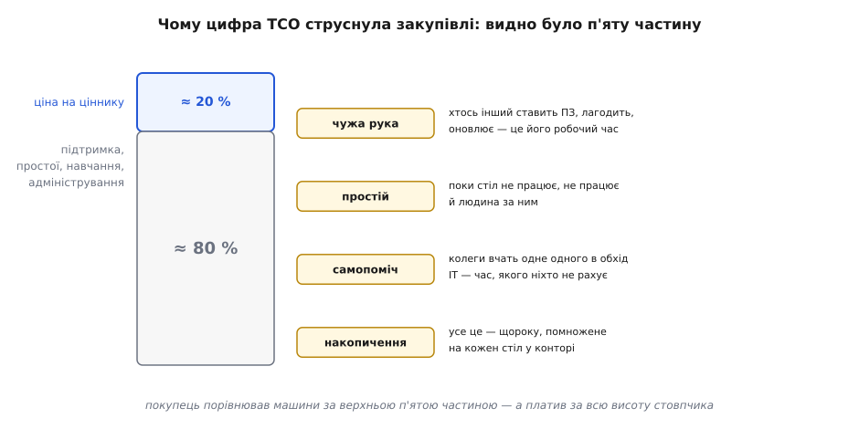

# 📜 Як цифра «десять тисяч за стіл» струснула галузь

Історію повної вартості володіння легко переказати одним рядком: «1987 року аналітик Gartner Білл Кірвін вигадав TCO». Рядок правдивий у датах і майже безкорисний у сенсі, бо ховає найцікавіше — **навіщо** комусь узагалі знадобилося складати всі витрати за весь строк життя машини, коли в кожної машини є чесний цінник, і чому, коли ці цифри нарешті склали й показали, галузь на кілька років ніби здуріла. Розберімо не гасло, а справжню річ: що бентежило людей у середині 1980-х, хто перший назвав біль числом, і як одна оцінка — приблизно десять тисяч доларів на рік за один настільний комп'ютер — на пів десятиліття перекроїла те, що корпорації купували й у що вкладали мільярди.

**Статус доказовості цієї історії — усталено.** Дати, ім'я й ключові цифри збігаються в незалежних джерелах: власних документах Gartner, галузевій пресі 1990-х і пізніших оглядах. Де твердження м'якше чи спірне — я це позначу окремо.

## Що бентежило: рахунок роз'їхався по конторі

Щоб зрозуміти, чому TCO взагалі знадобився, треба уявити, як рахували обчислення **до** нього. У 1970-х корпоративний комп'ютер був один — великий мейнфрейм (англ. *mainframe* — центральна велика ЕОМ) у скляній кімнаті. Він мав ціну, мав рядок у бюджеті, мав відділ, що його обслуговував. Питання «скільки коштує наше обчислення» мало чесну відповідь: подивись у бюджет обчислювального центру. Усе — в одному місці, усе — під одним контролем.

А тоді прийшов персональний комп'ютер, і рахунок **розсипався**. IBM PC вийшов 1981 року, і за кілька років настільні машини розповзлися конторою: по одній на стіл, куплені різними відділами, з різних кошиків, без спільного обліку. Кожна окремо коштувала небагато — кілька тисяч доларів, дрібниця проти мейнфрейма. Саме ця дешевизна поштучно й створила пастку: якщо кожна машина дешева, її купують не питаючи, і ніхто не складає їх докупи.

> 🔧 **Навіщо це.** Та сама пастка жива й сьогодні, лише замінник інший. Хмарний сервіс за 20 доларів на місяць купують не питаючи — дрібниця. За рік у великій конторі таких підписок сотні, і сума виходить на порядок більша за будь-який мейнфрейм, а моменту, коли це сталося, ніхто не назве. Дешеве поштучно й непомітне сумарно — це не історія про 1986 рік, це вічний спосіб, яким витрати ховаються від ока.

Gartner Group — заснована 1979 року Гідеоном Гартнером (Gideon Gartner) разом із Девідом Стайном (David Stein) дослідницька й консультаційна фірма зі Стемфорда, штат Коннектикут, що продавала корпораціям аналітику про ІТ, — помітила цей безлад першою й голосно. **1986 року** вона випустила аналіз, який ставив незручне питання: за розповзання обчислень по відділах ІТ-витрати стали **непідзвітними** — їх більше ніхто не бачить цілими. Комп'ютер уже не в скляній кімнаті під одним бюджетом; він на кожному столі, а його справжня вартість — навчання людини, простій, коли машина стала, дзвінки по допомогу — розмазана по конторі так, що в жодному рахунку її не видно. Це дослідження Gartner пізніше сама назве коренем усього — **«вартість життєвого циклу ПК»** (англ. *life cycle cost of PCs*): перша спроба порахувати не ціну заліза, а ціну всього життя машини на столі.

Зверни увагу на слово **життєвий цикл**. Воно не з повітря: думка «дивись на весь строк служби, а не на ціну придбання» старша за комп'ютери. Її промовляли ще у сфері закупівель у 1920-х — Ральф Борсоді (Ralph Borsodi, 1927) і Норман Гарріман (Norman Harriman, 1928) писали, що обираючи постачальника, треба зважати на витрати поза ціною купівлі. Ідея загальна й давня; заслуга Gartner не в тому, що вона першою подумала про «весь цикл», а в тому, що вона **приклала цю думку до конкретного болю конкретної галузі в конкретний момент** — і, головне, порахувала число, від якого не сховаєшся. (Це важлива різниця, і про неї варто пам'ятати завжди: одне — мати ідею, зовсім інше — зробити з неї працюючий інструмент, яким користуються. Історія техніки повна випадків, коли лаври дістаються не тому, хто перший подумав, а тому, хто зробив річ.)

## Хто назвав біль числом: Білл Кірвін

Ідею «рахувати весь цикл» треба було перетворити на **методологію** — на порядок дій, за яким будь-хто складе всі витрати настільної машини й отримає одне порівнянне число. Це зробив **Білл Кірвін** (Bill Kirwin), аналітик Gartner, який **1987 року** вперше застосував модель повної вартості до настільних систем і дав їй ім'я, під яким її знають досі, — **total cost of ownership**, повна вартість володіння. За це його й прозвали «батьком TCO» (англ. *father of TCO*).

Тут варто бути точним у титулах, бо джерела трохи розходяться в дрібницях, і чесніше сказати як є. Кірвіна усталено називають людиною, що ввела TCO 1987 року й застосувала модель до настільних систем; у Gartner він доріс до посади віцепрезидента й директора з досліджень (англ. *vice president and research director*). Прізвисько «батько TCO» — не офіційний титул, а усталена в галузі шана; я не бачив документа, де сам Кірвін одноосібно приписує собі винахід, і це радше добра ознака. TCO не осяяло одну голову в одну мить — це була робота фірми над реальним запитом, і Кірвін — той, хто дав їй форму й ім'я. Статус: **усталено** щодо ролі й дати, з тверезою поправкою, що прізвисько — данина, а не патент.

Є ще одна деталь, яку варто назвати прямо, бо вона багато пояснює про подальше. За низкою джерел, Кірвін розробляв модель TCO **на прохання Microsoft** — компанії, чия операційна система стояла на тих самих настільних машинах, чию вартість він рахував. Це не змова й не компромат: замовлене дослідження — звична річ. Але тримати цей факт у голові корисно, бо коли за кілька років цифри TCO стануть зброєю у війні за ринок, Microsoft опиниться по один бік цієї війни — і ми ще побачимо, як компанія, що колись замовила лінійку, потім гарячково рятуватиметься від власної цифри.

> 🔧 **Навіщо це.** Історія Кірвіна — це історія про те, як **розмиту турботу перетворюють на число**. Доти «ПК дорого обходяться» було відчуттям, за яке не вхопишся: хтось погодиться, хтось відмахнеться, і кожен піде робити своє. Кірвін дав методику, за якою відчуття стає цифрою в доларах на рік, а цифру вже не відмахнеш — її можна перевірити, оскаржити, покласти в бюджет. Це рівно те, що робить архітектор, коли перекладає «має бути дешево» на «менше ніж стільки-то на користувача на місяць»: без числа немає ні спору, ні контролю, лише смаки.

## Що саме порахували: п'ята частина на видноті

Тепер найважливіше — **що показала методика**, бо саме результат, а не сам факт лічби, і струснув галузь. Порахувавши повну вартість настільного ПК за весь строк служби, Gartner отримала пропорцію, яка суперечила всьому, що покупець відчував нутром: **ціна купівлі — це приблизно п'ята частина повної вартості, решта чотири п'ятих схована.** За оцінкою 1987 року на саме придбання припадало близько 20 % усіх витрат; інші 80 % набігали потім — підтримкою, простоями, навчанням, адмініструванням.



*Покупець бачив і порівнював машини за верхньою п'ятою частиною стовпчика — ціною на ціннику. А платив за всю висоту: за руку, що ставить ПЗ й лагодить, за години простою, коли стіл не працює, за час, який колеги витрачають, навчаючи одне одного в обхід ІТ. Помнож це на кожен стіл у конторі й на кожен рік — і «дешева» поштучно машина виявляється найдорожчою статтею бюджету.*

Спинися на цій пропорції, бо в ній уся сила історії. Уяви, що ти обираєш між двома машинами: одна дешевша на ціннику на триста доларів. Ти впевнено береш дешевшу — і програєш, бо ці триста доларів — рух у межах верхніх 20 %, а всі 80 % (хто її обслуговує, як часто вона стає, скільки на ній навчати людину) можуть різнитися так, що «дорожча» машина за три роки коштуватиме тобі менше. Порівнюючи за ціною купівлі, ти дивишся на щоглу, а обираєш корабель — і саме це, за оцінкою Gartner, роками робила ціла галузь, вкладаючи мільярди за неправильним числом.

Звідки ж беруться ці приховані чотири п'ятих? Методика Gartner розкладала їх на статті, і кожна на позір дрібна, а разом вони й дають основну масу:

```
ПРЯМІ, та поза ціною заліза:
   ПЗ, оновлення, ліцензії
   робота ІТ: встановлення, налаштування, ремонт, адміністрування

НЕПРЯМІ, найпідступніші — їх узагалі не було в жодному рахунку:
   простій — година, коли машина стала, це година, коли людина за нею не працює
   самопоміч і взаємонавчання — колеги розбираються самі, в обхід ІТ,
      і цей час не бачить ніхто, хоча його витрачають щодня
```

Саме **непрямі** витрати були одкровенням. Прямі ще якось відчувалися — за ліцензію й ремонт хтось платив рахунком. А непрямі не мали рахунку взагалі: ніхто не виставляє інвойс за те, що Марія з бухгалтерії півгодини показувала Петрові, як зробити зведену таблицю, поки обоє не робили своєї роботи. Цей час — реальні гроші контори, але його не видно ніде, і доти ніхто його не рахував. Gartner порахувала — і виявилося, що ця невидима праця становить величезну частку вартості володіння. Показати невидиме числом — це і є справжня заслуга методики, більша за самий термін.

## Момент удару: «десять тисяч за стіл»

Методика 1987 року дала пропорцію; галузь її прийняла до відома, але спокійно — цифри жили в звітах, які читали аналітики. Справжній струс стався **1996 року**, коли Gartner оголосила конкретне, велике, наочне число: середній настільний комп'ютер під Windows коштує конторі **близько 10 000 доларів на рік** повної вартості володіння. Десять тисяч. За машину, яку купили за пару тисяч. Приблизно **вп'ятеро над ціною придбання** — і не разово, а **щороку**.


*Десять років між тихим звітом і моментом удару. 1986-го Gartner лише вказала на безлад в обліку; 1987-го Кірвін дав методику й ім'я; а рвонуло аж 1996-го, коли абстрактна пропорція «20 на 80» стала конкретним, страшним числом — десять тисяч на рік за один стіл. Відтоді TCO — не екзотика аналітиків, а стандартна графа, без якої велику закупівлю не ухвалюють.*

Чому саме це число вдарило, тоді як пропорція 1987 року нікого не звалила? Бо **абстрактне «80 % схована» не лякає, а конкретне «десять тисяч на рік за кожен зі ста столів» лякає негайно.** Порахуй: сто настільних машин — це, за цією цифрою, мільйон доларів на рік прихованої вартості, про яку в бюджеті нема ні рядка. Тисяча столів — десять мільйонів. Раптом виявилося, що найбільша стаття ІТ-витрат великої компанії — не сервери, не ліцензії, не зарплати програмістів, а **тиха вартість утримання настільних ПК**, якої ніхто досі не бачив цілою. Число з'явилося на перших шпальтах галузевої преси, лягло на стіл кожному фінансовому директору — і зробило те, чого не зробить жоден звіт: змусило керівництво **перепитати власні рішення про закупівлі**.

Тут потрібна тверезість, бо навколо цих цифр завжди були й суперечки. Оцінку «десять тисяч» багато хто оскаржував: методики різнилися, у різних звітах виходили різні числа, а сама Gartner зацікавлена в тому, щоб проблема здавалася великою — велика проблема продає її дослідження й консультації. Тож найчесніше сказати так: **сам факт, що ціна володіння в рази перевищує ціну купівлі, — усталено** й підтверджений незалежно; а конкретна цифра «10 000 доларів» — **оцінка з широким полем похибки**, яку варто читати як «дуже багато, набагато більше за цінник», а не як точний вимір. Сила її була не в точності, а в порядку величини й у наочності: вона перевела абстрактну істину в число, від якого закладає дух.

## Що зробила ця цифра з галуззю

А тепер — найяскравіше, те, заради чого цю історію взагалі варто знати: **як число TCO перекроїло ринок**. Бо оприлюднена цифра не лишилася академічною — вона стала **зброєю**, і навколо неї спалахнула справжня війна за те, яким має бути корпоративний комп'ютер.

Логіка нападу була проста й нищівна. Якщо чотири п'ятих вартості ПК — це не залізо, а **утримання** (хтось ставить ПЗ, лагодить, оновлює, розгрібає поламане), то дешевша машина проблему не розв'язує — треба машину, яку **майже не треба утримувати**. І 1996 року Ларрі Еллісон (Larry Ellison), голова Oracle, вивів на сцену саме таку ідею — **мережевий комп'ютер** (англ. *network computer*, NC): дешевий, приблизно за 500 доларів, обрізаний пристрій без власного диска, що тягне програми й дані з сервера мережею. Аргумент Еллісона був прямо з методики Gartner, оберненої проти самого ПК: він публічно заявляв, що звичайний ПК обходиться конторі приблизно у 8 000 доларів на рік з урахуванням навчання, підтримки й інфраструктури, — то навіщо він, якщо тонкий термінал коштує тих грошей за все життя? NC підтримали Sun Microsystems, Netscape, навіть Apple — усі, хто хотів послабити зв'язку Microsoft і Intel, що панувала на настільниці. Ціле питання «яким буде корпоративний комп'ютер» раптом стало відкритим — і відкрила його цифра TCO.

Microsoft — та сама компанія, на замовлення якої, за джерелами, колись і рахували TCO, — тепер опинилася під ударом власного числа й відповіла швидко. **28 жовтня 1996 року** вона оголосила ініціативу **Zero Administration** для Windows (англ. *Zero Administration for Windows* — «нуль адміністрування»): набір технологій, щоб урізати саме ту приховану вартість, на яку тиснув Еллісон, — централізувати оновлення, автоматизувати встановлення програм, замкнути настільницю так, щоб користувач не наробив біди, а ІТ витрачав на утримання менше. Того ж дня Microsoft разом з Intel показала **NetPC** — здешевлений керований ПК як відповідь на мережевий комп'ютер. У березні 1997-го вийшов **Zero Administration Kit** для Windows NT Workstation. Уся ця гарячкова активність гіганта — прямий наслідок однієї оприлюдненої цифри: коли число TCO сказало «ваш продукт коштує вп'ятеро дорожче, ніж здається», найбільша софтверна компанія світу кинулася перебудовувати продукт, щоб це число збити.

Чим скінчилося? Мережевий комп'ютер **програв** — але повчально. Ідея була передчасна: мережі 1996-го були надто повільні, а ПК натомість швидко дешевшав і потужнішав, тож переваги тонкого термінала танули на очах. **1998 року** Еллісон визнав, що Oracle переоцінила NC і що ПК переміг. Ставка на мережевий комп'ютер виявилася **важко-зворотним рішенням** — тим самим «однобічними дверима», у які легко ввійти й дорого вийти: партнери вклали роки й гроші в напрям, що заглух. Рішення бувають зворотні (легко відкотити, як «двобічні двері») і незворотні («однобічні» — вихід дорогий або неможливий), і другі варто ухвалювати повільніше й обережніше — [про це окремо](book:programming/reversible-irreversible-decisions).

> 🔧 **Навіщо це.** Це не просто цікавий епізод з 1990-х — це показ того, **що робить із ринком добре пораховане число атрибута**. Одна цифра TCO перевернула порядок денний найбільших гравців галузі, породила цілий клас пристроїв, змусила Microsoft переробляти Windows — і все тому, що хтось нарешті склав приховані витрати докупи й назвав суму вголос. Коли наступного разу тобі здається, що «порахувати повну вартість» — це занудна бухгалтерія, згадай мережевий комп'ютер: число, покладене на стіл вчасно, рухає мільярди й перекроює ринки. У цьому й сенс — тримати вартість не графою у звіті, а числом, яке міняє рішення.

## Що лишилося після пилу

Мережевий комп'ютер помер, а **TCO лишилося** — і в цьому головний підсумок. До **кінця 1990-х** повна вартість володіння з екзотики аналітиків Gartner перетворилася на стандартну графу: жодну велику ІТ-закупівлю більше не ухвалюють, не спитавши «а скільки це коштуватиме за весь строк, а не на ціннику». Термін вийшов далеко за межі комп'ютерів — сьогодні TCO рахують для автомобілів, верстатів, будівель, будь-чого, що купують і потім довго утримують. Ідея «дивись на весь цикл, а не на ціну входу», яку промовляли ще у 1920-х у закупівлях, нарешті отримала методику, ім'я й гучний приклад — і вкоренилася назавжди.

Що ж справді зробили Gartner і Кірвін, якщо казати без гасел? Не винайшли думку про життєвий цикл — вона була давня. Не відкрили, що утримання коштує грошей, — це знав кожен, хто платив за ремонт. Вони зробили важче й цінніше: **склали розсипані, невидимі, «нічийні» витрати в одне порівнянне число й показали його світу в момент, коли світ був готовий здригнутися.** Цим вони перетворили відчуття на інструмент, а суперечку смаків — на спір із цифрою в руках. Саме тому історія TCO — це не історія терміна, а історія про те, як **називання болю числом** дає над ним владу: поки вартість лишалася відчуттям, з нею нічого не можна було вдіяти; щойно вона стала числом на рік, вона почала рухати рішення, ринки й мільярди.
