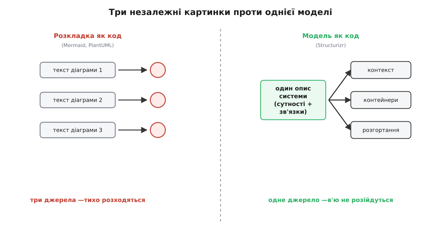
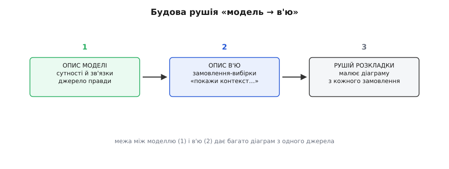
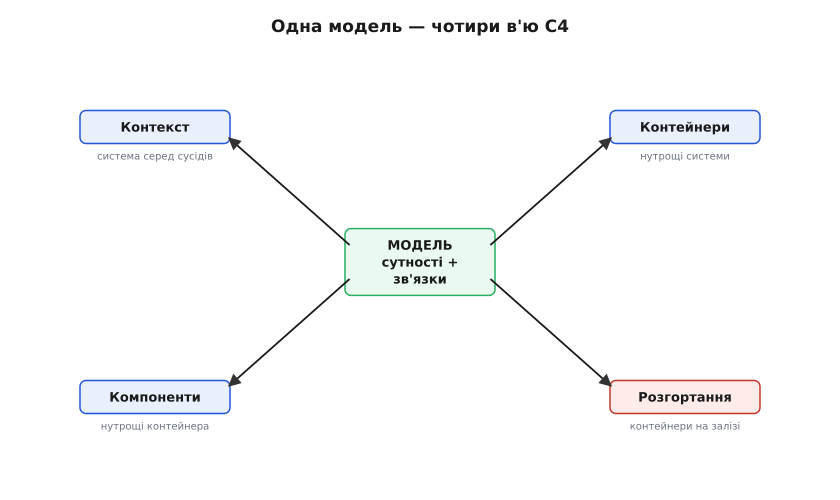

# 🔌 Structurizr: одна модель — багато діаграм

Уяви, що тобі треба показати систему з трьох боків: згори (хто нею взагалі користується й з якими сусідами говорить), зсередини (з яких великих шматків вона складається) і в бою (де ці шматки крутяться на залізі). У звичайному редакторі це три окремі картинки. Ти намалюєш прямокутник «Платіжний сервіс» на першій, знову намалюєш його на другій, ще раз на третій — і з цієї миті вони живуть окремими життями. Переназвав сервіс — переназви в трьох місцях. Забув в одному — і три картинки вже суперечать одна одній, кожна по-своєму бреше.

Structurizr — інструмент Саймона Брауна (Simon Brown), британського архітектора й автора моделі C4, — прибирає це коренем. Ти описуєш систему **один раз**: які в ній є люди, системи, контейнери, компоненти й хто з ким зв'язаний. Це не опис картинки — це опис самої системи, її **моделі**. А діаграми з цієї моделі рушій нарізає скільки завгодно, і всі вони автоматично узгоджені між собою, бо походять з одного джерела. Переназвав сервіс у моделі — він переназвався в усіх в'ю разом, бо він там **один**, а не тричі намальований.

Це і є суть класу інструментів, до якого Structurizr належить: **модель → багато в'ю**. Structurizr — найвідоміший представник, але не єдиний; наприкінці ми окреслимо весь клас. А почнемо з того, чим цей клас принципово відрізняється від простішого сусіда.

## Розкладка як код проти моделі як код

Є два різні способи «писати діаграму текстом», і плутати їх — головна причина розчарувань. Різниця не в синтаксисі, а в тому, **що саме описує твій текст**.

Простіший спосіб — **розкладка як код**: текст описує одну конкретну картинку. Рядок каже «намалюй стрілку від A до B на цій діаграмі». Так працюють Mermaid, PlantUML, DOT. Хочеш ту саму систему з іншого боку — пишеш другий, окремий текст. Кожна картинка — своє джерело; узгодженість між ними тримаєш ти сам, руками.

Глибший спосіб — **модель як код**, і тут Structurizr. Твій текст описує не картинку, а систему: сутності (люди, системи, контейнери, компоненти) та зв'язки між ними. Це опис **семантики** (гр. *sēmantikós* — значеннєвий), а не геометрії — ти ніде не кажеш «намалюй тут прямокутник». Ти кажеш «є платіжний сервіс, він звертається до банку». А вже *які* діаграми з цього намалювати й що на кожній показати — окреме питання, яке ти ставиш нижче, у секції в'ю.

Наслідок цієї різниці величезний. Коли сутність описана один раз, вона не може розійтися сама з собою на різних картинках — її просто нема в кількох екземплярах. Це те, чого розкладка-як-код дати не може в принципі: там кожна картинка незалежна, і ніщо не заважає їм суперечити одна одній.

> 🔧 **Навіщо це.** У серйозній системі архітектуру показують багатьом аудиторіям: бізнесу — загальний контекст, розробникам — контейнери й компоненти, експлуатації — розгортання. Це не одна діаграма, а сімейство. Тримати сімейство узгодженим руками неможливо: рано чи пізно одна картинка відстане. Модель-як-код робить узгодженість не питанням дисципліни, а властивістю конструкції — усі в'ю ростуть з одного опису, тож розійтися їм фізично нема як.


*Розкладка як код проти моделі як код. Ліворуч (розкладка): три діаграми — три незалежні тексти; узгодженість тримаєш руками, і вона тихо ламається. Праворуч (модель): один опис сутностей і зв'язків, а рушій сам вирощує багато в'ю; вони узгоджені за конструкцією, бо джерело в них одне.*

## Клас пристрою: рушій «модель → в'ю»

Розглянемо Structurizr як представника класу, а не як окремий продукт — так видно, що в ньому суттєве, а що випадкове. Будь-який інструмент «модель → багато в'ю» складається з трьох частин, і Structurizr — теж.

Перша частина — **опис моделі**. Це текст (у Structurizr — його власна DSL, англ. *domain-specific language*, предметна мова), де ти заводиш сутності та зв'язки. Тут живе вся правда про систему. Модель нічого не знає про картинки — вона знає лише *що з чого складається й що з чим говорить*.

Друга частина — **опис в'ю**. Окремий блок, де ти кажеш: «зроби діаграму контексту для оцієї системи», «зроби діаграму контейнерів», «зроби діаграму розгортання для продакшену». В'ю — це **вибірка** з моделі під певний кут і масштаб: одне в'ю бере лише зовнішніх сусідів системи, інше — лише її нутрощі, третє — лише те, як вона лягає на залізо. Ти не малюєш в'ю, ти його **замовляєш** із моделі.

Третя частина — **рушій розкладки й рендер**. Він бере замовлене в'ю й **сам** розставляє прямокутники, проводить стрілки, підбирає розташування — або дає тобі підправити руками, якщо автомат склав негарно. Ти кажеш *що показати*, а *де це намалювати* — його турбота.


*Будова будь-якого рушія «модель → в'ю». Модель тримає правду про систему й нічого не знає про картинки. В'ю — це замовлення-вибірки з моделі («покажи контекст», «покажи контейнери»). Рушій розкладки перетворює кожне замовлення на діаграму. Розділення моделі й в'ю — саме те, що дає багато узгоджених картинок з одного джерела.*

Ключ до всього — **межа між моделлю і в'ю**. Саме вона робить магію можливою: одна модель, багато замовлень до неї. Прибери цю межу — і ти скотишся назад до розкладки-як-код, де текст і картинка зрослися один-до-одного.

## Мова моделі: сутності C4 у тексті

Тепер конкретика. Модель Structurizr побудована навколо чотирьох рівнів масштабу [моделі C4](topic:programming/c4-model) — Контекст, Контейнери, Компоненти, Код (англ. *Context, Container, Component, Code*). Це не випадковий збіг: Structurizr і створювався як інструмент саме під C4, тим самим автором. Кожен рівень — свій масштаб, як зум на мапі: відійшов — бачиш усю систему серед сусідів, наблизився — бачиш її нутрощі.

У DSL ці рівні стають ключовими словами моделі:

```
workspace {

    model {
        user = person "Клієнт" "Користується інтернет-банком."

        internetBanking = softwareSystem "Інтернет-банк" {
            webApp     = container "Веб-застосунок"  "Віддає сторінки" "React"
            apiApp     = container "API"             "Бізнес-логіка"   "Java"
            database   = container "База даних"      "Рахунки, платежі" "PostgreSQL"

            apiApp -> database "Читає й пише"
        }

        mainframe = softwareSystem "Банківський мейнфрейм" "Джерело правди про рахунки."

        user     -> webApp   "Користується" "HTTPS"
        webApp   -> apiApp   "Викликає"      "JSON/HTTPS"
        apiApp   -> mainframe "Ходить по баланси" "XML/HTTPS"
    }

}
```

Прочитаймо це так, як читає рушій. `workspace` — корінь усього, усередині нього живуть `model` (система) і згодом `views` (діаграми). Усередині `model` кожен рядок заводить сутність або зв'язок:

```
person          — людина/актор (клієнт, оператор, адміністратор)
softwareSystem  — ціла система (твоя або сусідня зовнішня)
container       — виконуваний шматок системи (застосунок, сервіс, база даних)
component       — блок усередині контейнера (модуль, клас-групa)
->              — зв'язок «хто → кого», з підписом і, за бажанням, технологією
```

Кілька речей варто помітити одразу, бо в них і сила, і майбутні граблі. По-перше, `user = person "..."` — це присвоєння **ідентифікатора**: ліворуч коротке ім'я `user`, яким ти потім посилаєшся на цю сутність у зв'язках, праворуч — людський підпис, що потрапить на картинку. Ідентифікатор — це і є той самий «один екземпляр», що не роздвоїться: посилаєшся на `webApp` хоч десять разів — сутність лишається одна.

По-друге, вкладеність задає структуру C4: `container` усередині `softwareSystem` означає «цей контейнер належить цій системі». Рушій потім сам знатиме, що на діаграмі контексту контейнери ховати (там система — один прямокутник), а на діаграмі контейнерів — розкривати. Ти цю логіку не програмуєш; вона випливає з рівня C4, до якого належить сутність.

По-третє — і це найважливіше — **ти щойно описав систему, а не жодної картинки**. У тексті вище нема ні слова про те, де що малювати. Є лише *що є* і *що з чим зв'язане*. Картинки почнуться нижче, у секції в'ю, і саме тому їх може бути багато.

## Секція в'ю: як одна модель дає багато діаграм

Тепер — головний фокус усього підходу. Додаймо до тієї самої моделі блок `views` і побачимо, як з одного опису народжується сімейство узгоджених діаграм:

```
    views {

        systemContext internetBanking "Контекст" {
            include *
            autoLayout
        }

        container internetBanking "Контейнери" {
            include *
            autoLayout
        }

    }
```

Розберімо, що тут відбувається, бо в цих кількох рядках — уся ідея.

`systemContext internetBanking` каже: «зроби діаграму **контексту** для системи `internetBanking`». Рушій бере модель, знаходить цю систему, показує її одним прямокутником, а навколо — тих, з ким вона говорить: клієнта й мейнфрейм. Контейнери всередині він **не** показує — на рівні контексту вони не потрібні, там система атомарна.

`container internetBanking` каже: «зроби діаграму **контейнерів** тієї самої системи». Тепер рушій ту саму систему **розкриває**: показує веб-застосунок, API, базу — і зв'язки між ними. Клієнт і мейнфрейм лишаються по краях як сусіди.

І ось у чому суть: **обидві діаграми виросли з тієї самої моделі**. Ти ніде не малював клієнта двічі. Ти один раз сказав «є клієнт, він користується веб-застосунком» — і рушій сам вирішив, що на контексті клієнт стоїть біля цілої системи, а на контейнерах — біля конкретного веб-застосунку. Переназвеш клієнта в моделі — він переназветься на **обох** діаграмах, бо він там один.

`include *` означає «увімкни все доречне для цього рівня» — рушій сам добере, що показати за правилами C4. Хочеш точніше — можна `include` й `exclude` конкретні сутності чи зв'язки за їхніми ідентифікаторами або за шаблоном. `autoLayout` вмикає автоматичну розкладку: рушій сам розставить прямокутники (можна задати напрям — згори вниз, зліва направо — і відступи). Прибереш `autoLayout` — розставлятимеш руками у графічному редакторі Structurizr, коли автомат склав негарно.


*Одна модель — чотири в'ю. З єдиного опису сутностей і зв'язків рушій за замовленням малює діаграму будь-якого рівня масштабу: контекст показує систему серед сусідів, контейнери розкривають її нутрощі, компоненти — нутрощі одного контейнера, розгортання кладе все на залізо. Сутність «Веб-застосунок» описана раз, а на різних в'ю з'являється в різній ролі — і не може розійтися сама з собою.*

## Третій і четвертий масштаб: компоненти й розгортання

Два в'ю вище — лише початок. Та сама модель годує ще принаймні два важливі рівні, і на них видно, наскільки далеко тягнеться «один опис — багато картинок».

**Компоненти** — зум усередину одного контейнера. Якщо в моделі описати, з яких блоків складається, скажімо, `apiApp`, то в'ю `component apiApp` покаже вже їх — контролери, сервіси, репозиторії та зв'язки між ними. Це той самий прийом на щабель глибше: розкрили не систему в контейнери, а контейнер у компоненти.

**Розгортання** — інший зріз тієї самої правди, не глибший масштаб, а інша вісь: не *з чого складається*, а *де крутиться*. Тут з'являються нові ключові слова моделі:

```
    model {
        // ... сутності системи, як вище ...

        production = deploymentEnvironment "Продакшн" {
            deploymentNode "Хмара AWS" {
                deploymentNode "Веб-сервер (EC2)" {
                    containerInstance webApp
                }
                deploymentNode "Сервер застосунків (EC2)" {
                    containerInstance apiApp
                }
                deploymentNode "Керована БД (RDS)" {
                    containerInstance database
                }
            }
        }
    }

    views {
        deployment internetBanking production "Розгортання-Прод" {
            include *
            autoLayout
        }
    }
```

`deploymentEnvironment` заводить окреме середовище (продакшн, стейджинг, розробка) — їх може бути кілька, і кожне матиме своє в'ю. `deploymentNode` — вузол інфраструктури: хмара, машина, контейнер оркестратора; вони **вкладаються** одне в одне, як фізична ієрархія (машина всередині хмари). `containerInstance webApp` — це не новий контейнер, а **екземпляр** уже описаного `webApp`, покладений на конкретний вузол. Є ще `infrastructureNode` для суто інфраструктурних штук — балансувальник, брандмауер, DNS, — які не є твоїми контейнерами, але є на схемі розгортання.

Помічаєш прийом? Контейнер `webApp` ти описав **один раз** у моделі системи. У розгортанні ти не описуєш його заново — ти кажеш `containerInstance webApp`, тобто «той самий веб-застосунок, ось на цій машині». Зміниш назву чи технологію `webApp` — воно зміниться і в контейнерному в'ю, і в розгортанні, бо це **одна** сутність, показана у двох ролях. Заведи друге середовище — стейджинг — і те саме `webApp` ляже вже на його вузли, знову без дублювання.

Оце і є повна відповідь на питання «як одна модель дає багато діаграм». Модель тримає сутності. В'ю — це замовлення-вибірки з неї під різні кути (масштаб C4) і різні осі (структура проти розгортання). Скільки замовлень напишеш — стільки узгоджених діаграм отримаєш.

> 🔧 **Навіщо це.** Розгортання й структура — різні питання до однієї системи, і на них дивляться різні люди: розробник питає «які тут сервіси й хто кого викликає», інженер експлуатації — «що на якій машині й скільки їх під навантаженням». Якби це були незалежні картинки, вони б розійшлися першого ж дня, коли сервіс переназвали. З `containerInstance` вони фізично не можуть розійтися: сервіс у них — та сама сутність, а не два однойменні прямокутники.

## Стилі й теги: косметика поверх правди

Досі ми говорили лише про структуру. Але діаграму хочеться ще й розфарбувати — бази синім, зовнішні системи сірим, критичний шлях червоним. Structurizr робить це окремо від моделі, через **теги** й **стилі**, і саме тут ховається важлива межа.

Кожна сутність автоматично отримує теги за своїм типом: `person` дістає теги `Element` і `Person`, `container` — `Element` і `Container`, і так далі. Можна додати й свої: позначити сутність тегом `"Критичне"` чи `"Legacy"`. А потім у блоці `views` описати **стилі** — «усе з тегом `Container` малюй синім», «усе з тегом `Критичне` обведи червоним»:

```
    views {
        // ... в'ю, як вище ...

        styles {
            element "Person" {
                shape person
                background "#08427b"
                color "#ffffff"
            }
            element "Database" {
                shape cylinder
            }
            relationship "Async" {
                dashed true
            }
        }
    }
```

Логіка тут та сама, що робить весь підхід цінним: **правда про систему живе в моделі, а вигляд — окремо в стилях**. Ти не фарбуєш кожен прямокутник поодинці, як мишкою; ти кажеш «усе цього роду виглядає так», і рушій застосовує це до кожної сутності з таким тегом на **всіх** в'ю разом. Переназвав колір бази — він змінився скрізь, бо стиль один, а не намальований на кожній картинці окремо.

І тут же — перша чесна межа інструмента. Ця косметика **обмежена**. Ти обираєш форму (прямокутник, циліндр, людина), колір, іконку, товщину стрілки, пунктир — з наперед заданого набору. Але ти **не** намалюєш довільну ілюстрацію, не поставиш прямокутник рівно туди, куди хочеш, до пікселя, не проведеш стрілку хитрою дугою заради краси. Structurizr свідомо жертвує художньою свободою заради того, щоб діаграми були **однакові, узгоджені й дешеві**. Для плаката на стіну це не той інструмент; для завжди-свіжої технічної правди — той.

## Перший запуск: від тексту до картинки

Гаразд, у тебе є файл `workspace.dsl`. Як з нього побачити діаграми? Тут у Structurizr три різні шляхи, і плутанина між ними — часта причина «я не розумію, що качати».

Найпростіший, з якого варто починати, — **Structurizr Lite**. Це безкоштовний застосунок (запускається з Docker-образу), який дивиться на твій `workspace.dsl` у теці й показує діаграми в браузері локально. Правиш файл — оновлюєш сторінку — бачиш нову картинку. Одна робоча область, нічого нікуди не публікується, усе на твоїй машині. Це і є «перший байт» Structurizr: поклав файл, підняв Lite, відкрив браузер.

Другий шлях — **Structurizr CLI**, командний рядок. Він не показує картинок сам, зате вміє **експортувати** твою модель у чужі формати. І ось це — тихо найважливіша його здатність: DSL Structurizr можна перегнати в PlantUML, [Mermaid](topic:programming/diagrams-as-code/comp-text-diagram-langs.md), WebSequenceDiagrams та інші. Тобто модель ти тримаєш багатою (сутності, рівні C4, розгортання), а на виході отримуєш прості картинки тим рушієм, який уже вбудований у твій GitHub чи вікі. Це місток між двома світами: багата модель як джерело, проста розкладка як результат.

Третій шлях — **публікація**: хмарний сервіс Structurizr або самостійно піднята версія (on-premises), куди модель заливають, щоб команда дивилася діаграми, документацію й [журнали архітектурних рішень](topic:programming/architecture-decision-records) в одному місці. Тут уже є хостинг, кілька робочих областей, доступи.

Щодо ліцензій варто бути точним, бо це часте джерело плутанини (усталений факт станом на середину 2020-х). **DSL, CLI і Lite — вільні й відкриті**: авторство моделі, експорт, локальний перегляд нічого не коштують. Платне й частково закрите — це enterprise-обв'язка навколо on-premises (автентифікація, хмарне сховище, індексація) та хмарний сервіс. Тобто щоб *писати* модель-як-код і *бачити* її локально, платити не треба; гроші починаються там, де командна публікація й корпоративні функції.

> 🔧 **Навіщо це.** Не обов'язково купувати весь Structurizr, щоб отримати його головну користь. Пиши модель у DSL, тримай її в git поруч із кодом, дивися локально через Lite, а в документацію віддавай через експорт у Mermaid, який твій GitHub малює й так. Багата семантика C4 — на вході; дешева, всюди-підтримувана картинка — на виході. Платні рівні добираєш, лише коли доростеш до потреби в спільній публікації.

## Типові граблі класу

Тепер чесно про те, де боляче. Ці граблі стосуються не лише Structurizr, а всього класу «модель → в'ю», просто на Structurizr їх видно найчіткіше.

**Крива входу крута.** Це головна ціна. Розкладку-як-код (Mermaid) початківець пише за п'ять хвилин: `A --> B` — і готово. А модель-як-код вимагає спершу вкласти в голову цілу картину: чим `container` відрізняється від `component`, що таке ідентифікатор і чому сутність одна, як в'ю відрізняється від моделі, звідки беруться теги. Поки ти цього не вловив, ти воюєш із інструментом і не розумієш, чому «нічого не малюється так, як я хочу». Окупається це лише там, де архітектура **велика й довгоживуча**, з кількома в'ю, які інакше розійшлися б. Для однієї схеми в README модель-як-код — з гармати по горобцях; там бери Mermaid.

**Косметика обмежена.** Ми це вже зачепили: форма, колір, іконка — з набору; довільну композицію рушій не дасть. Постійна спокуса новачка — «а зробіть, щоб оцей блок був отут, а стрілка йшла отак» — і фрустрація, коли автомат складає по-своєму. Ліки не технічні, а розумові: прийняти, що ти описуєш *правду*, а не малюєш *картину*. Треба художня картина — це не сюди.

**Автоматична розкладка не читає думок.** `autoLayout` розставляє вузли за алгоритмом, і на складних в'ю це буває негарно — перехрещені стрілки, дивні відступи. Доводиться або підправляти руками в редакторі (і тоді ручна розкладка живе окремо від тексту, повертаючи частину старої проблеми синхронізації), або дробити велике в'ю на кілька дрібніших. Друге — правильніше й у дусі C4: багато маленьких чистих діаграм краще за одну велику плутанину.

**Спокуса запхати все в модель.** Модель приваблива, і хочеться описати кожен клас, кожну табличку. Але діаграма-як-код показує *структуру*, а не *все*: якщо намалювати сотню компонентів, вийде та сама нечитабельна павутина, від якої тікали. Дисципліна масштабу C4 — саме проти цього: показуй на кожному рівні рівно стільки, скільки треба, щоб зрозуміти цей рівень, і ні краплі більше.

**Модель показує, але не пояснює.** Найтихіша пастка, спільна для всіх діаграм-як-код. Structurizr чесно покаже, *що з чим зв'язане*, але не скаже, *чому* саме так — чому платежі синхронні, чому база одна на всіх. Це рішення й причини живуть не в діаграмі, а в [журналі архітектурних рішень](topic:programming/architecture-decision-records). Модель-як-код і журнал рішень — пара: перша тримає завжди-свіжу структуру, другий — обґрунтування, чому вона така.

## Варіації класу: не один продукт, а рід інструментів

Насамкінець — найважливіше для розуміння, що Structurizr не унікальний магічний ящик, а **найвідоміший представник роду**. Рід — це всі інструменти, у яких є та сама межа: спершу описати систему як модель (сутності + зв'язки), а вже потім породжувати з неї багато в'ю. Хто саме тримає модель і чим малює — варіюється.

Сам Structurizr — це навіть не один інструмент, а маленька родина навколо однієї DSL: Lite для локального перегляду, CLI для експорту, хмара й on-premises для публікації. Спільне в них — та сама мова моделі; різне — що вони з нею роблять (показати, перегнати, опублікувати).

Ширше — є інші реалізації тієї самої ідеї «модель C4 як код», зроблені іншими людьми й іншими мовами. Одні тримають модель у власній DSL, як Structurizr; інші дають описувати її кодом звичайною мовою програмування (Java, C#, TypeScript) — тоді модель будується викликами й типами, а не текстовим синтаксисом, зате підхоплює всю силу рефакторингу й типів твоєї IDE. Треті вміють ще й **читати** структуру прямо з коду системи, щоб модель не розходилася з реальністю навіть теоретично.

І межа роду не там, де закінчується слово «C4». Будь-який інструмент, що відділяє **опис системи** від **опису картинок** і породжує другі з першого, — того ж роду, навіть якщо називає рівні інакше. Спільний фундамент завжди один: **одне джерело правди про систему, багато узгоджених в'ю з нього**. Це і є та властивість, заради якої весь клас існує; конкретний продукт — лише спосіб її отримати. Обирай продукт під свою мову, свій хостинг і свою кишеню — але спершу переконайся, що тобі справді потрібне сімейство узгоджених в'ю, а не одна картинка. Якщо картинка одна — весь цей апарат зайвий, і чесніший вибір там простіший.
