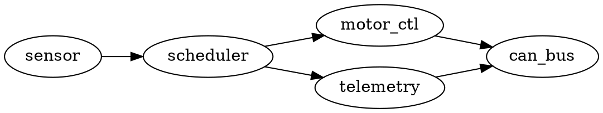

# 🔌 Мови опису розкладки: DOT, Mermaid, PlantUML

Коли кажуть «намалюй діаграму текстом», за цим стоїть не одна мова, а цілий клас мов, що народилися незалежно, у різні десятиліття й з різних потреб, — але виявилися разюче схожими всередині. Варто розібрати цей клас як одне ціле: побачити спільний кістяк, який робить їх усіх «одним видом пристрою», а тоді — де кожна відрізняється рогами й хвостом, тобто нішею, синтаксисом і рушієм. Три найпоширеніші представники — **DOT** (мова рушія Graphviz), **Mermaid** і **PlantUML**. Розберемо їх не як три окремі продукти, а як три діалекти однієї родини.

## Спільний кістяк: чому вони всі — один вид

Що робить DOT, Mermaid і PlantUML *одним класом*, а не трьома випадковими інструментами, які збіглися в назві? Три речі, і кожна випливає з попередньої.

Перше — **текст описує вузли й зв'язки, а не координати**. У всіх трьох ти пишеш «є вузол A, є вузол B, між ними стрілка». Ти ніде не кажеш «постав A в точку (120, 340)». Це і є суть: мова оперує *топологією* (гр. *tópos* — місце, *lógos* — вчення; тут — що з чим сполучене), а не геометрією. Синтаксис може бути `A -> B`, `A --> B` чи `A --|> B`, але зміст один: назви два вузли й проведи між ними ребро (англ. *edge* — ребро графа). Ти декларуєш структуру; де що лежатиме на площині — не твоя турбота.

Друге випливає прямо з першого — **розкладку рахує машина**. Якщо ти не назвав координат, хтось має їх обчислити. Це робить рушій розкладки (англ. *layout engine*): бере твій граф як набір вузлів і ребер і за своїм алгоритмом розставляє вузли так, щоб стрілки якомога менше перетиналися, а споріднені вузли стояли поруч. Для орієнтованих графів (де стрілки мають напрям) класичний підхід — пошарова розкладка: вузли розкладаються рівнями згори вниз так, щоб усі стрілки йшли переважно в один бік, а довжина ребер була найменша. Ти пишеш п'ять рядків зв'язків — рушій сам вирішує, що корінь стане вгорі, а листя внизу, і жоден вузол не наліз на сусіда.

Третє замикає ланцюг — **вихід є картинка у векторі чи растрі**. Рушій, порахувавши координати, віддає їх у формат, який показує браузер чи переглядач: найчастіше **SVG** (англ. *Scalable Vector Graphics* — масштабована векторна графіка, де фігури задані математично й не пікселяться при збільшенні), рідше **PNG** (растр — сітка пікселів). Тобто ланцюг завжди той самий: `текст → граф у пам'яті → розкладка → SVG/PNG`. Три ланки посередині сховані; ти торкаєшся лише крайніх — пишеш текст, дивишся картинку.

Ось цей кістяк наочно — той самий граф із чотирьох вузлів, записаний трьома мовами, і одна картинка, яку кожен рушій виростить із свого тексту:


*Один граф, три мови, та сама структура. Синтаксис різний — `->` у DOT, `-->` у Mermaid, `(a) --> (b)` у PlantUML, — але всі три кажуть те саме: чотири вузли й ребра між ними. Розкладку в кожному разі рахує рушій; автор не ставить жодної координати. Це і є те спільне, що робить їх одним класом мов.*

> 🔧 **Навіщо це.** Коли розумієш, що всі три мови — це «назви вузли, назви ребра, решту порахує рушій», ти перестаєш вивчати їх як три різні інструменти. Вивчив ідею раз — і будь-яку з них читаєш з ходу, а вибираєш не «яку зубрити», а «яка природно живе там, де я пишу»: у README на GitHub, у документі з UML чи як низькорівневий рушій під іншим інструментом.

## DOT: низькорівнева мова графа

DOT — найстаріший і найпростіший за задумом представник класу. Це мова рушія **Graphviz**, що народився в дослідницькому підрозділі AT&T (колишні Bell Labs): попередник з'явився близько 1988-го, а технічний звіт «Drawing graphs with dot» вийшов у вересні 1991-го (усталений факт). Ідея DOT гола до кістки: **опиши граф — вузли й ребра — а рушій намалює**. Жодних претензій на «типи діаграм», «нотації», «теми оформлення» — лише граф.

Мінімальний приклад — орієнтований граф прошивки, де давач живить планувальник, а той роздає час двом споживачам:



Розберімо синтаксис по кісточках, бо він задає взірець для решти. `digraph` (англ. *directed graph* — орієнтований граф) каже, що ребра мають напрям — стрілки, а не просто лінії; для неорієнтованого писали б `graph` і ребра `--`. Далі — сам список ребер: `a -> b` означає «стрілка від a до b». Вузол, який ще не оголошений окремо, народжується сам, щойно згаданий у ребрі, — тому явних оголошень вузлів тут нема, лише зв'язки. `rankdir=LR` (*rank direction, left-to-right* — напрям рангів, зліва направо) — це вказівка рушієві розкладати рівні горизонтально, а не згори вниз (типове `TB`, *top-to-bottom*). Оце `rankdir` — уже не про структуру, а натяк розкладці; про такі натяки — трохи згодом, бо саме тут ховається головна межа класу.

Що DOT робить *низькорівневим*? Те, що на ньому будують інші. DOT — це формат, зрозумілий рушієві Graphviz, а Graphviz — окрема програма, яку інші інструменти запускають у себе під капотом, щоб не писати власний алгоритм розкладки. Тобто DOT рідко пишуть руками для гарної документації; частіше його **генерують програмно** (інструмент аналізу залежностей будує граф модулів і випльовує `.dot`) або він працює невидимо як розкладковий рушій усередині чогось вищого. Сам по собі DOT — це «асемблер» світу діаграм-як-код: потужний, універсальний, але надто дослівний, щоб ним щодня писати архітектуру вручну.

> 🔧 **Навіщо це.** Якщо тобі треба намалювати граф, який *породжує* програма — дерево викликів, граф залежностей пакетів, кінцевий автомат зі згенерованого коду, — DOT часто найпряміший шлях: формат простий, генерувати його рядком легко, а Graphviz намалює будь-який розмір. Для рукописної діаграми в README він занизький; для машинно-згенерованого графа — саме те.

## Mermaid: діаграма живе прямо в тексті

Mermaid народився зовсім з іншої болі. Його створив шведський інженер Кнут Свейдквіст 2014 року — за легендою самого автора, після того як він загубив файл Microsoft Visio й вирішив, що діаграма має жити текстом, а не в пропрієтарному форматі, який можна втратити (правдоподібно, зі слів автора). Перша версія вміла рівно два типи діаграм — блок-схеми й діаграми послідовностей. Ключова риса Mermaid не в синтаксисі, а в *середовищі проживання*: він **написаний мовою браузера (JavaScript) і рендериться прямо там, де лежить текст**, — насамперед у Markdown.

Той самий потік прошивки мовою Mermaid:

```
graph LR
    sensor[Давач] --> sched[Планувальник]
    sched --> motor[Керування мотором]
    sched --> tlm[Телеметрія]
    motor -->|команди| can[Шина CAN]
    tlm -->|телеметрія| can
```

Синтаксис одразу впізнаваний як діалект того самого кістяка. `graph LR` — оголошення діаграми з напрямом розкладки зліва направо (як `rankdir=LR` у DOT, лише злите в перший рядок). `sensor[Давач]` — вузол з ідентифікатором `sensor` і людським підписом `Давач` у дужках; квадратні дужки дають прямокутну форму, круглі `(...)` — заокруглену, фігурні `{...}` — ромб рішення. Ребро — `-->`, з підписом на ньому через `-->|текст|`. Порівняно з DOT синтаксис трохи «солодший» — форми вузлів і підписи ребер вбудовані в саму мову, не треба окремих атрибутів.

Але справжня причина популярності Mermaid не в цукрі, а в тому, що **його розуміє GitHub прямо в тексті `.md`**. Пишеш блок ```` ```mermaid ```` у файлі README чи в описі пул-реквесту — і майданчик рендерить його як картинку, коли хтось відкриває сторінку. Ніякого окремого кроку «згенерувати SVG і вкласти»: діаграма народжується з тексту в момент перегляду, у браузері читача. Це робить Mermaid природним для документації, що живе в репозиторії поруч із кодом, — саме там, де діаграма-як-код найкорисніша. Ціна цього — Mermaid прив'язаний до світу браузера й Markdown; поза ним (у важкому UML-процесі, у складному кінцевому автоматі на сотні станів) він менш зручний, ніж інструменти, заточені під це.

> 🔧 **Навіщо це.** Для схеми в README прошивки — «як задачі ділять час, хто на якій шині говорить» — Mermaid майже завжди правильний вибір: пишеш п'ять рядків просто в тексті, і кожен, хто відкриє репозиторій на GitHub, бачить картинку без жодного інструменту. Правку архітектури видно в diff пул-реквесту як зміну рядка, а не як підмінений `.png`. Це найдешевший спосіб тримати діаграму живою поруч із кодом.

## PlantUML: коли треба саме UML-нотація

PlantUML розв'язує ще іншу задачу. Його випустив французький розробник Арно Рок 17 квітня 2009 року на SourceForge (усталений факт); поштовхом стало бажання генерувати повний набір діаграм UML із простого текстового опису — так само, як Javadoc генерує документацію з коментарів у коді. Тобто PlantUML із самого початку націлений не на «будь-який граф», а на **UML** (англ. *Unified Modeling Language* — уніфікована мова моделювання) — усталений набір нотацій для опису програмних систем: діаграми класів, послідовностей, компонентів, станів, розгортання, випадків використання.

Діаграма послідовності — де PlantUML сильний як мало хто — виглядає так:

```
@startuml
participant Давач
participant Планувальник
participant "Шина CAN" as CAN

Давач -> Планувальник : нове значення
Планувальник -> CAN : команда мотору
Планувальник -> CAN : пакет телеметрії
@enduml
```

Тут одразу видно, чим PlantUML відрізняється від двох попередніх. По-перше, обгортка `@startuml` … `@enduml` — маркери початку й кінця діаграми (зручно, бо PlantUML часто вкладають у коментарі коду, і маркери кажуть, де діаграма починається). По-друге — і головне — це **не просто граф**, а специфічна UML-нотація: `participant` оголошує учасника послідовності, а `A -> B : текст` малює не абстрактну стрілку, а *повідомлення* між учасниками з підписом, у семантиці саме діаграми послідовностей. Той самий синтаксис `A -> B` у діаграмі класів означав би вже інше — зв'язок між класами. PlantUML знає десятки таких нотацій, кожну зі своїми правилами й умовними позначеннями, узаконеними стандартом UML.

І ось цікавий місток назад до DOT, що показує спорідненість усього класу: **PlantUML для структурних діаграм (класи, компоненти, стани, розгортання) використовує саме Graphviz/DOT як рушій розкладки** (усталений факт — це задокументована залежність PlantUML). Тобто коли ти малюєш діаграму класів у PlantUML, під капотом він перетворює її на граф, віддає Graphviz, той рахує розкладку тим самим пошаровим алгоритмом, і PlantUML домальовує зверху UML-нотацію. (Сучасні версії вміють обходитися й вбудованим рушієм-портом, але класично стояли саме на DOT.) Це наочно підтверджує кістяк: PlantUML — це UML-нотація *поверх* того самого низькорівневого розкладкового рушія, що й DOT.

> 🔧 **Навіщо це.** Коли команда домовилася описувати систему в стандартній UML-нотації — бо так усі однаково читають діаграму класів чи станів, — PlantUML дає це текстом: канонічні позначення, які впізнає будь-хто знайомий з UML, але в git-придатному вигляді. Для кінцевого автомата прошивки (стани й переходи) чи діаграми послідовності протоколу це рідна нотація, а не саморобні прямокутники.

## Де природно живе кожна: одна ідея, три ніші

Спокуса питати «яка мова найкраща» веде в глухий кут, бо вони заповнюють різні ніші того самого кістяка. Правильніше — де кожна *природно живе*, а вибір випливає з місця, де ти пишеш, і що саме малюєш.


*Одна ідея «вузол → стрілка», три ніші. DOT / Graphviz — низькорівневий рушій розкладки: інші інструменти (зокрема PlantUML) часто будують картинку на ньому. PlantUML живе там, де потрібна саме стандартна UML-нотація. Mermaid — там, де діаграма має рендеритися прямо в Markdown, насамперед на GitHub. Різні поверхи одного класу, а не суперники.*

**DOT** живе на дні — як рушій, а не як мова для щоденного письма. Ним пишуть, коли граф *генерує програма* або коли потрібен саме Graphviz як розкладковий двигун усередині чогось вищого. Рукописної архітектури на DOT майже не пишуть — надто дослівно.

**Mermaid** живе у Markdown і на GitHub. Його ніша — легка діаграма, що має з'явитися прямо в тексті документації без окремого кроку генерації: README, опис пул-реквесту, вікі проєкту. Там, де важить «побачив у тексті — і одразу картинка», Mermaid поза конкуренцією саме через вбудовану підтримку майданчиків.

**PlantUML** живе там, де потрібна *стандартна UML-нотація*. Його ніша — команди й документи, що спираються на канонічні позначення UML: діаграми класів, станів, послідовностей, розгортання зі всіма умовними значками стандарту. Там, де Mermaid дав би приблизну схему, PlantUML дає нотацію, яку впізнає будь-хто знайомий з UML.

Ці ніші перекриваються — Mermaid уміє й діаграми послідовностей, PlantUML уміє й прості графи, — але центр ваги в кожної свій, і саме він диктує вибір. Питання не «яка потужніша», а «де я це пишу і яка нотація мені потрібна».

## Типові граблі класу: одні на всіх

Оскільки всі три стоять на одному кістяку, вони й спотикаються об одні й ті самі камені. Це граблі *класу*, а не окремого продукту, — знаєш їх для одної мови, впізнаєш у всіх.

Перші граблі — **боротьба з автоматичною розкладкою**. Це прямий наслідок головної переваги: розкладку рахує машина, отже, ти нею *не керуєш*. Рушій розставить вузли за своїм алгоритмом, і якщо тобі кров з носа треба, щоб один блок стояв саме зліва вгорі, а стрілка йшла саме отакою дугою, — почнеться війна з автоматом. У кожній мові є важелі-натяки: `rank=same` у DOT (примусити кілька вузлів на один рівень), напрям `LR`/`TB`, невидимі ребра, щоб підштовхнути порядок. Але це саме натяки — рушій може їх послухати або обійти по-своєму, бо його мета — несуперечлива розкладка загалом, а не твоя окрема забаганка. Практичний висновок: не воюй за піксель. Якщо композиція справді важлива (плакат, ілюстрація в статті), бери редактор із мишкою; діаграма-як-код виграє там, де важить свіжість і правда, а не мистецька розкладка.

Другі граблі — **нечитабельність великого графа**. Опиши текстом сотню вузлів — і будь-який рушій намалює павутину, у якій нічого не видно. Це фундаментальна межа автоматичної розкладки: алгоритм мінімізує перетини ребер, але з ростом графа перетинів стає стільки, що жодна розкладка не рятує. Пастка підступна тим, що *текст* лишається охайним — сто рядків `a -> b` виглядають організовано, — а картинка вже клубок. Ліки не в інструменті, а в дисципліні: багато **дрібних** діаграм замість однієї величезної, кожна на своєму рівні масштабу. Одна діаграма — одна думка, яку око охоплює за раз.

Треті граблі, тихіші, — **синтаксис оманливо простий, поки граф малий**. Три рядки будь-якою з мов пишуться за хвилину без документації. Але щойно треба підгрупи (англ. *subgraph* / кластери), підписи на ребрах, стилі, умовні форми вузлів — синтаксис розростається, і діалекти розходяться: те, що в Mermaid зветься `subgraph`, у DOT — `subgraph cluster_…`, у PlantUML — `package` чи `rectangle` залежно від типу діаграми. Тобто «одна ідея на всіх» тримається на простому рівні, а на складному кожна мова обростає своїми правилами, і знання однієї не переноситься дослівно.

І четверті, спільні з усім підходом діаграм-як-код, — **дрейф вкладеної картинки**. Якщо рушій не рендерить діаграму на льоту (як Mermaid на GitHub), а ти один раз згенерував `.svg` і вклав його в документ, то далі легко правити текст, забуваючи перегенерувати картинку. Тоді розходження між свіжим текстом і старою картинкою вертається чорним ходом. Це не вада мови — це вада процесу, і лікується вона не інструментом, а автоматичним гейтом у конвеєрі, який щоразу малює картинку з тексту й валить збірку при розходженні.

> 🔧 **Навіщо це.** Найдорожча помилка новачка — узяти діаграму-як-код туди, де потрібна точна композиція, і згаяти годину на боротьбу з рушієм за розташування блоку. Знаючи граблі класу наперед, ти одразу питаєш правильне: «мені тут важить свіжість чи розкладка?» і «граф лишиться дрібним?» — і або пишеш текст, або береш мишку, не витрачаючи час на інструмент, що не для цієї роботи.

## Що з цього випливає

Три мови, три десятиліття, три різні болі, з яких вони народилися, — а всередині один кістяк: текст називає вузли й ребра, машина рахує розкладку, на виході SVG чи PNG. DOT — низькорівневий рушій, на якому стоять інші; Mermaid — легка мова, що рендериться прямо в Markdown і на GitHub; PlantUML — стандартна UML-нотація поверх того самого розкладкового двигуна. Вони не суперники, а поверхи одного класу, і вибір між ними — це вибір ніші: де ти пишеш і яка нотація тобі потрібна. А граблі в них спільні, бо кістяк спільний: не воюй з автоматичною розкладкою, дроби великі графи на дрібні, пам'ятай, що простий синтаксис ускладнюється швидше, ніж здається, і не дай вкладеній картинці відстати від свого тексту.
