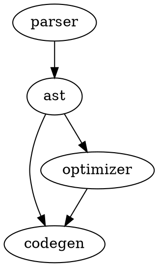
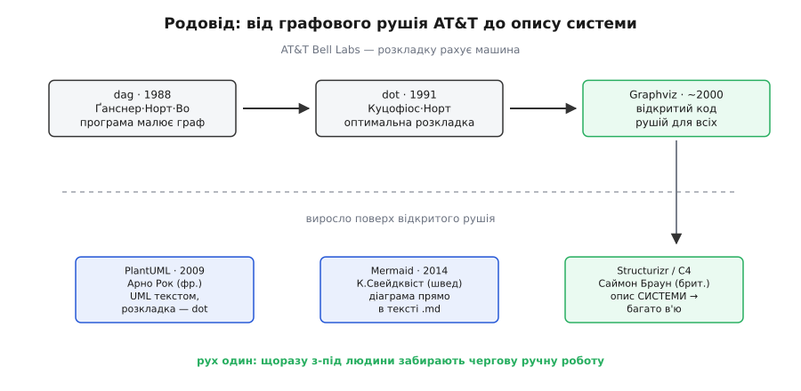

# 📜 Від розкладки графів до опису системи: як народилися мови діаграм-як-код

Історія цих мов — не історія малювання. Це історія того, як людину поступово прибирали з найнуднішої частини роботи: спершу з рахування, де поставити кожен вузол, а потім і з тримання в голові самої моделі системи. Дорога веде від наукового відділу телефонної компанії кінця 1980-х до шведа, який 2014-го спересердя згубив файл, — і на кожному кроці той самий рух: щоб картинка не брехала, її треба перестати малювати руками.

## Задача, з якої все почалося: граф, який годі розкласти руками

Уяви інженера-програміста середини 1980-х у дослідницькому підрозділі AT&T Bell Laboratories у Мюррей-Гілл, штат Нью-Джерсі. Bell Labs на той час — легендарна кузня: тут народилися транзистор, мова C, операційна система Unix. І тут же виникає прикра щоденна дрібниця: щоб зрозуміти велику програму, інженери малюють графи залежностей — хто кого викликає, який модуль на який спирається. Вузлів десятки, стрілок сотні. Намалювати такий граф руками так, щоб стрілки не сплелися в клубок, — праця на години, і після кожної зміни коду її треба повторювати наново.

Тут і ховається справжня суть, з якої виросло все інше. Людині легко сказати, **що з чим зв'язане**: модуль A кличе модуль B. Але сказати, **де саме на аркуші намалювати** A і B так, щоб уся сотня стрілок лягла читабельно, — задача не творча, а обчислювальна. Це задача на мінімізацію: розставити вузли по рівнях так, щоб стрілки здебільшого йшли згори вниз, були якнайкоротші й якнайменше перетиналися. Саме таку задачу машина розв'язує краще за людину — якщо їй пояснити, як.

І група дослідників взялася її пояснити машині. Першим на світ вийшов інструмент із простою назвою **dag** (англ. *directed acyclic graph* — орієнтований ациклічний граф, і водночас гра слів: dag — «кинджал»). Його описали Емден Ґанснер (Emden R. Gansner), Стівен Норт (Stephen C. North) і Кʼєм-Фонг Во (Kiem-Phong Vo) у статті «DAG — a program that draws directed graphs», що вийшла 1988 року в журналі *Software — Practice and Experience* (усталений факт). Уже сама назва статті — маніфест підходу: не «редактор, у якому людина малює графи», а «**програма, яка малює графи**». Людина дає структуру, машина дає розкладку.

> 🔧 **Навіщо це.** Той самий поділ праці живий і сьогодні в прошивці. Коли ти описуєш, як задачі RTOS передають одна одній повідомлення, ти кажеш лише «задача давача шле в чергу планувальника» — а де намалювати ці два прямокутники, хай рахує рушій. Ти витрачаєш увагу на **правду про систему**, а не на геометрію аркуша; і коли структура зміниться, тобі не доведеться перекладати прямокутники — досить переписати, хто кому шле.

## dot: коли розкладку віддали алгоритму

`dag` був початком, але канонічним рушієм, ім'я якого досі знають усі, став його спадкоємець — **dot**. Технічний звіт «Drawing graphs with dot» (номер 910904-59113-08TM) вийшов у вересні 1991 року за авторством Елефтеріоса Куцофіоса (Eleftherios Koutsofios) і Стівена Норта в AT&T Bell Laboratories (усталений факт — звіт зберігся з точним номером і датою). Куцофіос — грек за іменем; Во — вʼєтнамське імʼя; Ґанснер і Норт — американці. Варто це назвати точно, бо ці мови часто списують гуртом на «AT&T» чи «Bell Labs» як на безлику інституцію, а за ними стояли конкретні люди різного походження, і кожен вклав свою частину.

Повний, дозрілий опис алгоритму зʼявився трохи згодом — у статті «A Technique for Drawing Directed Graphs» (Ґанснер, Куцофіос, Норт, Во), надрукованій 1993 року в *IEEE Transactions on Software Engineering*, том 19(3), сторінки 214–230 (усталений факт). Ця стаття й досі — та сама книга, за якою вчаться писати рушії розкладки графів. У ній чотири проходи, і варто побачити їх бодай начорно, бо саме тут людину остаточно вивели з гри:

```
прохід 1 — ранги:   рознести вузли по горизонтальних рівнях так,
                    щоб стрілки йшли переважно згори вниз
                    (мережевий симплекс-метод мінімізує суму довжин стрілок)
прохід 2 — порядок:  переставляти вузли в межах рівня,
                    щоб стрілки якнайменше перетиналися
прохід 3 — коорд.:   дати кожному вузлу точні x-координати
прохід 4 — сплайни:  провести стрілки плавними кривими між вузлами
```

Дивись, що тут насправді відбулося. Уся ця машинерія — мінімізація довжини стрілок, зменшення перетинів, розведення координат — це рівно та робота, яку раніше людина робила мишкою, совгаючи прямокутники, доки не стане «гарно». Тепер її робить алгоритм, і робить оптимально, за кілька мілісекунд, скільки б разів ти не переписав граф. Мова DOT, якою ти описуєш вхід, лишилася майже такою ж простою, як задум:



П'ять рядків — і рушій сам вирішить, що `ast` стоятиме посередині, `parser` угорі, а `codegen` унизу, бо туди сходяться стрілки. Ти не сказав жодного слова про координати. Оце і є перший, фундаментальний зсув: **розкладку віддали алгоритму**.

Спершу `dot` жив усередині AT&T. Ширшу назву — **Graphviz** (Graph Visualization Software) — усе це отримало вже як пакет інструментів, і десь від 2000 року Graphviz став відкритим кодом (спершу під Common Public License) — усталено. Відкритість виявилася вирішальною: тепер будь-який інший інструмент міг узяти цей рушій розкладки задарма й побудувати щось своє поверх нього. І саме це сталося далі.


*Родовід від AT&T Bell Labs до відкритого рушія. Спершу `dag` (Ґанснер, Норт, Во, 1988) довів, що граф можна не малювати, а рахувати. Далі `dot` (Куцофіос, Норт, 1991) і повний алгоритм у чотири проходи (1993) зробили розкладку оптимальною. Відкривши Graphviz близько 2000-го, AT&T дала цей рушій усьому світу — і пізніші мови діаграм-як-код виросли вже на ньому.*

## PlantUML: діаграма ближче до людини, розкладка — усе ще від dot

Минуло майже два десятиліття. Розкладку графів машина вже вміла; лишалася інша незручність. `dot` чудово малює абстрактні графи «вузол-стрілка», але інженери-програмісти мислять конкретнішими фігурами: класами з методами, послідовностями викликів між обʼєктами, станами автомата — мовою UML (Unified Modeling Language). Малювати ці діаграми в редакторах на кшталт Rational Rose означало те саме совання прямокутників мишкою, від якого `dot` давно позбавив у світі простих графів.

2009 року французький розробник Арно Рок (Arnaud Roques) випустив **PlantUML** — перший реліз 17 квітня 2009-го (усталений факт). Ідея зухвало проста: описувати UML-діаграму текстом, а не малювати. Рядок за рядком ти кажеш, хто кому шле повідомлення, — і отримуєш готову діаграму послідовності:

```
@startuml
Давач    -> Планувальник : готові дані
Планувальник -> Мотор    : команда
Мотор    --> Планувальник : підтвердження
@enduml
```

Мотив у Рока був той самий, що жене всю цю історію: в agile-розробці документація й код розходяться, бо діаграми живуть окремими файлами в редакторі й ніхто їх не оновлює. Текст же лягає поруч із кодом — у той самий репозиторій, у ті самі коментарі й вікі. І тут ховається найкрасивіша деталь усього родоводу: **розкладку PlantUML доручає Graphviz** — тому самому `dot` з Bell Labs (усталено: PlantUML викликає Graphviz, щоб розставити елементи діаграм). Тобто Рок не винаходив розкладку заново. Він узяв двадцятирічний рушій AT&T, дав людині ближчу до неї мову — «класи й повідомлення» замість «вузли й стрілки» — а нудну геометрію віддав тому, хто її давно вмів. Написано PlantUML мовою Java, поширюється під GPL.

> 🔧 **Навіщо це.** Коли ти документуєш протокол обміну між польотним контролером і наземною станцією, діаграма послідовності — саме те, що треба: хто починає, хто відповідає, у якому порядку. Написати її в PlantUML — десяток рядків тексту в тому ж коміті, що й код обробника пакетів. Зміниш протокол — зміниш ці рядки поруч, і рецензент побачить нову послідовність на рев'ю, а не гадатиме, чи стара картинка ще правдива.

## Mermaid: коли діаграма зайшла прямо в текст, який ти й так пишеш

PlantUML розв'язав задачу для того, хто готовий поставити Java-рушій і хоча б трохи повозитися з інструментом. Але лишалася ще одна межа, і збив її не інженерний розрахунок, а звичайна життєва досада.

2014 року шведський архітектор програмного забезпечення Кнут Свейдквіст (Knut Sveidqvist) **згубив файл Microsoft Visio** — і саме ця прикрість стала іскрою (усталений факт за його ж свідченням). Думка, що зродилася зі спересердя, була така: якщо документація вже давно живе як текст у контролі версій, то чому діаграма має лишатися крихким бінарним файлом, який легко втратити й неможливо порівняти? Хай і діаграма буде текстом — прямо в тому ж Markdown, який розробники й так пишуть щодня. Так народився **Mermaid.js**. Назву, до речі, підказали не інженерні міркування, а «Русалонька», яку в ті дні дивилися його діти.

Перша версія 2014-го вміла всього два типи діаграм — блок-схеми й послідовності, — але несла нову якість. Мова навмисне зроблена такою простою, що читається майже як звичайний опис:

```
graph TD
    start[Скинути МК] --> init[Ініціалізація периферії]
    init --> loop{Є подія?}
    loop -->|так| handle[Обробити]
    loop -->|ні| idle[Сон]
    handle --> loop
    idle --> loop
```

Ключова зміна не в синтаксисі, а в тому, **де** ця діаграма живе. GitHub, GitLab, безліч вікі й генераторів документації навчилися малювати Mermaid **просто з тексту `.md`, без жодного окремого інструменту**. Ти пишеш ці рядки в описі пул-реквесту чи в README — і платформа сама показує картинку. Не треба ні ставити рушій, ні генерувати файл: діаграма стала таким самим громадянином тексту, як абзац чи блок коду. Поширюється Mermaid під MIT-ліцензією.

Це третій зсув у нашій історії. `dag` і `dot` прибрали людину з **розкладки**. PlantUML дав ближчу до інженера **мову**, лишивши розкладку рушію AT&T. Mermaid прибрав **сам інструмент**: діаграма тепер народжується там, де ти й так пишеш текст, і від опису її вже нічого не відділяє. Показово, що згодом ця сама простота дала несподіваний плід — граматику Mermaid надійно породжують і мовні моделі, бо вона близька до звичайного опису; але це вже наша сучасність, а не історія.

## C4 і Structurizr: остання межа — описувати не картинку, а систему

Досі, попри всі відмінності, DOT, PlantUML і Mermaid робили в глибині те саме: твій текст описував **одну конкретну картинку**. Рядок `A -> B` означав «намалюй стрілку від A до B ось на цій діаграмі». Хотів другу діаграму тієї самої системи з іншого боку — сідай і пиши другий, окремий опис. І тут причаїлася нова версія старої біди: тепер уже не картинка розходилася з кодом, а **три картинки однієї системи розходилися між собою**. Оновив контекстну діаграму — забув поправити діаграму контейнерів, і вони знову брешуть, тільки одна одній.

Корінь — той самий, що й на самому початку: **джерел правди більше, ніж одне**. І розв'язок той самий за духом: прибрати зайві. Тільки цього разу прибрати треба не мальовану картинку, а **множинність описів**.

Британський архітектор Саймон Браун (Simon Brown) підійшов до цього з іншого боку — не з боку інструмента, а з боку **моделі мислення**. Між 2006 і 2011 роками він виробив **модель C4** (усталений факт), виростивши її з коренів UML і моделі «4+1». Назва — це чотири рівні масштабу, на яких дивляться на систему: **C**ontext (контекст — система і її оточення), **C**ontainer (контейнери — застосунки й бази всередині), **C**omponent (компоненти всередині контейнера), **C**ode (код). Чотири «C» — чотири поверхи наближення, від супутникового знімку до вулиці.

І ось під цю модель Браун зробив інструмент — **Structurizr**, — який робить рішучий, останній у нашій історії крок. У Structurizr ти описуєш текстом **не діаграму, а саму систему**: які в ній є люди, які системи, які контейнери, хто з ким говорить. Це опис **семантики** (гр. *sēmantikós* — значеннєвий), а не геометрії. А далі рушій сам малює **багато різних діаграм з однієї моделі** — і контекст, і контейнери, і компоненти, усі гарантовано узгоджені, бо походять з єдиного джерела. Сам Браун назвав це «models as code» — **модель як код**, на відміну від просто «діаграм як код».

Порівняй два світи в одному погляді:

```
розкладка як код          модель як код
(DOT, Mermaid, PlantUML)  (Structurizr / C4)
────────────────────────  ────────────────────────
текст = одна картинка     текст = уся система
друга діаграма →          друга діаграма →
   пишеш другий текст        рушій малює з тієї ж моделі
ризик: картинки            ризик знято: одне джерело,
   розходяться між собою      усі в'ю узгоджені завжди
```

Це і є завершення дуги, яку ми пройшли. Дивись, як рівно вона лягає. Спочатку людину прибрали з **розкладки** — де саме поставити вузол (dag, dot). Потім дали ближчу до неї **мову** класів і повідомлень, лишивши розкладку старому рушію (PlantUML). Потім прибрали **сам інструмент** — діаграма зайшла в текст, який ти й так пишеш (Mermaid). І нарешті прибрали **множинність картинок**: тепер ти описуєш одну модель системи, а всі потрібні в'ю рушій вирощує з неї сам (C4 / Structurizr). Щоразу з-під людини забирали чергову ручну, невдячну роботу — і щоразу з тієї самої причини: усе, що людина мусить памʼятати оновити руками, вона рано чи пізно забуде оновити, і картина почне брехати.

Тому історія цих мов — не про те, як зручніше малювати. Вона про повільне, крок за кроком, **вигнання ручної праці з того місця, де вона неминуче породжує брехню**. Bell Labs почала з розкладки одного графа. Structurizr дійшла до опису цілої системи. А посередині — грек, американці й в'єтнамець в AT&T, француз із його UML-у в тексті, швед, що згубив файл Visio, і британець, що навчив описувати не картинку, а саму архітектуру. Кожен прибрав свою частину ручної роботи — і разом вони зробили так, щоб схема системи могла нарешті не відставати від самої системи.
