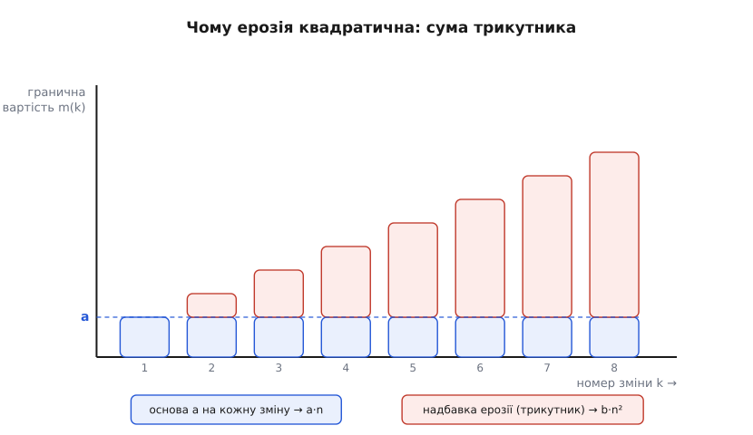

# 🧮 Економіка еволюційності: коли дисципліна окупається

Еволюційність — не безкоштовна. Шви, що дають зворотність, і фітнес-функції, що стережуть важливе, коштують праці наперед і трохи вповільнюють та ускладнюють код. Ерозія — теж не безкоштовна, тільки платять за неї пізніше й непомітно. Отже, це оборудка: заплатити відоме зараз чи невідоме потім. Питання, на яке має відповісти арифметика, одне — **за яких умов перша ціна менша за другу**. Ця вставка виводить відповідь із першопринципів: звідки береться квадратичний член ерозії, як точно порахувати межу окупності, чому дисконтування ховає ерозію від короткозорих і чому найглибша цінність зворотності — це цінність опціону, що росте з невизначеністю.

Домовмося про позначення відразу, щоб не плутатися далі. `n` — скільки змін система переживе за життя. `C₀(n)` — сукупна вартість цих змін **без** дисципліни, `C₁(n)` — **з** дисципліною. `a` — вартість однієї зміни в чистій структурі. `b` — коефіцієнт ерозії, `I` — разове вкладення в шви й фітнес-функції, `c` — гранична вартість зміни під дисципліною. Кожну з цих букв ми не постулюємо, а **виведемо** зі змісту.

## Звідки в ерозії береться квадрат

Почнімо з найважливішого й найменш очевидного: чому сукупна вартість змін без дисципліни росте **надлінійно**, а не просто пропорційно кількості змін. Відповідь — у механіці самої ерозії, тож [її](topic:programming/architecture-erosion) варто тримати перед очима: реальна структура коду поволі розходиться із задуманою під тиском дрібних поступок, і кожна поступка лишає слід.

Ось точна причина. Кожна зроблена зміна лишає по собі трохи безладу — протеклу абстракцію, зайве зчеплення, обхідний шлях «на швидку руку». Через цей осад наступна зміна коштує трохи більше: доводиться обходити чужий слід. Нехай кожна попередня зміна додає до вартості наступної сталу надбавку `ε` — це і є **темп ерозії**, наскільки один недбалий крок дорожчає всі майбутні. Тоді гранична вартість `k`-ї зміни — це базова вартість плюс податок від усіх `k − 1` попередниць:

```
    m(k) = a + ε·(k − 1)

    a — вартість зміни в чистій структурі (перша зміна: m(1) = a)
    ε — темп ерозії: надбавка від кожної попередньої зміни
```

Сукупна вартість `n` змін — це сума граничних вартостей усіх кроків. І щойно ми її запишемо, квадрат з'явиться сам:

```
    C₀(n) = Σ m(k),   k = 1…n
          = Σ [a + ε·(k − 1)]
          = a·n + ε·Σ (k − 1)
          = a·n + ε·(0 + 1 + 2 + … + (n − 1))
```

Лишилося скласти суму `0 + 1 + … + (n − 1)`. Це трикутне число, і його беруть давнім прийомом: складіть суму саму із собою у зворотному порядку. Перший доданок однієї копії (0) додається до останнього другої (n − 1), другий (1) — до передостаннього (n − 2), і так усі `n` пар дають однакове `n − 1`:

```
    2·(0 + 1 + … + (n − 1)) = n·(n − 1)
    ⇒  0 + 1 + … + (n − 1)  = n·(n − 1) / 2

    Отже:
    C₀(n) = a·n + ε·n·(n − 1) / 2
```

При скільки-небудь довгому житті `n` велике, тож `(n − 1) ≈ n`, і форма спрощується до чистого квадрата. А тепер найважливіший крок — **дамо коефіцієнту при `n²` ім'я**:

```
    C₀(n) ≈ a·n + (ε/2)·n²

    Позначмо  b ≡ ε/2:
    C₀(n) = a·n + b·n²
```

Ось воно. Квадратичний член ерозії — не підігнаний зі стелі коефіцієнт, а **неминучий наслідок** того, що гранична вартість зміни росте лінійно з кількістю попередніх змін. А `b` тепер має точний зміст: це **половина темпу ерозії**. Лінійний член `a·n` — це праця, яку ти заплатив би й у чистій системі; квадратичний `b·n²` — це чистий податок безладу, площа трикутника над базовою лінією.


*Кожна зміна коштує базове `a` (синя основа) плюс надбавку від усіх попередніх (червоний ковпак). Основи складаються в лінійне `a·n`; надбавки складаються в трикутник, і його площа — це рівно `b·n²`. Квадрат — не припущення, а форма трикутника.*

> 🔧 **Навіщо це.** Побачивши, що ерозія квадратична, перестаєш дивуватися, чому «раптом» усе стало погано. Лінійне зростання відчувається як рівномірне навантаження; квадратичне довго здається дрібницею, а тоді за короткий час вибухає. Система, у якій `b·n²` роками ховалося за `a·n`, у якийсь момент переходить межу, де податок безладу переганяє корисну працю, — і команда відчуває це як обвал швидкості, хоч жодна окрема зміна не була великою.

Тепер запишімо другий світ — із дисципліною. Її суть у тому, що вона б'є саме в `ε`. Фітнес-функція ловить кожну протеклу залежність у мить, коли її внесли, тож безлад **не накопичується**: `ε → 0`, надбавка зникає, гранична вартість лишається сталою. За це платять двічі. Разове вкладення `I` — написати шви й фітнес-функції на старті. І невеличкий сталий податок на кожну зміну — тримати шов, ганяти перевірку, — тож гранична вартість тепер `c`, трохи більша за `a`, зате **без росту**:

```
    C₁(n) = I + c·n

    I — разове вкладення (шви + фітнес-функції), платиться на старті
    c — гранична вартість зміни під дисципліною, стала (квадрата немає)
```

Уся різниця між світами — у формі: `C₀` має квадрат, `C₁` — ні. Сота зміна під дисципліною коштує стільки ж, як перша; без дисципліни — у рази більше.

## Точка окупності: розв'язуємо відносно n

Дисципліна стартує з боргу `I` й далі йде положе; ерозія стартує з нуля, але загинається вгору. Отже, десь вони перетинаються — і саме там дисципліна починає окуповуватися. Знайдімо це `n*`, прирівнявши сукупні вартості:

```
    C₀(n*) = C₁(n*)
    a·n + b·n² = I + c·n
```

Зберімо все в один бік — і отримаємо звичайне квадратне рівняння відносно `n`:

```
    b·n² + (a − c)·n − I = 0
```

Розв'язуємо за формулою коренів квадратного рівняння; фізичний сенс має лише додатний корінь:

```
    n* = [ (c − a) + √( (c − a)² + 4·b·I ) ] / (2·b)
```

Це загальна відповідь. Але вона проясниться, якщо взяти найпростіший і найчастіший випадок: сталий податок дисципліни малий проти ерозії, тож `c ≈ a`. Тоді `(c − a) = 0`, лінійні члени скорочуються, і лишається прозоре ядро:

```
    Якщо c = a:
    b·n² = I
    n²   = I / b
    n*   = √( I / b )
```

Підставмо числа з наскрізного прикладу — `a = 1`, `c = 1`, `b = 0.03`, `I = 8`:

```
    n* = √( 8 / 0.03 ) = √266.7 ≈ 16.3
```

Читається це прямо: якщо система за життя переживе **менше ніж ~16 змін**, дисципліна не окупиться — вона лише додасть витрат. Рекламний лендинг на два тижні робити еволюційним безглуздо: він не проживе стільки, щоб віддати вкладене. Але якщо система переживе **сотні** змін — а ядро живого продукту переживає тисячі, — квадрат бере гору беззастережно. Порахуймо розрив при `n = 500`:

```
    ерозія без дисципліни:  b·n² = 0.03 · 500² = 0.03 · 250000 = 7500
    вкладення в дисципліну:  I = 8
```

Сім із половиною тисяч проти вісьмох. За горизонтом окупності дисципліна економить не відсотки — **порядки**.

## Чутливість n* до темпу ерозії та вкладення

Саме число `16.3` менш цінне, ніж **як** воно рухається, коли міняється світ. Формула `n* = √(I / b)` компактна, тож її чутливість зчитується елегантно — через логарифм, бо він перетворює показники степеня на нахили:

```
    n* = I^(1/2) · b^(−1/2)
    ln n* = ½·ln I − ½·ln b
```

Коефіцієнти `+½` і `−½` — це **еластичності**: на скільки відсотків зрушить `n*` за один відсоток зміни входу.

```
    ∂ ln n* / ∂ ln I = +½    · учетверо більше I  →  удвічі більший n*   (√4 = 2)
    ∂ ln n* / ∂ ln b = −½    · удвічі більший темп ерозії  →  n* менший у √2 разів
```

Розгорнімо це в числа. Спершу — чутливість до **темпу ерозії** `b` (при `I = 8`):

```
    b = 0.01 → n* = √800   ≈ 28.3    повільна ерозія — дисципліна окупається пізно
    b = 0.03 → n* = √266.7 ≈ 16.3
    b = 0.05 → n* = √160   ≈ 12.6
    b = 0.10 → n* = √80    ≈  8.9
    b = 0.20 → n* = √40    ≈  6.3    швидка ерозія — окупається майже одразу
```

Тепер — чутливість до **вкладення** `I` (при `b = 0.03`):

```
    I =  2 → n* = √66.7   ≈  8.2     дешева дисципліна — окупається рано
    I =  8 → n* = √266.7  ≈ 16.3
    I = 18 → n* = √600    ≈ 24.5
    I = 32 → n* = √1066.7 ≈ 32.7     (I×4 від 8  →  n* удвічі: 16.3 → 32.7)
    I = 50 → n* = √1666.7 ≈ 40.8
```

Обидва стовпчики кажуть одне практичне слово. У домені, де зчеплення легко розповзається — багато команд, тісні контракти, спільна база даних, — `b` більший, тож окупність настає **раніше**: квадрат б'є швидко, і дисципліна виправдовує себе вже за десяток змін. А чим важча сама машинерія дисципліни — складні шви, крихкі цілісні фітнес-функції, — тим більше `I`, і тим **пізніше** вона окупиться. Звідси два висновки в один голос: еволюційність закладають **дозовано** (під очікуваний вік × темп змін) і **дешево** (легкими швами, простими перевірками), бо роздута машинерія `I` відсуває окупність за горизонт життя системи. Корінь квадратний милосердний до `b`, але й до `I`: подвоїти вартість дисципліни — це не подвоїти поріг, а лише помножити його на `√2`; проте й економити на ерозії треба, бо кожне зменшення `b` відсуває окупність угору так само за коренем.

## Дисконтування: витрата завтра легша за витрату сьогодні

Досі ми додавали витрати так, ніби гривня, витрачена на соту зміну через п'ять років, важить стільки ж, як гривня сьогодні. Це неправда. Майбутня витрата коштує менше вже тому, що її можна відкласти, а гроші тим часом працюють. Щоб порівнювати чесно, майбутні витрати зводять до **теперішньої вартості** (present value), дисконтуючи їх множником

```
    v = 1 / (1 + r)
```

де `r` — ставка за один період (тут природний період — інтервал між змінами). Витрата `m` через `t` періодів коштує сьогодні `m · vᵗ`. Тепер обидва потоки — теперішньою вартістю:

```
    PV₀(n) = Σ [a + ε·(t − 1)] · vᵗ,   t = 1…n     (без дисципліни)
    PV₁(n) = I + Σ c · vᵗ,             t = 1…n     (з дисципліною; I платиться зараз, t = 0)
```

Для системи, що живе довго, найчистіша — границя `n → ∞`. Знадобляться дві суми спадної геометричної прогресії (`0 < v < 1`); друга — «арифметико-геометрична», бо її члени `t·vᵗ` ростуть лінійно, а гаснуть геометрично:

```
    Σ vᵗ    = v / (1 − v)   = 1 / r
    Σ t·vᵗ  = v / (1 − v)²  = (1 + r) / r²
```

(Легко перевірити перехід: `1 − v = r/(1+r)`, тож `v/(1−v) = 1/r`.) Нам потрібна комбінація `Σ (t − 1)·vᵗ` — віднімемо одну суму від другої:

```
    Σ (t − 1)·vᵗ = (1 + r)/r² − 1/r = (1 + r − r)/r² = 1 / r²
```

Підставмо в потоки — і отримаємо разюче прості вирази для теперішньої вартості нескінченного життя:

```
    PV₀(∞) = a·(1/r) + ε·(1/r²) = a/r + ε/r²
    PV₁(∞) = I + c·(1/r)        = I + c/r
```

Погляньте на член ерозії: `ε/r²`. Той самий квадрат, що в `C₀` стояв на `n²`, тепер стоїть на `1/r`. Величина `1/r` грає роль **ефективного горизонту** `N_eff` — скільки змін уперед організація реально «бачить» крізь власне дисконтування. Терпляча організація (мале `r`) має довгий горизонт, і ерозія в квадраті б'є на повну. Короткозора (велике `r`) має горизонт куций — а ерозія накопичується **пізно**, у дорогих останніх змінах, які дисконтуються найдужче. Тому дисконтування **ховає** ерозію: робить її на вигляд дешевшою, ніж вона є.

Прирівнявши теперішні вартості (при `c = a`), знайдемо не поріг у змінах, а **порогову ставку** — таку короткозорість, за якої дисципліна перестає окуповуватися:

```
    a/r + ε/r² = I + c/r
    ε/r² = I
    r* = √( ε / I ) = √( 2b / I )

    З числами (ε = 2b = 0.06, I = 8):
    r* = √(0.06 / 8) = √0.0075 ≈ 0.087 = 8.7 % за зміну
```

Нижче `r*` дисципліна окуповується; вище — ні. Перевірмо обидва береги на тих самих параметрах.

```
    Терпляча організація, r = 2 %:
        PV₀ = 1/0.02 + 0.06/0.02² = 50 + 150 = 200
        PV₁ = 8 + 1/0.02          =  8 +  50 =  58
        дисципліна економить  200 − 58 = 142

    Короткозора організація, r = 15 %:
        PV₀ = 1/0.15 + 0.06/0.15² = 6.67 + 2.67 =  9.33
        PV₁ = 8 + 1/0.15          = 8    + 6.67 = 14.67
        тепер PV₀ < PV₁ — у теперішній вартості дисципліна ПРОГРАЄ (9.33 проти 14.67)
```

Ось де ховається пастка. За ставки 15 % на зміну ерозія — переважно далеке, важко дисконтоване майбутнє — так і не переростає разового `I`, і формально короткозорій організації **раціонально** не вкладатися в еволюційність. Але її горизонт майже завжди відчутно коротший за справжній вік системи: те, що «через п'ять років і так перепишемо», живе п'ятнадцять. Ерозія — це відкладене зобов'язання, борг, чиї відсотки набігають тихо й спливають пізно, а дисконтування — лінза, крізь яку його не видно. Саме тому короткозорість системно **недоінвестує** в структуру: не тому, що арифметика бреше, а тому, що в неї підставляють занижений горизонт.

## Зворотність як реальний опціон

Уся модель окупності досі мовчки припускала, що всі `n` змін ми зробимо **напевно**. Але найглибша цінність шва — не в економії на зміні, яку точно внесемо, а в праві **передумати**, коли ще не знаємо, чи вона знадобиться й якою буде. Це право має ім'я з фінансів: опціон. І воно перекидає місток до розрізнення [зворотних і незворотних рішень](topic:programming/reversible-irreversible-decisions): однобічні двері дорогі до відкату, двобічні — дешеві, і саме дешевина відкату робить рішення відкладним.

Термін «реальний опціон» увів Стюарт Маєрс 1977 року (Stewart C. Myers, «Determinants of Corporate Borrowing», *Journal of Financial Economics*), перенісши логіку фінансових опціонів на рішення про реальні активи — це усталений факт історії фінансів. Аналогія точна: незворотне рішення — це **виконаний** опціон (обрав базу, впаяв її в код — назад ходу нема), а тримати рішення відкритим — це **тримати** опціон (платиш за право обрати пізніше, коли невизначеність розсіється). Ламається аналогія хіба там, де фінансовий опціон має чітку дату й ціну виконання, а архітектурний — розмиту; але математика цінності переноситься майже дослівно.

Зробімо цінність очікування точною — і побачимо, від чого вона залежить. Хай є два варіанти вибору (скажімо, база `A` чи `B`) і два майбутні стани світу — «навантаження мале» й «навантаження велике», кожен з імовірністю `½`. У різних станах виграє різний вибір. Порівняймо дві стратегії:

```
    Рішення ЗАРАЗ (стан ще не відомий):
        береш варіант із більшою СЕРЕДНЬОЮ віддачею й лишаєшся з ним в обох станах
        віддача = max_вибір  E[віддача]

    Рішення ПОТІМ (стан уже видно):
        у кожному стані береш найкраще саме для нього
        віддача = E[ max_вибір  віддача ]

    Цінність опціону — різниця:
        V_опціон = E[max] − max E  ≥  0
```

Чому ця різниця невід'ємна? Бо `max` по стану ніколи не гірший за будь-який наперед зафіксований вибір: `max(X, Y) ≥ X` і `≥ Y` в **кожному** стані, тож і в середньому `E[max] ≥ max(E)`. Це окремий випадок **нерівності Єнсена** (данський математик Йоган Єнсен, 1906): для опуклої функції `f` справджується `f(E[X]) ≤ E[f(X)]`, а `max` — саме опукла функція. І — ось що тут головне — «зазор Єнсена» `E[f(X)] − f(E[X])` тим ширший, чим дужче розкидані виходи. Отже, **цінність опціону росте з невизначеністю**. Побачмо це на числах:

```
    Малий розкид:    A: 100 / 40     B: 40 / 100
        E[A] = E[B] = ½·100 + ½·40 = 70        ⇒  max E = 70
        E[max] = ½·max(100,40) + ½·max(40,100) = ½·100 + ½·100 = 100
        V_опціон = 100 − 70 = 30

    Великий розкид:  A: 130 / 10     B: 10 / 130       (розкид удвічі ширший)
        E[A] = E[B] = ½·130 + ½·10 = 70        ⇒  max E = 70
        E[max] = ½·130 + ½·130 = 130
        V_опціон = 130 − 70 = 60
```

Розкид подвоївся — цінність опціону подвоїлася. Зверніть увагу: **середні не змінилися** (обидва вибори дають 70 в обох сценаріях), а вартість права зачекати зросла вдвічі. Платить не рівень віддачі, а її невизначеність.

![Дві панелі — мала й велика невизначеність; у кожній стовпець «вирішити зараз» заввишки max E = 70 і стовпець «зачекати» заввишки E[max], зелений ковпак над спільною основою — цінність опціону; за більшого розкиду зелений ковпак удвічі вищий](img/option-value.svg)
*Стовпець «зачекати» вищий за «вирішити зараз» рівно на цінність опціону — зелений ковпак `E[max] − max E`. Середні віддачі однакові в обох панелях, а ковпак праворуч удвічі вищий: ширший розкид виходів робить право почекати дорожчим.*

Це рівно той закон, за яким живуть фінансові опціони: їхня ціна росте з волатильністю `σ` базового активу — модель Блека–Шоулза–Мертона (Fischer Black, Myron Scholes, Robert Merton, 1973, теж усталений факт). Причина спільна й тримається на асиметрії віддачі: увесь виграш від сприятливого стану твій, а збиток обмежений втраченою премією. Що ширший розкид, то жирніший хвіст, з якого опціон збирає, а обмежений знизу збиток його не з'їдає. У коді «волатильність» — це наша непевність щодо вибору: чим менше ми знаємо, чи витримає провайдер, чи ляже його модель у наші дані, то дорожчий шов, що лишає вибір відкритим. Це і є кількісний бік [ухвалення рішень під невизначеністю](topic:programming/deciding-under-uncertainty): невизначеність не караєш передбаченням, а обертаєш на вартість — і платиш за право не вгадувати.

Тепер обидві половини вставки сходяться. Вкладення `I` з моделі окупності — це не лише амортизована економія на майбутніх змінах; це **премія за портфель опціонів**. Кожен шов — один опціон: право поміняти вибір пізніше, вартий свого `E[max] − max E`. Отже, дисципліна окуповується, коли сума цінностей опціонів перевищує сплачену премію:

```
    Σ V_опціон  >  I
```

А що `V_опціон` росте з невизначеністю, цей поріг може виконатися **навіть за меншого числа змін, ніж наївний `n*`**. Лічба змін із перших розділів не бачить невизначеності й тому **занижує** цінність шва: `n*` — це підлога для світу без сюрпризів. Реальний, непевний світ підіймає цінність тих самих швів, тож дисципліна виправдовує себе там, де суха лічба ще сказала б «зарано».

## Останній відповідальний момент — межа виконання опціону

Лишилося звести кінці. Тримати опціон теж не безкоштовно: поки рішення відкрите, ти платиш вартість утримання (carrying cost) — тримаєш обидва шляхи живими, будуєш за швом, відкладаєш вигоду від остаточного вибору. Ця вартість зволікання з часом **росте**. А цінність очікування — навпаки, **падає**: що довше чекаєш, то менше невизначеності лишилося розсіяти, то тонший зазор `E[max] − max E`.

Дві криві, що йдуть назустріч, мають одну точку перетину — і саме вона оптимальна.


*Цінність зачекати спадає з часом (невизначеності меншає), а вартість зволікання росте. Точка їх перетину — остання мить, коли рішення ще можна відкласти без чистих утрат: ліворуч вигідно тримати опціон, праворуч — виконувати.*

Оптимум — там, де гранична цінність ще-трохи-зачекати зрівнялася з граничною вартістю цього очікування. Раніше за цю мить чекати вигідно (дізнаєшся більше, ніж утрачаєш); пізніше — чистий збиток. Ця точка перетину і є [останній відповідальний момент](topic:programming/last-responsible-moment): остання мить, коли рішення ще можна відкласти без утрат. До неї — тримай опціон; на ній — виконуй, тобто обирай. Формально це **межа виконання**, як в американському опціоні, що його тримають рівно доти, доки право чекати коштує більше за плату за це чекання.

Три розділи цієї вставки — три лінзи на одну й ту саму оборудку. **Лічба** (`n*`): вкладайся, коли змін за життя більше, ніж `√(I/b)`. **Час** (`r*`): вкладайся, коли твій справжній горизонт `1/r` досить довгий, щоб задня, дисконтована ерозія встигла вкусити. **Невизначеність** (`Σ V_опціон`): вкладайся, коли непевність вибору робить право передумати дорожчим за шов. Усі три кажуть те саме різними словами — заплати відому премію зараз, щоб накрити невідоме, зростаюче, відкладене зобов'язання. Зворотність — це **як** ти купуєш накриття; автоматична перевірка важливого — **як** не даєш зобов'язанню рости; а останній відповідальний момент — це **коли** перестаєш доплачувати за право чекати.
