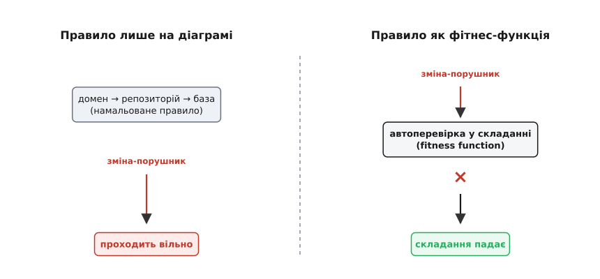

# Фітнес-функції

<preknowlist>
- [Якісні атрибути («-ilities»)](book:programming/quality-attributes) — нефункціональні властивості системи (продуктивність, доступність, змінюваність, безпека), що вирішують її долю не менше за самі функції.
- [Сценарії атрибутів](book:programming/attribute-scenarios) — як розмиту вимогу («має бути швидко») перетворюють на конкретне вимірне твердження з числовою мірою.
- [CI/CD](book:programming/ci-cd) — конвеєр, що на кожну зміну сам збирає, перевіряє й проганяє тести; місце, де фітнес-функції живуть.
</preknowlist>

Уявіть архітектурну діаграму на стіні. Домен звертається до бази лише через репозиторій; жоден модуль не залежить від того, що над ним; час відповіді — під 200 мілісекунд. А тепер питання: що фізично станеться, коли втомлений розробник о шостій вечора проведе стрілку в обхід — зверне з домену просто до бази, аби «на швидку руку» полагодити зламане? Нічого. Діаграма про це не дізнається й нічим не заперечить. Правило, яке нікому не заважає його порушити, — не правило, а побажання. Тому більшість архітектурних намірів тихо помирають: не через хибність, а через те, що не мали способу себе захистити.

Фітнес-функція (англ. *fitness function*; корінь — лат. *fit*, придатний) відповідає рівно на це. Вона перетворює архітектурне правило з малюнка на стіні на **виконуваний код, який падає, щойно правило порушено**. Не «домен не повинен звертатися до бази» як побажання, а автоматична перевірка, що зупиняє складання тієї ж миті, коли хтось таки звернувся. Правило перестає покладатися на людську пам'ять і починає покладатися на машину — а вона не втомлюється й не робить винятків о шостій вечора.


*Та сама зміна-порушник у двох світах. Правило-побажання на діаграмі вона проходить наскрізь; правило, зроблене фітнес-функцією, її зупиняє. Уся різниця в тому, що друге вміє сказати «ні» без участі людини.*

## Що це насправді означає

Складімо точне означення: **фітнес-функція — це автоматична, об'єктивна перевірка архітектурної характеристики системи**. Кожне слово несе вагу.

**Автоматична** — її проганяє машина сама, на кожну зміну, бо архітектуру псують не рідкісні великі рішення, а потік дрібних щоденних правок, за яким людське око не встигає. **Об'єктивна** — дає однозначну відповідь незалежно від того, хто й у якому настрої дивиться: «код гарний» суб'єктивне, «жоден файл домену не тягне заголовок із теки бази» — ні. А головне слово — **архітектурної характеристики**: тут і проходить межа між фітнес-функцією та звичайним тестом. Звичайний тест перевіряє поведінку — чи правильно порахована сума замовлення. Фітнес-функція перевіряє [якісний атрибут](book:programming/quality-attributes) — властивість системи як цілого: чи не порушено шари, чи вкладається час відповіді в бюджет. Це рівно те, за що відповідає архітектор, — і фітнес-функція робить цю властивість, яку раніше можна було тільки обговорювати, вимірною і захищеною.

## Правило як тест, що падає

Найдешевший і найпоширеніший різновид — перевірка структурного правила. Візьмімо те саме: домен не сміє знати про шар доступу до бази. Поки воно живе в чиїйсь пам'яті, його зметуть за перший аврал. Зробімо його виконуваним: пройтися вихідними файлами домену, зібрати їхні залежності й переконатися, що жодна не веде в теку бази.

:::tabs
```cpp
// Фітнес-функція як тест, що падає, коли правило порушено:
// жоден файл домену не тягне заголовок із шару бази.
TEST(ArchFitness, DomainDoesNotDependOnDb) {
    for (const std::string& inc : scan_includes("src/domain"))
        EXPECT_FALSE(starts_with(inc, "db/"))
            << "Порушено шар: домен тягне " << inc;
}
```
```java
// Той самий намір мовою ArchUnit — тест падає, коли правило порушено.
@AnalyzeClasses(packages = "com.example")
class ArchFitnessTest {
    @ArchTest
    static final ArchRule domainDoesNotDependOnDb =
        noClasses().that().resideInAPackage("..domain..")
            .should().dependOnClassesThat().resideInAPackage("..db..");
}
```
:::

Погляньте, що сталося з правилом. Воно було рядком у документі, який ніхто не перечитує, — і стало умовою, без якої складання не проходить. Розробник, що о шостій вечора спробує звернути з домену просто до бази, далі не пройде: тест упаде й прямо назве файл-порушник. Ніякого рев'ю, ніякої надії на чужу пильність — правило захищає себе саме. Аналіз залежностей як тест настільки корисний, що під нього є готові бібліотеки — ArchUnit для Java та її аналоги; але суть від інструмента не залежить.

## Де вони живуть і чому саме там

Фітнес-функції бувають різні, бо різні атрибути стережуться по-різному. Структурне правило видно прямо в коді, тож його перевіряють статично, у момент складання. А час відповіді видно тільки на живій системі під навантаженням — тож його стереже не тест складання, а неперервний монітор, що весь час дивиться на 95-й перцентиль часу відповіді й б'є на сполох, щойно той вилізе за бюджет. Але дім більшості з них один — конвеєр [CI/CD](book:programming/ci-cd): те місце, крізь яке однаково проходить кожна зміна. Поставити там фітнес-функції означає перегородити шлях кожної зміни **воротами**: порушила шар — не пройшла; просадила час відповіді на стенді — не пройшла. Так архітектурні правила дістають ту саму невблаганну частоту, що й звичайні тести. А частота тут і є вся сила: перевірка, яку згадують раз на місяць уручну, майже даремна, бо між прогонами порушень накопичиться стільки ж, скільки й без неї.

І число `200` в бюджеті не з повітря — воно приходить зі [сценарію атрибута](book:programming/attribute-scenarios), де хтось відповідальний вирішив, яка швидкість потрібна бізнесу. Фітнес-функція не вигадує вимог; вона робить уже ухвалені вимоги невблаганними.

## Ціна, яку теж треба бачити

І тут — обов'язкова чесність. Фітнес-функція теж код: її пишуть, тримають в актуальному стані й проганяють на кожному складанні. Найгірше, що з нею може статися, — **вона починає брехати**. Недоглянута перевірка, що час від часу падає без справжньої причини, швидко привчає команду себе ігнорувати: «а, це знову той нестабільний тест, просто перезапусти». Тоді вона перетворюється на шум і навіть гірше — на оманливе відчуття захищеності: усі думають, що межу стережуть, а сторож давно спить. Зелене складання, якому не можна вірити, гірше за відсутність перевірки, бо присплює пильність.

> 🔧 **Навіщо це.** Заводьте фітнес-функцію тоді, коли можете назвати конкретну важливу властивість, конкретний спосіб її зламати й реальну ціну поломки. «Домен не тягне базу, бо інакше за рік розплутуватимемо місяцями» — годиться. «Усі класи мають закінчуватися на іменник» — причіпка, що коштуватиме супроводу більше, ніж дасть користі. Сила інструмента — стерегти небагато по-справжньому важливих меж невблаганно, а не всі підряд абияк.

Тому по суті фітнес-функція змінює одне: **де живе довіра до архітектури**. Доти вона трималася на людській пам'яті й пильності — ресурсі, що випаровується з кожною зміною в команді й кожним втомленим вечором. Фітнес-функція переносить довіру з людей на машину, яка не забуває й не робить винятків о шостій вечора. Архітектурне рішення перестає бути малюнком, що виживає рівно доти, доки його пам'ятають, і стає живою межею, яку система стереже сама. Не «ми домовилися так робити», а «інакше складання не пройде».
