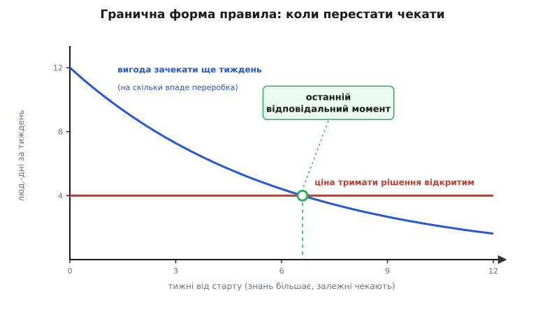
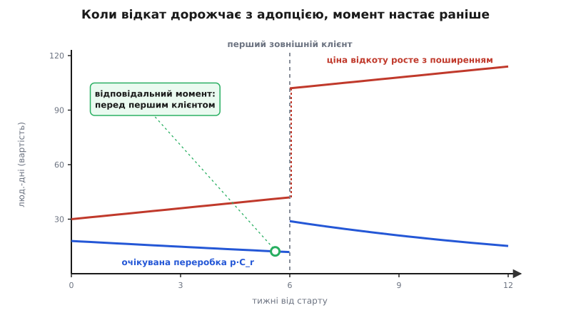
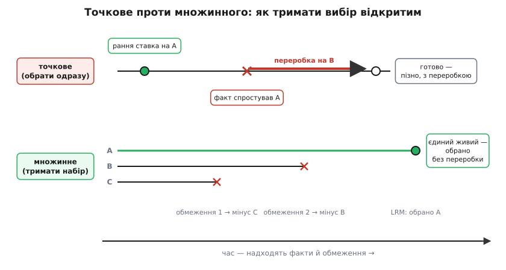

# Останній відповідальний момент

<preknowlist>
- [Зворотні й незворотні рішення](topic:programming/reversible-irreversible-decisions) — чому одні рішення відкочуються за годину, а інші «замуровують» систему; вартість відкоту як окрема вісь.
- [Рішення під невизначеністю](topic:programming/deciding-under-uncertainty) — як діяти, коли фактів бракує, а вибір робити доводиться.
- [Архітектурні драйвери](topic:programming/architectural-drivers) — що саме робить рішення значущим: вимоги, обмеження, якісні атрибути.
- [Ризик-мислення](topic:programming/risk-thinking) — ризик як добуток ймовірності на вплив; очікувана вартість як спосіб порівнювати непевні результати.
</preknowlist>

Ти будуєш сервіс, і треба зафіксувати формат, у якому клієнти шлють замовлення на сервер. Можна зробити це першого ж тижня — накидати JSON, поки ще нічого не працює. А можна зачекати, доки крізь систему пройде десяток реальних сценаріїв, і стане видно, які поля справді потрібні, які повторюються, де бракує версіонування. Обидва варіанти «фіксують формат». Але ранній має ваду, яку не видно в перший тиждень і дуже видно на пів року: щойно на цей формат сів перший зовнішній клієнт, змінити його вже не можна без того, щоб зламати всіх, хто на нього покладається. Ранній вибір спирався на найменший обсяг знань, який ти взагалі мав, — а розплачуватися за нього довелося тоді, коли він став найдорожчим до відкоту.

Ось у проміжку між «можна вже» і «пізніше буде видно точніше» живе поняття, яке архітектори програм запозичили з ощадливого будівництва: **останній відповідальний момент** (англ. *last responsible moment*, LRM; слово «відповідальний» — від лат. *respondere*, «відповідати»: це момент, на який мусиш дати відповідь). Його часто переказують як «вирішуй якомога пізніше» — і це переказ, що вбиває саму ідею. Насправді LRM — не про пізно й не про відкладання. Це про **точку**, у якій зволікати далі означає втратити щось цінне, і тому саме на ній треба вирішувати рішуче. Уся стаття — про те, як цю точку **порахувати**, а не вгадати настроєм; що її зсуває раніше чи пізніше; і чому «нічого не вирішувати» — це теж рішення, зазвичай найгірше.

## Момент — це задача про оптимальну зупинку

Щоб перестати сперечатися про LRM гаслами, треба побачити, яка задача під ним ховається. У кожну мить проєкту ти тримаєш **опціон** (лат. *optio*, «вільний вибір») — право зафіксувати рішення зараз або зачекати. Опціон має цінність, бо чекання дає інформацію: завтра ти знатимеш більше, ніж сьогодні. Але тримання опціона теж коштує — заблоковані роботи, зусилля на те, щоб не прибити варіанти передчасно. Питання «коли вирішувати» — це питання **оптимальної зупинки**: у який момент реалізувати опціон, щоб сумарна ціна вийшла найменша.

Три сили тягнуть цей момент у різні боки, і без них розмова про LRM — порожня.

Перша — **навчання**. Рано ти майже нічого не знаєш: вимоги пливуть, навантаження — здогад, команда ще не набила ґуль на цьому домені. Том Поппендік сформулював це різко: «На початку — час максимального незнання того, що тобі насправді треба. Це навряд чи час для ключових зобов'язань». З часом туман рідшає, і ймовірність, що твій вибір виявиться хибним, спадає.

Друга — **накладні за очікування**. Поки формат не зафіксований, усе, що з ним працює, або завмерло, або пишеться «на всі варіанти», і ця гнучкість сама коштує зусиль. Що більше залежних робіт чекає, то дорожча кожна доба зволікання.

Третя, і найважливіша, — **вартість відкоту**. Якщо ти помилився, скільки коштує зірвати хибний вибір і перекласти на правильний? Для назви змінної — хвилина. Для формату, на якому сидять зовнішні клієнти, — місяці або й «неможливо». Саме ця сила вирішує, чи взагалі варто гратися в момент, чи дешевше просто обрати зараз.

Уся інженерна мудрість LRM — це баланс цих трьох. Зведімо їх у величини, щоб порахувати точку, де вони врівноважуються.

## Скільки коштує почекати: виведення моменту

Візьмімо одне значуще рішення й дамо його силам імена.

```
p(t)  — ймовірність, що вибір, зафіксований у момент t, виявиться хибним.
        Чекаючи, ми вчимося, тож p спадає з часом:  p′(t) < 0.
C_r   — вартість відкоту: зірвати хибний вибір і перекласти на правильний.
c(t)  — швидкість накладних за тримання рішення відкритим (люд.-дні за тиждень):
        заблоковані залежні, тримання варіантів живими, зайва координація.
```

Тепер порахуймо, у що обійдеться зафіксувати рішення саме в момент `t`. Дві складові. Перша — накладні, які вже накапали, поки ми чекали від нуля до `t`: це площа під кривою накладних, тобто інтеграл. Друга — очікувана переробка: з імовірністю `p(t)` вибір хибний, і тоді ми платимо `C_r`, тож у середньому це `p(t)·C_r`. Разом:

```
E(t) = ∫₀ᵗ c(τ) dτ  +  p(t)·C_r
       └── накладні ──┘   └ очікувана ┘
        за очікування       переробка
```

`E(t)` — очікувана сумарна ціна стратегії «фіксуємо в момент t». LRM — це `t`, у якому `E(t)` **найменша**. Знайти його — стандартний хід: узяти похідну по часу й прирівняти до нуля. Похідна інтеграла по його верхній межі — це підінтегральна функція в цій точці, тобто просто `c(t)`. Похідна другого доданка — `p′(t)·C_r`. Отже:

```
E′(t) = c(t) + p′(t)·C_r = 0
   ⟹   c(t) = −p′(t)·C_r = |p′(t)|·C_r
```

Прочитаймо цю рівність повільно — у ній усе. Ліворуч — `c(t)`, ціна ще одного тижня очікування. Праворуч — `|p′(t)|·C_r`, **вигода** цього тижня: `|p′(t)|` — темп, з яким чекання збиває ймовірність помилки, помножений на ставку `C_r` — те, чого коштує та помилка. Поки права більша за ліву, тиждень чекання прибирає більше очікуваної переробки, ніж коштує накладними, — чекати вигідно. Момент рівності — і є останній відповідальний. Далі навчання сповільнилось настільки, що вже не окуповує накладних; зволікати після цього — марнотратство.



*Гранична (від лат. margo, «край») форма правила: дивимося не на сукупні криві, а на приріст на краю — вигоду й ціну одного наступного тижня. Ліворуч від перетину поспішити — програш, праворуч зволікати — марнування; сам перетин тут припадає десь на сьомий тиждень.*

Чи це справді мінімум, а не максимум? Друга похідна:

```
E″(t) = c′(t) + p″(t)·C_r
```

У типовому випадку навчання **сповільнюється** (перші тижні знімають найбільше туману, далі кожен додає все менше — це `p″ > 0`, крива `p` опукла), а накладні не спадають (`c′ ≥ 0`). Тоді `E″ > 0` — знайдена точка справді дно. Це не формальна причіпка: якщо навчання **не** сповільнюється (рідкість — наприклад, чекаєш на одну дискретну подію, яка або сталася, або ні), рівняння може не мати внутрішнього розв'язку, і оптимум упирається в зовнішню межу — таких вироджених режимів кілька, і кожен варто впізнавати.

Підставмо числа, щоб побачити виграш від правильного моменту.

**Умова: рішення з вартістю відкоту 120 люд.-днів; накладні 4 люд.-дні/тиждень; ймовірність хибитися падає як p(t) = 0.6·e^(−t/6) (стартує з 60%, кожні ~4 тижні меншає втричі).**

```
p′(t)          = −0.1·e^(−t/6)
|p′(t)|·C_r    = 0.1·120·e^(−t/6) = 12·e^(−t/6)   люд.-дні/тиждень

Умова моменту:   12·e^(−t/6) = 4
                 e^(−t/6)    = 1/3
                 t*          = 6·ln 3 ≈ 6.6 тижня
```

А тепер порахуймо саму `E(t)` у кількох точках, щоб побачити дно на очах:

```
t = 0 :  E = 0            + 0.6 ·120 = 72.0 люд.-днів   (обрати наосліп)
t = 3 :  E = 4·3          + 0.364·120 = 55.7
t = 6.6: E = 4·6.6        + 0.2 ·120 = 50.4  ← мінімум
t = 12:  E = 4·12         + 0.081·120 = 57.7   (перечекав)
```

Різниця промовиста. Кинутися й обрати першого дня коштує 72 люд.-дні очікуваної ціни. Дочекатися відповідального моменту — 50. Перечекати вдвічі — знову 58, бо накладні з'їли всю вигоду навчання. Тридцять відсотків ціни рішення живуть **у самому таймінгу** — не в тому, що обрати, а коли.

Звідси й два вироджені випадки, які правило має вміти впізнавати. Якщо вже в нульовий момент `|p′(0)|·C_r ≤ c(0)` — тобто навіть перший тиждень чекання коштує більше, ніж дає, — то `E` зростає від самого початку: `t* = 0`, вирішуй одразу. Так буває, коли `C_r` мале (дешеве до відкоту) або навчання повільне. І навпаки: якщо `|p′(t)|·C_r > c(t)` тримається аж до якоїсь фізичної стіни `T_max` (постачальник закривається, дедлайн), внутрішнього мінімуму немає — момент упирається в стіну, і LRM визначає вже вона, а не навчання.

Це той самий кістяк, що й дві криві «вигоди» й «ціни» відкладання, які часто малюють до LRM, — але тепер він виведений, а не постульований, і кожен доданок має ціну в люд.-днях. Повне продовження цієї економіки — цінність інформації як окрема величина, відкладання як фінансовий опціон, поведінка моменту, коли навчання нелінійне, — розгорнуто окремо: [економіка відкладання: від очікуваної вартості до реальних опціонів](topic:programming/last-responsible-moment/math-deferral-economics.md), де та сама `E(t)` доводиться до біноміальної оцінки опціона й таблиці чутливості `t*` до кожного параметра.

> 🔧 **Навіщо це.** Формула не для того, щоб рахувати `t*` до коми — параметрів ти точно не знаєш. Вона для того, щоб знати, **на що дивитися**. Три числа — темп навчання, накладні, вартість відкоту — і момент випливає з них сам. Коли на нараді хтось каже «відкладімо ще» або «вирішуймо вже», чесна відповідь — назвати ці три величини вголос: наскільки ще впаде ймовірність помилки за тиждень, скільки тиждень зволікання коштує, і в що обійдеться відкіт. Хто не може — сперечається настроєм.

## Оборотність вирішує все

У виведеному правилі `c(t) = |p′(t)|·C_r` вартість відкоту `C_r` стоїть множником при всій правій частині. Це не деталь — це головна вісь. Помнож `C_r` на десять — і права крива підскочить удесятеро, перетин поповзе далеко праворуч: рішення варто тримати відкритим довго. Пусти `C_r` до нуля — і права частина зникає, `t*` схлопується в нуль: жодного «моменту» немає, обирай зараз будь-як розумно й виправ, коли з'ясується краще. Тобто **питання «коли вирішувати» майже цілком визначається питанням «скільки коштує відкотити»** — і тому воно має стояти першим. Розрізнення дешевих і дорогих до відкоту рішень — окрема тема сама по собі: [зворотні й незворотні рішення](topic:programming/reversible-irreversible-decisions).

Але `C_r` — не дане згори число. На нього можна **впливати**, і це найпотужніший хід у всьому арсеналі. Заховати доступ до даних за вузьким інтерфейсом, обгорнути чужий сервіс адаптером, звузити те, що стирчить назовні, — усе це коштує зусиль `R` наперед, зате обвалює `C_r` до `C_r′`. А коли `C_r′` стало малим, зникає й сама потреба чекати: оборотне рішення можна ухвалити рано без ризику.

Порахуймо, коли така інвестиція окупається. Дві стратегії:

```
Відкласти до моменту:        E_defer = ∫₀ᵗ* c(τ)dτ + p(t*)·C_r
Вкласти R у шов, обрати вже:  E_now   = R + p(0)·C_r′

Вкладай і обирай зараз, коли:  R + p(0)·C_r′  <  E_defer
```

Підставмо числа з попереднього прикладу. Відкласти коштувало `E_defer ≈ 50` люд.-днів. Припустимо, вставити адаптер, за яким реалізацію можна підмінити, коштує `R = 15` люд.-днів і збиває вартість відкоту зі 120 до `C_r′ = 20`:

```
E_now = 15 + 0.6·20 = 15 + 12 = 27 люд.-днів   <   50 = E_defer
```

Двадцять сім проти п'ятдесяти. Побудувати шов і **обрати вже зараз** удвічі дешевше, ніж мудро чекати відповідального моменту з незахищеним рішенням. Ось точний сенс гасла «зроби рішення оборотним — і ухвалюй його рано»: це не заклик до гнучкості взагалі, а конкретна нерівність, яка часто виконується. Більшість «архітектурних дилем» насправді розчиняються цим першим ходом — питання було не «що обрати», а «як зробити так, щоб вибір не був фатальним».

Ось ця перевірка в коді — маленька, але вона перетворює суперечку на арифметику:

:::tabs
```ts
interface Deferral {
  carryPerWeek: number;   // c — накладні за тиждень тримання відкритим
  weeksToLRM: number;     // t* — коли настане відповідальний момент
  reversalCost: number;   // C_r — ціна відкоту хибного вибору
  wrongNow: number;       // p(0) — ймовірність хибитися, обравши зараз
  wrongAtLRM: number;     // p(t*) — ймовірність хибитися на моменті
}

// Скільки коштує чесно дочекатися відповідального моменту.
const costOfDeferring = (d: Deferral): number =>
  d.carryPerWeek * d.weeksToLRM + d.wrongAtLRM * d.reversalCost;

// Скільки коштує вкласти R у шов (адаптер/інтерфейс) і обрати вже зараз.
const costOfSeamNow = (d: Deferral, seam: number, reduced: number): number =>
  seam + d.wrongNow * reduced;

function verdict(d: Deferral, seam: number, reduced: number): string {
  const defer = costOfDeferring(d);
  const now = costOfSeamNow(d, seam, reduced);
  return now < defer
    ? `Зроби оборотним і обирай зараз (${now.toFixed(0)} < ${defer.toFixed(0)})`
    : `Відкладай до моменту (${defer.toFixed(0)} < ${now.toFixed(0)})`;
}
```
```py
from dataclasses import dataclass

@dataclass
class Deferral:
    carry_per_week: float   # c — накладні за тиждень тримання відкритим
    weeks_to_lrm: float     # t* — коли настане відповідальний момент
    reversal_cost: float    # C_r — ціна відкоту хибного вибору
    wrong_now: float        # p(0) — ймовірність хибитися, обравши зараз
    wrong_at_lrm: float     # p(t*) — ймовірність хибитися на моменті

def cost_of_deferring(d: Deferral) -> float:
    return d.carry_per_week * d.weeks_to_lrm + d.wrong_at_lrm * d.reversal_cost

def cost_of_seam_now(d: Deferral, seam: float, reduced: float) -> float:
    return seam + d.wrong_now * reduced

def verdict(d: Deferral, seam: float, reduced: float) -> str:
    defer = cost_of_deferring(d)
    now = cost_of_seam_now(d, seam, reduced)
    if now < defer:
        return f"Зроби оборотним і обирай зараз ({now:.0f} < {defer:.0f})"
    return f"Відкладай до моменту ({defer:.0f} < {now:.0f})"
```
:::

Суть не в тому, щоб гнати ці числа в CI, — вони приблизні. Суть у тому, що «оборотність» перестає бути гаслом і стає величиною, яку можна порівняти з ціною чекання. Часто виявляється, що шов дешевший за терпіння.

## Коли відкат сам дорожчає: обрив на першому клієнті

Досі ми мовчки вважали `C_r` сталою: помилка коштує однаково, коли б її не виявили. Для багатьох рішень це неправда — і саме тут криється найтонша частина LRM, яку інтуїція пропускає.

Візьми публічний контракт API, формат на диску, схему повідомлення в черзі. Кожна доба, поки він живе, на нього сідає ще один клієнт, ще мільйон рядків лягає в цьому форматі, ще один сервіс починає на нього покладатися. Вартість відкоту `C_r(t)` **зростає сама собою**, навіть якщо ти не написав ані рядка. Перепишімо умову моменту з `C_r`, що залежить від часу:

```
E(t)  = ∫₀ᵗ c(τ)dτ + p(t)·C_r(t)
E′(t) = c(t) + p′(t)·C_r(t) + p(t)·C_r′(t) = 0
   ⟹  |p′(t)|·C_r(t) = c(t) + p(t)·C_r′(t)
```

З'явився новий доданок `p(t)·C_r′(t)` — праворуч, у ціні чекання. Він додатний (вартість відкоту росте, `C_r′ > 0`), тож планку, яку вигода навчання має перестрибнути, піднято. Рівність настає **раніше**: момент зсувається вліво. Інтуїція, яка стежить лише за `p` («ще ж можна довчитися!»), тягне тебе чекати; а рішення насправді диктує `C_r(t)`, що от-от підскочить.

Найгостріше це, коли зростання не плавне, а стрибком — **обрив**. Поки клієнтів нема, відкотити формат майже безкоштовно. Перший зовнішній клієнт — і `C_r` стрибає в рази, бо тепер будь-яка зміна ламає чужу систему. Що це робить з очікуваною переробкою `p·C_r`, видно на графіку.



*Ймовірність помилки `p` (навчання) плавно спадає весь час — і сама по собі підказувала б чекати. Та `C_r` стрибає на першому клієнті, і очікувана переробка `p·C_r`, яку ти реально платиш, має западину рівно перед обривом, а одразу за ним підскакує втричі. Останній відповідальний момент тут прив'язаний не до «досить знань», а до події «перший зовнішній споживач».*

Практичний висновок різкий: для рішень, чия вартість відкоту росте з поширенням, останній відповідальний момент — це майже завжди **«перед першим зовнішнім споживачем»**, і його треба ловити навмисне. Тому зрілі команди навколо публічних контрактів ставлять окремі ритуали: контракт заморожують до появи клієнтів, версіонують від першого дня, тримають за фасадом, щоб внутрішнє подання можна було міняти, поки зовнішнє стоїть. Усе це — способи або посунути обрив далі, або зробити його дешевшим, тобто керувати `C_r(t)` замість того, щоб дати їй зрости самій.

## Межові випадки, де правило вироджується

Модель корисна найбільше там, де показує, що звичне «відкладай до останнього» — просто хибне. Пройдімося вирожденими режимами.

**Навчання нема — момент зараз.** Якщо чекання не приносить нових фактів (`p′ ≈ 0`), права частина умови — нуль, і `E(t)` — це чиста накладна, що лише росте. `t* = 0`. Класична пастка: команда «відкладає рішення до останнього відповідального моменту», хоча жоден майбутній факт на нього не вплине. Це не LRM, це зволікання з гарною назвою. Перше питання до будь-якого відкладання — **що конкретно я дізнаюся, якщо зачекаю?** Немає відповіді — вирішуй сьогодні.

**Рішення тягне за собою десяток інших — момент раніше.** Ми брали накладні `c` як одне число, та насправді це сума швидкостей усіх заблокованих потоків: `c = c₁ + c₂ + … + cₙ`. Рішення, що тримає на паузі пів команди, має величезне `c`, тож спадна крива `|p′|·C_r` перетинає його рано. Тому LRM застосовують до рішення **разом із його гроном наслідків**, а не поодинці: відкласти вузол, від якого залежать шестеро, — зовсім не те саме, що відкласти ізольований вибір. Тіньова ціна тут не лінійна, а лавинна.

**Опціон має термін придатності — і виконати рішення потрібен час.** Дотепер ми плутали дві різні межі. «Останній **можливий** момент» — коли відкладати вже фізично нікуди. «Останній **відповідальний**» настає раніше, і різницю дає **час на втілення** (lead time). Рішення не спрацьовує в мить ухвалення: базу треба замовити й розгорнути, міграцію — написати й прогнати, команду — найняти. Якщо альтернатива зникає в момент `T_max`, а втілення забирає `L`, то ухвалити треба не пізніше `T_max − L`:

```
t_відповідальний = min( t*,  T_max − L )
```

І це ще без запасу на те, що рішення треба **донести**. Ребекка Вірфс-Брок, критикуючи наївне тлумачення LRM, зауважила саме це: на складних проєктах рішення довго розходиться, а нібито локальний вибір дає брижі далеко за межами свого початкового кола впливу. Тому вона воліє говорити не про «останній», а про **«найвідповідальніший» момент** — той, коли рішення ще встигне спрацювати й розійтися. «Останній можливий» — це вже азарт: ти ставиш на те, що втілення й поширення відбудуться миттєво, а вони ніколи не миттєві.

**Ніхто не вирішив — рішення ухвалило себе саме.** Найпідступніший режим. «Не вирішувати» відчувається як «тримати опціон відкритим». Це ілюзія. Поки ти вагаєшся, система накопичує код навколо статус-кво, і статус-кво — це майже завжди найменш оборотний варіант (те, що вже написано, найдорожче міняти). Незроблений вибір не висить у повітрі — він **тихо виконується сам** за найгіршою ціною виконання. Тому «відкладене» рішення без власника й без сигналу — це не відкладене рішення, а програна ставка, про яку ти дізнаєшся постфактум.

> 🔧 **Навіщо це.** Ці чотири випадки — готовий фільтр на нарадах. «Відкладімо базу даних» → а що ти дізнаєшся, чекаючи (навчання)? «Відкладімо, часу вагон» → а скільки триває сама міграція й скільки чекає народу (lead time, грона)? «Поки що не чіпаймо формат» → а перший зовнішній клієнт уже є (обрив `C_r`)? «Домовимося пізніше» → хто власник цього «пізніше» і за яким сигналом (рішення-за-замовчуванням)? Кожне питання ловить конкретний режим, у якому «відкладай до останнього» перетворюється з мудрості на помилку.

## Тримати опції живими коштує — і як платити менше

Відкласти рішення не означає нічого не робити й сидіти в тумані. Означає **активно готуватися** ухвалити його добре — а це саме та гнучкість, яку в моделі ми записали як накладні `c`. Гнучкість не безкоштовна, тож питання не «чи тримати опції відкритими», а «як тримати їх дешево».

Найгрубіший спосіб — **точкове проєктування**: обрати один варіант рано, а як не вийде — переробити на інший. Це те, що модель штрафує доданком `p·C_r`: ти ставиш наосліп і платиш переробкою, коли факт спростовує ставку. Протилежний спосіб Toyota назвала **множинним** (англ. *set-based*): не обирати рано взагалі, а вести **набір** варіантів паралельно й відсікати їх по одному, коли новий факт робить котрийсь неможливим, аж поки не лишиться живий один — його й фіксуєш на LRM без переробки.



*Точкове платить переробкою за ранню ставку наосліп; множинне платить накладними за тримання кількох варіантів, зате приходить до моменту з готовим вибором. Що дорожчий відкіт і густіший туман — то більше окуповується друге.*

Ось точний обмін між ними в термінах моделі. Множинне піднімає накладні: вести `k` варіантів коштує приблизно `k·c` замість `c`. Зате воно майже зводить нанівець очікувану переробку `p·C_r` — ти ніколи не ставив на єдиний варіант, тож ніколи й не мусиш його зривати. Виходить, множинне варте своєї ціни, коли `C_r` велике або туман густий: `(k−1)·c·t*` (доплата за паралельні варіанти) менше за `p·C_r`, яку воно економить. Для дешевого-до-відкоту рішення це надмір — простіше поставити навмання й переробити. Для формату, схеми, вибору, що «замуровує», — навпаки, єдиний тверезий шлях. Ця техніка має власну багату механіку (як саме вести й відсікати набори, скільки варіантів тримати): [множинне (set-based) проєктування](topic:programming/set-based-design).

Другий спосіб платити за очікування менше — **купувати факти дешево**, збиваючи невизначеність швидше, ніж вона спадає сама. Постав навантажувальний дослід. Зроби прототип на двох варіантах і виміряй. Випусти [ходячий кістяк](topic:programming/walking-skeleton) — тонку наскрізну версію, що працює від краю до краю, — і збери реальні цифри замість суперечок. У моделі це означає штучно зробити `|p′|` крутішим: кожен куплений факт зсуває криву навчання вниз швидше, а отже, наближає момент і робить його дешевшим та певнішим. Різниця між зрілою командою і незрілою часто саме тут: перша не «чекає, поки з'ясується», а платить, щоб з'ясувалося раніше.

## Перетворити момент на подію: тригер

Найпідступніше в LRM — прогавити момент. «Відкладемо ще трохи» стає нескінченним, крива навчання давно виположилась, накладні течуть, а потім тихо спрацьовує рішення-за-замовчуванням. Тому відкладене рішення мусить мати **тригер** — видимий сигнал «час», за яким воно закривається саме, а не тоді, коли хтось згадав.

Найгрубіший тригер — поріг на метриці: «коли частка пошуку в навантаженні або його латентність перетнуть межу — виносимо пошук в окремий сервіс». Це вже краще за настрій, але має дві пастки, які видно з нашої моделі.

Перша — **запізнення**. Поріг на тому, що вже сталося (p99 латентності вже пробитий), спрацьовує тоді, коли ти вже за межею; а рішення потребує `L` на втілення, тож насправді ти запізнився на `L`. Потрібен **випереджальний** сигнал: не «латентність пробита», а «за поточним темпом росту латентність пробʼється через два тижні» — щоб `L` устигло. Це прямий наслідок різниці між відповідальним і можливим моментом.

Друга — **тремтіння**. Метрики гуляють, тож голий поріг то спрацьовує, то ні: то фальшива тривога на сплеску, то передчасна фіксація. Ліки — **гістерезис** (гр. *hysteresis*, «відставання»): вимагати, щоб поріг був пробитий **стійко**, скажімо, три виміри поспіль, або розвести два пороги — «зводити курок» на одному рівні, «стріляти» на вищому. Той самий прийом, що рятує термостат від клацання на межі.

Тригер не конче числовий. Часто найточніший сигнал — подія: перший платний клієнт, перший зовнішній інтегратор (той самий обрив `C_r`), поява другої команди на домені, певний розмір даних. Головне — щоб сигнал був **названий наперед** і хтось за ним стежив. Здоровий спосіб не загубити такі рішення — вести їх у [ризик-реєстрі](topic:programming/risk-register) поряд з іншими відкладеними ставками, кожне з умовою, за якою його треба закрити, і з іменем власника. Бо тригер без власника нікчемний: він спрацює в порожнечу.

Повний робочий реєстр таких рішень — з предикатами-тригерами, гістерезисом, урахуванням `L` і діями «сповістити власника / запропонувати перегляд» — розібрано з кодом окремо: [реєстр відкладених рішень](topic:programming/last-responsible-moment/proj-options-ledger.md). Там видно, як «останній відповідальний момент» із настрою стає умовою, яку машина щоночі перевіряє за тебе.

> 🔧 **Навіщо це.** Тригер — це різниця між «свідомо відклали» і «забули». Без нього кожне відкладене рішення — це позика проти майбутнього, яку ніхто не поверне: воно тихо перетворюється на рішення-за-замовчуванням, зазвичай найгірше. Тому правило письмове: жодного відкладеного значущого рішення без пари «сигнал + власник». Не можеш назвати сигнал — ти не відкладаєш, ти прокрастинуєш, і рішення варте ухвалення зараз.

## Записати відкладене рішення

Відкладене рішення невидиме — а невидиме гниє. Тому воно має жити не в чиїйсь голові, а в **журналі архітектурних рішень** (ADR). Звичний ADR фіксує ухвалений вибір; але його форма чудово тримає й **навмисне відкладання**: статус «прийнято: відкласти до сигналу T», перелік опцій, що лишаються живими, названа невизначеність, якої чекаємо, тригер і власник. Коли сигнал спрацьовує, цей запис не викидають — його **заміщують** конкретним вибором (статус «замінено на ADR-NNN»), і в історії лишається слід: чому чекали, чого дочекалися, що врешті обрали. Так відкладання стає видимим артефактом, а не дірою в пам'яті команди. Механіку самих записів — форму, статуси, інструментування — розібрано окремо: [журнал архітектурних рішень (ADR)](topic:programming/architecture-decision-records).

Це доповнює тригер: тригер каже **коли**, ADR каже **що саме** відкладено й **навіщо**. Разом вони закривають найгіршу ваду відкладання — його схильність зникати з поля зору рівно доти, доки не стане пізно.

## Хто тримає момент: соціотехніка

Досі рішення виглядало як задача одного розуму. У живій організації це неправда, і кілька суто людських сил здатні зруйнувати навіть ідеально пораховану модель.

**У відкладеного рішення має бути жива команда, що його несе.** Тригер, власник, ADR — усе це прив'язане до людей. Реорганізація, звільнення, зміна пріоритетів — і відкладене рішення осиротіло: сигнал ще спрацює, але нема кому відповісти. Осиротіле відкладання — це знову рішення-за-замовчуванням, тільки з відстрочкою. Тому «відповідальний» момент потребує буквально **відповідальної особи**, і зміну власника треба передавати так само явно, як черговий передає зміну.

**Відкласти технічне рішення часто означає відкласти й організаційне.** Вибір межі між сервісами — це водночас вибір межі між командами: за [законом Конвея](topic:programming/inverse-conway) система переймає форму спілкування тих, хто її будує. Якщо організація вже затверділа навколо однієї форми, тримати технічний опціон відкритим марно — його вже неявно закрито структурою команд. І навпаки: щоб зберегти технічний вибір живим, іноді доводиться свідомо не давати командам застигнути передчасно. Момент технічного рішення й момент організаційного — часто той самий момент.

**Занадто багато відкритих рішень — теж накладна, тільки на людях.** Кожен відкритий опціон займає місце в голові: його треба пам'ятати, тримати живим, стежити за сигналом. Понад певну кількість команда вже не тримає опціони — вона в них плутається, і [когнітивне навантаження](topic:programming/cognitive-load-teams) саме стає ціною зволікання. Тому LRM має не лише вимір «на рішення», а й вимір **портфеля** (від італ. *portafoglio*): скільки ставок команда взагалі здатна тримати відкритими одночасно. Мудра команда навмисне закриває частину дешевих рішень раніше за їхній індивідуальний момент — просто щоб звільнити увагу для дорогих.

І остання, найлюдськіша сила — **страх**. «Останній відповідальний момент» звучить як інженерний дозвіл нічого не вирішувати, і його регулярно так і вживають: відкладають не тому, що чекають на факти, а тому, що вирішувати страшно або ліньки. У культурі, де за помилку карають, ніхто не хоче бути тим, хто зафіксував вибір, — і всі чемно чекають «моменту», якого за такою логікою не буде ніколи. Це підробка, і відрізнити її від чесного відкладання легко тими самими двома питаннями: **яку невизначеність ти чекаєш зняти** і **яка подія скаже, що момент настав**. Чесне відкладання називає обидві. Прокрастинація не називає жодної.

## Ціле правило як процедура

Зберімо все в один хід думки, яким справді користуються, — не список, а ланцюг рішень, де кожна ланка відсікає роботу для наступної.

Спершу спитай, чи рішення взагалі **значуще**: чи чіпає воно якийсь якісний атрибут під правдоподібним [сценарієм](topic:programming/attribute-scenarios), чи це внутрішня дрібниця. Дрібницю не тягни в LRM-роздуми — вона їх не варта. Далі, для значущого, постав головне питання — **наскільки дорого відкотити**. Дешево — обирай зараз будь-як розумно й рухайся; тримати таке відкритим марнує увагу. Дорого — не поспішай, але й не сядь чекати наосліп: спершу спитай, чи не дешевше **вкласти в оборотність** (шов, адаптер, версіонування) і тим повернути собі право обрати рано без ризику; часто нерівність `R + p(0)·C_r′ < E_defer` виявляється справдешньою.

Якщо ж рішення лишається дорогим і незворотним, тоді — і лише тоді — починається власне робота з моментом. Назви три сили: що ти **дізнаєшся**, чекаючи; скільки чекання **коштує** (і скільки народу блокує); чи не **дорожчає сам відкіт** із кожним новим споживачем. З них випливе, як далеко тримати рішення відкритим і чи не притиснутий момент до обриву `C_r` або до стіни `T_max − L`. Поки тримаєш — не сиди в тумані: **купуй факти** дослідами й ходячим кістяком, **веди набір** варіантів замість ранньої ставки, **признач сигнал і власника**, **запиши** відкладання в ADR. А коли сигнал спрацював — закрий рішення **рішуче**, не піддавшись спокусі «ще трошки»: за моментом кожна доба вже коштує більше, ніж дає.

Під усім цим — одна думка, простіша за формули. Останній відповідальний момент — не про час і не про терпіння. Це про **обмін інформації на зобов'язання**: ти купуєш найпоінформованіше рішення, яке дозволяє твій бюджет накладних, і платиш за нього гнучкістю, доки та гнучкість окуповується. Уся майстерність — не в тому, щоб уміти чекати, а в тому, щоб **називати ціну власної невизначеності**: скільки коштує не знати, як швидко це минає і в що обійдеться помилитися. Хто вміє назвати ці три числа, той не сперечається про момент — він його бачить.
