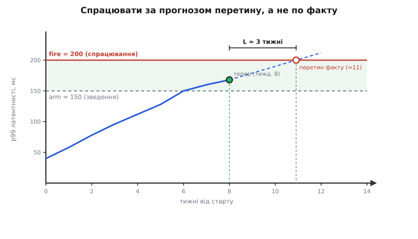

# ⚙️ Реєстр відкладених рішень: момент, який стереже машина

Відкладене рішення має підступну властивість: воно невидиме. Ухвалений вибір лишає слід — код, схему, запис у журналі. А рішення, яке ти свідомо не ухвалив, не лишає нічого, крім наміру в чиїйсь голові. І намір гниє. За місяць його забувають; за квартал людина, що його тримала, іде в іншу команду; а сигнал, якого чекали, спрацьовує в порожнечу. Найгірше в цьому те, що незроблений вибір не завмирає — його тихо ухвалює за тебе статус-кво, зазвичай за найгіршою ціною.

Ліки прості за задумом і хитрі в деталях: винести відкладені рішення з голів у **реєстр** — невеличку таблицю записів плюс обчислювач, що щоночі проганяє кожен запис по свіжому знімку метрик і сам вирішує, чи настав момент. «Останній відповідальний момент» перестає бути настроєм на нараді й стає **умовою, яку машина перевіряє за тебе**. Далі — як цей інструмент зробити так, щоб він не дрижав на шумі, не спрацьовував запізно й не стріляв у нікуди.

## Один запис: із чого складається відкладене рішення

Реєстр — це список однорідних записів. Кожен описує рівно одне відкладене рішення, і поля його не довільні: кожне латає конкретну діру, крізь яку відкладання зазвичай зникає з поля зору.

- **id** і **title** — щоб на рішення можна було послатися, а не переказувати його щоразу.
- **options** — живі альтернативи, які ще на столі. Якщо їх лишилася одна, вибору немає: рішення вже ухвалене, запис пора закривати.
- **uncertainty** — названа невизначеність: який саме факт ти чекаєш дізнатися. Це найважливіше поле. Не можеш його заповнити — ти не відкладаєш рішення, ти від нього ховаєшся, і його треба ухвалити зараз.
- **trigger** — предикат, що каже «час»: над якими сигналами й за якою умовою.
- **owner** — жива людина, що відповість, коли момент настане. Тригер без власника спрацьовує в порожнечу.
- **adr** — покликання на запис у [журналі архітектурних рішень](book:programming/architecture-decision-records), де саме відкладання зафіксовано як свідомий вибір «чекати до сигналу T».

Плюс до цього — рухомий стан, який реєстр веде сам: у якій фазі життя запис зараз і скільки вимірів поспіль його умова тримається (навіщо лічильник — трохи згодом).

Мова тут — звичайного застосунку, не заліза, тож приклад ідіоматичний двома мовами стеку: TypeScript і Python.

:::tabs
```ts
type Status = "open" | "armed" | "due" | "superseded";
type Dir = "rising" | "falling";        // куди «погано»: метрика росте чи падає

interface Condition {
  signal: string;   // ключ метрики у знімку, напр. "search.p99_ms"
  dir: Dir;
  armAt: number;    // поріг зведення — увійти в смугу спостереження
  fireAt: number;   // поріг спрацювання (для rising: armAt ≤ fireAt)
}

interface Trigger {
  conditions: Condition[];   // може стежити за кількома сигналами
  mode: "all" | "any";       // поєднати їх кон'юнкцією чи диз'юнкцією
  holdFor: number;           // скільки вимірів поспіль умова має триматися
  leadWeeks: number;         // L — на скільки наперед прогнозувати = час на втілення
}

interface Decision {
  id: string;
  title: string;
  options: string[];     // живі альтернативи, ще на столі
  uncertainty: string;   // який факт чекаємо дізнатися
  trigger: Trigger;
  owner: string;         // хто відповідає, коли настане момент
  adr: string;           // ADR, що фіксує саме відкладання
  // рухомий стан, який веде реєстр:
  status: Status;
  holdCount: number;     // скільки вимірів поспіль трималося спрацювання
}
```
```py
from dataclasses import dataclass
from enum import Enum

class Status(str, Enum):
    OPEN = "open"; ARMED = "armed"; DUE = "due"; SUPERSEDED = "superseded"

@dataclass
class Condition:
    signal: str        # ключ метрики, напр. "search.p99_ms"
    direction: str     # "rising" | "falling" — куди «погано»
    arm_at: float      # поріг зведення — увійти в смугу спостереження
    fire_at: float     # поріг спрацювання (для rising: arm_at ≤ fire_at)

@dataclass
class Trigger:
    conditions: list[Condition]
    mode: str = "all"          # "all" | "any"
    hold_for: int = 3          # скільки вимірів поспіль умова має триматися
    lead_weeks: float = 0.0    # L — горизонт прогнозу = час на втілення

@dataclass
class Decision:
    id: str
    title: str
    options: list[str]         # живі альтернативи, ще на столі
    uncertainty: str           # який факт чекаємо дізнатися
    trigger: Trigger
    owner: str                 # хто відповідає, коли настане момент
    adr: str                   # ADR, що фіксує саме відкладання
    status: Status = Status.OPEN
    hold_count: int = 0        # скільки вимірів поспіль трималося спрацювання
```
:::

Запис живе в тому самому місці, що й решта відкладених ставок команди, — у [ризик-реєстрі](book:programming/risk-register): відкладене рішення і є ризик, лише з умовою закриття замість опису наслідку. Різниця в тому, що звичайний ризик описують словами, а цей — предикатом, який машина вміє перевірити.

## Наївний поріг і чому він дрижить

Найпростіший тригер — голий поріг: «латентність пошуку пробила 200 мс → час виносити пошук у сервіс».

:::tabs
```ts
const naiveDue = (m: { p99: number }): boolean => m.p99 >= 200;
```
```py
def naive_due(p99: float) -> bool:
    return p99 >= 200
```
:::

Це вже краще за настрій — умова названа наперед. Але в живих метриках вона нікчемна з двох причин, і обидві варто побачити чітко, бо їх лікують різні механізми.

Перша — **тремтіння**. Метрики шумлять. p99 гуляє навколо 200: 198, 203, 199, 201… Голий поріг клацає туди-сюди — щоразу підіймає фальшиву тривогу, а потім відкликає її. Власник перестає вірити сигналові рівно тоді, коли сигнал стає важливий.

Друга — **запізнення**. Поріг спрацьовує на тому, що **вже сталося**: коли p99 пробив 200, ти вже за межею. А винести пошук у сервіс — не мить: міграцію треба написати, розгорнути, перевести трафік. Цей час на втілення (lead time) — тижні. Тобто спрацювавши на пробитому порозі, ти вже спізнився рівно на стільки, скільки триває саме рішення.

Обидві вади лікуються, і кожну — своїм прийомом. Тремтіння знімає **гістерезис**, запізнення — **прогноз**.

## Гістерезис: смуга плюс стійкість

Гістерезис (гр. *hysteresis* — «відставання, запізнення») означає, що система пам'ятає, звідки прийшла: перемикається в один бік за одним порогом, назад — за іншим. Замість однієї межі 200 ми беремо **дві**. Нижчу, `arm = 150`, — «звести курок»: перетнули її знизу вгору — починаємо пильно стежити. Вищу, `fire = 200`, — «стрелити». А назад у спокій вертаємось, лише впавши **нижче** `arm`. Проміжок 150…200 — мертва смуга (deadband): поки метрика гуляє в ній, стан не клацає. Той самий прийом дає електроніка: щоб логічний вентиль не дрижав на зашумленому фронті, у нього вбудовують дві напруги-пороги — схему назвали **тригером Шмітта**, на честь Отто Шмітта, який виснував її ще 1934 року, аспірантом, вивчаючи, як нервовий імпульс кальмара стрибком перемикає стан нерва. *(Статус: усталено.)*

Смуга гасить повільне гойдання навколо межі. Але лишається різкий одиничний сплеск — метрика на один вимір стрибнула за `fire` і впала назад. Проти нього — друга сторожа, **стійкість**: вимагаємо, щоб умова спрацювання трималася не мить, а `holdFor` вимірів **поспіль**. Один викид серію не робить; лічильник обнуляється, тривоги немає. Дві сторожі складаються: смуга прибирає гойдання, стійкість — поодинокі шпичаки.

Разом вони задають запису чотири фази життя, і перехід між ними — не будь-який.


*Смуга arm…fire дає зворотний перехід «зведене → відкрите» (відбій), і саме він гасить тремтіння: доки метрика гуляє в смузі, запис не клацає між станами. Лічильник «N вимірів поспіль» стереже нижню стрілку — поодинокий сплеск за fire серію не робить.*

## Прогноз і lead time: стріляти наперед

Смуга й стійкість роблять сигнал **чистим**, але не роблять його **вчасним**. Навіть ідеально згладжений поріг спрацьовує на факті, а рішення потребує `L` тижнів на втілення. Щоб устигнути, треба стріляти не тоді, коли метрику пробито, а тоді, коли за поточним темпом вона **пробʼється через `L`**.

Для цього тримаємо не одне останнє значення, а коротке вікно останніх щотижневих замірів, і з нього рахуємо нахил — темп зміни за тиждень. Найчесніший нахил на зашумлених даних дає пряма найменших квадратів по вікну: вона усереднює шум, а не хапається за останню пару точок. Прогноз тоді — проста лінійна екстраполяція краю вікна на `L` наперед.

:::tabs
```ts
// Знімок: для кожного сигналу — вікно останніх щотижневих замірів.
type Window = Record<string, number[]>;   // signal → [найдавніший … найновіший]

const latest = (xs: number[]): number => xs[xs.length - 1];

// Нахил (одиниць за тиждень) методом найменших квадратів по вікну.
function slopePerWeek(xs: number[]): number {
  const n = xs.length;
  if (n < 2) return 0;
  const meanX = (n - 1) / 2;                      // тижні 0…n-1
  const meanY = xs.reduce((a, b) => a + b, 0) / n;
  let num = 0, den = 0;
  for (let i = 0; i < n; i++) {
    num += (i - meanX) * (xs[i] - meanY);
    den += (i - meanX) ** 2;
  }
  return den === 0 ? 0 : num / den;
}

// Прогноз на L тижнів наперед — лінійна екстраполяція краю вікна.
const project = (xs: number[], leadWeeks: number): number =>
  latest(xs) + slopePerWeek(xs) * leadWeeks;

const past = (v: number, thr: number, dir: Dir): boolean =>
  dir === "rising" ? v >= thr : v <= thr;

// Зводимося на ФАКТІ (arm по latest), стріляємо за ПРОГНОЗОМ (fire по project).
function isArmed(t: Trigger, w: Window): boolean {
  const hit = t.conditions.map(c => {
    const xs = w[c.signal];
    return xs?.length ? past(latest(xs), c.armAt, c.dir) : false;
  });
  return t.mode === "all" ? hit.every(Boolean) : hit.some(Boolean);
}

function isFiring(t: Trigger, w: Window): boolean {
  const hit = t.conditions.map(c => {
    const xs = w[c.signal];
    return xs?.length ? past(project(xs, t.leadWeeks), c.fireAt, c.dir) : false;
  });
  return t.mode === "all" ? hit.every(Boolean) : hit.some(Boolean);
}
```
```py
Window = dict[str, list[float]]   # signal → [найдавніший … найновіший]

def latest(xs: list[float]) -> float:
    return xs[-1]

def slope_per_week(xs: list[float]) -> float:
    """Нахил (одиниць за тиждень) методом найменших квадратів по вікну."""
    n = len(xs)
    if n < 2:
        return 0.0
    mean_x = (n - 1) / 2                    # тижні 0…n-1
    mean_y = sum(xs) / n
    num = sum((i - mean_x) * (x - mean_y) for i, x in enumerate(xs))
    den = sum((i - mean_x) ** 2 for i in range(n))
    return num / den if den else 0.0

def project(xs: list[float], lead_weeks: float) -> float:
    """Прогноз на L тижнів наперед — лінійна екстраполяція краю вікна."""
    return latest(xs) + slope_per_week(xs) * lead_weeks

def past(v: float, thr: float, direction: str) -> bool:
    return v >= thr if direction == "rising" else v <= thr

# Зводимося на ФАКТІ (arm по latest), стріляємо за ПРОГНОЗОМ (fire по project).
def is_armed(t: Trigger, w: Window) -> bool:
    hits = []
    for c in t.conditions:
        xs = w.get(c.signal)
        hits.append(past(latest(xs), c.arm_at, c.direction) if xs else False)
    return all(hits) if t.mode == "all" else any(hits)

def is_firing(t: Trigger, w: Window) -> bool:
    hits = []
    for c in t.conditions:
        xs = w.get(c.signal)
        hits.append(past(project(xs, t.lead_weeks), c.fire_at, c.direction) if xs else False)
    return all(hits) if t.mode == "all" else any(hits)
```
:::

Тут навмисна асиметрія, і вона несе сенс. **Зводимося** ми на факті — `arm` звіряємо з реальним останнім значенням: не хочемо починати стежити через сам лише прогноз, бо прогноз на низьких значеннях легко перебільшує. А **стріляємо** за прогнозом — `fire` звіряємо з екстрапольованим значенням на `L` наперед. Дві межі (arm нижче за fire) лишаються мертвою смугою проти тремтіння, а прогноз накладається згори як запас на втілення.



*Смуга arm…fire (зелена) гасить дрижання; зведення — коли факт перетне arm; спрацювання — коли ПРОДОВЖЕННЯ ряду перетне fire. Відстань між «тепер» і фактичним перетином — це `L`, час на втілення, який ми таким чином викупили наперед.*

## Обчислювач: один прогін по знімку

Тепер серце реєстру — обчислювач, що робить один тік: бере реєстр і свіже вікно метрик, оновлює стан кожного запису й повертає перелік тих, що щойно спрацювали. Уся логіка смуги, стійкості й прогнозу сходиться сюди, у скромний скінченний автомат.

:::tabs
```ts
interface FireEvent {
  decisionId: string; title: string; owner: string;
  adr: string; options: string[]; uncertainty: string;
}

function tick(ledger: Decision[], w: Window): FireEvent[] {
  const fired: FireEvent[] = [];
  for (const d of ledger) {
    if (d.status === "superseded") continue;         // закрите не чіпаємо
    const armed = isArmed(d.trigger, w);
    const firing = armed && isFiring(d.trigger, w);  // стріляти лише в межах смуги

    if (d.status === "open" && armed) {
      d.status = "armed";
      d.holdCount = 0;
    }
    if (d.status === "armed") {
      if (!armed) {
        d.status = "open";                 // впали нижче arm — відбій, тремтіння згашене
        d.holdCount = 0;
      } else if (firing) {
        d.holdCount += 1;                  // стійкість: рахуємо виміри поспіль
        if (d.holdCount >= d.trigger.holdFor) {
          d.status = "due";
          fired.push({
            decisionId: d.id, title: d.title, owner: d.owner,
            adr: d.adr, options: d.options, uncertainty: d.uncertainty,
          });
        }
      } else {
        d.holdCount = 0;                   // серія урвалась — лічильник у нуль
      }
    }
  }
  return fired;
}
```
```py
@dataclass
class FireEvent:
    decision_id: str
    title: str
    owner: str
    adr: str
    options: list[str]
    uncertainty: str

def tick(ledger: list[Decision], w: Window) -> list[FireEvent]:
    fired: list[FireEvent] = []
    for d in ledger:
        if d.status is Status.SUPERSEDED:            # закрите не чіпаємо
            continue
        armed = is_armed(d.trigger, w)
        firing = armed and is_firing(d.trigger, w)   # стріляти лише в межах смуги

        if d.status is Status.OPEN and armed:
            d.status = Status.ARMED
            d.hold_count = 0
        if d.status is Status.ARMED:
            if not armed:
                d.status = Status.OPEN               # відбій — тремтіння згашене
                d.hold_count = 0
            elif firing:
                d.hold_count += 1                    # стійкість: виміри поспіль
                if d.hold_count >= d.trigger.hold_for:
                    d.status = Status.DUE
                    fired.append(FireEvent(
                        d.id, d.title, d.owner, d.adr, d.options, d.uncertainty))
            else:
                d.hold_count = 0                     # серія урвалась
    return fired
```
:::

Дві дрібниці в коді несуть усю поведінку. По-перше, `open` і `armed` перевіряються двома окремими `if`, а не через `else` — тож за один тік запис може перейти `open → armed` і одразу почати рахувати стійкість, не марнуючи цілого тижня на порожній перехід. По-друге, `firing` окремо накладено на `armed`: стріляти можна лише всередині смуги, тож несподіваний стрибок прогнозу за `fire`, поки факт іще під `arm`, спрацювання не дасть — спершу треба чесно зайти в смугу.

Проженімо це по тижнях, щоб побачити обидві сторожі в дії.

**Умова: рішення `search-extraction`, поріг зведення arm = 150 мс, спрацювання fire = 200 мс (p99 пошуку), стійкість holdFor = 3, час на втілення L = 3 тижні. Arm звіряємо з фактом, fire — з прогнозом (факт + нахил·3).**

```
тижд   p99   нахил   проєкція(+3)   стан        лічильник
  5    128    +9         155        open          0     факт 128 < arm 150 → ще спимо
  6    150   +12         186        armed         0     факт перетнув arm → стежимо
  7    160   +11         193        armed         0     проєкція < fire
  8    168   +11         201        armed         1     проєкція ≥ fire → почали лік
  9    172    +8         196        armed         0     провал серії → лічильник у нуль
 10    180   +10         210        armed         1
 11    187   +10         217        armed         2
 12    193    +9         220        armed→due     3  ← СПРАЦЮВАЛО
```

Прочитаймо дно цієї таблиці. Спрацювало на дванадцятому тижні, коли p99 = 193 — **іще під порогом 200**. Тобто реєстр підняв момент за прогнозом, а не за фактом: пробиття 200 сталося б лише тижнів за три, і рівно ці три тижні (`L`) ми викупили наперед на втілення. А дев'ятий тиждень показує стійкість: прогноз просів під 200 на один вимір — лічильник обнулився, фальшивої тривоги не було. Якби замість цього стояв голий поріг на факті, він або спрацював би пізно (аж на пробитті 200), або дрижав би на кожному стрибку в смузі.

## Дії: сповістити власника й запропонувати заміну ADR

Спрацювання — не кінець, а поштовх. Запис у стані `due` вимагає двох дій: **сповістити власника**, що момент настав, і **запропонувати** замінити ADR-запис про відкладання конкретним рішенням. Друге — не саме рішення (його ухвалює людина), а чернетка: реєстр готує supersede-запис зі статусом «запропоновано», лишаючи в історії слід — чому чекали, чого дочекалися.

Тут-таки закриваємо одну з найтихіших пасток — **осиротілого власника**. Поки рішення чекало, автор його міг піти з команди. Тоді сигнал спрацює, а відповісти нема кому. Тож перед сповіщенням звіряємо власника з чинним складом команди, і якщо його там уже немає — ескалюємо на запасного й позначаємо запис як осиротілий.

:::tabs
```ts
type Roster = Set<string>;   // хто зараз у команді

interface AdrSupersede { supersedes: string; status: "proposed"; rationale: string; }

// notify — межа інтеграції: канал команди (чат, пошта, тикет). Тут лише виклик.
declare function notify(owner: string, message: string): void;

function act(ev: FireEvent, roster: Roster, fallback: string): AdrSupersede {
  // Пастка «осиротілий власник»: перевіряємо, що власник іще живий.
  const owner = roster.has(ev.owner) ? ev.owner : fallback;
  const orphaned = owner !== ev.owner;

  notify(owner, [
    `Настав відповідальний момент: ${ev.title}.`,
    `Невизначеність знято — час обрати з: ${ev.options.join(", ")}.`,
    orphaned ? `⚠ Початковий власник (${ev.owner}) поза командою — ескальовано на ${owner}.` : "",
  ].filter(Boolean).join(" "));

  return { supersedes: ev.adr, status: "proposed",
           rationale: `Тригер спрацював: ${ev.uncertainty}.` };
}
```
```py
@dataclass
class AdrSupersede:
    supersedes: str
    rationale: str
    status: str = "proposed"

def notify(owner: str, message: str) -> None:
    ...   # межа інтеграції: канал команди (чат, пошта, тикет)

def act(ev: FireEvent, roster: set[str], fallback: str) -> AdrSupersede:
    # Пастка «осиротілий власник»: перевіряємо, що власник іще живий.
    owner = ev.owner if ev.owner in roster else fallback
    orphaned = owner != ev.owner

    lines = [
        f"Настав відповідальний момент: {ev.title}.",
        f"Невизначеність знято — час обрати з: {', '.join(ev.options)}.",
    ]
    if orphaned:
        lines.append(f"⚠ Власник {ev.owner!r} поза командою — ескальовано на {owner}.")
    notify(owner, " ".join(lines))

    return AdrSupersede(supersedes=ev.adr,
                        rationale=f"Тригер спрацював: {ev.uncertainty}.")
```
:::

Механіку самих ADR — форму запису, статуси, як supersede заміщує попередній, — розібрано окремо в [журналі архітектурних рішень](book:programming/architecture-decision-records/proj-adr-tooling.md); реєстр лише **пропонує** заміну, а веде її вже ADR-інструментарій. Поділ праці чіткий: реєстр каже **коли** й **кому**, ADR фіксує **що саме** й **чому**.

> 🔧 **Навіщо це.** Пара «сповістити + запропонувати supersede» — це те, що відрізняє живий реєстр від таблиці, яку ніхто не читає. Без сповіщення момент настане беззвучно; без чернетки-supersede спрацьований запис зависне в стані `due` й нікого ні до чого не зобовʼяже. А перевірка власника по складу команди — дешевий рядок коду, що ловить збій, який інакше виявляють через півроку, коли з'ясовується, що за рішенням давно ніхто не стежив.

## Складність і пастки

Скільки коштує один тік? Обчислювач обходить кожне рішення, а в ньому — кожну умову тригера. Якщо в реєстрі `D` рішень, а найдовший тригер стежить за `S` сигналами, то це `O(D · S)` перевірок предиката на знімок:

```
один тік      = O(D · S)         предикатів на знімок метрик
нахил по вікну = O(W) на сигнал   (W — довжина вікна)
   ⟹ якщо нахил рахувати щоразу заново:  O(D · S · W)
   ⟹ якщо тримати нахил інкрементно (O(1) на новий вимір):  O(D · S)
памʼять       = O(D · S) на реєстр + O(S · W) на вікна метрик
```

Числа тут крихітні: навіть сотні відкладених рішень по кілька сигналів — це тисячі перевірок раз на добу, ніщо. Обчислювач ніколи не буде вузьким місцем; уся вартість реєстру — не машинна, а людська, про що й уся ця стаття. Тому важливіші не такти, а пастки, кожна з яких перетворює реєстр із користі на самообман. Їх чотири, і три з них ловляться статичною перевіркою `lint`, ще до того як тригер випустять у роботу.

**Тремтіння.** Голий поріг клацає на шумі. Ліки вже вбудовано — смуга arm…fire плюс стійкість `holdFor`. `lint` тут стереже вироджений випадок: якщо хтось поставив `fire` по той самий бік від `arm`, що й напрямок «погано», смуги немає — тригер або клацає, або стріляє негайно.

**Осиротілий власник.** Рішення пережило свого автора. Ловиться в `act` звіркою зі складом команди — і має ловитися ще раніше, періодичним `lint` усього реєстру проти чинного ростера.

**Тригер, що не спрацює ніколи.** Найпідступніша: поріг задано так високо (чи `L` так далеко), що метрика його не досягне за жодних реальних умов. Запис виглядає живим, а насправді мертвий — рішення тихо ухвалює статус-кво. Ловиться **зворотним прогоном** тригера по історії: якщо на всьому доступному минулому він жодного разу не спрацював би, поріг підозрілий і його треба переглянути з людиною.

**Лагінг-сигнал без запасу.** Обрали метрику, що відстає від того, що справді болить (середнє замість хвоста, добова агрегація замість погодинної), або `leadWeeks` менший за реальний час на втілення. Тоді навіть чистий, стійкий сигнал приходить **запізно** — момент уже минув. `lint` ловить грубий випадок `leadWeeks ≤ 0`; тонший (сигнал відстає більше, ніж дає запас `L`) вимагає ока людини, яка знає природу метрики.

:::tabs
```ts
function lint(d: Decision, history: Window[]): string[] {
  const warn: string[] = [];
  if (!d.uncertainty.trim())
    warn.push("невизначеність не названо — це прокрастинація, не відкладання");
  if (d.options.length < 2)
    warn.push("менше двох живих опцій — вибір уже зроблено за замовчуванням");
  if (d.trigger.conditions.length === 0)
    warn.push("тригер без умов — спрацює будь-коли");
  if (d.trigger.leadWeeks <= 0)
    warn.push("leadWeeks ≤ 0: стріляємо на пробитому порозі — спізнимось на час втілення");
  for (const c of d.trigger.conditions) {
    const noBand = c.dir === "rising" ? c.fireAt < c.armAt : c.fireAt > c.armAt;
    if (noBand) warn.push(`${c.signal}: fire по той бік arm — смуги гістерезису немає`);
  }
  // «Тригер, що не спрацює ніколи»: чи хоч раз спрацював би на реальній історії?
  if (history.length > 0 && !history.some(w => isFiring(d.trigger, w)))
    warn.push("на всій історії тригер не спрацював би жодного разу — поріг недосяжний?");
  return warn;
}
```
```py
def lint(d: Decision, history: list[Window]) -> list[str]:
    warn: list[str] = []
    if not d.uncertainty.strip():
        warn.append("невизначеність не названо — це прокрастинація, не відкладання")
    if len(d.options) < 2:
        warn.append("менше двох живих опцій — вибір уже зроблено за замовчуванням")
    if not d.trigger.conditions:
        warn.append("тригер без умов — спрацює будь-коли")
    if d.trigger.lead_weeks <= 0:
        warn.append("lead_weeks ≤ 0: стріляємо на пробитому порозі — спізнимось на час втілення")
    for c in d.trigger.conditions:
        no_band = c.fire_at < c.arm_at if c.direction == "rising" else c.fire_at > c.arm_at
        if no_band:
            warn.append(f"{c.signal}: fire по той бік arm — смуги гістерезису немає")
    # «Тригер, що не спрацює ніколи»: чи хоч раз спрацював би на історії?
    if history and not any(is_firing(d.trigger, w) for w in history):
        warn.append("на всій історії тригер не спрацював би жодного разу — поріг недосяжний?")
    return warn
```
:::

Перші дві перевірки `lint` цілять не в код, а в чесність запису. Порожня `uncertainty` — це відкладання без названого факту, тобто прокрастинація в масці інженерної обачності. Менш ніж дві живі опції — це рішення, що вже ухвалене за замовчуванням, лише не записане. Реєстр тим і цінний, що змушує назвати обидві речі вголос: **яку невизначеність ти чекаєш зняти** і **яка подія скаже, що момент настав**. Хто не може заповнити ці поля, той не відкладає рішення відповідально — він його уникає. А машина, що вночі проганяє тригери, лише робить видимою ту дисципліну, яку інакше зʼїдають забудькуватість і страх.
