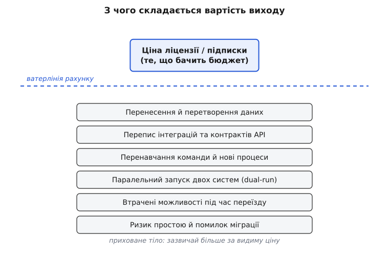
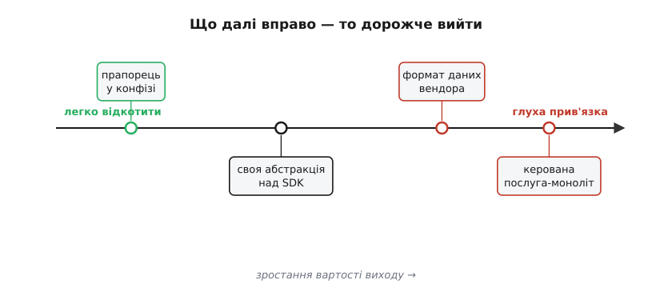
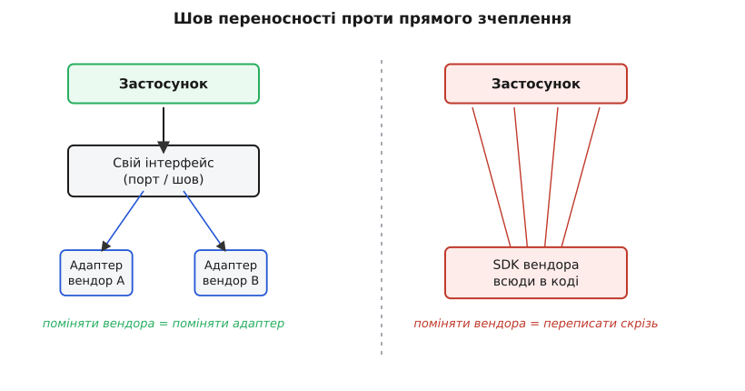

# Прив'язка і вартість виходу

<preknowlist>
- [Вартість як атрибут](book:programming/cost-as-attribute) — гроші й час — такий самий якісний атрибут системи, як швидкодія; сукупна вартість володіння (TCO) включає не лише ціну, а й супровід.
- [Зворотні й незворотні рішення](book:programming/reversible-irreversible-decisions) — рішення бувають «двобічні двері» (легко відкотити) і «однобічні» (вихід дорогий або неможливий).
- [Build vs buy](book:programming/build-vs-buy) — вибір між «зробити самому», «купити/орендувати» й «узяти готове» — саме тут найчастіше народжується прив'язка.
</preknowlist>

Уяви, що ти обрав базу даних, чергу повідомлень чи хмарну платформу — і за два роки хочеш піти. Не тому, що вона погана: просто ціни піднялись, з'явилося щось краще, або компанію-власника купили й закрили продукт. Ти сідаєш рахувати переїзд — і виявляєш, що піти коштує стільки, що дешевше терпіти. Ти не в клітці на замку. Ти в клітці, двері якої відчинені, але поріг задорогий, щоб його переступити. Це і є **прив'язка** (англ. *lock-in* — «замикання»), а висота порога — **вартість виходу** (*exit cost*, або *switching cost* — вартість переходу).

Ремесло архітектора тут не в тому, щоб прив'язки уникати за будь-яку ціну — це неможливо й часто дурне. Воно в тому, щоб **бачити прив'язку заздалегідь, оцінювати її ціною й свідомо вирішувати**, скільки виходу ти готовий собі залишити. Прив'язка — не моральний провал вибору, а стаття витрат, яку треба покласти на ваги поряд зі швидкістю розробки й вартістю володіння.

## Звідки береться поріг

Почнімо з простого спостереження: **прив'язка виникає не з наміру вендора, а зі зв'язків, які ти сам будуєш**. Коли твій код починає розмовляти з чужою системою, між вами протягуються ниточки: формат даних, форма викликів, припущення про поведінку, знання команди, налаштовані процеси. Кожна ниточка окремо дешева. Разом вони — канат, який тримає тебе на місці.

Розкладімо цей канат на пасма, бо саме з них складається рахунок за вихід.

**Дані.** Твоя інформація лежить у формі, яку розуміє поточна система. У її схемі таблиць, у її форматі експорту, у її діалекті SQL. Щоб піти, дані треба **перенести й перетворити** — а це не копіювання, це переклад, під час якого щось завжди губиться або ламається.

**Інтерфейс.** Код кличе чужий API — його функції, його типи помилок, його моделі. Що більше місць у коді знають ці виклики напряму, то більше рядків доведеться переписати. Прив'язка тут пропорційна тому, **наскільки глибоко чужа форма проросла у твою**.

**Люди й процеси.** Команда навчилася саме цього інструмента. Є скрипти розгортання, дашборди моніторингу, звички налагодження, домовленості з підтримкою вендора. Переїзд — це ще й **перенавчання**, а поки воно триває, швидкість падає.

**Поведінка, на яку ти сперся.** Найпідступніше пасмо. Ти непомітно почав покладатися на дрібні особливості: як саме черга гарантує порядок, як база поводиться при збою, який у сервісу «характер» під навантаженням. Це ніде не записано в контракті — але твоя система вже стоїть на цьому. Нова система поводиться інакше, і ти дізнаєшся про це найгіршим способом — у проді.



*Видима ціна — лише верхівка; тіло вартості виходу приховане під ватерлінією рахунку й зазвичай більше за неї.*

> 🔧 **Навіщо це.** Коли бюджет обговорює вибір постачальника, на столі лежить лише верхівка айсберга — ціна підписки. Робота архітектора — витягти на світло підводну частину: скільки коштуватиме **піти** за два роки. Без цієї цифри рішення ухвалюють наосліп, а розплачуються, коли вийти вже дорого.

## Прив'язка — це міра незворотності

Тепер поглянь на прив'язку під іншим кутом, і вона стане знайомою. Кожне архітектурне рішення можна поставити на вісь: наскільки легко його **відкотити**. Прапорець у конфізі відкочується за хвилину. Своя тонка абстракція над чужим SDK — за тиждень. А от коли всі твої дані вже в закритому форматі керованої послуги, вихід міряється кварталами й дорогими переписуваннями.

Вартість виходу — це просто **ціна незворотності, виражена в грошах і часі**. Що дорожче вийти, то ближче рішення до «однобічних дверей»: пройшов — назад майже нема.



*Що правіше стоїть рішення, то вищий поріг виходу; архітектор свідомо обирає, як далеко вправо готовий зайти.*

Звідси випливає чинник, який економісти назвали **path dependence** (англ. — «залежність від пройденого шляху»): вибір, зроблений раз, звужує всі майбутні вибори, бо кожен наступний крок будується на попередньому. Класична ілюстрація — розкладка клавіатури QWERTY, яка закріпилася в друкарських машинках Remington і живе досі: не тому, що вона найкраща, а тому, що всі вже навчилися й переучуватися задорого. Історик економіки Пол Девід описав цей механізм 1985 року саме як приклад того, як випадковий ранній вибір «замикає» систему на десятиліття. (Чи справді QWERTY *гірша* за альтернативи — питання спірне; але **механізм замикання** через накопичений спільний досвід — цілком реальний.)

> 🔧 **Навіщо це.** Правило «двобічні двері проходь швидко, однобічні — обережно» прямо про вартість виходу. Дешеве відкотити — вибирай легко й переробиш, якщо помилився. Дорого вийти — тут ти платиш не за саме рішення, а за **право його змінити**, тож зваж це право перед тим, як його втратити. Про поріг оборотності докладніше — у [зворотних і незворотних рішеннях](book:programming/reversible-irreversible-decisions).

## Чому вендор може підняти ціну

Є ще одна причина, чому прив'язку варто рахувати грошима: **той, у кого ти замкнений, це знає — і закладає це в ціну**. Тут працює холодна економіка, і вона не про злих людей, а про стимули.

Логіка проста. Постачальник розуміє, скільки коштує від нього піти. Поки річна ціна нижча за вартість твого виходу, тобі вигідніше залишитися й платити, ніж переїжджати. Отже, він може підняти ціну майже **до розміру твоєї вартості виходу** — і ти все одно не підеш. Різниця між чесною ринковою ціною й тим, що з тебе можна взяти завдяки прив'язці, — це **премія прив'язки** (*lock-in premium*), і вендор має всі стимули її брати.

Цю механіку ще 1979 року вбудував у свою рамку п'яти сил Майкл Портер: висока вартість переходу **зменшує твою переговорну силу** як покупця й **захищає постачальника** від конкурентів. А 1999 року Карл Шапіро й Гел Варіан у книжці *Information Rules* показали, як це працює саме в цифрову епоху, і сформулювали різко: прибуток, який постачальник може взяти з клієнта, дорівнює сукупній вартості переходу цього клієнта. Іншими словами — **твоя вартість виходу і є мірою того, скільки з тебе можна взяти зверху**.

Ось чому «безплатний» старт часто найдорожчий у підсумку: тебе дешево заводять усередину, щоб потім, коли переїзд задорогий, брати премію роками. Це не завжди пастка — але це завжди варто побачити.

> 🔧 **Навіщо це.** Коли постачальник дає щедру знижку на вхід і жодної — на вихід, це сигнал: він рахує твою майбутню премію прив'язки. Твоя відповідь — не панічна втеча, а свідома оцінка: скільки ця премія за 3–5 років проти економії тут і зараз. Історію та економіку прив'язки — від Портера до Шапіро й Варіана — я виніс [окремо](book:programming/lock-in-exit-cost/hist-lock-in-economics.md), бо це самостійний шар.

## Скільки саме коштує вихід

Розмахувати словом «дорого» легко. Архітектор натомість **називає число**. Рахунок за вихід — це не одна цифра, а сума статей, і кожну можна прикинути хоч грубо. Загальний скелет такий:

```
Вартість_виходу ≈ Дані + Код + Люди + Паралельний_запуск + Ризик

  Дані              = обсяг × вартість_перенесення_за_одиницю
  Код               = точки_дотику × вартість_переписати_точку
  Люди              = команда × час_перенавчання × ставка
  Паралельний_запуск = місяці_подвійної_роботи × місячна_вартість_двох_систем
  Ризик             = ймовірність_збою × вартість_збою
```

Числа тут будуть грубі — і це нормально. Мета не в бухгалтерській точності, а в **порядку величини**: вихід коштує ближче до місячної зарплати чи до річного бюджету команди? Це вже змінює рішення. Техніку такої прикидки «на серветці» — коли важлива не точність, а правильний порядок — розбирає окрема тема про [прикидку на серветці](book:programming/back-of-envelope).

**Умова: тебе вабить керована черга повідомлень.** Своя, на відкритому рушії, коштує 40 годин на місяць супроводу. Керована — «безкоштовна» в перший рік, потім 2000 доларів на місяць. Порахуймо, у що обійдеться вихід, якщо через рік доведеться йти.

```
Дані:              стан черг малий, експорт-імпорт     ≈  16 год
Код:               8 точок дотику × 6 год               =  48 год
Люди:              4 інженери × 8 год перенавчання       =  32 год
Паралельний запуск: 2 міс × (стара+нова інфраструктура)  ≈ $3 000 + 40 год
Ризик:             10% × втрата $20 000 (простій)        =  $2 000

Разом:  ≈ 136 год праці + $5 000 прямих витрат
        ≈ (136 × $60) + $5 000  ≈  $13 000 одноразово
```

Тепер це число можна класти на ваги проти економії. Якщо керована черга економить 40 годин супроводу щомісяця (≈ 2400 доларів), то вихід у 13 000 доларів «окупається» приблизно за п'ять місяців економії. Прив'язка є — але вона **дешева відносно вигоди**, і рішення взяти керовану послугу цілком розумне. А от якби вихід коштував 200 000 доларів — та сама вигода вже не виправдовує ризику, і варто закладати шов переносності від початку. Саме **число**, а не почуття, розрізняє ці два випадки.

Виведення цієї моделі — звідки береться «премія прив'язки» й за якою умовою вихід узагалі варто платити — я розгорнув [окремо як математику рішення](book:programming/lock-in-exit-cost/math-exit-cost-model.md), бо там є що вивести акуратно.

> 🔧 **Навіщо це.** Оцінка вартості виходу — це та цифра, якої найчастіше бракує в рішенні про постачальника, і саме через її брак команди опиняються в дорогих клітках. Одна груба прикидка на пів години рятує від багаторічної премії прив'язки. Гроші й час тут — повноправний якісний атрибут, як і будь-який інший; про це — [вартість як атрибут](book:programming/cost-as-attribute).

## Як тримати поріг низьким: шов переносності

Найпотужніший архітектурний прийом проти прив'язки старий і надійний: **не давай чужій формі проростати всюди — постав між нею й собою тонкий шов**. Замість того щоб кликати SDK постачальника з двохсот місць коду, ти визначаєш **свій** інтерфейс — рівно ту потребу, яку маєш, у своїх словах — а розмову з конкретним вендором ховаєш за одним адаптером (англ. *adapter* — «перехідник»).

Тепер твій код знає лише свій інтерфейс. Вендор живе в одному місці. Поміняти постачальника — це написати новий адаптер, а не переписати всю систему. Вартість виходу падає з «переписати скрізь» до «переписати шов».



*Шов збирає всю прив'язку в одну точку: ліворуч зміна вендора — це один адаптер, праворуч — переписування по всьому коду.*

Ось як цей шов виглядає в C++. Спершу — **свій** інтерфейс, у твоїх поняттях, нічого про конкретного постачальника:

:::tabs
```cpp
// Свій контракт: рівно те, що потрібно системі.
// Жодних типів вендора тут немає — це і є шов.
class MessageQueue {
public:
    virtual ~MessageQueue() = default;

    virtual bool publish(const std::string& topic,
                         const std::string& payload) = 0;

    // повертає false, якщо за timeout нічого не прийшло
    virtual bool consume(std::string& out, int timeout_ms) = 0;
};
```
```go
// Свій контракт: рівно те, що потрібно системі.
// Жодних типів вендора тут немає — це і є шов.
type MessageQueue interface {
	Publish(topic, payload string) error

	// повертає ("", false, nil), якщо за timeout нічого не прийшло;
	// err — саме збій доступу
	Consume(timeout time.Duration) (payload string, ok bool, err error)
}
```
```python
from abc import ABC, abstractmethod

# Свій контракт: рівно те, що потрібно системі.
# Жодних типів вендора тут немає — це і є шов.
class MessageQueue(ABC):
    @abstractmethod
    def publish(self, topic: str, payload: str) -> None:
        ...

    # повертає None, якщо за timeout нічого не прийшло
    @abstractmethod
    def consume(self, timeout_ms: int) -> str | None:
        ...
```
:::

Адаптер під конкретного вендора реалізує цей контракт і **лишається єдиним місцем**, що знає його SDK:

:::tabs
```cpp
// Уся прив'язка до постачальника A замкнена ТУТ.
// Жоден інший файл не бачить vendora::*.
class VendorAQueue : public MessageQueue {
    vendora::Client cli_;                 // тип вендора — лише всередині
public:
    explicit VendorAQueue(const std::string& url) : cli_(url) {}

    bool publish(const std::string& topic,
                const std::string& payload) override {
        vendora::Message m;               // деталь вендора не витікає назовні
        m.set_channel(topic);
        m.set_body(payload);
        return cli_.send(m) == vendora::OK;
    }

    bool consume(std::string& out, int timeout_ms) override {
        vendora::Message m;
        if (cli_.poll(m, timeout_ms) != vendora::OK) return false;
        out = m.body();
        return true;
    }
};
```
```go
// Уся прив'язка до постачальника A замкнена ТУТ.
// Жоден інший файл не бачить vendora.*.
type VendorAQueue struct {
	cli *vendora.Client // тип вендора — лише всередині
}

func NewVendorAQueue(url string) (*VendorAQueue, error) {
	cli, err := vendora.Dial(url)
	if err != nil {
		return nil, err
	}
	return &VendorAQueue{cli: cli}, nil
}

func (q *VendorAQueue) Publish(topic, payload string) error {
	m := vendora.Message{} // деталь вендора не витікає назовні
	m.SetChannel(topic)
	m.SetBody(payload)
	return q.cli.Send(m)
}

func (q *VendorAQueue) Consume(timeout time.Duration) (string, bool, error) {
	m, err := q.cli.Poll(timeout)
	if err == vendora.ErrTimeout {
		return "", false, nil
	}
	if err != nil {
		return "", false, err
	}
	return m.Body(), true, nil
}
```
```python
# Уся прив'язка до постачальника A замкнена ТУТ.
# Жоден інший файл не бачить vendora.
class VendorAQueue(MessageQueue):
    def __init__(self, url: str) -> None:
        self._cli = vendora.Client(url)  # тип вендора — лише всередині

    def publish(self, topic: str, payload: str) -> None:
        m = vendora.Message()            # деталь вендора не витікає назовні
        m.channel = topic
        m.body = payload
        if self._cli.send(m) != vendora.OK:
            raise RuntimeError("vendorA publish failed")

    def consume(self, timeout_ms: int) -> str | None:
        m = vendora.Message()
        if self._cli.poll(m, timeout_ms) != vendora.OK:
            return None
        return m.body
```
:::

Решта системи працює лише з `MessageQueue&` і навіть не здогадується, хто там під сподом:

:::tabs
```cpp
// Бізнес-логіка сліпа до вендора — говорить тільки зі швом.
void ship_order(MessageQueue& q, const Order& o) {
    q.publish("orders", serialize(o));
}

int main() {
    VendorAQueue queue("amqp://broker");  // вибір вендора — в одному рядку
    // Переїзд на вендора B = замінити цей рядок на VendorBQueue
    // і написати новий адаптер. Ship_order не змінюється взагалі.
}
```
```go
// Бізнес-логіка сліпа до вендора — говорить тільки зі швом.
func shipOrder(q MessageQueue, o Order) error {
	return q.Publish("orders", serialize(o))
}

func main() {
	queue, err := NewVendorAQueue("amqp://broker") // вибір вендора — в одному місці
	if err != nil {
		log.Fatal(err)
	}
	// Переїзд на вендора B = замінити цей рядок на NewVendorBQueue
	// і написати новий адаптер. shipOrder не змінюється взагалі.
	_ = queue
}
```
```python
# Бізнес-логіка сліпа до вендора — говорить тільки зі швом.
def ship_order(q: MessageQueue, o: Order) -> None:
    q.publish("orders", serialize(o))

def main() -> None:
    queue = VendorAQueue("amqp://broker")  # вибір вендора — в одному рядку
    # Переїзд на вендора B = замінити цей рядок на VendorBQueue
    # і написати новий адаптер. ship_order не змінюється взагалі.
```
:::

Прив'язка не зникла — вона **зібрана в одну точку**, яку видно й якою можна керувати. Це і є суть: не втекти від чужого коду, а не дати йому розповзтися.

Але тут чигає пастка, і чесність вимагає її назвати. Шов не безкоштовний і не всесильний.

**Пастка спільного знаменника.** Якщо ти хочеш легко міняти двох вендорів, твій інтерфейс мусить умістити лише те, що вміють **обидва**. А значить — ти відрізаєш себе від найсильніших, найунікальніших можливостей кожного. Ти отримав переносність, заплативши **посередністю**: система вміє лише спільний знаменник ринку. Іноді це чесна ціна за свободу виходу. Іноді — дурість, бо ти платиш абстракцією за переносність, якою ніколи не скористаєшся.

**Пастка дірявої абстракції.** Шов ховає деталі постачальника лише доти, доки вони справді ховаються. Але поведінка протікає крізь будь-який інтерфейс: гарантії порядку, семантика збою, затримки під навантаженням — усе це просочується назовні, хоч у сигнатурах його немає. Твій код непомітно починає покладатися на конкретну поведінку конкретного вендора — і шов, який ти вважав захистом, виявляється декорацією. Робочий приклад такого адаптера разом з обома пастками — коли шов рятує, а коли лише вдає захист — я виніс [окремим кодовим розбором](book:programming/lock-in-exit-cost/proj-abstraction-seam.md).

> 🔧 **Навіщо це.** Шов переносності — це не «завжди роби абстракцію», а **свідома ставка**: ти платиш складністю й, можливо, посередністю зараз, щоб знизити вартість виходу потім. Ставка виправдана там, де вихід дорогий і ймовірний; марна — де прив'язка дешева або де ти ніколи не піднімеш чужі унікальні можливості. Це той самий баланс, який зважує будь-який [trade-off-аналіз](book:programming/tradeoff-analysis) і про який думають [тактики змінюваності](book:programming/modifiability-tactics).

## Коли прив'язку варто прийняти

З усього сказаного легко зробити хибний висновок: тікати від прив'язки завжди. Це неправда, і хороший архітектор це знає.

Прив'язка — це **обмін**. Приймаючи її, ти зазвичай отримуєш щось цінне зараз: швидший старт, менше супроводу, доступ до можливостей, які сам не побудуєш і за рік. Керована база даних знімає з тебе цілий клас турбот. Хмарна платформа дає масштаб, який своїми руками не зібрати. Це реальна вигода, і відмовлятися від неї заради абстрактної «свободи», якою ти, може, ніколи не скористаєшся, — теж помилка, лише дзеркальна.

Тож рішення зводиться до чесного зважування трьох речей: **наскільки дорогий вихід**, **наскільки ймовірно, що доведеться виходити**, і **що ти отримуєш натомість зараз**. Прив'язку варто прийняти, коли вигода тут велика, вихід відносно дешевий, а ймовірність виходу низька. І варто опиратися — будувати шов, тримати запасний вихід, — коли вихід дорогий, а ймовірність його реальна.

Є й розумна середина: **відкласти саме зобов'язання**. Часто не треба вирішувати про постачальника сьогодні — можна почати з тонкого шва й дозволити собі обрати вендора пізніше, коли знатимеш більше. Це прямо про [останній відповідальний момент](book:programming/last-responsible-moment): зафіксувати незворотнє рішення тоді, коли відкладати вже дорого, а не раніше. А ставлення до системи, яка **очікує зміни** й тримає вартість виходу низькою за задумом, — це серцевина [еволюційної архітектури](book:programming/evolutionary-architecture).

Прив'язка спливає в кожному прикладному рішенні: у виборі хмарного постачальника, де вона стає [драйвером cloud-вартості](book:programming/cloud-cost-model); у виборі між власним і купленим, де народжується найчастіше — у [build vs buy](book:programming/build-vs-buy); у прив'язці до конкретної залізної платформи, як-от [прив'язка до вендора мікроконтролера](book:programming/vendor-lock-in). Скрізь питання те саме, і відповідь на нього — не гасло, а число: **скільки коштує вийти, помножене на те, наскільки ймовірно, що доведеться**. Це число архітектор оцінює як будь-який ризик — тверезо, з ймовірністю й ціною, як учить [ризик-мислення](book:programming/risk-thinking) і робота [під невизначеністю](book:programming/deciding-under-uncertainty). Тоді прив'язка перестає бути пасткою, у яку вскочили наосліп, і стає тим, чим має бути: свідомо обраною статтею витрат.
