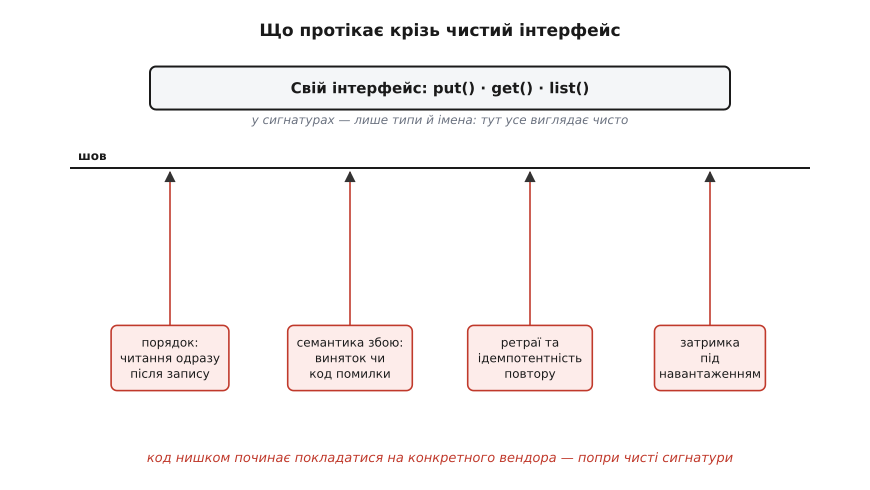
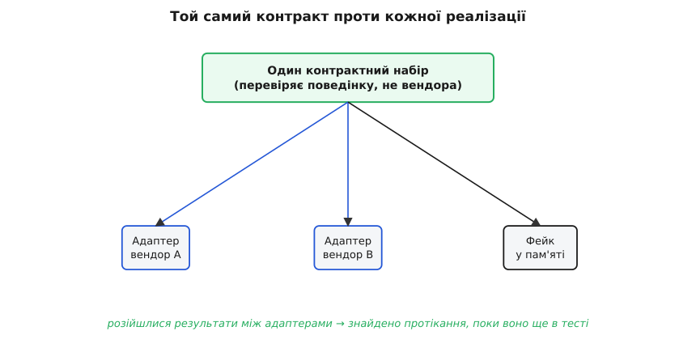

# ⚙️ Шов переносності на робочому C++: порт, два адаптери, дві пастки

Про шов переносності легко говорити гаслами: «постав абстракцію над вендором, і зміниш його одним рядком». Гасло правдиве рівно доти, доки не сядеш писати код, — а тоді виявляється, що шов має два лезá, і обидва ріжуть тебе, а не вендора, якщо тримати його криво. Тому зберемо шов по-справжньому: свій інтерфейс, два реальні адаптери під різних постачальників, одну точку вибору й бізнес-логіку, сліпу до того, хто там під сподом. А коли механізм працюватиме на очах, розкриємо на ньому обидві пастки — не переказом, а конкретним фрагментом, де код нишком зраджує чистоту власних сигнатур.

Візьмемо не чергу (її вже видно в самій темі), а **сховище об'єктів** — те, що в хмарах зветься об'єктним сховищем чи «бакетом» (англ. *object store*, *blob storage*): кладеш під ключем шматок байтів, читаєш його назад за тим самим ключем, перелічуєш ключі за префіксом. Це навмисне проста потреба — і саме на простій потребі найкраще видно, як абстракція спершу рятує, а тоді підводить.

## Задача: рівно та потреба, яку має система

Сформулюймо потребу в **своїх** словах, не в словах жодного постачальника. Системі треба три дії, і поки що більше нічого:

1. **Покласти** байти під рядковим ключем (`put`).
2. **Дістати** байти за ключем, або дізнатися, що їх нема (`get`).
3. **Перелічити** ключі, що починаються з префікса (`list`) — щоб, скажімо, обійти всі файли одного замовлення.

Це і є весь контракт. Зверни увагу, чого тут **немає**: жодного слова про регіони, про класи зберігання, про підписані посилання, про versioning — усе це реальні можливості реальних хмар, але **наша система їх не потребує**, тож у контракт вони не входять. Контракт — це не «усе, що вміє вендор», а «рівно те, що потрібно нам». Різниця між цими двома формулюваннями і є вододіл між чесним швом і майбутнім болем: візьмеш у контракт зайве — привʼяжешся до вендора там, де міг би не привʼязуватись; візьмеш замало — доведеться дірявити шов у проді.

> 🔧 **Навіщо це.** Спокуса на цьому кроці — списати сигнатури прямо з документації улюбленого постачальника: «ну він же дає `PutObject`, візьму як є». Тоді твій «власний» інтерфейс — це переодягнений SDK вендора, і переносності в ньому стільки ж, скільки в прямому виклику. Тому інтерфейс пишуть **від потреби системи**, а не від форми чужого API: спершу спитай, що робить твоя бізнес-логіка, і лише те винеси в контракт.

## Ідея: свій порт зверху, вендор — змінний адаптер знизу

Прийом старий і надійний. Ти оголошуєш **свій** абстрактний інтерфейс (його ще звуть **портом**, англ. *port* — «отвір, гніздо»), у якому живе тільки твоя потреба й жодного типу постачальника. Розмову з конкретним вендором ховаєш за **адаптером** (англ. *adapter* — «перехідник»), що реалізує цей порт і **лишається єдиним місцем**, яке знає чужий SDK. Уся бізнес-логіка тримається за порт і не здогадується, хто під ним. Поміняти постачальника — написати новий адаптер, а не переписати систему.

Ось порт. Ключове тут — типи. У сигнатурах немає **жодного** типу вендора: лише `std::string`, `std::vector`, `std::optional` — рідні цеглинки мови. Це і є шов.

:::tabs
```cpp
#include <string>
#include <vector>
#include <optional>

// Свій порт: рівно потреба системи, у власних поняттях.
// Жодного типу постачальника тут немає — саме тому це шов, а не
// переодягнений SDK.
class ObjectStore {
public:
    virtual ~ObjectStore() = default;

    // Покласти байти під ключем. Кидає StoreError при збої (див. нижче).
    virtual void put(const std::string& key,
                     const std::string& bytes) = 0;

    // Дістати байти. std::nullopt означає «такого ключа немає»
    // (це НЕ помилка); StoreError — саме збій доступу.
    virtual std::optional<std::string> get(const std::string& key) = 0;

    // Перелічити ключі, що починаються з префікса.
    virtual std::vector<std::string> list(const std::string& prefix) = 0;
};
```
```go
// Свій порт: рівно потреба системи, у власних поняттях.
// Жодного типу постачальника тут немає — саме тому це шов, а не
// переодягнений SDK.
type ObjectStore interface {
	// Покласти байти під ключем. Повертає *StoreError при збої (див. нижче).
	Put(key string, bytes []byte) error

	// Дістати байти. found == false означає «такого ключа немає»
	// (це НЕ помилка); ненульовий err — саме збій доступу.
	Get(key string) (bytes []byte, found bool, err error)

	// Перелічити ключі, що починаються з префікса.
	List(prefix string) ([]string, error)
}
```
```python
from abc import ABC, abstractmethod

# Свій порт: рівно потреба системи, у власних поняттях.
# Жодного типу постачальника тут немає — саме тому це шов, а не
# переодягнений SDK.
class ObjectStore(ABC):
    # Покласти байти під ключем. Кидає StoreError при збої (див. нижче).
    @abstractmethod
    def put(self, key: str, data: bytes) -> None:
        ...

    # Дістати байти. None означає «такого ключа немає»
    # (це НЕ помилка); StoreError — саме збій доступу.
    @abstractmethod
    def get(self, key: str) -> bytes | None:
        ...

    # Перелічити ключі, що починаються з префікса.
    @abstractmethod
    def list(self, prefix: str) -> list[str]:
        ...
```
:::

Одну проєктну дрібницю варто назвати одразу, бо вона потім вистрелить: **«ключа немає»** ми зробили не помилкою, а `std::optional` без значення, і відокремили від справжнього збою доступу, який кидатиме `StoreError`. Це рішення контракту, а не вендора: ми **самі** вирішили, що відсутність обʼєкта — нормальний результат, і зобовʼязали кожен адаптер привести поведінку свого SDK до цього правила. Оголосимо й сам виняток — теж свій, не чужий:

:::tabs
```cpp
#include <stdexcept>

// Свій тип збою. Адаптер зобов'язаний перекласти будь-яку помилку
// вендора в ЦЕЙ виняток — щоб бізнес-логіка не ловила чужих типів.
class StoreError : public std::runtime_error {
public:
    explicit StoreError(const std::string& what)
        : std::runtime_error(what) {}
};
```
```go
// Свій тип збою. Адаптер зобов'язаний перекласти будь-яку помилку
// вендора в ЦЕЙ тип — щоб бізнес-логіка не ловила чужих типів.
type StoreError struct {
	msg string
}

func (e *StoreError) Error() string { return e.msg }

func NewStoreError(what string) *StoreError { return &StoreError{msg: what} }
```
```python
# Свій тип збою. Адаптер зобов'язаний перекласти будь-яку помилку
# вендора в ЦЕЙ виняток — щоб бізнес-логіка не ловила чужих типів.
class StoreError(Exception):
    pass
```
:::



*Сигнатури над швом чисті — типи й імена. Але поведінка (порядок, збій, ретраї, затримка) піднімається знизу крізь будь-який інтерфейс, і саме нею код привʼязується до конкретного вендора, сам того не бачачи.*

## Робочий код: два адаптери й одна точка вибору

Тепер два адаптери під двох різних постачальників. Уяви, що вендор A дає синхронний SDK з кодами повернення, а вендор B — SDK, що кидає власні винятки й повертає обʼєкти-результати. Форма чужих API різна — а наш порт має бути однаковий. У цьому вся робота адаптера: **привести чуже до свого**.

Адаптер A. Уся привʼязка до постачальника A замкнена тут; жоден інший файл не бачить `vendora::*`.

:::tabs
```cpp
// --- adapter_a.cpp: єдине місце, що знає SDK вендора A ---
#include <vendora/client.h>   // тип вендора живе ЛИШЕ в цьому файлі

class VendorAStore : public ObjectStore {
    vendora::Client cli_;
public:
    explicit VendorAStore(const std::string& bucket)
        : cli_(bucket) {}

    void put(const std::string& key, const std::string& bytes) override {
        vendora::Status s = cli_.write(key, bytes.data(), bytes.size());
        if (s != vendora::OK)
            throw StoreError("vendorA put: " + vendora::str(s));
    }

    std::optional<std::string> get(const std::string& key) override {
        vendora::Buffer buf;
        vendora::Status s = cli_.read(key, &buf);
        if (s == vendora::NOT_FOUND) return std::nullopt;   // не помилка!
        if (s != vendora::OK)
            throw StoreError("vendorA get: " + vendora::str(s));
        return std::string(buf.data(), buf.size());
    }

    std::vector<std::string> list(const std::string& prefix) override {
        std::vector<std::string> out;
        for (auto& obj : cli_.enumerate(prefix))   // SDK сам гортає сторінки
            out.push_back(obj.key());
        return out;
    }
};
```
```go
// --- adapter_a.go: єдине місце, що знає SDK вендора A ---
import "vendora" // тип вендора живе ЛИШЕ в цьому файлі

type VendorAStore struct {
	cli *vendora.Client
}

func NewVendorAStore(bucket string) *VendorAStore {
	return &VendorAStore{cli: vendora.NewClient(bucket)}
}

func (s *VendorAStore) Put(key string, bytes []byte) error {
	if st := s.cli.Write(key, bytes); st != vendora.OK {
		return NewStoreError("vendorA put: " + vendora.Str(st))
	}
	return nil
}

func (s *VendorAStore) Get(key string) ([]byte, bool, error) {
	buf, st := s.cli.Read(key)
	if st == vendora.NotFound {
		return nil, false, nil // не помилка!
	}
	if st != vendora.OK {
		return nil, false, NewStoreError("vendorA get: " + vendora.Str(st))
	}
	return buf, true, nil
}

func (s *VendorAStore) List(prefix string) ([]string, error) {
	var out []string
	for _, obj := range s.cli.Enumerate(prefix) { // SDK сам гортає сторінки
		out = append(out, obj.Key())
	}
	return out, nil
}
```
```python
# --- adapter_a.py: єдине місце, що знає SDK вендора A ---
import vendora  # тип вендора живе ЛИШЕ в цьому файлі

class VendorAStore(ObjectStore):
    def __init__(self, bucket: str) -> None:
        self._cli = vendora.Client(bucket)

    def put(self, key: str, data: bytes) -> None:
        st = self._cli.write(key, data)
        if st != vendora.OK:
            raise StoreError("vendorA put: " + vendora.str_status(st))

    def get(self, key: str) -> bytes | None:
        buf, st = self._cli.read(key)
        if st == vendora.NOT_FOUND:
            return None                       # не помилка!
        if st != vendora.OK:
            raise StoreError("vendorA get: " + vendora.str_status(st))
        return buf

    def list(self, prefix: str) -> list[str]:
        return [obj.key for obj in self._cli.enumerate(prefix)]  # SDK гортає сам
```
:::

Адаптер B. Той самий порт, але чужий SDK інакший: кидає власні винятки, «не знайдено» позначає окремим типом. Адаптер тихо перекладає це все у **нашу** мову.

:::tabs
```cpp
// --- adapter_b.cpp: єдине місце, що знає SDK вендора B ---
#include <vendorb/blob.hpp>   // тип вендора живе ЛИШЕ в цьому файлі

class VendorBStore : public ObjectStore {
    vendorb::BlobService svc_;
public:
    explicit VendorBStore(const std::string& container)
        : svc_(vendorb::connect(container)) {}

    void put(const std::string& key, const std::string& bytes) override {
        try {
            svc_.upload(key, bytes);              // кидає при збої
        } catch (const vendorb::Exception& e) {
            throw StoreError(std::string("vendorB put: ") + e.what());
        }
    }

    std::optional<std::string> get(const std::string& key) override {
        try {
            vendorb::Blob b = svc_.download(key);
            return b.as_string();
        } catch (const vendorb::NotFound&) {
            return std::nullopt;                 // приводимо до нашого правила
        } catch (const vendorb::Exception& e) {
            throw StoreError(std::string("vendorB get: ") + e.what());
        }
    }

    std::vector<std::string> list(const std::string& prefix) override {
        std::vector<std::string> out;
        for (auto& name : svc_.list_blobs(prefix))
            out.push_back(name);
        return out;
    }
};
```
```go
// --- adapter_b.go: єдине місце, що знає SDK вендора B ---
import (
	"errors"
	"vendorb" // тип вендора живе ЛИШЕ в цьому файлі
)

type VendorBStore struct {
	svc *vendorb.BlobService
}

func NewVendorBStore(container string) (*VendorBStore, error) {
	svc, err := vendorb.Connect(container)
	if err != nil {
		return nil, NewStoreError("vendorB connect: " + err.Error())
	}
	return &VendorBStore{svc: svc}, nil
}

func (s *VendorBStore) Put(key string, bytes []byte) error {
	if err := s.svc.Upload(key, bytes); err != nil { // повертає err при збої
		return NewStoreError("vendorB put: " + err.Error())
	}
	return nil
}

func (s *VendorBStore) Get(key string) ([]byte, bool, error) {
	b, err := s.svc.Download(key)
	if errors.Is(err, vendorb.ErrNotFound) {
		return nil, false, nil // приводимо до нашого правила
	}
	if err != nil {
		return nil, false, NewStoreError("vendorB get: " + err.Error())
	}
	return b.Bytes(), true, nil
}

func (s *VendorBStore) List(prefix string) ([]string, error) {
	names, err := s.svc.ListBlobs(prefix)
	if err != nil {
		return nil, NewStoreError("vendorB list: " + err.Error())
	}
	return names, nil
}
```
```python
# --- adapter_b.py: єдине місце, що знає SDK вендора B ---
import vendorb  # тип вендора живе ЛИШЕ в цьому файлі

class VendorBStore(ObjectStore):
    def __init__(self, container: str) -> None:
        self._svc = vendorb.connect(container)

    def put(self, key: str, data: bytes) -> None:
        try:
            self._svc.upload(key, data)              # кидає при збої
        except vendorb.Error as e:
            raise StoreError(f"vendorB put: {e}") from e

    def get(self, key: str) -> bytes | None:
        try:
            blob = self._svc.download(key)
            return blob.as_bytes()
        except vendorb.NotFound:
            return None                             # приводимо до нашого правила
        except vendorb.Error as e:
            raise StoreError(f"vendorB get: {e}") from e

    def list(self, prefix: str) -> list[str]:
        return list(self._svc.list_blobs(prefix))
```
:::

Тепер — **бізнес-логіка, сліпа до вендора**. Вона працює лише з `ObjectStore&` і не має ані найменшого способу дізнатися, A там під сподом чи B. Ось, скажімо, збереження й читання квитанції замовлення:

:::tabs
```cpp
// --- логіка домену: жодної згадки про вендора, лише порт ---
void save_receipt(ObjectStore& store, const Order& o) {
    store.put("orders/" + o.id + "/receipt.json", render_receipt(o));
}

std::optional<Order> load_last_order(ObjectStore& store,
                                     const std::string& customer) {
    auto keys = store.list("orders/" + customer + "/");
    if (keys.empty()) return std::nullopt;
    std::sort(keys.begin(), keys.end());          // ключі впорядкуємо самі
    auto bytes = store.get(keys.back());
    return bytes ? std::optional<Order>(parse_order(*bytes)) : std::nullopt;
}
```
```go
// --- логіка домену: жодної згадки про вендора, лише порт ---
func saveReceipt(store ObjectStore, o Order) error {
	return store.Put("orders/"+o.ID+"/receipt.json", renderReceipt(o))
}

func loadLastOrder(store ObjectStore, customer string) (*Order, error) {
	keys, err := store.List("orders/" + customer + "/")
	if err != nil {
		return nil, err
	}
	if len(keys) == 0 {
		return nil, nil
	}
	sort.Strings(keys) // ключі впорядкуємо самі
	bytes, found, err := store.Get(keys[len(keys)-1])
	if err != nil || !found {
		return nil, err
	}
	order := parseOrder(bytes)
	return &order, nil
}
```
```python
# --- логіка домену: жодної згадки про вендора, лише порт ---
def save_receipt(store: ObjectStore, o: Order) -> None:
    store.put(f"orders/{o.id}/receipt.json", render_receipt(o))

def load_last_order(store: ObjectStore, customer: str) -> Order | None:
    keys = store.list(f"orders/{customer}/")
    if not keys:
        return None
    keys.sort()                          # ключі впорядкуємо самі
    data = store.get(keys[-1])
    return parse_order(data) if data is not None else None
```
:::

Лишилася **одна точка вибору**. Це єдине місце в усій програмі, де взагалі згадано конкретного постачальника. Тут — фабрика (англ. *factory* — «фабрика», породжувач обʼєктів): за конфігом вона повертає той чи інший адаптер під спільним типом порту.

:::tabs
```cpp
#include <memory>

enum class Vendor { A, B };

// Єдине місце, що знає обидва адаптери. Уся решта коду бачить лише
// ObjectStore. Переїзд на іншого вендора = змінити конфіг, а не логіку.
std::unique_ptr<ObjectStore> make_store(Vendor v, const std::string& target) {
    switch (v) {
        case Vendor::A: return std::make_unique<VendorAStore>(target);
        case Vendor::B: return std::make_unique<VendorBStore>(target);
    }
    throw StoreError("unknown vendor");
}

int main() {
    auto store = make_store(Vendor::A, "orders-bucket");  // ← лише тут
    // Переїзд на B: make_store(Vendor::B, "orders-container").
    // save_receipt / load_last_order не змінюються ВЗАГАЛІ.
    save_receipt(*store, some_order);
}
```
```go
type Vendor int

const (
	VendorA Vendor = iota
	VendorB
)

// Єдине місце, що знає обидва адаптери. Уся решта коду бачить лише
// ObjectStore. Переїзд на іншого вендора = змінити конфіг, а не логіку.
func MakeStore(v Vendor, target string) (ObjectStore, error) {
	switch v {
	case VendorA:
		return NewVendorAStore(target), nil
	case VendorB:
		return NewVendorBStore(target)
	}
	return nil, NewStoreError("unknown vendor")
}

func main() {
	store, err := MakeStore(VendorA, "orders-bucket") // ← лише тут
	if err != nil {
		log.Fatal(err)
	}
	// Переїзд на B: MakeStore(VendorB, "orders-container").
	// saveReceipt / loadLastOrder не змінюються ВЗАГАЛІ.
	_ = saveReceipt(store, someOrder)
}
```
```python
from enum import Enum

class Vendor(Enum):
    A = "a"
    B = "b"

# Єдине місце, що знає обидва адаптери. Уся решта коду бачить лише
# ObjectStore. Переїзд на іншого вендора = змінити конфіг, а не логіку.
def make_store(v: Vendor, target: str) -> ObjectStore:
    if v is Vendor.A:
        return VendorAStore(target)
    if v is Vendor.B:
        return VendorBStore(target)
    raise StoreError("unknown vendor")

def main() -> None:
    store = make_store(Vendor.A, "orders-bucket")  # ← лише тут
    # Переїзд на B: make_store(Vendor.B, "orders-container").
    # save_receipt / load_last_order не змінюються ВЗАГАЛІ.
    save_receipt(store, some_order)
```
:::

Ось і весь механізм. Привʼязка не зникла — вона **зібрана в три файли**: `adapter_a.cpp`, `adapter_b.cpp` і рядок у `make_store`. Решта коду говорить лише зі швом. Це головна перемога: вартість виходу впала з «переписати скрізь» до «дописати один адаптер».

А тепер — чому цього замало. Обидві пастки виходять не з недбалості, а з самої природи абстракції, і чесний інженер мусить бачити їх наперед.

## Пастка перша: спільний знаменник відрізає найсильніше

Пастка починається невинно. Ти захотів, щоб адаптери справді були **взаємозамінні** — тобто щоб логіка працювала однаково з A і з B. А значить, у порт можна покласти лише те, що вміють **обидва**. Усе унікальне, чим сильний кожен вендор окремо, у спільний інтерфейс не влазить — і ти його відрізаєш. Переносність куплена **посередністю**: система вміє рівно спільний знаменник ринку, і жодної родзинки понад нього.

Покажу конкретно, де це ріже. Скажімо, вендор A вміє **підписані посилання** (англ. *presigned URL*) — видати клієнтові тимчасове посилання, за яким той сам, без твого сервера, завантажить файл прямо зі сховища. Це не дрібниця: воно знімає з твоєї системи весь трафік вивантаження, а це реальні гроші й реальна швидкодія. Ти б радо цим скористався й написав:

```cpp
// Спокуса: додати в порт те, що вміє A.
class ObjectStore {
    // ...put/get/list...
    virtual std::string presign_get(const std::string& key,
                                    int ttl_sec) = 0;   // ← а якщо B не вміє?
};
```

І одразу вдарився в стіну. Якщо вендор B **не вміє** підписаних посилань (або вміє геть інакше, з іншими параметрами й гарантіями), то цей метод не можна чесно реалізувати в `VendorBStore`. Лишаються три виходи, і кожен — програш:

- **Звести до найслабшого:** прибрати `presign_get` із порту зовсім. Логіка стає переносна — і водночас **безрука**: підписаних посилань нема ніде, дарма що A їх дає задарма. Ти заплатив реальною можливістю за переносність.
- **Кинути «не підтримується» в адаптері B:** лишити метод у порті, а в `VendorBStore` кинути `throw StoreError("not supported")`. Тоді порт **бреше**: він обіцяє метод, якого частина реалізацій не має, і твоя «переносність» ламається в проді рівно тоді, коли перемкнешся на B. Це гірше за чесну відсутність, бо збій відкладений і замаскований.
- **Емулювати в адаптері B:** підняти на своєму сервері проксі, що вдаватиме підписане посилання поверх B. Іноді можливо, але це вже не адаптер, а **пів-система** всередині адаптера — складність, накладні витрати й нова поверхня для помилок.

Ось математика вибору, на якій ця пастка стоїть. Нехай `U` — множина унікальних можливостей вендора, `S` — те, що спільне для обох. Порт-знаменник дає тобі рівно `S`, і ти платиш втратою `U`:

```
Порт як перетин:   контракт = A ∩ B          (спільний знаменник)
Ти віддаєш:        A \ B  та  B \ A           (унікальне кожного)

Виправдано, коли:  цінність(A\B) мала  АБО  ти нею не скористаєшся
Дурість, коли:     цінність(A\B) велика й реальна для твоєї системи
```

Мораль не «ніколи не абстрагуй», а **знай, що саме відрізаєш**. Якщо підписані посилання економлять твоїй системі половину трафіку — переносність цього класу може бути дорожча за привʼязку, і чесніше **не** ховати A за портом, а привʼязатися до нього свідомо. А якщо ти цих посилань ніколи не піднімеш — відрізати їх нічого не коштує, і шов чистий виграш. Число вирішує, не гасло. Той самий баланс «що дає проти що коштує» зважує будь-який [аналіз компромісів](book:programming/tradeoff-analysis).

> 🔧 **Навіщо це.** Пастка спільного знаменника — це прихований податок на переносність, і його рідко бачать заздалегідь. Практичний рецеп: перш ніж винести дію в порт, спитай «чи вміють це **обидва** мої кандидати однаково?». Якщо ні — не пхай у спільний інтерфейс те, що є лише в одного: або зостав це поза швом як свідому привʼязку, або визнай, що переносності по цій можливості не буде. Абстракція, яка обіцяє більше, ніж тримають усі реалізації, — не захист, а міна.

## Пастка друга: дірява абстракція — поведінка протікає крізь чисті сигнатури

Друга пастка тонша й підступніша, бо код виглядає бездоганно. Сигнатури чисті, типів вендора нема, компілятор щасливий — а система вже мовчки привʼязана до конкретного постачальника. Як? Через **поведінку**, якої в сигнатурах не видно.

Це давно названо законом. 2002 року Джоел Спольскі (Joel Spolsky) у нарисі «The Law of Leaky Abstractions» сформулював його різко: *усі нетривіальні абстракції певною мірою діряві* (англ. *all non-trivial abstractions, to some degree, are leaky*). Сигнатура методу описує **форму** — які типи входять і виходять. Але вона не описує **поведінку**: у якому порядку стають видимими зміни, як саме падає виклик, скільки він триває під навантаженням, що буде з повтором. Ця поведінка все одно є — і код починає на неї спиратися, хоч у контракті її ніхто не обіцяв. *(Статус: усталене поняття індустрії; авторство нарису й формулювання підтверджені за першоджерелом — [joelonsoftware.com](https://www.joelonsoftware.com/2002/11/11/the-law-of-leaky-abstractions/), 11.11.2002.)*

Візьмемо найгостріший приклад — **читання одразу після запису**. Наша логіка природно робить так: поклала обʼєкт, а наступним кроком його читає (скажімо, кладе квитанцію, а тоді одразу віддає клієнтові її вміст на підтвердження). Написано це через чистий порт, без жодного вендора:

```cpp
// Виглядає бездоганно й переносно. Але...
std::string put_then_confirm(ObjectStore& store,
                             const std::string& key,
                             const std::string& bytes) {
    store.put(key, bytes);
    auto back = store.get(key);          // ← мовчазне припущення!
    return back ? *back : "<зникло?>";   // «щойно ж поклав — має бути тут»
}
```

Тут захована мовчазна віра: **щойно записане одразу читається**. Це властивість, яку в контракті ми **не оголошували**, — але код на неї спирається. Із вендором A вона може виконуватись: його сховище дає **сильну консистентність читання-після-запису** (англ. *read-after-write consistency*) — записав і бачиш. З вендором B, у якого сховище **зрештою-консистентне** (англ. *eventually consistent*), той самий `get` одразу після `put` може повернути `std::nullopt` — обʼєкт іще «не доїхав» до вузла, що відповів на читання. Секунду по тому він зʼявиться, але клієнт уже отримав `<зникло?>`.

Ось де привʼязка проросла **непомітно**: сигнатури однакові, компілятор мовчить, тести на A зелені — а система насправді покладається на гарантію конкретного постачальника. Переставиш вендора — і код, який ти вважав переносним, брехливо ламається в проді, і найважче тут те, що **сам код виглядає правильним**. Шов, який ти вважав захистом, виявився декорацією.

Читання-після-запису — лише один із класу протікань. Ось решта, кожне з тим самим підступом «сигнатура мовчить, поведінка вирішує»:

- **Семантика збою.** `put` кинув `StoreError` — а частковий запис лишився чи ні? Один вендор гарантує атомарність (усе або нічого), інший може лишити напівзаписаний обʼєкт. Твій обробник помилки нишком розраховує на одне з двох.
- **Ретраї та ідемпотентність.** Мережа моргнула, ти повторюєш `put`. Чи безпечно? Якщо `put` **ідемпотентний** (повтор із тим самим ключем і вмістом дає той самий результат) — так; якщо ні — повтор може подвоїти чи зіпсувати. Вендори різняться, сигнатура — ні.
- **Затримка й обмеження частоти.** Під навантаженням `list` у одного повертає за 10 мс, у другого — за 300 мс і ще й ріже частоту запитів (rate limit). Логіка, що в циклі кличе `list` тисячу разів, на A летить, на B — падає в таймаути.
- **Порядок і межі `list`.** Чи повертає `list` ключі відсортованими? Скільки максимум за раз? Ми в `load_last_order` **самі** відсортували (`std::sort`) — і правильно зробили, бо не поклалися на порядок вендора; але це треба було **свідомо** помітити, інакше код мовчки чекав би сортування, якого контракт не давав.



*Один набір перевірок ганяють проти кожної реалізації того самого порту. Якщо адаптери відповідають по-різному — протікання спіймано в тесті, а не в проді.*

### Як це ловити: контрактні тести проти обох адаптерів

Компілятор дірявість не побачить — типи ж збігаються. Тож потрібен інструмент, що перевіряє не форму, а **поведінку**. Це **контрактний тест** (англ. *contract test*): один набір перевірок, який описує **очікувану поведінку порту**, і який ганяють **проти кожної реалізації** окремо. Термін увів Мартін Фаулер (Martin Fowler); ідею «спожив-керованих контрактів» (consumer-driven contracts) описав Іан Робінсон (Ian Robinson) близько 2006 року, а популярним інструментом її зробив фреймворк Pact (2013). Суть проста: якщо два адаптери **не проходять** той самий тест однаково — значить, вони поводяться по-різному, і будь-який код, що спирається на цю різницю, привʼязаний до вендора. *(Статус: усталена практика; хронологія й авторство — за документацією Pact і статтями Фаулера.)*

Пишемо контрактний тест **проти абстрактного порту**, приймаючи фабрику реалізацій. Той самий текст запускаємо на A, на B і на фейку в памʼяті:

```cpp
#include <cassert>
#include <functional>

using StoreFactory = std::function<std::unique_ptr<ObjectStore>()>;

// Один контракт — проти будь-якої реалізації порту.
void run_contract(const StoreFactory& make) {
    // 1) get неіснуючого ключа — це nullopt, а НЕ виняток.
    {
        auto s = make();
        assert(!s->get("nope/missing").has_value());   // контракт: nullopt
    }

    // 2) Читання-після-запису: поклав — і ОДРАЗУ читаєш те саме.
    //    Саме тут провалиться зрештою-консистентний вендор — і добре,
    //    бо провал у тесті дешевший за провал у проді.
    {
        auto s = make();
        s->put("k/1", "hello");
        auto back = s->get("k/1");
        assert(back.has_value() && *back == "hello");   // контракт RAW
    }

    // 3) list за префіксом бачить щойно покладене.
    {
        auto s = make();
        s->put("p/a", "1");
        s->put("p/b", "2");
        auto keys = s->list("p/");
        assert(keys.size() == 2);                       // контракт: обидва видно
    }

    // 4) Ідемпотентність повтору put тим самим вмістом.
    {
        auto s = make();
        s->put("k/2", "v");
        s->put("k/2", "v");                             // повтор
        assert(*s->get("k/2") == "v");                  // не подвоїлось/зіпсувалось
    }
}

int main() {
    run_contract([]{ return make_store(Vendor::A, "test-bucket"); });
    run_contract([]{ return make_store(Vendor::B, "test-container"); });
    run_contract([]{ return std::make_unique<FakeStore>(); });   // фейк
    // Якщо на B впав крок 2 — ми ЩОЙНО спіймали дірявість
    // «читання-після-запису», поки вона в тесті, а не в бою.
}
```

Тут стається головне. Крок 2 — читання-після-запису — **зелений на A і червоний на B**. Це не «баг адаптера B»: адаптер чесний, він просто відкрив тобі правду про свій SDK. Червоний тест каже прямо: *«твоя логіка спирається на гарантію, якої B не дає»*. Тепер у тебе є вибір **свідомий**, а не випадковий: або підняти консистентність у контракт і в адаптері B її забезпечити (наприклад, читати з того самого вузла, куди писав, якщо SDK це вміє), або **прибрати** припущення з логіки (не читати одразу після запису, а довіряти, що записалось). Головне — ти дізнався про це **в тесті за секунди**, а не в проді за втраченим замовленням.

Фейк у памʼяті в цьому наборі — не забаганка. Він робить дві речі. По-перше, він **сам мусить пройти контракт** — тобто чесно моделювати поведінку порту, а не «спрощену» вигадку; фейк, що бреше в тестах, гірший за відсутність фейка. По-друге, він дає тобі **зразок правильної поведінки**: якщо адаптер розійшовся з фейком, розійшовся саме адаптер. Так контракт стає єдиним джерелом правди про те, що порт **зобовʼязаний** робити, — а всі реалізації міряються об нього.

> 🔧 **Навіщо це.** Контрактний тест — це те, що перетворює «ми думаємо, що адаптери взаємозамінні» на «ми **довели**, що вони взаємозамінні по цих N властивостях». Практичне правило: кожну поведінкову гарантію, на яку спирається твоя логіка (порядок, консистентність, атомарність, ідемпотентність), винеси в **явну перевірку контракту** й ганяй проти всіх реалізацій. Що не перевірено контрактом — те не гарантовано портом, хай як чисті сигнатури; і ця недоведена гарантія — саме та щілина, крізь яку вендор проросте у твій «переносний» код.

## Скільки коштує шов і коли він не потрібен

Шов не безкоштовний, і чесність вимагає назвати ціну — інакше він перетворюється на культ «абстрагуй усе».

**Складність.** Замість одного прямого виклику SDK ти тепер тримаєш порт, N адаптерів, фабрику й контрактний набір. Це більше коду, більше файлів, більше того, що читач мусить утримати в голові. Кожен новий метод порту — це N нових реалізацій і N нових перевірок контракту. Складність зростає, і платиш ти нею **завжди**, а не лише коли справді переїжджаєш.

**Накладні виклику.** Віртуальний виклик (`virtual`) коштує непрямого переходу через таблицю віртуальних методів — одиниці наносекунд, дрібниця для мережевого виклику сховища (де самé звернення — мілісекунди), але **не** дрібниця на гарячому шляху, який кличеться мільйони разів на секунду. Порядок величин такий:

```
Непрямий (віртуальний) виклик:   ≈ 1–5 нс      (одиниці тактів + можливий промах)
Звернення до сховища по мережі:  ≈ 1–100 мс     (у ~10⁶ разів дорожче)

Висновок: над мережевим викликом шов «безкоштовний» (тоне у мілісекундах);
          на гарячій вузькій петлі в памʼяті — може важити, тоді міряй.
```

Для сховища обʼєктів висновок однозначний: наносекунда віртуального виклику **тоне** в мілісекундах мережі, тож накладні виклику тут дорівнюють нулю на практиці. Але той самий шов над чимось **дуже частим і дуже дешевим** (скажімо, абстракція над кожним доступом до елемента памʼяті в тісному циклі) може коштувати відчутно — і тоді рішення інше. Прикидати такі порядки величин «на серветці» — окреме вміння; його розбирає [оцінка на серветці](book:programming/back-of-envelope).

**Коли шов не виправданий** — три випадки, і в кожному чесніша відповідь «не абстрагуй»:

- **Вендор насправді один і назавжди.** Якщо ти будуєш на платформі, з якої піти немислимо (уся компанія в ній, і це стратегічне рішення), шов лише додає складності заради виходу, якого не буде. Тоді дешевше кликати SDK прямо — і чесно визнати привʼязку, а не вдавати переносність.
- **Унікальна можливість вендора — серце системи.** Якщо ти будуєш саме навколо того, чим вендор унікальний (тих самих підписаних посилань, специфічної консистентності, фірмової фічі), то спільний знаменник відрізав би тобі головне. Абстрагувати тут — стріляти собі в ногу заради принципу.
- **Ціна виходу і так мала.** Якщо привʼязка дешева — обʼєктів десяток, коду обмаль, переписати адаптацію можна за день, — то шов дорожчий за сам майбутній переїзд. Абстракція має сенс, коли вихід **дорогий**; над дешевим виходом вона — передчасна складність.

Спосіб мислити про це один: шов — **свідома ставка**, не рефлекс. Ти платиш складністю (і, може, посередністю спільного знаменника) **зараз**, щоб знизити вартість виходу **потім**. Ставка виправдана там, де вихід дорогий і ймовірний; марна — де привʼязка дешева або де ти ніколи не піднімеш унікальні можливості вендора. Це та сама дисципліна, якою [тактики змінюваності](book:programming/modifiability-tactics) зважують, скільки гнучкості купувати наперед, і те саме мислення, що відкладає незворотне до [останнього відповідального моменту](book:programming/last-responsible-moment).

І останнє, найважливіше зі складеного докупи. Шов **не прибирає** привʼязку — він її **збирає в одну керовану точку**: три файли замість двохсот. Але поки ти не перевірив поведінку контрактом, шов ховає лише **типи** вендора, а не його **звички**; звички протікають крізь найчистіші сигнатури, і код мовчки на них лягає. Тому робочий шов — це не просто порт із адаптерами. Це **порт + адаптери + контрактний тест проти кожного**, де контракт ловить дірявість, поки вона дешева. Без третьої частини перші дві — гарна декорація, що вдає захист рівно до першого переїзду.
