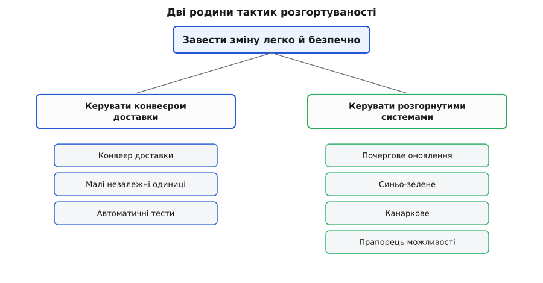
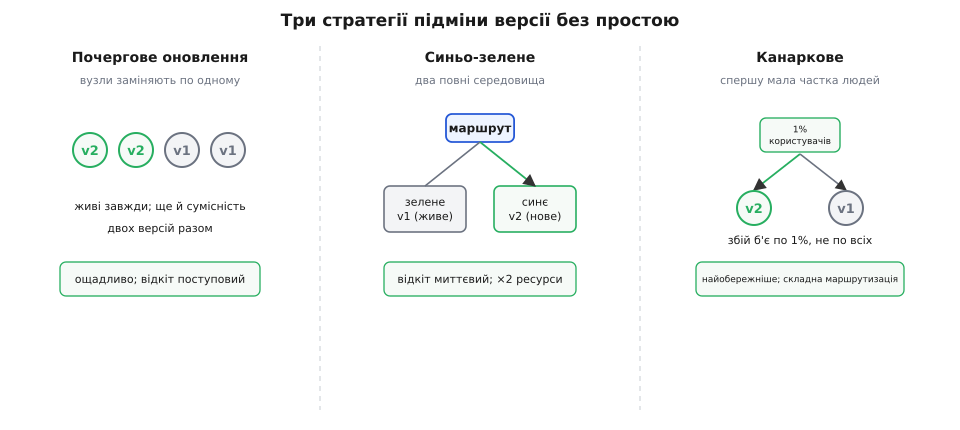
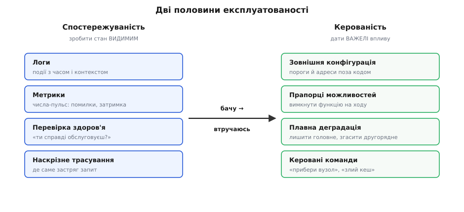

# Тактики експлуатованості й розгортуваності

<preknowlist>
- [Якісні атрибути («-ilities»)](topic:programming/quality-attributes) — що таке нефункціональна властивість системи (доступність, продуктивність, змінюваність) і чому вона окрема від функцій.
- [Сценарії атрибутів](topic:programming/attribute-scenarios) — як розмиту вимогу перетворити на перевірне речення стимул → артефакт → реакція → вимірна міра.
- [Тактика проти патерна](topic:programming/architectural-tactics) — тактика як одне точкове рішення на один атрибут, на відміну від патерна як готового пакета кількох тактик із зашитим компромісом.
- [Trade-off-аналіз](topic:programming/tradeoff-analysis) — будь-яке рішення купує один атрибут ціною іншого; як цю ціну називати й зважувати.
</preknowlist>

Система не закінчується релізом — вона там **починає жити**. Її розгортають, вона працює місяцями, її оновлюють десятки разів, вона падає о третій ночі, її треба діагностувати, підкрутити й підняти назад. Увесь цей час хтось — черговий інженер, скрипт, автомат — **керує нею наживо**. І дві властивості вирішують, буде це керування спокійним чи пеклом: наскільки легко **завести в систему зміну** (розгортуваність) і наскільки легко **бачити її стан і впливати на нього під час роботи** (експлуатованість). Обидві — не про код, який пишуть, а про систему, яку **тримають на плаву** роками.

Слова означимо точно. **Розгортуваність (англ. *deployability*, від *deploy*, з фр. *déployer* — розгортати військо в бойовий порядок)** — це властивість системи, що каже, як швидко, надійно й **малими порціями** нова версія доходить від коміту розробника до живого продакшену, і як легко її відкотити, якщо щось пішло не так. **Експлуатованість (англ. *operability*, від лат. *operari* — працювати, діяти)** — це властивість, що каже, наскільки зручно систему **спостерігати й керувати нею**, поки вона працює: чи видно, що всередині відбувається, чи можна змінити поведінку без зупинки, чи система сама підказує про свою біду.

Ці дві турботи здобули власні місця в архітектурному словнику не одразу. Класичний перелік атрибутів (продуктивність, доступність, змінюваність) склався ще у 1990-х, коли софт випускали раз на рік коробкою. Але з приходом безперервної доставки й хмари ситуація перевернулась: систему стали оновлювати **десятки разів на день**, і питання «як завести зміну легко й безпечно» перетворилось із дрібниці на головний біль. Тому у 4-му виданні *Software Architecture in Practice* (Басс, Клементс, Казман, Addison-Wesley, 2021 — усталене джерело сучасного каталогу атрибутів) **розгортуваність винесли в окремий розділ як повноправний якісний атрибут** — поряд із новими розділами про енергоощадність, інтегровність і безпеку життя. Це не мода: коли релізи стали щоденними, розгортання стало архітектурним рішенням, а не адміністративною дією наприкінці.

Розберімо обидва атрибути так, як розбирають будь-який: спершу який **сценарій** вони закривають, тоді на які **родини тактик** розпадаються, і — головне — **чим кожна тактика платить**, бо безкоштовних не буває.

## Спершу сценарій: без числа немає тактики

Тактика має сенс лише тоді, коли її ефект видно на вимірному числі — інакше це побажання, а не рішення. Тож почнімо не з тактик, а з того, що саме вони покращують.

Для розгортуваності головна міра — **час від коміту до продакшену** (англ. *lead time for changes*): скільки минає від миті, коли розробник зберіг зміну, до миті, коли вона працює для користувачів. Найкращі команди тримають цей час у хвилинах і розгортають по кілька разів на день; погано збудована система міряє його тижнями погоджень і ручних кроків. Сценарій розгортуваності звучить так:

```text
Стимул:   розробник закомітив перевірену зміну одного сервісу.
Артефакт: конвеєр доставки + продакшен-середовище.
Реакція:  зміна доходить до продакшену, під наглядом, з можливістю відкоту.
Міра:     час до продакшену < 30 хв; відкіт при збої < 5 хв; зачеплено 0 інших сервісів.
```

Для експлуатованості міра інша — вона про **життя вже розгорнутої системи**: скільки часу від появи проблеми до її **виявлення**, скільки — до **діагнозу**, скільки — до **втручання без зупинки**. Сценарій:

```text
Стимул:   один вузол почав відповідати вдесятеро повільніше.
Артефакт: працююча система + засоби спостереження й керування.
Реакція:  деградацію видно на дашборді, знайдено винний вузол, його прибрано з ротації.
Міра:     час до виявлення < 1 хв; до втручання < 5 хв; без перезапуску решти системи.
```

Обидва сценарії дають ціль у числах — і тепер тактики є куди цілитись. Пробіжімо родини.

## Розгортуваність: дві родини за двома цілями

Питання «як зробити доставку зміни швидкою й безпечною» природно розпадається надвоє — бо між комітом і працюючим користувачем є **дві різні ділянки**, і кожна має свій набір ходів. Перша ділянка — **шлях зміни крізь конвеєр** (від коміту до готового до випуску артефакту). Друга — **сам момент підміни живого продакшену** новою версією. Це і є дві родини тактик розгортуваності: **керувати конвеєром доставки** й **керувати розгорнутими системами** (саме так їх ділить дерево тактик у Басса й співавторів).



*Дві родини тактик розгортуваності — не довільний список, а по одній відповіді на кожну з двох ділянок шляху зміни: довести її до артефакту й підмінити нею продакшен.*

**Родина перша: керувати конвеєром доставки.** Мета — щоб зміна проходила від коміту до готового артефакту **швидко й автоматично**, без ручних воріт. Головна тактика — **конвеєр доставки** (англ. *deployment pipeline*): ланцюг автоматичних кроків, який запускається на кожен коміт — зібрати, прогнати тести, перевірити безпеку й ліцензії, зібрати готовий образ. Що більше кроків автоматизовано, то менше ручного погодження стоїть на шляху, а саме воно з'їдає дні. Сюди ж — **малі, незалежно розгортувані одиниці**: якщо систему порізано так, що один сервіс котиться **окремо** від інших, зміна не мусить чекати на реліз усього — вона їде сама. Тактика працює на міру «зачеплено 0 інших сервісів»: чим менша й самостійніша одиниця розгортання, тим дешевша й безпечніша її доставка.

**Родина друга: керувати розгорнутими системами.** Мета — щоб **сам момент підміни** був безпечним: щоб нову версію можна було ввести **поступово**, поспостерігати й **миттєво відкотити**, якщо вона зла. Тут живуть **стратегії розгортання** (їх розберемо нижче окремо, бо це найцінніша частина) і — окремою важливою тактикою — **прапорець можливості** (англ. *feature toggle*, або *feature flag*): вимикач, який **відділяє факт розгортання коду від факту його ввімкнення**. Код нової функції вже в продакшені, але заглушений прапорцем; вмикаєш його — і функція оживає без нового розгортання; вимикаєш — і гасиш її **миттєво**, не відкочуючи білд. Це перетворює «відкіт» із перебудови й передеплою на **зміну одного значення**.

> 🔧 **Навіщо це.** Прапорець рятує ту саму ніч, коли нова функція почала ламати замовлення. Без нього єдиний вихід — терміново зібрати й розгорнути попередню версію (хвилини паніки, ще й із ризиком нових помилок). З прапорцем черговий інженер гасить функцію одним перемиканням за секунди, замовлення знову йдуть, а розбір причини лишають на ранок. Прапорець купує **час на спокій**.

## Три стратегії підміни: пакети тактик другої родини

Найцінніше в другій родині — **як саме підмінити стару версію новою на живій системі**, не поваливши її. Наївний шлях — «погасити стару, підняти нову» — дає провал в обслуговуванні й, якщо нова зла, повний простій. Тому виробили три стратегії, і кожна — це вже **пакет тактик** із зашитим компромісом (як і будь-який патерн: кілька рішень, поєднаних так, щоб разом давали передбачувану поведінку).



*Три способи ввести нову версію без простою — кожен по-своєму торгує швидкістю відкоту, витратою ресурсів і ризиком побачити збій на живих користувачах.*

**Почергове оновлення (англ. *rolling upgrade*).** Заміняй вузли по одному: зняв один зі старою версією, підняв із новою, дочекався, що здоровий, — узяв наступний. Система весь час жива, бо решта вузлів обслуговує. Ціна: під час викочування **співіснують дві версії** (стара й нова обробляють запити водночас), тож вони мусять бути сумісні між собою — інакше користувач упіймає то одну поведінку, то іншу. Відкіт теж поступовий, не миттєвий.

**Синьо-зелене (англ. *blue-green*).** Тримай **два повні середовища**: «зелене» — те, що зараз обслуговує, «синє» — копія з новою версією. Прогрів синє, перевірив — і **перемкнув увесь трафік** із зеленого на синє одним рухом (зміною маршрутизації чи запису DNS). Пішло не так — перемкнув назад, теж миттєво. Ціна очевидна: треба **вдвічі більше ресурсів**, бо два повні середовища живуть паралельно бодай на час підміни.

**Канаркове (англ. *canary*, від шахтарської канарки — пташки, що першою чула отруйний газ і гинула, попереджаючи людей).** Випусти нову версію спершу на **малу частку користувачів** (скажімо, 1%), поспостерігай за метриками, і лише коли переконався, що все добре, — розкочуй на решту. Погана версія б'є по одному відсотку, а не по всіх. Ціна — **складність маршрутизації** (треба вміти вести частину користувачів на нову версію) і те, що ті кілька відсотків усе-таки стають піддослідними.

Помітно спільне: кожна стратегія купує **безпеку підміни**, а платить **ресурсами, сумісністю чи складністю маршрутизації**. Синьо-зелене — найдорожче ресурсами, зате найшвидший відкіт. Почергове — ощадливе, зате мусить терпіти дві версії разом. Канаркове — найобережніше до ризику, зате найскладніше в маршрутизації. Архітектор не «застосовує стратегію», а **обирає під сценарій**: наскільки болісний простій, скільки коштує подвоєне середовище, наскільки дорога помилка на живих людях. [Історію того, як щоденні релізи й хмара зробили розгортуваність окремим атрибутом](topic:programming/operability-tactics/hist-deployability-attribute.md), варто знати окремо — вона пояснює, чому цей словник з'явився саме у 2010-х.

## Експлуатованість: зробити систему видимою й керованою

Розгортуваність відповідає за те, як зміна **входить** у систему. Але щойно версія в продакшені, починається інша турбота: систему треба **тримати живою** — а це неможливо, поки ти її не **бачиш** і не можеш на неї **вплинути**. Саме це — експлуатованість, і вона теж розпадається на дві природні родини, за двома простими питаннями до працюючої системи: «**чи я знаю, що з тобою зараз?**» і «**чи я можу тебе підправити, не зупиняючи?**».

**Родина перша: спостережуваність — зробити стан видимим.** Не можна керувати тим, чого не бачиш. Система, що мовчить, поки не впаде, приховує свою біду до останнього — і черговий дізнається про аварію від розлюченого користувача, а не від приладу. Тактики цієї родини роблять внутрішній стан **назовні видимим**:

- **Логи** (англ. *log*, судновий журнал) — записувати важливі події з часом і контекстом, щоб потім відтворити, що сталося.
- **Метрики** (гр. *metron* — міра) — числа, що постійно вимірюють пульс системи: запитів на секунду, частка помилок, затримка, вільна пам'ять.
- **Перевірка здоров'я** (англ. *health check*) — точка, куди можна спитати «ти живий?» і дістати чесну відповідь: не просто «процес запущено», а «я справді обслуговую й моя база на місці».
- **Наскрізне трасування** (англ. *tracing*) — простежити один запит крізь усі сервіси, якими він пройшов, щоб побачити, **де саме** він застряг.

**Родина друга: керованість — зробити поведінку змінюваною наживо.** Бачити мало — треба ще мати **важелі**, якими на систему вплинути, не зупиняючи її. Тактики:

- **Зовнішня конфігурація** — тримати налаштування (пороги, адреси, ліміти) **поза кодом**, щоб їх крутити без перебудови; крайній випадок — конфіг, що перечитується наживо.
- **Ті самі прапорці можливостей** — вимикати підозрілу функцію на ходу (тактика служить обом атрибутам одразу — і безпечному розгортанню, і керуванню наживо).
- **Плавна деградація** (англ. *graceful degradation*) — коли частина відмовила, свідомо вимкнути другорядне й лишити головне живим, замість повалити все.
- **Керовані команди** — вміти сказати живій системі «злий кеш», «прибери цей вузол з ротації», «увімкни докладніший лог» — без перезапуску.



*Дві половини експлуатованості: спершу зробити стан видимим, тоді дати важелі впливу. Керованість спирається на спостережуваність — не бачачи, куди тиснути, важелем лише наробиш шкоди.*

Порядок тут не випадковий: керованість **спирається** на спостережуваність. Дати чергового важіль, але не дати зору — це посадити пілота в кабіну з вимкненими приладами: важелі є, а куди ними рухати — невідомо. Тому спостережуваність — фундамент, а керованість — надбудова над нею.

## Прапорець у коді: одна тактика, два атрибути

Подивімось на прапорець можливості впритул — бо це рідкісна тактика, що працює **на обидва атрибути одразу**: і на безпечне розгортання (код їде вимкненим), і на керування наживо (гасиш проблему перемиканням). Ось він у прошивці сервісу:

**Тактика «прапорець можливості»: відділити розгортання коду від його ввімкнення.**
:::tabs
```c
// Прапорці читаються з зовнішнього конфігу — крутяться БЕЗ перебудови й передеплою.
// Тактика купує КЕРОВАНІСТЬ (миттєве вимкнення злої функції)
// і БЕЗПЕЧНЕ РОЗГОРТАННЯ (новий код їде вимкненим, вмикається окремо),
// але платить СКЛАДНІСТЮ: кожна гілка коду тепер має два стани.
bool flag_enabled(const char *name) {
    return config_get_bool(name, /* усталено */ false);  // нема запису — вимкнено
}

int handle_order(order_t *o) {
    if (flag_enabled("new_pricing")) {
        return price_new(o);      // нова логіка — активна, лише коли прапорець піднято
    }
    return price_legacy(o);       // стара логіка — тиха гавань, доки нову не ввімкнули
}
```
```python
# Прапорці читаються з зовнішнього конфігу — крутяться БЕЗ перебудови й передеплою.
# Тактика купує КЕРОВАНІСТЬ (миттєве вимкнення злої функції)
# і БЕЗПЕЧНЕ РОЗГОРТАННЯ (новий код їде вимкненим, вмикається окремо),
# але платить СКЛАДНІСТЮ: кожна гілка коду тепер має два стани.
def flag_enabled(name: str) -> bool:
    return config.get_bool(name, default=False)  # нема запису — вимкнено


def handle_order(order: Order) -> Price:
    if flag_enabled("new_pricing"):
        return price_new(order)       # нова логіка — активна, лише коли прапорець піднято
    return price_legacy(order)        # стара логіка — тиха гавань, доки нову не ввімкнули
```
```go
// Прапорці читаються з зовнішнього конфігу — крутяться БЕЗ перебудови й передеплою.
// Тактика купує КЕРОВАНІСТЬ (миттєве вимкнення злої функції)
// і БЕЗПЕЧНЕ РОЗГОРТАННЯ (новий код їде вимкненим, вмикається окремо),
// але платить СКЛАДНІСТЮ: кожна гілка коду тепер має два стани.
func flagEnabled(name string) bool {
    return config.GetBool(name, false) // нема запису — вимкнено
}

func handleOrder(o *Order) Price {
    if flagEnabled("new_pricing") {
        return priceNew(o) // нова логіка — активна, лише коли прапорець піднято
    }
    return priceLegacy(o) // стара логіка — тиха гавань, доки нову не ввімкнули
}
```
:::

Розберемо, що саме тут куплено й за скільки. Куплено **дві речі**. Перша — **безпечне розгортання**: `price_new` уже в продакшені, але спить; його вмикають окремим рухом, коли готові, і на окремій частці користувачів. Друга — **миттєвий відкіт**: побачив, що нове ціноутворення рахує криво, — переставив прапорець у конфізі на `false`, і система тієї ж секунди повернулась на `price_legacy`, **без перебудови, без передеплою, без простою**.

Платиться теж двома валютами. Перша — **складність**: кожен прапорець — це розвилка, і тепер у коді живуть **обидві** гілки; щоб зрозуміти, що виконається, треба знати стан прапорця. Друга, підступніша — **борг прибирання**: коли функцію остаточно ввімкнули всім і вона прижилась, прапорець і стару гілку `price_legacy` треба **прибрати** — інакше система поступово заростає мертвими розвилками, і за рік ніхто не пам'ятає, що вмикає `new_pricing` і чи можна його чіпати.

> 🔧 **Навіщо це.** Оцей усталений `false` у `flag_enabled` — жива архітектура в одному рядку: **нова функція за замовчуванням вимкнена**. Забув налаштувати прапорець у новому середовищі — система поводиться по-старому, безпечно, а не вмикає непротестоване наосліп. Тактика керованості мало «поставити» прапорець — треба обрати **безпечний бік усталеного значення**, бо саме він спрацює тієї миті, коли про прапорець забудуть.

## Тактика ніколи не безкоштовна

Тепер — головне, без чого обидва атрибути перетворюються на карго-культ автоматизації «бо модно». **Кожна тактика має ціну**, тож це рішення, а не догма, і застосовується там, де експлуатованість чи розгортуваність справді важливі, а не всюди підряд. Це саме той обмін, що його ловить [trade-off-аналіз](topic:programming/tradeoff-analysis): виграв в одному атрибуті — заплатив іншим.

Подивись, чим платить кожна родина. Спостережуваність — логи, метрики, трасування — це **накладні витрати наживо**: кожен запис лога й кожна метрика забирають трохи процесора, місця й мережі; надмірне логування само стає гальмом і завалює диск. Синьо-зелене розгортання коштує **подвоєних ресурсів**. Прапорці й зовнішня конфігурація додають **непрямість і складність**: поведінка більше не видна з коду напряму — вона залежить від стану, який десь зовні. Конвеєр доставки треба **написати, тестувати й супроводжувати** — це окрема інженерна робота, а не безкоштовний подарунок.

Тому ці тактики — відповідь на конкретний сценарій, а не прикраса. Їх ставлять там, де ціна протилежного **справді висока**: де простій під час релізу коштує грошей (тоді синьо-зелене чи почергове окупається); де аварію треба ловити за хвилини, а не години (тоді спостережуваність життєво потрібна); де функції викочують часто й ризиковано (тоді прапорці й канаркове варті своєї складності). Проста система, яку оновлюють раз на місяць у неробочий час, не потребує ні синьо-зеленого, ні канаркового — там це порожня складність, оплачена ресурсами без користі.

Як зрозуміти, де саме тактика окупиться? Її чіпляють не до абстрактного «хай буде надійно», а до **записаного сценарію** з числом: «черговий гасить зламану функцію за 5 хвилин без передеплою» одразу вказує і родину (прапорець можливості), і міру успіху (5 хвилин, без білда). А коли зрозуміло, що система житиме довго й оновлюватиметься часто, розгортуваність та експлуатованість варто **закладати як окремі [архітектурні драйвери](topic:programming/architectural-drivers)** з самого початку — щоб конвеєр, прапорці й спостережуваність були частиною проєкту, а не аварійним латанням під тиском першої нічної аварії.

Ось як обидва атрибути складаються в один хід думки. Прийшла система, яку доведеться **тримати живою** роками — спитай про неї дві речі. Як зміна **входитиме** всередину? — постав конвеєр доставки, поріж на малі одиниці, обери стратегію підміни під ціну простою, відділи ввімкнення від розгортання прапорцем. Як ти **бачитимеш і керуватимеш** нею наживо? — дай логи, метрики й перевірку здоров'я, щоб бачити стан, і зовнішню конфігурацію з прапорцями, щоб на нього впливати без зупинки. І над кожним таким ходом — та сама тверда рамка: назви, **чим платиш** (ресурси, складність, накладні витрати), і став тактику лише туди, де ця плата дешевша за біль, від якого вона рятує. Експлуатованість і розгортуваність — не про те, щоб усе автоматизувати; вони про те, щоб систему, яку **справді доведеться тримати наживо**, було легко вести — саме там, де завтра о третій ночі задзвонить телефон.
