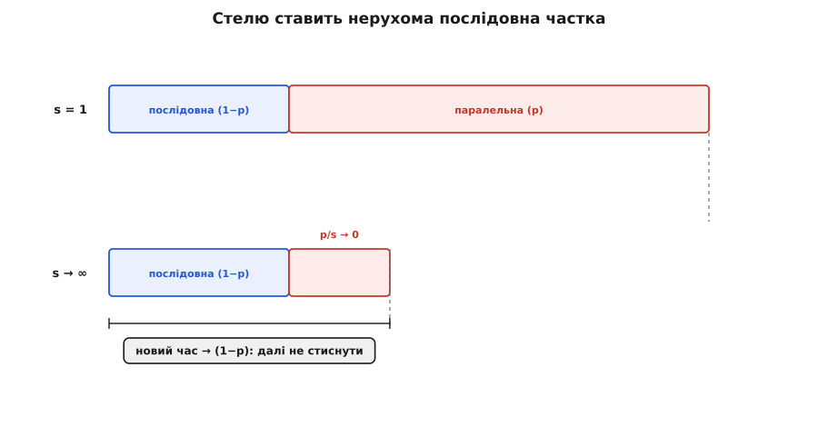

# 🧮 Два співвідношення продуктивності: закони Амдала й Літтла

Уся розмова про швидкість зводиться до двох чисел, які хочеться знати **наперед**, не запускаючи системи. Перше: якщо я вкладу вдвічі більше процесорів, чи поїде вдвічі швидше? Друге: якщо на сервіс сиплеться стільки-то запитів на секунду й кожен живе в ньому стільки-то часу, скільки їх сидить усередині одночасно й чи не переповниться черга? На кожне питання є коротка формула, яку можна вивести з нуля за кілька рядків — і саме виведення, а не сама формула, показує, **чому** межа така жорстка. Розберімо обидві не як готовий рецепт, а від першопричини: з чого вони зроблені й де ламаються.

## Закон Амдала: чому послідовна частка ставить стелю

### Означення й проста інтуїція

Уяви програму як смугу роботи. Частину цієї смуги можна виконувати **паралельно** — розкидати між багатьма виконавцями, і кожен гризе свій шматок водночас із рештою. А частину — **не можна**: вона за природою послідовна, її мусить робити хтось один, крок за кроком. Прочитати конфіг перед стартом. Записати всі результати в один спільний лог, рядок за рядком. Оновити єдиний лічильник під замком. Скільки б виконавців ти не найняв, ця частина не поділиться — вона займе стільки ж часу, як і на одному процесорі.

Закон Амдала — це просто чесний облік того, що станеться зі **сумарним** часом, коли паралельну частину прискорили, а послідовну ні. І висновок, який лякає новачків: навіть якщо паралельну частину прискорити нескінченно — до нуля часу, — загальний виграш упреться в ту саму нерухому послідовну частку. Вона стає дном, нижче якого не провалитись.

> 🔧 **Навіщо це.** Перш ніж купувати вдвічі більший сервер чи писати багатопотоковий код, порахуй закон Амдала на серветці. Якщо в задачі 25% роботи послідовної, то навіть за безмежної кількості ядер ти прискоришся щонайбільше вчетверо — і ніколи більше. Це відразу каже, чи варта гра свічок: інколи дешевше вигризти саму послідовну частку (прибрати спільний замок), ніж докидати залізо, яке впирається в стелю.

### Формальний апарат: виведення S = 1/((1−p) + p/s)

Виводьмо повільно, щоб кожен символ мав сенс. Візьмімо час роботи програми на **одному** виконавцеві й назвімо його одиницею — просто щоб рахувати частки, а не абсолютні секунди:

```text
T₁ = 1
```

Розділімо цей час на дві частки за їхньою природою. Нехай **p** — частка роботи, яку **можна** розпаралелити (0 ≤ p ≤ 1), а решта — послідовна, яку не можна. Тоді:

```text
послідовна частка = (1 − p)      // її не прискорити виконавцями
паралельна частка =  p           // її можна розкидати
1 = (1 − p) + p                   // разом дають усю роботу
```

Тепер увімкнімо **s** виконавців (s ядер, s потоків, s машин — байдуже; s ≥ 1). Що станеться з кожною часткою окремо — у цьому вся суть.

Послідовна частка `(1 − p)` **не змінюється**: її робить хтось один, додаткові виконавці стоять без діла. Скільки займала — стільки й займе.

Паралельна частка `p` у найкращому разі ділиться **рівно** між s виконавцями: кожен бере `p/s` роботи, і всі гризуть її водночас. Тому час на паралельну частину падає з `p` до `p/s`. (Це ідеалізація — про її межі за мить; поки беремо найкращий можливий випадок.)

Складімо новий час — на s виконавцях:

```text
T_s = (1 − p) + p/s
       └──┬──┘   └┬┘
    незмінна    поділена
    частина     на s
```

Прискорення (лат. *speed-up*) — це просто у **скільки разів** новий час менший за старий: скільки роботи за той самий проміжок, або наскільки коротша смуга. За означенням:

```text
S = T₁ / T_s
```

Підставмо `T₁ = 1` і наш вираз для `T_s` — і формула сама складається:

```text
        T₁            1
S = ───────── = ─────────────────
       T_s        (1 − p) + p/s
```

Ось і весь закон Амдала. Жодної магії — це просте ділення старого часу на новий, де ми чесно врахували, що прискорилась лише паралельна частка. Уся вага — у знаменнику: доданок `(1 − p)` **не залежить від s** і тримає весь вираз знизу.

### Чому стеля — саме 1/(1−p)

Тепер найважливіший хід — подивитись, що буде за **необмеженого** числа виконавців. Спрямуймо s до нескінченності. Доданок `p/s` — паралельна робота, поділена на дедалі більшу кількість рук, — стискається до нуля:

```text
s → ∞   ⇒   p/s → 0   ⇒   T_s → (1 − p) + 0 = (1 − p)
```

А отже прискорення впирається в стелю:

```text
              1
S_max = ───────────      (за s → ∞)
           (1 − p)
```

Прочитаймо це вголос, бо тут вся мораль. **Хоч би скільки виконавців ти дав — навіть безмежно багато — швидше за `1/(1−p)` не буде.** Причина фізична, не математичний фокус: паралельну частину можна вигризти хоч до нуля, але послідовна `(1 − p)` лишається на місці, і саме вона під кінець з'їдає весь час. Смуга не може стати коротшою за свій незмінний шматок.

Звідси й практичне гасло: **дивись на послідовну частку, а не на кількість ядер.** Якщо `(1 − p)` = 0.1 (десята частина роботи послідовна), стеля — рівно 10× і ні на йоту більше, скільки б тисяч ядер ти не купив. Хочеш вище стелі — не додавай залізо, а **зменшуй саму послідовну частку**: розбивай спільний замок, роби лог на кілька потоків, прибирай єдину точку, через яку все шикується в чергу.



*Чому стеля не піддається: паралельну частку можна стиснути хоч у нуль, але послідовна частка нерухома — вона й стає дном прискорення 1/(1−p).*

### Worked-приклад: 25% послідовної роботи, 8 ядер і межа

**Умова.** Обробник запиту витрачає чверть часу на послідовну підготовку (розбір запиту, читання спільного конфіга, запис у єдиний журнал), а три чверті — на незалежне обчислення, яке легко ділиться між ядрами. Скільки дадуть 8 ядер? А нескінченність?**

:::tabs
```cpp
// Частки роботи (виміряні профайлером на одному ядрі):
double p = 0.75;        // паралельна частка (незалежне обчислення)
// послідовна частка = 1 − p = 0.25

// --- 8 ядер ---
int    s   = 8;
double Ts  = (1.0 - p) + p / s;     // = 0.25 + 0.75/8
                                    // = 0.25 + 0.09375
                                    // = 0.34375
double S8  = 1.0 / Ts;              // = 1 / 0.34375
                                    // ≈ 2.909  → лише ~2.9×, не 8×!

// --- межа: s → ∞ ---
double Smax = 1.0 / (1.0 - p);      // = 1 / 0.25
                                    // = 4.0   → стеля рівно 4×
```
```python
# Частки роботи (виміряні профайлером на одному ядрі):
p = 0.75                 # паралельна частка (незалежне обчислення)
# послідовна частка = 1 − p = 0.25

# --- 8 ядер ---
s  = 8
Ts = (1.0 - p) + p / s              # = 0.25 + 0.75/8
                                    # = 0.25 + 0.09375
                                    # = 0.34375
S8 = 1.0 / Ts                       # = 1 / 0.34375
                                    # ≈ 2.909  → лише ~2.9×, не 8×!

# --- межа: s → ∞ ---
Smax = 1.0 / (1.0 - p)              # = 1 / 0.25
                                    # = 4.0   → стеля рівно 4×
```
:::

**Висновок.** Вісім ядер дали не восьмикратне прискорення, а лише **2.9×** — бо чверть роботи не поділилась і сама з'їла більшу частину нового часу. Ба гірше: навіть безмежжя ядер витисне щонайбільше **4×**, і після п'ятого-шостого ядра кожне наступне додає жалюгідні крихти. Це і є та причина, чому в статті-власниці сказано «подвоєння ядер рідко дає подвоєння швидкості»: доданок `(1 − p)` у знаменнику не зменшується від заліза — його зменшує тільки перепроєктування. Якби тут скоротити послідовну частку вдвічі (з 0.25 до 0.125), стеля піднялася б з 4× до 8× — і це коштувало б думки, а не грошей.

### Де закон ламається — обидва боки

Формула ідеалізує в **обидва боки**, і чесно знати, куди саме.

**Оптимістичний бік:** ми припустили, що паралельна частка ділиться на s **рівно** й **безкоштовно**. У житті ні. Розкидати роботу між ядрами коштує: синхронізація, замки на спільних даних, пересилання результатів, нерівномірний поділ (одне ядро скінчило, чекає на відстаючих). Тому реальне прискорення зазвичай **нижче** за амдалівську стелю — формула дає верхню межу, недосяжний ідеал. Спільний замок на черзі з прикладу статті — саме така прихована послідовна ланка: коли чотири потоки б'ються за один мьютекс, частина `p`, яку ти вважав паралельною, потай перетікає в `(1 − p)`.

**Песимістичний бік:** закон припускає, що обсяг роботи **фіксований** — та сама задача на дедалі більшій кількості ядер. Але в реальних системах, отримавши більше машин, беруться за **більшу** задачу: більший масив, детальніша сітка, більше клієнтів. Тоді послідовна частка не росте разом із паралельною, її **відносна** вага падає — і масштабування виходить куди кращим за амдалівську стелю. Цей інший погляд («фіксуємо час, ростимо задачу») дав Джон Ґуставсон 1988 року як доповнення, а не спростування Амдала: обидва праві, просто відповідають на різні питання — «та сама робота швидше» проти «більша робота за той самий час».

Історично формулу пов'язують із доповіддю Джина Амдала 1967 року «Validity of the Single-Processor Approach to Achieving Large Scale Computing Capabilities» (усталений факт; AFIPS, том 30, с. 483–485) — цікаво, що Амдал доводив нею протилежне до звичного трактування: що ставку варто робити на **швидкий одинарний** процесор, бо багатопроцесорність упирається в цю саму стелю. Компактний алгебричний запис `S = 1/((1−p) + p/s)` систематизували пізніше — сам Амдал міркування виклав словами й графіком, а не цією формулою.

> 🔧 **Навіщо це.** Коли команда просить бюджет на «розпаралелити все», перший діагностичний хід — оцінити `p` профайлером: яка частка часу справді незалежна. Далі стеля `1/(1−p)` одразу каже, чи є куди рости. Якщо `p` = 0.5, максимум 2× хоч на тисячі ядер — і, можливо, розумніше вкласти зусилля в саму послідовну частку, ніж у паралелізацію, що впреться в мур.

## Закон Літтла: черга = темп × час

### Означення й проста інтуїція

Другий закон — про **черги** й **потік**, і він приголомшливо загальний. Уяви будь-яку систему, куди щось **входить**, там **проводить час** і **виходить**: касу супермаркету, чергу запитів до сервера, стіл замовлень у ресторані, конвеєр на заводі. Закон Літтла каже, що в усталеному режимі три величини жорстко зв'язані:

```text
L = λ · W
```

де **L** — скільки одиниць у середньому **сидить у системі** одночасно (довжина черги разом із тими, кого вже обслуговують), **λ** (грецька «лямбда») — **темп приходу**, скільки одиниць входить за одиницю часу, а **W** — скільки часу в середньому одиниця **проводить у системі** від входу до виходу.

Інтуїція — на кухні. Уяви ресторан, куди заходить **λ = 30** відвідувачів за годину, і кожен сидить у середньому **W = 2** години. Скільки людей у залі в будь-яку мить? Здоровий глузд каже: 30 на годину × 2 години = **60**. І це рівно `L = λW`. Логіка залізна: якщо стільки входить щогодини й кожен затримується на дві години, то в кожен момент усередині «накопичено» дві години припливу — 60 людей. Заходило б удвічі повільніше або сиділи б удвічі менше — у залі було б удвічі менше.

> 🔧 **Навіщо це.** Це формула для прикидки на серветці **до** написання коду. Знаєш очікуваний темп запитів λ і цільову затримку W зі сценарію — миттю рахуєш L, скільки запитів висітиме в системі одночасно, а отже скільки пам'яті під них тримати, який розмір пулу потоків і черги закладати, чи не переповниться буфер. Один множник — і ти вже знаєш розмір черги, не запустивши жодного навантаження.

### Чому це працює: збереження потоку

Чому таке просте співвідношення тримається **завжди** — незалежно від того, як саме приходять запити (рівномірно чи пачками), як довго обслуговуються, у якому порядку їх беруть? Бо в основі — **збереження**: у сталому режимі скільки входить, стільки й виходить, ніщо не накопичується і не зникає.

Розгорнімо цю думку до майже-доведення через площу. Намалюймо на осі часу для кожної одиниці **горизонтальну смужку**: від моменту, коли вона ввійшла, до моменту, коли вийшла. Довжина смужки — це час у системі, тобто **W** для цієї одиниці. Тепер поглянь на цю картину двома способами й прирівняй.

**Погляд «по вертикалі» (скільки всередині зараз).** Візьми будь-який момент часу й проведи вертикальну лінію. Скільки смужок вона перетне — стільки одиниць саме зараз у системі. Усереднивши по всьому часу, дістаємо `L` — середню заповненість. Тобто **сумарна площа всіх смужок ділена на час спостереження = L**.

**Погляд «по горизонталі» (скільки пройшло й по скільки сиділи).** Та сама сумарна площа — це просто сума довжин усіх смужок. Довжин стільки, скільки одиниць пройшло; за час спостереження їх увійшло `λ · (час)` штук, і кожна дала смужку завдовжки в середньому `W`. Тобто **сумарна площа = (кількість одиниць) × (середня довжина) = λ · час · W**.

Одна й та сама площа, порахована двома способами:

```
площа / час = L                        (вертикальний погляд)
площа       = λ · час · W  ⇒  площа / час = λ · W   (горизонтальний)

⇒   L = λ · W
```

Ось звідки береться закон — з тотожності площі, порахованої «стовпчиками» й «рядками». І тепер видно, **чому** він байдужий до розподілів: ми ніде не питали, як саме розкидані входи чи скільки триває обслуговування конкретної одиниці. Потрібне лише одне — щоб система була **усталена** (steady state): в середньому нічого не накопичується, смужки не тікають у нескінченність, три середні скінченні. За цієї єдиної умови рівність тримається для будь-якої дисципліни обслуговування.

Саме тому це — **закон**, а не наближення: Джон Д. К. Літтл 1961 року дав йому строге доведення (усталений факт; «A Proof for the Queueing Formula: L = λW», *Operations Research*, том 9, с. 383–387), показавши, що воно тримається за дуже загальних умов, без жодних припущень про конкретні розподіли приходу чи обслуговування. Саме́ співвідношення інженери-практики застосовували й раніше — Літтл дав те, чого бракувало: доказ, що воно правдиве завжди, коли є усталений режим.

### Три форми одного закону — під те, що шукаєш

Оскільки це рівність трьох величин, її перевертають під невідоме — і кожна форма відповідає на своє питання:

```text
L = λ · W        // скільки в системі, якщо знаю темп і час
W = L / λ         // яка затримка, якщо знаю заповненість і темп
λ = L / W         // який темп витримаю, якщо задано межу черги й час
```

Найкорисніша на практиці часто **друга**: `W = L / λ`. Вона зв'язує затримку з заповненістю — і пояснює, чому **перевантажена черга роздуває час відповіді**. Якщо темп приходу λ фіксований, а через затор у системі накопичилось багато (L зросло), то й час W кожного, хто чекає, зростає пропорційно. Черга завдовжки L при темпі λ означає, що новоприбулий просидить `L/λ` часу, поки перед ним розсмокчеться. Ось математична причина, чому під навантаженням затримки не ростуть плавно, а **вибухають**: L набігає швидше, ніж система встигає випускати.

### Worked-приклад: 200 запитів/с, 50 мс на запит

**Умова.** Веб-сервіс приймає в середньому 200 запитів за секунду, і кожен запит живе в системі (від приходу до відповіді) в середньому 50 мілісекунд. Скільки запитів обробляється **одночасно**, і що це каже про пул потоків?**

:::tabs
```cpp
// Дано зі сценарію продуктивності:
double lambda = 200.0;      // запитів на секунду (темп приходу)
double W      = 0.050;      // секунд у системі на запит (50 мс)

// Закон Літтла — скільки «в польоті» одночасно:
double L = lambda * W;      // = 200 · 0.050
                            // = 10.0  → у середньому 10 запитів у роботі

// Обернена перевірка: якщо пул тримає лише 4 потоки,
// а L = 10 хоче 10 одночасних — 6 запитів СТОЯТИМУТЬ у черзі.
// Щоб W лишалось 50 мс, потрібно щонайменше ⌈L⌉ = 10 виконавців.
```
```python
# Дано зі сценарію продуктивності:
lambda_ = 200.0             # запитів на секунду (темп приходу)
W       = 0.050             # секунд у системі на запит (50 мс)

# Закон Літтла — скільки «в польоті» одночасно:
L = lambda_ * W             # = 200 · 0.050
                            # = 10.0  → у середньому 10 запитів у роботі

# Обернена перевірка: якщо пул тримає лише 4 потоки,
# а L = 10 хоче 10 одночасних — 6 запитів СТОЯТИМУТЬ у черзі.
# Щоб W лишалось 50 мс, потрібно щонайменше ⌈L⌉ = 10 виконавців.
```
:::

**Висновок.** У кожну мить у системі «висить» у середньому **10 запитів**. Це число одразу диктує розмір: пул менший за 10 потоків не встигатиме, запити почнуть чекати, і W (а з ним затримка, яку ти пообіцяв у сценарії) поповзе вгору. І навпаки — тримати 200 потоків «про запас» немає сенсу: закон каже, що одночасних лише 10, решта ресурсу простоюватиме. Одне множення дало і мінімальний розмір пулу, і оцінку пам'яті (10 запитів × вага буфера кожного), і сигнал, коли черга почне рости — усе **до** першого навантажувального тесту.

Так само в інший бік. Хочеш витримати λ = 1000 запитів/с із тією ж затримкою W = 50 мс? Тоді `L = 1000 · 0.05 = 50` одночасних — потрібно вже 50 виконавців або горизонтальне розмноження на репліки. А якщо машина фізично тягне лише 20 одночасних, то з `λ = L/W = 20/0.05 = 400` видно стелю: більше ніж 400 запитів/с при цій затримці вона не проковтне — далі або черга росте (і W вибухає), або запити треба відкидати. Один рядок арифметики окреслює межу пропускності ще на серветці.

## Як обидва закони змикаються над однією смугою часу

Наостанок — чому ці два співвідношення стоять поряд у розмові про продуктивність, хоч прийшли з різних світів (Амдал — із суперечки про суперкомп'ютери, Літтл — із теорії черг). Вони б'ють по **двох різних частинах** того самого часу відгуку.

Закон Амдала — про **роботу**: коли система реально рахує, наскільки це рахування можна прискорити паралельністю. Він ставить стелю на виграш від додавання виконавців і каже, що ту стелю визначає незмінна послідовна частка. Це інструмент того боку смуги, де процесор зайнятий.

Закон Літтла — про **чекання й потік**: коли одиниці стоять у черзі, він зв'язує довжину тієї черги з темпом і затримкою. Він не прискорює нічого — він **прогнозує**, скільки всього накопичиться і як довго кожен просидить, щоб ти заклав правильні розміри й не дав черзі вибухнути. Це інструмент того боку смуги, де система чекає.

Разом вони роблять прикидку продуктивності **арифметичною, а не гаданням**. Перш ніж писати код: Амдалом оціни, чи взагалі варта паралелізація й де її стеля; Літтлом — скільки запитів висітиме одночасно й чи витримає це пам'ять і пул. Два множення й одне ділення на серветці — і ти вже знаєш обриси системи, яку ще не збудував. Саме тому обидва закони живуть у словнику архітектора поряд: один тримає верхню межу того, як швидко можна **порахувати**, другий — того, скільки можна **пропустити**, не захлинувшись.
