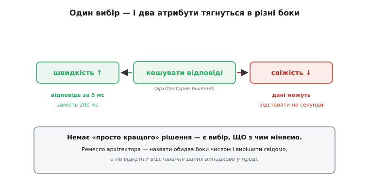
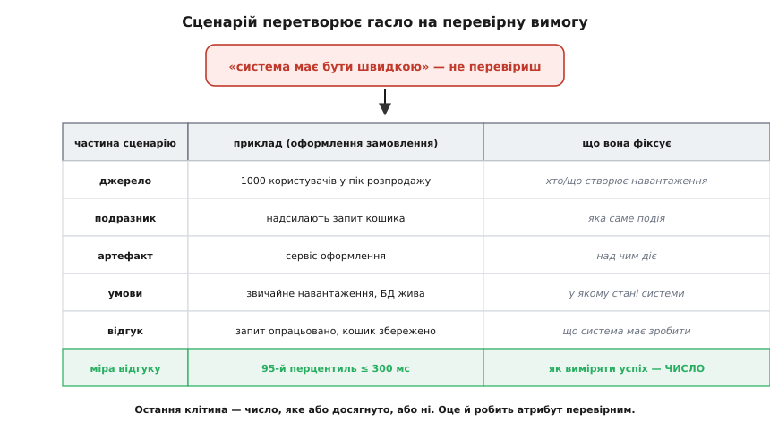
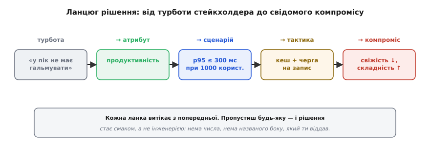

# Якісні атрибути («-ilities»)

<preknowlist>
- [Роль архітектора](book:programming/architect-role) — що таке архітектурне рішення й чим воно відрізняється від звичайного коду: рішення, яке дорого міняти згодом.
- [Зчеплення і зв'язність](book:programming/coupling-cohesion) — базова мова про те, як частини системи залежать одна від одної; без неї важко відчути, чому одні рішення легко міняти, а інші ні.
</preknowlist>

Запитай п'ятьох людей, чи «добра» їхня система, — почуєш п'ять різних відповідей. Для одного добра — та, що витримує чорну п'ятницю. Для іншого — та, у якій новий розробник розбереться за тиждень. Для третього — та, що не втрачає замовлення, навіть коли впала база даних. Усі троє мають рацію, і всі троє говорять про різне. Поки ці «добре» лишаються в голові як відчуття, сперечатися про архітектуру безнадійно: кожен захищає свою невисловлену турботу.

Якісні атрибути — це спосіб витягнути ці турботи на світло й дати їм імена. Продуктивність, доступність, безпека, змінюваність, тестовність, експлуатованість — кожне слово називає **одну грань того, наскільки добре система робить те, що робить**. Не *що* вона робить (це функції — оформити замовлення, надіслати лист), а *як добре*: швидко, надійно, під навантаженням, з можливістю змінити завтра.

> 🔧 **Навіщо це.** Функції описують систему, яку хоче замовник. Якісні атрибути описують систему, яку доведеться експлуатувати два роки. Саме вони, а не список функцій, диктують форму архітектури: одну й ту саму функцію «показати стрічку» можна побудувати десятком способів, і вибирати між ними ти будеш за атрибутами — цей швидший, той дешевший, цей переживе пік.

## Чому їх звуть «-ilities»

Придивись до слів: reliab**ility**, scalab**ility**, maintainab**ility**, testab**ility**, observab**ility**. В англійській майже всі назви цих властивостей закінчуються суфіксом *-ility* (від латинського *-abilitas* — «здатність до чогось»). Звідси й прижилося жаргонне збірне ім'я — «-ilities». Українською природніше казати **якісні атрибути** або **нефункційні вимоги**, але «-ility» ти зустрінеш у будь-якій розмові архітекторів, тож варто впізнавати.

Слово «нефункційні» трохи оманливе — воно ніби каже «неголовне». Насправді все навпаки. Функцію «переказати гроші» напише будь-хто; зробити так, щоб переказ **ніколи не пройшов двічі** й **завершився за 100 мс навіть під навантаженням**, — оце й є справжня інженерна задача. Тому багато хто свідомо уникає слова «нефункційні» й каже саме «якісні атрибути»: воно чесніше показує, що йдеться про якість, а не про другорядне.

## Головна правда: атрибути воюють між собою

Якби атрибути були незалежні, архітектури не існувало б як ремесла — просто крути кожну ручку на максимум. Уся складність у тім, що ручки з'єднані. **Покращуючи один атрибут, ти майже завжди псуєш інший.** Це не невдача проєкту, це природа матеріалу.

Кілька класичних пар, що тягнуться в різні боки:

```c
швидкість   ⇄  свіжість даних   (кеш пришвидшує, але дані відстають)
безпека     ⇄  зручність        (кожна перевірка — ще один крок для користувача)
надійність  ⇄  вартість         (резерв, репліки, дубль — усе коштує грошей)
гнучкість   ⇄  простота         (кожна точка розширення — ще один спосіб зламатися)
швидкодія   ⇄  змінюваність     (ручна оптимізація прибиває код цвяхами до заліза)
```

Візьмімо найпростіший приклад — кеш. Ти вирішуєш зберігати відповіді сервера, щоб віддавати їх за 5 мс замість 200 мс. Продуктивність підскочила. Але тепер користувач може побачити дані, які вже застаріли на кілька секунд, поки кеш не оновиться. Ти **не отримав** швидкість безкоштовно — ти виміняв її на свіжість.



*Одне й те саме рішення штовхає один атрибут угору, а інший — вниз. Робота архітектора — не знайти чарівне рішення без мінусів (його нема), а свідомо обрати, чим пожертвувати, і назвати обидва боки числом.*

Ось чому «зробіть архітектуру якнайкращою» — не завдання, а самообман. Кращою для *чого*? Питання завжди в тім, **який атрибут для цієї системи головний і чим заради нього не шкода пожертвувати**. Банківський бекенд віддасть швидкість за узгодженість; стрічка соцмережі — навпаки. Однакового коду тут бути не може, бо різні атрибути в пріоритеті.

Аналогія — конструктор моста. Він не будує «найкращий міст». Він знає навантаження, проліт, бюджет, вітрове навантаження — і обирає ферму, яка задовольняє все це разом. Додай жорсткості — виросте вага й ціна; полегши — впаде запас міцності. Немає моста, кращого за всіма осями одразу; є міст, що влучив у **свій** набір вимог. Аналогія ламається в одному: міст після зведення майже не міняють, а систему міняють щотижня — тому серед атрибутів софту так високо стоїть змінюваність, якої мостам майже не потрібно.

## Гасло — це ще не вимога

Найпоширеніша помилка — записати атрибут гаслом і вважати, що вимога є. «Система має бути швидкою». «Має бути надійною». «Має легко масштабуватися». Жодне з цих речень **не можна перевірити** — а отже, це не вимоги, а побажання. Швидкою — це за скільки? Для скількох користувачів? У якому стані системи? Двоє інженерів прочитають «швидко» по-різному й побудують різне, і обидва будуть упевнені, що виконали вимогу.

Атрибут стає інженерним, коли його переписують у **сценарій** — конкретну ситуацію з виміром успіху. Замість «система швидка» — «за звичайного навантаження 95% запитів кошика опрацьовуються за 300 мс або швидше». Тепер це або досягнуто, або ні; можна написати тест, повісити графік, посперечатися з цифрою в руках.



*Класична анатомія сценарію якісного атрибута: хто створює навантаження, яка подія, над чим, у якому стані системи, що вона має зробити — і, найголовніше, як виміряти успіх числом. Остання клітина перетворює гасло на перевірну вимогу.*

Ключова клітина — остання, **міра відгуку**. Без числа сценарій знову сповзає в побажання. З числом він стає контрактом: команда знає, куди цілитися, а перевірка знає, коли зупинитися. Як саме будувати такі сценарії й на які пастки чатує «одне магічне число замість розподілу» — окрема тема; тут досить запам'ятати, що **атрибут без сценарію непридатний до роботи**.

> 🔧 **Навіщо це.** Число в сценарії — це те, що ти згодом винесеш у автоматичну перевірку архітектури: тест продуктивності в конвеєрі, алерт на доступність, перевірку часу складання. Поки атрибут — гасло, автоматизувати нічого; щойно він число — його стереже машина, а не чиясь пам'ять.

Дехто виносить сценарії атрибутів у окремий артефакт — [сценарії якісних атрибутів](book:programming/attribute-scenarios) як формат, де кожна вимога має джерело, подразник і вимірний відгук. Це рятує від нескінченних суперечок «а що ти мав на увазі під надійним».

## Їх забагато — обирай драйвери

Каталоги якісних атрибутів налічують десятки назв, і стандарт якості ПЗ (ISO 25010) впорядковує їх у групи — надійність, продуктивність, безпека, супроводжуваність, сумісність, зручність, переносність. Спокуса — узятися за всі. Це шлях до паралічу: тягнучи вгору кожен атрибут потроху, не витягнеш жоден і роздмухаєш систему.

Правда в тім, що **форму архітектури визначають лише кілька атрибутів** — ті, заради яких доводиться приймати важкі, дорогі-в-скасуванні рішення. Їх звуть **архітектурними драйверами**. Для торгової платформи це можуть бути пропускна здатність і доступність; для медичного пристрою — безпека й надійність; для стартапу, що шукає ринок, — змінюваність, бо гіпотези міняються щотижня. Решта атрибутів теж важлива, але вона не *гне* архітектуру — її забезпечують звичайним якісним кодом, не структурними рішеннями.

Відрізнити драйвер просто питанням: **якби цієї вимоги не було, архітектура була б іншою?** Якщо так — це драйвер, він заслуговує окремої уваги й свого сценарію. Якщо система виглядала б однаково — атрибут важливий, але не архітектурний. Як виявляти цей короткий список і не проґавити тихий, але вбивчий атрибут — предмет роботи над [архітектурними драйверами](book:programming/architectural-drivers).

## Від атрибута до рішення: тактики й компроміс

Назвати атрибут і виміряти його — півсправи. Далі його треба **досягти**, і тут архітектор тягнеться по відомі прийоми — **тактики**. Тактика — це маленький, перевірений роками хід, що штовхає один конкретний атрибут у потрібний бік. Хочеш доступності — вводь резерв і перевірки живості. Хочеш продуктивності — кешуй, розпаралелюй, зменшуй роботу на запит. Хочеш змінюваності — ховай мінливе за стабільним інтерфейсом, розривай зчеплення. Ці ходи не патенти й не магія; це словник рішень, який архітектор тримає в голові, щоб не винаходити велосипед щоразу. Повний набір і те, як тактики збираються в патерни, — окрема велика тема [тактик](book:programming/architectural-tactics).

Але кожна тактика повертає нас до головної правди: **вона щось коштує**. Кеш коштує свіжості й пам'яті. Резерв коштує грошей і складності. Точка розширення коштує ще одного способу зламатися. Тому реальне рішення — це завжди ланцюг: турбота стейкхолдера → який це атрибут → сценарій із числом → тактика, що його дає → і чесно названий бік, який ти за це віддав.



*Повний ланцюг архітектурного рішення. Пропустиш будь-яку ланку — і вибір стає смаком: нема названого атрибута, нема числа, нема усвідомленого боку, який ти віддав. Саме проходження всього ланцюга відрізняє інженерне рішення від «мені так здалося правильним».*

Коли таких рішень багато й вони конфліктують, потрібен спосіб їх зважити — не по одному, а разом, з очима на компроміси. Це робота [trade-off-аналізу](book:programming/tradeoff-analysis): виявити, де тактика заради одного атрибута б'є по іншому, і вирішити свідомо. А коли ставки високі й хочеться перевірити архітектуру *до* того, як її побудували, застосовують структуровані методи оцінювання — найвідоміший з них, [ATAM](book:programming/atam-lite), саме й полягає в тому, щоб зібрати стейкхолдерів, зібрати сценарії атрибутів і знайти точки, де архітектура ризикує їх не витримати.

## Worked-приклад: гасло, якому не можна вірити

Уяви шматок коду, що начебто «забезпечує продуктивність» — обробник, який кешує результат. Питання не в тім, чи він швидкий, а в тім, **який атрибут він тихо приніс у жертву** і чи знає про це система.

**Умова.** Кеш віддає збережене значення, поки воно «свіже» — не старіше за задане вікно. Треба, щоб код не просто пришвидшував, а *чесно* показував межу свіжості, інакше атрибут «свіжість» деградує непомітно.

:::tabs
```c
#include <stdint.h>
#include <stdbool.h>

typedef struct {
    uint32_t value;        // збережена відповідь
    uint32_t stored_at_ms; // коли поклали в кеш
    bool     valid;        // чи є що віддавати
} Cache;

// max_age_ms — контракт свіжості: наскільки застарілі дані ми ще
// згодні віддавати. Це ЧИСЛО зі сценарію атрибута, а не випадкова стала.
bool cache_get(const Cache *c, uint32_t now_ms,
               uint32_t max_age_ms, uint32_t *out) {
    if (!c->valid)
        return false;                       // кеш порожній — доведеться рахувати
    if (now_ms - c->stored_at_ms > max_age_ms)
        return false;                       // застаріло понад дозволене — теж рахувати
    *out = c->value;                        // свіже — швидкий шлях
    return true;
}
```
```cpp
#include <cstdint>
#include <optional>

struct Cache {
    std::uint32_t value       = 0;      // збережена відповідь
    std::uint32_t stored_at_ms = 0;     // коли поклали в кеш
    bool          valid       = false;  // чи є що віддавати
};

// max_age_ms — контракт свіжості: наскільки застарілі дані ми ще
// згодні віддавати. Це ЧИСЛО зі сценарію атрибута, а не випадкова стала.
// std::optional — природний аналог «bool + out-параметр».
std::optional<std::uint32_t> cache_get(const Cache& c, std::uint32_t now_ms,
                                       std::uint32_t max_age_ms) {
    if (!c.valid)
        return std::nullopt;                // кеш порожній — доведеться рахувати
    if (now_ms - c.stored_at_ms > max_age_ms)
        return std::nullopt;                // застаріло понад дозволене — теж рахувати
    return c.value;                         // свіже — швидкий шлях
}
```
```python
from dataclasses import dataclass

@dataclass
class Cache:
    value: int = 0          # збережена відповідь
    stored_at_ms: int = 0   # коли поклали в кеш
    valid: bool = False     # чи є що віддавати

# max_age_ms — контракт свіжості: наскільки застарілі дані ми ще
# згодні віддавати. Це ЧИСЛО зі сценарію атрибута, а не випадкова стала.
# Повертаємо int | None — пітонічний аналог «bool + out-параметр».
def cache_get(c: Cache, now_ms: int, max_age_ms: int) -> int | None:
    if not c.valid:
        return None                         # кеш порожній — доведеться рахувати
    if now_ms - c.stored_at_ms > max_age_ms:
        return None                         # застаріло понад дозволене — теж рахувати
    return c.value                          # свіже — швидкий шлях
```
```go
// max_age_ms — контракт свіжості: наскільки застарілі дані ми ще
// згодні віддавати. Це ЧИСЛО зі сценарію атрибута, а не випадкова стала.
type Cache struct {
    Value       uint32 // збережена відповідь
    StoredAtMs  uint32 // коли поклали в кеш
    Valid       bool   // чи є що віддавати
}

// Повертаємо (значення, ok) — канонічний Go-аналог «bool + out-параметр».
func (c *Cache) Get(nowMs, maxAgeMs uint32) (uint32, bool) {
    if !c.Valid {
        return 0, false // кеш порожній — доведеться рахувати
    }
    if nowMs-c.StoredAtMs > maxAgeMs {
        return 0, false // застаріло понад дозволене — теж рахувати
    }
    return c.Value, true // свіже — швидкий шлях
}
```
:::

Розберемо, що тут насправді відбувається на очах:

```
1. Швидкість (атрибут A) росте:
   свіже влучання повертає значення без обчислення — гілка *out = value.

2. Свіжість (атрибут B) НЕ віддана мовчки:
   max_age_ms — явна межа. Дані старші за неї не повертаються;
   код чесно каже «рахуй заново», а не підсовує протухле.

3. Компроміс став ВИДИМИМ:
   вибір «швидкість ⇄ свіжість» тепер сидить в одному числі — max_age_ms.
   Хочеш свіжіше — зменшуй його (більше промахів, менше виграш швидкості).
   Хочеш швидше — збільшуй (більше влучань, дані можуть відставати сильніше).
```

**Висновок.** Той самий обробник міг би просто повертати `c->value`, «бо так швидше», — і атрибут свіжості деградував би непомітно, аж поки хтось у проді не побачив би секундне відставання й не почав шукати привида. Різниця не в швидкості коду, а в тім, що компроміс **названо й винесено в один параметр**, яким можна керувати. Це і є якісні атрибути в дії: не гасло «зробимо швидко», а число, за яким видно ціну.

## Що лишається в руках

Якісні атрибути — це мова, якою архітектура взагалі стає предметом розмови, а не змагання інтуїцій. Три речі варто винести назавжди. Перше: система «добра» не взагалі, а **щодо конкретного атрибута**, і різні люди мають на увазі різні атрибути — витягни їх на світло. Друге: атрибути **воюють між собою**, тож рішення — це завжди вибір, чим пожертвувати, а не пошук варіанта без мінусів. Третє: атрибут придатний до роботи лише як **сценарій із числом**, бо гасло не перевіриш і не автоматизуєш.

Усе інше в ремеслі архітектора — драйвери, тактики, аналіз компромісів, методи оцінювання, в'ю й документування — виростає з цього кореня. Спершу назви, що для цієї системи означає «добре», у вигляді кількох виміряних атрибутів; далі вже є про що сперечатися, що будувати й що перевіряти.
