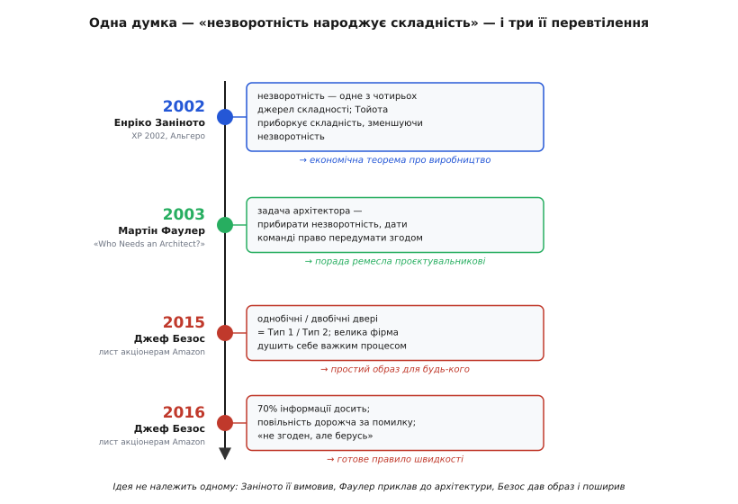

# 📜 Звідки взялися однобічні двері

Ідею, що рішення варто ділити не за важливістю, а за зворотністю, сьогодні знають мільйони людей у формі влучного образу: **однобічні й двобічні двері** Джефа Безоса. Образ такий простий, що здається народним, ніби він був завжди. Насправді за ним лежить точна дата народження, і — що цікавіше — сам образ прийшов у світ бізнесу набагато пізніше, ніж строга думка, яку він популяризував. Думку про те, що **незворотність — це джерело складності**, першим ясно вимовив не підприємець, а економіст, і сталося це на конференції програмістів. Ланцюжок від нього до Amazon вартий того, щоб пройти його по кроках, бо на кожній ланці ідея не просто передавалася далі — вона змінювала форму: спершу була економічною теоремою про виробництво, потім стала порадою архітекторові, а вже наостанок — простим правилом, за яким величезна компанія вчить кожного свого менеджера ухвалювати рішення швидше.

## Економіст на конференції програмістів

Наприкінці травня 2002 року в містечку Альгеро на північному заході Сардинії зібралася третя міжнародна конференція з екстремального програмування та гнучких процесів (*3rd International Conference on eXtreme Programming and Agile Processes in Software Engineering*, XP 2002, 26–29 травня). Головував Кент Бек — той самий, з чиїм іменем пов'язане й саме екстремальне програмування; програму вів Мікеле Маркезі (Michele Marchesi) з університету Кальярі. Зала була повна людей, які щодня писали код і сперечалися про пари програмістів, короткі ітерації й тести. І от одну з пленарних доповідей читав чоловік, який коду не писав узагалі, — **Енріко Заніното** (Enrico Zaninotto), професор економіки з університету Тренто.

Що робив економіст на з'їзді програмістів? Заніното займався не програмуванням, а тим, що зветься **економікою організації** (economics of organization) — теорією координації, тим, як фірми влаштовують свою роботу, коли майбутнє невідоме. Він прийшов у Тренто 1994 року, ще раніше викладав у Венеції та в міланській Боккóні, а згодом став там і проректором, і деканом. Його погляд на світ був поглядом людини, яка все життя думала про виробництво — про фабрики, потоки, рішення на конвеєрі, — і саме цей чужий, зовнішній погляд виявився для програмістів найціннішим. Він побачив у їхньому ремеслі те, чого вони самі в собі не бачили, бо були надто близько.

> 🔧 **Навіщо це.** Найглибші ідеї про складне ремесло часто приходять збоку — від людини з іншого поля, яка не звикла до тутешніх звичок і тому помічає їхню ціну. Заніното дивився на розробку софту очима теоретика виробництва й через це вловив те, що ховалося в самій природі рішень, а не в конкретних практиках. Коли наступного разу почуєте несподіване порівняння вашого фаху з чимось геть далеким, не поспішайте відмахуватися: саме там буває захована суть.

## Чотири джерела складності — і одне головне

Головна теза доповіді була про складність. Звідки вона взагалі береться в системі — байдуже, у фабриці чи в програмі? Заніното назвав **чотири джерела**, і Мартін Фаулер, який був у залі й потім переказав доповідь у своїх нотатках, зафіксував їх так:

```
Джерела складності за Заніното:
1. число станів, у які система може потрапити
2. взаємозалежності між частинами
3. незворотність дій, які можна вчинити
4. невизначеність середовища
```

А далі йшов хід, заради якого й варто було слухати. Заніното взяв два способи, якими промисловість історично боролася зі складністю, і показав, що вони б'ють по **різних** джерелах із цього списку.

Перший спосіб — система Тейлора й Форда, класичний конвеєр. Вона приборкує складність, обмежуючи **число станів**: розділи працю на дрібні однакові операції, зроби деталі взаємозамінними, пропиши кожен крок наперед — і система стане простою, бо їй просто нікуди подітися. Але за це береться ціна. Така система блискуча, поки майбутнє відоме й незмінне, і стає крихкою, щойно приходить **невизначеність**: увесь її порядок був заточений під один передбачений сценарій, а коли світ повернув інакше, перебудовувати доводиться все відразу.

Другий спосіб — виробнича система Тойоти (Toyota Production System), той самий *lean*. І от вона, за Заніното, б'є зовсім по іншому джерелу — **по незворотності**. Замість того щоб залити всі рішення в бетон наперед, Тойота дає рішення **міняти**: вона проштовхує момент ухвалення рішення якнайближче до **точки дії**, туди, де вже видно реальну ситуацію, а не туди, де хтось наперед вгадував за всіх. Робітник на лінії може зупинити конвеєр; замовлення тягне виробництво замість того, щоб план штовхав його наосліп. Система лишається гнучкою, бо не замикає себе завчасу в рішеннях, які потім не переграти.

І ось тут доповідь стала цікавою для зали програмістів. Бо екстремальне програмування — короткі ітерації, безперервний рефакторинг, тести, що ловлять поломку відразу, — це **той самий рух**: воно теж стримує складність, зменшуючи незворотність. Кожна коротка ітерація — це рішення, ухвалене ближче до точки дії, з правом переграти його наступного тижня. Заніното дав програмістам економічну мову для того, що вони робили руками, не називаючи.

Він додав і чесне застереження, і воно було не менш важливе. Гнучка система, що вільно міняє рішення, має свою небезпеку — вона може **не збігтися** (не досягти конвергенції), нескінченно перекроюючи саму себе й нікуди не приходячи. Тому Тойота тримає варіації в берегах і давить на якість, щоб коливання все-таки сходилися до результату. У цьому Заніното бачив і межу екстремального програмування: воно працює рівно доти, доки зберігається збіжність. Незворотності можна позбуватися не безкарно — за цю свободу треба платити дисципліною, що не дає системі розповзтися.

> 🔧 **Навіщо це.** Це і є та економічна причина, чому незворотні рішення дорого коштують, — не гасло, а механізм. Поки рішення можна переграти, тобі байдуже до майбутнього: помилився — виправив. Щойно рішення стає незворотним, ти мусиш **наперед** урахувати кожен майбутній стан, у який воно тебе замкне, — бо жодного не переграєш. А передбачити все майбутнє неможливо. Ось звідки береться хвіст здогадів і страхувань навколо кожного незворотного вибору; ось чому саме незворотність, а не розмір, — справжнє джерело складності.

## Як це вразило Мартіна Фаулера

У залі сидів Мартін Фаулер (Martin Fowler) — на той час уже одна з найвпливовіших постатей у світі проєктування ПЗ, автор книжок про рефакторинг і корпоративні архітектури. Доповідь Заніното його зачепила настільки, що він виніс її в окремий пункт своїх нотаток із конференції й повертався до неї потім. Але справжній слід вона лишила рік по тому, коли Фаулер сів писати есе на, здавалося б, зовсім інше питання: а що взагалі таке архітектура програми й навіщо потрібен архітектор?

Есе «Кому потрібен архітектор?» (*Who Needs an Architect?*) вийшло в журналі IEEE Software у вересні 2003 року (том 20, число 5, с. 11–13). У ньому Фаулер спершу відкидає модне тоді визначення архітектури як «того, що важко змінити» — і робить із незворотності Заніното несподіваний, майже парадоксальний висновок про саму роботу архітектора.

Хід думки такий. У будівлі багато речей справді важко змінити — несучу стіну не посунеш. Тому мимоволі здається, що й у програмі архітектура — це набір рішень, які просто **доводиться** ухвалити наперед і назавжди, бо потім їх не зрушиш. Але, каже Фаулер, для софту в цьому немає жодної **теоретичної** причини. Візьміть будь-який окремий бік програми — і його можна зробити легко змінним; ми просто ще не вміємо зробити легко змінним **усе відразу**. А отже, «важкість зміни» — це не властивість природи, це те, з чим можна **боротися**. І звідси його знаменитий висновок, який перевертає звичну картину ролі архітектора:

> «Гадаю, одна з найважливіших задач архітектора — прибирати архітектуру, знаходячи способи усунути незворотність у проєктах ПЗ.»
>
> *(Martin Fowler, «Who Needs an Architect?», IEEE Software, 2003)*

І поруч — фраза, що стала для багатьох головним, що вони запам'ятали з есе:

> «Архітектори існують не для того, щоб ухвалити всі рішення наперед. Вони існують, щоб ми могли передумати згодом.»

Ось де замкнулося коло. Економічна теорема Заніното про виробництво — «незворотність народжує складність» — обернулася в Фаулера на пораду ремесла: якщо незворотність і є справжнє джерело складності, то найкорисніше, що вміє архітектор, — не вгадати всі важкі рішення правильно з першого разу (це майже неможливо), а **зменшити саму незворотність**, зробити колись-невідкотні рішення відкотними, лишити команді право помилитися й дешево виправитися. Хороша архітектура — не та, де на початку все передбачили; а та, де на початку зв'язали себе **якомога меншим** числом незворотного.

Варто чесно розрізнити внески. Думка «незворотність — джерело складності» **не належить Фаулерові** — він сам щоразу віддавав її Заніното, і в нотатках із конференції, і посилаючись на доповідь. Заслуга Фаулера в іншому: він переклав чужу економічну ідею мовою архітектора й зробив із неї практичний висновок про роль у команді, до якого сам Заніното не йшов, бо думав про фабрики, а не про людей із титулом «архітектор».

## Безос дає ідеї двері

Минуло ще з десяток років — і та сама думка дісталася найширшої публіки, але вже без жодної згадки ні про Заніното, ні про Фаулера, ні про виробничі системи. Її переказав Джеф Безос (Jeff Bezos) у щорічному листі до акціонерів Amazon, і саме він дав ідеї той образ, з яким її тепер здебільшого й знають.

Тут корисно бути точним, бо навколо цих листів багато плутанини — часто кажуть, що двері з'явилися в одному листі, а типи рішень в іншому. Насправді **обидва образи народилися разом**, в одному й тому самому **листі за 2015 рік**. Ось точні слова Безоса звідти:

> «Деякі рішення важливі й незворотні або майже незворотні — це однобічні двері (*one-way doors*), — і такі рішення треба ухвалювати методично, обережно, повільно, з великою обачністю й порадою. Якщо ти пройшов крізь них і те, що по той бік, тобі не сподобалося, ти вже не повернешся туди, де був. Назвімо їх рішеннями **Типу 1**.»
>
> «Але більшість рішень не такі — вони змінні, зворотні, це двобічні двері (*two-way doors*). Якщо ти ухвалив невдале рішення Типу 2, тобі не доведеться довго жити з наслідками. Можна знову відчинити двері й вернутися назад.»
>
> *(Jeff Bezos, лист до акціонерів Amazon за 2015 рік)*

Отже, і назва **Тип 1 / Тип 2**, і образ **дверей** — це один той самий поділ, дана в 2015 році відразу в двох формах: суху нумерацію Безос одразу підпер наочним образом, щоб її запам'ятали. Це важлива поправка до частого переказу: двобічні двері — не винахід 2016 року.

Але головна тривога Безоса була не про класифікацію, а про те, що з нею роблять великі організації. Ось його діагноз, теж із листа 2015 року:

> «Що більшою стає організація, то дужчою, здається, стає схильність застосовувати важкий процес ухвалення рішень Типу 1 до **більшості** рішень, зокрема й до багатьох рішень Типу 2. Кінець кінцем це дає повільність, бездумну відразу до ризику, брак достатнього експериментування — і, як наслідок, менше винаходів.»

Це та сама пастка, яку теорія Заніното пояснює зсередини, а Безос називає її наслідком, який щодня бачив у власній компанії, що росла. Важкий процес — довгі узгодження, багато підписів, паралічна обережність — заслуговують лише однобічні двері. Застосований до двобічних, він убиває швидкість задарма: команда місяцями обговорює те, що можна було спробувати за годину й за годину ж відкотити.

## 2016-й: ціна зволікання і 70 відсотків

Наступного року, у листі за 2016 рік, Безос повернувся до тієї самої розвилки, але вже під іншим кутом — не «як не помилитися», а «як не задихнутися від повільності». Розділ звався про **швидкісне ухвалення рішень** (*high-velocity decision making*), і двобічні двері зринули там знову, тепер уже як інструмент проти зволікання:

> «Багато рішень зворотні, це двобічні двері. Для таких рішень можна брати легкий процес.»

І звідти ж — два його найвідоміші правила, що вже зовсім відірвалися від першоджерела й пішли гуляти світом самі по собі. Перше — про те, скільки інформації треба мати, щоб зважитися:

> «Більшість рішень варто ухвалювати десь на 70% інформації, яку хотілося б мати. Якщо чекати на 90%, то здебільшого ти вже надто повільний.»

Друге — про те, чому квапливість тут дешевша за обачність:

> «Якщо ти вмієш вправно виправляти курс, то помилитися може бути дешевше, ніж здається, а от бути повільним — дорого напевно.»

Обидва правила тримаються на одній прихованій умові, і саме її легко проґавити в захваті від гасел: вони чинні **лише для двобічних дверей**. Ухвалювати на 70% знання й летіти далі можна тоді, коли помилка виправна. Перед однобічними дверима та сама відвага стає безрозсудством — там якраз варто дочекатися повнішого знання, бо другого шансу не буде. Безос це знав і не змішував одне з одним; змішують ті, хто вихоплює цитату про «70%» без половини про двері.

У тому ж листі 2016 року з'явилося й третє його правило з тієї самої родини — **«не згоден, але берусь»** (*disagree and commit*): коли єдиної думки немає, а хтось усередині має тверде переконання, чесніше сказати «знаю, що ми не згодні, але зіграймо в це разом», ніж місяцями продавлювати консенсус. Це той самий рух до швидкості з іншого боку: не давати незгоді перетворити зворотне рішення на нескінченну нараду.

## Що з цього лишається

Пройдімо ланцюжок ще раз, бо кожна ланка додала своє, і плутати їхні внески несправедливо до всіх.

```
2002  Енріко Заніното (XP 2002, Альгеро)
      → незворотність — одне з чотирьох джерел складності;
        Тойота приборкує складність, зменшуючи незворотність
              │  економічна теорема про виробництво
              ▼
2003  Мартін Фаулер («Who Needs an Architect?», IEEE Software)
      → задача архітектора — прибирати незворотність,
        дати команді право передумати згодом
              │  порада ремесла для проєктувальника ПЗ
              ▼
2015  Джеф Безос (лист акціонерам Amazon)
      → однобічні / двобічні двері = Тип 1 / Тип 2;
        велика фірма душить себе важким процесом на всьому
              │  просте правило для будь-якого менеджера
              ▼
2016  Джеф Безос (лист акціонерам Amazon)
      → 70% інформації досить; повільність дорожча за помилку;
        «не згоден, але берусь»
```


*Одна думка — «незворотність народжує складність» — пройшла три перевтілення за чотирнадцять років: економічна теорема Заніното про виробництво, порада ремесла в Фаулера, просте правило дверей у Безоса. Ідея не належить нікому одному: Заніното її вимовив, Фаулер приклав до архітектури, Безос дав образ і поширив.*

Статус доказовості кожної ланки варто назвати прямо, бо навколо цих історій легко наростає легенда:

- **XP 2002, дати й місце, доповідь Заніното** — надійний факт: конференція справді відбулася в Альгеро 26–29 травня 2002 року, а зміст доповіді зберігся в нотатках самого Фаулера, який був у залі. Чотири джерела складності й порівняння з Тойотою — його переказ почутого, не пізніша реконструкція.
- **Авторство ідеї «незворотність — джерело складності»** — надійно **за Заніното**: Фаулер щоразу віддавав її йому, не привласнюючи. Це важливо, бо в переказах ідею часто підписують просто «Фаулер».
- **Есе Фаулера й дата** — надійний факт: IEEE Software, том 20, число 5, вересень 2003, с. 11–13; цитата про «прибирати архітектуру, усуваючи незворотність» — дослівна.
- **Обидва образи в листі 2015 року** — надійний факт за самим текстом листа: і «Тип 1 / Тип 2», і «однобічні / двобічні двері» стоять там разом, в одному абзаці. Часте твердження, ніби двері з'явилися лише 2016 року, — **хибне**.
- **«70%», «повільність дорожча за помилку», «не згоден, але берусь»** — надійний факт за листом 2016 року; це справді окремий лист, наступний після того, де народилися двері.

Найважливіше, що варто винести: ідея старша й строгіша, ніж її найпопулярніша форма. Коли хтось сьогодні каже «це двобічні двері, вирішуй швидко», за цим стоїть не афоризм мільярдера, а економічна думка про те, що складність системи народжується саме з незворотності її рішень, — і що приборкати цю складність можна, свідомо повертаючи собі право передумати.
