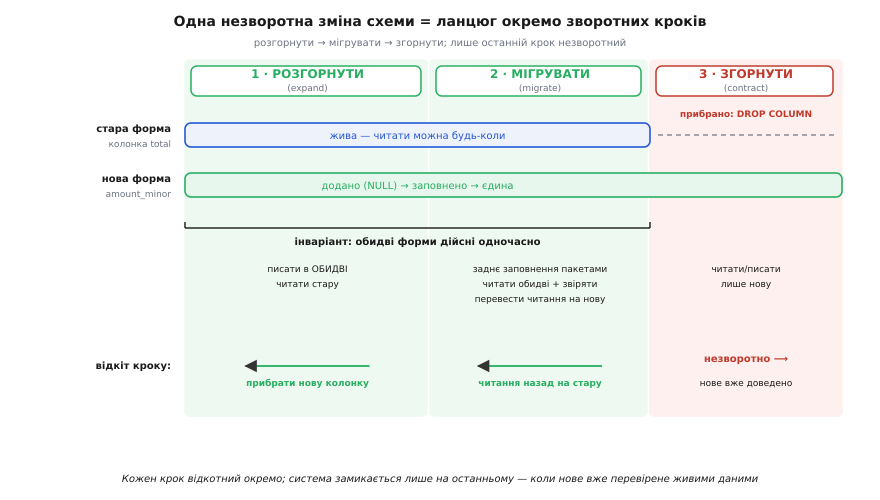

# ⚙️ Паралельна зміна: незворотну зміну схеми — на зворотні кроки

Зміна схеми в живій базі — це архетип однобічних дверей. Мільйони записів уже лежать у певній формі, застосунок читає їх щосекунди, зупиняти нічого не можна, і втратити бодай рядок не має права ніхто. Спокуса — зробити це одним стрибком: у ніч релізу спинити сервіс, прогнати `ALTER TABLE`, перетасувати дані, помолитися й запуститися. Саме ця ніч і замикає систему: якщо на середині щось піде не так, вертатися нема куди — стара форма вже переписана, нова ще не працює, а транзакція на пів мільярда рядків висить під замком.

Паралельна зміна робить із цього стрибка **сходи**. Ту саму несумісну зміну вона розкладає на три фази — **розгорнути**, **мігрувати**, **згорнути** (англ. *expand*, *migrate*, *contract*), — з яких **кожна окремо зворотна**, а незворотним лишається тільки останній крок, і то настає він аж тоді, коли нове вже доведено на живих даних. Тут ми збудуємо всі три фази цілком: справжні SQL-міграції з явним відкатом кожної, синхронізацію старої й нової форм, заднє заповнення пакетами, подвійне читання зі звірянням — і розберемо, де прийом ламається й що робити тоді.

Візьмемо конкретну зміну, дрібну на вигляд і руйнівну за наслідками. Таблиця `orders` зберігає суму в колонці `total NUMERIC(12,2)` — гривні з копійками десятковим числом. Ми переходимо на `amount_minor BIGINT` — суму в **цілих копійках** (мінорних одиницях). Причина не косметична: цілочислові гроші прибирають цілий клас помилок округлення й неявного перетворення у float, яких десяткова колонка не гарантує на кожному шляху коду, індексуються та агрегуються дешевше й лягають фундаментом під мультивалютність, де в кожної валюти свій масштаб мінорної одиниці. Але щойно в проді накопичилися мільйони рядків із `total`, ця «дрібна» зміна стає однобічними дверима.

## Задача

Сформулюймо вимоги точно, бо кожна з них — те, що легко провалити одним необережним `ALTER`.

1. **Без простою.** Сервіс не зупиняється ні на секунду. Жоден крок не бере довгого замка на всю таблицю й не змушує читачів чекати.
2. **Без утрати даних.** Жоден рядок і жодна копійка не губляться й не спотворюються — ні під час звичайної роботи, ні під час перенесення заднім числом.
3. **Кожен проміжний стан — зворотний.** У будь-яку мить до останнього кроку можна відкотитися на попередній, не втративши нічого. Це головна вимога, заради якої все й затіяно.
4. **Стара й нова форми дійсні одночасно.** Поки триває перехід, і `total`, і `amount_minor` несуть ту саму правду; будь-який читач, хоч старий, хоч новий, дістає коректну суму.
5. **Готовність згортати — це факт, а не дата.** Прибрати стару колонку можна лише тоді, коли **виміряно**, що ніхто її вже не читає, а нова форма повна й збігається зі старою до останнього рядка.

І все це — на таблиці з мільйонами рядків, під живим навантаженням, у системі з репліками, де довга транзакція означає лаг реплікації й роздування таблиці.

> 🔧 **Навіщо це.** Різниця між командою, що змінює схему живої бази раз на місяць і нікого не будить уночі, і командою, кожен реліз якої — рулетка, — саме в тому, чи вміє вона тримати ці п'ять вимог одночасно. Провал кожної має свою ціну: п.1 — впав прод під замком; п.2 — зникла копійка, яку не повернути; п.3 — застрягли на середині без вороття; п.5 — прибрали живу колонку й поклали систему, що досі нею живилась.

## Ідея

Уся конструкція тримається на одному **інваріанті**: поки триває перехід, **стара й нова форми обидві дійсні одночасно**. Доки це правда, кожен крок має задні двері — бо є куди відступити на форму, що досі жива й коректна. Незворотність з'являється рівно в ту мить, коли одна з форм перестає бути дійсною, — і завдання в тому, щоб ця мить настала **один-єдиний раз, останньою, і після доказу**.

Звідси три фази, кожна — крок, що інваріанту не порушує, крім останнього:

- **Розгорнути**: додати нову форму (колонку) **поруч** зі старою, нічого не ламаючи, і почати тримати обидві синхронними. Стара — досі джерело правди й досі читається. Відкат — просто прибрати нове; стара форма ціла, наче нічого й не було.
- **Мігрувати**: заповнити нову форму заднім числом зі старої, а тоді перевести читання на неї, весь час **звіряючи**, що обидві дають те саме. Відкат — повернути читання на стару; вона весь час жива й авторитетна.
- **Згорнути**: аж коли ніщо більше не читає стару форму й доведено, що нова повна, — прибрати стару. Це єдиний незворотний крок, зате він настає, коли нове вже перевірене живими даними.


*Одна незворотна зміна розкладена на ланцюг кроків. У зелених фазах обидві форми дійсні, тож будь-який крок відкочується поодинці. Система замикається лише на червоному кроці — і то аж коли нове доведене на проді, а отже, ціна цієї незворотності вже майже нульова.*

Прийом має ім'я й родовід, і його варто назвати точно. Загальний рефакторинг — розкласти несумісну зміну інтерфейсу на фази expand → migrate → contract — задокументував **Данило Сато** (Danilo Sato) 2014 року в блікі (блог-вікі) Мартіна Фаулера, назвавши його **паралельною зміною** (parallel change); сам Сато відносить першу згадку цієї стратегії до **Джошуа Керієвскі** (Joshua Kerievsky, 2006, і доповідь «The Limited Red Society» на Lean Software and Systems Conference, 2010). Форму саме для баз даних — де стара й нова схема живуть разом протягом **перехідного періоду** — розробили **Скотт Емблер** (Scott Ambler) і **Прамод Садаладж** (Pramod Sadalage) у книзі «Refactoring Databases: Evolutionary Database Design» (Addison-Wesley, 2006), яка розписує понад сімдесят рефакторингів бази саме за цією схемою; той самий підхід під назвою **expand/contract** описали Мартін Фаулер і Прамод Садаладж у статті «Evolutionary Database Design». *(Статус: усталена практика галузі; авторство й дати підтверджені за першоджерелами — блікі ParallelChange та сторінкою книги на martinfowler.com.)*

> 🔧 **Навіщо це.** Ніколи не міняйте схему живих даних одним стрибком «викотили — і молимося». Розкладіть на розгорнути → мігрувати → згорнути, і найстрашніша ніч релізу розпадеться на низку буденних, нудних, безпечних кроків. Нудьга тут — не вада, а мета: кожен крок настільки дрібний і зворотний, що його не страшно робити серед білого дня під навантаженням.

Механіка перенесення живих даних без простою — окрема глибока тема; тут ми беремо її прийоми як інструмент, а системно вони розібрані в [міграції без простою](topic:programming/zero-downtime-migration): онлайн-зміни схеми, пакетне перенесення, перемикання читань за прапорцем.

## Робочий код

Збудуємо всі три фази на нашому прикладі. Домовимося: код застосунку показано на Python і TypeScript вкладками (обидві — типові мови оркестрації такого переходу), а самі міграції — на SQL (діалект PostgreSQL), бо DDL/DML — це його рідна мова.

### Фаза 1 — розгорнути (expand)

Перший крок навмисне беззубий: додати нову колонку **поруч**, нічого не чіпаючи в старій. Ключ до вимоги «без простою» — колонка **nullable без замовчування**: у PostgreSQL це чиста зміна метаданих, миттєва, без переписування таблиці й без блокування читань.

```sql
-- Фаза 1: РОЗГОРНУТИ. Нова форма поруч зі старою.
-- Nullable без DEFAULT — це лише запис у каталог: миттєво, без переписування
-- рядків, без довгого замка. Старі рядки просто мають тут NULL — поки що.
ALTER TABLE orders ADD COLUMN amount_minor BIGINT;
```

Тепер треба, щоб **кожен новий запис** заповнював обидві колонки узгоджено — інакше нова форма почне відставати від першої ж вставки. Тут є дві стратегії, і варто знати обидві.

Перша, найнадійніша, — **синхронізаційний тригер** у самій базі. Його перевага в тому, що він ловить **усі** шляхи запису одразу: жоден забутий кутовий сценарій, жоден скрипт, що пише в таблицю повз застосунок, не проскочить. Це канонічний спосіб із «Refactoring Databases» — тримати стару й нову форми в синхроні тригером на час переходу.

```sql
-- Синхронізація на час переходу: похідну колонку веде сама база.
-- Джерело правди поки що — total; amount_minor щоразу виводиться з нього.
CREATE FUNCTION sync_amount_minor() RETURNS trigger AS $$
BEGIN
    NEW.amount_minor := ROUND(NEW.total * 100)::BIGINT;   -- гривні → копійки, точно
    RETURN NEW;
END $$ LANGUAGE plpgsql;

CREATE TRIGGER trg_sync_amount_minor
    BEFORE INSERT OR UPDATE OF total ON orders
    FOR EACH ROW EXECUTE FUNCTION sync_amount_minor();
```

Друга стратегія — **подвійний запис у застосунку**: кожен шлях, що пише замовлення, ставить обидва поля сам. Її беруть, коли значення нової форми не виводиться простою формулою з бази, а народжується в логіці (наприклад, валюту знає лише код). Виглядає це так:

:::tabs
```py
from decimal import Decimal

# Подвійний запис: обидві форми в одному операторі, узгоджено.
# total тут — Decimal (точні гривні); копійки — цілим, без float.
def create_order(conn, customer_id: int, total: Decimal) -> None:
    amount_minor = int((total * 100).to_integral_value())   # рівно round(total·100)
    conn.execute(
        "INSERT INTO orders (customer_id, total, amount_minor) "
        "VALUES (%s, %s, %s)",
        (customer_id, total, amount_minor),
    )
```
```ts
// number у JS — float64; для грошей це небезпечно, і саме в цьому причина
// міграції. Тому total тримаємо рядком-десятковим, а копійки рахуємо цілими
// точно, без float: ціла частина · 100 + рівно два знаки дробу.
function toMinor(dec: string): bigint {
  const neg = dec.startsWith("-");                   // знак — окремо, щоб не зіпсувати дріб
  const [whole, frac = ""] = dec.replace("-", "").split(".");
  const cents = (frac + "00").slice(0, 2);           // рівно 2 знаки копійок
  const v = BigInt(whole) * 100n + BigInt(cents);
  return neg ? -v : v;
}

// Подвійний запис: обидві форми в одному операторі, узгоджено.
async function createOrder(db: Db, customerId: number, total: string /* "123.45" */) {
  await db.query(
    `INSERT INTO orders (customer_id, total, amount_minor)
     VALUES ($1, $2, $3)`,
    [customerId, total, toMinor(total)],
  );
}
```
:::

**Відкат фази 1 — тривіальний і повний.** Стара форма за весь час не змінилася ні на байт, тож повернутися означає просто прибрати те, що додали:

```sql
-- Відкат РОЗГОРНУТИ: нове зникає, старе ціле — наче кроку й не було.
DROP TRIGGER IF EXISTS trg_sync_amount_minor ON orders;
DROP FUNCTION IF EXISTS sync_amount_minor();
ALTER TABLE orders DROP COLUMN amount_minor;
```

Ось перша сходинка й перші задні двері. Ми додали нову форму, зв'язали її зі старою, але **читаємо досі стару** — застосунок навіть не знає про `amount_minor`. Ризику майже нуль: якщо щось не так, `DROP COLUMN` повертає світ до вихідного стану.

### Фаза 2 — мігрувати (migrate)

Тепер найтонше. Нову колонку заповнено лише для рядків, доданих **після** тригера; мільйони старих рядків досі тримають у ній `NULL`. Треба їх **заповнити заднім числом** (англ. *backfill*) — і зробити це так, щоб не покласти прод.

Наївний спосіб — один оператор на всю таблицю — і є та сама однобічна ніч у мініатюрі:

```sql
-- ТАК НЕ РОБЛЯТЬ на великій таблиці: один UPDATE на мільйони рядків.
UPDATE orders SET amount_minor = ROUND(total * 100)::BIGINT
 WHERE amount_minor IS NULL;
```

Чому це погано, варто зрозуміти до кісток. Такий `UPDATE` — **одна велетенська транзакція**: вона тримає замки на всіх зачеплених рядках до самого кінця, роздуває таблицю мертвими версіями рядків (MVCC копіює кожен, що оновлює), а на репліки виливається одним пакетом, даючи стрибок лагу реплікації. На таблиці в сотні мільйонів рядків вона може йти годинами й повалити систему рівно тим, чого ми присягалися уникати.

Тому заповнюють **пакетами** (англ. *batch*): багато коротких транзакцій замість однієї довгої. Кожен пакет бере вузьку смугу за первинним ключем, оновлює її, комітить і дає системі дихнути. Драйвер циклу пише мовою застосунку:

:::tabs
```py
import time

# Заднє заповнення пакетами: багато коротких транзакцій, а не одна довга.
# Ідемпотентно й відновлювано: умова amount_minor IS NULL означає, що
# повторний запуск просто продовжить з місця, де спинилися.
def backfill(conn, batch: int = 5000, pause: float = 0.2) -> None:
    max_id = conn.execute("SELECT max(id) FROM orders").scalar() or 0
    lo = 0
    while lo <= max_id:
        conn.execute(
            "UPDATE orders SET amount_minor = ROUND(total * 100)::BIGINT "
            "WHERE id >= %s AND id < %s AND amount_minor IS NULL",
            (lo, lo + batch),
        )
        conn.commit()          # кожен пакет — окрема коротка транзакція
        lo += batch
        time.sleep(pause)      # віддати такт проду й реплікам
```
```ts
// Заднє заповнення пакетами: багато коротких транзакцій, а не одна довга.
// Ідемпотентно й відновлювано: умова amount_minor IS NULL означає, що
// повторний запуск просто продовжить з місця, де спинилися.
async function backfill(db: Db, batch = 5000, pauseMs = 200): Promise<void> {
  const { rows } = await db.query("SELECT COALESCE(max(id), 0) AS m FROM orders");
  const maxId = Number(rows[0].m);
  for (let lo = 0; lo <= maxId; lo += batch) {
    await db.query(
      `UPDATE orders SET amount_minor = ROUND(total * 100)::BIGINT
        WHERE id >= $1 AND id < $2 AND amount_minor IS NULL`,
      [lo, lo + batch],
    );                          // кожен пакет — окрема коротка транзакція
    await new Promise((r) => setTimeout(r, pauseMs)); // віддати такт проду
  }
}
```
:::

Дві властивості цього циклу — не дрібниці, а те, що робить його безпечним. По-перше, **ідемпотентність**: умова `amount_minor IS NULL` означає, що вже заповнені рядки пакет не чіпає. Тому цикл можна обірвати будь-коли й запустити знову — він продовжить з місця зупинки, не зіпсувавши зробленого. По-друге, **пауза між пакетами** свідомо віддає пропускну здатність живому навантаженню: заповнення повзе фоном, не конкуруючи з користувачами за диск і за реплікацію. Тонше про ідемпотентність повторюваних операцій — в [ідемпотентності](topic:programming/idempotency): чому «повтор дає той самий результат» — це те, що робить фонові процеси безпечними.

Коли backfill добіг кінця, настає серце фази — **подвійне читання зі звірянням**. Читач бере обидві форми, порівнює їх і лише тоді вирішує, якій вірити. Спершу — у «тіньовому» режимі: авторитетна досі стара форма, а нова читається паралельно тільки щоб **звірити** й нагромадити докази, що вона збігається.

:::tabs
```py
# Подвійне читання зі звірянням. Поки trust_new=False — стара авторитетна,
# нова читається лише для звіряння (тінь). Коли доказів досить — прапорець
# перемикають, і авторитетною стає нова.
def read_amount_minor(conn, order_id: int, trust_new: bool) -> int:
    row = conn.execute(
        "SELECT total, amount_minor FROM orders WHERE id = %s", (order_id,)
    ).one()
    old_as_new = int((row.total * 100).to_integral_value())  # стара, зведена до копійок

    if row.amount_minor is None:
        return old_as_new                    # ще не заповнено — падаємо на стару

    if row.amount_minor != old_as_new:       # РОЗБІЖНІСТЬ — інваріант порушено!
        metrics.increment("amount_minor.drift")
        log.error("drift order=%s old=%s new=%s",
                  order_id, old_as_new, row.amount_minor)
        return old_as_new                    # у сумніві — авторитетна стара

    return row.amount_minor if trust_new else old_as_new
```
```ts
// Подвійне читання зі звірянням. Поки trustNew=false — стара авторитетна,
// нова читається лише для звіряння (тінь). Коли доказів досить — прапорець
// перемикають, і авторитетною стає нова.
async function readAmountMinor(db: Db, orderId: number, trustNew: boolean): Promise<bigint> {
  const { rows } = await db.query(
    "SELECT total, amount_minor FROM orders WHERE id = $1", [orderId],
  );
  const { total, amount_minor } = rows[0];
  const oldAsNew = toMinor(String(total));                 // стара → копійки (той самий toMinor)

  if (amount_minor == null) return oldAsNew;               // ще не заповнено

  if (BigInt(amount_minor) !== oldAsNew) {                 // РОЗБІЖНІСТЬ!
    metrics.increment("amount_minor.drift");
    log.error(`drift order=${orderId} old=${oldAsNew} new=${amount_minor}`);
    return oldAsNew;                                        // у сумніві — стара
  }
  return trustNew ? BigInt(amount_minor) : oldAsNew;
}
```
:::


*Поки живуть обидві форми, запис торкає їх разом, а читання їх звіряє. Звіряння — не формальність: воно перетворює «сподіваюся, нова колонка правильна» на «виміряно, що правильна», і саме цей вимір згодом дасть право прибрати стару.*

Порядок звіряння важливий. Спочатку систему пускають із `trust_new=False`: користувачі й далі бачать суму зі старої колонки, а лічильник `drift` мовчки нагромаджує статистику. Якщо він **тримає нуль** достатньо довго на реальному навантаженні — це доказ, що нова форма всюди збігається зі старою. Аж тоді перемикають `trust_new=True`, і авторитетною стає нова колонка. Паралельно можна пройтися прямим SQL-звірянням по всій таблиці — точним запитом, що ловить і незаповнені, і розбіжні рядки одним числом:

```sql
-- Скільки рядків досі не збігаються (має бути 0 перед згортанням).
-- IS DISTINCT FROM ловить і NULL (незаповнене), і будь-яку розбіжність.
SELECT count(*) AS drift
  FROM orders
 WHERE amount_minor IS DISTINCT FROM ROUND(total * 100)::BIGINT;
```

**Відкат фази 2 — теж повний, і в цьому вся краса.** Backfill лише **дописує** нову колонку, старої не чіпаючи; перемикання читань — це прапорець. Тож відкіт не потребує жодного `ALTER`:

```
Відкат МІГРУВАТИ:
  1. trust_new = False        ← читання миттєво назад на стару (авторитетну)
  2. backfill можна спинити    ← він нічого не ламав, лише дописував
  Стара колонка весь час жива й правильна — відкат нічого не відновлює, лише вертає читання.
```

### Фаза 3 — згорнути (contract)

Лишилося прибрати стару форму — і це єдиний незворотний крок. Тому перед ним ставлять **ворота передумов**, і жодну не можна пропустити:

```
Згортати можна, лише коли ВСІ істинні:
  • backfill завершено          → SELECT count(*) WHERE amount_minor IS NULL = 0
  • звіряння чисте достатньо довго → лічильник drift тримає 0 на проді
  • читання всюди на новій        → trust_new=True викочено на 100%, стару ніхто не читає
```

Коли ворота відчинені, згортання йде обережним порядком. Спершу переносять **джерело правди** на нову колонку: застосунок починає писати `amount_minor` напряму, а щоб стара форма лишалася дійсною **до останньої секунди** (інваріант — понад усе), напрям синхронізації розвертають — тепер уже `total` виводиться з `amount_minor`:

```sql
-- 3a. Розвернути синхронізацію: тепер джерело правди — amount_minor,
--     а стара total лишається дійсною (виводиться), щоб відкат був можливий
--     аж до самого DROP. Нову колонку робимо обов'язковою — і цей крок
--     САМ перевіряє повноту backfill: якщо є хоч один NULL, він упаде.
ALTER TABLE orders ALTER COLUMN amount_minor SET NOT NULL;

CREATE OR REPLACE FUNCTION sync_amount_minor() RETURNS trigger AS $$
BEGIN
    NEW.total := NEW.amount_minor / 100.0;   -- зворотний напрям: копійки → гривні
    RETURN NEW;
END $$ LANGUAGE plpgsql;

DROP TRIGGER IF EXISTS trg_sync_amount_minor ON orders;
CREATE TRIGGER trg_sync_amount_minor
    BEFORE INSERT OR UPDATE OF amount_minor ON orders
    FOR EACH ROW EXECUTE FUNCTION sync_amount_minor();
```

Зверни увагу на `SET NOT NULL`: він не косметика, а **ворота-доказ**. PostgreSQL пропустить його лише тоді, коли в колонці немає жодного `NULL`, — тобто сам крок відмовиться виконатися, якщо backfill неповний. Ми змусили базу перевірити повноту за нас. *(На дуже великій таблиці навіть цей скан беруть онлайн: спершу `ADD CONSTRAINT ... CHECK (amount_minor IS NOT NULL) NOT VALID`, тоді `VALIDATE CONSTRAINT` без важкого замка, і аж потім `SET NOT NULL` спирається на вже перевірене обмеження.)*

І лише тепер, коли нова форма — обов'язкова, повна, авторитетна й усюди читана, — незворотний крок:

```sql
-- 3b. НЕЗВОРОТНИЙ крок: прибрати стару форму. Робимо його ОСТАННІМ,
--     коли нове вже доведене живими даними — тож ціна незворотності мала.
DROP TRIGGER IF EXISTS trg_sync_amount_minor ON orders;
DROP FUNCTION IF EXISTS sync_amount_minor();
ALTER TABLE orders DROP COLUMN total;
```

Ось де двері замикаються — і ось чому це вже не страшно. До кроку 3b відкат був миттєвий: розвернути прапорець, і читання знову на старій. Крок 3b цю можливість забирає — але забирає рівно тоді, коли нею вже місяцями ніхто не користувався, бо нова форма давно везе всю роботу. Незворотність настала останньою й дешевою, а не першою й руйнівною. Саме в цьому вся суть прийому: **одні необоротні двері перетворилися на низку оборотних, і незворотним лишився тільки поріг, який ми переступили вже з відкритими очима.**

## Складність і пастки

Приклад був навмисне добрий: `total` і `amount_minor` несуть **ту саму** інформацію, тож перехід між ними двобічний і звіряння завжди сходиться. Реальність буває інша, і чесність вимагає назвати, де прийом тріщить.

### Неадитивні зміни: коли форми не еквівалентні

Наша зміна була **адитивна**: нова форма — точний перерахунок старої, і навпаки. Тому обидві могли бути дійсні одночасно — інваріант тримався сам собою. Але візьміть зміну, де інформація **не зберігається** в обидва боки, і фундамент хитається.

Найгостріший приклад — та сама мультивалютність, заради якої ми й переходили на мінорні одиниці. Щойно з'явиться колонка `currency` і перше замовлення в євро, стара `total` більше **не може** його чесно виразити: у ній немає місця для валюти, і `1000` без позначки — це вже не сума, а загадка. Інваріант «обидві форми дійсні» тихо ломиться: нова форма багатша за стару, і звузити її назад без утрати вже не можна. Це та сама асиметрія, що й у напрямку делегування версій API — багате звужується до бідного, бідне до багатого не розширюється.

Практичний висновок: паралельна зміна **чиста лише для адитивних кроків**. Неадитивну зміну (розбити колонку на дві, злити дві в одну, звузити тип, змінити семантику) розкладають на адитивні під-кроки — а там, де інформація неминуче губиться, чесно фіксують момент, **після** якого стара форма стає лише наближенням, і скорочують перехідне вікно так, щоб через нього не встигли пройти дані, яких стара форма не втримає. Інакше кажучи: доки пишуть тільки гривневі замовлення — інваріант живий; перше валютне замовлення має лягти **вже після** того, як стару колонку прибрано, або в неї доведеться класти свідомо неповне значення й пам'ятати про це.

### Гігантські backfill-и

Наш цикл на паузах гарний для мільйонів рядків. На **мільярдах** він може повзти днями, і тут вилазять окремі біди. Довжина: якщо один прохід триває три доби, він мусить пережити перезапуски, деплої й падіння — тому backfill роблять **відновлюваним** (курсор прогресу в окремій таблиці, а не в пам'яті процесу) та ідемпотентним, як ми й зробили умовою `IS NULL`. Тиск на систему: навіть дрібні пакети на мільярдах разів дають відчутний потік у репліки, тож паузу роблять **адаптивною** — драйвер стежить за лагом реплікації й сам пригальмовує, коли той росте. Гарячі рядки: якщо ту саму смугу ключів активно оновлюють користувачі, пакет конкурує з ними за замки — тоді беруть не діапазон за ключем, а вибірку через `SELECT ... FOR UPDATE SKIP LOCKED`, що обходить зайняті рядки й вертається до них потім.

Перш ніж запускати такий backfill, його вартість **прикидають на серветці**: скільки рядків, скільки байтів на рядок, яка пропускна здатність запису, скільки це годин і скільки лагу. Груба арифметика тут рятує від запуску процесу, який не вкладеться в жодне вікно; як її робити — в [оцінці на серветці](topic:programming/back-of-envelope).

### Крос-сервісні контракти

Найтвердіша межа — коли стара й нова форми живуть **не в одній базі під одним власником**, а по різні боки контракту між сервісами. Усередині своєї бази ти міг тримати обидві форми синхронними тригером і перемкнути читання прапорцем атомарно. Через межу сервісу ні того, ні того нема: ти не можеш одним рухом оновити чужий застосунок, який читає твоє поле, і не можеш тригером дотягтися в чужу схему.

Тут інваріант «обидві форми дійсні» розтягується на **розгортання, яких ти не контролюєш**. Фази ті самі — розгорнути новий формат поруч зі старим, дати обом пожити, згорнути старий, — але «дати пожити» тепер означає чекати, поки **кожен споживач** переповзе на нове, а це вже не твій прапорець, а їхній графік. Тому контракт версіонують, а не редагують: старе поле лишається, нове стає поруч, і згортання настає лише тоді, коли **виміряно**, що старим полем ніхто не живиться — точно як у вікні застарівання API. Механіку цього подвійного шляху на рівні HTTP-контракту з телеметрією й воротами видалення розібрано у [вікні міграції в коді](topic:programming/deprecation-policy/proj-migration-window.md); саму дисципліну сумісності схем через межу — у [контрактах даних](topic:programming/data-contracts), а коли форм багато й змінюються вони часто, їх тримає [реєстр схем](topic:programming/schema-registry), що не дає випустити несумісну версію.

### Коли масштаб більший за таблицю: strangler-fig

Паралельна зміна — прийом рівня колонки, таблиці, схеми в **одній** базі, яку ти тримаєш. Що вище піднімаєшся масштабом однобічних дверей, то більший потрібен важіль.


*Той самий рух — розгорнути нове поруч, перевести навантаження, згорнути старе — працює на будь-якому масштабі, але форма змінюється. Доки все в одній базі під одним власником, вистачає expand/migrate/contract. За межею власності потрібен фасад, за яким нове поступово заміщає старе.*

Коли однобічні двері — це цілий успадкований застосунок чи прив'язка до постачальника, той самий інстинкт («не стрибай, вирощуй нове поруч зі старим і переводь по шматку») набуває форми [душительки-смоківниці](topic:programming/strangler-fig): нову систему саджають навколо старої за фасадом, який спершу проксіює все у старе, а тоді потроху перехоплює функцію за функцією, аж поки старе не всохне. Кожен перехоплений шматок — окремий зворотний крок (фасад завжди можна повернути на старе), а не один стрибок у прірву. Паралельна зміна й смоківниця — це одна ідея на двох масштабах: **розгорнути поруч, перевести навантаження, згорнути старе**; різниться тільки те, що на масштабі таблиці «поруч» — це колонка й тригер, а на масштабі системи — це сервіс і фасад.

І остання, наскрізна пастка, яка губить навіть технічно бездоганні переходи: **мовчазний розрив синхронізації**. Поки живуть обидві форми, досить одному шляху запису забути про нову колонку (чи одному звірянню бути вимкненим), щоб форми тихо розповзлися — і ти дізнаєшся про це вже після згортання, коли повертатися нема куди. Тому синхронність не залишають на пильність, а **стережуть автоматом**: лічильник `drift` виводять у монітор із тривогою на будь-яке ненульове значення, а саму заборону «писати повз синхронізацію» ставлять перевіркою, що завалює білд. Згортати можна лише тоді, коли цей сторож мовчав достатньо довго, — бо тиша сторожа і є той вимір, що перетворює незворотний останній крок із стрибка на віру на спокійний спуск за фактами.
