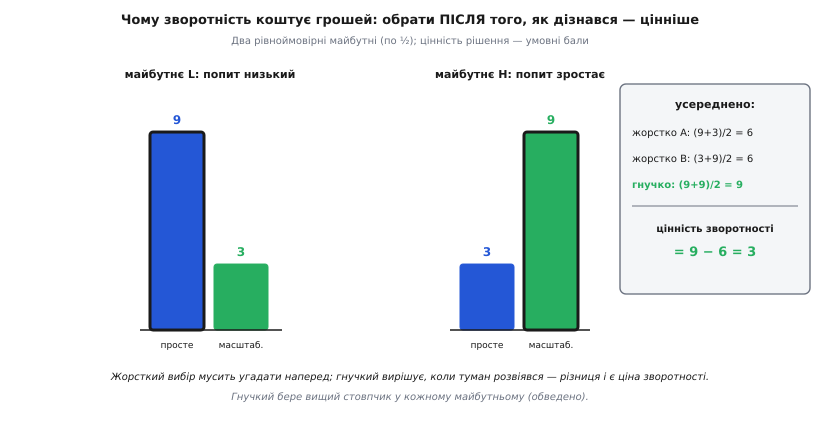
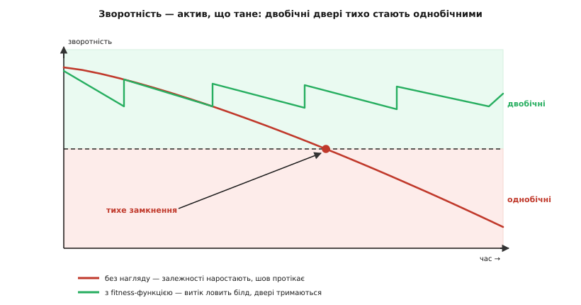

# Зворотні й незворотні рішення

<preknowlist>
- [Якісні атрибути](topic:programming/quality-attributes) — «-ility» системи (змінюваність, продуктивність, доступність); саме за них торгуються архітектурні рішення.
- [Trade-off-аналіз](topic:programming/tradeoff-analysis) — кожне рішення щось віддає за щось; уміння бачити ціну кожного варіанта.
- [Зчеплення і зв'язність](topic:programming/coupling-cohesion) — наскільки жорстко одне спирається на інше; від цього прямо залежить, чи можна вставити шов і чи дорогий відкат.
</preknowlist>

Є одне питання, яке відрізняє зрілого архітектора від того, хто просто знає багато патернів: не «як зробити правильно», а «скільки коштуватиме виправити, якщо я помилюся». Бо помилка — не рідкісна аварія, а звичайний робочий режим: на початку проєкту про систему відомо найменше, а вирішувати доводиться найбільше. Питання лише в тому, які з цих ранніх рішень потім даси задкувати, а які замкнуть тебе назавжди.

Ключ, що впорядковує все, — **зворотність** (від лат. *reversus* — повернутий назад). Не розмір наслідків, не важливість, а одне: скільки коштуватиме **скасувати** рішення, коли з'ясується, що воно хибне. І перша ж несподіванка в тому, що ця вартість — не одне число і не властивість самого рішення. Вона складається з кількох незалежних доданків, кожен із яких архітектор може окремо смикнути. Саме тому ремесло тут — не вгадувати незворотне правильно (це майже неможливо), а **виробляти зворотність** там, де її бракує. Розберімо це до дна: спершу з чого вартість відкату складається, тоді чому зворотність узагалі коштує грошей, далі — як точно вирішувати, коли її купувати, як розчинити найтвердіші двері, чому зворотність тане з часом і чому вона ще й соціальна, а не лише технічна.

## Анатомія вартості відкату

Наївний спосіб класифікувати рішення — за розміром: велике важливе — мабуть, незворотне; дрібне — мабуть, зворотне. Цей спосіб систематично бреше, і варто зрозуміти чому. Вартість відкату не корелює з розміром, бо вона — добуток кількох осей, серед яких розміру просто немає. Розкладімо її.

**Радіус вибуху** — скільки місць коду й скільки людей уже спираються на рішення. Це найочевидніша вісь, і саме її плутають із розміром. Але велике рішення може мати крихітний радіус (переписати внутрішній модуль зачіпає лише його межу), а дрібне — величезний (назва поля, що потрапила в сотню запитів).

**Жорсткість зчеплення** — чи можна між рештою системи й цим рішенням просунути [шов](topic:programming/hexagonal-architecture), тонкий інтерфейс, за яким конкретний вибір захований. Якщо шов є або його легко поставити, залежність м'яка: міняєш те, що за швом, і все. Якщо конкретика протекла всюди — залежність жорстка, і кожне місце доведеться правити руками.

**Гравітація даних** (від лат. *gravitas* — вага, тягар) — чи накопичує рішення стан, який його переживе. Код можна переписати за вечір; мільйони записів у певній схемі не перепишеш — їх треба **мігрувати**, живими, без простою й без права втратити рядок. Дані мають вагу, і що їх більше, то сильніше вони тримають форму, у якій колись лягли.

**Зовнішня обіцянка** — чи видно рішення назовні, чи спираються на нього ті, ким ти не керуєш. Внутрішній контракт міняєш вольовим актом. Публічний [контракт](topic:programming/data-contracts), яким живляться чужі команди чи клієнти, ти вже не відкликаєш односторонньо — його зміна ламає їх, а їхній графік і згода тобі не підвладні.

**Затримка зворотного зв'язку** — коли ти взагалі помітиш, що помилився. Якщо хиба видно за годину — відкат дешевий, бо стан системи ще не встиг накопичитися навколо неї. Якщо вона проявиться за рік — на неї встигне налипнути стільки коду, даних і звичок, що відкат подорожчає в рази, ще й тому, що всі вже забули, чому вирішили саме так.

Повна вартість відкату — це не сума, а радше **добуток** цих осей: якщо хоч одна велика, велика й вартість, скільки б не було нулів у решті.

```
Вартість відкату ≈ радіус_вибуху
                 × жорсткість_зчеплення
                 × гравітація_даних
                 × зовнішня_обіцянка
                 × затримка_зворотного_звʼязку
```

Добуток, а не сума, — бо осі підсилюють одна одну. Величезний радіус із м'яким зчепленням (шов є) дає малий відкат: правиш один адаптер. А от навіть помірний радіус, помножений на високу гравітацію даних і довгу затримку зворотного зв'язку, дає катастрофу, з якої роками не вибратися. Розмір рішення не входить у формулу зовсім.


*Розмір рішення не визначає вартості відкату. Переписати внутрішній модуль — велика робота з крихітним відкатом (радіус є, але зчеплення м'яке, даних і зовнішніх обіцянок нема). Формат даних у проді — дрібне рішення з руйнівним відкатом, бо гравітація даних і затримка зворотного зв'язку тягнуть добуток угору.*

> 🔧 **Навіщо це.** Перш ніж ухвалити рішення, пройдіться по цих п'ятьох осях уголос. Не «це важливе чи ні», а «який тут радіус, є шов чи ні, накопичується стан чи ні, видно назовні чи ні, коли помічу хибу». Дві хвилини такої перевірки відсіюють ту єдину пастку, що коштує найдорожче: дрібне рішення, у якого одна вісь потай велика. Саме воно проходить повз увагу, бо «дрібне», і саме воно потім замикає систему.

Осі пояснюють і найпідступніший клас дверей — **асиметричні**: увійти дешево, вийти дорого. Підключити зовнішній фреймворк — п'ять хвилин; зіскочити з нього за рік, коли на його припущеннях виросла половина коду, — місяці. Вхід оманливо легкий, бо в мить входу радіус ще нульовий; вартість наростає потім, сама, у міру того як код обростає прийнятим рішенням. Через це існують і **приховані** однобічні двері: рішення, двобічне в день ухвалення, тихо стає однобічним, поки ти дивишся деінде. Ця течія в часі заслуговує окремого розбору; поки досить бачити, що рід дверей — не етикетка, наклеєна раз назавжди, а стан, який змінюється.

## Чому зворотність — це гроші: рішення як опціон

За образом дверей стоїть точна економічна причина, і без неї легко сприймати зворотність як просто «зручність». Насправді зворотність має вимірну грошову вартість, і корінь її — в **опціоні** (від лат. *optio* — вільний вибір): у праві, але не обов'язку, зробити вибір згодом.

Італійський економіст **Енріко Заніното** (Enrico Zaninotto) у доповіді на конференції XP 2002 сформулював думку, яка потім лягла в основу поглядів Мартіна Фаулера на роль архітектора: **незворотність — одне з головних джерел складності**. Механізм такий. Поки рішення зворотне, майбутнє тебе мало обходить — помилився, виправив, живеш далі. Але щойно рішення незворотне, ти мусиш **наперед** урахувати всі майбутні стани, у яких воно тебе замкне, бо жодного вже не переграєш. А передбачити все майбутнє не можна — тож незворотне рішення тягне за собою хвіст здогадів і страхувань. Зворотність цей хвіст відрубує: не треба вгадувати наперед те, що можна виправити потім.

Це рівно та сама ідея, яку економіка фінансів знає під назвою **вартість опціону**, і її варто побачити на числах, бо інтуїція тут спершу опирається. Уявіть рішення під невизначеністю: майбутнє обернеться або сценарієм L (попит лишиться низьким), або сценарієм H (попит вибухне), і ви поки не знаєте, яким саме — хай буде 50 на 50. Є два способи побудувати систему. Простий (дешевий, але не тягне навантаження) дає цінність 9 у світі L і лише 3 у світі H. Масштабований (дорогий, зате витримає) — навпаки: 3 у L і 9 у H.

Якщо ви мусите обрати **наперед**, наосліп, то який варіант не візьміть — усереднена цінність вийде однакова:

```
жорстко обрати простий:      (9 + 3) / 2 = 6
жорстко обрати масштабований: (3 + 9) / 2 = 6
```

А тепер уявіть, що вибір **зворотний**: ви ставите дешеву тимчасову форму, дочекаєтеся, поки туман розвіється й стане видно, який світ настав, — і аж тоді берете відповідний варіант. Тоді в кожному світі ви візьмете найкраще:

```
гнучко (обрати, коли вже видно):  max(9,3) у L, max(3,9) у H
                                  (9 + 9) / 2 = 9
```

Різниця — 9 проти 6 — і є **вартість зворотності**: три бали, які ви отримуєте буквально ні за що, тільки за право вирішувати пізніше.


*Право обрати після того, як дізнався, коштує рівно стільки, на скільки «обрати найкраще в кожному світі» перевищує «обрати одне наперед». Ця різниця й є грошова цінність зворотності — вона тим більша, чим гостріша невизначеність.*

Звідки ця премія береться математично — з простої нерівності: середнє з максимумів ніколи не менше за максимум із середніх. Обираючи після того, як побачив результат, ти щоразу знімаєш верхівку; обираючи наперед, застрягаєш в одному рядку на всі випадки. Проміжок між ними — премія за гнучкість, і росте вона з невизначеністю: що ширший розкид можливих майбутніх, то дорожче коштує право почекати й обрати влучно. Повне виведення цієї премії — через опуклість функції виграшу й нерівність Єнсена — винесено в [математику реальних опціонів](topic:programming/reversible-irreversible-decisions/math-real-options.md): там показано, чому цінність зворотності дорівнює саме тому розриву, який створює опуклість, як вона масштабується з дисперсією й часом і як з неї строго випливають і правило 70%, і поріг окупності шва.

Саме цей опціонний погляд першими системно розробили економісти Авінаш Діксіт і Роберт Піндайк у книзі «Investment under Uncertainty» (1994): якщо рішення **незворотне**, а майбутнє **непевне** й проясниться з часом, то очікувана цінність можливості почекати завжди більша за цінність рішення, ухваленого негайно. Термін «реальний опціон» (real option) увів іще раніше Стюарт Маєрс (1977): багато активів фірми — це не гроші тут і тепер, а право зробити вибір потім, і воно має ціну. Архітектурне рішення — той самий реальний опціон: тримати двері двобічними означає володіти опціоном; продавити незворотне — означає його спалити.

Звідси й перевертається звична картина «хороша архітектура — це коли на початку все продумали». Хороша архітектура — це коли на початку продумали, як вирішити **якнайменше** незворотного, а решту лишили відкритою, поки не з'явиться знання вирішувати з відкритими очима. Архітектор існує не щоб угадати все наперед, а щоб дозволити помилитися дешево.

## Правило рішення: коли входити, коли розширювати, коли чекати

Опціонний погляд не лишається абстракцією — з нього виводиться точний робочий алгоритм. Перед будь-яким рішенням архітектор має три ходи, і вибрати між ними допомагає та сама арифметика вартості відкату.

**Хід перший — просто вирішити.** Якщо двері двобічні (добуток осей малий), правильна дія — вирішити швидко, самотужки, не скликаючи нікого, і не боятися промаху: відкат дешевий. Обвішувати таке рішення нарадами — чисте марнотратство: місяць узгоджень заради того, що відкотиш за годину.

**Хід другий — розширити двері перед входом.** Якщо двері однобічні, найпотужніше, що можна зробити, — не вгадувати правильний незворотний вибір, а **зробити його зворотним** до того, як увійти. Незворотність рідко буває властивістю самого вибору — частіше це властивість того, **як** він уплетений у систему. Змініть плетиво — і той самий вибір стане оборотним. Механізм — той-таки **шов** (англ. *seam* — шов, місце з'єднання): між рештою коду й незворотним вибором ставлять тонкий інтерфейс, за яким конкретика захована. Тоді весь код спирається на інтерфейс, а не на вибір; поміняти вибір означає переписати лише те, що за швом. Класична форма — [порти й адаптери](topic:programming/hexagonal-architecture): застосунок знає лише порт-інтерфейс, а конкретна база чи зовнішній сервіс живе в адаптері; на межі з чужою системою той самий прийом зветься [шаром антикорупції](topic:programming/anti-corruption-layer), що не пускає чужу модель протекти всередину.

Але шов не безкоштовний, і тут потрібна чесність. Кожен інтерфейс — зайвий шар, який треба тримати в голові, писати й супроводжувати. Розширювати кожні двері підряд — потонути в абстракціях заради оборотності, яка ніколи не знадобиться. Тому шов ставлять не «про всяк випадок», а коли він **окупається**, і це можна порахувати.

**Коли шов окупається — порахуймо поріг.**

```
Порівнюємо два світи, у кожному ймовірність передумати — p.
  без шва: очікувані витрати на відкат = p · R      (R — дорогий відкат)
  зі швом: постійна ціна шва C + очікуваний відкат p · r   (r — дешевий, r « R)

Шов вигідний, коли зі швом дешевше:
  C + p·r  <  p·R
  C        <  p·(R − r)
  p        >  C / (R − r)          ← поріг імовірності передумати

Числа (умовні людино-дні):
  R (відкат без шва)        = 40
  r (відкат зі швом)        =  3
  C (написати й тримати шов) =  5
  поріг:  p > 5 / (40 − 3) = 5/37 ≈ 0.135
```

Висновок читається прямо: якщо шанс, що доведеться колись міняти сховище, вищий за ~14%, шов уже вигідний; якщо він явно менший — шов лише додасть ваги задарма. Ось звідки береться правило «шви ставлять вибірково»: не з естетики, а з цієї нерівності. Сховище, зовнішній платіжний провайдер, конкретна хмарна служба — тут *p* та *R* великі, шов окупається легко. Порядок полів у внутрішній структурі — тут *p·(R−r)* мізерне, шов збитковий.

**Хід третій — відкласти вхід.** Якщо двері однобічні, а розширити їх не виходить, лишається не входити в них, поки можна. Що пізніше ухвалюєш незворотне, то більше знань устигло накопичитися й то менший шанс промазати. Але «якнайпізніше» — не «ніколи»: у зволікання своя ціна, і вона з часом росте. Точку, де далі тягнути вже дорожче, ніж вирішити, називають **останнім відповідальним моментом** — принципом, який Мері й Том Поппендик винесли з ощадливого виробництва Toyota у книзі «Lean Software Development» (2003): відкладай зобов'язання до миті, після якої зволікання саме знищує важливу альтернативу. [Останній відповідальний момент](topic:programming/last-responsible-moment) — це рівно перетин двох кривих: приросту знання за одиницю часу (спадає — легке дізнаєшся першим) і вартості зволікання за одиницю часу (зростає). Доки перше більше за друге — чекай; щойно друге переросло перше — вирішуй негайно.

Цей перетин пояснює й знамените правило Безоса: більшість рішень варто ухвалювати, маючи десь **70%** інформації, яку хотілося б мати. Чому не 90%? Бо останні відсотки знання здобуваються найповільніше (легке ти вже дізнався), а вартість зволікання на той момент уже висока — перетин настає раніше, ніж туман розвіється повністю. Числове «70%» — просто зручний ярлик для «приріст знання за день упав нижче за вартість зволікання за день».

А коли ухвалити треба вже зараз, попри туман, оборотність можна буквально **докупити** — зробити дешевий зворотний крок і подивитися, що вийде, замість продавлювати одне велике незворотне. Тонкий наскрізний зріз системи, що вже працює від краю до краю, — [walking skeleton](topic:programming/walking-skeleton) — коштує копійки, а показує на живому, чи витримає обраний шлях, поки з нього ще легко зійти. Це і є суть [рішень під невизначеністю](topic:programming/deciding-under-uncertainty): не вгадати наосліп, а зробити ставку якомога зворотнішою й дешевшою, щоб дізнатися правду до того, як двері зачиняться. Ту саму ставку можна дивитися й з боку [ризику](topic:programming/risk-thinking): незворотне рішення під туманом — це ризик із високою ціною реалізації, і кожен із трьох ходів (шов, відкладання, дешева проба) знижує або ймовірність, або ціну його справдження.

## Розчинити найтвердіші двері: дані

Серед усіх осей вартості відкату гравітація даних — найлютіша, і варто розібрати окремо, чому та що з нею робити. Причина ваги даних глибша за «їх багато». Код у будь-яку мить існує в **одному** стані — теперішньому; його можна замінити цілком. Дані ж — це **накопичена історія**: кожен запис ліг у певну схему в певний момент, і всі вони існують одночасно. Змінити схему — не переписати інструкцію на майбутнє, а перекласти **весь минулий стан** у нову форму, не зупиняючи систему й не втрачаючи жодного факту. Тому [схема даних](topic:programming/data-contracts) майже завжди незворотніша за логіку, що її обробляє.

Спокуса — трактувати зміну схеми як одне велике незворотне рішення й тому або ніколи його не робити (схема костеніє), або робити з завмиранням серця за одну ризиковану ніч. Насправді є третій шлях, і він — взірцевий приклад «розширення дверей» саме для даних: **розгорнути → мігрувати → згорнути** (англ. expand / migrate / contract), він же **паралельна зміна** (parallel change). Ідею як загальний рефакторинг описав Данило Сато, а її форму саме для баз даних — Прамод Садаладж і Мартін Фаулер, розвинувши книгу «Refactoring Databases» (Скотт Емблер і Прамод Садаладж, 2006). Суть у тому, щоб **одну незворотну зміну розкласти на ланцюжок кроків, кожен з яких окремо зворотний**:

- **Розгорнути**: додати нову форму (колонку, таблицю, поле) **поруч** зі старою, нічого не ламаючи; код починає писати в обидві. Відкат — просто прибрати нове, старе ціле.
- **Мігрувати**: заднім числом заповнити нову форму зі старої й перевести читання на неї, звіряючи, що обидві збігаються. Відкат — повернути читання на стару, вона весь час жива.
- **Згорнути**: аж коли ніщо більше не читає стару форму — прибрати її. І лише цей останній крок незворотний, зате він настає, коли нове вже доведено на живому.

Фокус у **інваріанті**, що тримає всю конструкцію безпечною: на кожному кроці стара й нова форми **обидві дійсні одночасно**, тож у будь-яку мить можна відкотитися на попередній крок без утрати даних. Одні необоротні двері перетворилися на низку оборотних, і крізь кожні можна пройти назад.

> 🔧 **Навіщо це.** Ніколи не міняйте схему живих даних одним стрибком «викотили — і молимося». Розкладіть на розгорнути → мігрувати → згорнути: додайте нове поруч зі старим, дайте їм пожити разом, переведіть читання, звірте — і аж тоді приберіть старе. Кожен крок відкочується поодинці, а незворотним лишається тільки останній, коли нове вже доведено на проді. Так найстрашніша ніч релізу розпадається на низку буденних, нудних, безпечних кроків — і саме нудьга тут є ознакою добре зробленої роботи.

Повний робочий приклад — з міграцією, подвійним записом, звірянням і відкатом на кожній фазі, а також з розбором, де прийом ламається (неадитивні зміни, величезні обсяги на перенесення заднім числом, контракти між сервісами), — у [проєкті про паралельну зміну](topic:programming/reversible-irreversible-decisions/proj-expand-contract.md).

Той самий прийом працює й на масштаб більший за таблицю — коли однобічні двері це цілий успадкований застосунок чи прив'язка до постачальника. Тоді нове вирощують **навколо** старого, потроху переводячи функції на нього за фасадом, поки старе не всохне; цей образ Мартін Фаулер назвав [душителькою-смоківницею](topic:programming/strangler-fig) (strangler fig, 2004) — за деревом, що проростає на чужому стовбурі й поступово його заміщає. Кожен переведений шматок — окремий зворотний крок, а не один стрибок у прірву. Так навіть [вихід від постачальника](topic:programming/lock-in-exit-cost), класичні найтовщі однобічні двері, розкладається на послідовність двобічних.

## Зворотність тане: вимір часу

Тепер — найважливіше й найменш очевидне. Рід дверей не сталий. Двері, двобічні в день ухвалення, з часом самі стають однобічними, і ніхто в ту мить не б'є на сполох. Зворотність — це не етикетка, а **актив, що тане**.

Механізм танення прямо випливає з осей вартості відкату, бо кожна з них із часом росте сама. Радіус вибуху наростає: щодня хтось пише ще один виклик, що спирається на рішення. Гравітація даних набігає: щодня в схему лягає ще стос записів. Шов протікає: під тиском термінів хтось «швиденько» звертається до конкретної бази повз інтерфейс — і зчеплення тихо тверднуть. Помножте ці повзучі прирости — і побачите, як дешевий колись відкат за рік стає руйнівним, хоча жодного явного рішення «зробити це незворотним» ніхто не ухвалював. Це і є **тихе замкнення**: система замикається сама, поступово, без єдиної гучної події. Загальніше на це явище дивляться як на [ерозію архітектури](topic:programming/architecture-erosion) — повільне розмивання меж, за яким зникає й зворотність.


*Зворотність — актив, що тане: без нагляду залежності наростають, шов протікає, і двобічні двері тихо стають однобічними. Автоматична перевірка-сторож (fitness-функція) ловить кожен витік ще на білді й тримає двері широкими.*

Якщо зворотність тане сама, її треба **активно тримати**, і робить це не пильність (людина забуде), а автомат. У [еволюційній архітектурі](topic:programming/evolutionary-architecture) таким сторожем є [fitness-функція](topic:programming/fitness-functions) — автоматична перевірка, що на кожному білді міряє, чи не порушено потрібну властивість, і **завалює білд**, якщо порушено. Термін «fitness» (англ. — пристосованість) узято з еволюційної біології: функція вимірює, наскільки система лишається «пристосованою» до потрібних якостей у міру змін; ідею системно виклали Ніл Форд, Ребекка Парсонс і Патрік Куа в «Building Evolutionary Architectures» (2017). Для зворотності найкорисніша fitness-функція — **сторож шва**: вона стежить, щоб конкретний вибір (база, драйвер, зовнішній SDK) не протік за свій шов. Щойно хтось поза адаптером імпортує драйвер бази напряму — білд червоний, і двері лишаються двобічними.

**Сторож шва як fitness-функція.** Хай правило буде просте: жоден код поза пакетом-адаптером не сміє залежати від конкретного драйвера бази — уся система знає лише порт-інтерфейс.

:::tabs
```java
// Java, ArchUnit: правило архітектури як звичайний тест — падає на білді
@AnalyzeClasses(packages = "com.shop")
class SeamGuardTest {
    @ArchTest
    static final ArchRule db_driver_stays_behind_the_adapter =
        noClasses()
            .that().resideOutsideOfPackage("..persistence.adapter..")
            .should().dependOnClassesThat().resideInAPackage("org.postgresql..");
    // будь-який імпорт драйвера повз адаптер = червоний білд
}
```
```ts
// TypeScript, ts-morph: обійти імпорти й упасти, якщо драйвер протік повз адаптер
import { Project } from "ts-morph";

const project = new Project({ tsConfigFilePath: "tsconfig.json" });
const leaks = project.getSourceFiles()
    .filter(f => !f.getFilePath().includes("/persistence/adapter/"))
    .filter(f => f.getImportDeclarations()
        .some(d => d.getModuleSpecifierValue().startsWith("pg")));

if (leaks.length > 0) {
    console.error("Драйвер бази протік повз адаптер:", leaks.map(f => f.getFilePath()));
    process.exit(1);           // завалюємо білд — шов порушено
}
```
```py
# Python, ast: пройти дерева імпортів і впасти, якщо драйвер поза адаптером
import ast, pathlib, sys

leaks = []
for path in pathlib.Path("shop").rglob("*.py"):
    if "persistence/adapter" in str(path):
        continue                          # адаптеру драйвер знати можна
    tree = ast.parse(path.read_text(encoding="utf-8"))
    for node in ast.walk(tree):
        if isinstance(node, (ast.Import, ast.ImportFrom)):
            name = getattr(node, "module", "") or ""
            names = [a.name for a in getattr(node, "names", [])]
            if "psycopg2" in name or "psycopg2" in names:
                leaks.append(str(path))

if leaks:
    print("Драйвер бази протік повз адаптер:", leaks)
    sys.exit(1)                           # завалюємо білд — шов порушено
```
:::

Така перевірка коштує десяток рядків, а робить те, чого не зробить жодна пильність: тримає шов чесним автоматично, назавжди, попри плинність команди й тиск термінів. Двері, які вона стереже, не тануть.

Але з танення випливає й дзеркальна пастка, і чесність вимагає її назвати. Якщо тримати відкритими **всі** двері вічно, потонеш у швах і перевірках заради оборотності, яка ніколи не знадобиться, — це рівно те марнотратство, від якого застерігає принцип «не роби наперед того, що може не знадобитися». Примирення знову дає та сама арифметика: тримати двері зворотними варто рівно там, де добуток «імовірність передумати × ціна незворотного відкату» помітний. Де він мізерний — хай двері спокійно костеніють, це дешевше. Зворотність — не самоціль, а куплений товар, і купують його там, де він окупається.

## Соціотехнічні двері: організація теж не відкочується

Наостанок — вимір, який технічні розмови часто проминають, хоч він буває твердіший за будь-який код. Вартість відкату не лише технічна. Рішення, оборотне в коді за годину, може бути геть необоротним **в організації**.

Причина — у законі, який Мелвін Конвей сформулював ще 1968 року: система переймає форму комунікаційних зв'язків команди, що її будує. Наслідок для зворотності прямий: коли навколо рішення сформувалася команда — найняла під нього людей, набула саме цих навичок, збудувала на ньому свою ідентичність і свій шматок влади, — відкотити це рішення означає відкотити **людей**, а не рядки. Технічно ти можеш за тиждень зняти той фреймворк; але команда, що рік училася бути «командою цього фреймворку», опиратиметься відкату всією вагою кар'єр і звичок. Соціальна гравітація діє точнісінько як гравітація даних: що довше й глибше люди вросли в рішення, то дорожчий вихід. Куди навмисно спрямувати цю силу, розбирає [зворотний маневр Конвея](topic:programming/inverse-conway): межі команд креслять так, щоб бажані технічні шви збігалися з людськими межами, — тоді організаційні двері падають там само, де й технічні.

Із цього народжується головна організаційна дія навколо зворотності — **делегування права входити в двері**. Двобічні двері (Тип 2, у термінах листів Amazon) треба **штовхати вниз**: хай окрема людина чи мала команда вирішує сама, швидко, ні в кого не питаючи, — ціна помилки мала, а швидкість дорога. Однобічні двері (Тип 1) — навпаки, вимагають повільного, уважного процесу з тими, хто платитиме за помилку. Хвороба великих організацій у тому, що вони застосовують **важкий** процес Типу 1 до **всіх** рішень підряд, зокрема й до двобічних дверей: команда місяцями узгоджує те, що можна було спробувати за годину й за годину відкотити. Це вбиває швидкість без жодної користі для якості. Лікування — не «менше процесу взагалі», а **правильно розсортувати**: важкий процес заслуговують лише однобічні двері, решта має проходитися легко й самотужки. Хто саме має бути в кімнаті для рішень Типу 1 і хто платить за їхню помилку — питання [зацікавлених сторін](topic:programming/stakeholders) і [топології команд](topic:programming/team-topologies); а щоб важкий процес не роздавлював людей когнітивно, важать межі [когнітивного навантаження команд](topic:programming/cognitive-load-teams).

І коли рішення таки виявилося однобічним і важливим, його не лишають у чиїйсь голові — його **записують** разом із причинами, розглянутими альтернативами й оцінкою вартості відкату в [журнал архітектурних рішень (ADR)](topic:programming/architecture-decision-records). Це не бюрократія, а той самий бій із затримкою зворотного зв'язку: через рік, коли на рішення налипне все, хтось із записаного зрозуміє, чому ці двері зачинили саме так, — і не витратить місяць, наосліп намагаючись їх відчинити.

## Дисципліна одним рухом

Усе розібране зводиться в один рух, який архітектор робить перед кожним рішенням. Спершу — **розпізнай рід дверей**: пройдися по осях вартості відкату (радіус, зчеплення, гравітація даних, зовнішня обіцянка, затримка звороту) і не дай «дрібному» рішенню з однією великою віссю проскочити повз увагу. Побачив двобічні двері — **вирішуй швидко й сам**, не бійся промаху, ціна мала. Побачив однобічні — не кидайся вгадувати: спершу спробуй **розширити** їх швом (якщо *p·(R−r)* більше за ціну шва), тоді **відклади** вхід до останнього відповідального моменту, тоді **докупи** оборотність дешевою пробою, вирішуй десь на 70% знання — і **запиши** рішення з його ціною відкату. А те, що вирішив зробити зворотним, ще й **стережи автоматом**, бо зворотність тане сама.

Уся економіка тримається на одній асиметрії, яку добре вловив Безос: помилитися часто дешевше, ніж здається, а зволікати — дорого напевно. Але ця сміливість чинна рівно тоді, коли двері двобічні: тут швидкість дешевша за обережність, бо помилка виправна. Перед однобічними дверима та сама сміливість стає безрозсудством — там варто дочекатися повнішого знання, бо другого шансу не буде. Тому все ремесло зводиться до єдиного розрізнення, зробленого **перед** дією, а не після: спершу дізнайся, скільки коштуватиме повернутися, а вже тоді обирай темп. Двобічні — швидко й сміливо. Однобічні — повільно, уважно, а найкраще — спершу зроби їх двобічними. На цьому єдиному розрізненні тримається вся дисципліна архітектурних рішень.
