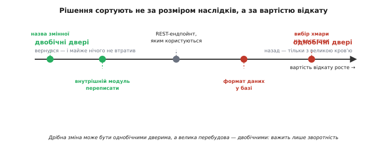
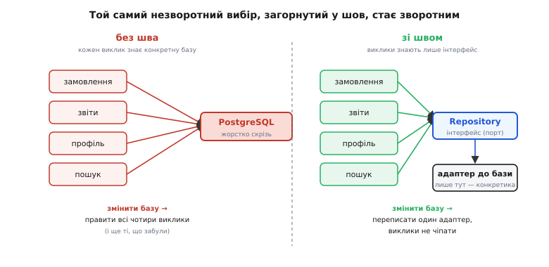
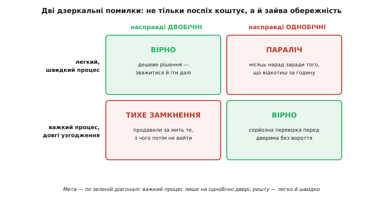

# Зворотні й незворотні рішення

<preknowlist>
- [Якісні атрибути](book:programming/quality-attributes) — «-ilities» системи (змінюваність, продуктивність, доступність); саме за них торгуються архітектурні рішення.
- [Trade-off-аналіз](book:programming/tradeoff-analysis) — рішення завжди щось віддає за щось; уміння бачити ціну кожного варіанта.
- [Архітектурні драйвери](book:programming/architectural-drivers) — те, що справді формує систему: ключові вимоги, обмеження, найризикованіші місця.
</preknowlist>

Спитайте досвідченого архітектора, що в його роботі найважче, — і рідко почуєте про якийсь конкретний патерн чи технологію. Найчастіше йдеться про інше: як не заплатити роками болю за рішення, ухвалене за п'ять хвилин на початку, коли про систему ще майже нічого не відомо. Бо деякі рішення потім не скасуєш — а деякі скасуєш легко, і плутати їх коштує дорого в обидва боки. Уся зрілість тут — навчитися розрізняти ці два роди й поводитися з кожним по-своєму.

Ключ, що все впорядковує, — не розмір наслідків, а **зворотність** (лат. *reversus* — повернутий назад). Питання не «наскільки це важливо», а «скільки коштуватиме це **скасувати**, коли з'ясується, що ми помилилися». І от виявляється, що ці два виміри майже не пов'язані: буває дрібне на вигляд рішення, з якого потім не вибратися, і буває масштабна перебудова, яку відкотити — раз плюнути.

## Двобічні й однобічні двері

Найточніший образ для цього подарував світові Джеф Безос у листах до акціонерів Amazon (2015 і 2016 років). Він розділив рішення на два роди — і назвав їх дверима. **Двобічні двері** (*two-way door*): пройшов, роздивився, не сподобалося — вернувся назад, і майже нічого не втратив. **Однобічні двері** (*one-way door*): пройшов — і назад ходу нема, або є, але з великою кров'ю. Ті самі два роди Безос ще позначив як **рішення Типу 2** (легкі, зворотні) і **Типу 1** (важкі, майже незворотні). [Історію цієї ідеї](book:programming/reversible-irreversible-decisions/hist-one-way-doors.md) — від економіста, що першим пов'язав незворотність зі складністю, до листів Amazon — винесено окремо.

І головна думка Безоса не в самій класифікації, а в тому, що з нею роблять організації. Що більшою стає компанія, то сильніша спокуса застосовувати **важкий** процес — довгі узгодження, багато підписів, паралічну обережність — до **всіх** рішень підряд, зокрема й до двобічних дверей. А це вбивчо: команда місяцями обговорює те, що можна було спробувати за годину й за годину ж відкотити. Тому розрізняти двері — не академічна вправа, а прямий важіль швидкості: важкий процес заслуговують лише однобічні двері, решта має проходитися легко й швидко.


*Рішення шикуються не за розміром наслідків, а за вартістю відкату. Дрібна на вигляд зміна (формат, у якому дані вже лягли в базу) може виявитися однобічними дверима, а велика перебудова внутрішнього модуля — двобічними. Важить лише те, скільки коштуватиме повернутися.*

> 🔧 **Навіщо це.** Це та лінза, крізь яку варто дивитися на кожне архітектурне рішення, перш ніж його ухвалювати. Спитайте себе одне: «Якщо через півроку виявиться, що це хибно, — скільки коштуватиме відкотити?» Дешево — вирішуйте швидко, самотужки, не скликаючи нікого; можна й помилитися, це не страшно. Дорого й боляче — ось сюди йдуть ваш час, аналіз і думки тих, хто платитиме за помилку. Розподілити свою увагу правильно — це вже половина ремесла.

## Чому незворотність — це саме складність

За образом дверей стоїть глибша, майже економічна причина, і вона пояснює, чому незворотні рішення так дорого обходяться. Її сформулював італійський економіст **Енріко Заніното** (Enrico Zaninotto) у доповіді на конференції XP 2002 (Сардинія, травень 2002): **незворотність — один із головних джерел складності**. Мартіна Фаулера це вразило настільки, що лягло в основу його есе «Кому потрібен архітектор?» (2003).

Думка така. Поки рішення зворотне, майбутнє тебе мало обходить: помилився — виправив. Але щойно рішення стає незворотним, ти мусиш **наперед** урахувати всі можливі майбутні стани, у яких воно тебе замкне, — бо жодного з них уже не переграєш. А передбачити все майбутнє неможливо, тож незворотні рішення тягнуть за собою хвіст здогадів, страхувань і «а що, як». Ось звідки складність. І звідси ж Фаулер вивів свій знаменитий погляд на роль архітектора: одна з найважливіших його задач — **прибирати незворотність**, знаходити способи зробити колись-необоротні рішення оборотними, щоб команда могла передумати згодом. Архітектор існує не для того, щоб ухвалити все наперед і правильно, — а для того, щоб дозволити помилитися й виправитися дешево.

Це перевертає звичну картину. Хочеться думати, що хороша архітектура — це коли на початку все продумали й вирішили. Насправді хороша архітектура — це коли на початку вирішили **якомога менше** незворотного, а решту лишили відкритою, поки не з'явиться знання, щоб вирішувати з відкритими очима.

## Як розпізнати рід дверей

Спокуса — судити за розміром: велике рішення однобічне, дрібне двобічне. Це підводить. Судити треба за одним конкретним питанням: **хто вже спирається на це рішення, і скільки їх доведеться зачепити, щоб його змінити.**

Найкоротший тест — порахувати вартість відкату по трьох осях:

```
Вартість відкату ≈ (скільки коду/людей уже залежить)
                 × (наскільки залежність жорстка — можна чи ні обійти шов)
                 × (чи можна вернутися тихо, чи вже видно назовні)
```

Розберемо на прикладах, бо саме тут ховається пастка.

**Внутрішня назва, стиль коду, вибір бібліотеки для внутрішнього модуля** — двобічні двері. Залежить лише твій код, залежність м'яка, назовні нічого не видно. Переплутав — перейменував, і по всьому. Сюди ж — переписати цілий внутрішній модуль: масштаб великий, але відкат дешевий, бо межа модуля тримає наслідки всередині.

**Формат, у якому дані вже лягли в базу** — однобічні двері, хоч рішення й дрібне на вигляд. Щойно в проді накопичилися мільйони записів у певній схемі, змінити її — це не правка коду, а міграція живих даних, часто без простою й без права втратити бодай рядок. Дані — це те, що переживає код; тому [схема даних](book:programming/data-contracts) майже завжди незворотніша за логіку, що її обробляє.

**Публічний контракт, яким уже користуються чужі** — однобічні двері, і що більше споживачів, то товщі. Зміниш формат [REST-ендпойнта](book:programming/rest-api), яким живляться десять зовнішніх команд, — зламаєш усіх десятьох одночасно, і відкликати це вже не в твоїй владі. Тому публічні API міняють не редагуванням, а версіонуванням: старе живе, нове стає поруч.

**Вибір хмарного провайдера чи фундаментальної платформи на весь стек** — найтовщі однобічні двері, бо на це рішення з часом спирається геть усе — від коду до навичок команди й контрактів. Що глибше воно вросло, то дорожчий вихід; це окрема велика тема — [прив'язка і вартість виходу](book:programming/lock-in-exit-cost).

## Головний прийом: розширювати двері

Найпотужніше, що вміє архітектор із цим усім, — не вгадувати правильні незворотні рішення (це майже неможливо), а **перетворювати однобічні двері на двобічні** ще до того, як у них увійдеш. Незворотність рідко буває властивістю самого рішення — частіше це властивість того, **як** воно вплетене в систему. Змініть плетиво — і те саме рішення стане оборотним.

Механізм простий: між рештою коду й незворотним вибором ставлять **шов** (англ. *seam*) — тонкий інтерфейс, за яким конкретний вибір захований. Тоді весь код спирається на інтерфейс, а не на вибір; змінити вибір означає переписати лише те, що за швом, а не всю систему. Класична форма такого шва — [порти й адаптери](book:programming/hexagonal-architecture): застосунок знає лише про порт-інтерфейс, а конкретна база чи зовнішній сервіс живе в адаптері.


*Той самий незворотний вибір бази стає зворотним, коли його загорнути в шов. Без шва зміна бази — це правка кожного виклику (і ще тих, про які забули). Зі швом — переписати один адаптер, а виклики не чіпати.*

Погляньмо, як шов працює в коді. Ось прямий доступ до бази — однобічні двері: тип бібліотеки бази протік у логіку, і кожне таке місце доведеться правити при зміні сховища.

:::tabs
```cpp
// БЕЗ ШВА: конкретна база протекла в бізнес-логіку
#include <pqxx/pqxx>   // тип PostgreSQL просочився сюди

double order_total(pqxx::connection& db, int order_id) {
    pqxx::work tx(db);
    auto row = tx.exec1(
        "SELECT total FROM orders WHERE id = " + std::to_string(order_id));
    return row[0].as<double>();     // і синтаксис, і тип — від PostgreSQL
}
```
```py
# БЕЗ ШВА: конкретна база протекла в бізнес-логіку
import psycopg2                    # тип PostgreSQL просочився сюди

def order_total(db: psycopg2.extensions.connection, order_id: int) -> float:
    with db.cursor() as cur:
        cur.execute(
            "SELECT total FROM orders WHERE id = %s", (order_id,))
        row = cur.fetchone()
        return float(row[0])        # і драйвер, і курсор — від PostgreSQL
```
```go
// БЕЗ ШВА: конкретна база протекла в бізнес-логіку
import "github.com/jackc/pgx/v5"   // тип PostgreSQL просочився сюди

func orderTotal(db *pgx.Conn, orderID int) float64 {
    var total float64
    db.QueryRow(context.Background(),
        "SELECT total FROM orders WHERE id = $1", orderID).Scan(&total)
    return total                    // і тип з'єднання, і плейсхолдер — від PostgreSQL
}
```
```ts
// БЕЗ ШВА: конкретна база протекла в бізнес-логіку
import { Client } from "pg";       // тип PostgreSQL просочився сюди

async function orderTotal(db: Client, orderId: number): Promise<number> {
    const res = await db.query(
        "SELECT total FROM orders WHERE id = $1", [orderId]);
    return Number(res.rows[0].total); // і клієнт, і формат рядків — від PostgreSQL
}
```
:::

А тепер той самий вибір за швом. Логіка знає лише інтерфейс `OrderRepo`; яка саме база під ним — її не обходить:

:::tabs
```cpp
// ЗІ ШВОМ: логіка знає тільки інтерфейс, база — за адаптером
struct OrderRepo {                       // порт: контракт без бази
    virtual double total(int order_id) = 0;
    virtual ~OrderRepo() = default;
};

double order_total(OrderRepo& repo, int order_id) {
    return repo.total(order_id);         // жодного сліду конкретної бази
}

// Конкретна база живе в ОДНОМУ місці — в адаптері:
struct PgOrderRepo : OrderRepo {         // сьогодні PostgreSQL...
    double total(int order_id) override { /* pqxx-запит саме тут */ }
};
// Завтра інша база — новий адаптер, а order_total і виклики не міняються.
```
```py
# ЗІ ШВОМ: логіка знає тільки інтерфейс, база — за адаптером
from abc import ABC, abstractmethod

class OrderRepo(ABC):                     # порт: контракт без бази
    @abstractmethod
    def total(self, order_id: int) -> float: ...

def order_total(repo: OrderRepo, order_id: int) -> float:
    return repo.total(order_id)           # жодного сліду конкретної бази

# Конкретна база живе в ОДНОМУ місці — в адаптері:
class PgOrderRepo(OrderRepo):             # сьогодні PostgreSQL...
    def total(self, order_id: int) -> float: ...  # psycopg2-запит саме тут
# Завтра інша база — новий адаптер, а order_total і виклики не міняються.
```
```go
// ЗІ ШВОМ: логіка знає тільки інтерфейс, база — за адаптером
type OrderRepo interface {                // порт: контракт без бази
    Total(orderID int) float64
}

func orderTotal(repo OrderRepo, orderID int) float64 {
    return repo.Total(orderID)            // жодного сліду конкретної бази
}

// Конкретна база живе в ОДНОМУ місці — в адаптері:
type PgOrderRepo struct{ db *pgx.Conn }  // сьогодні PostgreSQL...
func (r PgOrderRepo) Total(orderID int) float64 { /* pgx-запит саме тут */ }
// Завтра інша база — новий адаптер, а orderTotal і виклики не міняються.
```
```ts
// ЗІ ШВОМ: логіка знає тільки інтерфейс, база — за адаптером
interface OrderRepo {                     // порт: контракт без бази
    total(orderId: number): Promise<number>;
}

function orderTotal(repo: OrderRepo, orderId: number): Promise<number> {
    return repo.total(orderId);           // жодного сліду конкретної бази
}

// Конкретна база живе в ОДНОМУ місці — в адаптері:
class PgOrderRepo implements OrderRepo {  // сьогодні PostgreSQL...
    async total(orderId: number): Promise<number> { /* pg-запит саме тут */ return 0; }
}
// Завтра інша база — новий адаптер, а orderTotal і виклики не міняються.
```
:::

Двері з однобічних стали двобічними: щоб змінити базу, тепер пишуть новий клас-адаптер, а вся система вище шва лишається на місці.

Але шов — не безкоштовний, і в цьому вся чесність прийому. Кожен інтерфейс — це зайвий шар, який треба тримати в голові, писати й супроводжувати. Розширювати кожні двері підряд — означає потонути в абстракціях заради оборотності, яка ніколи не знадобиться. Тому шви ставлять **вибірково** — саме там, де за дверима справді вгадується незворотність і ненульова ймовірність передумати: сховище, зовнішній платіжний провайдер, конкретна хмарна служба. Де вибір явно двобічний і так — шов лише додає ваги задарма. Це рішення саме по собі теж trade-off, і його роблять свідомо.

## Другий прийом: відкладати й купувати оборотність

Якщо двері однобічні й розширити їх не виходить, лишається інша зброя — **не входити в них, поки можна цього не робити**. Що пізніше ти ухвалюєш незворотне рішення, то більше знань устигло накопичитися, і то менший шанс промазати. Це окремий важливий принцип — [останній відповідальний момент](book:programming/last-responsible-moment): рішення тримають відкритим не до безконечності, а рівно до тієї миті, після якої зволікання вже саме починає коштувати дорожче, ніж дає відкладання.

А коли ухвалити треба вже зараз, попри туман, — оборотність можна буквально **докупити**. Замість того щоб продавити одне велике незворотне рішення на всю систему, роблять дешевий зворотний крок і дивляться, що вийде. Тонкий наскрізний зріз системи, що вже працює від краю до краю, — [walking skeleton](book:programming/walking-skeleton) — коштує копійки, а показує на живому, чи витримає обраний шлях, поки з нього ще легко зійти. Це і є суть [рішень під невизначеністю](book:programming/deciding-under-uncertainty): не вгадати наосліп, а зробити ставку якомога зворотнішою й дешевшою, щоб дізнатися правду до того, як двері зачиняться.

## Дві дзеркальні помилки

Тепер видно, що плутанина двох родів дверей коштує дорого — і, що важливо, **в обидва боки**, не лише поспіхом.


*Помилитися можна двома дзеркальними способами. Важкий процес на двобічні двері — це параліч: місяць нарад заради того, що відкотиш за годину. Легкий процес на однобічні двері — тихе замкнення: продавили за мить те, з чого потім роками не вибратися. Мета — по зеленій діагоналі.*

Перша помилка гучна й очевидна — **параліч**: команда ставиться до двобічних дверей як до однобічних, обвішує кожне дрібне рішення нарадами й узгодженнями, боїться зробити крок. Саме її мав на увазі Безос, кажучи, що великі організації тонуть у власній обережності. Ліки прямі: побачив двобічні двері — вирішуй швидко й іди, а якщо помилився, вернешся.

Друга помилка тиха й куди підступніша — **непомічене замкнення**: щось трактують як двобічні двері, ухвалюють мимохідь, за п'ять хвилин, — а воно виявляється однобічним, і система тихо замикається. Ніхто в той момент не б'є на сполох, бо рішення здавалося дрібним; ціна приходить через рік, коли виявляється, що з обраного формату даних, чи прив'язки до одного вендора, чи протеклого всюди типу — уже не вийти без болю. Ця помилка не кричить — тому й небезпечніша.

Обидві лікуються тим самим питанням, поставленим **перед**, а не після: «Скільки коштуватиме це відкотити?» Воно одне відводить і від паралічу над дрібницею, і від безтурботного кроку в двері без вороття. І коли рішення таки виявилося однобічним і важливим, його не лишають у чиїйсь голові — його записують разом із причинами, альтернативами й ціною відкату в [журнал архітектурних рішень (ADR)](book:programming/architecture-decision-records), щоб через рік хтось зрозумів, чому ці двері зачинили саме так.

## Швидкість проти правильності

Наостанок — про економіку, бо саме заради неї все це й робиться. Тут криється проста асиметрія, яку добре вловив той-таки Безос: більшість рішень варто ухвалювати, маючи десь **70%** інформації, яку хотілося б мати. Чекати на 90% — здебільшого вже запізно. «Помилитися може бути дешевше, ніж здається, а от зволікати — дорого напевно.»

Але ця сміливість тримається на одній передумові — **на зворотності**. Ухвалювати з 70% знання нормально рівно тоді, коли двері двобічні: помилка виправна, тож швидкість дешевша за обережність. Перед однобічними дверима та сама сміливість стає безрозсудством — тут якраз варто дочекатися повнішого знання, бо другого шансу не буде. Тому вся дисципліна зводиться до одного руху: спершу розпізнай рід дверей, а вже тоді обирай темп. Двобічні — швидко й сміливо, ціна помилки мала. Однобічні — повільно й уважно, бо назад ходу нема. Уся економіка архітектурних рішень тримається на цьому єдиному розрізненні.
