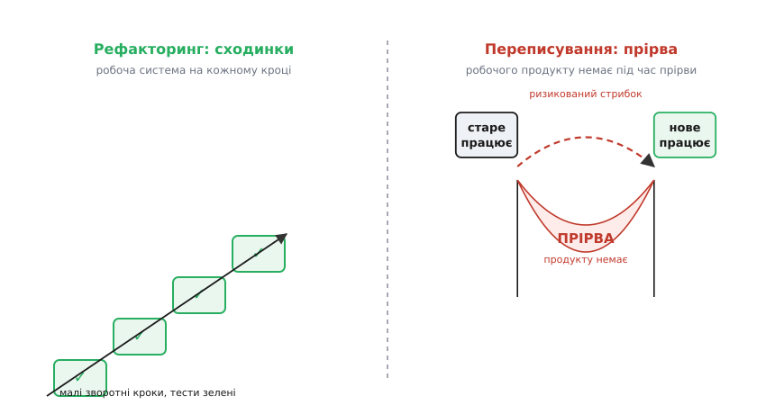
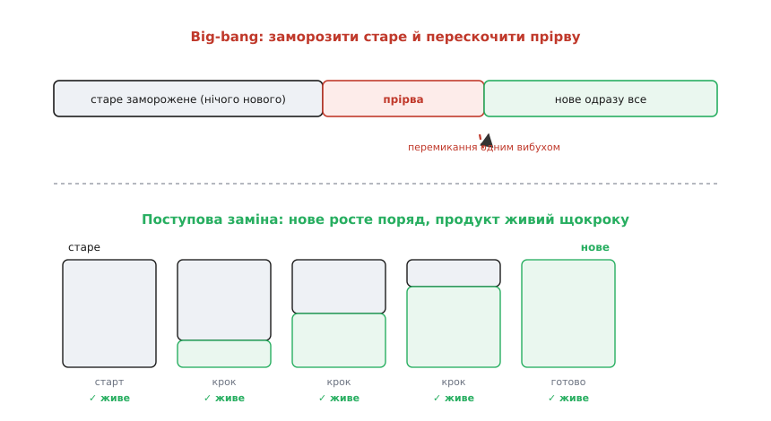

# Rewrite vs refactor

<preknowlist>
- [Технічний борг і вартість зміни](book:programming/technical-debt) — чому заплутаний код здорожчує кожну наступну зміну і як цей борг накопичується відсотками.
- [Еволюційна архітектура як дефолт](book:programming/evolutionary-architecture) — система живе під постійним потоком змін; питання не «спроєктувати назавжди», а «вміти безпечно мінятися далі».
- [Зворотні й незворотні рішення](book:programming/reversible-irreversible-decisions) — чому вартість відкату важливіша за розмір наслідків; однобічні й двобічні двері.
- [Ризик-мислення](book:programming/risk-thinking) — ризик як добуток імовірності на наслідок; де в рішенні сидить найбільша непевність.
- [Trade-off-аналіз](book:programming/tradeoff-analysis) — будь-яке рішення платить одним за інше; як цю ціну помічати до того, як заплатив.
</preknowlist>

Настає день, коли на стару систему дивитися боляче. Код заплутаний, кожна нова функція дається кров'ю, свіжий розробник тижнями не може зрозуміти, де що лежить, а на питання «чому тут так» ніхто вже не відповість — автор пішов три роки тому. І виникає спокуслива, майже фізіологічна думка: **знести це все й написати заново, як слід**. Цього разу — чисто, правильно, без старих гріхів. Думка ця приходить майже до кожного, хто довго супроводжує живу систему, і майже завжди вона небезпечніша, ніж здається.

Питання «переписати чи вичистити» (rewrite vs refactor) — це не про смак і не про те, хто акуратніший програміст. Це архітектурне рішення про **ризик і вартість**, одне з найдорожчих, які взагалі ухвалюють над системою. Помилитися тут коштує не годин, а людино-років і часом самого продукту. Тому розберімося чесно: що насправді означає кожен із двох шляхів, звідки береться спокуса третього — і чому вона так часто гине.

## Два слова, які плутають

Спершу розведімо поняття, бо їх постійно вживають як синоніми, а вони протилежні за суттю.

**Рефакторинг (англ. *refactoring*, від *re-* — знову + *factor* — розкладати на множники)** — це зміна **внутрішньої** будови коду **без зміни його зовнішньої поведінки**. Ключове тут — друга половина означення. Ви перекладаєте меблі в кімнаті, але стіни, двері й вікна лишаються там, де були; хто заходить, бачить ту саму кімнату. Функція, яку рефакторять, робить рівно те саме до й після — просто зсередини вона стала зрозумілішою, і наступну зміну в ній внести легше. Це рух **малими, зворотними кроками**: перейменував, виділив метод, розбив клас — і після кожного кроку система досі працює, тести досі зелені.

**Переписування (rewrite)** — це відкинути наявний код і **написати нову реалізацію заново**. Стару поведінку зазвичай хочуть зберегти (система має й далі робити те, що робила), але **весь код під нею — новий**. Це не перекласти меблі, а знести кімнату до фундаменту й будувати нову. І поки нова стіна не стоїть, жити в кімнаті не можна.

Різниця, яка все вирішує, — **у розмірі кроку й у тому, чи є в кожен момент робоча система**. Рефакторинг ніколи не лишає вас без працюючого продукту: він увесь час зелений, ви можете спинитися будь-якої миті й у вас на руках щось живе. Переписування натомість відкриває **прірву**: між «старе ще працює» і «нове вже працює» лежить провал, під час якого нового продукту ще немає, а старий заморожений. Уся небезпека переписування живе в цій прірві.

> 🔧 **Навіщо це.** Коли на нараді хтось каже «нам треба це відрефакторити» — часто мають на увазі «переписати». Це не педантизм щодо слів: два слова означають два зовсім різні профілі ризику, і сплутати їх означає ухвалити найдорожче рішення в житті системи, не помітивши, що ти його ухвалив. Перше, що робить тверезий архітектор, почувши «перепишемо» — питає: ми справді відкидаємо код, чи насправді хочемо його поступово вичистити?


*Рефакторинг іде сходинками, лишаючи робочу систему на кожному кроці; переписування розриває шлях прірвою, під час якої робочого продукту немає взагалі. Уся ризикова відмінність між двома шляхами — у цій прірві.*

## Чому переписування вабить — і чому це пастка

Спокуса переписати спирається на реальний біль, тож відмахнутися від неї не можна. Код і справді поганий, змінювати його і справді дорого — це не ілюзія. Пастка не в діагнозі, а у висновку, який із нього роблять. Розкладімо, звідки береться потяг і де він бреше.

Перше джерело — **читати чужий код важче, ніж писати свій**. Це майже закон психології програмування: коли ти дивишся на заплутану функцію, твій мозок каже «яке сміття, я б написав удесятеро краще». І він щиро в це вірить. Але він порівнює **реальний** старий код, обвішаний усіма латками життя, з **уявним** новим, іще не написаним і тому досі ідеальним. Це нечесне порівняння: щойно уявний код почнуть писати, у нього полізуть ті самі латки — просто нові.

Друге, тонше й найважливіше: **у заплутаному коді захована робота років**. Це головний аргумент, який Джоел Спольський зробив відомим у своєму есеї [«Речі, яких не можна робити ніколи»](book:programming/rewrite-vs-refactor/hist-never-rewrite.md) 2000 року, розбираючи, як переписування з нуля майже поховало браузер Netscape. Суть така: кожен потворний рядок у старому коді — це, найімовірніше, **виправлена бага**. Хтось колись натрапив на реальну проблему в реальних умовах і залатав її саме цим негарним рядком. Викинувши код, ви викидаєте не потворність — ви викидаєте **знання про всі граничні випадки**, зібране роками зіткнень із реальністю. І нова система наступить на кожні з тих граблів заново, одні за одними, поки не збере той самий досвід — і не обросте так само.

Третє джерело — **ілюзія чистого аркуша**. Здається, що з нуля можна зробити правильно, бо ніщо не заважає. Але тут чигає давно описана пастка: [ефект другої системи](book:programming/second-system-effect) (англ. *second-system effect*) — схильність, переписуючи, напхати в нову версію все, що не влізло в першу. Перша система вийшла скромною й чистою, бо автор боявся, що не знає, що робить. Друга роздувається від упевненості й амбіцій — усі відкладені «а тут ще б додати» тепер здаються можливими. Це вперше сформулював Фред Брукс іще 1975 року, спостерігаючи, як друга система інженера виходить найнебезпечнішою з усіх, що він спроєктує.

І над усім цим — **економіка прірви**. Поки команда переписує, вона не додає користувачам нічого нового: усі сили йдуть на те, щоб нова система **дійшла хоча б до того, що стара вже вміла**. Конкурент тим часом не спить і рухається вперед. Netscape витратив на переписування близько трьох років — і за цей час програв ринок. Ось точна ціна прірви: не тільки праця на нову систему, а й **уся втрачена рухливість**, поки ти в ній сидиш.

> 🔧 **Навіщо це.** Аргумент про «захований у коді досвід» — найсильніший практичний важіль проти імпульсивного переписування, і його варто вміти вимовити на нараді. Коли хтось каже «код жахливий, перепишемо» — спокійне питання «а скільки виправлених за п'ять років баг ми разом із ним викинемо?» часто розвертає розмову. Бо відповідь — «усі», і нова система збиратиме їх наново, коштуючи ще й часу, поки збирає.

## Коли рефакторинг — правильна відповідь (майже завжди)

Розберімо, чому рефакторинг — дефолт, а переписування — виняток, який ще треба заслужити.

Головна перевага рефакторингу — він **не має прірви**. Ви весь час на робочій системі, а отже, весь час можете **спинитися й здати те, що маєте**. Це прямо випливає з логіки [зворотних рішень](book:programming/reversible-irreversible-decisions): малий крок рефакторингу — двобічні двері, його легко відкотити, якщо він не спрацював. Переписування ж — одні великі однобічні двері: почав — і мусиш дійти, бо повернутися нема куди, старе вже застигло. Дисципліна архітектора каже надавати перевагу оборотному над необоротним завжди, коли можна, — а тут якраз можна.

Друга перевага — рефакторинг **зберігає захований досвід**. Ви не викидаєте виправлені баги; ви несете їх із собою, поступово перекладаючи в чистіший вигляд, але жодного разу не втрачаючи. Система стає кращою, не забувши того, чого навчилася.

Але рефакторинг має **тверду передумову**, без якої він перетворюється на азартну гру: **тести**. Означення рефакторингу — «змінити будову, не змінивши поведінку». Але як ви **знаєте**, що поведінка не змінилася? Тільки тести, які проганяються після кожного кроку, ловлять мить, коли ви ненавмисно щось зламали. Без них ви не рефакторите — ви наосліп правите живий код і сподіваєтеся, що нічого не відвалилось. Тому перед серйозним рефакторингом старого коду, у якого тестів нема, спершу пишуть **характеризаційні тести** (англ. *characterization tests*) — тести, що фіксують **поточну** поведінку системи, яка вона є, з усіма її дивацтвами. Не «як має бути», а «як є зараз» — щоб будь-яка ненавмисна зміна цієї поведінки одразу впала червоним.

Ось як така страхувальна сітка виглядає в коді. Маємо заплутану функцію нарахування знижки, яку страшно чіпати. Спершу — тест, що прибиває її нинішню поведінку до місця, **не суперечки про правильність**, а фіксацію факту:

:::tabs
```cpp
// Характеризаційний тест: фіксуємо поведінку ЯК Є, перед рефакторингом.
// Ми не питаємо «чи правильно 15%» — ми фіксуємо, що ЗАРАЗ саме 15%,
// щоб рефакторинг випадково цього не зрушив.
TEST(LegacyDiscount, VipOverThreshold) {
    Cart cart;
    cart.add({.price = 100.0, .qty = 12});   // сума 1200, поріг VIP
    double got = compute_discount(cart, /*vip=*/true);
    EXPECT_NEAR(got, 180.0, 1e-9);           // ← спостережена нинішня величина
}
```
```py
# Характеризаційний тест: фіксуємо поведінку ЯК Є, перед рефакторингом.
# Ми не питаємо «чи правильно 15%» — ми фіксуємо, що ЗАРАЗ саме 15%,
# щоб рефакторинг випадково цього не зрушив.
def test_legacy_discount_vip_over_threshold():
    cart = Cart()
    cart.add(price=100.0, qty=12)            # сума 1200, поріг VIP
    got = compute_discount(cart, vip=True)
    assert got == pytest.approx(180.0)       # ← спостережена нинішня величина
```
```go
// Характеризаційний тест: фіксуємо поведінку ЯК Є, перед рефакторингом.
// Ми не питаємо «чи правильно 15%» — ми фіксуємо, що ЗАРАЗ саме 15%,
// щоб рефакторинг випадково цього не зрушив.
func TestLegacyDiscountVipOverThreshold(t *testing.T) {
    cart := Cart{}
    cart.Add(Item{Price: 100.0, Qty: 12})    // сума 1200, поріг VIP
    got := ComputeDiscount(cart, true /*vip*/)
    if math.Abs(got-180.0) > 1e-9 {          // ← спостережена нинішня величина
        t.Errorf("got %v, want 180.0", got)
    }
}
```
:::

Тепер, коли сітка натягнута, функцію можна чистити малими кроками — виділяти зрозумілі шматки, давати іменам сенс, розбивати монстра на частини:

:::tabs
```cpp
// Крок рефакторингу: та сама поведінка, зрозуміліша будова.
// Магічні числа стали іменами, гілки — окремими функціями.
static constexpr double VIP_THRESHOLD = 1000.0;
static constexpr double VIP_RATE      = 0.15;

double compute_discount(const Cart& cart, bool vip) {
    const double subtotal = cart.subtotal();
    if (vip && subtotal >= VIP_THRESHOLD)
        return subtotal * VIP_RATE;          // 1200 · 0.15 = 180 — тест досі зелений
    return regular_discount(subtotal);
}
```
```py
# Крок рефакторингу: та сама поведінка, зрозуміліша будова.
# Магічні числа стали іменами, гілки — окремими функціями.
VIP_THRESHOLD = 1000.0
VIP_RATE      = 0.15

def compute_discount(cart: Cart, vip: bool) -> float:
    subtotal = cart.subtotal()
    if vip and subtotal >= VIP_THRESHOLD:
        return subtotal * VIP_RATE           # 1200 · 0.15 = 180 — тест досі зелений
    return regular_discount(subtotal)
```
```go
// Крок рефакторингу: та сама поведінка, зрозуміліша будова.
// Магічні числа стали іменами, гілки — окремими функціями.
const (
    VipThreshold = 1000.0
    VipRate      = 0.15
)

func ComputeDiscount(cart Cart, vip bool) float64 {
    subtotal := cart.Subtotal()
    if vip && subtotal >= VipThreshold {
        return subtotal * VipRate            // 1200 · 0.15 = 180 — тест досі зелений
    }
    return regularDiscount(subtotal)
}
```
:::

Тест зелений до й після — отже, поведінку збережено, а код став придатнішим до наступної зміни. Ось що таке рефакторинг: не «переписати краще», а **безперервно тримати систему в тонусі, не втрачаючи жодної миті її працездатності**. Цю страхувальну техніку — характеризаційні тести навколо коду без тестів — детальніше розбирає окрема тема [археологія legacy](book:programming/legacy-archaeology).

## Коли переписування таки виправдане

Було б нечесно оголосити переписування завжди хибним — інакше це догма, а не інженерія. Є вузькі, але реальні випадки, коли воно правильне. Спільне в них одне: **рефакторинг фізично не веде туди, куди треба**. Бо рефакторинг — це неперервний шлях малих кроків від наявної точки; якщо між тим, що є, і тим, що потрібно, **немає неперервного шляху**, малими кроками туди не дійти, скільки їх не роби.

Коли такий шлях справді розірваний? По-перше, коли **міняється сама основа**, а не будова над нею: платформа, мова чи ключова технологія знята з підтримки, і код фізично більше немає на чому запустити. Тут нема чого поступово покращувати — ґрунт пішов з-під ніг. По-друге, коли **вимоги до системи змінилися так глибоко**, що стара будова їм структурно суперечить: систему на один потік користувачів просять зробити розподіленою на мільйони — це не «поліпшити наявне», а інша система за призначенням. По-третє — чесний, хоч і рідкісний випадок: код **настільки без тестів і настільки заплутаний**, що навіть характеризаційну сітку на нього не натягнути, бо поведінку неможливо відтворити передбачувано. Тоді рефакторинг просто нема на що спертися.

Але — і це головне застереження — навіть коли переписування виправдане, **прірву треба звузити до нитки**. Величезне «заморозимо старе, два роки пишемо нове, тоді разом перемкнемося» (його звуть *big-bang rewrite*, переписування одним вибухом) — майже завжди катастрофа, незалежно від того, наскільки виправдана сама мета. Тому зрілий підхід — не переписувати одним стрибком, а **замінювати частинами, лишаючись живим щокроку**. Дві техніки роблять саме це.

**Strangler fig** (буквально «фікус-душитель» — за деревом, що обплітає старе й поступово заступає його собою): нову систему вирощують **навколо** старої, шматок за шматком перехоплюючи в неї функції, аж доки стара не спорожніє й її не приберуть. У кожен момент частина працює на новому, решта — на старому, і робоча система є завжди. Механіку цього поступового витіснення розбирає окрема тема [strangler fig](book:programming/strangler-fig).

**Branch by abstraction** (гілкування через абстракцію): між кодом і тим, що переписують, спершу вставляють **шов** — інтерфейс, за яким ховається стара реалізація. Тоді під тим самим швом пишуть нову, перемикають на неї — і лише коли впевнилися, прибирають стару. Прірви знову немає: обидві реалізації живуть за одним контрактом, поки триває заміна. Цю техніку тримати систему зеленою під час глибокої заміни розбирає тема [branch by abstraction](book:programming/branch-by-abstraction).

Обидві роблять одне: **перетворюють переписування з прірви назад на сходинки**. Замість одного велетенського однобічного стрибка — низка малих зворотних кроків, кожен із яких лишає робочу систему. Тобто навіть коли ти мусиш переписати, розумний шлях — зробити це якомога більше **схожим на рефакторинг**: малими кроками, з живим продуктом на кожному.


*Big-bang заморожує старе й стрибає через прірву одним ризикованим кроком; поступова заміна (strangler fig, branch by abstraction) вирощує нове поряд зі старим, лишаючи робочу систему щокроку. Правильне переписування максимально схоже на рефакторинг.*

## Як вирішувати: питання, а не настрій

Складімо це в рішення, яке можна ухвалити тверезо, а не під наплив втоми від старого коду. Хибний спосіб вирішувати — за силою відрази: «набридло, переписуємо». Правильний — поставити системі кілька питань і чесно на них відповісти. Ось нитка міркування, у порядку, у якому її варто проходити.

Найперше: **чи ця система взагалі житиме далі?** Рефакторинг і тим паче переписування — інвестиція, яка окупається лише майбутніми змінами. Якщо систему за півроку списують, у неї не варто вкладати ні того, ні того — доживе як є. Вкладаються тільки в те, що житиме й мінятиметься; тут працює та сама логіка [рішень під невизначеністю](book:programming/deciding-under-uncertainty) — оцінити очікуваний вік і темп змін, перш ніж витрачатися.

Друге: **чи є неперервний шлях малих кроків від того, що є, до того, що треба?** Якщо основа жива, вимоги не перевернулися й на код можна натягнути тести — шлях є, і відповідь майже завжди **рефакторинг**. Якщо ґрунт пішов з-під ніг (платформа мертва, вимоги структурно інші, тести неможливі) — шлях розірваний, і тоді на столі переписування.

Третє, якщо дійшло до переписування: **чи можна звузити прірву до нитки?** Майже завжди можна — через strangler fig чи branch by abstraction. Big-bang лишають тільки тоді, коли систему фізично не розрізати на шматки, — і йдуть на нього з розплющеними очима, знаючи, що беруть найризикованіший із можливих шляхів.

І над усіма трьома — чесний [trade-off-аналіз](book:programming/tradeoff-analysis): що саме ми виграємо переписуванням і чим за це платимо. Виграш зазвичай — чистіша будова й нижча вартість майбутніх змін. Плата — місяці чи роки без нового для користувача, ризик не відтворити захований у старому коді досвід, і жива небезпека, що нова система за той самий час обросте власним безладом. Часто, коли цю ціну виписати чесно, виявляється, що дисциплінований рефакторинг дає 80% омріяної чистоти за 20% ризику переписування. І тоді рішення стає очевидним.

Ось чому дефолт саме такий: **рефакторуй; переписуй лише коли рефакторинг фізично не веде туди, куди треба; а якщо переписуєш — зроби це якомога більше схожим на рефакторинг**. Не тому, що переписування завжди зле, а тому, що воно виводить систему на прірву, а прірва — найдорожче місце в житті будь-якого коду. Вправність тут не в сміливості знести все й почати заново, а в терплячій майстерності вести систему до кращого стану, жодного разу не лишивши її мертвою.
