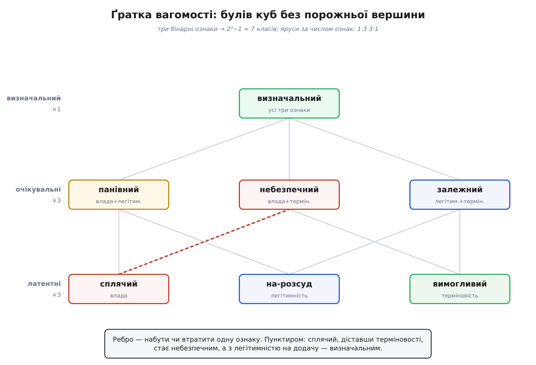
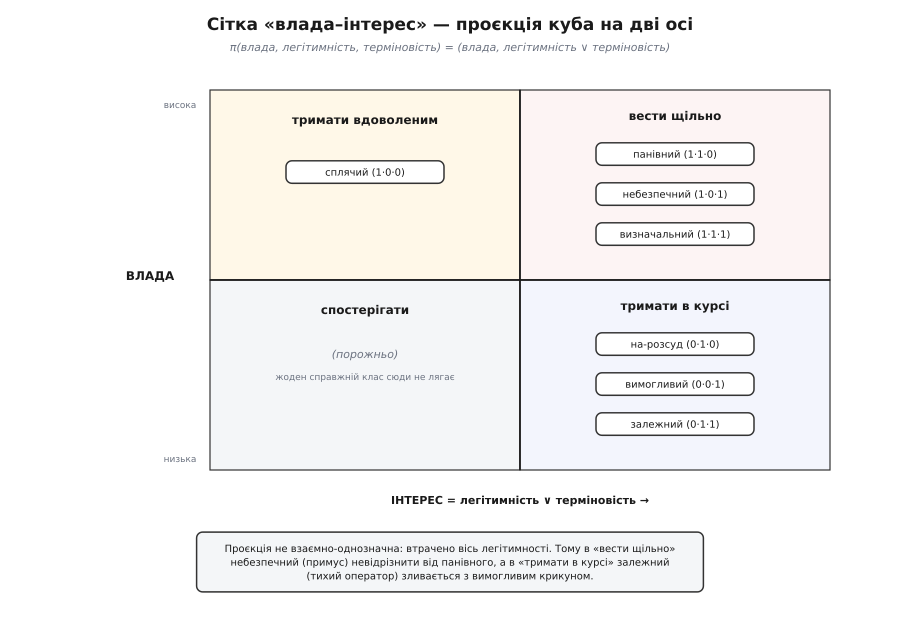
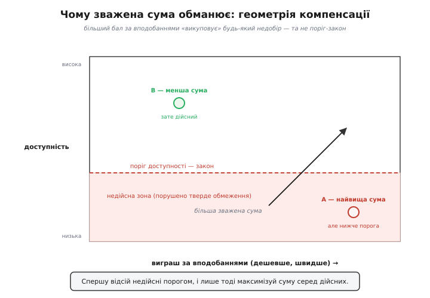
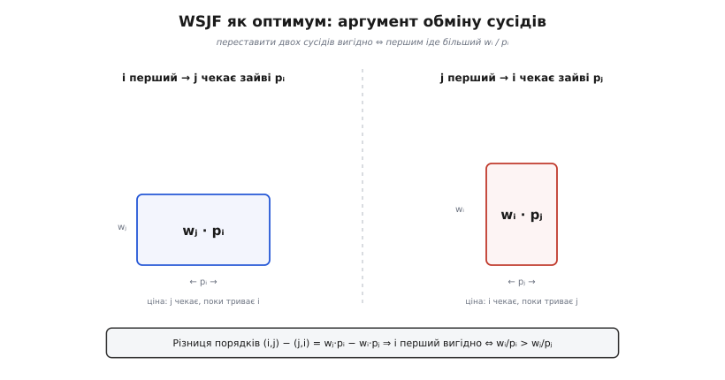

# 🧮 Алгебра вагомості й пріоритету турбот

Розмова про стейкхолдерів звучить м'яко: люди, їхні бажання, чесність, канали голосу. Та під цією м'якою поверхнею лежить тверда механіка, і саме вона відрізняє архітектора, який «врахував думки», від того, хто ухвалив захищене рішення. Механіка ця — три окремі шматки математики, кожен відповідає на своє питання. Перше: яку точну форму має типологія стейкхолдерів і чому класів рівно сім, а не п'ять чи дванадцять? Друге: чому не можна просто скласти бажання в один бал — і що робити натомість? Третє: коли черга неминуча, у якому порядку обслуговувати, щоб це був доведений оптимум, а не жест? Розберімо кожне від першопричини — булева ґратка, лексикографічний фільтр і відношення з теорії розкладів. Наприкінці стане видно, що «облік стейкхолдерів» місцями зовсім не м'яка розмова, а задача з доведеннями.

## Вагомість як точка в булевому кубі

Почнімо з того, що взагалі означає «зважити» стейкхолдера. Мітчелл, Ейгл і Вуд 1997 року (усталена, багатоцитована праця «Toward a Theory of Stakeholder Identification and Salience») показали, що вагомість стейкхолдера щодо системи складається рівно з трьох ознак, і кожну людина або **має**, або **ні**: влада, легітимність, терміновість. Ми тут не переказуємо їхню типологію, а виводимо її кістяк із самої комбінаторики — бо так стане видно, чому саме сім класів і чому вони діляться на три яруси.

Формалізуймо. Вагомість — це не число, а **трійка бітів**: для кожної осі ставимо 1, якщо ознака присутня, і 0, якщо ні.

```
s = (p, l, u),   де   p, l, u ∈ {0, 1}
   p — влада присутня?         (важіль змусити)
   l — легітимність присутня?  (право вимагати)
   u — терміновість присутня?  (не терпить зволікання)

можливих сполучень трьох бітів:  2³ = 8
```

Кожен стейкхолдер — це одна з вершин **булевого куба** {0,1}³: восьми кутів тривимірного кубика, де рухатись уздовж ребра означає ввімкнути чи вимкнути одну ознаку. Одна вершина особлива — (0,0,0): ні влади, ні права, ні поспіху. Це **взагалі не стейкхолдер** — людина без жодної ставки до системи стосунку не має. Викидаємо її:

```
класів вагомості = 2³ − 1 = 7
```

Ось перше число теми, і воно не завчене, а **вирахуване**: сім — це кути куба мінус один порожній.

## Ґратка: чому сім, і звідки береться 1·3·3·1

Тепер найцікавіше — не просто скільки класів, а як вони **розкладаються**. Порахуймо їх не гуртом, а за **числом присутніх ознак** k. Скільки способів увімкнути рівно k ознак із трьох? Це число сполук C(3, k) — «скільки підмножин розміру k має множина з трьох елементів». І тут з'являється візерунок, який годі проґавити:

```
ярус за числом ознак k       класів = C(3, k)
 k = 0   жодної ознаки        C(3,0) = 1   → (не стейкхолдер — відкинуто)
 k = 1   латентні             C(3,1) = 3   → сплячий, на-розсуд, вимогливий
 k = 2   очікувальні          C(3,2) = 3   → панівний, небезпечний, залежний
 k = 3   визначальний         C(3,3) = 1   → усі три ознаки
                              разом (k ≥ 1):  3 + 3 + 1 = 7
```

Числа 1·3·3·1 — це рядок **трикутника Паскаля**, шар за шаром гіперкуба. Три яруси, які Мітчелл, Ейгл і Вуд назвали **латентними**, **очікувальними** й **визначальним**, — не довільна таксономія, приліплена зверху, а буквально рівні куба за кількістю ввімкнених бітів. Латентних і очікувальних порівну (по три) не випадково: вибрати одну ознаку з трьох і вибрати одну, яку **пропустити**, — те саме число, тому C(3,1) = C(3,2) = 3. Симетрія Паскаля тут — не прикраса, а причина, чому ярус «однієї ознаки» й ярус «двох ознак» однаково залюднені.

А тепер додаймо порядок і отримаймо **ґратку** (англ. *lattice* — решітка). Упорядкуймо класи за вкладенням їхніх наборів ознак: {влада} ⊆ {влада, терміновість} ⊆ {влада, легітимність, терміновість}. Дістанемо діаграму Гассе — три поверхи, з'єднані ребрами, де **ребро означає рівно одну зміну**: набути чи втратити одну ознаку.



*Ярус — це кількість присутніх ознак: 1·3·3·1, рядок Паскаля. Ребро — набуток чи втрата однієї ознаки; пунктиром показано, як сплячий, діставши терміновості, стає небезпечним, а з легітимністю на додачу — визначальним.*

Ось де ґратка платить за себе. Вона дає не статичний перелік, а **динаміку**, і показує її топологією. Сплячий (сама влада — юридичний відділ, що поки мовчить) стоїть за одне ребро від небезпечного: досить набути терміновості. За ще одне ребро — визначальний. Отже, ґратка миттю відповідає на питання, яке інакше довелося б вгадувати: **хто за один крок від вершини?** Латентний клас, суміжний із визначальним через двох сусідів, — це той, кого тримають на оці, бо одна подія (новий закон, спливлий дедлайн) переводить його через ребро вгору. Плаский список сімох імен цього не бачить; ґратка бачить, бо в ній закодовано, які переходи — сусідні, а які — далекі.

> 🔧 **Навіщо це.** Коли реєстр стейкхолдерів «раптом» вибухає — учорашній тихий став сьогодні визначальним — це не сюрприз, а рух ребром ґратки, який можна було передбачити. Дивись не на теперішній ярус людини, а на її **сусідів угорі**: сплячий регулятор, до якого підходить дата набуття чинності норми, — за одне ребро від того, щоб кинути все. Ґратка перетворює «нас заскочило» на «ми знали, куди він рухається».

## Чому осі саме бінарні — і що дала б четверта

Тут природне заперечення: навіщо грубі 0/1, коли влада буває більша й менша? Чому не міряти кожну вісь числом від 0 до 1? Відповідь глибша, ніж «так простіше», і вона зшиває цю частину з наступною.

Якби кожна вісь стала неперервною, вагомість перетворилася б на **скаляр** — зважену суму трьох осей, — і ми б із'їхали рівно в ту пастку, яку розберемо далі: влади багато, легітимності нуль, а добуток однаково «показує вагомість», бо надлишок влади **викупив** брак права. Бінарні осі цього не дозволяють за побудовою: право вимагати ти або маєш, або ні, і жодна кількість влади його не купить. Тобто присутність-чи-відсутність тримає модель **типологією** (яка людина?), а не **балом** (скільки набрала?) — і саме тому осі не торгуються одна за одну. Це не спрощення від бідності, а свідома відмова від компенсації там, де компенсації бути не повинно.

А що дала б четверта ознака? Порахуймо чесно:

```
осей 3:   2³ − 1 = 7   класів    яруси 1·3·3·1
осей 4:   2⁴ − 1 = 15  класів    яруси 1·4·6·4·1
осей d:   2ᵈ − 1  класів         — росте як 2ᵈ
```

Четверта вісь **більш ніж подвоює** число класів: п'ятнадцять архетипів замість семи, і тримати їх усі як контрольний список голова вже не може. Це не гіпотетика — таку четверту ознаку пропонували насправді: Дрісколл і Старік (2004, «The Primordial Stakeholder», *Journal of Business Ethics* 49:55–73) додали **близькість** (англ. *proximity*), щоб обґрунтувати статус природного середовища як стейкхолдера фірми. Математика підказує, коли четверта вісь варта вибуху класів, а коли ні: **лише якщо вона незалежна** від трьох наявних. Якщо нова ознака — лінійна комбінація старих (близькість, що майже завжди йде в парі з терміновістю), вона не породжує нових **розрізнень**, тільки дублює вершини, — і платня у вигляді 15 класів іде намарне. Три осі — точка рівноваги: досить, щоб розвести архетипи, які треба поводити по-різному, і мало, щоб лишитися придатним до вжитку переліком. Правило додавання осі суворе: вона мусить і **розколоти** клас, який ти справді обслуговуєш інакше, і бути **незалежною** від наявних. Рідко коли обидві умови справджуються — тому й тримаються трьох.

## Сітка «влада–інтерес» як проєкція куба

Три осі точні, та для щоденної наради важкі. Тому поряд живе дешевша дводенна сітка «влада–інтерес» (її подав Обрі Мендельоу 1991 року). Формально це **проєкція** куба на площину — відображення, що навмисно забуває частину інформації:

```
π(влада, легітимність, терміновість) = (влада,  інтерес),
   де   інтерес = легітимність ∨ терміновість
```

Влада лишається віссю, а легітимність із терміновістю зливаються в один біт «інтересу» через **АБО**: людині не байдуже, якщо в неї є правомірна претензія **або** пекучий дедлайн. Подивімось, куди кожен із семи класів падає під цією проєкцією:



*У кожному «важкому» квадранті сидить не один клас, а цілий прообраз із трьох — і всередині нього класи, які треба поводити протилежно, стають невідрізненними.*

Прообраз кожного квадранта (набір класів, що туди злилися) видає всю суть:

```
квадрант                прообраз (класи, що злилися сюди)
вести щільно  (1,1)     панівний, небезпечний, визначальний
тримати в курсі (0,1)   на-розсуд, вимогливий, залежний
тримати вдоволеним (1,0) сплячий
спостерігати  (0,0)     — порожньо —
```

Дві речі впадають в око. Перша: нижній лівий квадрант «спостерігати» **порожній** від справжніх стейкхолдерів. Це не випадковість, а наслідок проєкції: будь-який реальний клас має щонайменше одну ознаку, а якщо в нього немає влади, то лишаються легітимність чи терміновість — і тоді інтерес = 1 автоматично. У кут (0,0) падає тільки (0,0,0) — не-стейкхолдер. Ось чому в цей квадрант часом саджають «широку публіку»: тих, хто не важить на жодній осі.

Друга, важливіша: проєкція **не взаємно-однозначна** — три класи чавляться в один квадрант, і повернути їх назад неможливо. А втрачена координата тут не абияка — це **легітимність**. У прообразі «вести щільно» небезпечний (влада + терміновість, без права — чистий примус) невідрізнити від панівного (влада + право). Сітка спокушає підкоритися обом однаково, хоча небезпечному треба **чинити опір** (перевірити, чи є за тиском підстава), а панівному — **служити**. А в прообразі «тримати в курсі» залежний — правий, невідкладний, безсилий, той самий тихий нічний оператор — зливається з вимогливим: галасливим, але безправним крикуном. Сітка штовхає відмахнутися від оператора як від шуму, бо на дводенній карті він виглядає точнісінько як порожній галас. Утрачений біт легітимності — це саме та вісь, що каже «чути чи не чути», і проєкція її стирає.

> 🔧 **Навіщо це.** Сітка не помилкова — вона **втратна**, як стиснутий JPEG. Нею можна й треба користуватись для швидкого ескізу, але знай її прообрази: щойно в один квадрант падають класи, які ти обслуговуєш протилежно (небезпечний і панівний; залежний і вимогливий), розтисни назад до трьох осей, інакше або поступишся примусу, або проґавиш безсилого правого. Стиснення — для швидкості; повний куб — для рішення.

## Друга задача: чому Σ wᵢ·sᵢ обманює

Тепер від зважування людей — до зважування їхніх турбот. Коли варіантів кілька, а критеріїв багато, напрошується «об'єктивний» хід: дай кожному критерію вагу wᵢ, постав кожному варіанту бал sᵢ, перемнож і склади.

```
бал(A) = Σ wᵢ · sᵢ(A)
```

Критерії sᵢ тут — це [якісні атрибути](book:programming/quality-attributes): доступність, швидкодія, безпека, вартість; саме їх стейкхолдери й вимагають, і саме їхні бали ми комбінуємо. Виглядає бездоганно науково. І саме тут ховається найпоширеніша дорога помилка архітектури. Щоб побачити її, треба поглянути на **геометрію** зваженої суми.

Множина точок з однаковим балом — це {s : Σ wᵢ sᵢ = c} — **гіперплощина**, і всі вони паралельні, з нормаллю w. Рухатись уздовж такої площини означає міняти критерії один на одного, не зачіпаючи суми. Порахуймо цей курс обміну:

```
щоб сума не змінилась:   wᵢ·Δsᵢ + wⱼ·Δsⱼ = 0
                         Δsᵢ / Δsⱼ = − wⱼ / wᵢ
```

Ось воно, серце проблеми. Зважена сума **повністю компенсаторна**: недобір за одним критерієм завжди можна викупити надлишком за іншим, і курс обміну — скінченний, це просто відношення ваг. Для м'яких уподобань це чудово: дешевше проти швидшого й справді торгується. Але деякі турботи — **не** такі. Тверде обмеження — це поріг: доступність нижча за законні 99.9% робить варіант не «гіршим», а **недійсним**, і жоден надлишок дешевизни його не рятує. У курсу обміну для такого порога має бути значення «нескінченність», а нескінченну вагу не запишеш скінченним числом wᵢ. Тому зважена сума, ставлячи обмеженню звичайну вагу, **бреше про його природу** — і оптимум лінійного бала спокійно вилазить у недійсну зону:



*Точка A має найвищу зважену суму — і порушує поріг. Лінійний оптимум байдужий до того, що перетнув закон: для нього поріг — просто ще одна вага, яку викупили дешевизною.*

Полагодити це можна лише одним способом — **розділити турботи на два сорти** й обробити їх по черзі, а не в один казан:

```
турботи бувають двох сортів:
  тверді обмеження  — пороги pass/fail, НЕ торгуються
  м'які вподобання  — зважуються й виміняються одне на одне

крок 1 (фільтр):  F = { A : для кожного обмеження j,  gⱼ(A) ≥ tⱼ }
крок 2 (ранг):    вибір = argmax   Σ wᵢ · sᵢ(A)
                            A ∈ F
```

Це **лексикографічний** порядок: обмеження домінують абсолютно, а зважена сума лише розриває нічию серед тих, хто пройшов фільтр. Крок 1 — це знову булева логіка з першої частини: кожне обмеження — предикат {0,1}, і всі вони поєднані через **І**. Словник «тверде обмеження проти м'якого вподобання», як і точки чутливості та компромісу, приходить з [оцінювання ATAM-класу](book:programming/atam-lite): там турботи збирають у дерево корисності й шукають, де один параметр тягне два атрибути в різні боки. Перевіримо різницю на числах.

**Умова: дві архітектури платіжного сервісу. Ваги за важливістю: вартість 5, доступність 4, швидкодія 3, безпека 4. Регулятор вимагає доступності ≥ 99.9% — це закон, а не вподобання. Варіант A (один регіон) дешевий і швидкий, та дає лише 99.0%; варіант B (мультирегіон) дорожчий і трохи повільніший, зате 99.95%.**

:::tabs
```python
from dataclasses import dataclass

@dataclass
class Option:
    name: str
    avail_pct: float      # СИРА доступність, % — для перевірки обмеження
    scores: dict          # бали 0..5 за атрибутами — для суми вподобань

W = {"вартість": 5, "доступність": 4, "швидкодія": 3, "безпека": 4}

A = Option("A: один регіон",  99.00, {"вартість": 5, "доступність": 1, "швидкодія": 5, "безпека": 4})
B = Option("B: мультирегіон", 99.95, {"вартість": 2, "доступність": 5, "швидкодія": 4, "безпека": 4})
options = [A, B]

def weighted_sum(o):
    return sum(W[k] * o.scores[k] for k in W)

# ── Наївно: доступність — просто одна з ваг, поріг «розчинено» в сумі ──
print("наївна зважена сума (обмеження як м'яка вага):")
for o in sorted(options, key=weighted_sum, reverse=True):
    print(f"  {o.name:16} сума = {weighted_sum(o)}")

# ── Чесно: спершу фільтр твердого порога, тоді сума серед дійсних ──
FLOOR = 99.9   # доступність ≥ 99.9% — закон, не вподобання
feasible = [o for o in options if o.avail_pct >= FLOOR]
best = max(feasible, key=weighted_sum) if feasible else None
print("\nчесно (фільтр порога, тоді сума серед дійсних):")
for o in options:
    if o.avail_pct >= FLOOR:
        print(f"  {o.name:16} дійсний, сума = {weighted_sum(o)}")
    else:
        print(f"  {o.name:16} ВІДСІЯНО ({o.avail_pct:.2f}% < {FLOOR}%)")
print(f"  → вибір: {best.name if best else 'нема дійсних'}")
```
```typescript
type Option = {
  name: string;
  availPct: number;                 // СИРА доступність, % — для обмеження
  scores: Record<string, number>;   // бали 0..5 — для суми вподобань
};

const W: Record<string, number> = { вартість: 5, доступність: 4, швидкодія: 3, безпека: 4 };

const options: Option[] = [
  { name: "A: один регіон",  availPct: 99.0,  scores: { вартість: 5, доступність: 1, швидкодія: 5, безпека: 4 } },
  { name: "B: мультирегіон", availPct: 99.95, scores: { вартість: 2, доступність: 5, швидкодія: 4, безпека: 4 } },
];

const weightedSum = (o: Option) =>
  Object.keys(W).reduce((s, k) => s + W[k] * o.scores[k], 0);

// ── Наївно: доступність — просто одна з ваг, поріг «розчинено» в сумі ──
console.log("наївна зважена сума (обмеження як м'яка вага):");
for (const o of [...options].sort((a, b) => weightedSum(b) - weightedSum(a)))
  console.log(`  ${o.name}  сума = ${weightedSum(o)}`);

// ── Чесно: спершу фільтр твердого порога, тоді сума серед дійсних ──
const FLOOR = 99.9; // доступність ≥ 99.9% — закон, не вподобання
const feasible = options.filter((o) => o.availPct >= FLOOR);
const best = feasible.reduce((a, b) => (weightedSum(b) > weightedSum(a) ? b : a));
console.log("\nчесно (фільтр порога, тоді сума серед дійсних):");
for (const o of options)
  console.log(
    o.availPct >= FLOOR
      ? `  ${o.name}  дійсний, сума = ${weightedSum(o)}`
      : `  ${o.name}  ВІДСІЯНО (${o.availPct.toFixed(2)}% < ${FLOOR}%)`,
  );
console.log(`  → вибір: ${best.name}`);
```
:::

```
наївна зважена сума (обмеження як м'яка вага):
  A: один регіон   сума = 60
  B: мультирегіон  сума = 58

чесно (фільтр порога, тоді сума серед дійсних):
  A: один регіон   ВІДСІЯНО (99.00% < 99.9%)
  B: мультирегіон  дійсний, сума = 58
  → вибір: B: мультирегіон
```

**Висновок.** Наївна сума впевнено обрала A (60 проти 58) — і це вибір, за який штрафують і закривають, бо доступність A порушує закон. Чесний метод спершу викинув A як недійсний і аж тоді рахував суму серед тих, хто лишився, — і обрав B. Число тут стало брехнею рівно в тій точці, де тверде обмеження прокралося в суму замаскованим під звичайну вагу. Розрізнити два сорти турбот — і є весь фокус.

## Звідки чесні ваги: парні порівняння й перевірка узгодженості

Лишається справедливе заперечення: «ти вигадав ваги 5, 4, 3, 4 зі стелі». Пряме призначення ваг і справді нічим не закріплене, а гірше — воно **ховає власні суперечності**. Дисципліну сюди вносить метод парних порівнянь Томаса Сааті (**AHP**, аналітична ієрархія; подано 1977-го, розгорнуто в книзі 1980-го). Замість того щоб призначати ваги навпростець, критерії порівнюють **попарно**: у скільки разів доступність важливіша за вартість?

```
aᵢⱼ = у скільки разів критерій i важливіший за j   (шкала Сааті 1..9)
aⱼᵢ = 1 / aᵢⱼ,   aᵢᵢ = 1                            ← взаємна матриця
ваги w ≈ нормовані середні геометричні рядків       (наближення головного власного вектора)
```

Але головна цінність AHP — не самі ваги, а вбудований **детектор брехні**. Якби судження були бездоганно узгоджені, справджувалось би aᵢⱼ·aⱼₖ = aᵢₖ (якщо доступність удвічі важливіша за вартість, а вартість утричі за безпеку, то доступність ушестеро за безпеку), матриця мала б ранг 1, а її головне власне число дорівнювало б розміру, λmax = n. Реальні людські судження неузгоджені, і тоді λmax > n — рівно настільки, наскільки ти сам собі суперечиш. Це відхилення й міряють:

```
CI = (λmax − n) / (n − 1)          ← індекс неузгодженості
CR = CI / RI                        ← відношення до випадкової матриці
     RI (випадковий індекс):  n=3 → 0.58,   n=4 → 0.90,   n=5 → 1.12
судження прийнятні, коли  CR ≤ 0.10
```

Навіщо це, коли можна просто виписати ваги? Бо парні порівняння ловлять те, чого плаский список ваг не покаже ніколи, — **цикл переваг**: ти кажеш «вартість важливіша за доступність», «доступність за швидкодію», а тоді ненароком «швидкодія за вартість». Список ваг таку петлю тихо проковтне; матриця з CR її викриє. Перевіримо на двох матрицях — одній розсудливій і одній із захованим циклом.

**Умова: чотири критерії — вартість, доступність, швидкодія, безпека. Перша матриця — правдоподібні судження; друга навмисне містить цикл (вартість > доступність > швидкодія > вартість). Порахуймо ваги, λmax і CR для обох.**

```python
from math import prod

def reciprocal(n, upper):
    M = [[1.0] * n for _ in range(n)]
    for (i, j), v in upper.items():
        M[i][j], M[j][i] = v, 1.0 / v
    return M

def ahp(M):
    n = len(M)
    gm = [prod(M[i]) ** (1 / n) for i in range(n)]     # середнє геометричне рядка
    s = sum(gm)
    w = [g / s for g in gm]                             # нормовані ваги
    Aw = [sum(M[i][j] * w[j] for j in range(n)) for i in range(n)]
    lam = sum(Aw[i] / w[i] for i in range(n)) / n       # оцінка λmax
    CI = (lam - n) / (n - 1)
    RI = {3: 0.58, 4: 0.90, 5: 1.12}[n]
    return w, lam, CI / RI

labels = ["вартість", "доступність", "швидкодія", "безпека"]

# Розсудлива матриця: вартість трохи важливіша за решту, безпека ≈ доступність.
sane = reciprocal(4, {(0, 1): 2, (0, 2): 3, (0, 3): 2, (1, 2): 2, (1, 3): 1, (2, 3): 0.5})
# Матриця з циклом: 0>1, 1>2, але 2>0 (у скільки разів «i важливіший» іде по колу).
cyclic = reciprocal(4, {(0, 1): 2, (1, 2): 2, (0, 2): 0.5, (0, 3): 1, (1, 3): 1, (2, 3): 1})

for name, M in (("розсудлива", sane), ("з циклом", cyclic)):
    w, lam, CR = ahp(M)
    print(f"{name}:  ваги = " + ", ".join(f"{l} {round(100*x)}%" for l, x in zip(labels, w)))
    verdict = "узгоджено" if CR <= 0.10 else "НЕУЗГОДЖЕНО — перегляньте судження"
    print(f"           λmax = {lam:.3f},  CR = {CR:.3f}  → {verdict}\n")
```

```
розсудлива:  ваги = вартість 42%, доступність 23%, швидкодія 12%, безпека 23%
             λmax = 4.010,  CR = 0.004  → узгоджено

з циклом:  ваги = вартість 25%, доступність 25%, швидкодія 25%, безпека 25%
           λmax = 4.375,  CR = 0.139  → НЕУЗГОДЖЕНО — перегляньте судження
```

**Висновок.** Найпідступніше — друга матриця: цикл переваг **замаскувався під невинні рівні ваги** по 25%, і якби ти виписав їх списком, усе виглядало б справедливо. Але CR = 0.139 > 0.10 викрив суперечність, якої ваги не показали: три критерії ходять по колу, тож жоден насправді не «дорівнює» іншим — судження просто зламане. Перевірка узгодженості — це поліграф для твоїх **власних** пріоритетів: вона не каже, які ваги правильні, зате ловить, коли ти сам собі брешеш.

## Кого обслуговувати першим: WSJF як теорема, а не гасло

Останній шматок. Коли турбот багато, а команда одна, обслуговування стає **чергою**, і питання «кого раніше» — теж математичне. Практики знають відповідь як **WSJF** (англ. *Weighted Shortest Job First*), яку Дон Райнертсен вивів із теорії потоку, а фреймворк SAFe зробив популярною: ділити вартість зволікання на тривалість (це відношення ще звуть **CD3** — *Cost of Delay Divided by Duration*).

```
WSJF = вартість зволікання / тривалість
```

Легко прийняти це за чергову евристику з презентації. Насправді порядок за спаданням цього відношення — **доведений оптимум**: він мінімізує сумарну накопичену вартість зволікання Σ wⱼ·Cⱼ (де Cⱼ — момент завершення роботи j, а wⱼ — її вартість зволікання за одиницю часу). Це **правило Сміта** (W. E. Smith, 1956) — один із найперших результатів теорії розкладів. Доведімо його від нуля **аргументом обміну сусідів**, бо саме доведення показує, звідки в формулі знаменник.

Візьмімо будь-який порядок робіт і дві **сусідні** роботи в ньому — i, а зразу за нею j, — що стартують у момент t. Уся хитрість: коли ми міняємо місцями лише цих двох, моменти завершення **всіх інших** робіт не зрушуються ні на йоту (те, що було до них, лишилось; сумарна тривалість цих двох та сама). Тому різниця ціни всього розкладу дорівнює різниці ціни **тільки цих двох**:

```
порядок (i, j):   Cᵢ = t + pᵢ,        Cⱼ = t + pᵢ + pⱼ
порядок (j, i):   Cⱼ = t + pⱼ,        Cᵢ = t + pⱼ + pᵢ

ціна(i,j) = wᵢ(t+pᵢ) + wⱼ(t+pᵢ+pⱼ)
ціна(j,i) = wⱼ(t+pⱼ) + wᵢ(t+pⱼ+pᵢ)

ціна(i,j) − ціна(j,i) = wⱼ·pᵢ − wᵢ·pⱼ      ← усе з t і спільне pᵢpⱼ скоротилось
```

Спільні доданки з t зникають (обидва порядки платять за час t однаково), і лишається чистенька різниця wⱼ·pᵢ − wᵢ·pⱼ. Отже, ставити i першою вигідно тоді й лише тоді, коли ця різниця від'ємна:

```
i перша вигідніша ⇔ wⱼ·pᵢ − wᵢ·pⱼ < 0 ⇔ wⱼ·pᵢ < wᵢ·pⱼ ⇔ wᵢ/pᵢ > wⱼ/pⱼ
```

Поділивши на pᵢ·pⱼ (обидва додатні), дістаємо: першою має йти робота з **більшим відношенням wᵢ/pᵢ** — тобто з більшим WSJF.



*Уся різниця між двома порядками — це те, хто на кого чекає: або j платить за очікування на i (площа wⱼ·pᵢ), або i за очікування на j (wᵢ·pⱼ). Обери менше — і вийде правило відношення.*

Тепер добий міркування. Якщо в якомусь порядку знайшлася **сусідня пара не за відношенням** (менше wᵢ/pᵢ стоїть попереду більшого), то щойно доведене каже: перестав їх — і сумарна ціна впаде. Отже, будь-який порядок, крім відсортованого за спаданням wᵢ/pᵢ, можна покращити обміном, — а значить, оптимум єдиний, і це саме сортування за WSJF. Ось чому знаменник **не** означає просто «люби короткі роботи»: тривалість у знаменнику — це той самий pⱼ, що вискочив із мінімізації накопиченого зволікання. Коротка високоставкова робота вигідна не тому, що коротка, а тому, що вона **швидко звільняє чергу й зупиняє лічильник зволікання** для всіх, хто стоїть за нею. Перевіримо, що перебір усіх порядків згоден із правилом.

**Умова: три ініціативи, одна команда. Журнал аудиту — вартість зволікання 13 (штрафи регулятора), тривалість 2. Пришвидшення оплати — 8 і 3. Мультирегіон — 13 і 8. Перебрати всі порядки й порівняти з WSJF.**

```python
from itertools import permutations

# (назва, вартість зволікання за одиницю часу, тривалість)
jobs = [
    ("журнал аудиту",       13, 2),
    ("пришвидшення оплати",  8, 3),
    ("мультирегіон",        13, 8),
]

def total_delay_cost(order):
    t, cost = 0, 0
    for _, w, p in order:
        t += p             # момент завершення цієї роботи
        cost += w * t      # накопичена вартість зволікання: w · C
    return cost

# Справжній оптимум — грубий перебір усіх 3! порядків.
best = min(permutations(jobs), key=total_delay_cost)
# Правило WSJF — спадання відношення (вартість зволікання / тривалість).
wsjf = sorted(jobs, key=lambda j: j[1] / j[2], reverse=True)

print("перебором:", " → ".join(n for n, _, _ in best), "| ціна =", total_delay_cost(best))
print("за WSJF:  ", " → ".join(n for n, _, _ in wsjf), "| ціна =", total_delay_cost(wsjf))
for n, w, p in wsjf:
    print(f"  {n:22} WSJF = {w}/{p} = {w / p:.2f}")
```

```
перебором: журнал аудиту → пришвидшення оплати → мультирегіон | ціна = 235
за WSJF:   журнал аудиту → пришвидшення оплати → мультирегіон | ціна = 235
  журнал аудиту          WSJF = 13/2 = 6.50
  пришвидшення оплати    WSJF = 8/3 = 2.67
  мультирегіон           WSJF = 13/8 = 1.62
```

**Висновок.** Наївне «найдорожче першим» поставило б попереду мультирегіон — найпомітніший проєкт із такою самою ставкою 13. WSJF ставить першим журнал аудиту: та сама висока ставка, але вчетверо коротший, тож він швидко знімає ризик і звільняє команду. Перебір усіх порядків дає рівно ту саму ціну 235 і той самий порядок, що й одне сортування за відношенням, — правило не наближає оптимум, а **влучає** в нього. Одне застереження: доведення спирається на незалежні роботи без передувань і на **сталу** швидкість зростання зволікання. Коли вартість зволікання нелінійна (обрив на дедлайні) або роботи чіпляються одна за одну, чисте відношення вже не точне — але форма «коротке й дороге зволіканням першим» переживає й ці ускладнення. Саме мистецтво домовитися на точці компромісу, коли математика вже сказала «не складай наосліп», — у [Trade-off-аналізі](book:programming/tradeoff-analysis).

## Що з цього тримати в руках

Під м'якою поверхнею «врахуй людей» лежать три тверді шматки, і зрілість — у тому, щоб бачити, який з них під ногами.

Перший: **типологія — це булева ґратка**. Сім класів — не список, який заучують, а куб {0,1}³ без порожнього кута; 1·3·3·1 — рядок Паскаля, що й задає три яруси; ребра Гассе кодують динаміку — хто за один крок від вершини. Три осі бінарні свідомо, бо так модель лишається типологією, а не балом; четверта вісь більш ніж подвоїла б класи й варта того лише за справжньої незалежності.

Другий: **пріоритети лексикографічні, а не адитивні**. Тверді обмеження **фільтрують** (булеві, некомпенсаторні пороги), і лише потім м'які вподобання **ранжують** зваженою сумою серед дійсних. А самі ваги здобувають чесно — парними порівняннями з перевіркою узгодженості, яка ловить твої власні циклічні суперечності, поки вони не стали рішенням.

Третій: **порядок обслуговування має оптимум**. Відношення Сміта — воно ж WSJF — мінімізує накопичену вартість зволікання; знаменник-тривалість не примха, а член, що випадає з доведення обміном.

Ніщо з цього не заміняє суд архітектора — воно його **дисциплінує**. І, що важливіше, воно точно вказує, де число — брехня (обмеження, підсунуте як вага), а де число — теорема (правило відношення). М'яка розмова про людей, зроблена як слід, має під собою тверду математику; уміти розрізнити, де одне, а де друге, — і є різниця між рішенням, яке ти захистиш, і балом, який лише вдає захищеність.
