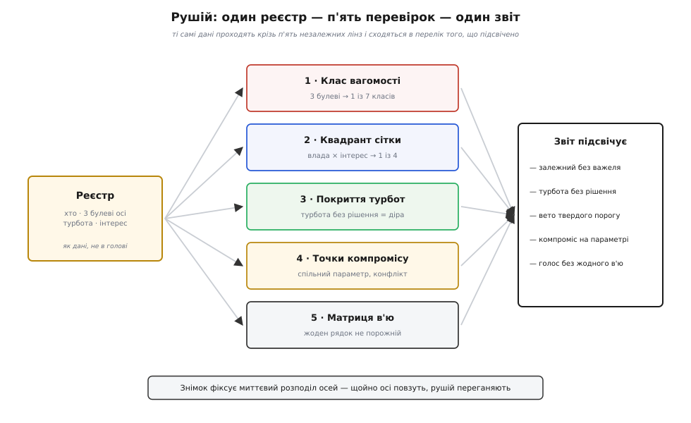

# ⚙️ Рушій аналізу стейкхолдерів

Скласти список людей, дотичних до системи, — робота на чверть години, і найдешевша її автоматизація вже щось дає: пройтися турботами й підсвітити ті, що не закриті жодним рішенням. Та щойно список готовий, починається справжня механіка, і вона не про «хто в переліку», а про чотири питання, на які плаский стовпчик імен не відповідає. Скільки важить **кожен**, коли їх дюжина, а бюджет один? Куди й якого роду увагу винен їм архітектор? Де двоє однаково правих людей упираються в **одне** рішення й тягнуть його в протилежні боки? І чи кожен голос узагалі має документ, з якого почує відповідь на свою турботу?

Кожне з цих питань має точну, обчислювану відповідь — і саме тому їх варто не тримати в голові, а звести в **рушій**: маленьку програму, що бере реєстр стейкхолдерів як дані й механічно, без пам'яті про те, хто голосніше кричав на нараді, видає п'ять висновків одразу. Домен тут — звичайне архітектурне рахівництво, без регістрів і байтів, тож код лягає ідіоматично на TypeScript і Python; обидва варіанти нижче — той самий рушій, слово в слово за поведінкою.

## Що саме має порахувати рушій

Розкладімо задачу на п'ять незалежних перевірок, які всі живляться з одного реєстру. Кожна відповідає рівно на одне з питань вище, і жодна не потребує людського судження в мить обчислення — судження вже вкладене у **вхідні дані**.



*Рушій не ухвалює рішень за архітектора — він механічно підсвічує п'ять місць, де рішення потрібне: хто вагомий, куди дивитись, чия турбота провисла, де неминучий компроміс і чий голос не має жодного в'ю.*

Вхід — чотири прості таблиці. **Стейкхолдери**: у кожного ім'я, три булеві осі вагомості (влада, легітимність, терміновість), булевий інтерес і одна головна турбота — назва [якісного атрибута](topic:programming/quality-attributes), тобто вимірної властивості системи на кшталт доступності чи безпеки, про яку ця людина найбільше дбає. **Рішення**: кожне свідомо закриває один атрибут. **Параметри устрою**: кожен тягне якісь атрибути вгору чи вниз — це «ручки», крутячи які, псуєш одне заради іншого. **В'ю**: кожне показує (обрамлює) певний набір турбот.

Наскрізний приклад — платіжний сервіс. Сім стейкхолдерів: замовник і спонсор дбають про вартість, оператор — про доступність, аудитор — про безпеку (і його вимога — закон), супровід — про змінюваність, користувач — про швидкодію, постачальник — про вартість. З цього входу рушій має видати п'ять відповідей, і кожну ми зараз зберемо в код.

## Структури даних

Спершу — форма даних. Вона навмисно пласка: жодної ієрархії, жодних посилань одне на одного, тільки записи з полями. Уся хитрість рушія — не в структурах, а в тому, що з них вичитується; структури мусять лишатися тупими, щоб їх легко було заповнити руками або витягти з таблиці.

:::tabs
```ts
// Якісні атрибути, про які дбають стейкхолдери.
type Attribute = "доступність" | "змінюваність" | "швидкодія" | "безпека" | "вартість";

// Стейкхолдер = ім'я + три булеві осі вагомості + інтерес + його турбота.
interface Stakeholder {
  name: string;
  power: boolean;       // чи може ЗМУСИТИ?
  legitimacy: boolean;  // чи МАЄ ПРАВО вимагати?
  urgency: boolean;     // чи мусить бути ЗАРАЗ?
  interest: boolean;    // чи не байдуже, що буде із системою?
  concern: Attribute;   // головна турбота
  hard?: boolean;       // турбота — твердий поріг (закон), а не м'яке вподобання
}

// Архітектурне рішення свідомо закриває один атрибут.
interface Decision {
  name: string;
  closes: Attribute;
}

// Параметр устрою тягне атрибути в той чи інший бік: +1 краще, −1 гірше.
interface Parameter {
  name: string;
  pushes: { attr: Attribute; dir: 1 | -1 }[];
}

// В'ю обрамлює (показує) певні турботи-атрибути.
interface View {
  name: string;
  frames: Attribute[];
}
```
```py
from __future__ import annotations
from dataclasses import dataclass
from enum import Enum

# Якісні атрибути, про які дбають стейкхолдери.
class Attr(Enum):
    AVAIL = "доступність"
    MODIF = "змінюваність"
    PERF  = "швидкодія"
    SEC   = "безпека"
    COST  = "вартість"

# Стейкхолдер = ім'я + три булеві осі вагомості + інтерес + його турбота.
@dataclass(frozen=True)
class Stakeholder:
    name: str
    power: bool        # чи може ЗМУСИТИ?
    legitimacy: bool   # чи МАЄ ПРАВО вимагати?
    urgency: bool      # чи мусить бути ЗАРАЗ?
    interest: bool     # чи не байдуже, що буде із системою?
    concern: Attr      # головна турбота
    hard: bool = False # турбота — твердий поріг (закон), а не м'яке вподобання

# Архітектурне рішення свідомо закриває один атрибут.
@dataclass(frozen=True)
class Decision:
    name: str
    closes: Attr

# Параметр устрою тягне атрибути в той чи інший бік: +1 краще, −1 гірше.
@dataclass(frozen=True)
class Push:
    attr: Attr
    dir: int

@dataclass(frozen=True)
class Parameter:
    name: str
    pushes: tuple[Push, ...]

# В'ю обрамлює (показує) певні турботи-атрибути.
@dataclass(frozen=True)
class View:
    name: str
    frames: frozenset[Attr]
```
:::

Зверни увагу на поле `hard`. Воно виглядає дрібницею, але саме воно відрізняє дорослий рушій від наївного: турбота буває **порогом** (закон про приватність — або дотримано, або штраф) чи **вподобанням** (дешевше краще). Плутати їх — найдорожча помилка в цьому ремеслі, і ми повернемось до неї, коли рушій рахуватиме покриття.

## Дві миттєві класифікації: вагомість і квадрант

Перші дві перевірки — найдешевші: кожна дивиться на **одного** стейкхолдера й нікого більше. Почнемо з вагомості. Три булеві осі дають 2³ = 8 сполучень, але одне з них — «ні влади, ні права, ні поспіху» — це взагалі не стейкхолдер, бо в такої людини немає до системи жодної ставки. Лишається **сім** класів, і кожен — це готовий діагноз, як з людиною поводитись. Найчистіший спосіб їх порахувати — не гілка `if` на десять рядків, а **таблиця пошуку**: ключ із трьох бітів, значення — назва класу.

:::tabs
```ts
// Три булеві осі → один із семи класів вагомості (за Мітчеллом–Ейглом–Вудом).
const SALIENCE: Record<string, string> = {
  "100": "сплячий",      // лише влада — сила є, та дрімає
  "010": "на-розсуд",    // лише легітимність — має право, ні сили, ні поспіху
  "001": "вимогливий",   // лише терміновість — галасує без важеля й права
  "110": "панівний",     // влада + легітимність — «класичний», чути завжди
  "101": "небезпечний",  // влада + терміновість — примус без права
  "011": "залежний",     // легітимність + терміновість — правий і поспішає, та безсилий
  "111": "визначальний", // усі три — кидай усе
};

function salienceClass(s: Stakeholder): string {
  const key = `${+s.power}${+s.legitimacy}${+s.urgency}`;
  return SALIENCE[key] ?? "не стейкхолдер";
}

// Груба міра ваги: латентний = 1 вісь, очікувальний = 2, визначальний = 3.
function salienceScore(s: Stakeholder): number {
  return +s.power + +s.legitimacy + +s.urgency;
}
const HIGH_SALIENCE = 2; // від двох осей — уже «високовагомий»

// Квадрант сітки «влада–інтерес»: не «наскільки важливий», а скільки й якого роду уваги.
function quadrant(s: Stakeholder): string {
  if (s.power) return s.interest ? "вести щільно" : "тримати вдоволеним";
  return s.interest ? "тримати в курсі" : "спостерігати";
}
```
```py
# Три булеві осі → один із семи класів вагомості (за Мітчеллом–Ейглом–Вудом).
SALIENCE = {
    (True,  False, False): "сплячий",      # лише влада — сила є, та дрімає
    (False, True,  False): "на-розсуд",    # лише легітимність — право без сили й поспіху
    (False, False, True):  "вимогливий",   # лише терміновість — галас без важеля й права
    (True,  True,  False): "панівний",     # влада + легітимність — чути завжди
    (True,  False, True):  "небезпечний",  # влада + терміновість — примус без права
    (False, True,  True):  "залежний",     # право + поспіх, та безсилий
    (True,  True,  True):  "визначальний", # усі три — кидай усе
}

def salience_class(s: Stakeholder) -> str:
    return SALIENCE.get((s.power, s.legitimacy, s.urgency), "не стейкхолдер")

# Груба міра ваги: латентний = 1 вісь, очікувальний = 2, визначальний = 3.
def salience_score(s: Stakeholder) -> int:
    return s.power + s.legitimacy + s.urgency  # bool сумується як 0/1

HIGH_SALIENCE = 2  # від двох осей — уже «високовагомий»

# Квадрант сітки «влада–інтерес»: не «наскільки важливий», а скільки й якого роду уваги.
def quadrant(s: Stakeholder) -> str:
    if s.power:
        return "вести щільно" if s.interest else "тримати вдоволеним"
    return "тримати в курсі" if s.interest else "спостерігати"
```
:::

Тут ховається важлива стриманість рушія: `salienceScore` — це **лічильник осей**, а не оцінка «наскільки слухатися». Він каже «дві осі важать більше за одну», але навмисно не каже, що визначальний замовник переможе визначального аудитора, — цього рушій не знає й знати не повинен, бо це судження людей, а не арифметика. Класифікація вагомості — вхід у розмову, а не її підміна. І `quadrant` про те саме іншими словами: він відповідає не «чия воля переможе», а «скільки уваги й якого роду»; «тримати в курсі» означає «дай канал голосу», а не «зроби, як він скаже».

## Незакриті турботи — і чому вето не є низьким балом

Третя перевірка — та сама, з якої починає найдешевший реєстр: чи кожну турботу хтось закрив рішенням. Але наївна версія лише друкує «не закрито»; доросла — розрізняє два **сорти** незакритих турбот, бо провалений закон і непокращена швидкодія — це не одне й те саме на різних рядках, а речі різної природи.

:::tabs
```ts
interface Gap { who: string; concern: Attribute; veto: boolean; score: number; }

function coverageGaps(reg: Stakeholder[], decisions: Decision[]): Gap[] {
  const covered = new Set(decisions.map(d => d.closes));   // що архітектура вже закрила
  return reg
    .filter(s => !covered.has(s.concern))                  // чия турбота лишилась без відповіді
    .map(s => ({ who: s.name, concern: s.concern, veto: !!s.hard, score: salienceScore(s) }))
    // спершу тверді вето, тоді — за кількістю осей вагомості
    .sort((a, b) => Number(b.veto) - Number(a.veto) || b.score - a.score);
}
```
```py
from dataclasses import dataclass

@dataclass
class Gap:
    who: str
    concern: Attr
    veto: bool
    score: int

def coverage_gaps(reg: list[Stakeholder], decisions: list[Decision]) -> list[Gap]:
    covered = {d.closes for d in decisions}                  # що архітектура вже закрила
    gaps = [Gap(s.name, s.concern, s.hard, salience_score(s))
            for s in reg if s.concern not in covered]         # турботи без відповіді
    gaps.sort(key=lambda g: (g.veto, g.score), reverse=True)  # тверді вето — вгору
    return gaps
```
:::

Множина `covered` — це весь секрет швидкості: одне рішення закрило атрибут — і всі стейкхолдери з цією турботою вважаються обслуженими за одну перевірку належності до множини. А поле `veto` витягує на світло глибокий поділ. Незакрита **м'яка** турбота — це попередження: швидкодія трохи гірша, ніж хтось хотів, живемо далі. Незакрита **тверда** — це вето: система, що не тримає законної межі приватності, не «гірший варіант», а **недійсний**, за нього штрафують і закривають. Сортування ставить вето першими не тому, що вони «важливіші за балами», а тому, що їх не можна виторгувати назад жодною сумою переваг.

> 🔧 **Навіщо це.** Найпоширеніша дорога помилка — звести тверде обмеження до ваги в загальній сумі. Даєш кожному атрибуту бал, множиш, складаєш — і виходить «об'єктивне» число, яке спокійно обміняло дотримання закону на дешевизну, бо в сумі так вигідніше. Рушій навмисне тримає `veto` **осторонь** від `score`: поріг не змагається з уподобаннями, він їх відсіює. Хто змішав ці дві природи в одному числі, той рано чи пізно виторгує назад те, що торгуватися не мало.

## Точки компромісу: з'єднання, а не сліпий перебір

Четверта перевірка — найтвердіша частина ремесла й найцікавіша для коду. Дерево турбот можна чесно зібрати, але не всі вони вміщаються разом: рано чи пізно два високоставкові бажання впираються в **один** параметр устрою й вимагають протилежного. Словник для таких місць приходить з методу оцінювання [ATAM](topic:programming/atam-lite), який варто знати рівно в одному: **точка чутливості** — це параметр, від якого сильно залежить *один* атрибут (крутнув розмір пулу потоків — стрибнула швидкодія); **точка компромісу** — параметр, що чіпає *два або більше* атрибути в *протилежні* боки (ширше реплікуєш дані — росте доступність, але більшає місць, звідки вони витечуть за межу). Нас цікавить саме друге, і не будь-яке, а те, де на двох кінцях параметра сидять **двоє високовагомих** людей: це і є місце, де на кресленні фізично зустрічаються стейкхолдери.

Спокуса — перебрати всі пари стейкхолдерів проти всіх параметрів. Це працює, але дорого й незграбно: O(P · S²) на порожньому місці, бо для кожного параметра ми міряли б кожну людину проти кожної. Розумніший хід — **згрупувати** високовагомих за їхньою турботою один раз, а тоді для кожного параметра з'єднати (як у реляційному з'єднанні) тих, хто сидить на «плюсовому» атрибуті, з тими, хто на «мінусовому».

:::tabs
```ts
interface Tradeoff {
  param: string;
  up:   { attr: Attribute; who: string };
  down: { attr: Attribute; who: string };
}

function tradeoffPoints(reg: Stakeholder[], params: Parameter[]): Tradeoff[] {
  // Один прохід: групуємо ЛИШЕ високовагомих за їхньою турботою.
  const byConcern = new Map<Attribute, Stakeholder[]>();
  for (const s of reg) {
    if (salienceScore(s) < HIGH_SALIENCE) continue;
    const list = byConcern.get(s.concern) ?? [];
    list.push(s);
    byConcern.set(s.concern, list);
  }

  const out: Tradeoff[] = [];
  for (const p of params) {
    const up   = p.pushes.filter(x => x.dir > 0);  // хто виграє від параметра
    const down = p.pushes.filter(x => x.dir < 0);  // хто програє
    for (const u of up) for (const d of down) {     // лише ПРОТИЛЕЖНІ знаки — це й є компроміс
      for (const su of byConcern.get(u.attr) ?? [])
        for (const sd of byConcern.get(d.attr) ?? []) {
          if (su.name === sd.name) continue;        // не зіштовхуй людину з нею ж
          out.push({ param: p.name,
                     up:   { attr: u.attr, who: su.name },
                     down: { attr: d.attr, who: sd.name } });
        }
    }
  }
  return out;
}
```
```py
from collections import defaultdict

@dataclass
class Tradeoff:
    param: str
    up_attr: Attr
    up_who: str
    down_attr: Attr
    down_who: str

def tradeoff_points(reg: list[Stakeholder], params: list[Parameter]) -> list[Tradeoff]:
    # Один прохід: групуємо ЛИШЕ високовагомих за їхньою турботою.
    by_concern: dict[Attr, list[Stakeholder]] = defaultdict(list)
    for s in reg:
        if salience_score(s) >= HIGH_SALIENCE:
            by_concern[s.concern].append(s)

    out: list[Tradeoff] = []
    for p in params:
        up   = [x for x in p.pushes if x.dir > 0]  # хто виграє від параметра
        down = [x for x in p.pushes if x.dir < 0]  # хто програє
        for u in up:
            for d in down:                          # лише ПРОТИЛЕЖНІ знаки
                for su in by_concern.get(u.attr, ()):
                    for sd in by_concern.get(d.attr, ()):
                        if su.name == sd.name:
                            continue                # не зіштовхуй людину з нею ж
                        out.append(Tradeoff(p.name, u.attr, su.name, d.attr, sd.name))
    return out
```
:::

Три тонкощі роблять цей код правильним, а не просто робочим. Перша: розділення `pushes` на `up` і `down` за знаком — і перебір **добутку** `up × down` — гарантує, що ми беремо лише пари з протилежними напрямами. Параметр, що тягне два атрибути в **один** бік, — це не компроміс, а синергія (обом краще або обом гірше), і він тут законно не спрацьовує. Друга: та сама розбивка автоматично рятує від подвійного рахунку — пара (доступність, безпека) не з'явиться ще раз як (безпека, доступність), бо один атрибут завжди в `up`, а другий у `down`, ніколи навпаки. Третя: фільтр `HIGH_SALIENCE` — це те, що відрізняє **архітектурний** компроміс від **стейкхолдерського**. Параметр може чесно псувати один атрибут заради іншого, та якщо на постраждалому боці немає нікого вагомого, це просто інженерна ручка, а не зіткнення людей. Рушій підсвічує лише останнє — місця, де треба не крутити ручку, а **домовлятися**.

## Матриця «стейкхолдер × в'ю»: жоден рядок не порожній

П'ята перевірка замикає коло: турбота, названа й зважена, мусить дійти до людини **назад** — через в'ю, яке вона здатна прочитати. Головний стандарт опису архітектури, **ISO/IEC/IEEE 42010**, ставить тут жорстке правило відповідності: опис виписує стейкхолдерів та їхні турботи й мусить містити в'ю так, щоб **кожну турботу обрамлювало хоча б одне в'ю**. Турбота без в'ю — це стейкхолдер, якому ти не відповів, хай навіть архітектурно все вирішив: розв'язав мовчки й не сказав тому, хто питав.

Перевірка проста до банальності — і саме в її простоті пастка, до якої дійдемо. Будуємо булеву матрицю «людина × в'ю» й шукаємо **рядок** без жодної позначки.

:::tabs
```ts
function viewMatrix(reg: Stakeholder[], views: View[]): boolean[][] {
  return reg.map(s => views.map(v => v.frames.includes(s.concern)));
}

// Правило 42010 читається ПО РЯДКАХ: індекси стейкхолдерів, чию турботу не показує жодне в'ю.
function emptyRows(matrix: boolean[][]): number[] {
  return matrix.flatMap((row, i) => row.some(Boolean) ? [] : [i]);
}
```
```py
def view_matrix(reg: list[Stakeholder], views: list[View]) -> list[list[bool]]:
    return [[s.concern in v.frames for v in views] for s in reg]

# Правило 42010 читається ПО РЯДКАХ: індекси тих, чию турботу не показує жодне в'ю.
def empty_rows(matrix: list[list[bool]]) -> list[int]:
    return [i for i, row in enumerate(matrix) if not any(row)]
```
:::

Матриця тут — не прикраса звіту, а сам механізм перевірки: рядок — людина, стовпець — в'ю, клітинка — «це в'ю відповідає на цю турботу». Порожній рядок кричить точно про класичну поразку: показати операторові діаграму класів і вважати, що «задокументував». Діаграма є, красива, але оператор із неї не дістане відповіді на «чи побачу я збій о третій ночі» — цю відповідь дає в'ю розгортання, а не класи, тож його рядок лишається порожнім, скільки б не коштувала діаграма.

## Усе разом — і що воно друкує

Лишається зібрати п'ять перевірок під одним викликом і згодувати їм наш платіжний сервіс. Ось повний вхід і драйвер, що друкує звіт.

:::tabs
```ts
const reg: Stakeholder[] = [
  { name: "Замовник",     power: true,  legitimacy: true,  urgency: false, interest: true,  concern: "вартість" },
  { name: "Спонсор",      power: true,  legitimacy: true,  urgency: false, interest: false, concern: "вартість" },
  { name: "Оператор",     power: false, legitimacy: true,  urgency: true,  interest: true,  concern: "доступність" },
  { name: "Аудитор",      power: true,  legitimacy: true,  urgency: true,  interest: true,  concern: "безпека", hard: true },
  { name: "Супровід",     power: false, legitimacy: true,  urgency: false, interest: true,  concern: "змінюваність" },
  { name: "Користувач",   power: false, legitimacy: true,  urgency: false, interest: true,  concern: "швидкодія" },
  { name: "Постачальник", power: false, legitimacy: true,  urgency: false, interest: false, concern: "вартість" },
];

const decisions: Decision[] = [
  { name: "бюджет і план-графік",    closes: "вартість" },
  { name: "плагіни способів оплати", closes: "змінюваність" },
  { name: "кеш гарячих запитів",     closes: "швидкодія" },
];

const params: Parameter[] = [
  { name: "ширина реплікації даних", pushes: [{ attr: "доступність", dir: 1 }, { attr: "безпека", dir: -1 }] },
  { name: "розмір пулу потоків",     pushes: [{ attr: "швидкодія", dir: 1 }] },                                  // точка чутливості
  { name: "рівень кешування",        pushes: [{ attr: "швидкодія", dir: 1 }, { attr: "вартість", dir: -1 }] },   // компроміс без двох ваг
];

const views: View[] = [
  { name: "Контекст",    frames: ["вартість", "безпека"] },
  { name: "Контейнери",  frames: ["швидкодія", "доступність"] },
  { name: "Розгортання", frames: ["доступність", "безпека"] },
  { name: "Сценарії",    frames: ["доступність", "швидкодія", "безпека", "вартість"] },
];

function analyse(reg: Stakeholder[], decisions: Decision[], params: Parameter[], views: View[]): void {
  console.log("ВАГОМІСТЬ І КУДИ СПРЯМУВАТИ УВАГУ");
  for (const s of reg)
    console.log(`  ${s.name.padEnd(12)} ${salienceClass(s).padEnd(13)} → ${quadrant(s)}`);

  console.log("\nНЕЗАКРИТІ ТУРБОТИ");
  for (const g of coverageGaps(reg, decisions))
    console.log(`  ${g.veto ? "ВЕТО " : "warn "} ${g.who.padEnd(10)} дбає про ${g.concern} (осей: ${g.score})`);

  console.log("\nТОЧКИ КОМПРОМІСУ");
  for (const t of tradeoffPoints(reg, params))
    console.log(`  «${t.param}»: ${t.up.who}(${t.up.attr} ↑) проти ${t.down.who}(${t.down.attr} ↓)`);

  console.log("\nМАТРИЦЯ В'Ю — порожні рядки");
  const empty = emptyRows(viewMatrix(reg, views));
  if (empty.length === 0) console.log("  усі рядки закриті");
  else for (const i of empty) console.log(`  ✗ ${reg[i].name} (${reg[i].concern}) — жодне в'ю не показує`);
}

analyse(reg, decisions, params, views);
```
```py
reg = [
    Stakeholder("Замовник",     True,  True,  False, True,  Attr.COST),
    Stakeholder("Спонсор",      True,  True,  False, False, Attr.COST),
    Stakeholder("Оператор",     False, True,  True,  True,  Attr.AVAIL),
    Stakeholder("Аудитор",      True,  True,  True,  True,  Attr.SEC, hard=True),
    Stakeholder("Супровід",     False, True,  False, True,  Attr.MODIF),
    Stakeholder("Користувач",   False, True,  False, True,  Attr.PERF),
    Stakeholder("Постачальник", False, True,  False, False, Attr.COST),
]

decisions = [
    Decision("бюджет і план-графік",    Attr.COST),
    Decision("плагіни способів оплати", Attr.MODIF),
    Decision("кеш гарячих запитів",     Attr.PERF),
]

params = [
    Parameter("ширина реплікації даних", (Push(Attr.AVAIL, +1), Push(Attr.SEC, -1))),
    Parameter("розмір пулу потоків",     (Push(Attr.PERF, +1),)),                       # точка чутливості
    Parameter("рівень кешування",        (Push(Attr.PERF, +1), Push(Attr.COST, -1))),   # компроміс без двох ваг
]

views = [
    View("Контекст",    frozenset({Attr.COST, Attr.SEC})),
    View("Контейнери",  frozenset({Attr.PERF, Attr.AVAIL})),
    View("Розгортання", frozenset({Attr.AVAIL, Attr.SEC})),
    View("Сценарії",    frozenset({Attr.AVAIL, Attr.PERF, Attr.SEC, Attr.COST})),
]

def analyse(reg, decisions, params, views) -> None:
    print("ВАГОМІСТЬ І КУДИ СПРЯМУВАТИ УВАГУ")
    for s in reg:
        print(f"  {s.name:<12} {salience_class(s):<13} → {quadrant(s)}")

    print("\nНЕЗАКРИТІ ТУРБОТИ")
    for g in coverage_gaps(reg, decisions):
        tag = "ВЕТО " if g.veto else "warn "
        print(f"  {tag} {g.who:<10} дбає про {g.concern.value} (осей: {g.score})")

    print("\nТОЧКИ КОМПРОМІСУ")
    for t in tradeoff_points(reg, params):
        print(f"  «{t.param}»: {t.up_who}({t.up_attr.value} ↑) проти {t.down_who}({t.down_attr.value} ↓)")

    print("\nМАТРИЦЯ В'Ю — порожні рядки")
    empty = empty_rows(view_matrix(reg, views))
    if not empty:
        print("  усі рядки закриті")
    else:
        for i in empty:
            print(f"  ✗ {reg[i].name} ({reg[i].concern.value}) — жодне в'ю не показує")

analyse(reg, decisions, params, views)
```
:::

Обидва варіанти друкують те саме:

```
ВАГОМІСТЬ І КУДИ СПРЯМУВАТИ УВАГУ
  Замовник     панівний      → вести щільно
  Спонсор      панівний      → тримати вдоволеним
  Оператор     залежний      → тримати в курсі
  Аудитор      визначальний  → вести щільно
  Супровід     на-розсуд     → тримати в курсі
  Користувач   на-розсуд     → тримати в курсі
  Постачальник на-розсуд     → спостерігати

НЕЗАКРИТІ ТУРБОТИ
  ВЕТО  Аудитор    дбає про безпека (осей: 3)
  warn  Оператор   дбає про доступність (осей: 2)

ТОЧКИ КОМПРОМІСУ
  «ширина реплікації даних»: Оператор(доступність ↑) проти Аудитор(безпека ↓)

МАТРИЦЯ В'Ю — порожні рядки
  ✗ Супровід (змінюваність) — жодне в'ю не показує
```

Прочитай цей звіт як лікарський знімок. Вагомість розкидала сімох по класах, і залежний оператор із визначальним аудитором опинилися вгорі не за посадою, а за осями. Покриття підсвітило дві діри, але різної природи: безпека аудитора — **вето** (закон не закрито, реліз недійсний), доступність оператора — лише попередження. Компроміс знайшовся рівно один, хоч параметрів було три: «розмір пулу потоків» чіпає один атрибут (точка чутливості, не компроміс), «рівень кешування» тягне два в різні боки, але на боці швидкодії немає високовагомого — тож рушій мовчить; а от «ширина реплікації» зіштовхнула двох вагомих людей, і це справжнє місце для явної домовленості. І нарешті матриця впіймала порожній рядок: супровід дбає про змінюваність, а жодне з чотирьох в'ю її не показує — його голос не має документа. Що робити з тим компромісом далі — вже не рахівництво, а мистецтво [аналізу компромісів](topic:programming/tradeoff-analysis); рушій лише не дав його проґавити.

## Складність: чому перебір не вибухає

Варто окремо оцінити, скільки все це коштує, — бо аналіз стейкхолдерів **виглядає** комбінаторним, а насправді ним не є. Позначмо S — кількість стейкхолдерів, D — рішень, P — параметрів, V — в'ю.

```
перевірка               вартість        чому саме стільки
клас вагомості          O(S)            таблиця з 2³ входів — стала на людину
квадрант сітки          O(S)            дві булеві осі — стала на людину
покриття турбот          O(S + D)        множина закритих + один прохід реєстром
точки компромісу         O(P · k²)       k — найбільша група вагомих на один атрибут
матриця «×в'ю»           O(S · V)        побудова сітки + прохід рядками
```

Тут і криється головна пастка **оцінки** складності, яку варто назвати вголос. Новачок бачить «аналіз стейкхолдерів» і думає про коаліції: якщо їх S, то підмножин 2ˢ, а це вибух. Але жодна з п'яти перевірок не питає про підмножини — усі вони або **на людину** (вагомість, квадрант, покриття), або **на пару** (компроміс). Єдиний по-справжньому показниковий об'єкт — ґратка вагомості — має рівно 2³ = 8 клітин, і ця вісімка **не залежить** від S: осей завжди три, скільки б людей не було. Тому весь рушій лишається поліноміальним, а не експоненційним; те, що лякало виглядом, згорнулось у сталу.

Найдорожча перевірка — компроміс, і навіть її наївний варіант O(P · S²) стелиться до O(P · k²) простим групуванням: замість «кожен проти кожного» ми зіштовхуємо лише мешканців двох конкретних атрибутних груп, а групи високовагомих малі. Практично P, V і k — це одиниці, тож увесь звіт для реального проєкту рахується швидше, ніж людина відкриє файл.

## Пастки

Рушій оманливо простий, і рівно тому в нього легко вкласти помилку, яка тихо збреше. Найгостріші місця такі.

**Посада замість осей.** Найспокусливіше — годувати рушій титулами: «директор — вагомий, стажер — ні». Тоді вся математика працює бездоганно над хибним входом. Три булеві осі треба ставити чесно: гучний директор часто має владу й терміновість, але не легітимність **конкретної** технічної вимоги, а тихий оператор має право й поспіх без важеля. Рушій рахує те, що ти заклав; заклади посаду — отримаєш карту посад, а не ставок.

**Поріг, зведений до ваги.** Ми винесли `veto` окремим полем не для краси. Щойно тверду вимогу («доступність ≥ 99.9%, це закон») кладуть просто ще одним доданком у зважену суму, вона починає **торгуватися** — і достатньо гарної ціни, щоб «об'єктивне» число обміняло дотримання закону на дешевизну. Обмеження відсіюють недійсні варіанти **до** зважування вподобань, а не змагаються з ними в одній сумі.

**Порожній рядок, а не порожній стовпець.** Правило 42010 — про **рядки** (стейкхолдерів), не про стовпці (в'ю). Спокуса перевірити не ту вісь цілком природна, а результат оманливо схожий — тому пастка й підступна. В'ю, якого ніхто не читає, — це, може, зайва праця, але не порушення: система лишається описаною. А от **стейкхолдер без жодного в'ю** — це нечутий голос, справжня діра. Переплутати осі — означає з чистою совістю пропустити оператора, у якого немає свого в'ю, бо «всі діаграми ж комусь та потрібні».

**Однаковий знак — не компроміс.** Легко написати детектор, що зчіпляє будь-які два атрибути на спільному параметрі. Але параметр, який тягне обидва в **один** бік, — це синергія, дармовий виграш або спільна втрата, а не місце для домовленості. Компроміс — лише протилежні знаки; переплутавши це, дістанеш звіт, повний несправжніх конфліктів, і за галасом проґавиш той єдиний, що справжній.

**Знімок, а не істина.** Усі три осі **повзуть**: новий закон миттю додає аудиторові терміновості й підіймає його з «на-розсуд» у «визначальні»; пішов віцепрезидент-чемпіон — і супровід із «визначального» осів у «залежного», бо сила зникла разом із важелем. Рушій рахує **миттєвий** розподіл; вважати його вічним — те саме, що звіритися з торішнім розкладом потягів. Тому реєстр переганяють на кожну зміну в наборі людей, а найнадійніше — прив'язують його виходи до [фітнес-функцій](topic:programming/fitness-functions): турботу, перетворену на автоматичну перевірку в конвеєрі, система не дасть тихо забути, навіть коли і стейкхолдер, і архітектор давно вийшли з кімнати.

Зведене докупи, це й є вся цінність рушія: він не думає за архітектора й не важиться перемогти чиюсь волю числом. Він робить дешевшу, але незамінну річ — механічно, без пам'яті про те, хто голосніше кричав, підсвічує п'ять місць, де мовчазний пропуск коштує найдорожче: забутого вагомого, провислу турботу, поріг, який хтось хотів виторгувати, неминучий компроміс і голос, що не має документа. Далі — робота людей; але жодного з цих п'яти вже не проґавиш випадково.
