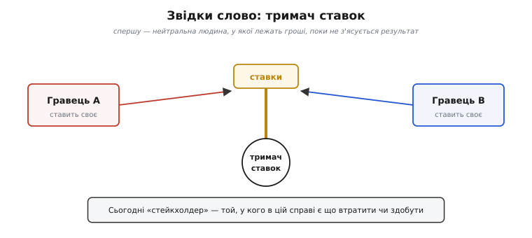
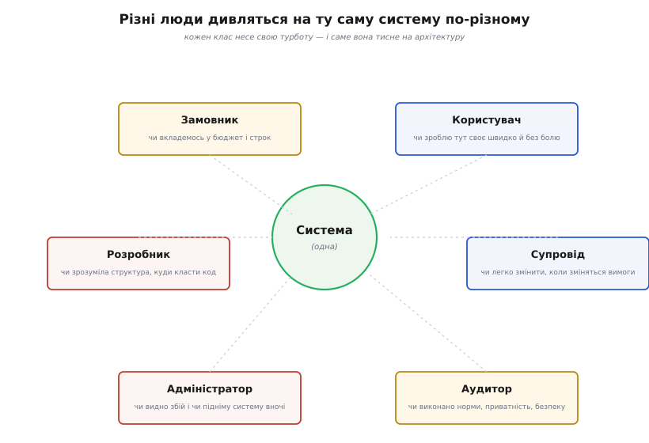
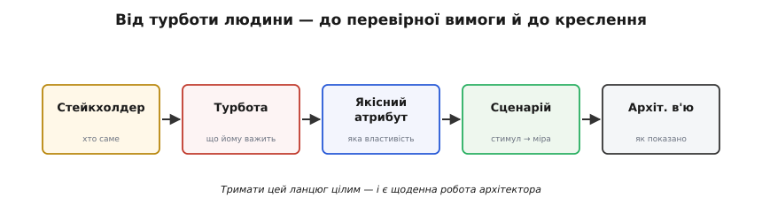

# Стейкхолдери та їхні системи

<preknowlist>
- [Якісні атрибути](book:programming/quality-attributes) — властивості системи (швидкодія, надійність, змінюваність), про які архітектура домовляється; саме їх стейкхолдери й вимагають.
- [Сценарії атрибутів](book:programming/attribute-scenarios) — як розмиту вимогу «має бути швидко» перетворити на перевірне «стимул → міра».
- [Роль архітектора](book:programming/architect-role) — хто стоїть між людьми та системою й відповідає за узгодження їхніх інтересів.
</preknowlist>

Уяви, що ти намалював гарну архітектуру: чисті шари, продумані межі, модна база даних. Показуєш — і замовник питає: «А чому це коштуватиме на три місяці більше?» Оператор додає: «А коли воно впаде о третій ночі, я взагалі побачу, що саме зламалось?» Юрист згадує, що персональні дані не можна тримати в тому регіоні. І раптом ясно: система не «правильна» сама собою. Вона правильна лише **щодо когось** — щодо людей, у яких у ній є свій інтерес. Ці люди й називаються **стейкхолдерами**, і зрозуміти їх — це і є перший, найважливіший крок архітектури.

## Слово, яке прийшло з гри

Термін звучить сухо-корпоративно, та народився він за азартним столом. **Стейкхолдер** (англ. *stakeholder*, від *stake* — ставка, кіл + *holder* — тримач) уперше зафіксовано близько 1708 року й означало буквально **людину, у якої лежать гроші, поки не з'ясується, хто виграв парі**. Раніше ставки клали на кіл, щоб усі бачили; згодом їх довіряли нейтральній людині — тримачеві ставок.



*Спершу «тримач ставок» — нейтральна людина, у якої лежать гроші до результату; сьогодні це кожен, у кого в справі є що втратити чи здобути.*

Ключове тут не гроші, а те, **чому ця людина взагалі в грі**: у неї є що втратити чи здобути залежно від результату. Саме цей зміст і переповз у бізнес приблизно в 1965-му, а звідти — в інженерію. Стейкхолдер системи — не той, хто «має до неї стосунок» абстрактно, а той, для кого її властивості **обертаються реальним виграшем або втратою**: грошима, часом, репутацією, спокійним сном. Хто ставки [історії поняття](book:programming/stakeholders/hist-stakeholder-term.md) — від тримача парі через Фрімена до стандарту 42010 — розглянуто окремо.

> 🔧 **Навіщо це.** Тримати в голові саме «що втратить/здобуде», а не посаду, рятує від марної роботи. Директор із гарною візиткою може не мати в системі жодної ставки — а непомітний нічний оператор має найбільшу. Питати треба не «хто важливий», а «чия шкура тут на кону».

## Чому одну систему видно по-різному

Тут криється те, що новачки пропускають, а бувалі знають до болю: **у різних стейкхолдерів різні, часто несумісні бажання від тієї самої системи**. Не тому, що хтось дурний чи впертий, а тому, що кожен дивиться зі свого місця.



*Система одна, але замовник бачить бюджет, користувач — свою задачу, розробник — структуру коду, супровід — легкість зміни, адміністратор — видимість збою, аудитор — виконання норм.*

Замовник (той, хто платить) дивиться на **гроші й строк**: чи вкладемось у бюджет, чи встигнемо до дати виставки. Користувач — на **свою задачу**: чи оформлю замовлення за три кліки, чи не заплутаюсь. Розробник — на **структуру**: чи зрозуміло, куди дописувати нове, чи не доведеться щоразу лізти в десять місць. Той, хто **супроводжуватиме** систему роками, боїться іншого: коли зміняться правила, чи можна буде їх правити в одному місці, чи доведеться перекопувати пів системи. Адміністратор, що тримає систему живою, хоче **бачити збій** і швидко підняти сервіс. Аудитор перевіряє **норми**: приватність, безпеку, відповідність закону.

Тепер відчуй напругу. Замовник тисне «швидше й дешевше». Супровід просить «зробімо гнучко, з запасом на майбутнє» — а це час і гроші. Користувач хоче миттєвий відгук — а найпростіший для розробника варіант відповідає за секунду. **Ці бажання не складаються в один список — вони тягнуть у різні боки.** Архітектура і є місцем, де ці тяжіння зустрічаються й де хтось мусить свідомо вирішити, чим поступитися. Ось чому [роль архітектора](book:programming/architect-role) — не «намалювати найкращу схему», а знайти чесний компроміс між людьми, кожен з яких по-своєму правий.

Спокуса — обслуговувати лише **гучних**: того, хто голосніше кричить на нараді. Але найбільша ставка часто в **тихого**. Оператора немає в кімнаті, коли креслять архітектуру, — а платить за кожен непродуманий збій уночі саме він. Пропустити тихого стейкхолдера — типова причина, чому «технічно бездоганна» система стає пеклом в експлуатації.

## Від людини до перевірної вимоги

Бажання стейкхолдера саме собою до архітектури не докладеш: «має бути надійно» — це почуття, а не інженерна умова. Потрібен місток від людини до креслення, і будується він щоразу однаково.



*Турбота конкретної людини перетворюється на названу властивість, тоді — на перевірну умову, і нарешті — на частину креслення, зроблену саме під цього стейкхолдера.*

Спершу з розмитого бажання витягаємо **турботу** (англ. *concern*) — що саме людині важить. Оператор каже «хочу спати вночі» — його турбота насправді про **відновлюваність**: система має підніматись швидко й сама сигналити про біду. Ту турботу називаємо на ім'я — це [якісний атрибут](book:programming/quality-attributes): доступність, змінюваність, швидкодія, безпека. Далі перетворюємо її на [сценарій](book:programming/attribute-scenarios) — конкретне «за яких умов і як міряємо»: *якщо падає один вузол, система відновлює обслуговування за 30 секунд без втручання людини*. І лише тоді робимо архітектурний хід — резервування, автоматичне перемикання — і показуємо його в тому [в'ю](book:programming/architecture-views), яке цей стейкхолдер зрозуміє. Оператору — картину розгортання й моніторингу, а не діаграму класів, від якої йому ні тепло ні холодно.

Слово *concern* у стандартах — не випадкове. **ISO/IEC/IEEE 42010**, головний стандарт про опис архітектури, будує все саме на парі «стейкхолдер — його concern». Опис архітектури, за ним, **починається з того, що виписують стейкхолдерів і їхні concerns, а вже потім добирають в'ю так, щоб кожну турботу хтось із них закривав**. Це переставляє звичну логіку з ніг на голову: не «намалюймо діаграми, які вміємо», а «які турботи маємо закрити — і що для цього треба показати». Цей стандарт виріс із давнішого IEEE 1471 (2000) і в редакції 2011 року став спільним ISO та IEEE.

> 🔧 **Навіщо це.** Ланцюг «стейкхолдер → турбота → атрибут → сценарій → в'ю» — це рятівна перевірка. Малюєш черговий шар — спитай: **чию турботу він закриває і як я це виміряю?** Немає відповіді — або в тебе зайва краса, або (гірше) є стейкхолдер, якого ти забув, і його біль вилізе після релізу.

## Класи стейкхолдерів як контрольний список

Забути когось — головна небезпека. Тому корисно мати перелік типових ролей і проходити його, питаючи «а цей у нас є?». Найвідоміший такий перелік дали Розанскі та Вудс — одинадцять класів [стейкхолдерів](book:programming/viewpoints-perspectives), кожен зі своєю турботою:

```
Замовники (acquirers)   — керують закупівлею; турбота: ціна, строк, ризик
Користувачі (users)     — визначають і споживають функції
Оцінювачі (assessors)   — стежать за нормами й законом
Комунікатори            — пояснюють систему іншим (документація, навчання)
Розробники (developers) — будують і розгортають систему
Тестувальники (testers) — перевіряють придатність
Супровід (maintainers)  — ведуть систему після запуску, правлять і розвивають
Адміністратори          — тримають систему живою в експлуатації
Інженери-виробничники   — готують середовища збірки/тестів/роботи
Постачальники           — дають залізо/ПЗ/інфраструктуру
Служба підтримки        — допомагають користувачам за роботи
```

Перелік не священний — під конкретний проєкт когось прибирають, когось додають (регулятор, партнер за інтеграцією, служба безпеки). Цінність його в іншому: він **не дає забути цілий клас людей**. Пройшовся списком — і згадав, що акредитаційний аудитор існує, ще поки він не завалив реліз.

Тут криється тонкий, але важливий поділ: **стейкхолдери самої системи** — це не те саме, що **стейкхолдери проєкту**. Проєкт-менеджер, спонсор, відділ маркетингу мають величезний інтерес у тому, щоб **проєкт** відбувся вчасно й у бюджеті, — та багато з них байдужі до **внутрішнього устрою** системи. Архітектора передусім цікавлять ті, чиї турботи **впливають на технічні рішення**: чия потреба змусить обрати цю базу даних, той стиль розгортання, цей рівень резервування. Спонсор скаже «зробіть надійно» — а конкретну планку надійності, за яку варто платити резервуванням, задасть той, хто відповідає за роботу системи.

## Стейкхолдер як обмеження, а не лише як думка

Є ще один шар, який відрізняє зрілого архітектора від початківця. Стейкхолдери впливають на систему **не лише тим, чого хочуть, а й тим, хто вони є та як розташовані**. Структура команд протікає в структуру коду — це спостереження називають законом Конвея, і воно жорстке: **система переймає форму спілкування тих, хто її будує**. Дві команди на різних континентах, що погано чують одна одну, майже неминуче зроблять два слабко зв'язані шматки з незграбним стиком між ними — бо саме таким був їхній зв'язок. Тому архітектор дивиться не тільки на бажання людей, а й на [те, хто з ким і як спілкується](book:programming/communication-paths): ці шляхи стають реальними межами системи, хоче він того чи ні. Досвідчені йдуть далі й свідомо **перекроюють команди під бажану архітектуру** — прийом, відомий як [зворотний маневр Конвея](book:programming/inverse-conway).

Через це «облік стейкхолдерів» — не разова табличка на старті. Люди приходять і йдуть, з'являється новий регулятор, партнер за інтеграцією, ціла нова аудиторія користувачів — і кожна поява може зсунути ставки й перекроїти пріоритети атрибутів. Тому перелік стейкхолдерів і їхніх турбот тримають **живим артефактом**, а не документом, що вкрився пилом одразу за kickoff.

## Маленька модель у коді

Щоб не тримати все в голові, стейкхолдерів корисно завести **як дані**: хто, наскільки впливовий, і яку турботу-атрибут несе. Тоді видно, чиї турботи ще нічим не закриті, — і це вже не інтуїція, а звичайний перебір списку. Ось кістяк такого реєстру на C++.

**Умова: тримаємо реєстр стейкхолдерів і перевіряємо, чи кожну заявлену турботу хтось закрив архітектурним рішенням.**

:::tabs
```cpp
#include <string>
#include <vector>
#include <set>
#include <cstdio>

// Якісний атрибут, про який дбає стейкхолдер.
enum class Attribute { Availability, Modifiability, Performance, Security, Cost };

struct Stakeholder {
    std::string name;
    int         power;      // 1..5 — наскільки може впливати на рішення
    Attribute   concern;    // головна турбота цієї людини
};

const char* attrName(Attribute a) {
    switch (a) {
        case Attribute::Availability:  return "доступність";
        case Attribute::Modifiability: return "змінюваність";
        case Attribute::Performance:   return "швидкодія";
        case Attribute::Security:      return "безпека";
        case Attribute::Cost:          return "вартість";
    }
    return "?";
}

int main() {
    std::vector<Stakeholder> reg = {
        {"Замовник",      5, Attribute::Cost},
        {"Оператор",      2, Attribute::Availability},   // тихий, але з великою ставкою
        {"Супровід",      3, Attribute::Modifiability},
        {"Аудитор",       4, Attribute::Security},
        {"Користувач",    3, Attribute::Performance},
    };

    // Атрибути, які архітектура вже свідомо закрила рішеннями.
    std::set<Attribute> covered = {
        Attribute::Cost, Attribute::Modifiability, Attribute::Performance
    };

    // Знаходимо турботи без відповіді — саме тут ховаються майбутні провали.
    for (const Stakeholder& s : reg) {
        if (covered.find(s.concern) == covered.end()) {
            std::printf("НЕ ЗАКРИТО: %-10s (вплив %d) дбає про %s\n",
                        s.name.c_str(), s.power, attrName(s.concern));
        }
    }
    return 0;
}
```
```py
from dataclasses import dataclass
from enum import Enum, auto

# Якісний атрибут, про який дбає стейкхолдер.
class Attribute(Enum):
    AVAILABILITY  = auto()
    MODIFIABILITY = auto()
    PERFORMANCE   = auto()
    SECURITY      = auto()
    COST          = auto()

ATTR_NAME = {
    Attribute.AVAILABILITY:  "доступність",
    Attribute.MODIFIABILITY: "змінюваність",
    Attribute.PERFORMANCE:   "швидкодія",
    Attribute.SECURITY:      "безпека",
    Attribute.COST:          "вартість",
}

@dataclass
class Stakeholder:
    name: str
    power: int           # 1..5 — наскільки може впливати на рішення
    concern: Attribute   # головна турбота цієї людини

reg = [
    Stakeholder("Замовник",   5, Attribute.COST),
    Stakeholder("Оператор",   2, Attribute.AVAILABILITY),   # тихий, але з великою ставкою
    Stakeholder("Супровід",   3, Attribute.MODIFIABILITY),
    Stakeholder("Аудитор",    4, Attribute.SECURITY),
    Stakeholder("Користувач", 3, Attribute.PERFORMANCE),
]

# Атрибути, які архітектура вже свідомо закрила рішеннями.
covered = {Attribute.COST, Attribute.MODIFIABILITY, Attribute.PERFORMANCE}

# Знаходимо турботи без відповіді — саме тут ховаються майбутні провали.
for s in reg:
    if s.concern not in covered:
        print(f"НЕ ЗАКРИТО: {s.name:<10} (вплив {s.power}) дбає про {ATTR_NAME[s.concern]}")
```
```go
package main

import "fmt"

// Якісний атрибут, про який дбає стейкхолдер.
type Attribute int

const (
	Availability Attribute = iota
	Modifiability
	Performance
	Security
	Cost
)

var attrName = map[Attribute]string{
	Availability:  "доступність",
	Modifiability: "змінюваність",
	Performance:   "швидкодія",
	Security:      "безпека",
	Cost:          "вартість",
}

type Stakeholder struct {
	name    string
	power   int       // 1..5 — наскільки може впливати на рішення
	concern Attribute // головна турбота цієї людини
}

func main() {
	reg := []Stakeholder{
		{"Замовник", 5, Cost},
		{"Оператор", 2, Availability}, // тихий, але з великою ставкою
		{"Супровід", 3, Modifiability},
		{"Аудитор", 4, Security},
		{"Користувач", 3, Performance},
	}

	// Атрибути, які архітектура вже свідомо закрила рішеннями.
	covered := map[Attribute]bool{
		Cost: true, Modifiability: true, Performance: true,
	}

	// Знаходимо турботи без відповіді — саме тут ховаються майбутні провали.
	for _, s := range reg {
		if !covered[s.concern] {
			fmt.Printf("НЕ ЗАКРИТО: %-10s (вплив %d) дбає про %s\n",
				s.name, s.power, attrName[s.concern])
		}
	}
}
```
:::

```
НЕ ЗАКРИТО: Оператор   (вплив 2) дбає про доступність
НЕ ЗАКРИТО: Аудитор    (вплив 4) дбає про безпека
```

Модель груба, і в ній навмисно **не** вирішено, чиє слово важче: `power` тут — лише підказка, кого небезпечно ігнорувати, а не формула для автоматичного вибору. Зверни увагу на висновок: тихий Оператор із впливом 2 випав так само чітко, як Аудитор із впливом 4. Саме такий беземоційний перебір і рятує — бо на нараді ти б почув гучного замовника й забув про мовчазного оператора, а перебір списку не забуває нікого.

## Що лишається в руках

Стейкхолдери — це відповідь на питання, якого код сам поставити не може: **для кого й навіщо ця система**. З нього все й починається. Спершу випиши, **у кого тут ставка** — не за посадою, а за тим, що людина втратить чи здобуде, і не пропусти тихого. Витягни з кожного його **турботу**, назви її **атрибутом** і зроби **сценарієм**, щоб було що перевіряти. Тоді ухвалюй рішення й показуй їх кожному в **його** в'ю. І пам'ятай: люди — не лише джерело вимог, а й **обмеження** через те, як вони розташовані та спілкуються. Тримай цей перелік живим — бо коли міняються люди, тихо міняється й те, якою мусить бути система.

Технічно бездоганна архітектура, що обслуговує не тих людей, — це просто гарно оформлена помилка. Уся решта ремесла архітектора — атрибути, тактики, компроміси, в'ю — лише інструменти, щоб чесно послужити стейкхолдерам, яких ти не забув побачити.
