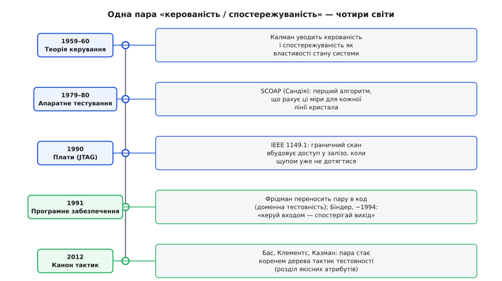

# 📜 Звідки взялися «керувати входом» і «спостерігати вихід»

Коли інженер каже, що система «тестовна», він майже завжди має на увазі дві конкретні речі, навіть якщо не називає їх уголос: чи можна **задати** їй потрібний вхід і стан, і чи можна **побачити**, що з того вийшло. Ця пара — керованість і спостережуваність — звучить так природно, ніби завжди була частиною ремесла. Насправді ж вона пройшла довгий шлях: народилася в чистій математиці керування, застрягла на десятиліття в апаратній інженерії, де без неї мікросхему буквально неможливо перевірити, і лише потім перекочувала в програмування — уже готовою рамкою, яку залишалося тільки перенести. Історія того, як два терміни зі світу ракетних систем стали азбукою тестування коду, багато чого пояснює про саме поняття.

## Задача, яку неможливо було обійти: як перевірити те, до чого не дотягтися

Почнімо з того, що бентежило раніше за всіх — з інженерів, які паяли перші великі мікросхеми. Уяви їхнє становище. У 1960-х логіку ще будували з окремих корпусів, і до кожного важливого дроту можна було торкнутися щупом осцилографа: подав сигнал сюди, поміряв там, побачив, що не так. Ця розкіш зникла, щойно тисячі вентилів заповзли під один кристал. Тепер більшість вузлів опинилися **всередині** — між зовнішніми ніжками корпусу лежали шари логіки, до яких фізично не було як дотягтися. Ти бачив лише кілька виводів назовні, а хвороба ховалася десь у глибині, за десятком проміжних вентилів.

І тут виявилося, що сама будова кристала вирішує, чи можна його взагалі перевірити. Щоб перевірити внутрішній вентиль, треба **двох речей одночасно**. По-перше, якось **загнати** його в потрібний стан — а керуєш ти лише зовнішніми ніжками, тож треба знайти таку комбінацію входів, яка протисне потрібне значення крізь усю логіку до цього вентиля. По-друге, якось **витягти** результат назовні — бо якщо помилка застрягла всередині й не доповзає до жодної вихідної ніжки, ти її не побачиш, хай навіть вона там є. Обидві здатності залежать не від старанності тестувальника, а від того, як кристал спроєктований. Погана будова — і цілі ділянки логіки стають глухими: до них не подати відомий вхід і з них не прочитати вихід. Ніяким прогоном тестів цього вже не виправиш.

> 🔧 **Навіщо це.** Ось звідки в саме поняття тестовності вбудована думка, що вона — рішення на етапі проєктування, а не пізніша дописка. Апаратники дійшли до цього не з філософських міркувань, а з болю: кристал, у який не заклали шляхів доступу, лишався частково несправним назавжди, і полагодити це можна було тільки в наступній ревізії кремнію — тобто через місяці й купу грошей. Точно та сама механіка потім спрацює в коді: шматок, до якого не «прорізали» доступ, дорого перевіряти вже ніколи.

Так у голові інженерів викристалізувалися дві осі, вздовж яких вимірюють доступ до внутрішньої точки. Пізніше їх назвуть **керованістю** (англ. *controllability* — наскільки легко виставити задане значення в потрібному місці) і **спостережуваністю** (англ. *observability* — наскільки легко це значення побачити на виході). Але імена ці прийшли не з тестування — їх позичили в геть іншій дисципліні.

## Корінь у теорії керування: Калман і дві властивості стану

Слова «controllability» й «observability» мають цілком певного батька, і це не інженер-тестувальник, а математик, який займався ракетами й супутниками. **Рудольф Емільович Калман (Rudolf Emil Kálmán, 1930–2016)** — угорсько-американський інженер і математик, народжений у Будапешті, який 1943 року з родиною виїхав до США й здобув освіту в MIT і Колумбійському університеті. Наприкінці 1950-х він будував нову, «просторово-станову» мову для систем керування — ту, з якої згодом виросли фільтр Калмана й уся сучасна теорія оптимального керування, що вела кораблі «Аполлонів» до Місяця.

У межах цієї теорії Калман увів дві фундаментальні властивості будь-якої динамічної системи, і формулювання їх — майже дослівно те, що потім повторять тестувальники. **Керованість** питає: чи можна діями на входи перевести систему з будь-якого стану в будь-який інший наперед заданий стан? **Спостережуваність** питає: чи можна за скінченний час, дивлячись лише на виходи, однозначно відновити, у якому внутрішньому стані система перебуває? Якщо якийсь внутрішній стан не керований — жодним входом до нього не дотягнутися; якщо не спостережуваний — жодним виходом його не розрізнити. Це усталений факт історії науки: терміни введено в роботах Калмана 1959–1960 років, і в теорії керування вони давно канонічні.

Придивися до цих означень — і побачиш, що вони описують рівно ту саму проблему, яку намацали апаратники, тільки абстрактно й раніше. «Дотягтися до внутрішнього вузла входами» — це керованість. «Розрізнити внутрішній стан за виходами» — це спостережуваність. Різні світи — ракети й кремній — уперлися в одну й ту саму пару властивостей. Тому, коли інженери тестування шукали, як назвати свої дві осі доступу, готові терміни вже лежали поруч у сусідній дисципліні. Їх і взяли.

## Перенесення в кремній: SCOAP і design-for-testability

Тепер треба було з інтуїції «до цього вентиля не дотягтися» зробити **число** — бо доти, доки складність тестування лишалася відчуттям у голові інженера, керувати нею було годі. Хто скаже, який із мільйона вузлів кристала найважче перевірити? Потрібна була міра, яку рахує машина.

Її дали в Сандійських національних лабораторіях (Sandia National Laboratories) у США. Приблизно 1979 року **Л. Г. Ґолдстайн (L. H. Goldstein)**, а невдовзі й у спільній праці з **Е. Л. Тіґпеном (E. L. Thigpen)**, представив програму **SCOAP** — розшифровується як *Sandia Controllability/Observability Analysis Program*, «Сандійська програма аналізу керованості й спостережуваності». Формальна публікація вийшла в матеріалах 17-ї конференції з автоматизації проєктування (17th Design Automation Conference) у Міннеаполісі, червень 1980-го. Це усталене джерело: SCOAP дала **перше чітке означення спостережуваності для схем, першу струнку формулу й перший ефективний алгоритм**, який рахує керованість і спостережуваність кожної лінії кристала.

Ідея SCOAP гарна своєю прямотою. Кожному сигналу схеми вона приписує числа: наскільки «дорого» (у сенсі логічної глибини) виставити цю лінію в 0, наскільки дорого — в 1, і наскільки дорого протягти її значення до якогось виходу. Формально їх шестеро на сигнал — комбінаційні та послідовнісні варіанти для нуля-керованості, одиниці-керованості й спостережуваності:

```
CC0  — важкість виставити лінію в 0   (0-controllability)
CC1  — важкість виставити лінію в 1   (1-controllability)
CO   — важкість спостерегти лінію на виході (observability)
```

Велике число — сигнал важко керований або погано спостережуваний, тобто **вузьке місце тестовності**; його видно на карті ще до того, як написано бодай один тест. Уперше «наскільки це важко перевірити» стало властивістю, яку інструмент рахує автоматично для всієї схеми.

Паралельно росла ціла інженерна культура — **проєктування задля тестовності (англ. *design for testability*, DFT)**: не молитися, щоб кристал вийшов перевірним, а свідомо закладати в нього шляхи доступу. Витоки — початок 1970-х. Ще 1973 року **М. Дж. Ю. Вільямс (M. J. Y. Williams)** і **Дж. Б. Енджелл (J. B. Angell)** зі Стенфордського університету опублікували роботу про підвищення тестовності великих інтегральних схем через **тестові виводи й додаткову логіку** — по суті, навмисно прорізані «ручки» доступу до внутрішніх точок. Далі, 1977-го, **Е. Б. Айхельберґер (E. B. Eichelberger)** і **Т. В. Вільямс (T. W. Williams)** з IBM запропонували структуру **LSSD** (level-sensitive scan design) — спосіб з'єднати всі внутрішні тригери в один довгий зсувний ланцюг, щоб машина могла **вдвинути** в них будь-який стан і **виштовхнути** назовні будь-який результат. Це буквально фізичне втілення керованості й спостережуваності: зсувний ланцюг дає прямий доступ туди, куди зовнішні ніжки не діставали. А 1983-го **Т. В. Вільямс (T. W. Williams)** і **К. П. Паркер (K. P. Parker)** підсумували поле оглядом «Design for Testability — A Survey» у Proceedings of the IEEE, який закріпив DFT як окрему дисципліну.

## JTAG: коли до плати вже не дотягтися щупом

Була ще одна хвиля тієї самої проблеми — на щабель вище, на рівні цілої плати, і саме її найчастіше згадують як наочний мотив. Класично плату перевіряли «ліжком цвяхів» (англ. *bed of nails*): монтажну плату опускали на поле підпружинених контактів-щупів, кожен тицяв у свою контактну точку, і так система діставалася до всіх ланцюгів. Це працювало, доки доріжки й перехідні отвори були великі й лежали на поверхні. А потім прийшов поверхневий монтаж (surface-mount), багатошарові плати й густе пакування — і фізично **дотягтися щупом до потрібної точки стало неможливо**: доріжка ховається між шарами, під корпусом мікросхеми, у морі сусідніх з'єднань. Знову те саме: вузол є, а доступу до нього нема.

Відповіддю став **граничний скан (англ. *boundary scan*)** і стандарт, що з нього виріс. Наприкінці 1980-х група фахівців із тестування від кількох компаній — серед них Philips, British Telecom, GEC і Texas Instruments — об'єдналась у **Joint Test Action Group (JTAG)**, «спільну групу дій із тестування». Ідея: обкласти кожну ніжку мікросхеми крихітною зсувною коміркою, а всі ці комірки з'єднати в ланцюг по периметру («границі») кристала. Тоді через чотири службові виводи можна **вдвинути** будь-який набір значень на ніжки й **прочитати**, що на них є, — не торкаючись плати жодним щупом. Доступ повернувся, тільки тепер він логічний, а не механічний.

Це усталені дати: стандарт ратифікували **15 лютого 1990 року** як IEEE 1149.1-1990 (*Standard Test Access Port and Boundary-Scan Architecture*), а чотири службові виводи того самого порту (TCK, TMS, TDI, TDO) досі стирчать із мільярдів мікросхем і слугують не лише тестуванню, а й, наприклад, завантаженню прошивки та внутрішньосхемному налагодженню. Ім'я групи — «JTAG» — приросло до самого інтерфейсу.

Тут варто зробити чесне застереження про причинно-наслідковий зв'язок, бо його легко перебільшити. JTAG — не той момент, коли народилася **пара термінів**: керованість і спостережуваність уже років десять як були назвами осей у SCOAP і DFT. Правильніше сказати інакше: JTAG — це найяскравіша, найнаочніша ілюстрація того самого принципу в дії. Він показує голу суть тестовності без жодної абстракції — коли до вузла не дотягтися, ти **фізично прорізаєш** до нього шлях керування й спостереження, вбудований прямо в залізо. Саме тому його так люблять наводити як міст від апаратного розуміння тестовності до програмного: це принцип, який можна помацати руками.

*Одна й та сама пара — керованість і спостережуваність — мандрує чотирма світами, щоразу відповідаючи на те саме питання: чи можна задати вхід і побачити вихід.*



## Стрибок у програмування: Фрідман і Біндер

Тепер найцікавіший поворот — як суто апаратна, а перед тим суто теоретична пара опинилася в підручнику з тестування коду. Це сталося не саме собою: був конкретний дослідник, який свідомо взяв означення Калмана й **приклав їх до програм**.

Ним був **Рой Фрідман (Roy S. Freedman)**. У червні 1991-го в IEEE Transactions on Software Engineering вийшла його стаття «Testability of Software Components» («Тестовність програмних компонентів»). Фрідман увів поняття **доменної тестовності** (англ. *domain testability*) саме як застосування Калманових спостережуваності й керованості до програмного забезпечення. У його формулюванні компонент спостережуваний, якщо за виходами можна однозначно судити про його поведінку (немає прихованих внутрішніх станів, що дають однаковий вихід), і керований, якщо на його вхід можна подати будь-яке потрібне значення з домену. Це усталений факт: саме Фрідмана зазвичай називають тим, хто вперше формально переніс цю пару з теорії динамічних систем і апаратного тестування у світ софту.

А популярним, робочим формулюванням, яке ти й досі чуєш майже дослівно, поняття завдячує **Роберту В. Біндеру (Robert V. Binder)**. У праці про тестування об'єктно-орієнтованого ПЗ (близько 1994 року) він сформулював суть так прямо, що краще не скажеш: *щоб протестувати компонент, ти маєш бути здатним керувати його входом (і внутрішнім станом) та спостерігати його вихід*. І далі — залізна логіка, чому без цих двох здатностей тесту не буває: не можеш керувати входом — не знатимеш, що саме спричинило певний вихід; не можеш спостерігати вихід — не знатимеш, як саме опрацьовано певний вхід. Біндеру ж приписують і перенесення в софт самого гасла **«design for testability»** — будувати з думкою про тестовність від початку, а не згадувати про неї, коли вже пізно. Це та сама культура DFT, тільки тепер про класи й методи, а не про вентилі.

Поруч визрівала й інша, суворіша спроба виміряти тестовність числом — щоб не лишати її на око. **Джеффрі Воас (Jeffrey Voas)** з колегами (класична стаття «Software Testability: The New Verification», IEEE Software, 1995) запропонував дивитися на тестовність **імовірнісно**: це ймовірність того, що програма з дефектом **завалить** наступний прогін, якщо дефект справді є. Логіка тонка: дефект спрацює лише тоді, коли керування «доведе» виконання до хворого рядка (execution), дефект зіпсує внутрішній стан (infection) і ця зіпсованість **дотягнеться** до спостережуваного виходу (propagation) — звідси й назва техніки оцінювання PIE. Низька тестовність за Воасом — це підступний код, що ковтає власні помилки: дефект є, а назовні не виривається, тож тести його не бачать. Придивись — і за цією ймовірнісною мовою проступає та сама пара: щоб дефект проявився, потрібні і керування (довести виконання туди), і спостережуваність (пропустити наслідок до виходу). Дослідники підходили з різних боків — Фрідман від логіки доменів, Біндер від практики ООП, Воас від імовірності, — а впиралися в ті самі два важелі.

## Місце в каноні: Бас, Клементс і Казман

Останній щабель — як ця історія осіла в тому джерелі, з якого архітектори сьогодні беруть тактики тестовності готовими. Це книга **Лена Баса (Len Bass), Пола Клементса (Paul Clements) і Ріка Казмана (Rick Kazman) «Software Architecture in Practice»**, що вийшла з Інституту програмної інженерії (Software Engineering Institute) при Університеті Карнеґі — Меллона. У третьому виданні (авторське право 2012-го, друком 2013-го) тестовності відведено окремий розділ серед якісних атрибутів — **розділ 10** — і саме там пара «керованість і спостережуваність» стає організаційним хребтом усіх тактик.

Що зробили автори — це не винайшли поняття, а **навели лад**. Вони взяли ту саму пару, що мандрувала від Калмана через SCOAP і Біндера, і поклали її в основу дерева тактик. Тактики тестовності в них діляться на дві родини (це усталено відтворюється в матеріалах за книгою): перша **додає системі керованість і спостережуваність** — спеціальні інтерфейси, абстрагування джерел даних, пісочниця, запис/відтворення, локалізація стану, виконувані твердження; друга **обмежує складність** — структурну (розплести залежності, послабити зчеплення) і недетермінізм. Тобто корінь дерева — не довільна класифікація, а прямий спадок тієї самої історичної пари: спершу дай два важелі, тоді зменш простір, до якого їх треба прикладати.

Так замикається коло, яке варто побачити цілим. Питання «чи можна задати вхід і побачити вихід» **не вигадали в програмуванні** — його привезли готовим. Спершу Калман назвав ці дві властивості для абстрактних динамічних систем; тоді апаратники вперлися в них буквально, бо до внутрішнього вентиля не дотягтися, і навчилися їх рахувати (SCOAP) та фізично вбудовувати доступ у кремній (LSSD, JTAG); нарешті Фрідман і Біндер перенесли ту саму пару в код, а Бас, Клементс і Казман зробили її організаційним центром архітектурних тактик. Через усі чотири світи — ракети, кристали, плати, класи — тягнеться одна незмінна думка: система тестовна рівно настільки, наскільки легко **дотягтися до її входу й до її виходу**. Решта — техніка.

---

Кілька слів про статус фактів у цій розповіді, щоб відрізнити тверде від приблизного. **Усталене:** авторство пари «controllability/observability» за Калманом (1959–60) у теорії керування; SCOAP Ґолдстайна (Сандія, 1979–80) як перший алгоритм цих мір для схем; рання DFT-робота Вільямса й Енджелла про тестові виводи (1973) та LSSD Айхельберґера й Вільямса (IBM, 1977); ратифікація IEEE 1149.1 (JTAG) 15 лютого 1990-го; стаття Фрідмана в IEEE TSE (червень 1991) як формальне перенесення пари в софт; означення Воаса й колег (IEEE Software, 1995); розділ 10 про тестовність у третьому виданні книги Баса, Клементса й Казмана (2012/2013). **Приблизне за датою:** точний рік Біндерового формулювання «control input / observe output» подають то як 1994, то ближче до середини 1990-х (воно повторюється в кількох його працях), тож рік беремо як орієнтир, а не як карбовану дату; сам зміст формулювання при цьому не спірний. **Обережно з причинністю:** JTAG не «народив» пару термінів (вона старша за нього на десятиліття) — він її найнаочніше **ілюструє**; плутати ілюстрацію з походженням було б помилкою.
