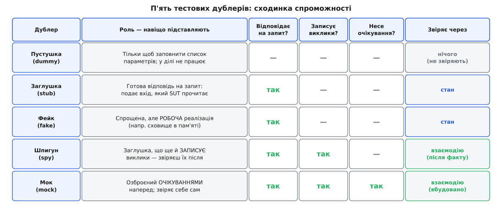
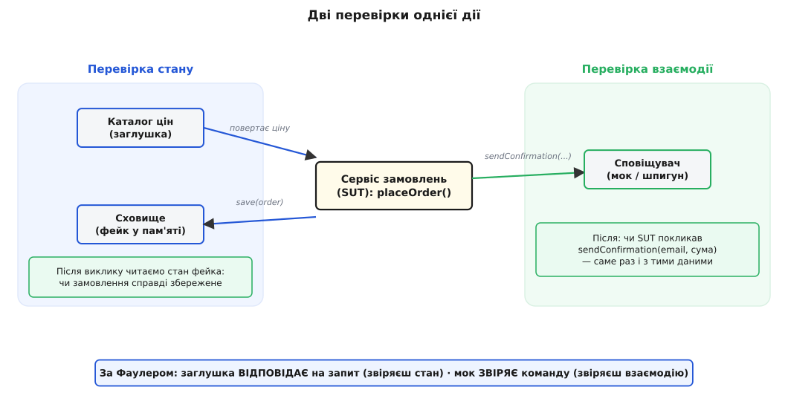
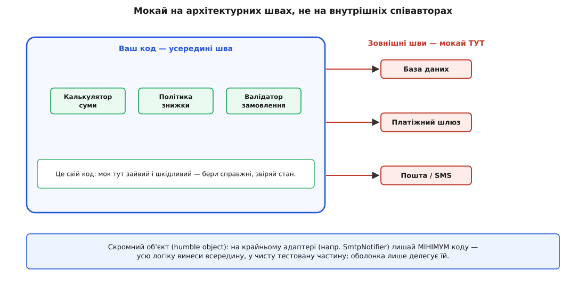

# ⚙️ П'ять тестових дублерів на робочому коді: від пустушки до мока

«Замокай це» — фраза, яка проковтнула п'ять різних речей. У щоденній розмові *мок* — будь-що, що підставляють замість справжнього сусіда: і болванка, щоб закрити параметр, і сховище в пам'яті замість бази, і об'єкт, що нишком записує, кого й коли покликали. Але за цим одним словом ховаються п'ять окремих інструментів із різними обов'язками — і плутанина не безневинна. Саме вона вирішує, чи впаде твій тест, коли ти переставиш два рядки місцями, не змінивши **нічого** в поведінці системи.

Лад у цю п'ятірку навів Джерард Мезарош у книжці *xUnit Test Patterns: Refactoring Test Code* (Addison-Wesley, 2007). Спільну назву для всякого підставного об'єкта він дав таку — **тестовий дублер (англ. *test double*)**; метафора пряма — кінодублер, каскадер, що заміняє актора в небезпечній сцені. А під цією парасолькою — п'ять різновидів, кожен зі своєю роллю: **пустушка (dummy)**, **заглушка (stub)**, **фейк (fake)**, **шпигун (spy)** і **мок (mock)**. Це усталена, задокументована таксономія, на яку відтоді спирається вся розмова про підставні об'єкти.

Різниця між ними — не термінологічне крутійство. Вона лягає точно вздовж однієї осі: **скільки дублер уміє і що ти з ним звіряєш**. Ось ця сходинка спроможності, від найтупішого до найозброєнішого.



*Кожна сходинка додає одну спроможність. Пустушка не вміє нічого. Заглушка відповідає на запит. Фейк відповідає по-справжньому, робочою логікою. Шпигун ще й записує, кого покликали. Мок несе очікування наперед і звіряє себе сам. Права колонка — головна: одні дублери ведуть до перевірки **стану**, інші — до перевірки **взаємодії**.*

Щоб не говорити про це в порожнечу, візьмімо один наскрізний приклад і проженімо крізь нього всі п'ять. Приклад навмисне буденний — сервіс, що приймає замовлення, — бо саме на буденному видно, де межа між дублерами проходить точно.

## Задача: сервіс із п'ятьма сусідами

Одна операція — «розмістити замовлення» — і навколо неї чотири сусіди, кожен з яких по-своєму заважає тесту.

:::tabs
```ts
type Money = number; // копійки

interface PriceCatalog { priceOf(sku: string): Money; }
interface OrderRepository {
  save(order: Order): void;
  find(id: string): Order | undefined;
}
interface Notifier { sendConfirmation(email: string, total: Money): void; }
interface AuditLog { record(event: string, id: string): void; }

interface Line  { sku: string; qty: number; }
interface Order { id: string; email: string; total: Money; status: "placed"; }
interface PlaceOrderCmd { orderId: string; email: string; items: Line[]; }

interface Deps {
  catalog: PriceCatalog; repo: OrderRepository;
  notifier: Notifier;    audit: AuditLog;
}

function placeOrder(cmd: PlaceOrderCmd, deps: Deps): Order {
  const total = cmd.items.reduce(
    (sum, line) => sum + deps.catalog.priceOf(line.sku) * line.qty, 0);
  const order: Order = { id: cmd.orderId, email: cmd.email, total, status: "placed" };
  deps.repo.save(order);
  deps.notifier.sendConfirmation(order.email, total);
  deps.audit.record("order_placed", order.id);
  return order;
}
```
```py
from dataclasses import dataclass, replace
from typing import Protocol

Money = int  # копійки

class PriceCatalog(Protocol):
    def price_of(self, sku: str) -> Money: ...

class OrderRepository(Protocol):
    def save(self, order: "Order") -> None: ...
    def find(self, order_id: str) -> "Order | None": ...

class Notifier(Protocol):
    def send_confirmation(self, email: str, total: Money) -> None: ...

class AuditLog(Protocol):
    def record(self, event: str, order_id: str) -> None: ...

@dataclass
class Line:
    sku: str
    qty: int

@dataclass
class Order:
    id: str
    email: str
    total: Money
    status: str  # "placed"

@dataclass
class PlaceOrderCmd:
    order_id: str
    email: str
    items: list[Line]

@dataclass
class Deps:
    catalog: PriceCatalog
    repo: OrderRepository
    notifier: Notifier
    audit: AuditLog

def place_order(cmd: PlaceOrderCmd, deps: Deps) -> Order:
    total = sum(deps.catalog.price_of(line.sku) * line.qty for line in cmd.items)
    order = Order(id=cmd.order_id, email=cmd.email, total=total, status="placed")
    deps.repo.save(order)
    deps.notifier.send_confirmation(order.email, total)
    deps.audit.record("order_placed", order.id)
    return order
```
:::

Зверни увагу на природу цих чотирьох сусідів — вона різна, і саме вона диктує, який дублер до кого пасує. **Каталог цін** відповідає на **запит**: ти в нього питаєш ціну, він повертає число, жодного сліду в світі не лишаючи. **Сховище** тримає **стан**: поклав — потім прочитав. **Сповіщувач** виконує **команду**: шле лист назовні, і повернути нічого не має — уся суть у побічній дії на зовнішній світ. А **аудит-лог** тут — дрібний обов'язковий формалізм, який більшість тестів взагалі не цікавить.

Кожному з цих чотирьох характерів пасує свій дублер. Пройдімо їх по черзі.

## Пустушка: заповнити порожнє місце

Найтупіший дублер не вміє нічого — і в цьому весь сенс. **Пустушку** підставляють єдино для того, щоб закрити параметр, якого цей конкретний тест **не** торкається. Аудит-лог — саме такий випадок: `placeOrder` обов'язково його кличе, але тест про суму замовлення до аудиту байдужий. Дати туди справжній лог — тягти зайву залежність; лишити `null` — впаде на виклику. Тож даємо болванку, чиї методи нічого не роблять.

:::tabs
```ts
// Пустушка: існує лише щоб закрити параметр; у ділі не бере участі.
const dummyAudit: AuditLog = { record() {} };
```
```py
class DummyAudit:
    def record(self, event: str, order_id: str) -> None: ...
```
:::

Ключове: пустушку **ніколи не читають**. Щойно тест починає щось у неї питати чи звіряти її виклики — це вже не пустушка, а заглушка або шпигун. Пустушка — це чесне «мене тут ніби й немає».

## Заглушка: готова відповідь на запит

Наступна сходинка вміє одне: **відповідати наперед заготованим**. **Заглушка** підсовує системі вхід, який та прочитає, — і цим забирає в тебе кермо над входом. Каталог цін ідеально просить заглушки: у бою він лізе в базу чи по мережі, тест не може ні зафіксувати ціну, ні відповісти швидко. Заглушка ж повертає рівно те, що ти задав.

:::tabs
```ts
class StubCatalog implements PriceCatalog {
  constructor(private readonly prices: Record<string, Money>) {}
  priceOf(sku: string): Money {
    const p = this.prices[sku];
    if (p === undefined) throw new Error(`немає ціни для ${sku}`);
    return p;
  }
}
```
```py
class StubCatalog:
    def __init__(self, prices: dict[str, Money]) -> None:
        self._prices = prices

    def price_of(self, sku: str) -> Money:
        return self._prices[sku]
```
:::

Заглушка **пасивна**: вона відповідає, коли її питають, і не має жодної думки про те, скільки разів і в якому порядку її кликали. Її роль вичерпується відповіддю. А раз вона тільки годує вхід — звіряти результат доведеться деінде: у **стані**, який вийшов. Але щоб було де тому стану осісти, потрібен наступний дублер.

## Фейк: спрощена, але справжня реалізація

Заглушка бреше заготованим числом. **Фейк** натомість — це **робоча** реалізація, тільки зрізана так, що в бій не годиться. Сховище в пам'яті на звичайному словнику — канонічний фейк: `save` справді кладе, `find` справді знаходить, усе працює, просто дані живуть у пам'яті процесу й зникають наприкінці тесту.

:::tabs
```ts
class InMemoryOrders implements OrderRepository {
  private readonly rows = new Map<string, Order>();
  save(order: Order): void { this.rows.set(order.id, { ...order }); }
  find(id: string): Order | undefined { return this.rows.get(id); }
}
```
```py
class InMemoryOrders:
    def __init__(self) -> None:
        self._rows: dict[str, Order] = {}

    def save(self, order: Order) -> None:
        self._rows[order.id] = replace(order)

    def find(self, order_id: str) -> "Order | None":
        return self._rows.get(order_id)
```
:::

Ось де ховається різниця «заглушка проти фейка», яку часто змазують. Заглушка **віддає** те, що ти в неї вклав; фейк **робить** те, що робив би справжній. Тому саме фейк дає тобі перевіряти **стан**: після `placeOrder` можна спитати сховище — «а замовлення справді там, і статус правильний?» — і воно чесно відповість, бо чесно зберегло. Зберемо перших трьох дублерів в один тест і звіримо саме стан.

:::tabs
```ts
import assert from "node:assert/strict";

function test_total_and_persisted() {
  const catalog = new StubCatalog({ "KAVA-250": 250, "CUKOR-1": 90 }); // заглушка
  const repo = new InMemoryOrders();                                    // фейк
  const spy = new SpyNotifier();                                        // тут байдужий
  const cmd: PlaceOrderCmd = {
    orderId: "ORD-1", email: "olena@shop.ua",
    items: [{ sku: "KAVA-250", qty: 2 }, { sku: "CUKOR-1", qty: 1 }],
  };

  const order = placeOrder(cmd, { catalog, repo, notifier: spy, audit: dummyAudit });

  // перевірка СТАНУ: сума порахована й замовлення справді збережене
  assert.equal(order.total, 590);              // 2·250 + 1·90 = 590
  assert.deepEqual(repo.find("ORD-1"), order); // фейк повертає те, що поклали
}
```
```py
def test_total_and_persisted() -> None:
    catalog = StubCatalog({"KAVA-250": 250, "CUKOR-1": 90})  # заглушка
    repo = InMemoryOrders()                                  # фейк
    spy = SpyNotifier()                                      # тут байдужий
    cmd = PlaceOrderCmd(
        order_id="ORD-1", email="olena@shop.ua",
        items=[Line("KAVA-250", 2), Line("CUKOR-1", 1)],
    )

    order = place_order(cmd, Deps(catalog, repo, spy, DummyAudit()))

    # перевірка СТАНУ: сума порахована й замовлення справді збережене
    assert order.total == 590             # 2·250 + 1·90 = 590
    assert repo.find("ORD-1") == order    # фейк повертає те, що поклали
```
:::

Тест нічого не питає про те, **як** система дійшла результату. Він дивиться на слід: сума `590`, замовлення в сховищі. Це і є перевірка стану — і для запиту (ціна) та стану (збереження) вона природна. Але зі сповіщенням так не вийде, і саме тут починаються два останні дублери.

## Шпигун: записати, кого покликали

Сповіщувач шле лист. Що звіряти? Стану нема — лист полетів назовні, у процесі нічого не осіло. Єдине спостережуване тут — **факт виклику**: система мала покликати `sendConfirmation` з правильною поштою й сумою. Щоб цей факт піймати, потрібен дублер, який **запам'ятовує**, кого й з чим кликали. Це **шпигун** — заглушка, яка додатково веде журнал викликів, щоб ти звірив його **після**.

:::tabs
```ts
class SpyNotifier implements Notifier {
  readonly calls: Array<{ email: string; total: Money }> = [];
  sendConfirmation(email: string, total: Money): void {
    this.calls.push({ email, total });
  }
}

function test_confirmation_sent() {
  const spy = new SpyNotifier();
  placeOrder(
    { orderId: "ORD-2", email: "olena@shop.ua", items: [{ sku: "KAVA-250", qty: 2 }] },
    { catalog: new StubCatalog({ "KAVA-250": 250 }), repo: new InMemoryOrders(),
      notifier: spy, audit: dummyAudit },
  );

  // перевірка ВЗАЄМОДІЇ: рівно одне сповіщення, з тими даними
  assert.equal(spy.calls.length, 1);
  assert.deepEqual(spy.calls[0], { email: "olena@shop.ua", total: 500 }); // 2·250
}
```
```py
class SpyNotifier:
    def __init__(self) -> None:
        self.calls: list[tuple[str, Money]] = []

    def send_confirmation(self, email: str, total: Money) -> None:
        self.calls.append((email, total))

def test_confirmation_sent() -> None:
    spy = SpyNotifier()
    place_order(
        PlaceOrderCmd("ORD-2", "olena@shop.ua", [Line("KAVA-250", 2)]),
        Deps(StubCatalog({"KAVA-250": 250}), InMemoryOrders(), spy, DummyAudit()),
    )

    # перевірка ВЗАЄМОДІЇ: рівно одне сповіщення, з тими даними
    assert len(spy.calls) == 1
    assert spy.calls[0] == ("olena@shop.ua", 500)  # 2·250
```
:::

Порядок дій у шпигуна класичний: **спорудив — виконав — звірив** (arrange–act–assert). Спершу проганяєш дію, потім, наприкінці, розглядаєш журнал. Шпигун — усе ще пасивний під час прогону: він мовчки нотує й нікому не заважає. Активним звіряння стає лише в останньому рядку тесту, твоїми руками. А що, якби дублер сам знав, чого чекати, і сам собі виніс вирок?

## Мок: озброєний очікуваннями наперед

Останній, найозброєніший дублер відрізняється від шпигуна двома речами. Перше: очікування задають **наперед**, до дії, — «я чекаю рівно одне сповіщення на цю пошту з цією сумою». Друге: **мок звіряє себе сам** — у нього є метод `verify`, і це його обов'язок винести вирок, а не твій. Понад те, мок може впасти **негайно** на несподіваному чи неправильному виклику, не чекаючи кінця тесту.

:::tabs
```ts
class MockNotifier implements Notifier {
  private expected: { email: string; total: Money } | null = null;
  private actual:   { email: string; total: Money } | null = null;

  expectConfirmation(email: string, total: Money): void {
    this.expected = { email, total };            // очікування — НАПЕРЕД
  }
  sendConfirmation(email: string, total: Money): void {
    if (this.actual) throw new Error("сповіщення надіслано двічі"); // падає одразу
    this.actual = { email, total };
  }
  verify(): void {                               // мок звіряє себе сам
    const ok = this.actual && this.expected
      && this.actual.email === this.expected.email
      && this.actual.total === this.expected.total;
    if (!ok) throw new Error(
      `очікували ${JSON.stringify(this.expected)}, дістали ${JSON.stringify(this.actual)}`);
  }
}

function test_confirmation_mock() {
  const mock = new MockNotifier();
  mock.expectConfirmation("olena@shop.ua", 500); // ← спершу озброюємо очікуванням
  placeOrder(
    { orderId: "ORD-3", email: "olena@shop.ua", items: [{ sku: "KAVA-250", qty: 2 }] },
    { catalog: new StubCatalog({ "KAVA-250": 250 }), repo: new InMemoryOrders(),
      notifier: mock, audit: dummyAudit },
  );
  mock.verify();                                  // ← мок сам виносить вирок
}
```
```py
class MockNotifier:
    def __init__(self) -> None:
        self._expected: "tuple[str, Money] | None" = None
        self._actual:   "tuple[str, Money] | None" = None

    def expect_confirmation(self, email: str, total: Money) -> None:
        self._expected = (email, total)            # очікування — НАПЕРЕД

    def send_confirmation(self, email: str, total: Money) -> None:
        if self._actual is not None:
            raise AssertionError("сповіщення надіслано двічі")  # падає одразу
        self._actual = (email, total)

    def verify(self) -> None:                       # мок звіряє себе сам
        assert self._actual == self._expected, \
            f"очікували {self._expected}, дістали {self._actual}"

def test_confirmation_mock() -> None:
    mock = MockNotifier()
    mock.expect_confirmation("olena@shop.ua", 500)  # ← спершу озброюємо
    place_order(
        PlaceOrderCmd("ORD-3", "olena@shop.ua", [Line("KAVA-250", 2)]),
        Deps(StubCatalog({"KAVA-250": 250}), InMemoryOrders(), mock, DummyAudit()),
    )
    mock.verify()                                   # ← мок сам виносить вирок
```
:::

Тут я зліпив мок руками — щоб механізм було видно наскрізь. У справжньому проєкті цю церемонію бере на себе бібліотека (у Python — `unittest.mock`, у TypeScript — `jest`/`vitest`), але роль лишається та сама: очікування наперед, самозвіряння. Різниця шпигуна й мока тонка, але справжня: шпигун — це **пасивний диктофон**, який ти розшифровуєш сам; мок — **прокурор із заготованим звинуваченням**, який сам вирішує, чи винна система.

## Серце розрізнення: стан проти взаємодії

Тепер відступімо на крок і подивімося, що насправді розкололо п'ятірку навпіл. Ділить її не спроможність дублера, а **що ти ним звіряєш** — і це вже не про інструмент, а про сам спосіб дізнатися, що система впоралася.



*Дві незалежні відповіді на питання «чи система впоралася». Стан: проганяєш дію, потім розглядаєш світ — чи в ньому те, що треба (сума, збережене замовлення). Взаємодія: перевіряєш, що система зробила правильний виклик на співавтора (надіслала сповіщення саме раз, саме з тими даними).*

Цю межу різко провів Мартін Фаулер у статті «Mocks Aren't Stubs» (2004, дороблена 2007), і формулювання його варте того, щоб тримати в голові дослівно: **заглушка веде до перевірки стану, мок — до перевірки взаємодії**. Заглушка **відповідає** на запит — ти дивишся на результат. Мок **звіряє команду** — ти перевіряєш сам факт правильного виклику. Шпигун за цією віссю стоїть на боці мока: заглушка, яка через записані виклики теж перевіряє взаємодію.

З цього випливає просте робоче правило, яким варто орудувати щодня. **Запит заглушуй і звіряй стан. Команду — звіряй як взаємодію.** Логіка тут причинна, не смакова. Запит на те й запит, що повертає значення й нічого не змінює назовні, — його природний слід у **результаті**, тож питати «а чи покликали `priceOf`?» безглуздо: важить не виклик, а порахована сума. Команда навпаки — уся її суть у зовнішній дії, якої в процесі не спостерегти інакше, ніж пересвідчитися, що виклик стався правильно. Лист або пішов, або ні; єдиний спосіб це побачити зсередини тесту — перехопити виклик на сповіщувача.

Плутанина осей — типова причина поганих тестів. Заглушувати команду й потім звіряти стан, якого нема, — марно. Мокати запит і звіряти, що його «покликали», — це вже не перевірка поведінки, а зліпок з реалізації. І звідси прямий місток до найпоширенішої пастки з усіх.

## Пастка надмірного мокання

Мок — інструмент спокусливий: ним можна замінити геть **усіх** сусідів і на кожного навісити очікування. Спокуса ця дорого коштує. Коли ти мокаєш усе підряд, включно з внутрішніми співавторами, тест перестає перевіряти **поведінку** й починає фіксувати **структуру виконання** — точний перелік і порядок внутрішніх викликів. А структура — саме те, що рефакторинг має право міняти вільно, доки поведінка стала.

Ось як виглядає такий тест-зліпок. Він мокає всіх чотирьох сусідів і звіряє точну послідовність викликів.

:::tabs
```ts
// КРИХКИЙ тест: заморожує внутрішню структуру виконання
function test_place_order_fragile() {
  const seq: string[] = [];
  const catalog: PriceCatalog = { priceOf: (s) => { seq.push(`price:${s}`); return 250; } };
  const repo:    OrderRepository = { save: () => { seq.push("save"); }, find: () => undefined };
  const notify:  Notifier  = { sendConfirmation: () => { seq.push("notify"); } };
  const audit:   AuditLog  = { record: () => { seq.push("audit"); } };

  placeOrder(
    { orderId: "ORD-4", email: "o@x", items: [{ sku: "KAVA-250", qty: 2 }] },
    { catalog, repo, notifier: notify, audit },
  );

  // припущення про ТОЧНУ структуру, а не про поведінку:
  assert.deepEqual(seq, ["price:KAVA-250", "save", "notify", "audit"]);
}
```
```py
def test_place_order_fragile() -> None:
    seq: list[str] = []

    class Rec:
        def price_of(self, s: str) -> Money: seq.append(f"price:{s}"); return 250
        def save(self, o: Order) -> None: seq.append("save")
        def find(self, i: str) -> "Order | None": return None
        def send_confirmation(self, e: str, t: Money) -> None: seq.append("notify")
        def record(self, e: str, i: str) -> None: seq.append("audit")

    r = Rec()
    place_order(
        PlaceOrderCmd("ORD-4", "o@x", [Line("KAVA-250", 2)]),
        Deps(r, r, r, r),
    )

    # припущення про ТОЧНУ структуру, а не про поведінку:
    assert seq == ["price:KAVA-250", "save", "notify", "audit"]
```
:::

Тепер уяви безневинний рефакторинг: ти вирішив писати аудит **перед** відсиланням листа (щоб слід у журналі був навіть якщо пошта відмовить). Поведінка, яку бачить користувач, — та сама: замовлення збережене, лист надійшов, сума правильна. Але `seq` тепер `["price…", "save", "audit", "notify"]` — і крихкий тест червоніє, хоча нічого не зламалося. Ти пересунув два рядки місцями — і поплатився переписуванням тесту. Помнож це на сотні таких тестів, і вийде та сама картина, від якої команди зневірюються в тестах: кожен рефакторинг тягне зливу фальшивих падінь, а справжніх помилок ці тести не ловлять — вони стережуть **форму**, а не суть.

Корінь біди в тому, що надмірне мокання **зчеплює тест зі структурою** коду замість його спостережуваної поведінки. Це той самий надлишок зв'язків, тільки перенесений із продакшн-коду в тести: тест знає про SUT забагато зайвого, тож будь-яка зміна тієї внутрішньої будови б'є по тесту — точнісінько як [надмірне зчеплення](topic:programming/coupling-cohesion) робить крихким сам код, змушуючи правку в одному місці розповзатися хвилею по сусідніх.

Здорова заміна вже написана вище: тести `test_total_and_persisted` і `test_confirmation_sent` звіряють **наслідок** — суму, збережене замовлення, факт одного правильного сповіщення. Пересунь аудит куди хочеш, злий два виклики ціни в один пакетний — ці тести навіть не здригнуться, бо їм байдуже до внутрішнього маршруту. Вони перевіряють, **що** система зробила, а не **як** вона це зробила.

## Мокай на архітектурних швах, не на внутрішніх співавторах

З пастки випливає правило, яке варте того, щоб висіти над столом. **Дублери став на архітектурних швах, а не на внутрішніх співавторах.** Шов (англ. *seam*) — це місце, де твоя система межує з чимось, чого вона по-справжньому не контролює: мережа, база, годинник, платіжний шлюз, поштовий сервер. Внутрішній співавтор — це твій власний код по цей бік межі: калькулятор суми, політика знижки, валідатор.



*Дублери належать межі. Зовнішні шви (мережа, гроші, IO) — справжні коштують дорого, недетерміновані або мають незворотні наслідки, тож там підставляють дубль. Внутрішні співавтори — твій код; бери справжні й звіряй стан. Мокати їх — лише зчеплювати тест зі своєю декомпозицією.*

Чому саме шви заслуговують дубля — причина конкретна, не естетична. Справжня база повільна й лишає бруд; справжній платіж списує **реальні гроші**; справжня пошта шле реальні листи; справжній годинник дає щоразу інший час. Кожен такий сусід або дорогий, або недетермінований, або незворотний — усе, що робить тест повільним і хитким. Дубль тут відв'язує тест від цих бід. А внутрішній калькулятор суми нічим таким не страждає: він швидкий, чистий і твій. Підставити замість нього мок — це не купити нічого, а лише **зчепити тест із тим, як ти нарізав код на класи**. Завтра ти зіллєш калькулятор з політикою знижки в один клас — поведінка та сама, а мок-тест падає.

По суті, шов — це той інтерфейс, від якого залежить SUT, а підстановка дубля на нього — це [інверсія залежностей](topic:programming/dependency-inversion) у ділі: код тримається за абстрактний порт, а конкретну реалізацію — справжню в бою чи дубльовану в тесті — вставляють ззовні. Немає шва — немає куди вставити дубль; тому тестовність і починається з того, щоб залежності від зовнішнього світу проходили через явні порти.

У правила є важливий наслідок, який Стів Фрімен і Нат Прайс у книжці *Growing Object-Oriented Software, Guided by Tests* (2009) сформулювали як гасло: **мокай лише те, чим володієш**. Не став дубль прямо на чужий SDK платіжного шлюзу. Обгорни його **власним** портом і дубль став уже на свій порт. Інакше твій мок закодовує **твій здогад** про чужий API — а він може бути хибним, і тоді мок зелений, а бій червоний. Обгортання чужого за власним інтерфейсом — це рівно хід [портів і адаптерів](topic:programming/dependency-inversion/proj-ports-and-adapters.md): чужа деталь ховається за портом, який належить тобі, і тільки цей порт ти дублюєш.

## Скромний об'єкт на самому краю

Лишається одне незручне місце. Найзовнішчий адаптер — той, що по-справжньому говорить SMTP із поштовим сервером, — не піддається дешевому юніт-тесту хоч як крути: його робота **і є** незворотний зовнішній виклик. Що з ним робити?

Відповідь — патерн **скромний об'єкт (англ. *humble object*)**: зроби цей крайній адаптер настільки бідним на логіку, що в ньому нíчому буде помилятися. Витягни **всю** думку — форматування листа, рішення, що і як слати, — у чисту, щільно тестовану частину, а адаптерові лиши голе делегування.

:::tabs
```ts
// Уся логіка — у чистій частині, яку тестуємо густо й дешево.
class ConfirmationComposer {
  compose(email: string, total: Money): { to: string; subject: string; body: string } {
    const hrn = (total / 100).toFixed(2);
    return { to: email, subject: "Замовлення прийнято",
             body: `Дякуємо! До сплати: ${hrn} грн.` };
  }
}

// Скромна оболонка: жодного рішення — лише делегування + один зовнішній виклик.
class SmtpNotifier implements Notifier {
  constructor(
    private readonly composer: ConfirmationComposer,
    private readonly smtp: SmtpClient,   // чуже, за ВЛАСНИМ портом
  ) {}
  sendConfirmation(email: string, total: Money): void {
    this.smtp.send(this.composer.compose(email, total));
  }
}
```
```py
class ConfirmationComposer:
    def compose(self, email: str, total: Money) -> dict[str, str]:
        hrn = f"{total / 100:.2f}"
        return {"to": email, "subject": "Замовлення прийнято",
                "body": f"Дякуємо! До сплати: {hrn} грн."}

class SmtpNotifier:
    def __init__(self, composer: ConfirmationComposer, smtp: "SmtpClient") -> None:
        self._composer = composer      # чиста логіка
        self._smtp = smtp              # чуже, за ВЛАСНИМ портом

    def send_confirmation(self, email: str, total: Money) -> None:
        self._smtp.send(self._composer.compose(email, total))
```
:::

Тепер `ConfirmationComposer` — звичайна чиста функція: тестуй її десятками випадків без жодного дубля (гривні, копійки, довгі суми, порожні). А `SmtpNotifier` схуднув до одного рядка, у якому фактично немає що ламати, — тож і покривати його юніт-тестом майже нема сенсу; вистачить одного інтеграційного, де замість `SmtpClient` підставлено фейк порту. Слово «humble» у цю назву приніс Майкл Фізерс, а до каталогу патернів його завів той-таки Мезарош — і суть його одна: **зіштовхни логіку з нетестовного краю всередину, у тестовне ядро**.

## Складність і пастки

Дублери спокушають простотою, тож насамкінець — куди на них наступають найчастіше.

**Інструмент — це не роль.** `jest.fn()`, `unittest.mock.Mock`, `Mockito` — це знаряддя, а не дублери самі по собі. Один і той самий `jest.fn()` без відповіді — шпигун; додай `mockReturnValue` — уже заглушка; став на нього `toHaveBeenCalledWith` — робиш перевірку взаємодії. `MagicMock` узагалі перевертень, що стає ким завгодно залежно від того, як його вжити. Тримай у голові **роль**, яку задумав, — не дай інструменту вирішити за тебе.

**Надмірна специфікація.** Мок, що звіряє аргументи, до яких тесту байдуже, або порядок викликів, що не важить, — крихкий на порожньому місці. Звіряй **лише те, чого вимагає поведінка**: ті поля, що справді важать, а решту пропускай через матчери-заглушки. Кожне зайве очікування — це зайвий гвіздок, яким тест прибитий до реалізації.

**Не мокай чужого.** Дубль на сторонньому API кодує твій здогад про нього; обгорни спершу власним портом і дублюй порт — інакше зелений тест нічого не гарантує проти справжнього чужого коду.

**Фейк дрейфує.** Фейк — це справжній код, який мусиш тримати в згоді з реальною реалізацією. Інакше він тихо розходиться з боєм і присипляє фальшивою зеленню. Ліки — **контрактний тест**: один набір перевірок ганяють і на фейку, і на справжньому сховищі, щоб обидва шанували той самий контракт.

**Бери найпростіший дубль, що дає керування чи спостереження.** Церемонія й зчеплення ростуть уздовж сходинки: пустушка < заглушка < фейк < шпигун < мок. Мок там, де вистачило б заглушки, — це перевитрата: ти купив зайву специфічність і заплатив за неї крихкістю.

**П'ять моків — це сигнал, а не мета.** Якщо юніт неможливо перевірити без п'яти дублерів, це не привід мокати завзятіше — це сам дизайн шепоче, що в юніта забагато співавторів. Часто правильна відповідь не «ще один мок», а «розділи цей клас».

Зрештою, дублер — це просто **важіль**, який ти встановлюєш на шві: заглушка й фейк дають тобі керувати входом і станом, шпигун і мок дають спостерігати вихідні виклики. Обирай не за модою й не за назвою, а за тим, **що саме тобі треба побачити** в цій перевірці, — і став цей важіль на межі зі світом, а не всередині власного коду.
