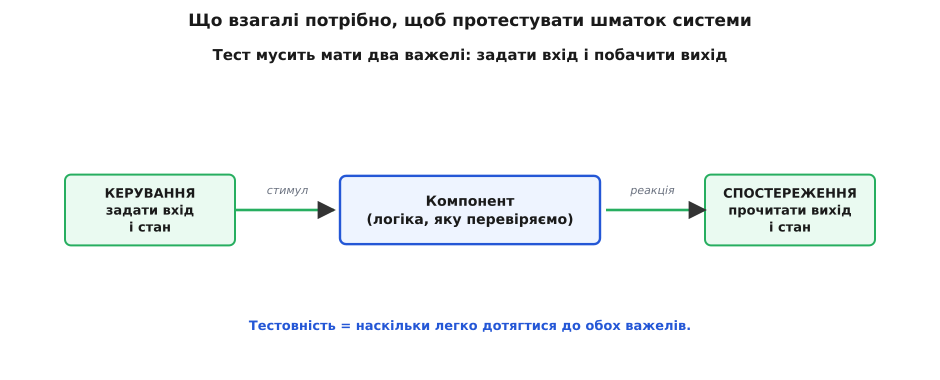

# Тактики тестовності

<preknowlist>
- [Якісні атрибути («-ilities»)](topic:programming/quality-attributes) — що таке нефункціональна властивість системи (доступність, продуктивність, тестовність) і чому вона окрема від того, що система робить.
- [Сценарії атрибутів](topic:programming/attribute-scenarios) — як розмиту вимогу перетворити на перевірне речення стимул → реакція → вимірна міра.
- [Тактика проти патерна](topic:programming/architectural-tactics) — тактика як одне точкове рішення, спрямоване на один атрибут, на відміну від патерна як готового пакета кількох тактик із уже зашитим компромісом.
- [Trade-off-аналіз](topic:programming/tradeoff-analysis) — будь-яке архітектурне рішення купує один атрибут ціною іншого; як цю ціну помічати й називати.
</preknowlist>

Порахуй, куди йде час у проєкті, і побачиш незручну правду: писати код — це менша частина роботи, а більша — переконуватися, що він робить те, що треба. Тестування з'їдає величезну частку зусиль, часто половину й більше. Тому будь-що, що робить перевірку **дешевшою й швидшою**, окуповується не раз і не два, а на кожному релізі до кінця життя системи. **Тестовність (англ. *testability*, від лат. *testis* — свідок; те, що можна поставити за свідка, тобто змусити систему сама показати свої вади)** — це властивість, яка каже, наскільки легко змусити код виявити свої помилки перевіркою. Не «чи є тести», а **наскільки сама будова системи допомагає їх писати й проганяти**.

І тут криється те, чого спершу не видно: тестовність — це рішення **архітектора**, а не тестувальника. Тестувальник працює з тим, що йому дали. Якщо систему збудували так, що дотягтися до потрібного шматка неможливо без піднімання всього застосунку, — жодна старанність тестів цього вже не виправить. Отже, питання не «як нам це протестувати потім», а «як збудувати так, щоб потім було що тестувати легко». Розберімося, з чого ця легкість складається — не як перелік прийомів для запам'ятовування, а як наслідок однієї простої вимоги до будь-якої перевірки.

## Що взагалі треба, щоб перевірити шматок системи

Уяви найдрібніший акт тесту. Ти береш якийсь шматок логіки й хочеш пересвідчитися, що на певний вхід він дає певний вихід. Щоб це зробити, тобі потрібні рівно **дві здатності**, і без жодної з них тесту просто не буває.

Перша — **керувати**: подати на вхід саме те, що ти задумав, і за потреби виставити внутрішній стан у відому початкову позицію. Якщо ти не можеш змусити систему опинитися в стані «кошик порожній, користувач залогінений, дата — 29 лютого», ти не перевіриш, що вона робить саме в цьому стані. Друга — **спостерігати**: побачити, що вийшло — і не лише кінцевий результат на екрані, а часто й внутрішній стан, бо саме там ховається половина помилок. Якщо результат обчислення осідає десь усередині й назовні не видно, ти не відрізниш правильну відповідь від неправильної.



*Уся тестовність зводиться до двох здатностей: задати вхід і стан, тоді прочитати вихід і стан. Що важче дотягтися до цих двох важелів, то дорожчий кожен тест.*

Ось і весь корінь. **Тестовність — це наскільки легко дотягтися до цих двох важелів: керування входом-і-станом та спостереження виходу-і-стану.** Усе інше — наслідки. Ця пара «керувати й спостерігати» — не наша вигадка, а класичне формулювання: систему тестовною роблять керованість входів і спостережуваність виходів. [Саме поняття тестовності](topic:programming/testability-tactics/hist-testability-term.md) виросло з апаратної інженерії, де мікросхему без спеціальних тестових виводів фізично неможливо перевірити, — і в програмуванні працює та сама логіка.

Звідси й усі тактики розкладаються на дві природні родини. Перша — та, що прямо **дає нам ці два важелі**: способи дотягтися до входу, стану й виходу. Друга — обхідна, але не менш важлива: **зменшити кількість станів**, у яких система взагалі буває, бо перевіряти менше різних поведінок завжди легше, ніж більше. Обидві родини — з канонічного дерева тактик тестовності у книзі Баса, Клементса й Казмана *Software Architecture in Practice* (3-є вид., 2012, розділ 10), усталеного джерела, на яке спираються програми навчання архітекторів.


*Дві родини тактик — не довільний список, а дві відповіді на одну потребу: перша дає важелі керування й спостереження, друга зменшує простір станів, які взагалі доводиться перевіряти.*

## Родина перша: дати важелі керування й спостереження

Ця родина б'є прямо в мету. Її тактики — це різні способи прорізати в системі «ручки», за які тест може взятися.

**Спеціальні тестові інтерфейси.** Найпряміший хід: додати компонентові методи, потрібні саме для перевірки, а не для роботи, — виставити внутрішнє значення, прочитати повний стан, скинути в початок, увімкнути докладне логування. Це вікно, крізь яке тест бачить і крутить нутрощі, не ламаючи інкапсуляцію для звичайних клієнтів. Ключове слово — **окремий**: тестовий інтерфейс живе поряд із робочим, тож перевірка отримує доступ, а звичайний код лишається чистим.

**Абстрагувати джерела даних.** Найчастіша причина, чому шматок логіки неможливо перевірити, — він **сам** дістає собі те, що йому треба: лізе в базу, читає годинник, стукає в мережу. Тест не може підсунути йому іншу базу чи інший час. Ліки — не давати компонентові діставати вхід самому, а **передавати** йому вхід ззовні через інтерфейс. Тоді в бою підставляють справжнє джерело, а в тесті — підроблене, з наперед відомими даними. Це та сама ідея, що й [інверсія залежностей](topic:programming/dependency-inversion): залежність від абстракції, а не від конкретного постачальника, — і саме вона робить логіку керованою.

**Пісочниця (англ. *sandbox* — «пісочниця», де можна гратися без наслідків).** Іноді перевіряти на справжньому світі небезпечно: реальний платіж спише реальні гроші, реальна команда рушить реальний дрон. Пісочниця ізолює систему від справжніх наслідків — віртуалізує ресурси, підміняє зовнішні служби заглушками, обертає дію в транзакцію, яку наприкінці відкочують. Тепер можна ганяти той самий сценарій сто разів поспіль, і світ щоразу повертається у вихідну позицію.

**Виконувані твердження (англ. *executable assertions*).** Помилку легше зловити там, де вона зароджується, ніж там, де вона нарешті вилазить назовні дивним результатом. Твердження — це вписані в код перевірки-вартові: «на цьому місці баланс не може бути від'ємним», «сюди не приходить порожній покажчик». Коли припущення порушено, програма зупиняється **тут і зараз**, показуючи точне місце хвороби, а не за десять кроків далі. Це різко піднімає спостережуваність зсередини.

**Запис і відтворення (англ. *record/playback*)** та **локалізувати зберігання стану** — дві тактики про відтворюваність. Перша ловить усе, що перетнуло інтерфейс під час реального прогону, і потім згодовує це назад як вхід, щоб відтворити рідкісний збій, який інакше не спіймати. Друга збирає стан системи в одне відоме місце (наприклад, явну машину станів), щоб тест міг одним рухом виставити потрібну початкову позицію, а не збирати її по крихтах зі всієї системи.

Подивімося, як абстрагування джерела перетворює неперевірний код на перевірний. Ось логіка, яка сама лізе по час і по дані — і тому непіддатлива тесту:

:::tabs
```cpp
// НЕ протестувати передбачувано: функція сама дістає час і курс,
// тест не може задати ні «яке зараз», ні «який курс».
double order_total(const Order& o) {
    double rate = fetch_rate_from_bank();     // мережа: щоразу інший результат
    double sum  = o.amount * rate;
    if (is_weekend(time(nullptr)))            // системний годинник: не задати
        sum *= 1.05;                          // націнка вихідного дня
    return sum;
}
```
```python
# НЕ протестувати передбачувано: функція сама дістає час і курс,
# тест не може задати ні «яке зараз», ні «який курс».
def order_total(order):
    rate = fetch_rate_from_bank()             # мережа: щоразу інший результат
    total = order.amount * rate
    if is_weekend(datetime.now()):            # системний годинник: не задати
        total *= 1.05                         # націнка вихідного дня
    return total
```
:::

Тут два джерела недосяжні для керування: курс приходить із мережі, а «сьогодні вихідний?» — із системного годинника. Тест не може ні зафіксувати курс, ні прикинутися, що зараз субота. Винесімо обидва входи назовні за інтерфейс:

:::tabs
```cpp
// Джерела стали параметрами через інтерфейси — тест підставить свої.
struct RateSource { virtual double rate() = 0; };
struct Clock      { virtual bool is_weekend() = 0; };

double order_total(const Order& o, RateSource& rates, Clock& clock) {
    double sum = o.amount * rates.rate();
    if (clock.is_weekend())
        sum *= 1.05;
    return sum;
}
```
```python
# Джерела стали параметрами через інтерфейси — тест підставить свої.
class RateSource(Protocol):
    def rate(self) -> float: ...

class Clock(Protocol):
    def is_weekend(self) -> bool: ...

def order_total(order, rates: RateSource, clock: Clock) -> float:
    total = order.amount * rates.rate()
    if clock.is_weekend():
        total *= 1.05
    return total
```
:::

Тепер керованість з'явилася сама собою. У бою підставляють справжні реалізації, а тест подає підроблені з наперед відомими значеннями:

:::tabs
```cpp
// Підроблені джерела: курс і день задаємо ми — вхід під повним контролем.
struct FakeRate  : RateSource { double rate() override { return 40.0; } };
struct SatClock  : Clock      { bool is_weekend() override { return true; } };

void test_weekend_surcharge() {
    Order o{ .amount = 100.0 };
    FakeRate rates;  SatClock sat;
    double got = order_total(o, rates, sat);
    // 100 · 40 = 4000, вихідний → ×1.05 = 4200. Точне, відтворюване число.
    assert(std::abs(got - 4200.0) < 1e-9);
}
```
```python
# Підроблені джерела: курс і день задаємо ми — вхід під повним контролем.
class FakeRate:
    def rate(self) -> float: return 40.0

class SatClock:
    def is_weekend(self) -> bool: return True

def test_weekend_surcharge():
    order = Order(amount=100.0)
    got = order_total(order, FakeRate(), SatClock())
    # 100 · 40 = 4000, вихідний → ×1.05 = 4200. Точне, відтворюване число.
    assert abs(got - 4200.0) < 1e-9
```
:::

Логіка не змінилася — змінилося те, що вхід тепер **подають**, а не дістають. Одне архітектурне рішення (залежність від інтерфейсу, а не від конкретного джерела) відкрило обидва важелі: керування — ми задаємо курс і день; спостереження — результат повертається назовні числом, яке можна звірити.

> 🔧 **Навіщо це.** Ось конкретне правило, яке з цього випливає для щоденного коду: **не давай функції самій діставати те, від чого залежить її результат** — час, випадкове число, вміст файла, відповідь мережі. Передавай це параметром. Не тому, що «так чистіше», а тому, що функція, яка сама читає `time()` чи `rand()`, дає щоразу інший результат — її не можна ні перевірити, ні відтворити її збій. Місце, де залежність входить ззовні через інтерфейс, називають **швом (англ. *seam*)** — точкою, у якій тест може вклинитися й підставити своє. Кожен такий шов — це відкритий важіль керування.

## Родина друга: обмежити складність

Друга родина не додає важелів — вона зменшує те, до чого ті важелі треба прикладати. Логіка проста: що більше різних станів і шляхів у системі, то більше різних поведінок доводиться перевіряти, і то більше кутів, де ховається неперевірене. Отже, сам розмір простору станів — ворог тестовності. Дві тактики скорочують цей простір із різних боків.

**Обмежити структурну складність.** Це прибирання зайвих зв'язків: розірвати цикли залежностей, послабити зчеплення, спростити дерева спадкування, розвести відповідальності. Тут тестовність і [змінюваність](topic:programming/modifiability-tactics) тягнуть в один бік — те, що робить код легшим для зміни (слабке зчеплення, висока зв'язність), автоматично робить його легшим для тесту. Причина спільна: компонент, який мало залежить від сусідів, можна витягти й перевірити **наодинці**, не тягнучи за ним пів системи. Компонент, обплетений десятком зв'язків, доводиться тестувати разом з усім оточенням — а це вже не тест одиниці, а важкий, крихкий, повільний інтеграційний прогін.

**Обмежити недетермінізм (лат. *determinare* — визначати; недетермінізм — коли той самий вхід дає різний вихід).** Найпідступніший ворог перевірки — код, який на однаковий вхід поводиться щоразу по-різному. Тоді тест то проходить, то падає без причини, і йому перестають вірити. Головне джерело недетермінізму — **некерований паралелізм**: кілька потоків, порядок роботи яких залежить від капризів планувальника, породжують перегони, які неможливо відтворити на замовлення. Тактика — знайти джерела недетермінізму й повикорінювати їх, де можна: звести спільний стан між потоками до мінімуму, замінити некерований паралелізм на впорядкований, зробити обчислення відтвореним. Там, де недетермінізм неусувний за природою (система реагує на непередбачувані зовнішні події), рятує вже згадана тактика запису й відтворення — некерований прогін записали раз, а далі відтворюють детерміновано.

## Тактика ніколи не безкоштовна

І тут — те, без чого тактики перетворюються на карго-культ. **Кожна тактика має ціну**, тому це рішення, а не догма. Це саме той компроміс, який ловить [trade-off-аналіз](topic:programming/tradeoff-analysis): виграв у тестовності — за щось заплатив.

Дивись, чим платить кожна родина. Спеціальні тестові інтерфейси й виведені назовні залежності **збільшують поверхню коду**: більше методів, більше інтерфейсів, більше непрямості. Шов, крізь який тест підставляє підробку, — це зайвий рівень абстракції, який трохи вповільнює виконання (віртуальний виклик замість прямого) і додає читачеві роботи: щоб зрозуміти, що виконається, треба знати, яку реалізацію підставили. Тестові гачки, залишені в бойовому коді, — це ще й **ризик безпеки**: інтерфейс, яким тест виставляє внутрішній стан, у чужих руках стає лазівкою; його треба або прибирати зі збірки, або пильно захищати. Виконувані твердження коштують перевірок на гарячому шляху; пісочниця й запис/відтворення — це окрема механіка, яку хтось має написати й супроводжувати.

Обмеження складності теж не безплатне, хоч і менш очевидно. Заборонити паралелізм заради детермінізму можна там, де він не потрібен, — але там, де він потрібен для **продуктивності**, доводиться шукати компроміс: не «прибрати потоки», а «зробити їхню взаємодію передбачуваною», що само собою робота. Дрібнити структуру заради розв'язки теж не можна нескінченно: сотня крихітних класів замість десяти нормальних сама стає плутаниною.

Тому тактику тестовності чіпляють не абстрактно, а до **записаного сценарію**: «розробник змінює правило знижки й за десять хвилин прогоном юніт-тестів упевнюється, що нічого не зламалося». Такий сценарій одразу підказує і тактику (абстрагувати джерело даних, щоб правило знижки перевірялося без бази й мережі), і міру успіху (десять хвилин, самими юніт-тестами, без піднімання застосунку). Там, де перевірка й так дешева, важелів не прорізають — інакше платиш простотою й швидкістю за тестовність, якою ніхто не скористається.

Ось як дві родини складаються в один хід думки. Прийшла вимога перевірності — спитай про неї дві речі. Чи можу я **дотягтися** до потрібного шматка — задати йому вхід і стан, прочитати вихід і стан? Якщо ні — прорізай важіль: винеси залежність за шов, додай тестовий інтерфейс, ізолюй у пісочниці. І чи не забагато **різних поведінок** доводиться перевіряти? Якщо так — скорочуй простір станів: розплітай зчеплення, гаси недетермінізм. Тестовність — не про те, щоб обвішати систему тестами; вона про те, щоб систему **можна було** дешево перевіряти там, де від правильності найбільше залежить.
