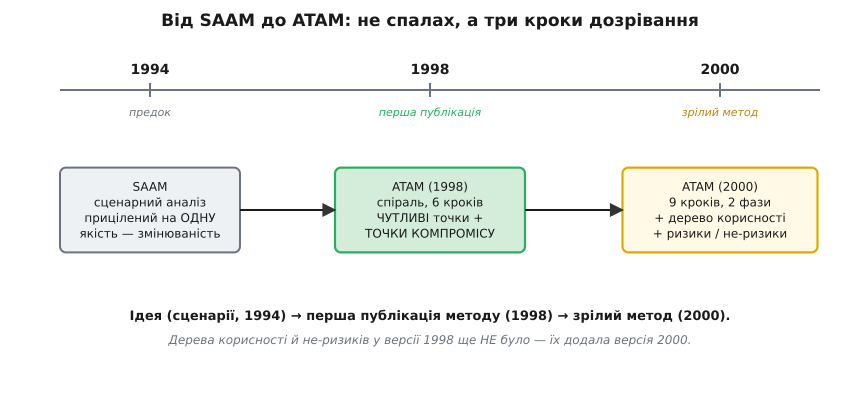

# 📜 Звідки взявся ATAM: історія методу, що навчив рахувати компроміси

Наприкінці 1990-х у програмній інженерії дозріла незручна правда: великі системи провалюються не тому, що хтось погано написав функцію, а тому, що **сама структура** системи не тягне тих якостей, яких від неї хочуть. Код бездоганний, а система повільна. Модулі чисті, а змінити нічого не можна без переписування половини. Причина сиділа рівнем вище за код — в архітектурі. І тут виявилося, що інженери **вміють** ретельно оцінювати код (тести, ревʼю, метрики покриття), але майже не вміють так само дисципліновано оцінювати архітектуру — до того, як за неї заплачено роками розробки.

Саме з цього незручного місця й народився метод, який два поняття зі статті-власниці — чутливу точку й точку компромісу — зробив серцевиною цілої процедури. Він зветься **ATAM** (англ. *Architecture Tradeoff Analysis Method* — «метод аналізу архітектурних компромісів»). Історія його — не про геніальний спалах однієї людини, а про те, як кілька фахівців із **різних** царин зійшлися й помітили, що їхні окремі способи оцінювати якості треба поєднати в один. Ця обставина — що метод зшито з різних експертиз — не деталь біографії, а прямо пояснює, **чому** ATAM влаштований саме так.

## Що бентежило: якість архітектури неможливо «протестувати»

Уяви типову ситуацію тих років. Команда спроєктувала систему керування — розписала компоненти, звʼязки, потоки даних. Красива діаграма. Питання: чи буде вона достатньо швидкою? Достатньо надійною? Чи легко її буде розширювати за пʼять років? Чесна відповідь тодішнього інженера — «побачимо, коли збудуємо». А будувати — це роки й мільйони. Помилка в архітектурі, знайдена після побудови, коштує катастрофічно дорого, бо вгризається в усе.

Спокуса була така: раз є каталоги **шаблонів проєктування** й **архітектурних стилів** — може, досить обрати «хороший для переносності» стиль, «хороший для змінюваності» шаблон, і все? Автори ATAM у своїй статті прямо назвали цю надію недостатньою. Ось їхня думка майже дослівно: проєктувальник обирає один шаблон, «бо він добрий для переносності», інший — «бо його легко змінювати», але **аналіз шаблонів не заходить глибше за це**; користувач шаблонів не знає, наскільки переносною, змінюваною чи стійкою буде архітектура, **поки її не збудовано**.

> 🔧 **Навіщо це.** Обрати «правильний» стиль зі списку — не оцінка, а ворожіння. Оцінка — це коли ти можеш **показати механізм**: ось цей вибір дає таку доступність за такою ціною, а ось тут дві якості зіштовхуються на одному елементі. ATAM саме про те, як дійти від ярликів «добре для X» до перевірних тверджень.

Друга, ще глибша халепа була в тому, що навіть коли інженери **вміли** аналізувати окрему якість, вони робили це **поодинці й нарізно**. Один фахівець рахував продуктивність. Інший — надійність. Третій — безпеку. Кожен у своєму кутку, своїм апаратом, своєю мовою. І ніхто не дивився на **стик**: на те, що рішення, яке тішить фахівця з продуктивності, руйнує роботу фахівця з безпеки, бо обидва тягнуть **той самий** архітектурний елемент у протилежні боки. Ці стики нікому не належали — і тому нікому не боліли, аж поки система не спотикалася об них у продакшені.

## Хто зійшовся: пʼять експертиз під одним дахом

Щоб зрозуміти ATAM, глянь на список авторів статті 1998 року — і на те, **чим** кожен займався. Це не формальність; це буквально пояснює конструкцію методу.

- **Рік Казман (Rick Kazman)** — той, хто вже кілька років будував **методи оцінювання архітектури** й зшивав докупи. Він же співавтор настільної книги галузі *Software Architecture in Practice*. Роль у команді — каркас методу, той, хто зводить окремі аналізи в єдину процедуру. (Пізніше — професор Гавайського університету, дослідник у SEI.)
- **Марк Кляйн (Mark Klein)** — фахівець із **аналізу реального часу й продуктивності**; співавтор *A Practitioner's Handbook for Real-Time Analysis* (1993). Він приніс до столу вміння рахувати, чи встигне система відповісти вчасно.
- **Маріо Барбаччі (Mario Barbacci)** — інженер **із інженерії якісних атрибутів** загалом, один із засновників самого SEI, дійсний член IEEE. Він — перуанець: народився в Лімі, здобув інженерну освіту в Національному інженерному університеті (Universidad Nacional de Ingeniería), а тоді став **першим з Перу** докторантом з інформатики в Карнеґі — Меллона. Його роль — узагальнена рамка якостей, поверх окремих аналізів.
- **Том Лонгстаф (Tom Longstaff)** і **Говард Ліпсон (Howard Lipson)** — обидва з **CERT**, підрозділу SEI з безпеки; дослідники **виживаності систем і захисту** (survivability, intrusion, insider threat). Вони внесли той кут, якого бракувало найчастіше: **безпеку** як повноправну якість, що теж змагається за архітектурні елементи.
- **Джеромі Каррʼєр (Jeromy Carriere)** — фахівець із **реконструкції та аналізу архітектури**; канадець, математик з Університету Ватерлоо. Згодом — головний архітектор у великих компаніях (eBay, Google, Datadog). Він приніс практику «як узагалі витягти й описати архітектуру, щоб було що аналізувати».

Тепер видно суть. Продуктивність (Кляйн), безпека й виживаність (Лонгстаф, Ліпсон), загальна інженерія якостей (Барбаччі), реконструкція архітектури (Каррʼєр) і метод-зшивач (Казман). **Кожен вмів оцінювати щось одне добре.** ATAM — це відповідь на питання «а що, якщо посадити їх усіх за один стіл і змусити дивитися не на свої окремі якості, а на те, де ці якості стикаються?». Метод буквально інституціоналізує ту нараду. Він не вигадав жодного нового аналізу продуктивності чи безпеки — він вигадав **процедуру, у якій окремі аналізи змушені зустрітися й посваритися по-чесному**.

*Статус доказовості: авторство, місце (SEI при Карнеґі — Меллона), склад команди й дата — усталений факт, зафіксований у самому технічному звіті CMU/SEI-98-TR-008 (липень 1998). Походження й фах кожного з авторів — за їхніми біографіями SEI/CERT та університетськими профілями; національність Барбаччі (Перу) — за його CV та некрологом. Тут немає імперського обрамлення: команда суто північноамериканська за місцем роботи, з перуанцем і канадцем серед авторів, і це варто називати точно, а не змазувати в «американську».*

## Попередник: SAAM, з якого все виросло

ATAM не зʼявився на порожньому місці. У нього був прямий предок — **SAAM** (англ. *Software Architecture Analysis Method* — «метод аналізу програмної архітектури»). Це важлива нитка, бо саме SAAM дав ту єдину ідею, на якій тримається все: **оцінювати архітектуру через сценарії**.

SAAM уперше зʼявився у статті 1994 року на 16-й Міжнародній конференції з програмної інженерії (ICSE), у Сорренто, — автори Рік Казман, Лен Басс (Len Bass), Ґреґорі Абовд (Gregory Abowd) і Майк Вебб (Mike Webb). Пізніше метод відшліфували у статті 1996 року в журналі *IEEE Software* («Scenario-Based Analysis of Software Architecture») — саме на неї, як `[Kazman 96]`, і посилається звіт ATAM 1998 року, коли називає свій родовід.

У чому була ідея SAAM? Замість того щоб питати абстрактно «чи хороша ця архітектура?», SAAM питає конкретно: **ось сценарій — витримає його система чи ні?** «Користувач додає новий тип звіту — скільки модулів доведеться змінити?» «Навантаження зросло вдесятеро — де вузьке місце?» Сценарій **операціоналізує** розмиту якість: перетворює «має бути змінюваним» на перевірну ситуацію з відповіддю. Це та сама механіка, що в статті-власниці описана як [сценарії атрибутів](topic:programming/attribute-scenarios) — стимул, контекст, вимірна відповідь.

Але в SAAM була стеля. Він народився, щоб аналізувати передусім **змінюваність** — одну якість. Він добре ловив «скільки коштує ось ця зміна», але не був заточений під те, щоб зіштовхувати **кілька** якостей і бачити, де вони конфліктують. Простіша структура, вужчий приціл. Автори ATAM це визнавали прямо: метод «виріс із роботи в SEI над архітектурним аналізом **окремих** якісних атрибутів» — почалося із SAAM для змінюваності, аналізу продуктивності (Кляйн, 1993), аналізу доступності й аналізу безпеки. Ключове слово — **окремих**. Кожен аналіз жив сам по собі.

ATAM — це крок, на якому окремі аналізи звели докупи й додали те, чого в SAAM не було: **явне полювання на конфлікти між якостями**. Ось як сама стаття формулює головну відмінність: це «принципова різниця між ATAM та іншими техніками аналізу — що він **явно** розглядає звʼязки між кількома атрибутами й дозволяє **принципово міркувати** про компроміси, які неминуче постають із цих звʼязків». Інші рамки, якщо взагалі зважали на звʼязки, робили це «неформально або на високому рівні абстракції». ATAM зробив конфлікт якостей **предметом методу**, а не побічним спостереженням.

## Ключова конструкція: чутливі точки й точки компромісу

Тут ми доходимо до того, що ATAM подарував галузі як інструмент мислення, — і що стаття-власниця бере як щоденну практику. Два поняття, які у звіті 1998 року введені точними означеннями. Варто прочитати їх майже дослівно, бо формулювання гарне.

**Чутлива точка** (англ. *sensitivity point*). Метод варіює архітектуру — «один чи кілька атрибутів архітектури змінюють», перебудовують під це моделі й дивляться на результат. І далі: «будь-які змодельовані величини, на які **істотно впливає** зміна архітектури, вважають чутливими точками». Простіше: чутлива точка — це місце, де **маленький поворот ручки дає велику зміну** в якійсь якості. Знайшов таку — знаєш, що тут треба бути обережним, бо система тут «нервова».

**Точка компромісу** (англ. *tradeoff point*). А тепер найтонше. Коли чутливі точки вже знайдено, точка компромісу — це «просто визначення архітектурних елементів, до яких чутливі **кілька** атрибутів **одночасно**». І приклад зі статті, який варто розкласти повільно, бо він ідеальний:

```
Продуктивність клієнт-серверної архітектури
  сильно чутлива до числа серверів     → більше серверів = швидше (у певному діапазоні)

Доступність тієї самої архітектури
  теж прямо залежить від числа серверів → більше серверів = доступніше

Безпека системи натомість
  чутлива ОБЕРНЕНО                      → більше серверів = більше точок атаки = менш безпечно

Отже, число серверів — це ТОЧКА КОМПРОМІСУ:
  один архітектурний елемент, до якого чутливі три різні якості,
  ще й тягнуться вони в РІЗНІ боки.
```

Остання фраза означення бʼє точно: точка компромісу — це елемент, «де архітектурні компроміси **будуть зроблені, свідомо чи несвідомо**». Ось у чому весь сенс. Компроміс на цій ручці **станеться** в будь-якому разі — питання лише, чи ти його побачив і назвав, чи він тихо стався за тебе, і ти дізнаєшся про нього, коли безпеку зламають через зайвий сервер. ATAM зробив ці місця **видимими об'єктами**, які на воркшопі виписують на дошку поіменно. Саме ці два поняття стаття-власниця й називає своєю серцевиною, застосовною без жодних воркшопів.

> 🔧 **Навіщо це.** Різниця між чутливою точкою й точкою компромісу — це різниця між «тут обережно» і «тут доведеться комусь відмовити». Чутливу точку можна акуратно налаштувати. Точку компромісу налаштувати «щоб усім було добре» **неможливо за визначенням** — будь-який рух комусь допомагає й комусь шкодить. Тому саме точки компромісу вимагають **рішення людини**, а не оптимізації машиною. Уміти їх упізнавати — половина роботи архітектора.

## Яким ATAM був у 1998-му: спіраль із шести кроків

Тут корисно розрізнити **ідею**, **першу публікацію** й **зрілий метод** — бо ATAM 1998 року й ATAM, який сьогодні викладають на курсах, це помітно різні речі, і плутати їх — типова помилка.


*Метод не спалахнув одномоментно: сценарну ідею дав SAAM (1994), перша публікація ATAM (1998) додала чутливі точки й точки компромісу, а зрілий вигляд — дерево корисності та ризики/не-ризики — метод узяв аж у 2000-му.*

Звіт 1998 року описує ATAM як **спіральну модель** проєктування (у дусі спіралі Боема). Кожен виток спіралі не будує систему, а поглиблює **розуміння** й уточнює архітектуру: аналіз дає результат → результат підказує зміну → зміна породжує нову, повнішу архітектуру → новий виток. І сам метод у тій статті — це **шість кроків**, не девʼять:

```
Крок 1 — Зібрати сценарії
         (як SAAM: операціоналізувати вимоги, звести стейкхолдерів до спільної мови)
Крок 2 — Зібрати вимоги / обмеження / середовище
         (атрибутні вимоги, у яких умовах система живе)
Крок 3 — Описати архітектурні подання (views)
         (кандидатні архітектури через ті елементи, що важать для кожної якості:
          реплікація й голосування — для надійності; черги й пріоритети — для продуктивності;
          файрволи — для безпеки; абстракція — для змінюваності)
Крок 4 — Проаналізувати кожну якість ОКРЕМО
         («відповідь за 60 мс у середньому»; «напрацювання на відмову 2.3 доби»)
Крок 5 — Знайти ЧУТЛИВІ точки
         (варіюємо архітектуру, дивимось, що сильно змінюється)
Крок 6 — Знайти ТОЧКИ КОМПРОМІСУ
         (елементи, до яких чутливі кілька атрибутів водночас)
```

Помічаєш логіку? Кроки 1–3 готують ґрунт: що система має робити, у яких умовах, якими архітектурами. Крок 4 — окремі аналізи (та сама «нарізна» експертиза, кожен фахівець у своєму кутку). А кроки 5–6 — це той **стик**, заради якого все й затівалося: спершу знайти нервові місця кожної якості, а тоді накласти їх одне на одне й побачити, де вони збігаються в одному елементі. Точка компромісу народжується буквально як **перетин чутливих точок різних якостей**. Це елегантно: складне поняття зведено до простої операції — знайди спільні елементи.

І прикметно, на чому автори це показували. Наскрізний приклад звіту 1998 року — **RTS** (remote temperature sensor), система, що вимірює температуру набору печей і шле показники операторові, а той може міняти частоту оновлень для кожної печі окремо. Її вбудували в клієнт-серверну схему (16 клієнтів — по одному на піч, сервер із аналого-цифровим перетворювачем) і аналізували на продуктивність, безпеку й доступність. Тобто вже перший розгорнутий приклад методу — це, по суті, **збір показників із давачів** у системі керування: рівно той клас задач, де компроміс «скільки серверів / скільки буферів / як часто оновлювати» відчувається на дотик.

## Яким ATAM став у 2000-му: девʼять кроків, дерево корисності, ризики

Через два роки той-таки SEI випустив дороблений метод — звіт CMU/SEI-2000-TR-004 «ATAM: Method for Architecture Evaluation» (серпень 2000), автори Рік Казман, Марк Кляйн і Пол Клементс (Paul Clements). Це і є той ATAM, який зазвичай мають на увазі сьогодні. І тут зʼявилося кілька речей, яких у версії 1998 року **не було зовсім** — це важливо, бо їх часто помилково приписують «оригінальному» ATAM.

**Дерево корисності (utility tree).** У звіті 1998 року цього поняття немає взагалі. У 2000-му воно стало окремим кроком і одним із головних артефактів. Ідея: побудувати дерево з коренем «Корисність» (Utility) — узагальнене «добро» системи, — яке гілками розкладається на конкретні якості (продуктивність, змінюваність, безпека…), а ті — на **конкретні перевірні сценарії** в листках, з позначками важливості й ризику. Дерево «допомагає **конкретизувати й упорядкувати** цілі за якістю» й задає, куди спрямувати увагу під час оцінювання. Це відповідь на реальну біду перших оцінювань: без такого дерева команда тонула в сотні однаково-важливих на вигляд вимог; дерево силою змушує сказати, що **справді** критичне, а що другорядне. Рух — згори вниз, від загального «добра» до конкретних сценаріїв.

**Ризики й не-ризики (risks and non-risks).** Теж новина 2000 року — у 1998-му терміна «не-ризик» немає. Означення варте того, щоб навести дослівно: «**Ризики** — це потенційно проблемні архітектурні рішення. **Не-ризики** — це хороші рішення, що спираються на припущення, які часто в архітектурі **неявні**. І те, і те слід зрозуміти й **явно записати**.» Друга частина тонша, ніж здається. Не-ризик — це не «тут усе гаразд, забули». Це «тут усе гаразд **за умови**, що ось це припущення справджується» — і саме припущення треба виписати, бо завтра воно може перестати справджуватися, і хороше рішення тихо стане ризиком. ATAM змушує вимовити навіть **добрі** рішення вголос — разом із фундаментом, на якому вони стоять.

Разом із цим версія 2000 року розгорнула метод у **девʼять кроків** (замість шести) і поділила його на **дві фази**: перша — з архітекторами й керівництвом, друга — з ширшим колом стейкхолдерів. Ось девʼятка:

```
Крок 1 — Представити ATAM
Крок 2 — Представити бізнес-драйвери
Крок 3 — Представити архітектуру
Крок 4 — Визначити архітектурні підходи (approaches)
Крок 5 — Побудувати дерево корисності якісних атрибутів   ← нове
Крок 6 — Проаналізувати архітектурні підходи
Крок 7 — Мозковий штурм і пріоритезація сценаріїв
Крок 8 — Знову проаналізувати архітектурні підходи (з ширшим колом)
Крок 9 — Представити результати
```

Наскрізний приклад теж змінився: у звіті 2000 року метод демонструють на **BCS** (Battlefield Control System — система керування боєм). Це вже не одненький давач температури, а велика оборонна система — знак того, що метод дозрів до промислового масштабу й церемонії на кілька днів воркшопів. Саме таким — важким, дводенним, зі стейкхолдерами й фасилітаторами — його й описано в статті-власниці; а полегшену версію для звичайної команди розбирає [ATAM-лайт](topic:programming/atam-lite).

*Статус доказовості: перехід від шестикрокової спіралі (1998) до девʼятикрокового методу з деревом корисності та ризиками/не-ризиками (2000) — усталений факт, читається прямо зі змісту й тексту обох технічних звітів SEI. Твердження «дерева корисності й не-ризиків у версії 1998 не було» я звіряв за самим текстом звіту 1998 року, де ці терміни відсутні. Приписувати дерево корисності «оригінальному ATAM 1998-го» — поширена, але хибна атрибуція.*

## Що з усього цього лишилося як спадок

Відступімо на крок і подивімося, що ATAM насправді змінив — бо мало який метод оцінювання пережив чверть століття, а цей викладають досі.

Перше й головне: він **дав словник**. До ATAM інженер міг відчувати, що «тут якийсь конфлікт», але не мав чим його назвати. «Чутлива точка» й «точка компромісу» — це не бюрократія, а **інструменти бачення**: коли в тебе є ім'я для явища, ти починаєш його помічати. Це та сама механіка, що з будь-яким терміном — назвав, і воно стало видимим. Стаття-власниця бере саме цей спадок і відриває його від громіздкого воркшопу: щоб шукати чутливі точки й точки компромісу у власному коді щодня, дозвіл SEI не потрібен.

Друге: він **узаконив, що компроміс — норма, а не провал**. Формулювання про рішення, які «будуть зроблені, свідомо чи несвідомо», зняло з архітектора тягар шукати неіснуюче «правильне» рішення. Робота — не в тому, щоб уникнути компромісу (це неможливо), а в тому, щоб зробити його **видимим і свідомим**. Це прямо резонує з практикою фіксувати такі рішення письмово — як [записи архітектурних рішень](topic:programming/architecture-decision-records), — щоб через роки причина вибору не загубилася.

Третє, тонше: ATAM показав, що оцінювати треба **до** побудови, поки зміна ще дешева. Уся спіраль 1998 року — про те, щоб крутити витки **на моделях і паперових архітектурах**, а не на збудованій системі. Це те саме мислення, що стоїть за грубими, «на серветці» прикидками зі статті-власниці: на етапі вибору структури точність зайва, важить **порядок величини** й **напрям конфлікту**, а не третій знак після коми.

І останнє, майже філософське. Історія ATAM — це історія про те, як **розрізнені експертизи змусили зустрітися**. Продуктивність, безпека, надійність, змінюваність жили в різних головах і різних відділах; метод посадив їх за один стіл і зробив предметом розмови не кожну якість окремо, а **місця їхнього зіткнення**. У цьому сенсі ATAM — не так техніка, як визнання простої істини: у складній системі жодна якість не існує сама по собі, і найважливіше відбувається **на стиках**, які поодинці не видно нікому. Побачити стик — і є вся суть.
