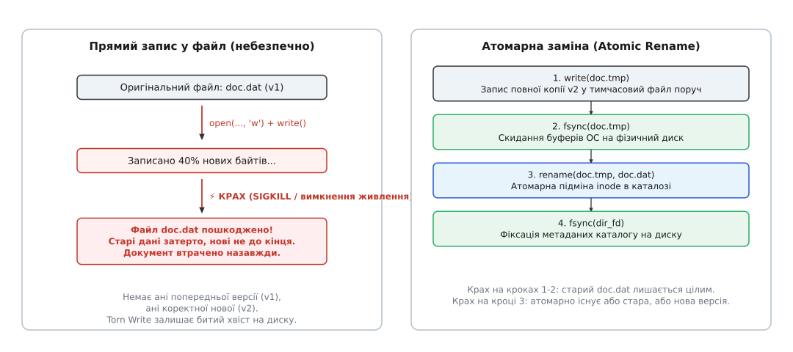

# 📋 Інтерфейси надійності сховищ: POSIX, Windows, Web OPFS та SQLite

Клієнтські застосунки функціонують у неоднорідних середовищах виконання — від нативних операційних систем (Linux, macOS, Windows) до пісочниць сучасних веббраузерів. Рівень гарантій збереження даних, поведінка системних буферів та атомарність операцій радикально відрізняються залежно від використовуваного інтерфейсу сховища.

Коли прикладний код записує байти на диск, він взаємодіє не з фізичним носієм, а з багаторівневою ієрархією кешів: буферами стандартної бібліотеки (`FILE*` у мові C або потоками `std::ofstream` у C++), сторінковим кешем ядра операційної системи (Page Cache), чергою команд контролера диска та внутрішньою енергозалежною пам'яттю DRAM самого накопичувача. Звичайний успішний виклик функції запису свідчить лише про те, що байти скопійовано в оперативну пам'ять ядра. Якщо живлення зникне за мить після цього, контролер накопичувача так і не отримає команди на запис у фізичні комірки, а файл на диску залишиться пустим або пошкодженим.

Нижче наведено структуровану специфікацію системних викликів, контрактів блокування, механізмів синхронізації та прагм надійності, що забезпечують захист від розірваних записів і гарантують повне відновлення після раптової зупинки процесу.

## 1. POSIX: Файлова система (Linux, macOS, BSD)

У стандарті POSIX атомарна заміна файлів і гарантований запис на фізичний носій спираються на комбінацію викликів `fsync`, `rename` та каталожних дескрипторів.


*Контракт заміни: створення тимчасового файлу, примусове скидання кешів через fsync, атомарний rename і фіксація метаданих каталогу.*

### Системні виклики та ідіоматичні обгортки

:::tabs
```c
#include <fcntl.h>
#include <unistd.h>
#include <sys/file.h>
#include <stdio.h>
#include <errno.h>

#if defined(__APPLE__)
#include <sys/fcntl.h>
#endif

/* 1. Створення унікального тимчасового файлу в тому ж каталозі */
int open_temporary_atomic(const char *path) {
    return open(path, O_WRONLY | O_CREAT | O_EXCL | O_CLOEXEC, 0644);
}

/* 2. Примусове скидання брудних сторінок сторінкового кешу на фізичний диск */
int sync_file_to_disk(int fd) {
#if defined(__APPLE__)
    /* На macOS звичайний fsync скидає лише в кеш накопичувача, F_FULLFSYNC — у флешкомірки */
    return fcntl(fd, F_FULLFSYNC);
#else
    return fsync(fd);
#endif
}

/* 3. Атомарна підміна запису в таблиці каталогу */
int atomic_replace_file(const char *temp_path, const char *target_path) {
    return rename(temp_path, target_path);
}

/* 4. Ексклюзивне блокування файлу від інших процесів */
int acquire_file_lease(int fd) {
    return flock(fd, LOCK_EX | LOCK_NB);
}
```
```cpp
#include <fcntl.h>
#include <unistd.h>
#include <sys/file.h>
#include <filesystem>
#include <string>
#include <system_error>
#include <memory>

#if defined(__APPLE__)
#include <sys/fcntl.h>
#endif

namespace fs = std::filesystem;

class PosixFileDescriptor {
public:
    explicit PosixFileDescriptor(int fd = -1) : fd_(fd) {}
    ~PosixFileDescriptor() {
        if (fd_ >= 0) {
            ::close(fd_);
        }
    }

    PosixFileDescriptor(const PosixFileDescriptor&) = delete;
    PosixFileDescriptor& operator=(const PosixFileDescriptor&) = delete;

    PosixFileDescriptor(PosixFileDescriptor&& other) noexcept : fd_(other.fd_) {
        other.fd_ = -1;
    }

    PosixFileDescriptor& operator=(PosixFileDescriptor&& other) noexcept {
        if (this != &other) {
            if (fd_ >= 0) ::close(fd_);
            fd_ = other.fd_;
            other.fd_ = -1;
        }
        return *this;
    }

    [[nodiscard]] int get() const noexcept { return fd_; }
    [[nodiscard]] bool is_valid() const noexcept { return fd_ >= 0; }

    void sync() {
        if (fd_ < 0) return;
#if defined(__APPLE__)
        if (::fcntl(fd_, F_FULLFSYNC) != 0) {
            throw std::system_error(errno, std::generic_category(), "F_FULLFSYNC failed");
        }
#else
        if (::fsync(fd_) != 0) {
            throw std::system_error(errno, std::generic_category(), "fsync failed");
        }
#endif
    }

    bool try_lock_exclusive() {
        return fd_ >= 0 && ::flock(fd_, LOCK_EX | LOCK_NB) == 0;
    }

private:
    int fd_{-1};
};

class PosixAtomicStorage {
public:
    static PosixFileDescriptor open_temp(const fs::path& temp_path) {
        int fd = ::open(temp_path.c_str(), O_WRONLY | O_CREAT | O_EXCL | O_CLOEXEC, 0644);
        if (fd < 0) {
            throw std::system_error(errno, std::generic_category(), "open O_EXCL failed");
        }
        return PosixFileDescriptor(fd);
    }

    static void commit_replace(const fs::path& temp_path, const fs::path& target_path) {
        if (::rename(temp_path.c_str(), target_path.c_str()) != 0) {
            throw std::system_error(errno, std::generic_category(), "rename failed");
        }

        // Фіксація запису в таблиці батьківського каталогу
        fs::path parent_dir = target_path.parent_path();
        if (parent_dir.empty()) parent_dir = ".";
        
        int dir_fd = ::open(parent_dir.c_str(), O_RDONLY | O_DIRECTORY | O_CLOEXEC);
        if (dir_fd >= 0) {
            PosixFileDescriptor dir_guard(dir_fd);
            dir_guard.sync();
        }
    }
};
```
:::

### Особливості та підводні камені синхронізації в POSIX

1. **Пастка macOS `fsync` та команда `F_FULLFSYNC`:** В операційній системі macOS (ядро XNU/Darwin) стандартний виклик `fsync()` передає дані зі сторінкового кешу в контролер диска, але **не надсилає команду скидання апаратного кешу накопичувача** (ATA/NVMe Flush Command). Якщо живлення вимкнеться після успішного завершення `fsync()`, дані в кеші SSD все одно зникнуть. Для гарантованого запису в енергонезалежні комірки на Apple-платформах обов'язково викликають `fcntl(fd, F_FULLFSYNC)`.
2. **Різниця між `fsync` та `fdatasync`:** Системний виклик `fdatasync()` скидає лише блоки вмісту файлу та розмір, пропускаючи несуттєві метадані (час останнього доступу `atime` або зміни `mtime`). Це зменшує кількість звернень до журналу файлової системи (ext4 journal) і підвищує швидкість роботи без втрати надійності.
3. **Бар'єри файлової системи (Barrier I/O):** Сучасні журнальовані файлові системи (ext4, XFS, Btrfs) використовують бар'єри запису. Виклик `fsync` ініціює операцію `FLUSH / FUA` (Force Unit Access), що гарантує строгий порядок фіксації транзакцій у журналі файлової системи до того, як оновляться вказівники на блоки.

### Матриця гарантій та помилок POSIX

| Операція | Гарантія атомарності | Поведінка при збої живлення | Типові коди помилок |
| :--- | :--- | :--- | :--- |
| `write(fd, buf, len)` | **Ні** (посторінковий запис у кеш ядра) | Розірваний запис (частина нових, частина старих байтів) | `ENOSPC`, `EIO`, `EINTR` |
| `fsync(fd)` | Завершується лише після підтвердження контролером накопичувача | Дані залишаються в безпеці на енергонезалежному диску | `EIO`, `EROFS`, `EINVAL` |
| `rename(tmp, target)` | **Так** (на рівні однієї файлової системи) | На диску залишається або стара, або нова версія | `EXDEV` (різні точки монтування), `EBUSY` |
| `fsync(dir_fd)` | Фіксація запису в каталозі | Запобігає втраті посилання на новий inode після рестарту | `EIO`, `EBADF` |

Прапорець `O_EXCL` гарантує, що застосунок створює свіжий, раніше не існуючий тимчасовий файл. Якщо інший потік чи процес згенерував таке саме ім'я, системний виклик миттєво відхилить операцію з кодом помилки `EEXIST`, захищаючи паралельні дані від перетирання.

> ⚠️ **Пастка `EXDEV`:** Виклик `rename()` гарантує атомарність лише в межах **однієї файлової системи** (одного блокового пристрою). Якщо тимчасовий файл створити в системній теці `/tmp` (яка часто змонтована як `tmpfs` у пам'яті), `rename()` поверне помилку `EXDEV` (Invalid cross-device link). Спроба емулювати перейменування через копіювання знищує атомарність. Тимчасовий файл завжди слід створювати поруч із цільовим файлом.

---

## 2. Windows Win32 API

Операційна система Windows надає транзакційні виклики керування файлами через інтерфейс `Kernel32.dll`.

### Сигнатури та ідіоматичні обгортки Win32 API

:::tabs
```c
#include <windows.h>

/* 1. Відкриття файлу з контролем спільного доступу */
HANDLE create_file_writer(LPCWSTR path) {
    return CreateFileW(
        path,
        GENERIC_READ | GENERIC_WRITE,
        FILE_SHARE_READ,                 /* Заборона іншим процесам писати у файл */
        NULL,
        CREATE_ALWAYS,
        FILE_ATTRIBUTE_NORMAL,
        NULL
    );
}

/* 2. Скидання системного буфера на фізичний диск */
BOOL sync_windows_buffers(HANDLE hFile) {
    return FlushFileBuffers(hFile);
}

/* 3. Атомарна заміна цільового файлу */
BOOL replace_file_atomic(LPCWSTR target_path, LPCWSTR temp_path) {
    return ReplaceFileW(
        target_path,
        temp_path,
        NULL,
        REPLACEFILE_IGNORE_MERGE_ERRORS,
        NULL,
        NULL
    );
}

/* 4. Ексклюзивне блокування діапазону байтів */
BOOL lock_windows_file(HANDLE hFile) {
    OVERLAPPED ov = {0};
    return LockFileEx(
        hFile,
        LOCKFILE_EXCLUSIVE_LOCK | LOCKFILE_FAIL_IMMEDIATELY,
        0,
        MAXDWORD,
        MAXDWORD,
        &ov
    );
}
```
```cpp
#include <windows.h>
#include <string>
#include <system_error>
#include <filesystem>

namespace fs = std::filesystem;

class Win32Handle {
public:
    explicit Win32Handle(HANDLE handle = INVALID_HANDLE_VALUE) : handle_(handle) {}
    ~Win32Handle() {
        if (handle_ != INVALID_HANDLE_VALUE) {
            CloseHandle(handle_);
        }
    }

    Win32Handle(const Win32Handle&) = delete;
    Win32Handle& operator=(const Win32Handle&) = delete;

    Win32Handle(Win32Handle&& other) noexcept : handle_(other.handle_) {
        other.handle_ = INVALID_HANDLE_VALUE;
    }

    Win32Handle& operator=(Win32Handle&& other) noexcept {
        if (this != &other) {
            if (handle_ != INVALID_HANDLE_VALUE) CloseHandle(handle_);
            handle_ = other.handle_;
            other.handle_ = INVALID_HANDLE_VALUE;
        }
        return *this;
    }

    [[nodiscard]] HANDLE get() const noexcept { return handle_; }
    [[nodiscard]] bool is_valid() const noexcept { return handle_ != INVALID_HANDLE_VALUE; }

    void flush() {
        if (handle_ != INVALID_HANDLE_VALUE && !FlushFileBuffers(handle_)) {
            throw std::system_error(GetLastError(), std::system_category(), "FlushFileBuffers failed");
        }
    }

private:
    HANDLE handle_{INVALID_HANDLE_VALUE};
};

class Win32AtomicStorage {
public:
    static Win32Handle open_exclusive_writer(const fs::path& path) {
        HANDLE h = CreateFileW(
            path.c_str(),
            GENERIC_READ | GENERIC_WRITE,
            FILE_SHARE_READ,
            nullptr,
            CREATE_ALWAYS,
            FILE_ATTRIBUTE_NORMAL,
            nullptr
        );
        if (h == INVALID_HANDLE_VALUE) {
            throw std::system_error(GetLastError(), std::system_category(), "CreateFileW failed");
        }
        return Win32Handle(h);
    }

    static void commit_replace(const fs::path& temp_path, const fs::path& target_path) {
        if (!ReplaceFileW(
                target_path.c_str(),
                temp_path.c_str(),
                nullptr,
                REPLACEFILE_IGNORE_MERGE_ERRORS,
                nullptr,
                nullptr)) {
            // Якщо цільовий файл ще не існував, використовуємо MoveFileExW
            DWORD err = GetLastError();
            if (err == ERROR_FILE_NOT_FOUND) {
                if (!MoveFileExW(temp_path.c_str(), target_path.c_str(), MOVEFILE_REPLACE_EXISTING)) {
                    throw std::system_error(GetLastError(), std::system_category(), "MoveFileExW failed");
                }
                return;
            }
            throw std::system_error(err, std::system_category(), "ReplaceFileW failed");
        }
    }
};
```
:::

### Особливості семантики Windows

- `FILE_FLAG_WRITE_THROUGH`: Інструктує драйвер файлової системи записувати дані без проміжного кешування, безпосередньо відправляючи команди накопичувачу.
- `ReplaceFileW`: Забезпечує атомарне перенесення метаданих (зокрема потоків ACL і дескрипторів безпеки) зі старого файлу на новий. Якщо інший процес тримає файл відкритим без прапорця `FILE_SHARE_DELETE`, функція повертає помилку `ERROR_SHARING_VIOLATION` (`32`).
- `MoveFileExW` із прапорцем `MOVEFILE_REPLACE_EXISTING`: Використовується як резервний шлях, коли цільовий файл створюється вперше і `ReplaceFileW` повертає помилку відсутності файлу.

---

## 3. Web Platform: Origin Private File System (OPFS) та Web Locks

У сучасному вебсередовищі браузерні клієнти мають доступ до приватної високопродуктивної файлової системи (OPFS) всередині Dedicated Web Workers, а також до API координації вкладок.

### Інтерфейс `FileSystemSyncAccessHandle` (OPFS)

```typescript
// Отримання дескриптора синхронного доступу всередині Dedicated Worker
const root: FileSystemDirectoryHandle = await navigator.storage.getDirectory();
const fileHandle = await root.getFileHandle("document.wal", { create: true });
const accessHandle: FileSystemSyncAccessHandle = await fileHandle.createSyncAccessHandle();

// Синхронний запис порції даних у заданий зсув
const bytesWritten: number = accessHandle.write(buffer, { at: offset });

// Примусова синхронізація з енергонезалежним носієм (аналог fsync)
accessHandle.flush();

// Атомарна зміна розміру (обрізання журналу після чекпойнта)
accessHandle.truncate(0);

// Закриття ексклюзивного доступу
accessHandle.close();
```

### Координація вкладок через Web Locks API

Для запобігання конфліктам кількох відкритих вкладок браузера над одним документом використовується `navigator.locks`:

```typescript
// Запит ексклюзивного права на модифікацію документа
await navigator.locks.request(
  `doc-lock-${documentId}`,
  { mode: "exclusive", ifAvailable: true },
  async (lock) => {
    if (!lock) {
      // Інша вкладка вже редагує документ
      console.warn("Документ заблоковано іншим сеансом. Перехід у режим Read-Only.");
      return;
    }
    // Ексклюзивне володіння: виконуємо запис у WAL
    await runDocumentEventLoop();
  }
);
```

### Рівні надійності IndexedDB (`durability`)

При роботі з транзакціями `IndexedDB` розробник явно вказує вимоги до довговічності:

```typescript
const tx = db.transaction(["mutations"], "readwrite", { durability: "strict" });
// "strict"  -> ОС гарантує скидання буферів на диск (fsync) до події oncomplete (безпечно, але повільніше)
// "relaxed" -> Дозволяє відкладене скидання (високий FPS, ризик втрати останніх операцій при краху ОС)
```

---

## 4. SQLite Client WAL: Прагми конфігурації

Коли як вбудоване клієнтське сховище використовується бібліотека SQLite, поведінка відновлення після збоїв налаштовується набором директив `PRAGMA`.

У класичному режимі відкатного журналу (`journal_mode = DELETE | TRUNCATE | PERSIST`) кожен запис вимагає подвійної синхронізації `fsync`: спочатку оригінальні сторінки копіюються в журнал відкату, а після фіксації сам журнал видаляється або обнуляється. Це блокує паралельних читачів на весь час запису.

Перехід на режим `journal_mode = WAL` змінює парадигму:
1. Записи транзакцій послідовно дописуються у файл `db-wal`.
2. Читачі використовують індекс спільної пам'яті `db-shm` (Shared Memory), читаючи свіжі версії сторінок із журналу або старі з основної бази.
3. Читання й запис більше ніколи не блокують одне одного.

```sql
-- 1. Увімкнення Write-Ahead Logging замість класичного rollback-журналу
PRAGMA journal_mode = WAL;

-- 2. Рівень синхронізації з диском
-- FULL (2): fsync після кожної транзакції (повний захист від раптового знеструмлення)
-- NORMAL (1): fsync лише при контрольних точках (стійкість до краху процесу застосунку)
-- OFF (0): повна відсутність синхронізації (високий ризик пошкодження)
PRAGMA synchronous = NORMAL;

-- 3. Автоматичний поріг чекпойнта у сторінках (за замовчуванням 1000 сторінок = ~4 МБ)
PRAGMA wal_autocheckpoint = 1000;

-- 4. Час очікування при блокуванні іншим процесом (у мілісекундах)
PRAGMA busy_timeout = 5000;

-- 5. Ексклюзивний режим блокування для запобігання доступу сторонніх процесів
PRAGMA locking_mode = EXCLUSIVE;
```

У режимі `journal_mode = WAL` директива `PRAGMA synchronous = NORMAL` забезпечує відмінний компроміс: навіть у разі падіння операційної системи сама база даних SQLite не може бути пошкоджена. Єдиний ризик — втрата останніх транзакцій, які ще не закріпилися контрольною точкою, тоді як у класичному режимі `NORMAL` загрожує повною руйнацією B-дерева.

### Зведена таблиця відповідності механізмів між платформами

| Концепція | POSIX | Windows Win32 | Web Platform | SQLite |
| :--- | :--- | :--- | :--- | :--- |
| **Ексклюзивний доступ** | `flock(fd, LOCK_EX)` | `LockFileEx` | `navigator.locks` | `locking_mode = EXCLUSIVE` |
| **Скидання буферів (Flush)**| `fsync(fd)` / `F_FULLFSYNC` | `FlushFileBuffers` | `accessHandle.flush()` | `PRAGMA synchronous = FULL` |
| **Атомарна заміна файлу** | `rename(tmp, target)` | `ReplaceFileW` | Перейменування в OPFS | Атомарний чекпойнт WAL |
| **Обрізання журналу** | `ftruncate(fd, 0)` | `SetEndOfFile` | `accessHandle.truncate(0)` | `PRAGMA wal_checkpoint(TRUNCATE)` |

Вибір конкретного інтерфейсу визначається цілями продуктивності: настільні застосунки з прямим доступом до файлової системи обирають двійковий WAL із системними викликами `open/fsync/rename`, тоді як складні клієнтські реляційні моделі виграють від готового рушія SQLite WAL. У вебсередовищі стандартним вибором стає поєднання OPFS `SyncAccessHandle` у фоновому воркері для швидких операцій та `IndexedDB` із суворою транзакційністю для збереження метаданих.
