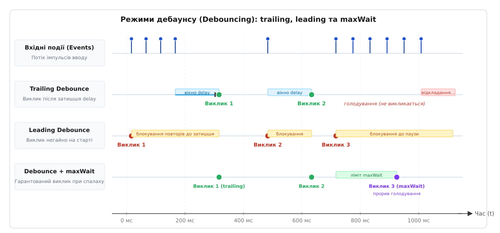
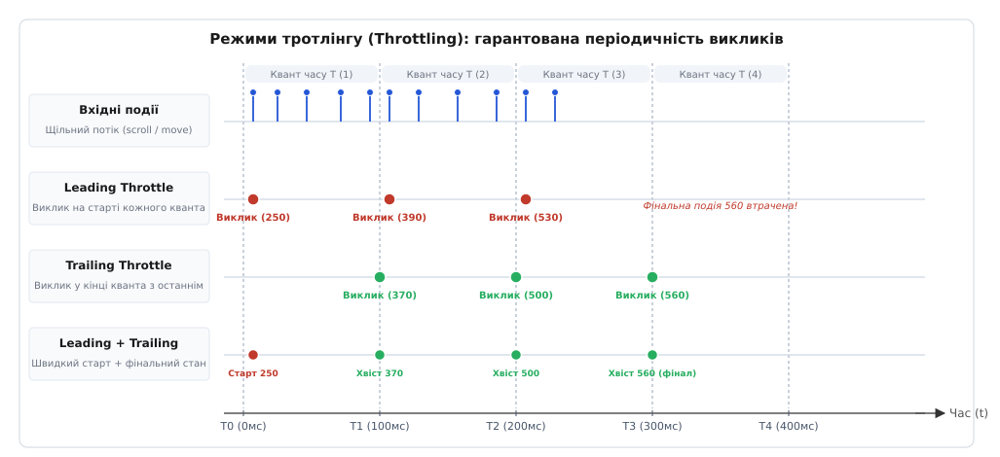
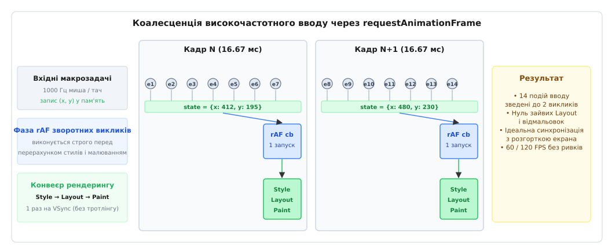
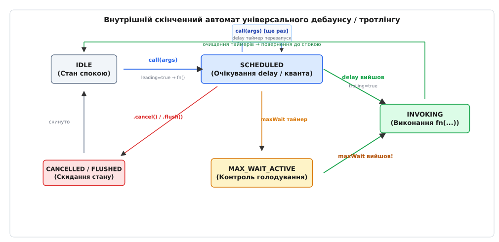

# Дебаунс і тротлінг: як проріджувати потік подій

<preknowlist>
- [Цикл подій](book:programming/event-loop) — потік інтерфейсу по черзі вибирає повідомлення з черги й виконує обробники; доки обробник не завершився, цикл стоїть і не може малювати новий кадр.
- [Розвантаження потоку інтерфейсу](book:programming/ui-thread-offloading) — кадр графічного інтерфейсу на частоті 60 Гц має жорсткий термін у 16.67 мс, а перевищення бюджету коду призводить до випадання кадрів і візуальних ривків.
- [Пороги часу відгуку інтерфейсу](book:programming/ui-response-time-limits) — відгук на дію користувача до 100 мс сприймається як миттєвий, до 1 с зберігає безперервність мислення, а затримка понад 1 с руйнує фокус уваги.
- [Асинхронні моделі та проміси](book:programming/async-await) — асинхронні операції повертають керування в цикл подій і передають обчислені результати через зворотні виклики на наступних обертах.
</preknowlist>

Користувач рухає сучасну ігрову мишу з частотою опитування 1000 Гц по сторінці з розгалуженою таблицею даних. Контролер USB щосекунди надсилає в операційну систему тисячу апаратних переривань, які перетворюються на тисячу повідомлень `mousemove` у черзі вікна. Якщо веб-застосунок підвішує на цю подію наївний обробник, що вимірює координати вузлів через `getBoundingClientRect()` та змінює позицію підказки, кожен рух курсора спричиняє примусовий синхронний перерахунок макета сторінки. На складному дереві DOM один такий перерахунок займає близько 3–5 мілісекунд.

Тисяча подій, кожна з яких вимагає чотирьох мілісекунд процесорного часу, створюють чотири секунди роботи на кожну секунду реального часу. Потік інтерфейсу виявляється перевантаженим на 400%: частота відмальовки падає з шістдесяти кадрів на секунду до двох, інтерфейс перестає відповідати на клавіатуру, а черга вводу переповнюється застарілими подіями.

Розгадка цієї проблеми криється у фундаментальній невідповідності між аналоговою природою фізичного світу та дискретним бюджетом обчислювальних систем.

## Неперервний світ датчиків проти дискретного бюджету кадру

Фізичні пристрої введення — оптичні сенсори мишей, ємнісні сенсорні екрани смартфонів, гіроскопи, ручки масштабування вікон операційної системи, а також мережеві сокети реального часу — генерують потік сигналів із частотою від 60 до 1000 імпульсів на секунду. Користувач сприймає свій рух як неперервний жест, а сенсор оцифровує кожен мікроскопічний зсув координати.

Проте система відображення працює за суворим дискретним розкладом. Графічний дисплей оновлює зображення фіксованими часовими квантами:

```
60 Гц   →  1000 ÷ 60  = 16.67 мс на кадр
120 Гц  →  1000 ÷ 120 =  8.33 мс на кадр
144 Гц  →  1000 ÷ 144 =  6.94 мс на кадр
```

Око людини не здатне розрізнити проміжні координати курсора, які виникли й зникли всередині одного шістнадцятимілісекундного інтервалу між оновленнями пікселів монітора. Якщо між двома послідовними кадрами розгортки надійшло двадцять подій `pointermove`, виконання важких обчислень або маніпуляцій із деревом DOM для перших дев'ятнадцяти подій є марною тратою ресурсів процесора. Їхній результат буде перезаписаний двадцятим значенням ще до того, як відеокарта сформує вихідний сигнал для монітора.

Щоб зрозуміти, чому часті виклики обробників настільки руйнівні для продуктивності, необхідно поглянути на конвеєр рендерингу сучасного браузера (Rendering Pipeline):

```
Подія вводу (Task) → Microtasks → requestAnimationFrame →
→ Recalculate Styles → Layout (Reflow) → Paint → Composite
```

У нормальному режимі браузер групує всі зміни стилів і виконує перерахунок геометрії елементів (Layout) та малювання (Paint) **один раз на кадр**, безпосередньо перед передачею готових піксельних шарів графічному компонувачу (Compositor).

Проте коли обробник події одночасно читає геометричні параметри елемента (наприклад, `element.offsetWidth`, `element.scrollTop` або викликає `window.getComputedStyle()`) і записує нові стилі (`element.style.left = ...`), виникає ефект **примусового синхронного перерахунку макета (Layout Thrashing)**. Рушій JavaScript змушений негайно зупинити виконання коду, перерахувати геометрію всього піддерева DOM і лише після цього повернути точне числове значення. Якщо такий цикл «запис-читання» повторюється сотні разів на секунду, конвеєр рендерингу перетворюється на вузьке місце системи.

Аналогічна проблема виникає під час набору тексту в пошуковому рядку. Людина друкує зі швидкістю 5–10 символів на секунду. Якщо на кожне натискання клавіші відправляти асинхронний мережевий запит на сервер, пошуковий бекенд отримає шквал проміжних запитів («к», «ки», «киї»), більшість з яких втратить актуальність раніше, ніж сервер встигне звернутися до індексу бази даних.

Виникає необхідність узгодження швидкостей: перетворення високочастотного неперервного потоку вхідних подій на дискретну послідовність викликів, яка відповідає пропускній здатності процесора, кадрової розгортки та мережі. Цю задачу вирішують дві фундаментальні архітектурні техніки: **дебаунс (усунення брязкоту)** та **тротлінг (дроселювання частоти)**.

## Дебаунс: очікування стабільності та затишшя

Концепція дебаунсу прийшла в програмування з класичної електротехніки та телеграфії, де пружні металеві пластини вимикачів під час замикання підстрибували протягом кількох мілісекунд, генеруючи серію хибних імпульсів напруги. [Детальний історичний розвиток цієї механіки від реле Едісона до перших графічних маніпуляторів описано у вставці 📜 Як брязкіт контактів у телеграфі породив дебаунс](book:programming/debouncing-throttling/hist-contact-bounce.md).

Сутність дебаунсу полягає у простому правилі: **якщо події надходять пачкою з короткими інтервалами, не робити нічого, доки потік не зупиниться на певний гарантований час затишшя**.

Дебаунс розглядає серію швидких подій як єдину незавершену дію користувача. Залежно від того, в який момент серії має відбутися реакція системи, розрізняють три режими роботи алгоритму.

### 1. Задній фронт (Trailing Debounce)

У режимі заднього фронту цільова функція викликається лише тоді, коли після останньої зареєстрованої події минув інтервал затишшя тривалістю `wait` мілісекунд.

Алгоритм працює як таймер зі зворотним відліком, який перезаводиться на кожній новій події:

```
Подія 1 (t=0)   → запустити таймер на 300 мс
Подія 2 (t=100) → скасувати старий таймер, запустити новий на 300 мс
Подія 3 (t=220) → скасувати старий таймер, запустити новий на 300 мс
Пауза (тиша)    → таймер добігає кінця (t=520 мс) → ВИКОНАТИ ФУНКЦІЮ
```

Цей режим є стандартом для автодоповнення пошукових запитів, живої фільтрації великих списків та валідації полів форм. Поки користувач безперервно натискає клавіші, система не турбує сервер і не витрачає ресурси на рендеринг проміжних результатів. Щойно пальці зупиняються на 300 мс, система вважає введення завершеним і виконує пошук для фінального набраного тексту.

### 2. Передній фронт (Leading Debounce / Immediate)

У режимі переднього фронту реакція відбувається в протилежній фазі: цільова функція викликається **негайно на першу ж подію** вхідної серії, після чого алгоритм вмикає блокування і відкидає всі наступні виклики доти, доки не настане вікно тиші тривалістю `wait`.

```
Подія 1 (t=0)   → НЕГАЙНО ВИКОНАТИ ФУНКЦІЮ, заблокувати повтори на 300 мс
Подія 2 (t=100) → ігнорувати, оновити таймер затишшя
Подія 3 (t=220) → ігнорувати, оновити таймер затишшя
Пауза (тиша)    → таймер добігає кінця (t=520 мс) → розблокувати систему
```

Leading debounce незамінний для запобігання випадковому подвійному надсиланню даних. Класичний приклад — кнопка «Оплатити замовлення» або «Надіслати коментар». Користувач із повільним інтернетом або тремтячими пальцями може клацнути мишею тричі за пів секунди. Перший клік повинен спрацювати миттєво, щоб користувач не відчував затримки інтерфейсу, а другий і третій кліки мають бути проігноровані, щоб платіжний шлюз не списав кошти повторно.

### 3. Захист від голодування: параметр `maxWait`

У класичного trailing debounce є прихований дефект поведінки — загроза нескінченного відкладання (голодування / starvation).

Уявімо користувача, який швидко набирає довгий текст у формі з автозбереженням документа кожні 1000 мс. Якщо інтервал між натисканнями клавіш становить 200 мс, таймер скидатиметься на кожній літері. Якщо користувач безперервно друкує протягом двох хвилин, інтервал затишшя в 1000 мс не настане жодного разу. Усі ці дві хвилини документ перебуватиме в пам'яті браузера й не збережеться на сервер. Якщо в цей момент станеться збій вкладки або вимкнеться живлення комп'ютера, користувач втратить усю набрану роботу.

Для усунення цієї вразливості в промислових реалізаціях використовують параметр `maxWait` — максимальний час, який функція має право чекати від моменту першого виклику. Навіть якщо потік подій не переривається ні на мілісекунду, досягнення порогу `maxWait` примусово запускає виконання функції та скидає часовий лічильник першого виклику.



*Три режими дебаунсу на єдиній осі часу. Trailing чекає паузи після останнього спалаху, Leading спрацьовує на першу подію та блокує повтори, а maxWait гарантує примусовий виклик під час безперервного потоку вводу.*

## Тротлінг: примусове квантування частоти

Якщо дебаунс чекає зупинки подій, то тротлінг вирішує іншу задачу: **гарантувати, що дія виконується регулярно, але не частіше ніж один раз за фіксований квант часу `T`**.

Слово «тротлінг» походить від англійського *throttle* — дросельна заслінка у двигунах, яка регулює потік пального чи пари, обмежуючи максимальну швидкість обертання вала незалежно від тиску в магістралі.

Тротлінг застосовують там, де потік подій триває довго, а проміжний стан системи має постійно оновлюватися на екрані. Головні сфери використання:

- **Прокручування сторінки (`scroll`)**: індикатор прогресу читання статті (scroll spy) повинен плавно рухатися слідом за рухом пальця, а не чекати повної зупинки прокрутки внизу сторінки.
- **Нескінченні стрічки (Infinite Scroll)**: підвантаження нової порції карток має ініціюватися завчасно, коли користувач наблизився до нижнього краю на 500 пікселів, а не тоді, коли він уже вперся в кінець сторінки й зупинився.
- **Зміна розміру вікна (`resize`)**: перерахунок позицій колонок адаптивної сітки повинен відбуватися під час руху рамки вікна, забезпечуючи плавний відгук макета.

### Фази тротлінгу: Leading та Trailing

Як і дебаунс, тротлінг підтримує конфігурацію переднього та заднього фронтів:

```
Квант часу [0 .. T]:
Leading  (true)  → виконати fn() на старті кванта (t=0)
Проміжні події  → запам'ятати останні аргументи, не викликати fn()
Trailing (true)  → виконати fn() у кінці кванта (t=T) з останніми даними
```

Якщо увімкнено лише `leading: true`, функція викликається негайно на першу подію, а всі наступні події всередині інтервалу `T` відкидаються. Це призводить до небезпечного крайового випадку: якщо користувач припинив скролити на позначці `t = 0.8 · T`, функція не зафіксує фінальне положення сторінки.

Саме тому промисловий стандарт тротлінгу вимагає одночасного ввімкнення обох прапорців (`leading: true, trailing: true`). Це забезпечує миттєвий відгук на перший дотик та математичну гарантію того, що після зупинки руху система обов'язково виконає фінальний виклик із найостаннішими координатами.



*Квантування часу при тротлінгу. Комбінований режим Leading + Trailing забезпечує швидкий початковий відгук на початку кожного інтервалу та гарантує виконання фінального стану наприкінці руху.*

### Покрокове простеження роботи тротлінгу

Розглянемо покроковий числовий приклад роботи обмежувача `throttle(updateUI, 100, { leading: true, trailing: true })` під час серії подій скролу:

```
t = 0 мс:   Подія e0 (pos=10px)  → timerId = null → ВИКОНАТИ updateUI(100px)
                                    lastInvokeTime = 0, запуск таймера на 100 мс
t = 25 мс:  Подія e1 (pos=150px) → зберегти lastArgs = [150]
t = 70 мс:  Подія e2 (pos=220px) → зберегти lastArgs = [220]
t = 100 мс: Тік таймера          → минуло 100 мс → ВИКОНАТИ updateUI(220px)
                                    lastInvokeTime = 100, запуск таймера на 100 мс
t = 130 мс: Подія e3 (pos=310px) → зберегти lastArgs = [310]
t = 160 мс: Рух зупинився        → нових подій немає, lastArgs = [310]
t = 200 мс: Тік таймера          → минуло 100 мс → ВИКОНАТИ updateUI(310px)
                                    lastArgs = null, timerId = null (стан спокою)
```

У наведеному сценарії чотири події зведені до трьох точних викликів. Перший виклик спрацював миттєво при `t = 0`, другий передав проміжну позицію `pos=220px` на межі першого кванта, а третій зафіксував фінальну зупинку на `pos=310px`, коли рух користувача повністю припинився.

### Тротлінг проти Дебаунсу з `maxWait`: тонка межа

Розробники часто плутають тротлінг із комбінацією `debounce + maxWait`, оскільки обидва механізми обмежують максимальну паузу між викликами. Проте їхня поведінка принципово відрізняється під час нестабільного потоку подій:

```
Тротлінг:
Події:   ••  ••  ••  ••  (з невеликими паузами)
Виклики: |       |       |       (строго періодичні кванти T, 2T, 3T)

Дебаунс + maxWait:
Події:   ••  ••  ••  ••  (паузи перевищують wait)
Виклики:   |   |   |   | (виклики прив'язані до пауз затишшя wait)
```

Тротлінг працює за жорстким метрономом: його інтервали фіксовані в часі. Дебаунс із `maxWait` надає абсолютний пріоритет паузам затишшя `wait`, і лише коли пауз немає взагалі, звертається до ліміту `maxWait`.

## Рушії реалізації: макрозадачні таймери проти кадрової розгортки

На практиці для реалізації обох патернів у середовищі браузера та Node.js застосовують два принципово різні механізми таймінгу: таймери черги макрозадач (`setTimeout`) та системні виклики кадрової синхронізації (`requestAnimationFrame`).

### Таймери `setTimeout`: властивості та обмеження

Більшість класичних бібліотечних реалізацій побудована навколо системних викликів `setTimeout` та `clearTimeout`. Таймер реєструється в середовищі виконання, яке поміщає колбек у чергу макрозадач після завершення заданого проміжку часу.

Цей підхід універсальний і працює як у браузері, так і на сервері в Node.js чи Deno. Проте для графічного інтерфейсу він має три суттєві обмеження:

1. **Мінімальний поріг затискання (Timer Clamping).** Згідно зі специфікацією HTML Living Standard, якщо глибина вкладеності викликів `setTimeout` перевищує 5, браузер примусово встановлює мінімальну затримку не менше 4 мс.
2. **Тротлінг фонових вкладок.** Сучасні браузери (Chromium, WebKit, Gecko) жорстко обмежують частоту спрацьовування `setTimeout` у неактивних фонових вкладках до одного разу на секунду (1000 мс) для економії заряду батареї.
3. **Кадровий джиттер (Фазовий зсув VSync).** Таймер макрозадач нічого не знає про те, коли саме екран почне відмальовувати наступний кадр. Якщо таймер із періодом 16 мс спрацює всередині фази розрахунку стилів (Recalculate Style), внесена ним зміна DOM буде відкладена браузером до наступного кадру, що створить візуальний ривок анімації.

### Рушій `requestAnimationFrame`: ідеальне проріджування рендерингу

Для будь-яких задач, результат яких полягає у безпосередній зміні DOM, трансформації CSS-стилів (`transform: translate3d`) або малюванні на полотні Canvas, використання `setTimeout` є архітектурною помилкою.

Браузер надає спеціалізований API — `requestAnimationFrame` (rAF). Колбеки, зареєстровані через rAF, виконуються в головному потоці **строго перед початком розрахунку стилів, розкладки (Layout) та композиції кадру**.



*Коалесценція високочастотного вводу в циклі рендерингу. Події від миші з частотою 1000 Гц записують останні координати в буфер змінних, а rAF виконує оновлення макета строго один раз за кадр перед відмальовкою.*

Патерн `rafThrottle` реалізує коалесценцію подій (злиття): якщо між двома кадрами розгортки надходить 20 подій `pointermove`, обробник події просто записує останні координати `(x, y)` у змінні стану. Прапорець запланованого кадру гарантує, що `requestAnimationFrame` буде викликано рівно один раз. На фазі VSync браузер бере найсвіжіші координати з буфера, застосовує стилі й відмальовує кадр без жодного зайвого перерахунку макета.

Додаткова перевага rAF полягає в автоматичній оптимізації фонових вкладок: коли користувач перемикається на іншу вкладку браузера, виклики `requestAnimationFrame` повністю зупиняються на рівні рушія, автоматично зводячи навантаження на процесор до абсолютного нуля.

## Архітектура застосування за сценаріями інтерфейсу

Вибір між дебаунсом, тротлінгом та їхніми варіаціями диктується тим, яка підсистема є кінцевим споживачем результату та як людина сприймає інтерактивність.

```
Сценарій інтерфейсу               Оптимальний патерн           Типовий інтервал
─────────────────────────────────────────────────────────────────────────────
Пошуковий рядок (мережевий I/O)    Trailing Debounce + Abort    250 – 350 мс
Кнопка транзакції (подвійний клік) Leading Debounce             500 – 1000 мс
Автозбереження чернетки           Debounce + maxWait           1000 мс / 5000 мс
Нескінченне підвантаження списку   Leading + Trailing Throttle  100 – 200 мс
Перетягування (Drag-and-Drop)      rafThrottle (VSync)          1 кадр (16.6 мс)
Зміна розміру вікна (графіки)     Trailing Debounce            150 – 250 мс
```

Розглянемо ключові сценарії докладно.

### Сценарій 1: Автодоповнення пошуку та боротьба з перегонами відповідей

Під час реалізації живого пошуку (Live Search) одного лише дебаунсу недостатньо. Дебаунс усуває шквал запитів, але не контролює час їхнього виконання мережею.

Якщо користувач набрав «львів», почекав 300 мс (відправився запит №1), а потім додав літеру «і» — «львові» (через 300 мс відправився запит №2), у мережі опиняються два паралельні HTTP-з'єднання. Сервер може обробити запит №2 швидше, ніж запит №1. Якщо відповідь на запит №1 прийде останньою, наївний інтерфейс відобразить на екрані результати для слова «львів», хоча в рядку пошуку написано «львові».

Правильна клієнтська архітектура об'єднує trailing debounce із механізмом скасування мережевих запитів `AbortController`:

:::tabs
```ts
class AutocompleteController {
  private abortController: AbortController | null = null;

  // Дебаунс на 300 мс для запобігання зайвим мережевим викликам
  public onInputChanged = debounce(async (query: string) => {
    // Скасовуємо попередній HTTP-запит, якщо він ще не завершився
    if (this.abortController) {
      this.abortController.abort();
    }
    this.abortController = new AbortController();

    try {
      const response = await fetch(`/api/suggest?q=${encodeURIComponent(query)}`, {
        signal: this.abortController.signal,
      });
      const suggestions: string[] = await response.json();
      this.renderDropdown(suggestions);
    } catch (err: any) {
      if (err.name !== 'AbortError') {
        this.showErrorState(err);
      }
    }
  }, 300);

  private renderDropdown(items: string[]): void {
    // Оновлення списку підказок у DOM
  }

  private showErrorState(err: Error): void {
    // Відображення стану помилки
  }
}
```
```js
class AutocompleteController {
  abortController = null;

  onInputChanged = debounce(async (query) => {
    if (this.abortController) {
      this.abortController.abort();
    }
    this.abortController = new AbortController();

    try {
      const response = await fetch(`/api/suggest?q=${encodeURIComponent(query)}`, {
        signal: this.abortController.signal,
      });
      const suggestions = await response.json();
      this.renderDropdown(suggestions);
    } catch (err) {
      if (err.name !== 'AbortError') {
        this.showErrorState(err);
      }
    }
  }, 300);

  renderDropdown(items) {
    // Оновлення списку підказок у DOM
  }

  showErrorState(err) {
    // Відображення стану помилки
  }
}
```
:::

### Сценарій 2: Перетягування елементів (Drag & Drop) через `rafThrottle`

Під час перетягування карток у канбан-дошці або малювання ліній у графічному редакторі обробник `pointermove` повинен трансформувати DOM-елемент слідом за вказівником. Пряма зміна стилів `top`/`left` призводить до перерахунку розкладки (Layout).

Застосування `rafThrottle` разом із властивістю `transform: translate3d(x, y, 0)` дозволяє винести анімацію на окремий шар графічного прискорювача (GPU Compositor), повністю уникаючи блокування потоку інтерфейсу:

:::tabs
```ts
class DraggableCard {
  private element: HTMLElement;
  private currentX = 0;
  private currentY = 0;

  constructor(element: HTMLElement) {
    this.element = element;
    this.initEvents();
  }

  private updateTransform = rafThrottle((x: number, y: number) => {
    // Зміна transform виконується на GPU строго перед фазою Paint
    this.element.style.transform = `translate3d(${x}px, ${y}px, 0)`;
  });

  private onPointerMove = (event: PointerEvent): void => {
    this.currentX += event.movementX;
    this.currentY += event.movementY;
    // Викликаємо тротлер: 1000 подій миші коалесціюються в 60/120 викликів на секунду
    this.updateTransform(this.currentX, this.currentY);
  };

  private initEvents(): void {
    this.element.addEventListener('pointermove', this.onPointerMove);
  }

  public destroy(): void {
    this.updateTransform.cancel();
    this.element.removeEventListener('pointermove', this.onPointerMove);
  }
}
```
```js
class DraggableCard {
  constructor(element) {
    this.element = element;
    this.currentX = 0;
    this.currentY = 0;
    this.initEvents();
  }

  updateTransform = rafThrottle((x, y) => {
    this.element.style.transform = `translate3d(${x}px, ${y}px, 0)`;
  });

  onPointerMove = (event) => {
    this.currentX += event.movementX;
    this.currentY += event.movementY;
    this.updateTransform(this.currentX, this.currentY);
  };

  initEvents() {
    this.element.addEventListener('pointermove', this.onPointerMove);
  }

  destroy() {
    this.updateTransform.cancel();
    this.element.removeEventListener('pointermove', this.onPointerMove);
  }
}
```
:::

> 🔧 **Навіщо це.** Тротлінг через `requestAnimationFrame` — це єдиний спосіб досягти ідеальної плавності анімацій 60/120 FPS без мікроривків під час швидкого руху ігрових мишей чи сенсорних жестів. Будь-який фіксований таймер `setTimeout` на зразок `16.6 мс` неминуче конфліктуватиме з фазою апаратного сигналу VSync, створюючи періодичні пропуски кадрів.

## Декларативні альтернативи браузера: коли код не потрібен

Сучасні веб-стандарти містять вбудовані апаратні механізми, які у багатьох випадках замінюють ручний тротлінг подій скролу та зміни розміру вікна.

### `IntersectionObserver` проти тротлінгу скролу
Історично для реалізації нескінченного скролу або лінивого завантаження зображень (Lazy Loading) вішали тротльований обробник на подію `window.onscroll`, у якому щоразу обчислювали координати кожного зображення через `img.getBoundingClientRect()`.

API `IntersectionObserver` переносить цю роботу повністю в оптимізований фоновий потік браузера на мові C++. Браузер асинхронно повідомляє застосунок лише в той момент, коли цільовий елемент перетинає межу видимості вікна (Viewport). Це повністю усуває необхідність прослуховування подій скролу для задач видимості.

### `ResizeObserver` проти дебаунсу `window.onresize`
Подія `window.onresize` спрацьовує лише при зміні габаритів усього вікна браузера й не реагує на зміну розмірів окремого контейнера (наприклад, згортання бічної панелі сайту).

API `ResizeObserver` відстежує зміни геометричних розмірів конкретного DOM-вузла на рівні внутрішнього циклу компонування браузера перед відмальовкою кадру, усуваючи необхідність ручного опитування розмірів.

Ручні функції `debounce` та `throttle` залишаються незамінними там, де логіка виходить за межі геометричних перетинів DOM: мережеві запити, валідація вводу, синхронізація WebSocket-повідомлень, автозбереження та складні анімації на Canvas.

## Конкурентний рендеринг: React Concurrent, `useDeferredValue` та дебаунс

З появою конкурентного режиму рендерингу в сучасних UI-фреймворках (зокрема Concurrent React у React 18+) виникло питання: чи потрібен класичний дебаунс, якщо фреймворк уміє переривати фоновий рендеринг за допомогою хуків `useTransition` та `useDeferredValue`?

Відповідь полягає у розрізненні **пріоритезації виконання** та **проріджування роботи**:

- **Конкурентний рендеринг (`useDeferredValue`)** не скасовує обчислення, а знижує їхній пріоритет. Якщо користувач натискає 5 клавіш, React виконає 5 окремих спроб рендерингу дерева компонентів у пам'яті, призупиняючи їх щоразу, коли надходить нове натискання клавіші. Це зберігає чуйність поля введення, але навантажує процесор обчисленням усіх проміжних дерев.
- **Дебаунс (`debounce`)** взагалі не запускає проміжну роботу: він відкидає 4 проміжні стани з 5, виконуючи рендеринг або мережевий запит рівно один раз для фінального тексту.

Найефективніший патерн — їхня комбінація:
1. **Дебаунс** використовується на рівні джерела даних (мережевий запит, звернення до бази даних IndexedDB).
2. **`useDeferredValue`** використовується на рівні відображення вже отриманих даних у складному графічному дереві, щоб перемальовування списку з тисячі елементів не блокувало введення наступних символів.

## Мережеві черги та зворотний тиск у WebSocket

Тротлінг та дебаунс критично важливі не лише для подій користувацького інтерфейсу, але й для двосторонніх мережевих каналів реального часу (WebSocket, WebRTC DataChannel).

У системах спільного редагування документів (на зразок Google Docs або Figma) кожен рух миші користувача генерує оновлення позиції курсора. Якщо відправляти повідомлення у WebSocket на кожну подію `pointermove` (до 1000 разів на секунду), виникають два руйнівні наслідки:

1. **Переповнення буфера відправки (Buffer Bloat).** Браузерний сокет WebSocket має обмежену швидкість передачі даних (`socket.bufferedAmount`). Якщо дані надходять швидше, ніж мережевий стек може їх відправити, буфер накопичує мегабайти застарілих координат, створюючи затримку в кілька секунд.
2. **Шквал повідомлень для інших клієнтів.** Сервер розсилає кожне повідомлення десяткам інших учасників сесії, перевантажуючи їхні цикли подій обробкою застарілих проміжних позицій.

Застосування `throttle(sendCursorPosition, 50)` обмежує потік вихідних повідомлень до 20 пакетів на секунду. Цього цілком достатньо для плавної інтерполяції руху на клієнтах-одержувачах і повністю усуває перевантаження мережевого стека.

## Життєвий цикл, керування чергою та витоки пам'яті

Спрощені реалізації обмежувачів часто ігнорують життєвий цикл клієнтських компонентів. Коли користувач закриває модальне вікно, переходить на інший роут односторінкового застосунку (SPA) або видаляє віджет зі сторінки, залишений без нагляду таймер перетворюється на джерело багів і витоків пам'яті.



*Внутрішній скінченний автомат ядра обмежувача подій. Стани очікування, обробка переднього і заднього фронтів, активація ліміту maxWait та переходи скидання через методи cancel() і flush().*

Промислова функція-обмежувач повинна надавати повноцінний інтерфейс контролю власного внутрішнього стану. [Повний опис контрактів та типів усіх методів наведено у довіднику 📋 Специфікація інтерфейсів debounce та throttle](book:programming/debouncing-throttling/api-rate-limiter.md).

### 1. Метод `cancel()` та усунення витоків пам'яті

Якщо обробник вікна `window.onresize` обгорнуто в `debounce` із затримкою 500 мс, а компонент видаляється з дерева DOM через 100 мс після зміни розміру вікна, таймер у черзі макрозадач залишається активним.

Через 400 мс таймер спрацює і викличе колбек. Якщо колбек намагається оновити стан знищеного компонента (наприклад, викликати `this.setState()` у React або змінити реактивне поле у Vue), виникає помилка виконання. Крім того, функція-обробник через своє лексичне замикання утримує посилання на весь екземпляр компонента та його DOM-дерево, унеможливлюючи їхнє звільнення збирачем сміття (Garbage Collector). Це створює класичний витік пам'яті у вигляді від'єднаних DOM-вузлів (Detached DOM Nodes).

Метод `.cancel()` виконує повну деактивацію:
- Скасовує системний таймер `clearTimeout(timerId)` або кадр `cancelAnimationFrame(rafId)`.
- Обнуляє внутрішні змінні `lastArgs = undefined` та `lastThis = undefined`, розриваючи ланцюжки утримання об'єктів у пам'яті.
- Скидає стан у вихідне положення `IDLE`.

### 2. Метод `flush()` та збереження фінального стану

Протилежний випадок виникає, коли відкладену дію **не можна втрачати**.

Уявімо текстовий редактор із дебаунсом автозбереження на 2000 мс. Користувач надрукував важливий абзац тексту і натиснув комбінацію клавіш `Ctrl+W` для закриття вкладки або кнопку «Опублікувати статтю». Якщо застосунок просто знищить обробник, набраний текст, який перебуває в черзі очікування затишшя, буде безповоротно втрачено.

Метод `.flush()` негайно примусово запускає відкладену функцію з останніми збереженими аргументами:

```ts
// Обробник виходу з форми або натискання кнопки «Зберегти»
function handleFormSubmit() {
  // Примусово виконуємо відкладене автозбереження перед відправкою форми
  if (debouncedAutoSave.isPending()) {
    debouncedAutoSave.flush();
  }
  submitToServer();
}
```

### 3. Монотонний час проти системного годинника `Date.now()`

Найпоширеніша помилка в саморобних реалізаціях — використання `Date.now()` для обчислення часових інтервалів. Системний годинник комп'ютера прив'язаний до астрономічного часу й періодично коригується операційною системою через протокол NTP.

Якщо під час очікування таймера NTP скоригує час назад (наприклад, на кілька секунд через високосну секунду або розсинхронізацію), різниця `now() − lastCallTime` стане від'ємною. Алгоритм вирішить, що час ще не настав, і заблокує виконання функції.

Промислові обмежувачі використовують монотонний таймер `performance.now()`. Його значення відраховується від моменту завантаження сторінки (`timeOrigin`), має мікросекундну точність і гарантовано зростає строго монотонно, унеможливлюючи стрибки назад у часі.

### 4. Поведінка під час сплячого режиму пристрою

Коли користувач закриває кришку ноутбука або блокує екран смартфона, операційна система призупиняє виконання потоків (Freeze / Suspend). Усі активні таймери `setTimeout` заморожуються.

Після пробудження пристрою (Wakeup) таймери відновлюють роботу, але різниця реального астрономічного часу може становити години. Якщо функція була налаштована на `maxWait: 5000`, перший же виклик після пробудження зафіксує, що `now() − lastInvokeTime` значно перевищує 5000 мс, і негайно виконає цільову дію. Це правильна поведінка, яка гарантує швидку синхронізацію стану після відновлення зв'язку.

### 5. Обробка помилок та асинхронні винятки

Коли в `debounce` або `throttle` передається асинхронна функція `async () => { ... }`, функція-обгортка повертає `Promise`. Якщо всередині цільової функції виникає помилка мережі чи виняток валідації, асинхронний проміс переходить у стан `rejected`.

Якщо обгортка викликається у слухачі подій (`addEventListener`), який не очікує повернення промісу, цей збій призводить до необробленої події `unhandledrejection`. Надійна архітектура вимагає або перехоплення помилок всередині самого колбека через блок `try/catch`, або використання спеціалізованих обгорток із централізованим логуванням збоїв.

Повну виробничу реалізацію універсального ядра, що об'єднує всі описані механізми, алгоритм захисту монотонного часу та типізовану підтримку контексту, викладено у практичній вставці [⚙️ Промислова реалізація обмежувачів частоти подій](book:programming/debouncing-throttling/proj-event-rate-limiter.md).

## Порівняльний синтез і вибір стратегії

Проріджування потоку подій — це інженерний компроміс між **чуйністю інтерфейсу** (наскільки швидко користувач бачить реакцію на свою дію) та **продуктивністю системи** (скільки ресурсів процесора, пам'яті й мережі споживає ця реакція).

Підсумковий вибір алгоритму зводиться до послідовного аналізу чотирьох запитань:

1. **Чи потрібні системі проміжні стани під час руху?**
   - *Ні, важливий лише кінцевий результат після завершення дії* → **Trailing Debounce** (пошук, валідація, фільтри).
   - *Так, система повинна плавно реагувати під час процесу* → **Throttle** або **rafThrottle** (скрол, drag-and-drop, зміна розміру вікна).
2. **Чи має реакція наступити миттєво на найпершу дію?**
   - *Так, треба блокувати повторні кліки* → **Leading Debounce** (кнопки транзакцій, відправка форм).
   - *Так, але з обов'язковим фінальним оновленням у кінці* → **Leading + Trailing Throttle** (нескінченний скрол).
3. **Чи пов'язана дія безпосередньо з графічною відмальовкою кадру на екрані?**
   - *Так, змінюються CSS-трансформації, позиції або Canvas* → **`rafThrottle`** (синхронізація з VSync).
   - *Ні, виконується мережевий запит або фоновий розрахунок даних* → **`debounce`** або **`throttle`** на базі макрозадачних таймерів.
4. **Чи можна замінити прослуховування подій декларативним API браузера?**
   - *Відстеження появи елементів на екрані* → **`IntersectionObserver`**.
   - *Відстеження розмірів DOM-контейнера* → **`ResizeObserver`**.

Узгодження цих правил гарантує стабільну роботу клієнтського застосунку на будь-якій частоті вхідних пристроїв, зберігаючи плавність анімацій, надійність збереження даних та мінімальне навантаження на обчислювальні ресурси клієнта й сервера.
