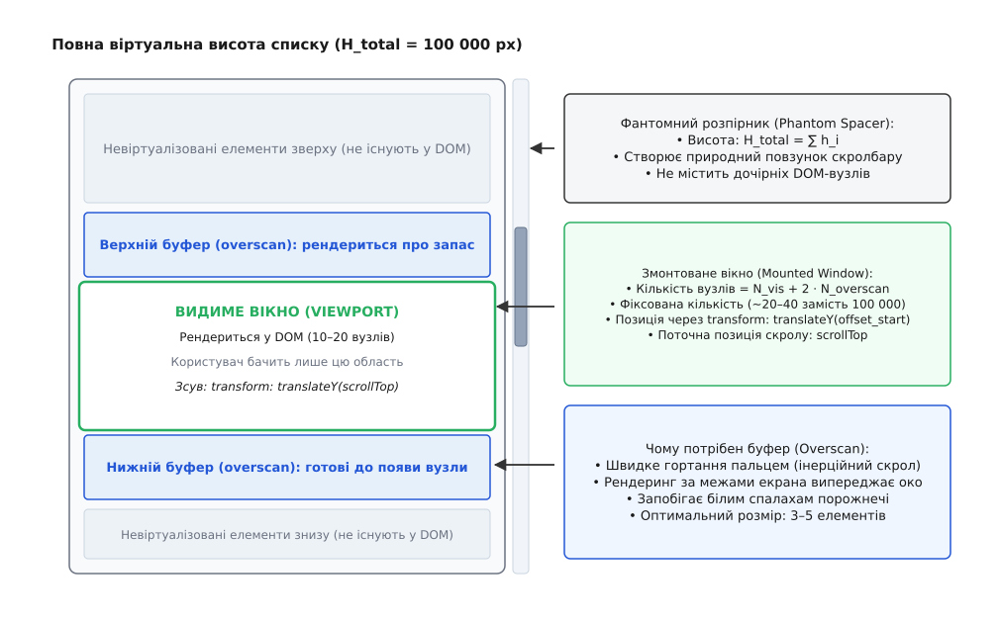
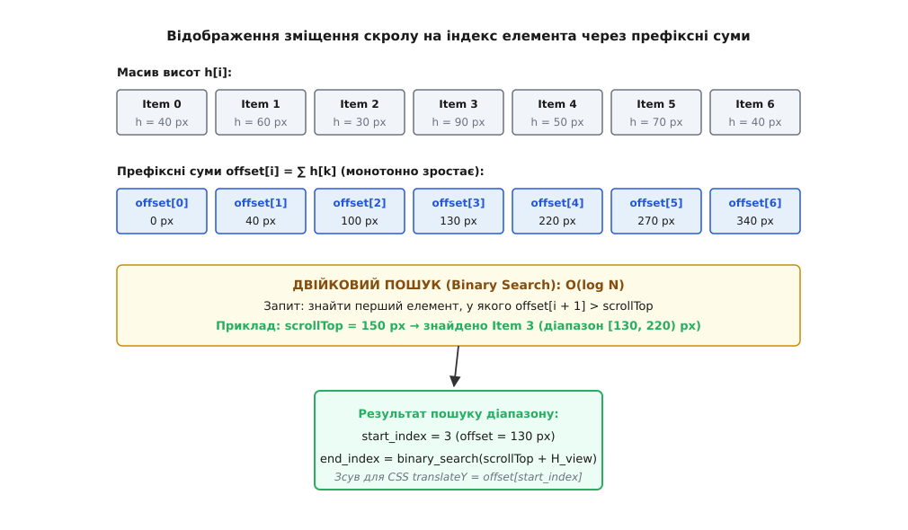
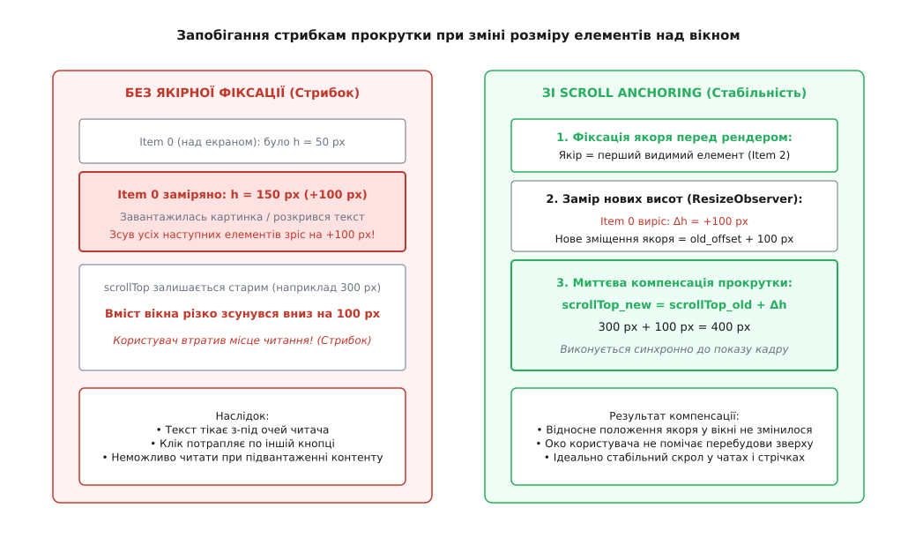
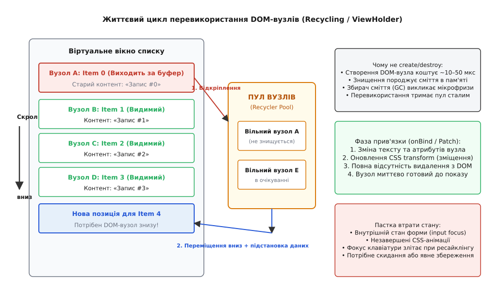
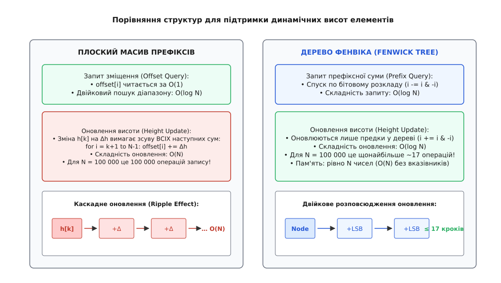

# Віртуалізація довгих списків

<preknowlist>
- [Розвантаження потоку інтерфейсу](topic:programming/ui-thread-offloading) — чому потік інтерфейсу має суворий ліміт часу на кадр (16.67 мс при 60 Гц) і будь-яка затримка викликає візуальне заїдання.
- [Цикл подій](topic:programming/event-loop) — черга мікро- та макрозадач, взаємодія подій введення, розрахунку стилів та стадії відмальовки кадру.
- [Двійковий пошук](topic:algorithms/binary-search) — знаходження граничних елементів у монотонно зростаючому впорядкованому масиві за логарифмічний час O(log N).
- [Дерево Фенвіка](topic:math/fenwick-tree) — структура даних над масивом для швидкого обчислення та точкового оновлення динамічних префіксних сум за O(log N).
</preknowlist>

Застосунок завантажив таблицю на 100 000 рядків і спробував створити для кожного з них стандартний вузол дерева документа. Через дві секунди інтерфейс повністю завис: споживання оперативної пам'яті вкладки браузера підскочило від 40 МБ до 1.2 ГБ, а спроба торкнутися смуги прокручування викликала чотирисекундну паузу з випаданням сотень кадрів. Пристрій не виконував складних математичних розрахунків чи криптографічних перетворень: він просто намагався утримати в пам'яті та намалювати сто тисяч прямокутників із текстом.

Ця криза продуктивності виникає не через повільність процесора, а через фундаментальну невідповідність між тим, як графічний рушій обробляє вузли інтерфейсу, і тим, яку частину інформації фізично здатне сприйняти людське око в один момент часу.

## Чому графічні рушії гинуть на великих деревах вузлів

Кожен візуальний елемент у графічному дереві — будь то вузол DOM у браузері чи об'єкт `View` у нативній операційній системі — не є просто набором пікселів. Це складний системний об'єкт із десятками пов'язаних структур даних: таблицею обчислених стилів, списком слухачів подій, контекстом накладання шарів, геометрією меж (*bounding box*) та зв'язками з батьківськими й дочірніми вузлами.

У сучасному браузерному рушії (наприклад, Chromium Blink чи Apple WebKit) один елементарний DOM-вузол `<div>` разом із відповідним йому об'єктом дерева розкладки (*LayoutObject*) та шаром відмальовки (*PaintLayer*) займає від 1.5 до 4 КБ системної пам'яті. Для списку зі 100 000 елементів лише базові структури дерева вимагають близько 300–400 МБ оперативної пам'яті. Якщо кожен елемент списку містить аватар, кілька текстових блоків, статус та кнопки дій, загальна кількість DOM-вузлів сягає мільйона, а витрати пам'яті перевищують гігабайт.

Справжня катастрофа настає на стадіях графічного конвеєра:

```
Зміна стану / Скрол  →  Recalculate Style  →  Layout (Reflow)  →  Paint  →  Composite
```

1. **Перерахунок стилів (Recalculate Style):** Коли властивість CSS змінюється (або коли список уперше вставляється в документ), рушій повинен зіставити селектори стилів з кожним із 100 000 вузлів. Браузерний механізм `ElementRuleCollector` намагається оптимізувати перевірки за допомогою фільтрів Блума (*Bloom filters*), проте на велетенських деревах часова складність перевірки селекторів масштабується лінійно `O(N)` або вище, вимагаючи сотні мілісекунд процесорного часу.
2. **Розкладка (Layout / Reflow):** Щоб дізнатися ширину й висоту кожного рядка, рушій виконує рекурсивний обхід дерева `LayoutBlockFlow`, вираховуючи перенесення слів, відступи (*margins, paddings*), висоту рядків та просторові координати `x, y`. Для великого документа це перетворюється на повне сканування всього масиву елементів. Будь-яка дрібна зміна розміру тексту вгорі списку інвалідує розкладку всіх наступних 99 999 вузлів.
3. **Малювання та растеризація (Paint & Raster):** Графічний процесор не може завантажити в текстурну пам'ять полотно висотою в мільйон пікселів. Компонувальник браузера (*Chrome Compositor*, `cc`) змушений ділити документ на тисячі растрових плиток (*tiles* розміром 256×256 або 512×512 пікселів). Величезна кількість плиток вичерпує ліміт текстурної пам'яті GPU (*VRAM*), викликає постійне скидання кешу (*texture thrashing*) і врешті-решт призводить до аварійного завершення процесу вкладки (*Out-Of-Memory Crash*).

Водночас висота сучасного дисплея становить від 800 до 1440 пікселів. За середньої висоти рядка списку в 40–60 пікселів у видимій області екрана фізично вміщується лише 15–25 елементів. Решта 99 975 елементів існують у пам'яті, прораховуються у кожному циклі розкладки та навантажують графічний конвеєр, але залишаються абсолютно невидимими для користувача.

Ця невідповідність розв'язується через віртуалізацію: [принцип, винайдений ще в ранніх об'єктно-орієнтованих середовищах Smalltalk та NeXTSTEP](topic:programming/list-virtualization/hist-virtual-list.md), де графічне дерево зберігає лише ті вузли, які потрапляють у поточне видове вікно.

## Анатомія віртуалізованого контейнера

Віртуалізація (англ. *list virtualization*, *windowing*) — це архітектурний патерн, за якого в графічному дереві документа одночасно існує та рендериться лише фіксована кількість елементів, достатня для заповнення видимого вікна (*viewport*) плюс невеликий запасний буфер (*overscan*). 

Замість розміщення 100 000 елементів у DOM-дереві підтримується стабільний пул із 20–40 вузлів незалежно від загального розміру набору даних.



*Анатомія віртуалізованого контейнера. Зовнішній контейнер зі скролбаром тримає фантомний розпірник повної висоти списку, тоді як усередині рендериться лише компактне вікно з видимих елементів та буферів випередження.*

Віртуалізована система складається з чотирьох ключових рівнів:

### 1. Контейнер видового вікна (Viewport Container)

Зовнішній елемент із фіксованою висотою та увімкненою смугою прокрутки (`overflow-y: auto`, `position: relative`). Для максимальної ізоляції стилів та розкладки контейнеру призначають CSS-властивість `contain: strict` (або `contain: layout size`). Вона повідомляє рушію браузера, що внутрішній вміст контейнера ні за яких умов не може змінити геометричні розміри або розкладку батьківських елементів сторінки.

Контейнер перехоплює події прокручування (`scroll`) та визначає видиму геометрію:
- `scrollTop` — поточна координата зміщення верхнього краю вікна відносно початку вмісту;
- `clientHeight` — висота видового вікна (наприклад, 800 px).

### 2. Фантомний розпірник (Phantom Scroll Spacer)

Порожній невидимий елемент усередині контейнера, висота якого штучно встановлюється рівною сумарній висоті **всіх** елементів списку:

```
H_total = ∑_{i=0}^{N-1} h_i
```

Для 100 000 елементів висотою 50 px висота фантомного розпірника становить 5 000 000 px. Браузер бачить цей гігантський розмір і генерує нативний повзунок скролбару з точною пропорцією та кінетичною поведінкою, хоча всередині розпірника немає жодної дитини.

### 3. Змонтоване вікно елементів (Mounted Window)

Фіксований набір реальних DOM-вузлів, що відповідають поточному індексному діапазону `[startIndex, endIndex]`. 

Позиціонування цих вузлів здійснюється двома способами:
- **Абсолютне позиціонування (`top: offset px`):** класичний підхід, який вимагає перерахунку розкладки при кожній зміні положення.
- **Апаратне зміщення (`transform: translateY(offset px)`):** сучасний рекомендований стандарт. Зміна властивості `transform` передається безпосередньо в окремий шар компонувальника (*Compositor Layer*) на графічний процесор, оминаючи стадії Recalculate Style та Layout.

### 4. Буфер випередження (Overscan / Buffer)

Якщо рендерити **виключно** ті елементи, які перетинають піксельні межі `[scrollTop, scrollTop + clientHeight]`, то під час швидкого прокручування коліщатком або пальцем на тачскрині користувач побачить білі порожні спалахи (*white flashes*). Це відбувається через те, що подія `scroll` обробляється асинхронно або з запізненням відносно тику вертикальної синхронізації дисплея (*VSync*).

Щоб усунути спалахи, віртуалізатор штучно розширює діапазон рендерингу на `N_overscan` елементів вище та нижче видового вікна (зазвичай по 3–5 елементів з кожного боку). Завдяки буферу елементи рендеряться за межами видимості на 1–2 кадри раніше, ніж погляд користувача до них добереться.

> 🔧 **Навіщо це.** Розмір буфера — це прямий компроміс між надійністю та споживанням пам'яті: надто малий буфер дає білі спалахи при різкому скролі, надто великий — нівелює виграш віртуалізації, змушуючи браузер малювати сотні зайвих вузлів. Для списків зі складними рядками оптимальним є динамічний розрахунок буфера залежно від поточної швидкості прокручування.

## Розрахунок діапазону: фіксована проти динамічної висоти

Головне алгоритмічне завдання віртуалізатора — за поточним значенням `scrollTop` та висотою вікна `H_view` миттєво визначити індекси першого (`startIndex`) та останнього (`endIndex`) видимих елементів.

### Фіксована висота елементів (Fixed Height)

Коли всі елементи списку мають строго однакову висоту `h_const` (наприклад, стандартні контакти чи системні списки файлів), розрахунок виконується за сталий час `O(1)` за допомогою елементарного цілочисельного ділення:

```
startIndex = ⌊ scrollTop / h_const ⌋
endIndex   = min(N - 1, ⌊ (scrollTop + H_view - 1) / h_const ⌋)
```

Зсув верхньої межі для CSS-трансформації вираховується як:

```
offsetStart = startIndex · h_const
```

Математика `O(1)` не вимагає виділення додаткових масивів чи попередньої обробки даних: будь-яке значення скролу за частку наносекунди перетворюється на пару індексів.

### Динамічна наперед відома висота: префіксні суми та двійковий пошук

У реальних інтерфейсах висоти елементів рідко бувають однаковими: коментарі мають різну кількість рядків тексту, поштові листи містять вкладення, а картки товарів мають різний склад атрибутів. Якщо висоти відомі наперед із даних моделі, ми маємо масив висот `h = [h₀, h₁, …, h_{N-1}]`.



*Відображення координати скролу на індексний діапазон. Масив префіксних сум зміщень монотонно зростає, дозволяючи двійковим пошуком за 17 кроків знаходити точне місце входу серед 100 000 елементів.*

Для пошуку видимого вікна будується масив префіксних сум зміщень (*prefix sums array*) розміру `N + 1`:

```
offset[0] = 0
offset[i] = offset[i - 1] + h[i - 1] = ∑_{k=0}^{i-1} h[k]
```

Оскільки висота кожного елемента строго більша за нуль (`h[i] > 0`), масив `offset` є **строго монотонно зростаючим**:

```
offset[0] < offset[1] < offset[2] < … < offset[N] = H_total
```

Завдяки суворій монотонності пошук першого видимого елемента `startIndex` (першого індексу, де `offset[i + 1] > scrollTop`) виконується класичним [двійковим пошуком](topic:algorithms/binary-search) за логарифмічний час `O(log N)`:

```
low = 0, high = N - 1
поки low ≤ high:
  mid = ⌊(low + high) / 2⌋
  якщо offset[mid + 1] > scrollTop:
    startIndex = mid
    high = mid - 1
  інакше:
    low = mid + 1
```

Для масиву зі 100 000 елементів двійковий пошук потребує щонайбільше `⌈log₂(100 001)⌉ = 17` операцій порівняння. Це займає менше мікросекунди й абсолютно непомітно для бюджету кадру. [Повний математичний апарат розрахунку та оцінки складності наведено в окремому матеріалі](topic:programming/list-virtualization/math-virtual-offsets.md).

## Виклик невідомих розмірів: цикл вимірювання ResizeObserver

Найскладніший сценарій виникає тоді, коли висота елементів залежить від шрифтів, перенесення слів, ширини контейнера або завантаження картинок і не може бути точно розрахована до моменту реального розміщення вузла в DOM.

Якщо закласти неточну оцінку висоти й не перевірити її, список буде неможливо правильно прокрутити до кінця, а смуга прокрутки поводитиметься хаотично.

Розв'язанням є чотирифазний цикл замірів з кешуванням:

```
1. Оцінка (Estimate)  →  2. Рендер вікна  →  3. Замір (ResizeObserver)  →  4. Оновлення кешу
```

```
┌────────────────────────────────────────────────────────────────────────┐
│ Фаза 1: Попередня оцінка (Estimate)                                   │
│ Всі невідомі елементи ініціалізуються середньою оцінкою (h_est = 50px).│
│ Будується приблизний масив префіксних сум для обчислення діапазону.   │
└───────────────────────────────────┬────────────────────────────────────┘
                                    │
┌───────────────────────────────────▼────────────────────────────────────┐
│ Фаза 2: Рендеринг активного зрізу                                      │
│ Елементи [start, end] монтуються в DOM з реальними текстами та стилями.│
└───────────────────────────────────┬────────────────────────────────────┘
                                    │
┌───────────────────────────────────▼────────────────────────────────────┐
│ Фаза 3: Асинхронний замір (ResizeObserver Callback)                   │
│ Браузер після етапу Layout повідомляє точні розміри змонтованих вузлів.│
└───────────────────────────────────┬────────────────────────────────────┘
                                    │
┌───────────────────────────────────▼────────────────────────────────────┐
│ Фаза 4: Оновлення індексу та корекція розпірника                      │
│ Реальна висота h_real записується в кеш. Зміна висоти Δ = h_real - h_est│
│ оновлює префіксні суми та повну висоту H_total фантомного розпірника.  │
└────────────────────────────────────────────────────────────────────────┘
```

### Пастка примусової синхронної розкладки (Layout Thrashing)

У ранніх реалізаціях віртуалізаторів вимір висоти виконували синхронно всередині циклу відмальовки через звернення до `element.offsetHeight` чи `element.getBoundingClientRect()`. 

Це призводило до катастрофічного дефекту — *Layout Thrashing* (примусового скидання та перерахунку розкладки). Якщо код у циклі записує в DOM стиль (`element.style.transform = ...`), а в наступному рядку читає геометрію (`element.offsetHeight`), браузер змушений зупинити виконання коду, негайно викинути розраховані шари та синхронно перерахувати розкладку всього документа. На 20 елементах це створювало 20 важких перерахунків на один кадр, повністю знищуючи 60 FPS.

Використання стандарту `ResizeObserver` докорінно змінює процес: спостерігач реєструє інтерес до розмірів елементів, а браузер повідомляє про зміни пакетно в окремому мікротаску **після** завершення стандартної розкладки, не викликаючи жодного примусового синхронного рефлоу.

## Стрибки скролу та механізм якірної фіксації (Scroll Anchoring)

Коли елементи списку заміряються на льоту, виникає критичний дефект взаємодії — **скрол-стрибки** (*scroll jumping* / *content jump*).

Уявіть ситуацію: користувач прокрутив список до середини (наприклад, читає повідомлення #500 при `scrollTop = 25 000 px`). У цей момент у верхній частині списку (елементи #10–#20, які зараз перебувають поза видимим вікном вище екрана) довантажуються важкі зображення або завершується замір реального тексту. Висота цих елементів збільшується на сумарні 400 пікселів.



*Механізм запобігання стрибкам прокрутки (Scroll Anchoring). При зміні висоти елементів над видовим вікном зміщення скролу моментально коригується на величину дельти, зберігаючи положення тексту перед очима читача.*

Оскільки префіксна сума — це кумулятивна величина, координата верхнього краю повідомлення #500 миттєво зсувається:

```
offset_new[500] = offset_old[500] + 400 px = 25 400 px
```

Якщо значення `scrollTop` контейнера залишиться незмінним (`25 000 px`), то в наступному кадрі вміст вікна різко стрибне вниз на 400 пікселів: повідомлення, яке людина читала, вилетить за межі екрана, а текст втече з-під очей.

### Алгоритм якірної фіксації (Scroll Anchoring Algorithm)

Для боротьби зі стрибками віртуалізатор реалізує алгоритм фіксації якоря:

1. **Визначення якірного елемента (Anchor Item):** Перед застосуванням нових замірів система визначає індекс першого повністю або частково видимого елемента `anchorIndex` та його поточне зміщення у вікні:
   ```
   anchorIndex = findStartIndex(scrollTop)
   anchorOffsetInViewport = scrollTop - offset_old[anchorIndex]
   ```
2. **Застосування замірів та перерахунок дельти:** Оновлюються висоти елементів у кеші. Обчислюється різниця старого й нового зміщення якірного елемента:
   ```
   Δ_anchor = offset_new[anchorIndex] - offset_old[anchorIndex]
   ```
3. **Миттєва компенсація прокрутки:** Якщо розміри будь-яких елементів вище якірного змінилися (`Δ_anchor ≠ 0`), віртуалізатор синхронно коригує `scrollTop` контейнера до показу наступного кадру:
   ```
   scrollTop_new = scrollTop_old + Δ_anchor
   ```

Після корекції відносне положення якірного елемента у вікні залишається ідентичним до пікселя:

```
scrollTop_new - offset_new[anchorIndex]
= (scrollTop_old + Δ_anchor) - (offset_old[anchorIndex] + Δ_anchor)
= scrollTop_old - offset_old[anchorIndex]
= anchorOffsetInViewport
```

Користувач не помічає жодного коливання екрана, навіть якщо над ним щойно перерахувалися тисячі рядків.

### Двостороннє нескінченне завантаження (Bidirectional Prepending)

Цей самий якірний механізм критично необхідний у чатах та стрічках новин при додаванні старих повідомлень угору списку (*prepending*). Коли користувач доскролює до верху чату й отримує з сервера 50 нових повідомлень сумарною висотою 3000 px, вставка цих елементів на початок масиву збільшує індекси всіх існуючих повідомлень. 

Без якірного зсуву `scrollTop` лишився б рівним 0, і користувача викинуло б на самий початок доданої історії. Завдяки компенсації `scrollTop += 3000 px` людина залишається дивитися на те саме повідомлення, з якого починала.

## Перевикористання вузлів: ViewHolder та пул подань

При інтенсивному скролі список проходить сотні елементів за секунду. Якщо на кожному кроці створювати нові DOM-вузли через `document.createElement()` і знищувати старі через `node.remove()`, рушій JavaScript генерує тисячі короткоживучих об'єктів у купі (*heap*).

Це неминуче активує збирач сміття (*Garbage Collector*). Пауза на повне складання сміття (*Stop-the-world GC pause*) триває від 10 до 50 мс, гарантовано вибиваючи кадр і створюючи мікрозаїдання (*jank*).



*Життєвий цикл ресайклінгу DOM-вузлів. Елемент, що виходить за межі верхнього буфера, не видаляється з пам'яті, а переміщується в кінець списку і повторно наповнюється новими даними.*

Щоб повністю усунути навантаження на збирач сміття, застосовується патерн **Recycling / ViewHolder**:
1. Створюється фіксований пул із `K` екземплярів DOM-вузлів (де `K = visibleCount + 2 · overscan`).
2. Коли елемент виходить за межі буфера зверху, його DOM-вузол не видаляється. Він переміщується в кінець списку зміною властивості `transform: translateY(newOffset)`.
3. У фазі прив'язки даних (*onBind*) внутрішній текст, класи та атрибути вузла перезаписуються даними нового рядка.

### Порівняння підходів у різних платформах

У нативних середовищах Android `RecyclerView` та iOS `UICollectionView` патерн ресайклінгу вбудовано на рівні операційної системи:
- **Android `RecycledViewPool`:** зберігає відкріплені від дерева об'єкти `ViewHolder`, згруповані за числовим типом подання `viewType`. Коли списку потрібен рядок певного типу, він бере готовий об'єкт із пулу та викликає `onBindViewHolder()`, уникаючи викликів `LayoutInflater.inflate()`.
- **Веб-фреймворки (React, Vue, Svelte):** використання ключів `key={item.id}` примушує віртуальне дерево демонтувати старі компоненти й монтувати нові. Безключовий рендеринг (*unkeyed recycling*) або ручний пул DOM-вузлів дозволяє досягти нативної швидкості, уникаючи накладних витрат декларативного звіряння (*Virtual DOM diffing*).

### Пастки збереження внутрішнього стану (State Retention Traps)

Повторне використання DOM-вузлів приховує три небезпечні пастки:

1. **Втрата фокусу форми та віртуальної клавіатури:** Якщо користувач почав вводити текст у поле `<input>` всередині віртуалізованого рядка, а потім злегка прокрутив екран так, що рядок ресайклився, фокус миттєво зникає, а мобільна клавіатура закривається. Для захисту активний елемент із фокусом позначають як «закріплений» (*pinned*) і виключають із пулу ресайклінгу до завершення вводу.
2. **Залишкові CSS-анімації та переходи:** Якщо старий рядок мав активну CSS-анімацію (наприклад, підсвічування кольором після кліку), новий рядок після ресайклінгу успадкує цей стан і блиматиме старим кольором. Фаза прив'язки зобов'язана явно скидати всі динамічні класи та стилі.
3. **Мерехтіння зображень:** Якщо у вузлі містився тег ``, зміна атрибута `src` на новий URL може викликати короткочасне відображення старої картинки до моменту декодування нової. Необхідно очищати `src` або ставити заглушку перед завантаженням.

## Алгоритмічні структури динамічних висот: Масив проти Дерева Фенвіка

Під час рендерингу динамічного списку виникає конфлікт між швидкістю читання зміщення та швидкістю його оновлення.



*Порівняння структур даних для віртуалізації. Плоский масив префіксів забезпечує O(1) читання, але створює O(N) каскадне оновлення при кожній зміні висоти, тоді як Дерево Фенвіка гарантує логарифмічний час O(log N) для обох операцій.*

### Порівняльна таблиця структур індексації

| Структура даних | Пошук діапазону (Query) | Оновлення висоти (Update) | Споживання пам'яті | Найкраще застосування |
| :--- | :--- | :--- | :--- | :--- |
| **Фіксована константа** | **`O(1)`** | `O(1)` | `O(1)` | Списки з однаковими елементами |
| **Плоский масив префіксів** | `O(log N)` (двійковий пошук) | **`O(N)`** (каскадний зсув) | `N` чисел | Рідкісні зміни розмірів, проста реалізація |
| **Дерево Фенвіка (BIT)** | **`O(log N)`** (двійковий підйом) | **`O(log N)`** (підйом по бітах) | `N` чисел | Часті заміри розмірів, чати, динамічні стрічки |
| **Блокова декомпозиція (`√N`)** | `O(log N)` | **`O(1)`** або `O(√N)` | `N + √N` чисел | Проміжні структури з мінімальним константним множником |

Якщо у списку на 100 000 елементів використовувати плоский масив, замір висоти першого елемента вимагає оновлення 99 999 комірок масиву. Якщо ж використовувати [дерево Фенвіка з бітовою індексацією через молодший значущий біт `LSB(i) = i & (-i)`](topic:math/fenwick-tree), оновлення висоти потребує лише 17 операцій додавання, що гарантує бездоганну роботу на будь-яких пристроях.

Практичну архітектуру та повний вихідний код віртуалізатора з підтримкою замірів та ресайклінгу [зібрано в практичній реалізації рушія віртуалізації](topic:programming/list-virtualization/proj-virtual-scroller.md).

## Кінетичний скрол та динамічне масштабування буфера

На мобільних пристроях із сенсорними екранами та трекпадами користувач взаємодіє зі списком через кінетичні жести змахування (*fling / kinetic scrolling*). При різкому русі пальця початкова швидкість прокручування може сягати 3000–6000 пікселів за секунду.

При такій швидкості стандартного фіксованого буфера у 3–5 елементів виявляється недостатньо:
- За один міжкадровий інтервал дисплея 60 Гц (16.67 мс) список зміщується на `Δy = 5000 · 0.01667 ≈ 83.3 px`;
- Якщо середня висота рядка становить 40 px, за один кадр екран проходить понад 2 повних елементи;
- Якщо черга подій головного потоку затримується хоча б на 1 кадр через виконання стороннього фонового JavaScript-коду, віртуалізатор запізнюється з рендерингом на 4–5 рядків, у результаті чого користувач на мить бачить білу порожнечу під скролером.

Для надійного розв'язання цієї проблеми впроваджують **динамічний розмір буфера** (*Velocity-Adaptive Overscan*):
1. Обробник подій скролу відстежує часові мітки та зміщення між сусідніми подіями, вираховуючи миттєву швидкість:
   ```
   v = |scrollTop_{t} - scrollTop_{t - Δt}| / Δt
   ```
2. Розмір буфера випередження динамічно масштабується за формулою:
   ```
   overscan_count = base_overscan + ⌈ (v · t_frame · k_safety) / average_height ⌉
   ```
3. Коли швидкість висока, буфер розширюється до 8–12 елементів у напрямку руху, заздалегідь готуючи вузли в пам'яті. Коли рух сповільнюється або зупиняється, буфер автоматично скорочується до базових 3 елементів, вивільняючи ресурси пам'яті та спрощуючи DOM-дерево.

## Оптимізація пам'яті: типізовані масиви для мільйонних списків

Якщо розмір списку сягає сотень тисяч або мільйонів рядків, стандартні масиви JavaScript (`Array<number>`) та хеш-таблиці (`Map<number, number>`) створюють суттєвий оверхед пам'яті. Звичайний об'єкт `Map` у рушії V8 витрачає близько 32–48 байтів на кожен запис через службові заголовки та хеш-кошики. Для 1 000 000 елементів один лише кеш замірів займе до 50 МБ оперативної пам'яті в купі JavaScript.

Для максимальної економії пам'яті та нульового навантаження на збирач сміття застосовують **типізовані двійкові масиви** (*TypedArrays*):
- **`Float64Array` для префіксних сум:** зберігає зміщення з максимальною точністю без проміжного виділення об'єктів. Кожен елемент займає рівно 8 байтів суцільної пам'яті;
- **`Int32Array` або `Float32Array` для кешу висот:** зберігає заміряні розміри рядків, витрачаючи лише 4 байти на запис;
- **Блочне ліниве виділення (Chunked Typed Buffers):** пам'ять під індекси виділяється блоками по 10 000 елементів за потреби, що дозволяє миттєво відкривати нескінченні стрічки без тривалого початкового виділення великих монолітних масивів.

Завдяки типізованим масивам весь індекс розмірів для 1 000 000 елементів утримується в межах 12 МБ пам'яті, читається за лічені наносекунди та повністю виключає паузи складання сміття.

## Субпіксельне тремтіння та похибки масштабування

Сучасні пристрої мають екрани високої щільності пікселів (*HiDPI / Retina*), де коефіцієнт масштабування `window.devicePixelRatio` становить 1.25, 1.5, 2.0 або 3.0. При таких коефіцієнтах або при використанні відносних одиниць шрифту (*rem, em*) розрахована висота елемента у віртуалізаторі стає дробовим числом (наприклад, 45.333 px).

Якщо передавати дробові значення безпосередньо у властивість `transform: translateY(45.333px)`, виникають дві проблеми:
1. **Згладжування та розмиття пікселів (*Subpixel Antialiasing*):** Рядки тексту можуть потрапляти між фізичними пікселями матриці дисплея, що призводить до тимчасового розмиття шрифтів під час руху.
2. **Тремтіння ліній меж (*Border Jitter / 1px Gaps*):** На межах між сусідніми рядками з'являються випадкові порожні проміжки шириною в 1 фізичний піксель, які мерехтять під час прокрутки.

Щоб запобігти тремтінню:
- Усі внутрішні розрахунки префіксних сум виконуються з максимальною подвійною точністю `double` (64-бітне число з плаваючою комою).
- Запис координати `translateY` у DOM виконується з явним піксельним прив'язуванням (*pixel snapping*): `Math.round(offset * dpr) / dpr` або цілим піксельним заокругленням `Math.round(offset)`.
- Висота фантомного розпірника встановлюється строго рівною `Math.ceil(totalHeight)`.

## Вкладена та двовимірна віртуалізація

Реальні інтерфейси часто виходять за межі простого одновимірного списку.

### Вкладені горизонтальні списки (Nested Carousels)

Типовий патерн медіа-сервісів (Netflix, Spotify, App Store) — вертикальний список категорій, де кожен рядок сам по собі є горизонтальною каруселлю з десятками карток.

Якщо кожен горизонтальний рядок створюватиме власний незалежний пул із 10 DOM-вузлів, то при вертикальному списку з 30 категорій кількість вузлів у DOM зросте до 300, що призведе до сповільнення розкладки.

Розв'язанням є **єдиний спільний пул подань** (*Shared RecycledViewPool*):
- Усі вкладені горизонтальні списки підключаються до одного глобального менеджера пулу карток;
- Коли верхня категорія виходить за межі екрана, всі її горизонтальні картки миттєво повертаються в спільний пул;
- Нижня категорія, що з'являється знизу, бере готові картки зі спільного пулу без виділення пам'яті.

### Двовимірна віртуалізація (2D Grid / Spreadsheets)

У табличних процесорах (наприклад, веб-версіях Excel або Google Таблиць) документ містить як сотні тисяч рядків, так і сотні колонок.

Віртуалізатор у цьому випадку працює у двовимірному просторі:
- Підтримуються два незалежних індекси префіксних сум: вертикальний `rowOffsets[y]` та горизонтальний `colOffsets[x]`;
- Пошук видимого діапазону здійснюється за парою координат `(scrollTop, scrollLeft)`:
  ```
  [rowStart, rowEnd] = binarySearch(rowOffsets, scrollTop, viewportHeight)
  [colStart, colEnd] = binarySearch(colOffsets, scrollLeft, viewportWidth)
  ```
- Фіксовані заголовки таблиці (*pinned columns & rows*) монтуються окремими шарами, які синхронізуються лише за однією з просторових осей.

## Доступність, пошук на сторінці та CSS content-visibility

Віртуалізація розв'язує проблему продуктивності ціною видалення вмісту з дерева документа. Це створює три фундаментальні проблеми доступності (*accessibility*) та взаємодії з браузером:

### 1. Зчитувачі екрана (Screen Readers)

Програми екранного доступу (NVDA, VoiceOver, TalkBack) орієнтуються на семантичне дерево доступності (*Accessibility Tree*). Якщо в DOM присутні лише 20 елементів, незрячий користувач чує, що в списку всього 20 пунктів замість 100 000, а клавіатурна навігація по елементах обривається.

Для відновлення коректного контексту контейнеру та рядкам призначають спеціальні ARIA-атрибути:
- Контейнеру: `role="feed"` або `role="list"`, атрибут `aria-rowcount="100000"`;
- Кожному змонтованому рядку: `aria-rowindex="542"`, `aria-setsize="100000"`, `aria-posinset="542"`.

Завдяки цим атрибутам зчитувач екрана оголошує: *«Елемент 542 зі 100 000»*, зберігаючи навігаційний орієнтир.

### 2. Нативний пошук на сторінці (Ctrl+F)

Стандартний діалог пошуку браузера сканує лише вузли, фізично присутні в DOM-дереві. Елементи, які не змонтовані віртуалізатором, знайти через `Ctrl+F` неможливо.

Існує два шляхи подолання цього обмеження:
- Впровадження кастомного рядка пошуку в інтерфейсі застосунку, який шукає по масиву даних у пам'яті JavaScript і викликає `scrollToIndex(foundIndex)`;
- Використання події браузера `beforematch` (Chrome 102+), яка спрацьовує, коли браузер намагається знайти прихований контент.

### 3. CSS content-visibility як нативна альтернатива

Властивість CSS `content-visibility: auto` дозволяє браузеру самостійно ізолювати та пропускати стадії розкладки й малювання для елементів, які перебувають поза межами видимого екрана:

```css
.list-item {
  content-visibility: auto;
  contain-intrinsic-size: auto 50px;
}
```

Властивість `contain-intrinsic-size` повідомляє браузеру попередню висоту елемента для формування коректного скролбару. 

`content-visibility: auto` не вимагає складного JavaScript-коду, автоматично підтримує пошук `Ctrl+F` та зберігає доступність для зчитувачів екрана. Проте вона **не видаляє** DOM-вузли з пам'яті: для екстремальних списків на 50 000–100 000 елементів витрати RAM на саме дерево DOM залишаються високими, тому класична JS-віртуалізація залишається незамінним інструментом для важких високопродуктивних клієнтських інтерфейсів.
