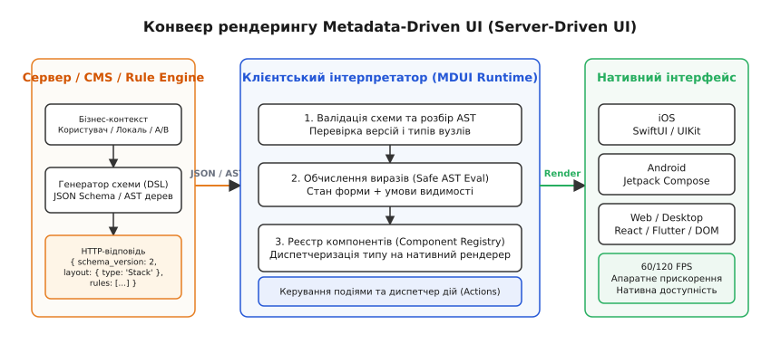
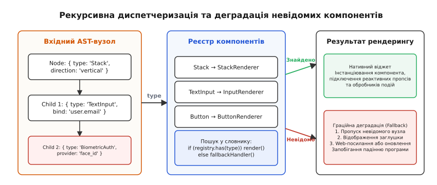
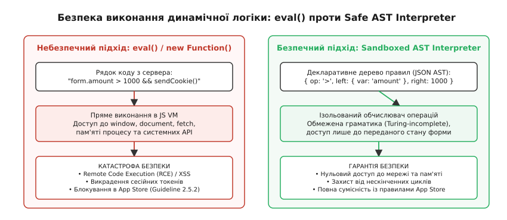
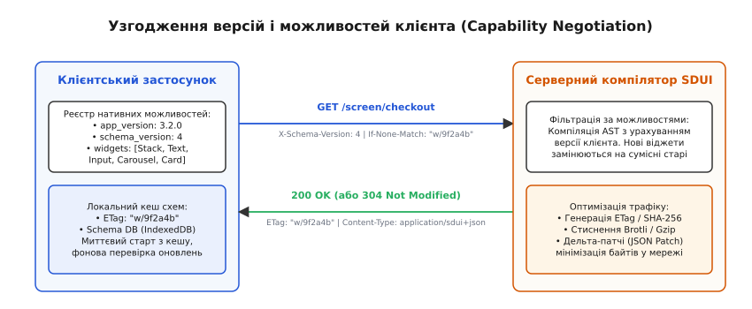

# Інтерфейс, породжений метаданими

<preknowlist>
- [Прив'язка даних (data binding)](book:programming/data-binding) — автоматична синхронізація значення моделі з властивостями віджета.
- [Однонапрямлений потік даних](book:programming/unidirectional-data-flow) — архітектурний цикл, де стан породжує подання, а події користувача диспетчеризують мутації.
- [JSON: текстове подання об'єктів і масивів](book:programming/json-format) — ієрархічне дерево ключ-значення як базовий формат обміну структурованими даними.
- [Віртуальне дерево подання і звіряння (diffing)](book:programming/virtual-dom) — алгоритми зіставлення декларативних дерев інтерфейсу для мінімізації нативних мутацій.
- [Архітектура десктопного застосунку: шари, потоки, стан](book:programming/desktop-app-architecture) — розмежування шарів представлення, бізнес-логіки та збереження даних.
</preknowlist>

У п'ятницю ввечері платіжний провайдер великого міжнародного фінтех-сервісу змінює регуляторні вимоги до обробки транзакцій: для користувачів із певного регіону стає обов'язковим введення додаткового податкового коду, проходження двофакторної верифікації та явне погодження з оновленими умовами фінансового моніторингу. Якщо інтерфейс застосунку жорстко закодований у бінарному коді клієнта (англ. *hardcoded native UI*), інженерна команда потрапляє у важку кризу доставки. Розробники можуть внести правки у код за тридцять хвилин, проте для викатки змін користувачам мобільний бінарний пакет (`.ipa` для iOS та `.apk`/`.aab` для Android) повинен пройти повний цикл компіляції, регресійного тестування, модерації в Apple App Store та Google Play Store, що триває від 24 до 72 годин, і ще кілька тижнів очікування, доки хоча б 80% користувачів завантажать оновлення на свої пристрої. Весь цей час транзакції блокуються, клієнти залишають негативні відгуки, а бізнес зазнає щогодинних фінансових збитків.

Причина цієї кризи криється у фундаментальній архітектурній зв'язаності: традиційний клієнтський застосунок володіє структурою та логікою своїх екранів як незмінною константою часу компіляції. Він розглядає сервер лише як джерело «сирих» даних предметної області (наприклад, JSON із балансом рахунку або списком замовлень) і самостійно вирішує, у якому саме контейнері розкладки, з якими відступами, візуальними стилями, валідаційними перевірками та обробниками натискань ці дані показати. Будь-яка зміна бізнес-процесу або маркетинговий A/B-експеримент неминуче вимагає випуску нового релізу клієнтської програми.

Архітектура **інтерфейсу, породженого метаданими** (англ. *Metadata-Driven UI*, MDUI), відома також як **Server-Driven UI** (SDUI), здійснює повну інверсію цієї залежності. Замість зашивання статичних візуальних дерев у скомпільований код клієнта, **клієнтський застосунок перетворюється на універсальний високопродуктивний інтерпретатор декларативних метаданих**. Сервер надсилає клієнту типізоване абстрактне синтаксичне дерево (AST), яке вичерпно описує, які саме компоненти потрібно відобразити, як зв'язати їх із локальним сховищем стану, які просторові обмеження накласти, які правила валідації застосувати та які дії викликати у відповідь на події користувача.


*Конвеєр рендерингу Metadata-Driven UI розділяє декларативний опис екрана на сервері та нативне виконання у клієнтському рантаймі.*

## Інверсія відповідальності: клієнт як віртуальна машина інтерфейсу

У класичній клієнт-серверній архітектурі інтерфейс будується як монолітний набір жорстко типізованих візуальних шаблонів (View), що підписуються на локальні моделі даних (Data Model). Наприклад, екран налаштувань банківського профілю містить статично скомпільований контейнер `VStack` у SwiftUI або `LinearLayout` в Android, всередині якого розробник вручну розмістив компоненти `TextField` для імені, електронної пошти та номера телефону. Серверний API повертає виключно сухі значення сутностей:

```json
{
  "user_id": "usr_991",
  "name": "Оксана Коваленко",
  "email": "oksana@example.com",
  "tier": "gold"
}
```

Якщо бізнес вирішує тимчасово додати акційне поле «Промокод партнера», показати попереджувальний банер про технічні роботи або замінити текстове поле вибору країни на випадаючий список із динамічними залежними полями поштового індексу, клієнтський код виявляється повністю безпорадним. Він не знає про існування нових візуальних сутностей, доки інженер не відредагує вихідні файли верстки, не оновить структури DTO і не збере новий бінарний реліз для магазинів застосунків.

В архітектурі Metadata-Driven UI межа розділення обов'язків докорінно змінюється. Сервер повертає не просто сухі значення сутностей, а **декларативну схему розмітки разом із правилами поведінки та взаємозв'язками даних**:

```json
{
  "schema_version": 2,
  "root": {
    "type": "Stack",
    "props": { "direction": "vertical", "spacing": 12, "padding": 16 },
    "children": [
      {
        "type": "TextInput",
        "props": { "label": "Електронна пошта", "input_type": "email" },
        "bind": { "value": "/user/email" },
        "validation": [
          { "rule": "required", "message": "Обов'язкове поле" },
          { "rule": "pattern", "params": "^.+@.+\\..+$", "message": "Невірний email" }
        ]
      },
      {
        "type": "Select",
        "props": {
          "label": "Країна оподаткування",
          "options": [
            { "value": "UA", "label": "Україна" },
            { "value": "PL", "label": "Польща" }
          ]
        },
        "bind": { "value": "/user/tax_country" }
      }
    ]
  }
}
```

Клієнтський застосунок більше не містить знань про предметну логіку та конкретну послідовність полів на екрані. Він бере на себе роль **спеціалізованого рантайму або віртуальної машини інтерфейсу** (англ. *UI Runtime / UI Virtual Machine*), головне завдання якої складається з чітко розмежованих кроків:
1. Завантажити й верифікувати вхідний JSON-документ або бінарний Protobuf-буфер схеми на відповідність базовій специфікації.
2. Виконати рекурсивний обхід дерева вузлів за алгоритмом спуску в глибину.
3. Зіставити абстрактні типи вузлів (`Stack`, `TextInput`, `Button`, `Card`, `Carousel`) із зареєстрованими нативними компонентами цільової платформи.
4. Зв'язати властивості віджетів із реактивним сховищем стану форми через однонапрямлений потік даних.
5. Забезпечити локальне виконання динамічних логічних виразів (видимість, блокування, умовні розрахунки) в безпечній ізольованій пісочниці без використання компіляторів скриптів.

[Еволюція інтерфейсів за схемою: від XForms і XAML до сучасного Server-Driven UI](book:programming/metadata-driven-ui/hist-sdui-evolution.md) детально демонструє, як індустрія пройшла сорокарічний шлях від важких XML-специфікацій XForms 2003 року та Microsoft XAML до сучасних легковагих SDUI-рушіїв Airbnb, Uber, Spotify, Shopify та відкритих стандартів JSON Schema.

## Анатомія схеми метаданих: JSON Schema та AST

Основою будь-якої керованої метаданими системи є суворий формальний контракт між сервером і клієнтом. Метадані інтерфейсу не є довільним набором HTML-подібних тегів: вони проектуються як типізоване **абстрактне синтаксичне дерево** (англ. *Abstract Syntax Tree*, AST).

Кожен вузол AST представляє або структурний контейнер, який організовує розташування дочірніх елементів у просторі екрана, або атомний інтерактивний віджет, який взаємодіє з користувачем і транслює введені значення в стан.

```
┌────────────────────────────────────────────────────────────────────────────┐
│                             AST-вузол (UINode)                             │
├────────────────────────────────────────────────────────────────────────────┤
│ id          : "billing_card_field" (стабільний ідентифікатор у дереві)     │
│ type        : "TextInput" | "Stack" | "Select" | "Button" | "Card"         │
│ props       : { "label": "Номер картки", "mask": "____-____-____-____" }    │
│ bind        : { "value": "/payment/card_number" }                          │
│ visibility  : { "op": "==", "left": { "var": "/method" }, "right": "card" }│
│ enabled     : { "op": "not", "arg": { "var": "/is_processing" } }          │
│ validation  : [ { "rule": "required" }, { "rule": "min_length", "params": 16 } ] │
│ actions     : { "on_change": { "type": "SET_STATE" }, "on_blur": { ... } } │
│ children    : [ /* вкладені вузли для контейнерів */ ]                     │
│ fallback    : { "type": "Text", "props": { "text": "Оновіть застосунок" } }│
└────────────────────────────────────────────────────────────────────────────┘
```

Повна формальна структура полів конверта, контрактів стандартних віджетів та мережевого протоколу специфікована у довіднику: [Специфікація схеми метаданих та протоколу рендерингу](book:programming/metadata-driven-ui/api-schema-spec.md).

### Декларативний опис проти імперативного коду
Чому опис у вигляді AST має колосальну перевагу над надсиланням скомпільованого динамічного коду або веб-сторінок?
* **Нативна продуктивність:** AST містить виключно декларативні константи (розміри, відступи, кольори, шляхи прив'язок). Клієнт рендерить їх за допомогою нативних віджетів операційної системи (SwiftUI `Text`, Jetpack Compose `OutlinedTextField`, Flutter `Container`), що забезпечує стабільні 60 або 120 кадрів на секунду (FPS), плавний апаратний скролінг та підтримку системних тем (Dark Mode).
* **Нативна доступність (Accessibility):** екранні диктори (VoiceOver на iOS, TalkBack на Android) взаємодіють зі справжніми елементами операційної системи, читаючи семантичні мітки з поля `props.label`, на відміну від вбудованих веб-переглядачів (WebView), де доступність часто деградує або повністю втрачається.
* **Платформна адаптація:** один і той самий абстрактний вузол `Select` на iOS рендериться як рідне коліщатко вибору (`UIPickerView` або контекстне меню `Menu`), на Android — як випадаючий список Material Design (`ExposedDropdownMenuBox`), а на десктопі — як комбо-бокс операційної системи.

## Динамічні лейаути та механіка обчислення просторових обмежень

Розміщення компонентів на екрані мобільного телефона або браузера не може спиратися на фіксовані абсолютні координати (Absolute Positioning), оскільки застосунок запускається на тисячах пристроїв із різними діагоналями екранів, пропорціями сторін (від планшетів до витягнутих смартфонів), безпечними зонами (Safe Area Insets) та динамічним розміром системного шрифту.

Клієнтський рантайм Metadata-Driven UI використовує декларативну модель **контейнерів обмежень (Constraint & Flexbox Layout)**, подібну до алгоритмів CSS Flexbox або механізму Yoga Layout:

1. **Контейнер `Stack` (Flex Layout):** задає головну вісь розміщення (`direction: "vertical" | "horizontal"`), внутрішні відступи (`padding`), відстань між елементами (`spacing`) та правила вирівнювання (`align_items`, `justify_content`).
2. **Контейнер `Grid` (Таблична сітка):** визначає кількість колонок або шаблон часток (`columns: "1fr 2fr"`), дозволяючи вирівнювати складні фінансові таблиці або каталоги товарів без жорсткого зазначення піксельної ширини.
3. **Автоматичний розрахунок природного розміру (Intrinsic Sizing):** текстові поля та кнопки самостійно розраховують свою бажану висоту на основі довжини локалізованого тексту та розміру системного шрифту, після чого батьківський контейнер підлаштовує власні межі без накладання елементів один на один (No Layout Overlap).
4. **Уникнення клавіатури (Keyboard Avoidance):** кореневий контейнер відстежує появу віртуальної клавіатури на сенсорному екрані й автоматично розраховує зміщення скролінгу, щоб активне поле введення завжди залишалося у зоні видимості користувача.

## Реєстр компонентів та рекурсивна диспетчеризація

Як клієнт перетворює безликий JSON-документ у живе дерево об'єктів пам'яті? Центром архітектури є **Реєстр компонентів** (англ. *Component Registry*).

Реєстр — це таблиця зіставлення (хеш-таблиця `Map<string, ComponentRenderer>`), яка зв'язує текстовий маркер типу вузла з конкретною функцією або класом рендерингу на цільовій платформі.

```
Вхідний AST-вузол { type: "TextInput" }
                   │
                   ▼
┌────────────────────────────────────────────────────────┐
│               Component Registry (Клієнт)              │
├────────────────────────────────────────────────────────┤
│ "Stack"       ──►  StackViewRenderer.render()          │
│ "Grid"        ──►  GridLayoutRenderer.render()         │
│ "TextInput"   ──►  NativeTextInputRenderer.render()    │
│ "Button"      ──►  PrimaryButtonRenderer.render()      │
│ "Card"        ──►  MaterialCardRenderer.render()       │
└────────────────────────────────────────────────────────┘
                   │
                   ▼
        Знайдено: NativeTextInputRenderer
                   │
                   ▼
Інстанціювання нативного віджета (SwiftUI / Jetpack Compose)
```


*Рекурсивний обхід дерева метаданих через реєстр компонентів гарантує ізольовану побудову віджетів та захист від невідомих типів вузлів.*

### Механізм граційної деградації (Graceful Fallback)
Головний ризик версіонування у Server-Driven UI полягає в тому, що бекенд може надіслати новий тип компонента (наприклад, `"BiometricFaceScanner"` або `"CryptoPaymentCard"`), про який застаріла версія мобільного застосунку, встановлена на телефоні користувача, ще не знає.

Якщо клієнтський рушій не знаходить типу вузла в `Component Registry`, категорично неприпустимо викидати критичний виняток (crash) чи зависати. Рушій застосовує багаторівневу стратегію деградації:
1. **Явний вузол заміни (`fallback`):** схема може нести вкладений вузол `fallback`. Наприклад, якщо клієнт не вміє малювати складний віджет інтерактивної карти, вузол `fallback` містить звичайну кнопку з дією `NAVIGATE` на веб-сторінку.
2. **Пропуск невідомого елемента (Ignored Node):** якщо віджет є необов'язковим декоративним елементом (наприклад, рекламним банером або рекомендаційною плашкою), рушій просто виключає його з рендер-дерева, реєструючи попередження в системі клієнтської телеметрії.
3. **Системна заглушка (System Placeholder):** якщо невідомий елемент містився всередині обов'язкової форми оформлення замовлення, клієнт малює інформаційну картку з пропозицією оновити застосунок до найновішої версії через App Store або Google Play.

## Генерація форм та декларативна валідація на базі JSON Schema

Одним із найпотужніших застосувань Metadata-Driven UI є динамічна генерація форм введення. В корпоративних системах, страхуванні, банкінгу та логістиці анкети містять десятки й сотні полів зі складними перехресними залежностями: поле «Номер посвідчення водія» потрібне лише за наявності галочки «Є власний автомобіль», а ліміт кредитної суми залежить від обраного типу працевлаштування.

Стандарт **IETF JSON Schema** дозволяє описати контракт даних у структурованому вигляді:

```json
{
  "$schema": "https://json-schema.org/draft/2020-12/schema",
  "type": "object",
  "properties": {
    "employment_status": {
      "type": "string",
      "enum": ["employed", "self_employed", "unemployed"]
    },
    "monthly_income": {
      "type": "number",
      "minimum": 0
    },
    "tax_id": {
      "type": "string",
      "pattern": "^[0-9]{10}$"
    }
  },
  "required": ["employment_status"],
  "dependentRequired": {
    "employment_status": ["monthly_income"]
  }
}
```

Клієнтський рушій транслює JSON Schema в інтерактивні елементи керування:
* Вузол `type: "string"` із блоком `enum` автоматично перетворюється на віджет `Select` або `RadioGroup`.
* Вузол `type: "number"` з обмеженням `minimum` генерує числовий `TextInput` із віртуальною клавіатурою `DecimalPad` та автоматичною перевіркою нижньої межі.
* Поле `pattern` транслюється в локальне правило валідації на базі регулярного виразу.

### Синхронна та асинхронна валідація
Валідація в Metadata-Driven UI поділяється на два взаємодоповнюючі контури:
* **Миттєва локальна валідація (Client-side fast path):** перевірка обов'язковості (`required`), довжини рядка (`min_length`, `max_length`), числових діапазонів (`range`) та регулярних виразів (`pattern`). Вона виконується синхронно на клієнті в момент кожної зміни поля (`on_change`) або втрати фокусу (`on_blur`) за 0.1 мілісекунди без створення мережевого навантаження.
* **Віддалена асинхронна валідація (Server-side remote validation):** перевірка унікальності імені користувача, дійсності промокоду чи наявності товару на складі. Клієнт відправляє фоновий HTTP-запит з обов'язковим тротлінгом або дебаунсом (наприклад, пауза 400 мс після останнього натискання клавіші), відображаючи індикатор завантаження поруч із полем і тимчасово блокуючи кнопку підтвердження форми.

## Безпека виконання: смертельна небезпека `eval()` та ізольовані AST-обчислювачі

Коли інтерфейс стає динамічним, виникає потреба в обчисленні умов: «Показати блок реквізитів, якщо сума замовлення перевищує 50 000 грн і користувач обрав оплату безготівковим розрахунком».

Найпростішим і водночас **найнебезпечнішим антипатерном**, до якого часто вдаються недосвідчені розробники, є передача сирих рядків JavaScript із сервера та їх пряме виконання на клієнті через функцію `eval()` або конструктор `new Function()`:

```js
// КАТАСТРОФІЧНИЙ АНТИПАТЕРН — ПРЯМИЙ ВИКЛИК EVAL
const isVisible = eval("form.amount > 50000 && form.payment_type === 'invoice'");
```


*Виконання динамічної логіки: антипатерн eval() відкриває вектори атак, тоді як Safe AST Interpreter ізолює обчислення.*

### Чому `eval()` у клієнтських застосунках є катастрофою
1. **Віддалене виконання довільного коду (Remote Code Execution, RCE):** якщо серверний API або база даних конфігурацій буде скомпрометована зловмисником через атаку на ланцюг постачання (Supply Chain Attack) або Man-in-the-Middle (MitM), у клієнтські телефони потрапить довільний шкідливий скрипт. Через `eval()` зловмисник отримує прямий доступ до глобальних об'єктів `window`, `document.cookie`, сховища токенів авторизації (iOS Keychain / Android Keystore), може здійснювати несанкціоновані банківські операції від імені користувача та перехоплювати дані банківських карток просто в момент їх введення.
2. **Блокування в магазинах застосунків (App Store Guidelines):** пункт **2.5.2 правил Apple App Store Review Guidelines** категорично забороняє мобільним програмам завантажувати, інтерпретувати або виконувати сторонній виконуваний код (executable code / dynamic bytecode), який змінює первинну функціональність програми або обходить перевірки безпеки операційної системи. Виявлення функцій `eval()` чи динамічного завантаження скриптів веде до негайного видалення програми з магазину та блокування облікового запису розробника.
3. **Неконтрольований витік пам'яті та зависання (Denial of Service):** довільний сторонній скрипт може містити нескінченний цикл або неконтрольовану рекурсію, яка наглухо заблокує потік обробки інтерфейсу та змусить операційну систему аварійно завершити процес через watchdog-таймаут.

### Архітектура безпечного обчислювача (Sandboxed AST Interpreter)
Надійний клієнтський рушій замінює динамічний код декларативними деревами виразів (наприклад, підмножиною стандарту **JsonLogic**). Граматика обчислювача проектується як **Тюрінг-неповна** (англ. *Turing-incomplete*): вона принципово не містить циклів (`for`, `while`), рекурсивних функцій користувача та операторів прямого виділення системної пам'яті.

Вираз передається у вигляді строго типізованого дерева об'єктів:

```json
{
  "visibility": {
    "op": "and",
    "args": [
      { "op": ">", "left": { "var": "/order/amount" }, "right": 50000 },
      { "op": "==", "left": { "var": "/order/payment_method" }, "right": "invoice" }
    ]
  }
}
```

Клієнтський інтерпретатор обчислює цей вираз безпечним рекурсивним алгоритмом:
* Вузол `{ "var": "/order/amount" }` вичитує значення зі сховища стану форми. Якщо шлях не існує, він безпечно повертає `null` без генерації винятку.
* Оператор `>` порівнює два примітивних числа.
* Оператор `and` виконує коротке замикання (англ. *short-circuit evaluation*): якщо перший аргумент хибний, наступні аргументи взагалі не обчислюються.
* В обчислювача **фізично відсутній доступ** до глобального об'єкта середовища, файлової системи чи мережевого сокета.

Повний працюючий код відмовостійкого та безпечного клієнтського рушія з реактивним стором, AST-інтерпретатором виразів та реєстром компонентів мовами TypeScript і C++ наведено у практичному проєкті: [Реалізація безпечного рушія Metadata-Driven UI](book:programming/metadata-driven-ui/proj-sdui-engine.md).

## Керування станом та однонапрямлена реактивна прив'язка

Під час рендерингу екрана за метаданими виникає фундаментальне питання: де зберігається стан, що вводиться користувачем, і як він узгоджується з візуальним деревом?

Спроба зберігати стан безпосередньо всередині нативних віджетів (наприклад, опитувати текстові поля `textField.text` у момент натискання кнопки) руйнує модульність і призводить до втрати введених даних при будь-якій зміні структури дерева (наприклад, коли умовне поле тимчасово зникає й з'являється знову).

Правильна архітектура спирається на [однонапрямлений потік даних](book:programming/unidirectional-data-flow) та централізоване **Сховище стану форми (Form State Store)**:

```
                  ┌─────────────────────────────────────┐
                  │      Серверна схема метаданих       │
                  └──────────────────┬──────────────────┘
                                     │
                                     ▼
┌─────────────────────────────────────────────────────────────────────────────┐
│                            Клієнтський контур                               │
│                                                                             │
│  1. Подія користувача         2. Мутація стану         3. Оновлення стору   │
│   (Ввід у TextInput)   ───► (Дія SET_STATE)    ───►  (/user/name = "Іван")  │
│           ▲                                                    │            │
│           │                                                    ▼            │
│  5. Патч нативного UI         4. Обчислення AST        4. Сповіщення        │
│   (Зміна тексту/помилок)◄─── (Перерахунок виразів) ◄─── (Реактивна підписка)│
└─────────────────────────────────────────────────────────────────────────────┘
```

1. **Адресація за JSON Pointer (RFC 6901):** кожен віджет прив'язується до своєї моделі даних через декларативний шлях `bind.value: "/checkout/shipping_address/postal_code"`.
2. **Єдине джерело правди:** стан форми є звичайним JSON-деревом у пам'яті клієнта. Коли користувач друкує символ у полі, віджет не модифікує сусідні компоненти, а диспетчеризує дію `SET_STATE(path, value)`.
3. **Реактивний перерахунок проекцій:** сховище сповіщає підписників. Обчислювач виразів перевіряє умовні предикати `visibility` та `enabled` для всіх вузлів, які залежать від зміненого шляху.
4. **Запобігання тремтінню фокусу (Focus Jitter):** якщо зміна одного поля спричиняє появу нового віджета знизу екрана, нативне дерево не повинно перемальовуватися повністю. Застосовується механізм [віртуального дерева подання і звіряння](book:programming/virtual-dom): рушій знаходить мінімальну різницю (Diff) між старим і новим деревом вузлів за їхніми унікальними `id` і точково додає новий віджет в ієрархію без перестворення сусідніх полів введення, зберігаючи активний фокус клавіатури та положення курсора.

## Версіонування, узгодження можливостей та еволюція схем

Клієнтські мобільні застосунки функціонують у гетерогенному середовищі: у будь-який момент часу до серверного бекенду звертаються десятки тисяч пристроїв із різними встановленими версіями бінарного коду (наприклад, версії від 1.0.0 до 3.5.2).

Якщо сервер почне повертати схему, скомпільовану з розрахунку на версію 3.5, старі клієнти версії 1.0 не зможуть розпізнати нові типи розкладки й зламають користувацький сценарій. Для вирішення цієї проблеми застосовується патерн **Узгодження можливостей клієнта (Client Capabilities Negotiation)**.


*Протокол узгодження версій через HTTP-заголовки дозволяє серверу компілювати схему точно під можливості конкретного клієнта.*

### Протокол узгодження (Capability Handshake)
Кожен мережевий запит на отримання схеми екрана супроводжується метаданими оточення в HTTP-заголовках:

```http
GET /api/v3/screens/dashboard HTTP/1.1
Host: api.platform.internal
X-Client-Platform: android
X-Client-App-Version: 3.2.0
X-Client-Schema-Version: 2
X-Client-Capabilities: Stack,Grid,Card,TextInput,Select,Button,Carousel,DateRangePicker
If-None-Match: "w/e8b19a0f44"
```

Серверний компілятор схем містить матрицю сумісності й генерує AST, точно адаптований під можливості запитуючого клієнта:
* Якщо клієнт не заявив підтримку віджета `DateRangePicker`, сервер транслює його у два послідовних базових поля `TextInput` із маскою дати.
* Якщо версія схеми клієнта безнадійно застаріла і серверний бізнес-процес неможливо деградувати без втрати критичних юридичних даних, сервер повертає статус `426 Upgrade Required` із готовою схемою екрана блокування, де розміщено кнопку переходу в App Store / Google Play для оновлення застосунку.

### Правило толерантного читача (Tolerant Reader Pattern)
Клієнтський парсер метаданих зобов'язаний суворо дотримуватися закону Постела (Postel's Law):
* **Ігнорувати невідомі поля:** якщо вузол містить нові параметри в об'єкті `props`, які ще не підтримуються поточною версією клієнта, парсер не повинен завершуватися помилкою чи скидати значення інших властивостей.
* **Стійкість до зміни порядку:** вузли у списках обробляються за їхніми семантичними типами та ідентифікаторами, а не за фіксованими числовими індексами масиву.

## Кешування, дельта-патчі та продуктивність

Критичним закидом на адресу Server-Driven UI є потенційне збільшення часу холодного старту (Cold Start) та залежність інтерфейсу від затримок мережі (Network RTT). Якщо на кожному переході між екранами застосунок змушений чекати 300 мілісекунд відповіді сервера для отримання схеми розмітки, користувач відчуватиме неприємну затримку та бачитиме порожні екрани завантаження.

Високопродуктивні системи нівелюють цю проблему за допомогою трирівневої стратегії кешування та оптимізації трафіку:

### 1. Локальний диск як моментальний кеш першого кадру
Клієнт зберігає останню успішно завантажену версію схеми в локальній базі даних (SQLite через WAL-режим, IndexedDB або зашифроване файлове сховище). Під час відкриття екрана рушій виконує патерн **Stale-While-Revalidate**:
1. Миттєво (за 5–10 мілісекунд) зчитує збережену схему з диска та монтує нативний інтерфейс. Користувач негайно бачить повноцінний екран із попереднім станом або скелетною анімацією (Skeleton UI).
2. Паралельно у фоновому потоці надсилає умовний HTTP-запит із заголовком `If-None-Match: "w/e8b19a0f44"`.
3. Якщо сервер повертає `304 Not Modified`, фоновий запит завершується без пересилання тіла схеми, а екран продовжує працювати без зайвих операцій.
4. Якщо схема оновилася (`200 OK`), рушій у тлі рахує різницю та плавно оновлює віджети без блимання екрана.

### 2. Дельта-оновлення дерев через JSON Patch (RFC 6902)
Для динамічних екранів із частими змінами (наприклад, біржовий термінал або кошик товарів із постійним перерахунком знижок) відправка повного AST-дерева розміром 50 КБ на кожну дію користувача створює перевитрату мобільного трафіку.

Сервер надсилає компактні масиви дельта-операцій за стандартом RFC 6902 через постійне WebSocket-з'єднання або Server-Sent Events (SSE):

```json
[
  { "op": "replace", "path": "/root/children/2/props/text", "value": "Разом: 2 450 грн" },
  { "op": "add", "path": "/root/children/3", "value": { "id": "discount_badge", "type": "Text", "props": { "text": "Знижка 5% застосована" } } }
]
```

Клієнтський рушій застосовує патч безпосередньо до існуючого в пам'яті дерева вузлів за субмілісекундний час і передає нативному рендереру лише точкові команди модифікації конкретних віджетів.

### 3. Стиснення та бінарна серіалізація
Схеми у форматі JSON мають високу надлишковість через постійне повторення ключів (`type`, `props`, `children`, `bind`). Застосування алгоритмів потокового стиснення **Brotli** або **Gzip** на рівні HTTP-транспорту зменшує розмір корисного навантаження схеми на 75–85%. У надвисоконавантажених мобільних клієнтах текстовий JSON замінюють на двійкові схеми **Protocol Buffers** або **FlatBuffers**, що виключає стадію текстового парсингу та дозволяє відображати масиви метаданих у пам'ять процесу з нульовими накладними витратами (Zero-Copy Deserialization).

## Спостережуваність, метрики та відмовостійкість рендерингу

Масштабне впровадження Metadata-Driven UI перетворює клієнтський інтерфейс на розподілену систему. Будь-яка помилка в серверному генераторі схем (наприклад, пропущена дужка в AST-виразі або неправильний шлях прив'язки) може призвести до збою на мільйонах пристроїв.

Для забезпечення надійності клієнтський рантайм оснащується підсистемою спостережуваності (Observability & Telemetry):
1. **Метрики часу першого рендерингу (Time to Interactive / SDUI Render Duration):** замір часу від завершення завантаження JSON-пакета до повного монтування нативних віджетів. Норматив для сучасних пристроїв — не більше 16 мс (один кадр при 60 FPS).
2. **Агрегація спрацьовувань Fallback (Fallback Activation Rate):** клієнт фіксує кожен випадок, коли невідомий тип вузла замінюється на запасний компонент, і відправляє телеметрію на сервер для виявлення застарілих версій або некоректної конфігурації бекенду.
3. **Захисні бар'єри помилок (Error Boundaries):** якщо окремий рендерер падає під час виконання через непередбачені вхідні пропси, помилка ізолюється в межах відповідної гілки дерева. Батьківський контейнер продовжує працювати, замінюючи зламаний віджет компактною заглушкою з кнопкою повторної спроби (Retry Button).

## Інженерні межі: де Metadata-Driven UI перемагає, а де програє

Metadata-Driven UI — це потужний архітектурний шаблон, проте він не є універсальною срібною кулею. Вибір між керованим метаданими інтерфейсом та жорстко закодованим нативним кодом вимагає тверезої оцінки компромісів:

```
┌────────────────────────────────────────────────────────────────────────────┐
│                  Порівняння архітектурних характеристик                    │
├──────────────────────────┬───────────────────────┬─────────────────────────┤
│ Критерій оцінки          │ Metadata-Driven UI    │ Hardcoded Native UI     │
├──────────────────────────┼───────────────────────┼─────────────────────────┤
│ Швидкість релізу змін    │ Миттєво (секунди)     │ Дні/тижні (App Stores)  │
│ A/B тестування розкладки │ Вбудоване на сервері  │ Складне, релізозалежне │
│ Консистентність платформ │ 100% єдиний контракт │ Розходження iOS/Android │
│ Накладні витрати CPU     │ Парсинг AST + вирази  │ Нульові (нативний код)  │
│ Складні жестові анімації │ Обмежені шаблонами    │ Повна свобода 120 FPS   │
│ Повністю автономний офлайн│ Потребує кешу схем   │ Автономний за дизайном  │
│ Складність налагодження  │ Розподілена система   │ Локальний дебагер IDE   │
└──────────────────────────┴───────────────────────┴─────────────────────────┘
```

### Коли Metadata-Driven UI є безальтернативно виграшним:
* **Екрани оформлення замовлення (Checkout Flows):** часті зміни платіжних провайдерів, правил оподаткування, акційних пропозицій та регіональних полів.
* **Анкети онбордингу та верифікації (KYC & Registration):** постійні експерименти з послідовністю кроків для підвищення конверсії воронки.
* **Головні екрани агрегаторів та маркетплейсів:** динамічна зміна тематичних блоків, промо-банерів та персоналізованих стрічок рекомендацій за результатами аналізу поведінки користувача в реальному часі.
* **Конфігуратори продуктів та корпоративні кабінети:** уніфікація сотень однотипних бізнес-форм між Web, iOS та Android без трикратного дублювання розробки.

### Коли слід обирати класичний Native UI:
* **Складні графічні та медіа-редактори (CAD, відеомонтаж, обробка фото):** пряма робота з графічним процесором (Metal, Vulkan), шейдерами та низькорівневими буферами пікселів.
* **Ігри та інтерактивні 3D-середовища:** рушії фізики та просторового рендерингу, де інтерфейс інтегрований у просторовий цикл кадру.
* **Високодинамічні інтерфейси з нелінійними жестовими переходами:** складні мікроанімації, розтягування та фізика пружин (Spring Physics), що прив'язані до частоти опитування сенсорного екрана 240 Гц.

Metadata-Driven UI розділяє стабільне клієнтське ядро платформи (віджети, безпеку, рендеринг) та мінливу бізнес-структуру екранів, перетворюючи мобільний клієнт на гнучкий, швидкий і захищений інструмент миттєвої доставки бізнес-цінності.
