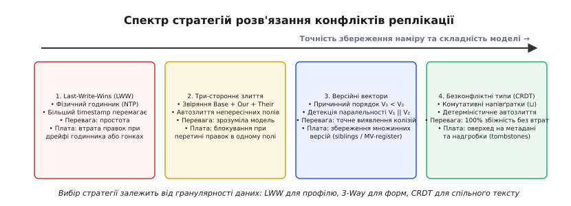
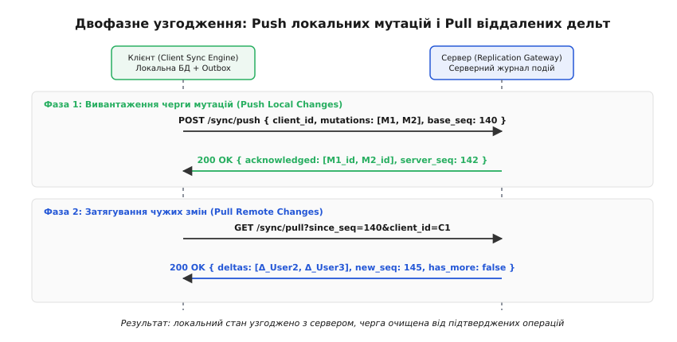

# Офлайн-перший клієнт: локальна правда й узгодження з сервером

<preknowlist>
- [Оптимістичне блокування](topic:programming/optimistic-locking) — перевірка версії запису під час фіксації для запобігання втраченим оновленням.
- [Безконфліктні типи даних (CRDT)](topic:algorithms/crdt) — алгебраїчні структури, що детерміновано збігаються до однакового стану без централізованого арбітра.
- [Повторні спроби та експоненційний відступ](topic:programming/retries-backoff) — адаптивні затримки з випадковим джитером для запобігання штормам повторів при відновленні зв'язку.
- [Ідемпотентність](topic:programming/idempotency) — властивість операції давати ідентичний результат при повторних викликах без дублювання побічних ефектів.
- [Векторні годинники](topic:algorithms/vector-clocks) — фіксація причинно-наслідкового порядку подій у розподіленій системі без спільних фізичних годинників.
</preknowlist>

Користувач заповнює звіт інспекції обладнання у підвалі промислового об'єкта або редагує нотатку у швидкісному потязі. Він натискає кнопку «Зберегти». Застосунок відправляє синхронний HTTP POST-запит, проте саме в цей момент радіосигнал зникає. З'єднання зависає за таймаутом, екран блокується модальним індикатором завантаження («спінером»), а через сорок секунд програма викидає банер «Помилка мережі: перевірте підключення» й скидає введені дані або блокує форму. Нічого не зламалося в самому коді: операційна система та процесор працюють бездоганно. Проблема полягає у фундаментальному архітектурному дефекті — побудові клієнта в парадигмі, де мережа вважається надійною та обов'язковою передумовою будь-якої корисної дії.

Традиційна онлайн-перша архітектура (англ. *online-first*) ставить інтерфейс у рабську залежність від круглого часу проходження мережевого пакету (англ. *Round-Trip Time*, RTT). Щойно клієнт потрапляє в умови нестабільного зв'язку, користувацький досвід руйнується. Офлайн-перший підхід (англ. *offline-first*) розв'язує цю кризу шляхом інверсії ролей: **локальне сховище пристрою стає головним і єдиним джерелом правди для інтерфейсу, а мережа перетворюється на фоновий асинхронний транспорт узгодження реплік**.


*Онлайн-перший підхід ставить користувача в залежність від мережевого RTT; офлайн-перший розділяє взаємодію з інтерфейсом і реплікацію на два незалежні контури.*

## Локальна правда: зміна ментальної моделі

В онлайн-першому застосунку локальна пам'ять вважається лише недовговічним тимчасовим кешем (англ. *transient cache*). Істинний стан об'єкта живе виключно у віддаленій базі даних за API-шлюзом. Через це інтерфейс не має права намалювати новий елемент списку чи підтвердити зміну прапорця, доки серверний кластер не поверне статус `200 OK`. Якщо мережі немає — застосунок переходить у стан помилки.

Офлайн-перша парадигма кардинально змінює визначення системи: **клієнтський пристрій є повноправним, автономним вузлом розподіленої бази даних**. 

У такій моделі інтерфейс користувача взагалі не знає про існування мережевого сокета чи протоколу HTTP. Усі операції читання та запису виконуються над вбудованим локальним сховищем (IndexedDB або SQLite через Origin Private File System у браузері, CoreData чи Room у мобільних операційних системах). Оскільки локальний диск відповідає за мікросекунди, інтерфейс отримує нульову затримку відгуку (англ. *zero-latency UI*). Користувач може створювати документи, редагувати таблиці та видаляти записи в літаку або глибоко під землею так само природно, як і при гігабітному оптоволоконному підключенні.

[Еволюційний шлях від локальних файлів 1980-х років і реплікації Lotus Notes до маніфесту Offline First 2013 року та сучасних Local-First рушіїв](topic:programming/offline-first-client/hist-offline-first-evolution.md) наочно демонструє: спроба трактувати браузер як німий термінал вичерпала себе, щойно обчислювальна потужність клієнтських чипів зрівнялася з серверами.

Зміна ментальної моделі тягне за собою новий закон розподілу архітектурної відповідальності:
1. **Інтерфейс (UI Layer):** взаємодіє виключно з локальною базою даних. Дії користувача негайно трансформуються в локальні мутації без виклику мережевих функцій.
2. **Локальне сховище (Local Store):** володіє канонічним станом клієнта та накопичує чергу операцій, які необхідно передати у світ.
3. **Рушій синхронізації (Sync Engine):** фоновий демон або воркер, який спостерігає за мережею, забирає накопичені локальні мутації, надсилає їх на сервер, приймає чужі зміни та вливає їх назад у локальну базу.

## Анатомія архітектури та пастка подвійного запису

Класична помилка початківців при спробі додати «офлайн-режим» у готовий застосунок — це паралельний запис: обробник кнопки одночасно пише в локальний кеш і робить `fetch('/api/save')`. 

Така схема неминуче призводить до розсинхронізації (англ. *dual-write divergence*). Якщо локальний запис пройшов успішно, а `fetch` впав — інтерфейс показує одне, сервер знає інше, а при наступному завантаженні сторінки дані зникають. Якщо ж навпаки, запит пройшов, але вкладку закрили до запису на диск — сервер отримав зміну, яку сам автор більше не побачить.

Правильна клієнтська архітектура базується на строгому патерні **Transactional Outbox на стороні клієнта**.

Коли користувач виконує дію, клієнтський шар відкриває єдину транзакцію в локальній базі даних. У межах цієї транзакції атомарно виконуються рівно дві операції:
1. Змінюється локальний стан сутності в таблиці даних (щоб UI негайно зреагував на оновлення через реактивну підписку на зміни).
2. У спеціальну системну таблицю `mutation_outbox` додається новий запис із повним описом виконаної операції.

Якщо пристрій раптово вимкнеться чи процес вб'є операційна система, локальна база гарантує цілісність завдяки журналу випереджального запису (WAL). Після перезапуску застосунок знайде в таблиці `mutation_outbox` невідправлену дію й передасть її синхронізатору.

## Вибір локального рушія: IndexedDB, SQLite OPFS та нативні сховища

Вибір сховища на клієнті визначає пропускну здатність та надійність усієї системи. Браузерне середовище традиційно пропонує **IndexedDB** — транзакційну об'єктну базу даних на B-деревах. Проте IndexedDB має суттєві підводні камені:
* **Автоматична фіксація транзакцій (Auto-commit on idle event loop):** якщо під час транзакції вставити асинхронний виклик `await`, не пов'язаний із запитом до IndexedDB, браузер автоматично закриє транзакцію, і наступна спроба запису викличе помилку `TransactionInactiveError`.
* **Високі накладні витрати на структуроване клонування:** серіалізація великих об'єктів між головним потоком та рушієм IndexedDB створює навантаження на збирач сміття (Garbage Collector).

Сучасним промисловим стандартом для веб-застосунків став **SQLite, скомпільований у WebAssembly (Wasm) з бекендом Origin Private File System (OPFS)**. 

OPFS надає синхронний дескриптор доступу до файлової системи (`FileSystemSyncAccessHandle`) у Web Worker, що дозволяє повноцінному реляційному рушію SQLite працювати у режимі WAL (Write-Ahead Logging) із продуктивністю, що в рази перевищує IndexedDB. 

На мобільних платформах (iOS та Android) аналогічну роль виконують вбудовані бази даних SQLite з обгортками Room, GRDB або CoreData.

## Черга вихідних мутацій (Mutation Outbox)

Черга мутацій — це персистентний журнал намірів користувача. Вона не може жити у звичайній оперативній пам'яті (RAM), оскільки закриття вкладки або вивантаження застосунку з пам'яті мобільною ОС призведе до тихої втрати правок.

Кожна мутація в черзі упаковується в уніфікований конверт:

```
┌────────────────────────────────────────────────────────────────────────┐
│                        Конверт мутації (Mutation)                      │
├────────────────────────────────────────────────────────────────────────┤
│ mutation_id   : UUID v4 (стабільний ключ ідемпотентності)              │
│ entity_type   : "note" / "task" / "order"                              │
│ entity_id     : "doc_9481"                                             │
│ operation     : CREATE | UPDATE | DELETE                               │
│ payload       : JSON-дельта змін ({ "status": "completed" })           │
│ base_version  : 42 (номер версії об'єкта в момент формування наміру)   │
│ created_at_ms : 1787254200000 (локальний час створення)                │
│ status        : PENDING | IN_FLIGHT | COMMITTED | FAILED               │
│ retry_count   : 3 (лічильник невдалих спроб вивантаження)              │
└────────────────────────────────────────────────────────────────────────┘
```


*Життєвий цикл мутації в черзі гарантує, що дія видаляється з диска лише після авторитетного підтвердження сервером.*

### Порядок обробки та коалесценція

Черга вимагає суворого дотримання інваріантів упорядкування:
* **FIFO в межах однієї сутності:** Якщо користувач створив нотатку, а потім двічі відредагував її заголовок, ці три мутації (`M₁`, `M₂`, `M₃`) зобов'язані відправитися на сервер суворо в хронологічному порядку створення. Порушення черговості призведе до того, що рання правка перезапише пізнішу.
* **Паралелізм між незалежними сутностями:** Мутації над різними документами можуть відправлятися паралельно окремими мережевими потоками, якщо вони не пов'язані спільними транзакційними обмеженнями.

Якщо користувач перебуває офлайн протягом кількох годин і швидко рухає повзунок налаштувань чи змінює кольори, черга може накопичити тисячі проміжних оновлень того самого поля. Тут застосовують **коалесценцію мутацій** (англ. *mutation squashing / coalescing*): кілька послідовних операцій `UPDATE` для однієї сутності зливаються в одну фінальну дельту, заощаджуючи мережевий трафік та процесорний час сервера. Проте коалесценція заборонена, якщо бізнес-домен спирається на аудит кожної дії або якщо мутації є подіями в концепції Event Sourcing.

Повний працюючий код відмовостійної черги мутацій із підтримкою збереження на диск, керування станами та обробки збоїв мовами TypeScript і C++ розібрано у практичному проєкті: [реалізація стійкої черги мутацій](topic:programming/offline-first-client/proj-mutation-queue.md).

## Оптимістичний інтерфейс та механіка відкату

Офлайн-перший клієнт за своєю природою завжди є оптимістичним: він показує користувачеві результат дії ще до того, як про неї дізнався сервер. Але оптимізм породжує проблему: що робити, коли сервер після виходу на зв'язок відхиляє мутацію через порушення бізнес-правил або нерозв'язний конфлікт прав доступу?

Існує дві архітектурні моделі збереження оптимістичного стану:

### 1. Модель шару накладення (Speculative Overlay)
Канонічний стан, підтверджений сервером, зберігається в базовій таблиці недоторканим. Поверх нього формується динамічний шар непідтверджених локальних патчів (англ. *uncommitted patch overlay*). 

Коли інтерфейс читає дані, він отримує результат накладання:

```
Стан для відображення в UI = Редусер( Канонічний стан, Черга непідтверджених мутацій )
```

Якщо сервер відхиляє мутацію `M₁`, її просто викреслюють із черги. UI автоматично перераховує проекцію, і невірний стан зникає без складних зворотних мутацій. Цей підхід є математично чистим, проте вимагає додаткових обчислень при кожному читанні.

### 2. Пряма мутація з компенсаційними діями
Клієнт відразу перезаписує локальний рядок у базі даних, виставляючи спеціальний прапорець `is_optimistic = true` (який дозволяє UI показувати напівпрозору іконку годинника біля незбереженого запису). 

У разі відхилення серверним шлюзом рушій виконує компенсаційну транзакцію — повертає старі значення полів, збережені у знімку перед мутацією.

> ⚠️ **Розділяйте системний відкат та історію дій користувача.** 
> Системний відкат відхиленої сервером мутації не має жодного відношення до стека дій користувача. Якщо технічний відкат потрапить у загальний стек «Скасувати / Повторити» ([undo-redo-command-stack](topic:programming/undo-redo-command-stack)), натискання користувачем комбінації Ctrl+Z поверне в документ дані, які сервер щойно заборонив, і повторно відправить невалідну мутацію в чергу. Стек користувацького Undo ведеться окремо від мережевої реконсиляції.

## Стратегії реплікації та детекція конфліктів

Коли кілька клієнтів редагують одні й ті самі сутності в офлайні, розбіжності неминучі. Клієнт A змінив назву проєкту на «Альфа», перебуваючи без зв'язку, а клієнт B у той самий час перейменував його на «Бета». 

Вибір методу розв'язання конфліктів визначає складність і надійність усієї системи.


*Спектр стратегій узгодження даних: що вища складність моделі, то менше ризик втрати інформації.*

### 1. Last-Write-Wins (LWW) на фізичних годинниках
Найпростіша і водночас найнебезпечніша стратегія. Кожна мутація маркується часовою міткою пристрою `timestamp`. При злитті перемагає той запис, чий час більший.

Головна вада LWW — **дрейф фізичних годинників** (англ. *clock skew*). Фізичні годинники смартфонів та ноутбуків ніколи не йдуть абсолютно синхронно. Якщо годинник клієнта A поспішає на три секунди, його правки автоматично затиратимуть пізніші правки клієнта B. 

LWW призводить до тихої втрати даних (англ. *lost updates*), тому його використання виправдане лише для простих атомарних полів, де втрата попереднього значення не є критичною (наприклад, колір теми інтерфейсу або час останнього перегляду сторінки).

### 2. Три-стороннє злиття (Three-Way Merge)
Класичний підхід, запозичений із систем контролю версій (наприклад, Git). Для злиття використовуються три знімки сутності:
* **Базовий стан (Base):** значення, яке клієнт прочитав перед початком офлайн-редагування (`base_version`).
* **Локальний стан (Ours):** поточний стан після застосування локальної черги.
* **Віддалений стан (Theirs):** поточний стан на сервері, змінений іншими клієнтами.

Якщо клієнт A змінив лише поле `title`, а клієнт B на сервері змінив лише поле `tags`, тристоронній реконсилятор бачить, що вектори змін не перетинаються, і автоматично створює об'єднаний стан із новим `title` та новими `tags`. 

Конфлікт виникає лише тоді, коли обидві сторони змінили **одне й те саме поле**. У такому разі застосунок або віддає рішення логіці домену, або запитує людину через діалогове вікно розв'язання конфліктів.

### 3. Версійні вектори та векторні годинники
Щоб точно розрізняти, чи одна правка передувала іншій причинно, чи вони сталися паралельно в ізольованих офлайн-сегментах, використовують [векторні годинники](topic:algorithms/vector-clocks).

Кожен клієнт веде вектор лічильників `V = [v₁, v₂, ..., v_N]`. Якщо для двох станів вектор `V_A` по всіх координатах менший або рівний `V_B` (`V_A ≤ V_B`), стан `B` причинно знає про `A` і просто замінює його. Якщо ж `V_A ≰ V_B` і `V_B ≰ V_A`, система математично фіксує факт паралельного конфлікту (`V_A ∥ V_B`) і зберігає обидві версії як паралельні гілки (англ. *siblings / multi-value register*) для подальшого злиття.

### 4. Безконфліктні репліковані типи даних (CRDT)
Вершиною математичної строгості в офлайн-перших архітектурах є [CRDT](topic:algorithms/crdt) (англ. *Conflict-free Replicated Data Types*). Це структури даних, чиї операції злиття утворюють об'єднавчу напівґратку (англ. *join-semilattice*).

Для таких структур операція злиття станів `⊔` має три властивості:
* **Комутативність:** `A ⊔ B = B ⊔ A` (порядок отримання пакетів не має значення);
* **Асоціативність:** `(A ⊔ B) ⊔ C = A ⊔ (B ⊔ C)` (пакети можна групувати як завгодно);
* **Ідемпотентність:** `A ⊔ A = A` (повторна доставка змін безпечна).

Завдяки цьому будь-які дві копії даних, які отримали однаковий набір змін (навіть у різному порядку та через довільні проміжки часу), гарантовано й детерміністично сходяться до ідентичного стану без жодного центрального арбітра. 

CRDT ідеально підходять для спільного редагування тексту, списків завдань, лічильників та деревоподібних JSON-документів (бібліотеки Yjs, Automerge).

Строгі математичні виведення часткового порядку векторних годинників, формули ймовірності колізій LWW, матричні годинники та аксіоми напівґраток розібрано у вставці: [математика розв'язання конфліктів](topic:programming/offline-first-client/math-conflict-resolution.md).

## Впорядкування списків і колекцій: дробове індексування (Fractional Indexing)

Звичайне впорядкування елементів списку за цілочисельними позиціями (`position = 0, 1, 2`) в офлайн-середовищі катастрофічно ламається. Якщо два користувачі офлайн вставлять новий елемент на позицію `1`, прямий запис спричинить колізію, а зсув наступних елементів згенерує шторм оновлень сотень рядків.

Для розв'язання цієї проблеми застосовують **дробове індексування** (англ. *Fractional Indexing*). Кожен елемент списку отримує позицію у вигляді дробового числа або рядка фіксованого алфавіту:
* Перший елемент має індекс `"a0"`, другий — `"z0"`.
* Вставка між ними породжує елемент з індексом `"m0"` (середина діапазону).
* Наступна вставка між `"a0"` та `"m0"` дає `"g0"`.

Такий підхід дозволяє довільно вставляти елементи між будь-якими сусідами без зміни індексів решти списку, що зводить мутацію вставки до оновлення єдиного запису в базі даних.

## Двофазний протокол реплікації: Push, Pull та контрольні точки

Синхронізація між клієнтом і сервером не повинна бути хаотичним набором випадкових запитів. Вона організовується як структурований **двофазний цикл узгодження**.


*Двофазний цикл реконсиляції гарантує повну узгодженість стану без розривів між вивантаженням і завантаженням дельт.*

### Фаза 1: Push (Вивантаження локальних мутацій)
1. Клієнт бере з черги всі мутації в статусі `PENDING`, переводить їх у `IN_FLIGHT` і відправляє на кінцеву точку `POST /sync/push`.
2. Пакет містить масив мутацій разом із `client_id`, `mutation_id` та `base_version`.
3. Серверний шлюз у межах транзакції перевіряє кожну мутацію:
   * Якщо `mutation_id` вже є в таблиці оброблених операцій ([ідемпотентність](topic:programming/idempotency)) — повертає збережений результат без повторного виконання.
   * Якщо версія сумісна — застосовує зміну, збільшує глобальний лічильник журналу змін (`server_seq`) і фіксує нову ревізію.
   * Якщо виявлено конфлікт — повертає дескриптор конфлікту або відхиляє мутацію.
4. Клієнт отримує відповідь із номерами підтверджених операцій, видаляє їх із локальної черги `mutation_outbox` і знімає прапорці оптимістичного стану з сутностей.

### Фаза 2: Pull (Затягування віддалених дельт)
1. Клієнт звертається до точки `GET /sync/pull?since_seq=140`, де `since_seq` — це збережена в локальній базі **контрольна точка** (вотермарка / курсор останньої баченої зміни сервера).
2. Сервер вичитує свій журнал подій від позиції `140` і повертає масив дельт, які згенерували інші користувачі.
3. Клієнт відкриває локальну транзакцію, застосовує чужі правки до таблиць, оновлює локальну вотермарку до нового значення (`new_seq = 145`) і сповіщає UI про оновлення.

Повну технічну специфікацію структур даних, заголовків, форматів JSON-корисного навантаження та кодів помилок наведено у довіднику: [специфікація протоколу синхронізації](topic:programming/offline-first-client/api-sync-protocol.md).

## Мережевий контур: Reconnection, Exponential Backoff та Service Workers

Наївне опитування сервера кожні дві секунди («полінг») швидко розряджає батарею мобільного пристрою й забиває радіоканал. Водночас браузерна властивість `navigator.onLine` часто бреше: вона сигналізує `true`, коли пристрій підключений до Wi-Fi роутера в готелі, який вимагає авторизації через Captive Portal і не пропускає жодного байта в інтернет.

Стійкий офлайн-клієнт реалізує багаторівневий контур відстеження мережі:

### 1. Адаптивне зондування (Health Probing)
Подія браузера `window.addEventListener('online')` використовується лише як тригер для негайної перевірки, а не як гарантія доступності API. 

Отримавши сигнал появи мережі, клієнт відправляє легковикий пінґ-запит (`HEAD /api/health` або DNS-зондування). Лише після успішного отримання відповіді статус підключення переводиться в активний.

### 2. Експоненційний відступ із випадковим джитером (Full Jitter Backoff)
Якщо сервер тимчасово недоступний (код 503 чи мережевий таймаут), черга мутацій не має права гатити повторними запитами без упину. 

Коли мільйон смартфонів виїжджають із тунелю метро й одночасно кидаються вивантажувати накопичені мутації, вони створюють ефект **шторму підключень** (англ. *thundering herd / retry storm*), здатний покласти бекенд-кластер.

Для запобігання резонансу інтервал перед повторною спробою вираховується за формулою [експоненційного відступу з повним джитером](topic:programming/retries-backoff):

```
T_ceiling = 30000 мс
T_base    = 500 мс

T_max     = min( T_ceiling, T_base · 2^(retry_count) )
T_wait    = random( 0, T_max )
```

Випадковий розкид `Uniform(0, T_max)` рівномірно розподіляє навантаження клієнтів у часі, даючи серверу можливість спокійно відновитися.

### 3. Service Workers та Cache API у веб-застосунках
У браузерному середовищі автономність починається з завантаження самого коду. Якщо користувач відкриє вкладку без інтернету, браузер за замовчуванням покаже сторінку з динозавром.

**Service Worker** виступає програмованим мережевим проксі-сервером, що працює в окремому фоновому потоці. Він перехоплює всі мережеві виклики застосунку через подію `fetch`:

```
┌─────────────────────────────────────────────────────────────┐
│                      Браузерна вкладка                      │
│                  (HTML / JS / React / Vue)                  │
└──────────────────────────────┬──────────────────────────────┘
                               │ fetch('/app.js')
                               ▼
┌─────────────────────────────────────────────────────────────┐
│                       Service Worker                        │
│                   (Мережевий перехоплювач)                  │
└──────────────┬───────────────────────────────┬──────────────┘
               │ Cache Hit                     │ Cache Miss
               ▼                               ▼
┌──────────────────────────────┐ ┌────────────────────────────┐
│          Cache API           │ │       Реальна мережа       │
│    (Офлайн-оболонка App)     │ │        (Інтернет)          │
└──────────────────────────────┘ └────────────────────────────┘
```

Service Worker реалізує стратегію **Stale-While-Revalidate** або **Cache-First** для статичних ресурсів (HTML, JS-бандли, CSS, Wasm-модулі, шрифти), дозволяючи застосунку завантажуватися миттєво з кешу навіть при повній відсутності зв'язку. 

Для фонового вивантаження даних веб-платформа надає `SyncManager` (Background Sync API): якщо користувач закрив вкладку відразу після створення документа, Service Worker прокинеться операційною системою пізніше, коли з'явиться інтернет, і самостійно дошле чергу мутацій на сервер.

## Наскрізний шлях мутації: від кліку до фіксації

Щоб побачити роботу всієї архітектури як єдиного механізму, простежимо повний шлях однієї зміни стану:

1. **Користувацька подія:** Користувач редагує рядок у формі й натискає Enter. Обробник інтерфейсу генерує об'єкт мутації `M`.
2. **Локальна транзакція:** Рівень домену відкриває транзакцію в IndexedDB / SQLite. Атомарно оновлюється таблиця сутностей (для негайного рендерингу) і рядок `M` записується в `mutation_outbox` зі статусом `PENDING`.
3. **Міжвкладочне сповіщення:** Через `BroadcastChannel` інші відкриті вкладки браузера отримують повідомлення про локальну зміну та оновлюють свої екрани без мережевих запитів.
4. **Захоплення лідерства:** Фоновий процес синхронізації за допомогою `navigator.locks` перевіряє право на вивантаження, маркує `M` як `IN_FLIGHT` і формує пакет вивантаження.
5. **Мережева доставка:** Запит летить через HTTP/2 або WebSocket на серверний шлюз реплікації.
6. **Серверна сертифікація:** Шлюз перевіряє `mutation_id` на ідемпотентність і звіряє `base_version` із версією рядка в базі даних.
7. **Підтвердження та зняття оптимізму:** Клієнт отримує статус `APPLIED` з новим номером ревізії, видаляє `M` із черги `mutation_outbox` і знімає прапорець `is_optimistic`.

## Компроміси, ціна та межі застосовності

Офлайн-перша архітектура вимагає суттєвих інженерних інвестицій і не є універсальною срібною кулею. Вона змінює профіль складності всієї системи:

1. **Квоти та очищення сховища:** Браузерні сховища IndexedDB не є вічними. За умов дефіциту дискового простору операційна система (особливо iOS Safari / WebKit) може витіснити дані незахищеного сховища без попередження користувача. Розробники зобов'язані явно запитувати персистентне зберігання через виклик `navigator.storage.persist()`.
2. **Накопичення надгробків (Tombstone Bloat):** У системах із CRDT видалення об'єкта не звільняє пам'ять негайно — воно додає запис про видалення (tombstone), щоб повідомити інші репліки. З часом база розростається, що вимагає впровадження механізмів збирання сміття на основі стабільних векторів версій.
3. **Безпека локальних даних:** Оскільки вся база реплікується на клієнтський пристрій, зловмисник із фізичним доступом до смартфона чи ноутбука може витягти сирий файл бази. Це вимагає шифрування на рівні сховища (SQLCipher, WebCrypto API) та ретельної фільтрації даних: на клієнт реплікуються лише ті рядки й документи, до яких цей конкретний користувач має законний доступ (Row-Level Security на рівні шлюзу реплікації).
4. **Межі доменної застосовності:** Офлайн-перший підхід **неможливий** там, де бізнес-інваріант вимагає суворого глобального консенсусу в реальному часі. Не можна забронювати останнє місце в літаку, виконати фінансовий взаєморозрахунок за подвійним записом чи списати залишок товару на складі в офлайні без ризику подвійного продажу. Такі операції за своєю природою залишаються централізованими, вимагаючи песимістичного блокування або координації на сервері.

> 🔧 **Навіщо це.** Офлайн-перша архітектура усуває найбільше джерело роздратування користувачів — відчуття ненадійності та гальмування програми в дорозі. Розділення інтерфейсу та мережі на два автономні контури перетворює мережеві збої з катастрофи на звичайну фонову рутину: інтерфейс реагує миттєво, дані захищені на диску від першої мілісекунди, а сервер отримує впорядкований потік ідемпотентних мутацій замість хаотичного шторму аварійних повторів.
