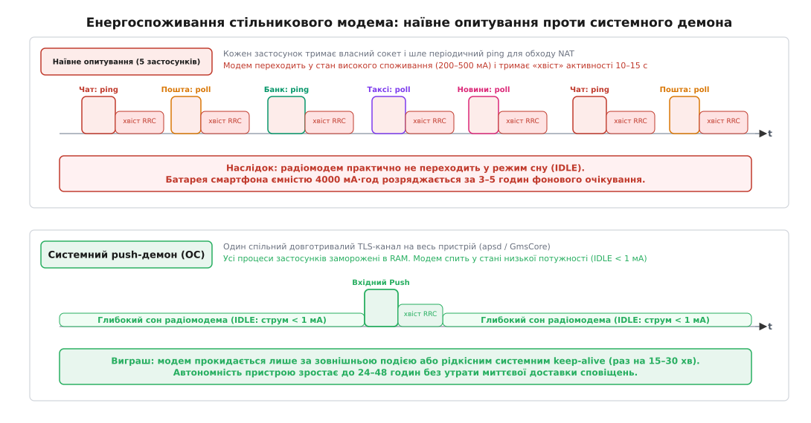
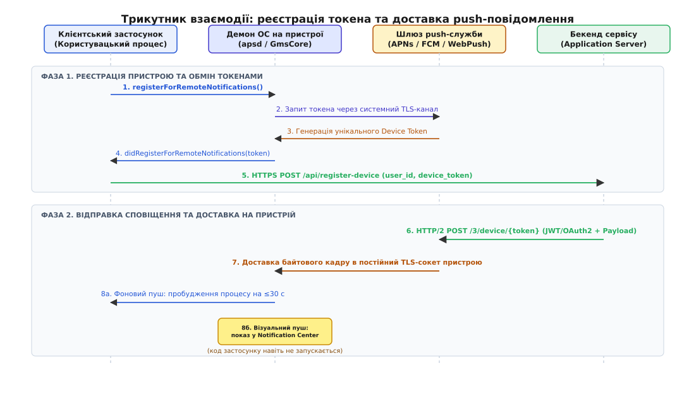
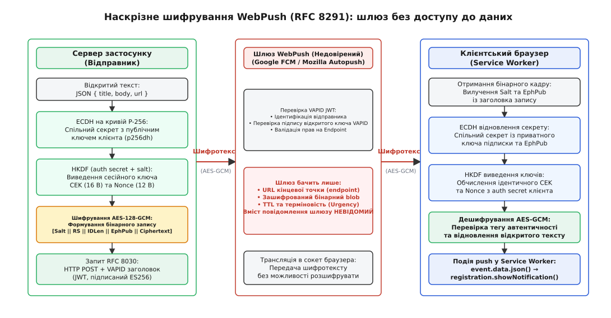

# Push-повідомлення як системний канал доставки

<preknowlist>
- [Життєвий цикл TCP-з'єднання](book:communications/tcp-connection-lifecycle) — тристороннє рукостискання, підтримка живого каналу (keep-alive) та поведінка сокета при розриві мережі.
- [Протокол захищеного каналу TLS](book:communications/tls) — шифрування трафіку, автентифікація серверів за сертифікатами X.509 та узгодження симетричних ключів.
- [Криптографія з відкритим ключем](book:communications/public-key-crypto) — асиметричні пари ключів, обмін за схемою Діффі–Геллмана та перевірка цифрових підписів.
- [Цикл подій](book:programming/event-loop) — неблокуюче мультиплексування дескрипторів та обробка асинхронних сигналів в одному потоці.
- [Розвантаження потоку інтерфейсу](book:programming/ui-thread-offloading) — чому потік інтерфейсу не може чекати на мережу чи важкі обчислення.
</preknowlist>

На сучасному смартфоні встановлено сотню застосунків: банкінги, поштові клієнти, корпоративні чати, служби таксі та системи розумного дому. Кожен із них вимагає миттєвої реакції на зовнішню подію: банк мусить повідомити про списання коштів за пів секунди, месенджер — передати вхідний дзвінок, а охоронна система — попередити про спрацювання датчика руху.

Якщо кожен із цих ста застосунків спробує розв'язати задачу самостійно — запустить власний фоновий процес, відкриє персональний TCP-сокет до свого сервера й надсилатиме щохвилинні пакети перевірки зв'язку (*keep-alive*), — пристрій вийде з ладу без жодної дії з боку користувача. Акумулятор ємністю 4000 мА·год розрядиться за три години, оперативна пам'ять вичерпається, а стільниковий радіомодем перегріється.

Розв'язання цієї суперечності вимагає повної відмови від моделі «кожен процес сам тримає зв'язок» і переходу до централізованого системного каналу доставки — **push-повідомлень**.

---

## 1. Фізика мобільного клієнта: чому наївне опитування руйнує систему

Щоб зрозуміти, чому операційні системи жорстко забороняють стороннім програмам підтримувати постійні фонові з'єднання, необхідно простежити поведінку трьох апаратних підсистем: стільникового радіомодема, оперативної пам'яті та мережевого стека операційної системи.

### Керування станами радіомодема (RRC State Machine)
Стільниковий модем мобільного пристрою (модуль 3G, LTE або 5G) не працює за принципом дротового Ethernet. Радіопередавач споживає колосальну потужність під час випромінювання високочастотного сигналу. Для збереження заряду батареї протоколи стільникового зв'язку використовують апаратний кінцевий автомат керування радіоресурсами — **RRC (Radio Resource Control)**:

```
                  ┌────────────────────────┐
                  │    Сон (RRC IDLE)      │
                  │     Струм: < 1 мА      │
                  └───────────┬────────────┘
                              │
                    Передача даних (Ping)
                              │
                              ▼
                  ┌────────────────────────┐
                  │  Активний (RRC CONNECT)│
                  │   Струм: 200–500 мА    │
                  └───────────┬────────────┘
                              │
                    Таймаут «хвоста» (10–15 с)
                              │
                              ▼
                  ┌────────────────────────┐
                  │ Очікування (RRC FACH)  │
                  │    Струм: 50–100 мА    │
                  └────────────────────────┘
```

1. **RRC IDLE (Режим сну):** Модем не займає радіочастотних слотів базової станції, приймач періодично короткочасно перевіряє пейджинговий канал оператора. Споживання струму мінімальне — менше як 1 мА.
2. **RRC CONNECTED / DCH (Активна передача):** Модем виділяє виділений частотний канал на повній потужності передавача. Споживання струму стрибає до **200–500 мА**.
3. **Хвіст активності (Tail Time):** Після передачі навіть одного байта базової станції модем не може миттєво вимкнути передавач: процедура узгодження та повторного захоплення частотного каналу займає сотні мілісекунд і генерує надлишковий службовий радіотрафік. Тому таймер стільникової вежі утримує модем в активному або напівактивному стані (*CELL_FACH*) ще протягом **10–15 секунд**.

Якщо один застосунок надсилає пінг розміром 32 байти кожні 60 секунд, модем перебуває в активному стані 15 секунд із 60 (25% часу). Але якщо в системі працює 50 незалежних застосунків із несинхронізованими таймерами, інтервали їхніх запитів перекриваються. Модем **ніколи не повертається в стан IDLE**, утримуючи підсилювач потужності передавача активним 24 години на добу.

### Дефіцит оперативної пам'яті та планувальник процесів
Смартфон має жорстко обмежений обсяг RAM, яка розділена між активним інтерфейсом, графічним композитором та кешем ядра. Операційні системи Android та iOS застосовують механізм агресивного витіснення фонових процесів:
- В iOS застосунок, переведений у фон, заморожується за 5–10 секунд: планувальник ядра Mach/XNU зупиняє виконання його потоків.
- В Android механізм **LMK (Low Memory Killer)** спирається на показник пріоритету `oom_score_adj`: процеси без активного інтерфейсу негайно завершуються ядром за сигналом `SIGKILL` при першому виникненні дефіциту вільних сторінок пам'яті.

Заморожений або примусово завершений процес фізично не здатний виконати системний виклик `poll()` або `epoll_wait()`. Його пам'ять може бути звільнена, а мережевий стек ядра не запускатиме код застосунку.

### Німі мережеві розриви та тайм-аути NAT
Мобільний пристрій постійно змінює мережеве середовище: переходить із домашнього Wi-Fi на стільникову вежу LTE, втрачає сигнал у ліфті, змінює IP-адресу при роумінгу між вишками. Більшість операторів зв'язку використовують трансляцію адрес операторського рівня — **CGNAT (Carrier-Grade NAT)**.

Таблиці трансляції CGNAT скидають неактивні TCP-сесії вже через 30–60 секунд відсутності пакетів. При цьому клієнтський сокет не отримує керуючих пакетів `RST` або `FIN`: він залишається у стані `ESTABLISHED` з точки зору ОС, але будь-який вхідний пакет від сервера мовчки відкидається маршрутизатором оператора без сповіщення сторін.

---

## 2. Архітектурна відповідь: єдиний мультиплексований демон ОС

Щоб розірвати коло між енергоспоживанням та миттєвою доставкою, системні архітектори мобільних платформ винесли функцію прийому вхідних повідомлень на рівень операційної системи.

Замість сотні відкритих сокетів на пристрої функціонує **рівно один системний демон** (*daemon, від грец. δαίμων — внутрішній дух, службовий фоновий процес*):
- В екосистемі Apple (iOS, iPadOS, macOS, watchOS) це демон **`apsd`** (*Apple Push Service daemon*);
- В екосистемі Google Android — системна служба **`GmsCore`** (Google Play Services Push Client);
- У веббраузерах — внутрішній клієнт push-служби браузера (наприклад, Mozilla Autopush Client або Chromium Push Service).



*Порівняння профілю активності радіомодема. При наївному опитуванні періодичні таймери застосунків безперервно утримують модем у стані високого споживання енергії (RRC tail time). Системний push-демон консолідує всі канали в один сокет, дозволяючи пристрою спати більшу частину часу.*

### Принцип мультиплексування та оптимізація каналу
Системний демон тримає одне вихідне TCP-з'єднання з централізованим шлюзом виробника операційної системи (Apple, Google або Mozilla), захищене протоколом TLS із взаємною автентифікацією:

1. **Мультиплексування (від лат. *multiplex* — багаторазовий, складний):** Усі повідомлення для всіх ста встановлених застосунків пакуються в єдиний потік байтів поверх одного TCP-з'єднання.
2. **Адаптивне серцебиття (Adaptive Keep-Alive):** Демон не шле пінг щохвилини. Він використовує евристичний алгоритм зондування NAT: починає з інтервалу 15 хвилин і поступово збільшує його до 28–30 хвилин. Якщо сесія розривається, демон фіксує точний таймаут конкретного мобільного оператора й підтримує мінімально необхідну частоту пульсу.
3. **Координація з процесором (Coalesced Timers):** Службові пінг-пакети прив'язуються до апаратних таймерів радіомодема, щоби надсилати серцебиття лише тоді, коли радіомодуль уже прокинувся для інших завдань.

### Низькорівневий розбір вхідного кадру демоном
Коли шлюз надсилає байтовий кадр у сокет пристрою, системний демон виконує послідовну обробку на рівні ядра та системних бібліотек:
1. **Зняття TLS-обгортки та валідація цілісності:** Демон розшифровує кадр сесійним ключем TLS і перевіряє контрольну суму або підпис операційної системи.
2. **Виділення ідентифікатора застосунку:** Заголовок кадру містить числовий або рядковий топік (наприклад, хеш `bundle_id` або `package_name`).
3. **Маршрутизація за таблицею підписок:** Демон перевіряє, чи встановлено відповідний застосунок і які дозволи надав користувач у системних налаштуваннях (сповіщення дозволені, вимкнені або переведені в режим без звуку).
4. **Міжпроцесорна сигналізація (IPC):**
   - В iOS демон `apsd` передає розібраний об'єкт демону керування інтерфейсом `UserNotificationsServer` через системний Mach-порт;
   - В Android служба `GmsCore` виконує транзакцію Binder IPC до системної служби `NotificationManagerService` або генерує цільовий інтент `BroadcastIntent` для пробудження процесу застосунку.

### Простеження роботи системного демона
Інженери можуть спостерігати за роботою системного push-демона через низькорівневі діагностичні інтерфейси операційної системи.

В macOS та iOS поведінку демона `apsd` можна простежити через системний журнал:
```
log stream --predicate 'process == "apsd"' --info --debug
```
У виводі журналу чітко видно зміну станів з'єднання, адаптацію інтервалів серцебиття під таймаути конкретної Wi-Fi/LTE мережі та передачу розібраних повідомлень у підсистему `UserNotificationsServer`.

В Android стан push-клієнта Google Play Services інспектується через утиліту `dumpsys`:
```
adb shell dumpsys activity service GmsCore
adb shell dumpsys deviceidle
```
Ці команди відображають чергу відкладених повідомлень у режимі Doze, стан поточного TLS-сокета до серверів `mtalk.google.com:5228` та лічильники пробуджень процесора (*WakeLocks*).

Історичний шлях створення цієї архітектури від корпоративних серверів BlackBerry до сучасних операційних систем детально описано у вставці [📜 Від пейджерів і BlackBerry до APNs та стандарту WebPush](book:programming/push-notifications/hist-push-mechanisms.md).

---

## 3. Трикутник взаємодії та протокольний життєвий цикл

Архітектура push-повідомлень будується на узгодженій взаємодії трьох незалежних сторін: **клієнтського застосунку**, **централізованого шлюзу push-служби** та **сервера провайдера (бекенда застосунку)**.



*Життєвий цикл push-доставки: реєстрація пристрою на системному шлюзі (Фаза 1) та відправка повідомлення з бекенда сервісу через постійний мультиплексований TLS-канал операційної системи (Фаза 2).*

### Фаза 1: Реєстрація пристрою та отримання токена
Токен реєстрації (*Device Token* / *Registration Token* / *PushSubscription*) — це криптографічний ідентифікатор, який поєднує в собі адресу пристрою, відкритий ключ застосунку та дозвіл на доставку:

1. Застосунок ініціює запит на реєстрацію через системний SDK (наприклад, `registerForRemoteNotifications()` в iOS або `getToken()` у Firebase SDK).
2. Демон операційної системи звертається до шлюзу push-служби через відкритий системний TLS-канал.
3. Шлюз генерує унікальний токен, підписує його внутрішнім ключем інфраструктури й повертає демону.
4. Демон передає токен у процес застосунку через зворотний виклик (*callback*).
5. Застосунок відправляє цей токен на власний бекенд через стандартний HTTPS API разом з ідентифікатором автентифікованого користувача (`user_id`). Бекенд зберігає пару `(user_id, device_token)` у базі даних.

### Фаза 2: Відправка сповіщення та маршрутизація
Коли на бекенді виникає подія (наприклад, користувач Б надіслав повідомлення користувачеві А):
1. Сервер застосунку дістає з бази даних токен пристрою користувача А.
2. Сервер формує авторизований запит до шлюзу push-служби (через HTTP/2 для APNs, REST v1 для FCM або RFC 8030 для WebPush). Запит містить токен пристрою, заголовок автентифікації провайдера (JWT / OAuth2 / VAPID) та JSON-навантаження.
3. Шлюз push-служби перевіряє право сервера відправляти повідомлення в цей застосунок, витягує з токена маршрутну інформацію і знаходить відкритий сокет системного демона потрібного пристрою.
4. Шлюз серіалізує навантаження в бінарний кадр і записує його в сокет пристрою.
5. Системний демон пристрою приймає кадр, верифікує підпис операційної системи та спрямовує сповіщення за призначенням.

---

## 4. Режими доставки та стратегії пробудження клієнта

Повідомлення, отримане системним демоном, не обов'язково передається в код програми. Операційні системи виділяють три принципово різні механізми обробки push-навантаження.

### 1. Візуальні сповіщення (Alert / Display Notifications)
Якщо мета повідомлення — сповістити користувача текстом, банером або звуком, **код стороннього застосунку взагалі не запускається**:
- Демон ОС читає стандартні поля корисного навантаження (`title`, `body`, `badge`, `sound`).
- Демон передає дані системному інтерфейсу (Notification Center / Шторка сповіщень).
- Система сама малює плашку, оновлює лічильник на іконці та відтворює звук.
- Процес застосунку залишається замороженим у RAM або завершеним. Програма запуститься лише тоді, коли користувач фізично натисне на банер сповіщення.

Цей підхід забезпечує абсолютну стабільність платформи: навіть якщо розробник припустився помилки й написав код, що падає при старті, користувач гарантовано побачить сповіщення.

### 2. Тихі фонові повідомлення (Silent Push / Background Data Push)
Тихий пуш призначений для передачі даних безпосередньо в код програми без виведення банера (наприклад, індексація пошти, фонова синхронізація бази даних або оновлення геоданих):
- В APNs повідомлення маркується полями `content-available: 1`, заголовком `apns-push-type: background` та пріоритетом `apns-priority: 5`.
- У FCM використовується повідомлення виключно зі словником `data` без кореневого об'єкта `notification`.

Отримавши такий пуш, операційна система розморожує процес або запускає його у фоновому режимі, виділяючи **суворий бюджет часу** (зазвичай **до 30 секунд**):

```
                                    Бюджет ОС (≤ 30 с)
                       ┌──────────────────────────────────────────┐
                       │                                          │
Вхідний фоновий Push ──► Розморозка ──► Запит API ──► Запис у БД ──► Завершення
                       │                                          │
                       └──────────────────────────────────────────┘
                                                                       │
                                                       Перевищення ліміту часу
                                                                       │
                                                                       ▼
                                                          Примусове завершення (SIGKILL)
```

Операційна система жорстко контролює частоту фонових пробуджень за допомогою підсистем енергозбереження:
- **iOS Background App Refresh:** Планувальник ядра `DuetActivityScheduler` оцінює паттерни використання програми, рівень заряду батареї та поточну температуру пристрою. Якщо застосунок зловживає фоновими пушами, система знижує пріоритет його пробудження або повністю блокує виклики до підключення зарядного пристрою.
- **Android Doze Mode та App Standby Buckets:** У режимі глибокого сну (*Deep Doze*) фонові пуші зі стандартним пріоритетом накопичуються в черзі й доставляються пачкою лише під час коротких «вікон обслуговування» (*maintenance windows*). Для негайного пробудження сервер зобов'язаний виставити пріоритет `priority: HIGH`.

### 3. Спеціальний клас: VoIP-пуші та CallKit
Окрему категорію становлять сповіщення типу **VoIP (Voice over IP)**:
- В iOS вони обслуговуються окремим каркасом **PushKit** (`apns-push-type: voip`), мають підвищений розмір навантаження (до **5120 байтів**) і доставляються з найвищим пріоритетом в обхід будь-яких лімітів сну.
- **Інваріант платформи:** Отримавши VoIP-пуш, застосунок зобов'язаний **негайно** зареєструвати вхідний дзвінок у системному інтерфейсі `CallKit` викликом `reportNewIncomingCall()`. Якщо застосунок прокидається від VoIP-пуша, але не показує екран дзвінка (наприклад, намагається використати цей канал для прихованого фонового трекінгу чи збору аналітики), операційна система повністю й назавжди відкликає право на отримання VoIP-повідомлень для цього застосунку.

### 4. Клієнтські розширення перехоплення (Notification Service Extension)
Починаючи з iOS 10, розробники отримали можливість модифікувати візуальне сповіщення до того, як воно потрапить на екран, за допомогою спеціалізованого процесу — **`UNNotificationServiceExtension`** (а у вебі — обробника `push` всередині `Service Worker`).

Це окремий мініатюрний бінарний процес, який живе ізольовано від основного застосунку. Коли надходить пуш із прапорцем `mutable-content: 1`:
1. Система запускає розширення і передає йому вхідний JSON.
2. Розширення виконує коротку дію (тривалістю **до 20–30 секунд**):
   - Розшифровує наскрізне шифрування (*End-to-End Encryption*, E2EE), використовуючи збережений у Keychain локальний ключ користувача;
   - Завантажує за посиланням важкий медіафайл (зображення або відео) і зберігає його в тимчасовий каталог;
   - Мутує текст сповіщення: замінює «Вам надійшло зашифроване повідомлення» на розшифрований текст.
3. Розширення повертає модифіковане сповіщення операційній системі, і та показує його в шторці.

Якщо розширення не вкладається у відведений ліміт часу або падає від переповнення пам'яті (ліміт пам'яті для розширень зазвичай обмежений 24–30 МБ), система автоматично показує користувачеві оригінальне, немодифіковане навантаження.

---

## 5. Порівняльний аналіз екосистем: APNs, FCM та WebPush

Кожна з трьох провідних екосистем оптимізувала інтерфейси під власну платформу, проте всі вони дотримуються спільних принципів маршрутизації.

| Характеристика | Apple Push Notification service (APNs) | Firebase Cloud Messaging (FCM HTTP v1) | W3C / IETF WebPush (RFC 8030 / 8292) |
| :--- | :--- | :--- | :--- |
| **Транспортний протокол** | HTTP/2 через TLS | HTTPS (HTTP/1.1 або HTTP/2) | HTTPS (HTTP/1.1 або HTTP/2) |
| **Автентифікація сервера** | JWT (ECDSA ES256, `.p8`) або mTLS-сертифікати | OAuth 2.0 Access Token (Google Cloud Service Account) | VAPID JWT (ECDSA ES256, RFC 8292) |
| **Ідентифікатор адресата** | `device_token` (Hex рядок, 64+ символів) | `registration_token` (рядок токена) | `endpoint` (абсолютний URL шлюзу) |
| **Розмір корисного навантаження** | **4096 байтів** (alert/background), 5120 байтів (VoIP) | **4096 байтів** (словник `data`) | **4096 байтів** (типовий ліміт бінарного кадру) |
| **Шифрування навантаження** | На рівні транспортного TLS (шлюз бачить JSON) | На рівні транспортного TLS (шлюз бачить JSON) | **Наскрізне на рівні застосунку (RFC 8291, AES-128-GCM)** |
| **Керування згортанням** | Заголовок `apns-collapse-id` | Поле `android.collapse_key` | Заголовок `Topic` |
| **Рівні пріоритету** | `apns-priority: 10` (негайно), `5` (збереження енергії) | `priority: HIGH` (пробудження), `NORMAL` (пакетно) | Заголовок `Urgency: high / normal / low / very-low` |

Повний довідник HTTP-заголовків, параметрів запитів та кодів помилок для кожної платформи наведено у вставці [📋 Специфікація протоколів і заголовків APNs, FCM та WebPush](book:programming/push-notifications/api-push-protocols.md).

---

## 6. Наскрізне шифрування WebPush (Zero-Knowledge Gateway)

Головна архітектурна відмінність відкритого стандарту WebPush від APNs та FCM полягає у ставленні до шлюзу доставки. В екосистемах Apple та Google розробник довіряє компанії-виробнику ОС, оскільки сервери APNs та Google Cloud самі є частиною захищеного контуру платформи.

У відкритому вебі кінцева точка `endpoint` може належати будь-якому поштовому чи хмарному провайдеру. Шлюз WebPush вважається **недовіреним посередником (*untrusted proxy*)**. Стандарт **RFC 8291** зобов'язує сервер застосунку зашифрувати корисне навантаження так, щоб шлюз не мав математичної можливості прочитати текст або структуру повідомлення.



*Схема наскрізного шифрування RFC 8291. Сервер застосунку шифрує навантаження спільним ключем, виведеним через ECDH та HKDF з публічного ключа браузера. Недовірений шлюз бачить лише непрозорий шифротекст, а розшифрування виконує Service Worker клієнта.*

### Криптографічний ланцюг перетворень (RFC 8291)
Клієнтський браузер під час підписки генерує пару ключів на еліптичній кривій NIST P-256 (`p256dh`) та 16 байтів випадкового секрету автентифікації (`auth`).

Сервер застосунку виконує послідовність дій:
1. Генерує одноразову ефемерну пару ключів еліптичної кривої `(server_eph_priv, server_eph_pub)`.
2. Обчислює спільний секрет Діффі–Геллмана:
   ```
   ecdh_secret = ECDH(server_eph_priv, client_p256dh)
   ```
3. За допомогою функції **HKDF-Extract** та **HKDF-Expand** (RFC 5869) з підмішуванням секрету `auth` та контекстної інформації обчислює вхідний ключ (*IKM*):
   ```
   PRK_key = HKDF-Extract(salt = client_auth, ikm = ecdh_secret)
   key_info = "WebPush: info\0" || client_p256dh || server_eph_pub
   IKM = HKDF-Expand(PRK = PRK_key, info = key_info, length = 32)
   ```
4. Генерує 16-байтну випадкову сіль `salt` і виводить сесійний ключ **CEK (Content Encryption Key, 16 байтів)** та вектор ініціалізації **Nonce (12 байтів)**.
5. Додає до відкритого тексту суфіксний маркер `0x02` і шифрує його алгоритмом **AES-128-GCM**.
6. Пакує результат у стандартизований бінарний заголовок `aes128gcm` і відправляє на `endpoint` методом HTTP POST із заголовком авторизації **VAPID (RFC 8292)**.

Шлюз push-служби бачить лише бінарний масив байтів. Розшифрувати його може виключно цільовий браузер, який володіє закритим ключем клієнтської підписки.

Повну програмну реалізацію алгоритму шифрування на C++ (OpenSSL 3.0) та TypeScript наведено у практичній вставці [⚙️ Реалізація наскрізного шифрування WebPush (RFC 8291)](book:programming/push-notifications/proj-webpush-crypto.md).

---

## 7. Архітектурні шаблони, гарантії доставки та системні пастки

Проєктування надійних клієнт-серверних систем на базі push-сповіщень вимагає розуміння фундаментальних обмежень цього каналу.

### Push як сигнальний канал: патерн «Push-to-signal, Pull-to-sync»
Найпоширеніша архітектурна помилка — використання push-повідомлень як розподіленої черги гарантованої доставки повідомлень на кшталт Apache Kafka чи RabbitMQ.

Push-шлюзи забезпечують семантику **At-Most-Once (щонайбільше один раз)** з найкращим зусиллям (*best-effort*). Шлюз може відкинути повідомлення під час перевантаження, придушити його через ліміти енергозбереження, замінити застаріле повідомлення новішим або втратити при зміні мережі.

Індустріальний стандарт побудови надійних систем базується на патерні **«Push-to-signal, Pull-to-sync»**:

```
[Подія на бекенді] ──► Push-сигнал («Є нові дані: version=42») ──► [Клієнт прокидається]
                                                                          │
                                                                 HTTP/gRPC GET /sync?since=41
                                                                          │
                                                                          ▼
[Бекенд віддає зріз] ◄───────────────────────────────────────────── [Оновлення локальної БД]
```

- Пуш передає **лише сигнал** або мінімальний ідентифікатор події (наприклад, «У чаті №5 є нове повідомлення»).
- Отримавши сигнал, застосунок звертається до бекенда через надійний ідемпотентний REST/gRPC API для викачування актуального зрізу даних.
- Якщо пуш загубився, застосунок синхронізує дані під час наступного ручного запуску користувачем.

### Життєвий цикл токена та обов'язкове очищення (410 Gone)
Токен пристрою не є постійною величиною. Він змінюється у таких випадках:
- Перевстановлення застосунку користувачем;
- Відновлення операційної системи з резервної копії на новому фізичному пристрої;
- Очищення даних браузера або скидання дозволів на сповіщення;
- Внутрішня планова ротація ключів безпеки шлюзом APNs/FCM.

Коли застосунок видаляється, шлюз фіксує недійсність токена. При наступній спробі відправки шлюз повертає HTTP-статус **`410 Gone`** (в APNs — `Unregistered`, у FCM — `UNREGISTERED`).

> ⚠️ **Критичне правило:** Бекенд **зобов'язаний негайно видалити** мертвий токен із бази даних або позначити його як неактивний. Якщо сервер продовжує відправляти тисячі повідомлень на недійсні токени, шлюзи APNs та FCM розцінюють це як спам і застосовують санкції: знижують пріоритет усього трафіку провайдера або тимчасово блокують його IP-пул (помилка `429 TooManyRequests`).

### Згортання повідомлень (Message Coalescing)
Якщо користувач вимкнув телефон на кілька годин або перебував у літаку без зв'язку, під час ввімкнення мережі шлюз спробує доставити всі накопичені за цей час повідомлення. Без належного контролю це призведе до «шторму сповіщень»: екран почне безперервно вібрувати, відображаючи 50 проміжних змін рахунку в матчі чи 100 повідомлень з одного чату.

Для запобігання цьому шлюзи надають механізм згортання:
- В APNs: заголовок **`apns-collapse-id`**;
- У FCM: параметр **`collapse_key`** (або `tag` в Android Notification);
- У WebPush: заголовок **`Topic`**.

Якщо на шлюз надходить повідомлення з тим самим ключем згортання, старе повідомлення, що ще очікує в офлайн-черзі, **перезаписується новим**. На пристрій приходить лише одне, найактуальніше сповіщення.

### Проблема «громового стада» (Thundering Herd)
Масове розсилання push-повідомлень мільйонам користувачів (наприклад, сповіщення новинного сервісу про важливу подію або старт розпродажу в інтернет-магазині) породжує явище **«громового стада»**:
1. Бекенд відправляє 5 мільйонів пушів за 10 секунд.
2. Шлюзи доставляють їх на 5 мільйонів пристроїв майже одночасно.
3. Мільйон користувачів одночасно розблоковують телефони й тиснуть на сповіщення, а ще 500 тисяч пристроїв із фоновими пушами самостійно роблять запит синхронізації `GET /api/v1/feed`.
4. Бекенд сервісу отримує 1.5 мільйона важких запитів за одну секунду й падає від перевантаження (DDoS власними клієнтами).

**Методи захисту:**
- **Джитер (Jitter / Рандомізована затримка):** Якщо фоновий пуш вимагає синхронізації з бекендом, клієнтський код генерує випадкову затримку від 0 до 60 секунд перед виконанням мережевого запиту:
  ```
  затримка = Random(0, max_jitter_ms)
  Sleep(затримка)
  FetchUpdates()
  ```
- **Ступінчаста відправка (Staggered Fan-out):** Бекенд розбиває чергу відправки на батчі й надсилає пуші рівномірно протягом 5–10 хвилин, контролюючи навантаження на власні бази даних.

### Безпека та зловживання: атака на втому від сповіщень (Push Fatigue)
Централізація каналу доставки створює специфічний вектор атак на користувача — **Push Fatigue (втома від сповіщень / спам-атака)**. Зловмисник, дізнавшись облікові дані для входу або ініціюючи двофакторну автентифікацію (MFA), бомбардує жертву сотнями запитів на авторизацію посеред ночі. Мета — змусити виснаженого користувача випадково натиснути «Схвалити» на екрані блокування, щоб припинити безперервну вібрацію.

Сучасні операційні системи інтегрують засоби захисту від push-атак:
- **Числове зіставлення (Number Matching):** Пуш не містить простих кнопок «Так/Ні» — користувач повинен ввести на телефоні двозначне число, показане на екрані входу в браузері.
- **Системні фільтри фокусування (Focus Modes та Notification Summaries):** ОС аналізує поведінку користувача, групує нетермінові сповіщення в ранковий та вечірній дайджести, а також пригнічує пуші від застосунків, які перевищують розумні пороги частоти відправки.

---

> 🔧 **Навіщо це.**
> Системний push-канал — це фундаментальний компроміс мобільної архітектури. Він вимагає від розробника повної відмови від ілюзії «постійно живого фонового сокета» на користь триланкової моделі зі стороннім брокером.
> 
> Успішна клієнтська архітектура розглядає push виключно як ненадійний, асинхронний тригер пробудження. Дотримання патерну «Push-to-signal, Pull-to-sync», своєчасна обробка відповідей `410 Gone` та використання наскрізного шифрування у відкритих мережах дозволяють будувати швидкі, автономні та безпечні застосунки, які поважають ресурси пристрою та батарею користувача.
